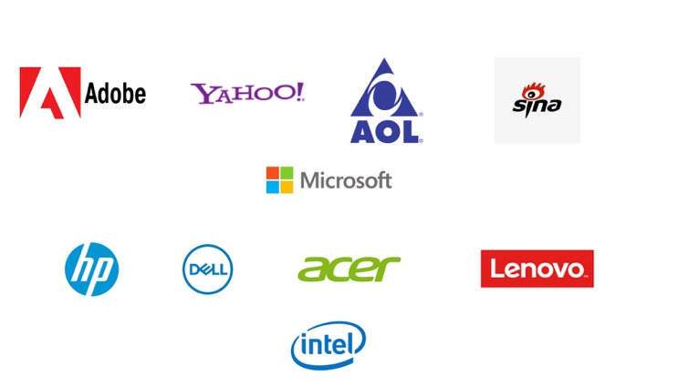
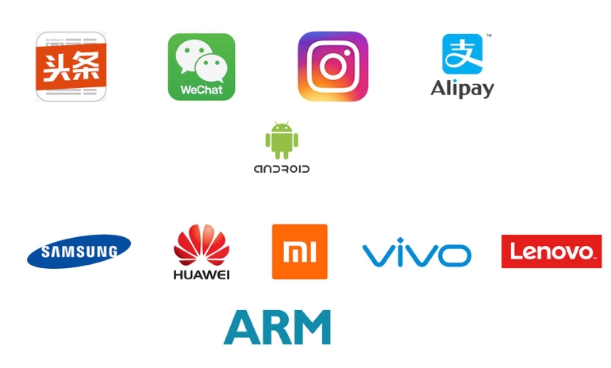
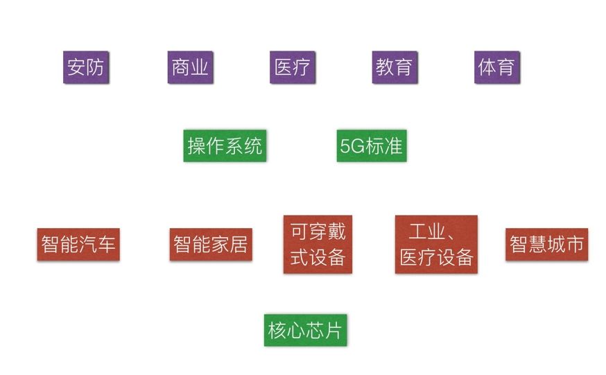
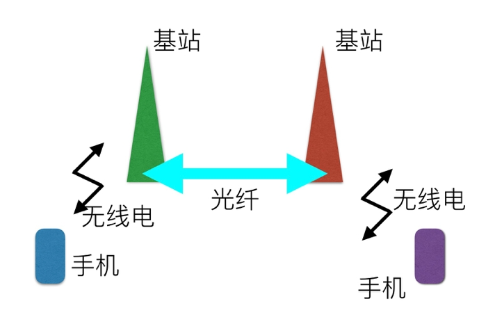

# 《5G技术》吴军

1. 一项技术能否被应用，主要取决于它能否符合用更少的能量传递、处理和存储更多信息这个商业发展的轴心趋势，如果符合，需求甚至会被制造出来
2. 第一代互联网的核心圈（围绕微软+英特尔）：

1. 第二代互联网的核心圈（围绕安卓+ARM）：

1. 第一代互联网规模：10亿。2011年是全世界PC机出货量最高的一年（3.65亿），往后一直下滑
2. 第二代互联网规模：30亿。2017年全球手机销量达到高峰（14.4亿）
3. 第三代物联网规模：500亿（估计）
4. 提高电池续航
5. 提高能量密度。潜力有限
6. 降低SOC功耗。降低供电电压可以大大降低功耗
7. 网络大融合。融合互联网和移动互联网
8. 在IoT时代，赚钱的不是硬件，而是能够提供软件、服务的公司

1. 当然，在目前R15标准中，不管有几个版本，大家至少确认了5G的三个根本性原则，就是增强型移动宽带(eMBB)，超可靠低时延(uRLLC)，海量机器类通信（mMTC）。其实，第一个是今天人们常说的高速，第二个是我们前天说到的稳定性和实时性，第三个是专门为万物互联准备的。
2. 注：第一步是所谓的非独立组网模式NSA，即采用现有4G作为核心网，4G为主，5G为辅，对应的标准则是3GPP-R15-NSA，这是设想的前期做法。第二步是独立组网模式SA，5G作为核心网，只有5G基站工作，对应的标准是3GPP-R15-SA。这部分标准2019年6月份在高通所在地圣地亚哥才正式确定
3. 目前全世界4G通信的频率大约是在1000多兆赫到2000多兆赫的范围内。在5G的方案中，有两个阵营，分别以华为和高通为代表。
4. 华为提出的5G方案是在6000兆赫，也就是Wi-Fi之上。它的好处是技术简单，能较好地利用4G资源，绕过障碍物的能力强，但是带宽窄，速度受限。华为这个阵营里唱主角的还有英特尔和诺基亚。目前华为在中国试验的5G NSA，就是基于6000兆赫频率，和4G相结合的过渡型5G。
5. 手机和手机之间的通讯链路：

1. 根据4G的标准，基站之间的距离是2～3公里
2. Google在南纬40度的太平洋上空用了300个气球试验了通信，从南美洲连到了澳大利亚。气球之间的距离大约是20公里，网速可以达到3G网络的水平
