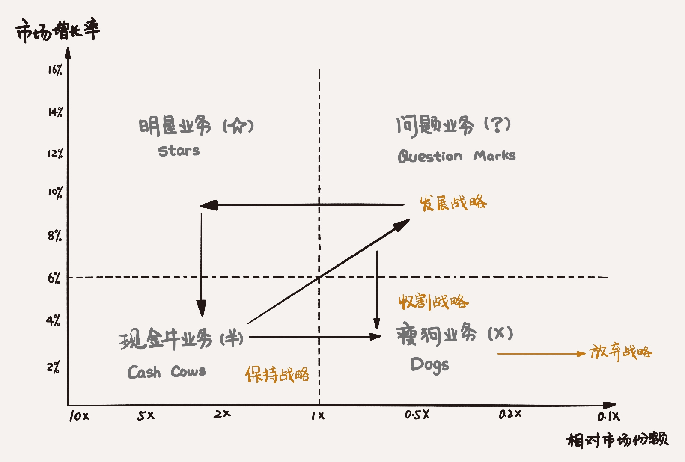
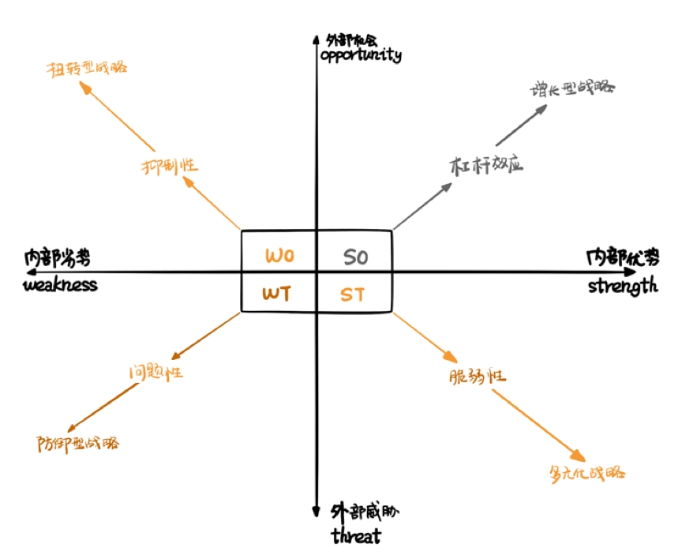

# 《5分钟商学院》 刘润

消费心理学

1. 心理账户。你要改变顾客对你商品的认知，让他从不愿意花钱的心理账户，转移到愿意为此付钱的那个心理账户里面去。比如卖巧克力不是卖的巧克力，卖的是爱情
2. 比例偏见。比例偏见是指在很多场合，本来应该考虑数值本身的变化，但是人们更加倾向于考虑比例或者倍率的变化，也就是说人们对比例的感知，比对数值本身的感知更加敏感。
3. 例如在高价值产品促销时用降价手段，在低价值产品促销时用打折手段
4. 损失规避。得到的快乐其实并没有办法缓解失去的痛苦，心理学家把这种对损失更加敏感的底层心理状态叫做损失规避。甚至有科学家研究出来，这种损失所带来的负效用是同样收益所带来的正效用的2.5倍
5. 价格锚点。消费者其实并不真的是为商品的成本付费，他是为商品的价值感而付费。价格锚点的逻辑，就是让消费者有一个可对比的价格感知
6. 比如想要推荐600元的保险产品，可以这么说：“您一年愿意花6000元的价格来保养您的汽车，为什么却不愿意花600元来保养您自己呢”？

五大基础逻辑

1. 定倍率。定倍率是商品的零售价格除以成本价的那个倍数。100块成本的东西，卖500块，定倍率就是5倍。鞋服行业：一般是5～10倍。化妆品行业：一般是20～50倍

五大基本定律

1. 边际成本。边际成本指的是每多生产或者每多卖一件产品，所带来的总成本的增加。边际成本的结构性改变，是互联网经济对传统经济最重要的一个冲击。
2. 长尾理论。互联网的出现，使得企业规模化地满足人们个性需求成为了一种可能。无论是畅销款还是冷门产品，99%的商品都有机会被进行销售，那些原本冷门的、位于需求曲线中长尾部分的产品因此可以咸鱼翻身，成为被寄予厚望的新的利润增长点。
3. 工资，从来都不应该作为一种激励手段。工资是用来支付给责任的，责任越大，工资越高。涨工资，是因为承担了更大的责任。发奖金，才应该用来奖励突出的业绩。

行为经济学

1. 我们对某一事物付出的努力不仅给事物本身带来了变化，也改变了自己对这一事物的评价，付出的劳动越多，产生的依恋越深。
2. 例如ipad激光镌刻，烘培店自己做的蛋糕
3. 消费者购买某些商品的目的，并不仅仅是为了获得直接的物质满足和享受，更大程度上是为了获得心理上的满足。这就出现了一种奇特的经济现象，即一些商品价格定得越高，就越能受到消费者的青睐。这种现象被称为：凡勃伦效应
4. 中国企业赚不到钱，不是因为淘宝。淘宝只是提高了市场自我调节的效率。中国企业赚不到钱，是因为供给侧太同质化，产能严重过剩。这也是为什么国家要把“去产能、去库存”的供给侧改革，作为重要发展战略

微观经济学

1. 供需理论是一个经济学模型，是说在竞争性市场中，供给和需求的相对稀缺性，决定了商品的价格和产量。这种供需关系通过价格和竞争自我调节的现象，就是亚当·斯密在《国富论》里所说的那个著名的：看不见的手。
2. 边际效用就是指你每多消费一件商品，它给你带来的额外的满足感。这个额外的满足感，是不断下降的。欲望被充分满足后，边际效用为零，商品就会免费。
3. 流通创造价值。一位游客来到一个小镇上的酒店准备住店，先交100块押金，服务生带他上楼看房间。这时，店主将一百还给欠对面的猪肉钱，猪肉老板还了隔壁卖衣服的钱。卖衣老板还了上个月住店的钱。这时，游客已看完房子，感觉不满意，拿了一百块押金走。转了一圈这一百块有回到游客手里。但已经还清了小镇上的债务

宏观经济学

1. 庞氏骗局，是指那些通过金字塔式扩张，用后入者的本金，伪装成先入者的收益，不断滚雪球的一种骗局，俗称“拆东墙，补西墙”。
2. 庞氏骗局背后，是有人用尽心计，构建故事，让大家对无价值的资产产生“群体想象”。而在泡沫经济中，这种“群体想象”是自发的，所以，泡沫经济，又被人称为：自发性庞氏骗局。

金融和法律

1. 商品证券化，就是把商品通过金融化包装，变成了有明确价格的权益凭证。比如月饼券

产品

1. 怎么建设品牌
2. 品类价值，也就是我和别人不一样
3. 品位价值，我比别人更显得你有档次
4. 品质价值，我的质量是最好的
5. 设立“产品经理”职位。这个职位，本质是用户在你公司内的代表。你不应该考核产品经理的销售水平，你只应该考核他有多大程度上真的代表了用户，并据此和其它部门战斗
6. 微软有个著名的三驾马车理论，产品经理、开发、测试，是三驾马车，开发代表产品，测试代表质量，产品经理代表用户，彼此制约，迭代前行
7. 创业非常大的一个忌讳，就是爱上自己的想法，而不是爱上用户的需求
8. 最小可用品，是《精益创业》里提出的一个，通过做能满足最基本功能的产品，不断接受用户反馈，快速迭代，直到做出真正符合需求的好产品的方法论。

定价

1. 渗透定价法，就是以低价进入市场，把价量之秤的砝码，尽量加到量的极致，获得极高的销售和占有率，又导致成本降低，价格接着降的定价方法。
2. 撇脂定价法指的是，当生产厂家把新产品推向市场时，利用一部分消费者的求新心理，定一个高价，像撇取牛奶中的脂肪层那样先从他们那里取得一部分高额利润，然后再把价格降下来，以适应大众的需求水平，这就是所谓的撇脂定价法。撇脂定价法，又常常被称为高价法，是一种与“渗透定价法”截然相反的定价策略
3. 价格歧视。成交价与客户心理价位的差价，称为消费者剩余。商家的目的就是要尽可能减少之间的差距，更多的吃掉这部分利润
4. 个体歧视。让每个人付出他能付出的最高价格
5. 腾讯拍卖QQ靓号
6. 销量歧视，买得越多越便宜。
7. 第二件半价
8. 荷兰式拍卖，就是先从一个最高价开始，不断往下喊价，只要有人接受，就成交。这种拍卖法的好处是，价格从高往低，一旦落入消费者心理价位区间内的最上限，他就会购买，因为万一此时保守，侥幸等待更低价，商品就可能被别人买走。

营销

1. 定位理论就是，不能成为品类第一，就创造一个新品类
2. 聪明的非洲人在登山界开创了一个品类，叫做“人类徒步可登顶的高山”。乞力马扎罗
3. 看上去饥饿营销的目的，是通过严格控制产量，让供给端始终远小于需求端，产生供不应求的假象，把消费者“饿”晕，然后抬高价格，获得暴利。但实际上，因为饥饿本身也限制了销量，所以利润未必大。所以，饥饿营销真正目的，不是为了利润，而是为了品牌附加值
4. 危机公关的本质，是大众情绪管理。
5. 互联网时代的危机公关的核心，是阻断传播。而互联网时代的传播，不是来自媒体，而是来自大众自身。所以，阻断大众心中的转播欲念，是根本。阻断这个欲念的手段，不是解释，而是获得原谅，甚至同情。

渠道

1. 全渠道营销，两种线上与线下结合的全渠道营销方式：会员店和体验店。会员店，是从线上获得客户，反哺线下；体验店是从线下获得客户，反哺线上。

互联网营销

1. 家庭，是真正的零距离。未来离消费者最近的，可能就是智能家居。

商业视野

1. “对赌基金”的背后原理：沉没成本、损失规避
2. 餐厅收入=每桌单价 x 坐满率 x 翻台率（客户吃饭的速度，可通过提高上菜速度提高）

管理的本质

组织和激励

1. 人不会因为得到“应得的”“保健因素”而满意，只会因为得不到而不满；相反，没有“激励因素”没关系，但如果有了，则会因为“太好了”，而备受激励。
2. 给责任发工资，给绩效发奖金，给潜力发股权
3. 一个上级原则。这是设计组织系统的一个铁律：一个领导，可以有很多下属，但是一个员工，只能有一个领导

知人善用

1. 你要是永远都只任用比自己水平差的人，那么我们的公司就会沦为侏儒；你要是敢于启用比自己水平高的人，我们就会成长为巨人！
2. 态度 x 能力 = 绩效。四象限法。
3. 面试官的三个心理缺陷：首因效应（避免第一印象让自己蒙蔽了双眼）、光环效应（一个优点涵盖了所有缺点）、近因效应
4. 作为管理者，你可以给全体员工写邮件，谈梦想
5. 波特定律，就是“不要总盯着下属的错误”。盯着别人的错误是天性，因为发现别人的错误，是证明自己聪明最有效的方法
6. 在企业里培养允许犯错的企业文化，把批评变为“建议+鼓励”
7. 允许犯创新带来的高数错误，不允许犯粗心带来的算术错误
8. 员工流失率：
9. 合理的员工流失率不是坏事
10. 流失率有好坏之分，20%的优秀员工离职，是坏流失率，10%的末位员工离职，是好流失率
11. 不能问“你对你的领导有什么不满意的地方吗？”，而应该问：“你如果是你的领导，你会在哪些不一样的想法？”
12. 不能问“你觉得我们是家公司吗？”，而应该问“你会把公司推荐给你的同学吗？”
13. 不能问“你觉得XX如何？”，而应该问“你觉得谁可以接替你现在的工作？”

反求诸己

1. 成为经理后，要懂得“推功揽过”。除了教练之功，所有的功劳，都要推到员工身上；除了法纪之过，所有的过错，都要揽到自己身上。成为经理后，要有“打妖怪你去，背黑锅我来”的心态，才能把“你们、他们”，变为“我们”。
2. 奥卡姆剃刀定律，就是“如无必要，勿增实体”
3. 抓大放小管细。为了提高效率和控制大局，上级只保留处理例外和非常规事件的决定权和控制权，例行和常规的权力由部下分享
4. 抓大。只管大事。例外的事
5. 放小。放小，就是授权。当下级有问题时，你可以让他自己提方案。点评方案，而不是回答问题。如果直接回答问题，你觉得你在给建议，他觉得你在下命令
6. 管细。
7. 管理幅度，就是到底一个管理者，作为存在于组织架构中的一个信息传递的节点，管理多少员工是最有效的
8. 短期利益和长期利益哪个更重要？
9. 这不是一个坏问题，但我没有一个好答案。在真正的高手眼里，这个问题是没有答案的。因为没有答案，所以才需要取舍、平衡。

面对业绩

1. 项目三角：质量、进度、成本
2. 固定第一边。这个项目，到底什么是底线？
3. 调节第二边。
4. 平衡第三边。
5. 财务报表，不是一张，而是三张：资产负债表，损益表（又叫利润表），和现金流量表。
6. 什么叫资产？公司帐上的现金、短期投资的债权、理财产品、已经交付客户应该付你的钱、库房里的存货、长期投资、拥有的办公楼、车、厂房、生产线、知识产权
7. 什么是负债？向银行借的钱、欠供应商的应付帐款、客户给你的预付款、公司发行的长期债权
8. 损益，也就是利润，等于收入减去费用
9. 特定时间段，比如全年公司账面现金的进出，多少现金的流入来自经营、投资、融资？相应又有多少现金流出
10. “流动比率”视角：流动比率就是流动资产，几倍于流动负债。普通话就是：你手上的钱，够还债吗？国际上认为，流动比率为2比较安全。你手上有2块钱，有1块钱短期要还人，比较安全。
11. “资产收益率”视角：就是用利润除以资产。意思是，你有1块钱资产，一年后赚了3毛，你的资产收益率就是30%。
12. “周转天数”视角：平均存货余额，乘以360，除以主营业务成本。有点复杂。你就理解为，你进了一批货，几天能卖出去。
13. 向上管理的目的，不是办公室政治，不是溜须拍马。向上管理的目的，是利用高超的影响力，善用老板掌握的资源，达成企业、部门和自己的目标。
14. 向上管理时一定要提出自己的建议，选择题虽然是领导来做，但是你一定要先帮他做
15. 遇到一些比较棘手和尴尬的场景（比如某人开会迟到，理应罚款，但是那是因为他生病了），可以先罚款，后慰问

管理误区和企业周期

1. “旁观者效应”，也叫“责任分散效应”，就是多人共同负责，等于没人负责，责任除以二等于零
2. 责不可共
3. 责不越级。上级的责任，是所有下级责任的总和。这也是为什么，一些重大事故后，高官必须引咎辞职。
4. 在一个等级制度中，每个员工趋向于上升到最终他所不能胜任的职位。
5. 晋升，是承担更大的责任
6. 对于一些重要岗位，可以用轮值的方式提前培养有潜力的员工
7. 墨菲定律的原理是：顺利的事儿，你记不住。
8. 从可识别的角度看，风险有三种：已知的风险，已知的未知风险，和未知的未知风险。
9. 第一阶段，创业期
10. 第二阶段，成熟期
11. 第三阶段，转型期
12. 这世上没有什么永续经营，所谓的永续经营，就是在每一个重大的转型期，都能够成功转型
13. 三个共同体：
14. 利益共同体。给你50%的收益，你愿意干吗？
15. 事业共同体。降薪50%，你愿意干吗？
16. 命运共同体。给你降50%工资，另外请你掏500万投资，如果做成，拿5000%收益，你愿意干吗？
17. KPI，是一个成熟期企业常用的管理工具，你把它用于创业期，很可能不但不能帮到企业发展，还会起到反作用。

高效能养成

1. 上帝给了每个人每天公平的三个8小时。第一个8小时大家都在工作，第二个8小时大家都在睡觉，第三个8小时，你会干什么

职业素养

1. 怎么写一封专业的邮件：
2. 正式的显示名（你的名字）
3. 标题。用不到20个字，总结这封邮件的核心内容
4. 所有的字都是一个颜色，一样大小，一种字体，并只用三种方式来排版：分段、缩进，和加粗
5. 每段的首句，是整段概括。用小段，不要用大段；用短句，不要用长句；用简单的词，不要用复杂的词
6. 你要理解每个人的时间颗粒度不同，所以有些人觉得某件事很麻烦，有点人不觉得
7. 区分观点和事实。
8. 事实不需要争辩，他是可证伪的
9. 在一套认知体系中，不违反事实，逻辑自洽，因此无法被证明对错的东西
10. 为什么争辩观点是没有结果的。因为只要你们彼此的认知体系不违反基本事实，又能逻辑自洽，也就是能自圆其说，就永远不会被对方说服
11. 遇到不同观点，学会说“有趣”。职场中的很多分歧，其实不是事实问题，而是观点问题，没必要去争对错

学习能力

1. 幸存者偏见，它是一种常见的逻辑的谬误。我们只能看到经过某种筛选而产生的结果，并没有意识到筛选的过程
2. 关于学习，有个著名的“费曼技巧”。用你的语言，把你的模型，讲给别人听。你很可能会发现，讲着讲着讲不明白了；或者你觉得讲明白了，别人就是听不懂。这些地方，就是你理解的薄弱点。
3. 乱拳论，会让你死在不必要的地方；经验论，会让小马不敢过河；因果论，会让你忽视世界的复杂性。越是在高速变化的世界，经验失效，万物归本，越是要训练系统性思维，拥有全局之眼。

逻辑思考力

谈判策略

1. 利用先入为主的定位效应，把价格谈判、或者条件谈判，直接锚定在对方的底线附近，然后拉锯，它是一种在信息不对称、利益不一致的谈判中，争取自己最大利益的方法。
2. 谈价建议：争取先开价，越极端越好，留还价余地
3. 权力有限策略：我后面还有一个“没有露面的人”，他是最终的决策者。虽然他给了我足够大的谈判权力，但如果谈判条件超出了我的权限，我还是需要向他请示。
4. 金额限制。不允许超过XX金额
5. 条件限制。不允许超过次数限制
6. 程序限制。有严格的流程限制
7. 双赢谈判的目的，不是分蛋糕，而是做大蛋糕
8. 自我控制，是一种抵御外界的感性诱惑，坚定实现理性目标的能力。公式表述，就是：长期目标 + 自我控制 > 短期诱惑
9. 增强长期目标。（看见为好）
10. 减小短期诱惑。（视而不见为好）
11. 全天下最难的两件事情：就是把钱从别人的口袋里掏出来、把想法塞到别人的脑海当中去
12. 你不需要强行让他们把钱从口袋里掏出来，而要让他们自愿掏出来。意思是推销要理解他的需求，而不是只顾自己。大家喜欢买东西，而不喜欢被卖东西

沟通演讲

1. 演讲主体不是演讲者“你”，而是听众“他”。你要深谙“他”的“听讲逻辑”，而不是“你”的“演讲逻辑”
2. 讲的东西要足够细节，以及用别人熟悉的概念做类比，把不容易理解的概念讲的通俗易懂

创新与领导力

1. 系统创新思维的三种方法：
2. 加法策略。不同产品，不同特性的组合
3. 减法策略。一款产品去除关键组成部分，形成新产品（比如没有洗衣服功能的柔顺剂）
4. 乘法策略。一款产品内某个组成部分成倍复制

战略工具

1. 市场占有率和市场增长率四象限图

1. 现金牛业务（Cash Cows）
2. 明星业务（Stars）。占有率高，增长缓慢
3. 问题业务（Question Marks）。不确定业务，占有率不高，但是增长率块
4. 瘦狗业务（Dogs）。低占有率、低增长率

- PEST模型的四个字母，P-E-S-T，分别代表“俯视宏观”的四个角度：Political（政治/法律），Economic（经济），Social（社会文化），Technological（技术）。可记忆成STEP
- SWOT分析的关键是：列好“S-W-O-T”后，把四个字母两两组合，产生四大策略。

1. 解决公地悲剧的方案之一就是土地私有化

博弈工具

1. 一报还一报的基本逻辑是：第一回合采取合作策略，然后每一回合都采取上一回合对手的策略。一报还一报是解决“重复囚徒困境”的最佳策略，也许也是我们“与这个世界重复博弈”的最佳策略

决策、管理、思考

1. 决策树，就是一种把决策节点画成树的辅助决策工具，一种寻找最优方案的画图法
2. 简化的决策树方法：影响决策的因素全部列出来，赋予权重，最后统计分值
3. 无印良品在选择开店地址的时候，也用到了决策树。他是把比如人流量，周边设施，离地铁站的距离，有无知名商户等28个因素选出来。然后每个因素有设置不同的打分，总分是100分。最后用合计分数来评价候选地段
4. 概率树在决策树的基础上，增加了对条件发生概率的预测（这种方法的难处在于正确的评估某个节点的概率），和对结果收益的评估，然后加权平均得到一个“期望值”，用这个期望值，作为依据，辅助决策
5. 预测销量，产量，计划可以分别估计最低，最高，最可能三种可能数值，最后按照2.5：2.5：5的比例权重计算最终值
6. OKR，不解决绩效考核问题
7. 谷歌的绩效考核方式是：360度环评
8. 管理销售团队，流水线车间，能用KPI，千万别用OKR。KPI是秒表，OKR是指南针
9. 实施OKR有四个关键：
10. 第一，目标要有野心，关键结果要可衡量；
11. 第二，最多5个目标，每个目标最多4个关键结果；
12. 第三，目标从公司到团队到个人层层分解；
13. 第四，所有OKR公开，透明。
14. “SMART原则”的五招刀法
15. 用Specific，具体之刀，砍掉模棱两可
16. 用Measurable，可衡量之刀，砍掉标准争议
17. 用Attainable，可实现之刀，砍掉不切实际
18. 用Relevant，相关之刀，砍掉无关目标
19. 用Time-Based，时间限制之刀，砍掉无限拖延
20. 5W2H法提高思维缜密：why，what，when，where，who，how，how many
21. 5WHY法。难点在于：如何提出正确的问题
22. “二维四象限”法，就是把自己从“非此即彼”的二分法里解放出来，用两个“对立统一”的重要属性作为依据，画出四象限图，分别讨论情况，逐个解决问题。
23. 风险管理模型，乔韩窗口理论，波士顿矩
24. 你以为的顿悟可能只是别人的基本功

沟通工具

高效率工具

1. 搜索小技巧：
2. 指定filetype（文件类型）。（2016教育行业分析 filetype:pdf）
3. site，指定网站。（大数据 空格 site:sina.com）
4. intitle 大数据。搜索只有该标题的结果

补充

1. 永远不要背稿。当你需要背的时候，恰恰说明你准备的还不充分。脱稿演讲，是在充分练习基础上，把PPT，或者手卡上的核心逻辑，写在心里面。当你手卡越来越少的时候，你离脱稿就越来越近了。
2. 从读稿，到PPT；从PPT，到手卡；从手卡，到脱稿
3. 演讲时怎么站，怎么看
4. 不要坐着讲，这会严重妨碍你的互动；
5. 也不要站在讲台后面讲，走出来；
6. 练习看听众的眼睛；
7. 不要盯着最漂亮的听众看，要雨露均沾；
8. 善用停顿，看手机的听众会抬头看发生了那什么；
9. 说话要抑扬顿挫，“倒\~\~\~底发生了什么？”这个“倒”字，三个音长，两个转折
10. 一个大的坏消息和一个小的好消息，分别发布
11. 一个大的好消息和一个小的坏消息，一起发布
12. 开会，是一个用时间换结论的商业模式。会议价值 = 结论价值 – 时间成本
13. 商业模式画布抽象为
14. 4个视角：为谁提供，提供什么，如何提供，和如何赚钱；
15. 9个模块：客户细分，价值主张，渠道通道，客户关系，收入来源，核心资源，关键业务，重要合作，和成本结构
