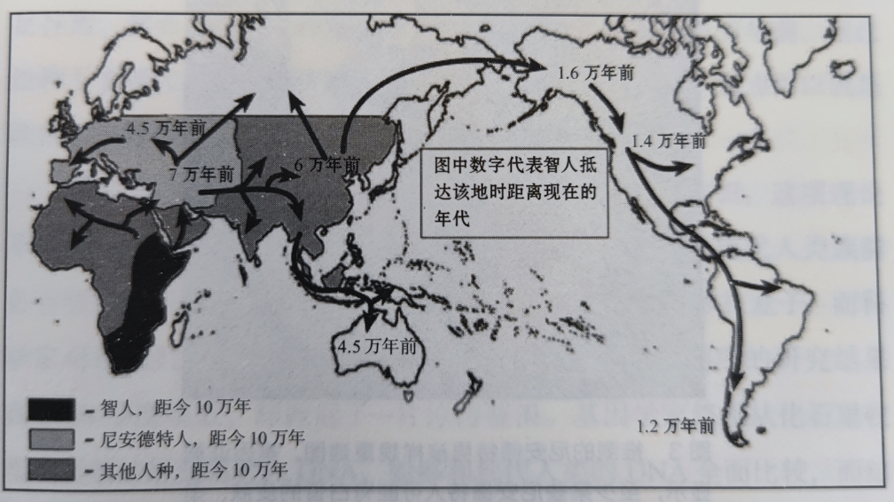
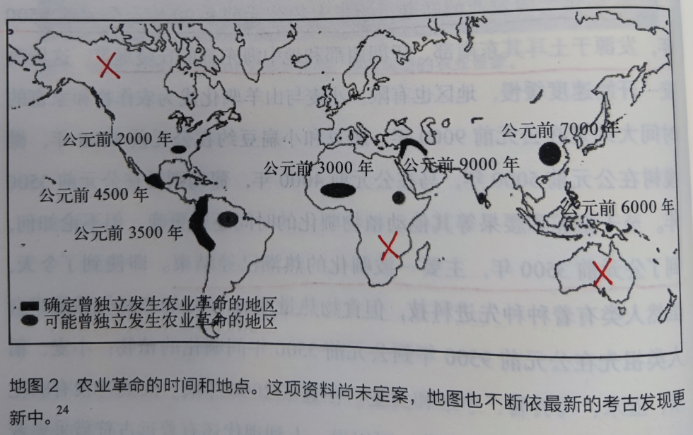
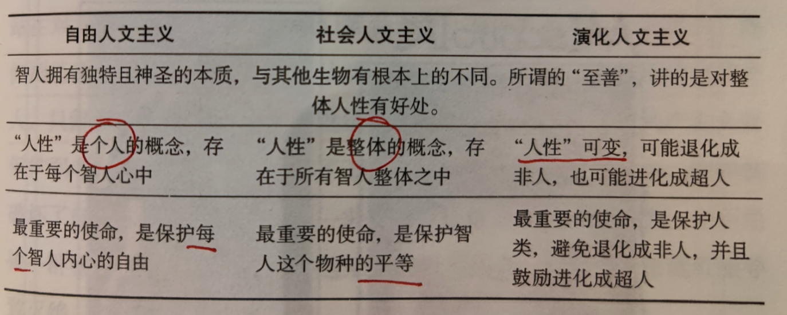
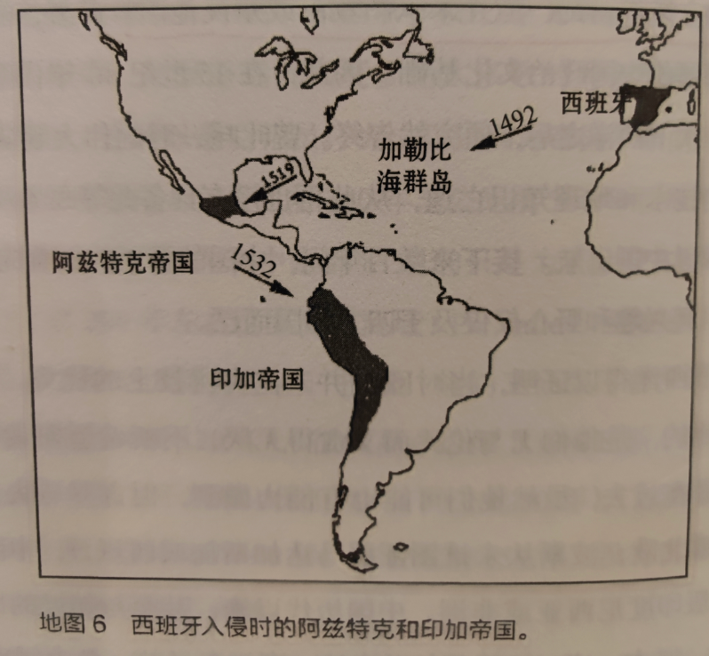

# 《人类简史 从动物到上帝》Yuval Noah Harari

人类：一种也没什么特别的动物

1. 三次重要革命：7万年前认知革命（想象不存在的东西，比如宗教，神灵）；1.2万年前农业革命（群居生活，产生帝国）；500年前科学革命（能量转换）
2. 界门纲目科属种。科的翻译为Family，意思为一个家族。比如猫科动物（狮子、猎豹、家猫）
3. 200万年前\~1万年前地球上存在多种不同人种，智人只是众多人种的其中一种，其他人种已经被智人灭绝。比如鲁道夫人、直立人、尼安德特人
4. 尼安德特人身材更魁梧，适合欧亚大陆的寒冷气候
5. 直立人在亚洲，生存了200万年，也被灭绝
6. 印度尼西亚的梭罗人很能适应热带的生活环境
7. 人脑只占身体总重的2\~3%，但在身体休息不活动时，大脑消耗了25%的能量
8. 从四肢行走到直立行走，虽然解放了双手，但是带来了背痛、颈脖酸痛的代价
9. 200万年\~40万年前：人类主要靠采集植物，挖昆虫生活，吃更大型的肉食性动物遗留下来的食物
10. 40万年\~10万年前：开始捕捉大型猎物
11. 火的使用：
12. 能杀菌，减少疾病发生概率
13. 冬天能取暖，提高生存率
14. 夜晚能看清
15. 智人征服地球的路径：非洲，欧洲，亚洲，北美洲，南美洲

知善恶树

1. 7万年前：智人消灭了尼安德特人
2. 4.5万年前：智人穿越了海洋，抵达了澳大利亚，消灭了那里的生物群。他们（居住在印度尼西亚群岛的人）发展出了第一个能够航海的人类社会
3. 智人之所以能消灭其他人种，最强大的武器就是发明了语言。语言的作用是传递信息。除了像传递客观事实这种低级信息传递，更重要的是传递某些根本不存在的事物的信息，这就是著名的认知革命
4. 认知革命最显著的特征：传说、神话、神明、宗教。理念驱动人类具有共同的目标和想象，聚集大量人力干大事。比如现代社会中的国家、企业、宗教、金钱货币、法律概念，多不是实体存在的地方，都是虚拟的概念
5. 相信某个故事
6. 促进陌生人之间的合作
7. 认知革命厉害的地方在于创造了不存在的事物，从生物层面的进化，跃迁到思想层面的虚拟概念进化，从基因演化上升到了思维演化

亚当和夏娃的一天

1. 大部分人生活在小部落里，部落不过数百人
2. 狗是第一只由智人驯化的动物，早在农业革命之前就已经发生
3. 整体而言，现今人类的认知和能力远远超过远古人类，但是就个人层面而言，远古采集者所具备的技能和能力远超现在的个人
4. 这是因为到了农业和工业时代，个人开始依赖别人才能生存下来，社会分工复杂化
5. 远古采集者普遍信奉泛灵论信仰：几乎任何一只动物、植物、自然现象都有它的意识和情感，并且能够和人类沟通

毁天灭地的人类洪水

1. 人类第一次抵达澳大利亚的意义非常重大，不亚于阿波罗登陆月球：因为这是人类第一次离开亚欧大陆生态系统，也是第一次有大陆哺乳动物进入澳大利亚板块
2. 在人类抵达澳大利亚的几千年后，澳大利亚当时24种50kg以上的动物，有23种遭到灭绝
3. 16000年前，人类从西伯利亚东北边境步行抵达了阿拉斯加，第一次进入了美洲大陆。那时的人类学会了制作雪鞋，兽皮保暖
4. 凡是人类抵达的大陆、岛屿，里面的生态系统全部遭到破坏，生物也被灭绝。近代比较有名的例子：加拉巴格群岛，在南美洲左边，那里的生态还比较原始

史上最大骗局

1. 从采集走向农业，起始于公元前9500年前，在土耳其南部，伊朗西部地区
2. 农业革命的发生地点一般在中东、中国、中美洲，而不是澳大利亚，阿拉斯加和南非，原因是那里的动植物很难驯化

1. 农业革命虽然增加了食物总量，但是带来的问题是：人口爆炸。养了一堆精英分子，而农民的饮食反而更糟糕
2. 农业革命带来的另一个严重问题：疾病。比如颈椎，膝盖，脖子等（腰椎间盘突出，关节炎）。因为要下田弯腰种水稻，不像采集社会到处奔波
3. 哥贝克力石阵每根柱子重达7吨，高5米，这些石阵推测是为了某个神秘文化的目的，需要有成熟的宗教和意识形态系统
4. 从DNA的数量来看，牛、羊、鸡等畜牧动物确实算的上是成功的物种，但是它们从出生到被宰杀的过程非常短，并且被囚禁在一个狭小空间，从某种意义上将这非常残忍，算不上一种成功的演化

盖起金字塔

1. 公元1万年前，采集者人口大概500-800万；到公元1世纪，采集者人口剩下一两百万
2. 农业革命让人能够开创出城市、帝国，并幻想出神灵、祖国、有限公司的故事。而在采集社会中，这是无法想象的事情
3. 公元前8500年：几百个村民
4. 公元前7000年：5000\~10000人
5. 公元前5000年：数万人城市
6. 公元前3100年：第一个埃及王朝，数十万人
7. 公元前2250年：阿卡德帝国，100万人子民
8. 公元前1000\~500年前：巴比伦帝国，波斯帝国，数百万人民
9. 公元前1776年，汉谟拉比法典
10. 公元1世纪：古罗马统一地中海，人口达到1亿
11. 汉谟拉比法典指出了阶级结构，将人分成三种阶级：上等人，平民，奴隶，以及男人和女人
12. 1776年的《美国独立宣言》，由北美13个英国殖民地的民众发起，脱离英国，独立合众国。宣言里声称的幸福、自由和汉谟拉比法典宣称的阶级没有什么不同，都希望有一种放之四海而皆准的不变原则，来自于智人丰富的想象力
13. 基督教认为每个人的灵魂都由上帝创造，所有灵魂在上帝面前一律平等
14. 美国独立宣言声称的“人生而平等”其实应该是“演化各有不同”。因为演化是没有方向的
15. 鸟会飞可不是因为它有什么飞的权利，而是因为它有翅膀
16. 共同相信一个故事的力量
17. 中国人相信仁义礼智信，儒家思想持续2000多年
18. 美国总统和国会议员相信人权，美国民主持续250年
19. 投资人和银行家相信资本主义，现代经济体系一直存在

记忆过载

1. 目前人类找到的最早的祖先留给我们的文字信息：“29086单位大麦37个月 库辛”（公元前3400年泥板）
2. 文字系统的两种表意程度：
3. 部分表意：只能表达特定种类信息，限定特定领域。比如数学符号，音乐符号
4. 完整表意：能够完整表达出口头语言。比如拉丁文，埃及象形文字
5. 苏美尔文字系统逐步发展出越来越多的符号，能够完整表意，称之为“楔形文字”
6. 古埃及也发展出另一种能够完整表意的文字：“古埃及象形文字”
7. 阿拉伯数字是由印度人发明的，只是由阿拉伯人攻打印度时发现的，然后改良后传到中东和欧洲

历史从无正义

1. 印度的种姓制度形成时间约为3000年前，印度-雅利安人入侵印度，征服当地居民，以种姓为依据建立了阶级森严的社会
2. 印度宗教将“洁净”和“不洁”视为两大重要概念，作为社会金字塔的根基
3. 大多数社会政治阶级制度都没有逻辑或生物学基础，只是因为几起偶然的历史事件，再用虚构的故事延续扩大
4. 性别也是一种阶级。各种规定男人应该如何，女人应该如何的法律和规范其实都是人类的想象，不是生物天生的现实

历史的方向

1. 自由和平等就是矛盾的：想要平等，你得限制那些特别突出的人，限制了别人的自由；人人想要自由，就更不会人人平等
2. 合久必分只是一时，分久必合才是不变的大趋势
3. 三种全球性的秩序，或者说全球都相信的故事：
4. 经济货币秩序
5. 政治帝国秩序
6. 全球宗教秩序

金钱的味道

1. 金钱货币是一种概念，而不一定非得指硬货币。比如石头，贝壳，香烟
2. 因为有了金钱货币，财富的转移就更加方便。比如房屋财产就不用搬走，用石头交易
3. 金钱是一种有史以来最普遍，也是最有效的互信系统
4. 金钱货币的一大进步是始终相信某种固定货币，比如银子：公元前2500年的美索不达米亚的银舍客勒制度。汉谟拉比法典里指出杀了一个女奴，要赔偿20舍客勒的银子

帝国的愿景

1. 帝国是一种政治秩序，有两种重要特征
2. 统治着许多不同民族，不同民族之间有不同的文化认同和独立领土
3. 疆域可以灵活调整，可以无限扩张
4. 阿拉伯帝国计划最成功的的地方在于即使帝国崩溃，但是帝国文化依然在维持，传播不休
5. 地球上已经没有所谓的纯净文化，都是曾经帝国的一部分。即使已经脱离了被殖民的阶段，其人民的文化依旧保留着被殖民时的状态
6. 印度被英国殖民，保留着人权思想，英语是印度的官方语言，喜欢板球运动，喜欢喝茶，都是英国人留下的；孟买火车站也叫做维多利亚车站，保留新哥德式建筑风格

宗教的法则

1. 宗教的两大基本要素
2. 认为世界上有一种超人类的秩序，这种秩序并非处于人类的想象和协议
3. 以这种超人类的秩序为基础，宗教发展出具有约束力的规范和价值观
4. 采集者社会的泛灵论认为人和动物是平等的，人和动物需要协商在共同栖息地的规则；而在进入农业社会后人成为主宰，是所有动植物的主人
5. 泛灵论（每个物种都有灵魂） ->多神论（少数灵魂）->一神论（一个灵魂）
6. 历史上第一个一神论宗教：公元前1350年：埃及法老阿肯那顿宣布安顿是宇宙的至尊
7. 公元500年左右，基督教收服了全球最大的古罗马帝国
8. 一神论矛盾：无法解释为什么世界上还有如此多的灾难
9. 基督教是一神论的上帝，相信二元论的魔鬼，崇拜多神论的圣人，相信泛灵论的鬼魂
10. 基督教、伊斯兰教都是信奉超自然现象或者神灵。而在亚非大陆出现的佛教、道教和儒教则不是，崇拜的对象是自然法则，是受到自然法则的约束
11. 释迦牟尼是在公元前500年的喜马拉雅区小国的王子，因为不忍看到身边人陷入苦难，因此流浪印度北部，寻找出路。最后悟出了：一切苦难并非来自厄运、不公，而是每个人自己心中的思想模式
12. 人遇到事情会产生情绪，情绪带来欲念，欲念带来追求，追求带来不满，不满带来痛苦，这就是痛苦的来源，即痛苦来自欲望
13. 释迦牟尼发明了冥想技巧，用于训练心灵感受事物的本质，而不受它外在杂念的干扰
14. 一旦达到涅槃状态，则会摆脱所有痛苦，能够清晰认知到事实，没有幻想。释迦牟尼本人达到了涅槃状态，之后被人称为佛陀
15. 有对神的崇拜，也有对自然法则的崇拜，也有对人的崇拜，这就衍生出了人文主义宗教：自由人文主义、社会人文主义、演化人文主义

1. 历史上出现的纳粹主义是一种极端信奉”演化“力量的人文主义：认为人种可以进化，有些人就是高级，有些人就是低级

成功的秘密

1. 事后看起来无可避免，必然发生的事，在当时看起来毫不明显。比如基督教会成为古罗马的国教在当时几乎是不可能的事情

发现自己的无知

1. 过去500年的变化
2. 人口：5亿->70亿
3. 生产总价值：2500亿美元->60万亿美元
4. 麦哲伦船队耗时3年才完成地球航行一周；现在48小时就可以飞完
5. 1674年，人类第一次真正看见了微生物，由列文虎克自制的显微镜观察一滴水
6. 现代科学与宗教最大的不同在于：承认自己的无知。观念是可以随着新信息的输入而改变
7. 早期的知识体系用故事构成理论，现代科学则更多的使用科学描述，或者数学描述
8. 科技的发展是有方向的，它的方向由帝国主义和资本主义形态决定，是他们提供了资本运作
9. 比如制造核弹、登陆月球

科学与帝国的联姻

1. 1876年，中国的第一条铁路由欧洲人所建，全长25km
2. 哥伦布在1500年左右发现的其实是美洲大陆，但是他一直以为自己发现的是东南亚海岛
3. 1507年，地图绘制大师马丁瓦尔德泽米误以为意大利水手亚美利哥韦斯普奇（Amerigo Vespucci）发现的美洲，在世界地图上给哥伦布“发现”的美洲大陆取名America

资本主义教条

1. 金钱的货币体系能够持续运行的背后最重要的支撑要素：信任
2. 为什么信用有效，因为相信未来，为什么相信未来，因为科技在发展，创新才是本
3. 资本主义教条里有一个基本假设：生产获得的利润，必须再投资于提高产量
4. 欧洲人征服世界的过程中，所需的资金由税收转变为信贷。而信贷的对象就是那些资本家，因此后来对国家的影响力逐渐从穿金戴银的贵族向穿着西装的银行家和商人倾斜。这就是历史的巨轮向资本倾斜的过程。这就是为什么路易十六被送上断头台
5. 最早受益于资本制度的其实是荷兰，这也衍生除了荷兰东印度公司，就是一种典型的股份制公司（大家都是股东，给这家公司投资）；有了资本的东印度公司就开始攻占一个个岛屿，印度尼西亚群岛首当其冲
6. 荷兰的另一家股份制公司，西印度公司，在美洲也建立了殖民地。后来在1664年被英国人抢夺，改名纽约New York；西印度公司曾在殖民地建立一道墙用来低于英国人和美国原住民，这道墙就是华尔街（Wall Street）

工业的巨轮

1. 工业革命极大拓宽了我们对能源的利用率，把热能转换为各种其他能量，比如机械能（蒸汽机），电能
2. 工业革命的本质就是能量转换

一场永远的革命

1. 工业革命带来了时刻和时间表的概念：1847年，英国统一协调所有火车的时刻表，一概以格林尼治天文台时间为准
2. 电视广播为什么会有准时播报？通过这种方法对齐各个地方的时钟
3. 另一场有史以来人类最大的社会革命：家庭和地方社群崩溃，由国家和市场取代
4. 市场提供了工作、保险、教育、贷款、警察、医疗
5. 唯独解决不了个人的情感维系需求
6. 为什么像是侵略土地的行为现在看不到了？战争成本在飙升，利润下降，现在的财富形式不再是土地，而是人力、科技知识、银行这种复杂的社会结构

从此过着幸福快乐的日子

1. 疾病会短期降低人的幸福感，并不会造成长期的不快，除非是持续的痛苦
2. 快乐的生物解释其实只是一种化学成分的外在作用。演化把快感当做奖赏，鼓励男性和女性发生性行为将自己的基因传下去；同时，更重要的是必须得确保快感能够快速退去。如果永远不退，则连觅食的动力就没了，基因就无法延续
3. 生命整体有意义、有价值，才能感到快乐，而不是某一瞬间，某个阶段的快乐
4. 佛教对快乐的解释更加深刻：快乐不是我们的主观感受，也不在于我们外在条件如何，而是我们应该不要去追求那些感受，这就是所谓的无欲无求状态

智人末日

1. 既然智人可以改变基因来选择其他物种的进化路线（比如鸡、牛、羊），我们也可以用来改变自己：
2. 生物工程。直接在生物层面改变，比如植入基因，以达到改变身高，外形的能力；或者复活猛犸象
3. 仿生工程。从无到有仿生制造生物体，比如人造手臂，仿生昆虫，助听器，人造视网膜等
4. 无机生命。没有生物特征的生命，比如计算机病毒
5. 未来科技真正厉害的地方不是宇宙飞船，而是改变智人本身
6. 生物层面上不会衰老
7. 情感层面上没有欲望
8. 智力开发上达到完全开发状态
