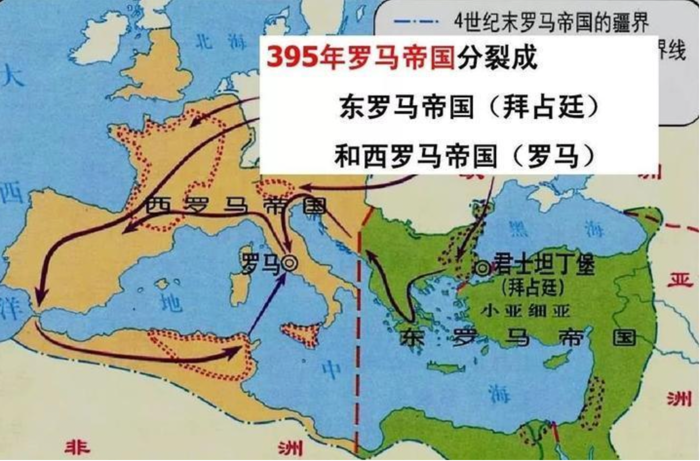

# 《人类群星闪耀时》Stefan Zwig

不朽的逃亡者

1. 巴尔沃亚于1513年9月25日成为人类历史上第一个在美洲大陆同时眺望太平洋和大西洋的人
2. 麦哲伦穿越太平洋时因为没有遇到恶劣天气，所以取名叫太平洋
3. 哥伦布在1492年先后4次往返西班牙、巴哈马群岛，并发现了南美洲

千年帝国的陷落

1. 1453年穆罕默德二世攻陷拜占庭帝国首都君士坦丁堡（现伊斯坦布尔地区）。意味着欧洲最古老的罗马帝国（东罗马帝国）彻底消亡，结束了中世纪，进入了新时代
2. 君士坦丁堡的防守城门有一个小门，叫做凯尔卡门，因为被人遗忘，所以被穆罕默德的军队发现并趁虚而入，攻占了首都

享德尔的复活

1. 1741年，亨德尔从偏瘫中奇迹般恢复，并创作经典圣歌《弥赛亚》
2. 清唱剧：不化妆、不表演、只唱歌、不分幕，独唱、合唱或者管弦乐方式

一夜天才

1. 1792年4月26日，鲁热在几小时之内完成《马赛曲》，后来被选为法国国歌

决定世界的一分钟

1. 1815年，法军格鲁希错判形势，导致拿破仑惨败滑铁卢战役
2. 格鲁希被给予的任务是追击反法军部队，在临时听到上午11点半距离3km附近拿破仑主队的炮火声时，并没有果断前去支援

年老与爱情

1. 1823年，74岁的诗人歌德写下爱情绝唱《马里恩巴德哀歌》，与19岁女子乌尔莉的关系
2. 81岁写出了《浮士德》

发现黄金国

1. 1848年，瑞士人苏特尔引发美国西部“淘金热”。地点就在加利福利亚洲的San Fransicisco，俗称旧金山

英雄的时刻

1. 1849年，俄国作家思妥耶夫斯基临行前一分钟获得沙皇特赦。此后提出了存在主义主张

跨越大洋的第一句话

1. 1858年，美国商人菲尔德成功铺设大西洋海底电缆
2. 布雷特在英吉利海峡成功铺设了连接英国和欧洲的第一条海底电缆
3. 从美国纽芬兰到爱尔兰岛（欧洲），这条电缆长59万公里，长度绕地球13圈，可以连接地球和月亮
4. 技术方案：两条船分别从纽芬兰和爱尔兰岛出发，在大西洋中相遇后对接上再回头
5. 一共失败了2次，第3次成功，但是没过多久信号就断掉了

向上帝逃亡

1. 1910年，托尔斯泰在声明最后时刻离家出走

壮志未酬

1. 1909年4月6日，皮尔里成功到达北极点（实际上距离真正的北极点还有97km）
2. 1911年12月14日，阿蒙森率先到达南极点
3. 1912年1月16日，斯科特第二支到达南极点的队伍（共5人），最后3位人员在1912年3月29日返回途中不幸遇难
4. 方法：从冰川边缘出发，途中需要建立诸多驻扎点，以便于返程时能临时居住

封闭的列车

1. 1917年，列宁从流亡地瑞士重返俄国，乘坐的封闭列车

演讲台上的头颅

威尔逊的失败

1. 第一次世界大战：1914年7月28日-1918年11月11日。同盟国（得过、奥匈帝国、奥斯曼帝国）和协约国（英、法、美、俄），最终协约国胜利
2. 第一次世界大战中的国家都是通过秘密协议来保证自己的利益，1917年俄国十月革命宣布废除秘密外交，不割地，不赔款的和平纲领，引起了欧美国家的强烈反响
3. 巴黎和会是由战胜国参加的会议，除美国以外，其他国家均在讨论怎么让战败国赔偿，领土问题，而威尔逊认为应该看向远方，先制定国际联盟条约，再讨论细节的和约问题
