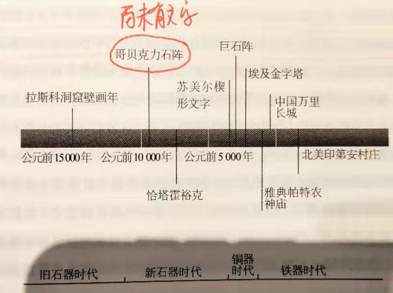
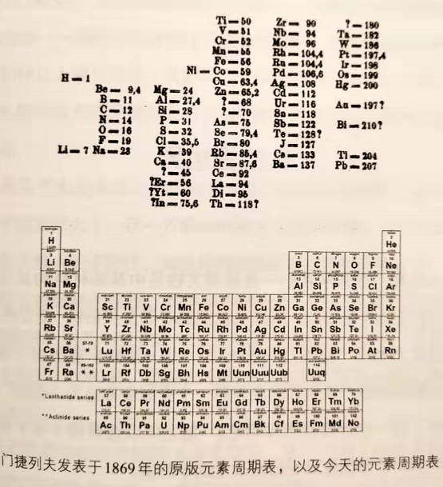

# 《思维简史 从丛林到宇宙》Leonard Mlodinow

从人类起源、文字起源、数学与科学起源、牛顿运动力学、物质化学、生物进化、量子力学分别讲述了人类如何从丛林走向了宇宙

推荐序

希腊是人类科学的发源地，原因在于泰勒斯认为“世界应该是数学的，而不是什么神学的”

1. 计算机可以帮助我们解决问题，并不能取代我们提出问题
2. 今天的人们可以很轻松的来一句“我们要相信科学，不信宗教”，殊不知当时的科学家经过了多少内心挣扎才把这个世界观留给我们
3. 最容易理解革命的时候就是革命成功以后
4. 科学是一个反常识的、永远在革命的、不以实用为目的的东西，是纯粹精神上的追求，是人类想要知道这个世界的底层逻辑，是想破解世界的源代码
5. 为什么古代中国没有科学？答案是只有古代希腊有科学，希腊之外，其他地方都没有科学
6. 为什么希腊会有科学？泰勒斯将在埃及学到的数学知识和自己的哲学结合起来，认为“世界应该是数学的”，而不是什么神的。这是人类产生科学的第一步

我们求知的动力

1. 求知欲是人类所有欲望中最重要的一种欲望
2. 人类速度：骆驼队->马车->蒸汽机车->飞机->宇宙飞船
3. 10英里/h->100英里/h：200万年
4. 100英里/h->1000英里/h：50年
5. 人类信息传递：信鸽->电报->电话->手机

好奇心

300-400万年前出现第一种类似人类生物，此后人类学会使用具有锋利边缘的石头碎片作为工具，这是一个改变生命的发明

1. 中古兽大家族里的一支进化成了现代猩猩和猴子的祖先，接着进一步分化，进化为我们现存的近亲，黑猩猩，到最后进化为现在的我们
2. 300\~400万年前，第一种类似人类的生物出现在地球上。南方古猿，或称为能人
3. 在同一物种中，大脑的结构比大脑的体积更为重要
4. 一种可以拿来切割和剁碎食物的巨大的“人造牙齿”（具有锋利边缘的石头碎片）是一个改变生命的发明，彻底的改变了人类的生活方式。学会使用工具是能人和现存灵长类近亲哺乳动物的本质区别
5. 180万年前，非洲出现直立人
6. 直立人能够使用工具，且学会摩擦生热加热事物，严寒取暖，大大提高了生存能力
7. 50万年前，出现智人
8. 20万年前，出现现代人类分支
9. 同大脑相比，肌肉每单位的能量消耗只有大脑的1/10，大脑只占身体重量的2%，却要消耗身体摄入能量的20%
10. 在学科和工业领域，提出正确问题是一个人能拥有的最重要的天赋

文化

人类为了理解自身为什么存在，在尚未有文字出现之前，建造了哥贝克力石阵，现在认为那是一种祭神场所，类似宗教的起源

1. 游牧民族：在某一地做短暂停留，直到这一地区能够轻松获取的食物资源耗尽才离开
2. 哥贝克力石阵建于11500年前，为游牧民族建造。由于当时还没有文字，所以没有遗留的圣典，现在认为那里是一个祭神场所
3. 除了人类之外再也没有在其他任何动物上观察到过一种行为：理解自身存在的行为

1. 村庄和城市的本质区别：生产和分配方式。村庄只是一群人居住在一起而已，而在城市，则是有明确的供需、生产关系的分配
2. 宗教的产生是出于人类对自然的理解，所以，在一定程度上来讲，宗教是科学的前身
3. 使人类有区别于其他动物的地方在于：人类是唯一一种能够利用过去的知识和创新去创造的生物

文明

语言->文字（芦苇笔的楔形文字）->数字符号->《汉谟拉比法典》：人类历史上第一部统一自然和神学理论法律，规定了商业、货币、军事、婚姻、医药和道德

1. 第一批城市出现在公元前4000年左右的近东地区（地中海附近）。人们依照获得食物的方式，人被划分成了渔夫、农夫、牧人和猎人
2. 那时候城市里的人还普遍认为是神掌管着他们的存在（宗教雏形？）
3. 人类物种的重要特征是语言，而人类文明的重要特征是书写（或文字）
4. 语言是自然出现的，不需要被发明，但文字需要被发明。直到现在，还有些原始部落没有文字
5. 人类使用过超过3000种语言，这些语言中只有100多种被写下来
6. 最早出现的文字形式出现在公元前3000年的美索不达米亚南部的苏美尔
7. 早期抄写员使用顶部很尖的工具在泥板上刻写象形文字，后来人们使用芦苇笔把图案压进黏土里，留下楔形记号，称为楔形文字
8. 公元1200年，人类历史上第一个字母表——腓尼基文字
9. 公元前500年，出现了符号创新，即通过引入数字、符号来表达复杂的文字描述。引入数字0概念
10. 在以前，埃及人制造金字塔使用的数学知识都是实用知识，解决实际问题的，而不是为了满足人们想要更深入的理解世界本质的渴望
11. 公元前18世纪，古巴比伦帝国诞生了人类历史上第一部统一自然和神学理论的法律，包含了民法和刑法，称为《汉谟拉比法典》。雕刻在2.44m高的黑色玄武岩上，目前在卢浮宫展出。他的意义在于人类开始利用一套完整的秩序、理性框架之下中运转社会，包括商业、货币、军事、婚姻、医药和道德等

推理

希腊人认为宇宙形成之前一直是混乱状态，神掌管着一切。而同身为希腊人的泰勒斯则认为自然不是神话故事里的东西，而是依照某种科学定律在运转。毕达哥拉斯指出这种法则就是数学法则

1. 亚历山大大帝征服美索不达米亚以后，把希腊的思想传遍了整个近东地区
2. 希腊神话起源于他们对混乱的理解。认为宇宙形成之前一切处于混沌状态，认为神掌管着一切。当他们来说，有序的物理定律非常怪异，就如同现在的我们看待他们用神掌管世界的观点一样
3. 米丽都城涌现了一群思想家（比如哥白尼、伽利略等），这里是一个学术中心，位于爱琴海、地中海和雅典附近
4. 泰勒斯是第一个求证几何真理的人，他认为自然并不是神话故事里的东西，而是依照着某种科学定律在运转，而这些定律可以用来解释和预测自然现象
5. 数学语言帮助科学更深入的发掘理论意义，比普通语言更具准确性，因为它具有一种内在推理和逻辑准则
6. 诗人使用语言描绘他们观察到的事物，而物理学家使用数学
7. 毕达哥拉斯的真正贡献在于推广了宇宙是按照数字关系构建的这个概念，而不是仅仅只是发现了自然世界的数字联系
8. 总结来说：泰勒斯说自然世界遵循某种秩序法则，毕达哥拉斯更进一步，断言自然世界遵循数学法则
9. 亚里士多德的物理学——理解世界时主要依靠直觉，而非数学（即定性研究而非定量研究）。认为自然变化的原因在于物体本身，即固有性质或构成。当有变化时，是因为外力导致，定义了“作用力”这个术语
10. 什么是常识？客观世界的体验经验固化在人脑中的对这个世界的理解【我们一般说这个人有common sense，是否可以理解为这个人对这个客观世界的认知比其他人更准确，更能接近事物本质，更加理解客观事实】
11. 在古希腊，人们以事物的目的来分析物质世界，认为物质世界发生的一切都有某种“目的”

新的推理方式

亚里士多德的物理学是建立在定性基础上，并未使用数学进行量化，认为物质世界发生的一切都有某种目的（比如自由落地是物体自身的性质体现）。墨顿则首次提出量化的运动定律：即S=1/2at2（当时并未有数学符号，是通过文字描述）。伽利略则认为亚里士多德缺少了实验这个动作来进行量化

1. 发现了定律概念，认为摒弃了亚里士多德的认为“万物运行都有目的”的想法，而认为运动定律是一种适用于所有物质的根本定律，与目的无关
2. 墨顿法则是第一条量化的运动定律，描述的其实是路程、加速度和事件的关系，即S=1/2at2。当时当时并没有数学语言，因此这条法则是用一段语言描述出来的
3. 亚里士多德认为，科学是由观察和推论构成，而在伽利略看来，他认为缺少了实验的这个动作。他的实验是量化的，这在当时是一个革命性概念（因为当时还没有钟表，所以用水钟来计时）
4. 伽利略提出的惯性定律否定了亚里士多德的持续作用力的想法，解释了抛射物持续运动现象

力学宇宙

牛顿发现了自由落体和轨道运动其实是一种运动，并且解释了宏观物体遵循的运动定律

1. 牛顿运动定律在现在看来如此简单，但是在当时却耗费了当时顶级科学家许多年才完成的定律
2. 当时人们还不知道s-t图上的曲线斜率代表瞬时速度，牛顿提出了将时间缩小到无穷小，并由此得到了瞬时速度的概念，即曲线斜率，这就是微分来源
3. 牛顿认为玻璃不会产生颜色，只是因为不同角度弯折光线会得到不同颜色，相反，白光不是纯净的，他是一种混合光
4. 牛顿最伟大的成就之一就是他证明了自由落体和轨道运动（径向运动和切向运动的结合）都是同一种作用力和运动定律的实例
5. 在牛顿提出第二定律之后的100年，第二定律才以数学形式F=ma出现
6. 牛顿定律仅仅适用于在一个绝对意义上都没有空气阻力和摩擦力的理想世界。这说明，他的天才之处体现在能够从纷繁复杂的环境中，拨开这些表象去揭示最基本的简明定律，即透过现象看本质

物质的构成

物理学的诞生依靠数学语言的发明，化学的诞生依靠“可以精确测量物质质量的仪器”。化学的前身是炼金术；玻意耳提出燃素概念；拉瓦锡发现质量守恒定律，指出没有燃素，而是元素的组合与再组合过程；门捷列夫发现元素周期表，周期表在化学中的地位相当于牛顿定律在经典物理学的地位

早期的化学家会经常品尝物质，通过味道来识别这些物质

1. 物理学的诞生依靠的是数学语言的发明，化学的诞生也不得不依靠某种技术的发明——可以准确测量物质重量的仪器
2. 化学的前身是炼金术
3. 玻意耳发现如果把装有燃烧物体的密封容器内的空气都吸走，火会熄灭，所以他推论说空气中存在着燃烧和呼吸过程必需的某种物质，比如燃素
4. 拉瓦锡发现了质量守恒定律（再次验证了化学需要准确测量的必要条件），即化学不是凭空产生物质，而是元素的组合和再组合的过程
5. 拉瓦锡并没有发明化学方程式。出版了《化学纲要》，澄清了元素是一种不可分解的物质；否定四元素理论和燃素的存在，提出质量守恒定律
6. 道尔顿创造了第一种化学定量语言：按照分子间交换原子的理论
7. 门捷列夫发现的元素周期表在化学中的地位和作用，相当于牛顿定律在经典物理中的地位。即可以通过周期表去推测新的元素，有预测的作用

生命世界

达尔文的进化论核心：随机变化+自然选择一起创造具备新特征的个体

1. 一粒细胞最重要的产品就是自己的一个复制品
2. 胡克与列文虎克均使用显微镜观察生物，而后者的放大效果是前者的10倍，因此前者只观察到了微小昆虫身体部位的细节特征，而后者则观察到了微生物
3. 达尔文发现了物种进化背后的机制——自然选择。把生物学从对上帝的依赖中释放出来，成为一种真正的科学
4. 自然选择会加强物种的某些特征，不会创造物种。创造新的物种只能依靠基因突变
5. 达尔文理论核心：随机变化和自然选择一起创造具备新特征的个体，只要特征是有利的，繁殖概率就会增加
6. 达尔文的进化论来源于一个经济学家的“劳动分工”概念。认为在一片给定土地上，如果每一个居民都高度擅长开发不同的资源资源，那么这片土地就可以培养更多的生命

人类体验的极限

经典物理学的观察大多数用肉眼即可，想要继续突破科学的边界，我们必须要超出我们的感官体验，即通过仪器的方式来观察。麦克斯韦统一了电场和磁场；普朗克解提出能量离散概念来解释牛顿运动定律无法解释的黑体问题；爱因斯坦提出了三条诺贝尔级的理论：相对论、布朗运动、光电效应

1. 经典物理学（牛顿运动定律）无法解释黑体辐射现象
2. 科学如果想要进步，我们的关注点就必须超出我们直接的感官体验（牛顿时期通过观察，现代科学则需要借由仪器来观察）
3. 发明和发现是不同的。前者是创造之前不存在的东西，后者是了解之前无人知晓的东西
4. 最成功的研究人员通常是那些提出古怪问题的人，这些问题没有人想过，但有可能就是我们理解世界的新方式
5. 麦克斯韦在19世纪60年代完成了物理学历史上最伟大的统一：解释了电力和磁力是同一种现象（电磁场），并揭示了光和其他形式的辐射其实是电磁波
6. 普朗克使用玻尔兹曼的方法解决黑体问题，但是必须得假设能量是离散的，即一个光子的能量等于频率和一个比例系数的乘积，定义为普朗克常数h
7. 1905年，爱因斯坦提出了三条理论，每一条都可以获得一个诺贝尔奖：相对论（观察者效应，即测量不是绝对的）、布朗运动、光电效应
8. 既然测量值取决于观察者状态，那么为什么光速却是恒定的？这可能是因为光在传播过程中穿过的尚未被检测到的介质有关
9. 光电效应：每个撞击金属的光子将它的能量转移给了电子，把电子“撞击”了出去，形成了电流

看不见的王国

汤姆孙发现了电子，获得了诺贝尔奖；而卢瑟福则好奇电荷在原子内是如何分布的，所以才有了著名的阿尔法轰击金箔实验；玻尔将能量是一份一份的概念应用到了卢瑟福原子模型，提出电子轨道能级跃迁，解释X射线，但是并未解释电子是如何完成跳变跃迁的动作（非变轨）

1. 汤姆孙发现了电子，获得了诺贝尔奖，而卢瑟福则好奇电荷在原子内是如何分布的，所以才有了著名的阿尔法轰击金箔实验
2. 尽管我们课本上看到的是简化后的卢瑟福原子模型，但是这个发现的过程是极其复杂的。即原子核中的正电荷几种在它的中心，而不是分散开的
3. 行星运动和电子绕电子核运动都是圆周运动，但是前者释放的能量是引力能量，后者则是电磁能量（如能级跃迁释放X射线）
4. 玻尔将能量是一份一份的量子概念应用到了卢瑟福的原子模型，形成波尔原子模型，提出了电子轨道能级跃迁概念，解释了X射线原理
5. 既然量子认为能量是一份一份，而如果能量如果和电子轨道半径有关，则电子轨道半径也应该是离散的
6. 玻尔的量子概念应用的很成功，但是并没有解释电子是如何“跃迁”（跳变）变轨的
7. 玻尔理论证明了原子序数是建立元素周期表的正确参数，因为正是质子和电子决定了一种元素的化学性质，而不是中子（原子重量）

量子革命

海森堡重新定义可观测量，用矩阵来表达原子坐标、速度；薛定谔用另一种完全不同的方式解释量子力学，结论与海森堡一致。牛顿式“决定论”科学中认为世界是因果的，也符合我们的认知，但是量子力学中并不存在这种因果关系，而是另一种可能性

1. 海森堡重新定义了可观察量，认为在量子力学中，不能再用我们熟悉的空间坐标来表征原子，而是应该用一系列复杂的数学矩阵（频率、振幅、强度等）来表达
2. 薛定谔采用另一种完全不同的方式来解释量子力学，得到的结论与海森堡一致
3. 海森堡认为：自然会禁止观测精确的电子路径，因为你越观测，另一个物理量就越不准（参考电子双缝干涉实现）
4. 在牛顿式“决定论”科学中，世界是一种完全因果关系，可以做到预测，而在量子力学中，并不存在这种必然性，只存在可能性。但是爱因斯坦不同意这种看法，认为“上帝不掷骰子”

后记

1. 如何提出正确的问题是科研中非常重要的能力，他决定了我们是否找对了解决问题的方向。比如一个人从A到B和从B到A用了相同的时间，那么有没有可能这个人在一天中的同一时间在同一地点相遇？如果把问题改为：两个人同时从A，B出发，他们会不会在同一地点，同一时间相遇？
2. 无论生活在哪个年代，人类都倾向于认为自己处于知识的巅峰，然而历史一次次的证明这是错误的，人类的知识也是不断在革命和更新
