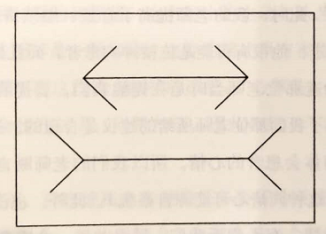
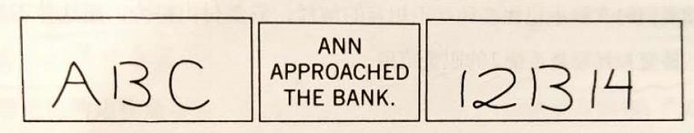
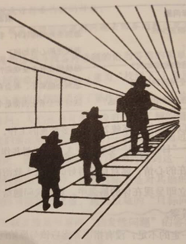
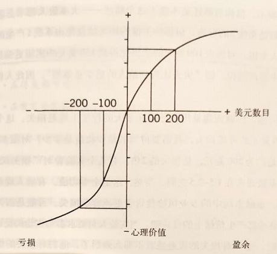
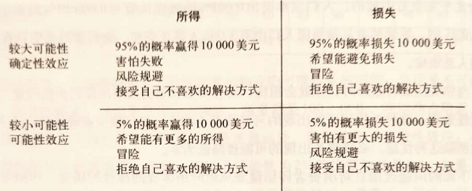

# 《思考，快与慢》 Daniel Kahneman

启动效应：人容易受到先前事物的影响，从而影响当前的判断。（如问苹果水果和苹果手机的例子）

锚定效应：人们在对事物进行估值前，会事先进行考量，这种先入为主的信息会对我们的后续决策做出暗示的现象。 举个例子：比如超市中的打折或限购会对我们的购买行为造成影响，限购对销量有刺激作用。

曝光效应：个体接触一个刺激越频繁，个体对该刺激就越喜欢。因而只要不断重复接触就能增加喜欢的程度。重复能引发放松感和熟悉感

因果关系：习惯将持续发生的事件联想为因果关系，将前一件事解释为后一件事发生的原因

确认偏误：先有猜想或观点，然后人们就会寻找证据支持自己的偏好或猜想

框架效应：同一信息的不同表达方式会激发人们不同的情感，从而影响判断。 举个例子 ：手术后存活率为90%与手术后死亡率为10%，前者让人更安心。

回归均值现象：某项指标的表现过高或者过低后会自然回归到平均水平。例如：无论是赞扬还是批评，员工会最终回到平均值，只是在某个时间段内表现比较明显

前景理论：不同于期望值理论，带入了人的心理因素，在面对特定问题时，心里有一个附加参考值，会对选择结果有影响

效用层叠：小概率事件、公共事件因媒体报道，放大某些极端可能，强调其可能性，导致人们越关注，越紧张。 举个例子：以色列遭遇恐怖袭击死亡的人数远不及交通事故死亡的人多，但媒体报道的恐怖事件却很容易占领人们的心智并造成恐慌

典型性偏好：人们习惯从事物中发觉和选取典型性样本，而忽略背后的概率。 举个例子：在未经调查下，我们会认为女司机在开车这件事情上比男司机更猛

峰终定律：峰值与结束时刻的感受会是决定人们对该事件感受的关键时刻

禀赋效应：当个人一旦拥有某个物品，那么他对该物品的价值评价要比未拥有之前大大提高

序言

1. 大多数印象和想法都是都是从意识经验中得来的，而人们是感知不到这一过程的
2. 我们经常在自己出现失误的时候还自信满满，旁观者比我们自己更容易发现这些错误
3. 我们在做出判断时往往忽略统计数据，而依赖于以往经验，近期发生的事来启发得到结论，导致有成见或系统性失误，这种现象称为可得性法则
4. 例如：我们仅凭对某人腼腆的描述就认定此人适合当图书管理员而忽略了成为农民的概率更大的事实
5. 例如：字母K出现在首字母还是出现在第三位频率高？
6. 在面对难题时，我们往往已经用一些简单的问题进行了替换回答，但自己有时候并未意识到这个过程
7. 系统1的直觉作用比我们想象的还要大，他是做出决策和判断的幕后主使

系统1，系统2

1. 系统1的特点：
2. 生成印象、感觉和倾向
3. 自主且快速
4. 区分常态中令人惊奇之事
5. 用简单的问题替代难题（启发法）
6. 对损失的反应比获得更强烈（损失厌恶）
7. 对数量不敏感
8. 对可能性做出过高的估计
9. 系统1：无意识且快速的，不怎么费脑力 ，没有感觉，完全处于自主控制状态
10. 系统2：将注意力转移到需费脑力的大脑活动上来，与行为、选择和专注等主观体验相关联

一张愤怒的脸和一道乘法题

1. 系统1的运行是无意识且快速的，系统2将注意力转移到需要费脑力的大脑活动上来。本书重点讨论系统1
2. 人们在集中注意力时会自动忽略掉其他事情
3. 例如：让你找周围环境中有多少个红色的物体，然后问你刚才有多少蓝色的物体，你回答不上来
4. 系统1不断为系统2提供印象、直觉、意向和感觉等信息，系统2接收这些信息后转变为信念，并进一步转化为主动行为
5. 看上去不等长实际等长的两条线。

1. 选择相信测量的结果，但无法控制系统1给你带来的直观感受，即使你知道两条线长度相同。因此我们必须学会怀疑自己的直觉

- 错觉除了有视觉上的，还有思维上的，后者称之为认知错觉
- 由于系统1给系统2提供直觉输入，而系统2无法察觉系统1犯下的偏见、成见错误，但是我们又不能对所有系统1的输出逐一检查和质疑，所以合理的做法应该是学会区分哪些情景容易出错误，在有风险时系统2警觉，及时质疑修正

电影的主角与配角

1. 瞳孔是人类思维活动的灵敏指示器
2. 人们在进行乘法运算时瞳孔会扩散，在解决更高难度的问题时扩散程度越大，当给的难题超出了他们的能力时，会停止扩散或收缩
3. 系统2有自己的负载能力，一旦超过了限度，他会选择最重要的活动注入精力，剩余的精力会被分散给其他活动
4. 当你对一个任务越来越熟练时，需要付出的努力程度就会降低，慢慢转向系统1的直觉接管
5. 脑海中最先出现的想法来自系统1的直觉，为了避免系统1的错误成见，系统2需要及时介入接管，反思

惰性思维与延迟满足的矛盾

1. 系统2在忙碌时，系统1对行为的影响更大，而且系统1更偏爱甜食。所以我们在进行一些高难度的活动过度使用系统2时，为了避免系统1可能犯下的直觉性错误，可以适当吃一点甜食（如糖果）
2. 例如：在保释官每次用完餐后，他们给出批准结论的数量会增加30%
3. 系统2的主要功能：监督和控制思想活动，并将系统1的输出体现在行动上
4. 例如：球拍和球一共1.1元，球拍比球贵1元，问球多少钱
5. 当人们相信某个结论是正确的时候，他们更有可能相信支持这个结论的论证，哪怕这个结论不正确
6. 什么是聪明？
7. 推理能力
8. 在记忆中搜寻相关信息的能力（长时记忆）
9. 调用注意力的能力
10. 儿童控制其注意力的能力与其智力有着密切的联系，一般来说儿童能够止住诱惑，注意力转移到其他方面，控制力更强，他们将来也更容易成功
11. 例如：忍受15分钟不吃糖果，这些孩子长大后能够完成更高复杂度的认知任务，智力测试也更高

联想的神奇力量

1. 系统1具有不可思议的联想能力，通过把两个完全不同的概念联想在一起，即联想激活
2. 启动效应：常见的动作会不知不觉的通过系统1来影响我们的想法和感觉
3. 例如：咬住铅笔的时候会微笑
4. 例如：以老年人为主题造句的人走路会更慢，但是这些人根本没有意识到被影响
5. 联想和主观体验主要由系统2决定，启动效应发生在系统1，通常系统2无法感知这个过程
6. 例如：间隔不同周在咖啡机面前分别放置一张眼睛注视图和一张鲜花图，观察自助收银箱会有多少钱，结果发现眼睛注视图的那一周明显钱多一些，而人们往往无法意识到这个问题

你的直觉有可能只是错觉

1. 认知放松状态时，心情状态不错，会更加相信直觉；认知紧张时，人会更加谨慎、多疑，直觉水平下降
2. 例如：学生做题时，如果题目印刷的比较模糊，错误率会下降。这是因为模糊的字体需要系统2花时间辨认，使得系统2能够摆脱系统1的直觉错误
3. 当认知放松时，虽然直觉和创造力会增强，但系统2会放松警惕，犯一些逻辑性错误
4. 系统1让人产生熟悉感，系统2依靠系统1产生的熟悉感来做出正误判断
5. 什么样的信息更容易让人信服？
6. 字体清晰
7. 亮蓝和大红字体
8. 简单句，不要用复杂句
9. 结构统一，便于记忆（句式工整）
10. 曝光效应：重复和熟悉能给人带来安全感

意料之外与情理之中

字母“B”与数字“13”

1. 在没有清晰情景的情况下，系统1会自行建立一个可能的情景，而系统2无法感觉到这种变化，以为是自己思考的结果
2. 例如：字母B和数字13在不同场景下人们会有两种不同的解释

1. 当人们劳累或者精力耗尽时，更容易受那些空洞却有说服力的信息影响，如广告。此时系统2不参与，全由系统1直觉主导
2. 光环效应的影响十分深远，我们需要时刻警惕这种偏见对我们造成的影响
3. 例如：艾伦：聪明、勤奋、冲动、爱挑剔、固执、嫉妒心强
4. 本：嫉妒心强、固执、爱挑剔、冲动、勤奋、聪明
5. 开会讨论决策时，需要尽可能保证每个人的决策意见尽可能独立，不要集体发表意见，最好是各自写下自己的想法后再公布
6. 过于自信：基于自己亲眼所见的事实为依据，忽略未见到的事实，仅以此作为判断依据给出结论，实际上由于信息不足导致决策失误
7. 框架效应：同一信息的不同表达方式会激发不同的情感
8. 例如：手术后一个月内的存活率是90%VS手术后一个月内的死亡率是10%

我们究竟是如何做出判断的？

目标问题与启发性问题形影不离

1. 遇到很难的“目标问题”时，我们往往会联想一个相对容易回答的“启发性问题”，系统1通常采取这种“替代”的做法来尝试将问题简单化，降维处理
2. 用平面上透视图的大小关系替代回答了三个不同人物大小的问题

启发法与偏见

大数法则与小数定律

1. 相比于大样本，极端的结果（如高发病率、低发病率）更容易出现在小样本中
2. 系统1善于联想，尤其是连接前后两个相似概念，对一些随机性时间做出自认为“合理”的因果解释
3. 例如：对随机事件做出因果解释必然是错误的。某家医院一次出生的婴儿的性别顺序，全部为男性和男女男女的概率完全相同

锚定效应在生活中随处可见

1. 人们对某一未知量进行评估之前，总会事先对这个量进行一番考量，此时锚定效应就会发生
2. 例如：事先让被试者旋转俄罗斯转盘，分别得到10和65，结果在回答联合国中非洲国所占比例时，分别回答的是25%和45%
3. 例如：捐款锚定。要求更高的捐款数额会比较低的要求捐款数额得到更多的捐款。锚定指数高于30%
4. 例如：商品按照限量售卖可以在一定程度上实现促销的目的
5. 系统1理解句子的方式就是尽量相信内容的真实性，然后进行一系列的联想推导，从而导致可能呢的系统性误差放大

科学地利用可得性启发法

1. 我们会依照记忆提取难度来判断某件事情发生的概率，而不是根据数值统计给出的结果。而如果在回忆过程中系统2逐渐参与，则我们不会再根据提取轻松度来判断，而是回忆的具体内容了
2. 例如：“人在60岁后离婚的概率”、“飞机安全还是火车安全”这种问题，我们会在记忆中搜寻周围人，新闻里的报道，而非数据支撑

焦虑情绪与风险政策的设计

1. 对各种死亡原因的估测来源于媒体报道，这些报道往往偏向新鲜和尖锐的事，导致我们评估失准
2. 我们对风险的处理容易犯两种错误
3. 概率忽视：忽略风险发生的概率，需要用数据统计来支撑
4. 效用层叠。风险过度放大，蝴蝶效应

猜一下，汤姆的专业是什么？

1. 典型性启发的最大问题在于喜欢用小概率的典型事件，忽略基础比率信息，找错预测方向，给出错误的预测决策
2. 用贝叶斯定律来约束直觉：基础比例十分重要；通过分析证据得到的直观印象往往会被夸大

琳达问题的社会效应

因果关系比统计学信息更具有说服力

1. 一座城市85%出租车是绿色，15%是蓝色；目击证人当晚给出80%的可信度认为当晚是出租车为蓝色
2. 根据统计学基础比例来说（贝叶斯定理），合理的估计结果：出租车是蓝色的概率为41%
3. 根据因果关系（相信目击证人），给出的结果可能是80%
4. 两种基础比例：
5. 统计学基础比率。与事实总量有关，基于贝叶斯定理
6. 因果关系基础比例。单独事件的启发性影响。此类事件更容易被人理解，也更容易影响系统1，从影响系统2的决策

所有表现都会回归平均值

1. 我们容易把人的表现归结于某种原因，而实际上人的表现会一直存在波动，时好时坏，最终都会回归均值，而不要做过多的解释
2. 例如：飞行教练对表现好的和表现差的分别进行鼓励和惩罚，发现下个月并没有好转
3. 什么情况下会出现回归均值？
4. 两个数值之间的相关度不高时会出现。这表明两件事是独立事件

如何让直觉性预测更恰当有效？

1. 直觉性预测往往容易根据小样本预测存在偏见的结论，系统1的联想记忆会自动运用可利用的信息编出最恰当的故事
2. 例如：朱莉现在是一名大四学生，她在4岁就能够流利的阅读，请问他的平均绩点GPA是多少？
3. 对以上问题作出预测修正的三步：
4. 步骤一：仅考虑大样本基础比率，根据非常少的信息作出均值估计
5. 步骤二：根据现状罗列现有可能改变预测的因素
6. 步骤三：将这些因素与基础比率评估关联系数，根据直觉选择偏离基础比例的可能性

过度自信与决策错误

“知道”的错觉

1. 光环效应通过夸大评估的一致性来保持简单和连贯的特点：好人只做好事，坏人全部都很坏
2. 后见之明：只有在事情发生之后才知道之前哪里做的不好，来指责当初的决策没有考虑到这种情况是不合理的
3. 没有什么能让企业基业长青的秘诀，考察不同公司的CEO与公司绩效之间的关联性并不能得出什么结论，因为企业绩效与CEO的做事风格可能并非有因果关系，即使有，也可能是因果倒置

未来是不可预测的

1. 有效性错觉：仅凭一些典型案例的分析，得出逻辑自洽的解释，就以为可以对未来做出很好的评估是一种有效性错觉
2. 股票买方和卖方基本享有相同的信息，而股票交易之所以能够进行是因为人们持有不同的看法：一方认为涨，一方认为跌。前者会买入股票，后者会卖出股票
3. 专家的预测有时候是不准确的，因为学到的更多的知识会让他们对自己的技能产生一种无限放大的错觉，变得过于自信和不切实际

直觉判断与公式运算，孰优孰劣？

1. 专家预测比不上简单运算准确
2. 例如：通过新兵在特定场景下的表现来评估未来成为军官的可能性
3. 原因1：专家试图变得聪明，总想跳出思维的框框，在预测时回考虑将不同特征进行复杂的结合
4. 原因2：专家在不同场合、不同环境下可能给出不同的答案，和专家的心里状态、血糖浓度有关，一致性较差
5. 主观判断很多场景下并不靠谱，合理的做法是选取影响结果的重要的几个因素（如6个），然后独立的进行打分后综合排序，比单纯的给出一个主观评价要有效得多。这种通过标准化问题的方式能够尽可能排除光环效应导致的影响

什么时候可以相信专家的直觉

1. 人们对直觉的自信心不能作为他们判断的有效性的可靠指标（即当有人告诉你应该相信他们的判断时，不要轻易相信他们），而是应该看如下两个因素
2. 事情本身的背景和环境是否是否可预测、且有足够规律的（比如象棋、钢琴、消防指挥官等职业，如临床医生、股票投资者则可能无法预测，且无明显规律）
3. 这名专家是否具有长期练习和相关的成功经验
4. 如果在一个不够规律和有效度较低的环境中进行判断，则系统1会尝试用替换问题来回答，创造出并不存在的关联
5. 例如：回答某个公司的商业前景如何。实际上你可能通过回答对某位高管能力的印象来做出判断

努力养成采纳外部意见的决策习惯

1. 规划谬误：我们经常做出过于乐观的计划估计，原因是人们相信成功的概率大于失败的概率，而忽略了失败的损失
2. 在预测、做计划时，十分有必要参考外部输入意见，即其他历史项目的经验经验数据，用来修正当前项目的计划。做计划时容易犯的错误：
3. 注意力过度集中在目标上，忽视相关基础比率
4. 只关注自己能做的，忽视其他人的计划和技能
5. 强调了因果关系，忽略了意外和运气的成分
6. 重视自己知道的，忽视自己未知的

乐观主义是一柄双刃剑

1. 乐观心态大多是遗传下来的，偏向于看到事物积极的一面
2. 乐观的人之所以乐观，有可能是因为他们承担风险的能力强，能够消化失败带来的损失
3. 尽管更真实、合理的估计是人们想要的，但是实际上乐观和自信在一些场合是非常必要的
4. 企业的财务预算
5. 医院里医生对病人的诊断结果
6. 主观自信的强度取决于人们构建故事的前后连贯性和一致性，而不是由支持他的信息质量和数量决定的【人类的线性推理思维？】
7. 事前验尸：事情还没开始之前，弄一次虚拟“复盘会”，构思可能出现的问题

选择与风险

事关风险与财富的选择

1. 人类的世界观受制于眼见为实的原则，因此他们不能像理性经济人那样富有逻辑的思考他们所遇到的所有问题，至始至终保持其一致性和逻辑性
2. 理性经济人有一个理论：期望效用理论（伯努利提出）是基于理性的基本原则作出的逻辑选择：
3. 如果你对苹果的好感多于香蕉，则你更愿意以10%的概率赢得一个苹果，而不是一个以同样概率赢得一个香蕉
4. 以上的苹果、香蕉可以替换为任意对象（包括风险），概率也可以任意替换为0\~100%的可能性
5. 期望效用理论的问题在于：人们在做决策时是风险规避的，因此以上模型未考虑心理作用因素。相同价值的收益对不同的人因为参考点不同，对他们的效应值也不同
6. 例如：10元对已经有100元的人和10元对已经有1000元的人效用不同的。此时得用百分比来衡量。比如调薪用百分比比较合适
7. 例如：两个人的目前财富分别为100W和400W，对于如下场景来说，两人的选择是不同的：
8. 选项A：50%获得100W+50%获得400W
9. 选项B：100%或者200W
10. 期望效用理论认为两种选项期望一样，选哪个都行。但是实际上对有100W存款的人来说更愿意选择B，对400W存款的人来说更愿意选择A
11. 效用是关于财富的对数函数

更人性化的前景理论

1. 人们对收益和损失的参照点是不同的：对损失更加敏感，这是以往效用理论没有考虑到的，认为人是的完全理性的经济人。

1. 损失厌恶：人们对亏损的反应比对盈余的反应大得多

禀赋效应与市场交易

1. 由前景理论推论出来的禀赋效应：当一个人一旦拥有某个物品，那么他对于物品价值的评价要大于拥有之前

公平性——经济交易的参照点

1. 人们会天然的对危险更加敏感（例如生气的面孔）

对结果可能性的权衡

1. 决策权重的大小取决于人们的担忧程度。即在从不可能到可能的区间，过分关注风险；从极有可能到一定可能的区间，过分关注风险
2. 例如：我们在处于损失的情况下选择冒险（比如被告会选择继续打官司），处于盈利的情况下选择规避风险
3. 【根据期望来进行决策的前提是多次决策，大数据支撑，但是针对单次不可逆决策事件来说并非一定每次都满足概率分布】
4. 根据可能性和决策权重两个维度划分了“四重模式”：

被过分关注的罕见事件

1. 画面感越强，决策权重就越大
2. 用具体表述（1000个中的1个，而不是0.1%），决策权重就越大

能带来长远收益的风险决策

1. 时刻关注每日的经济波动是种亏本的对策，因为短期内损失的痛苦大于收益，所以合理的策略是减低关注投资的频率
2. 例如：不要每天看股票和基金的涨幅

心理账户是如何影响我们的选择的？

1. 我们做决策时要去除沉没成本的影响
2. 例如：自己花钱买的演唱会门票和朋友送的演唱会门票，如果因为天气不好，都不需要去
3. 人们对由于采取行动而导致的后果，会比因不行动而产生的结果有更为强烈的情绪反应（比如后悔）

评估结果的逆转

善用框架效应，让生活更美好

1. 框架效应更多的由系统1主导，主要是情绪影响
2. 框架效应指的是：在获得前提下，人们更愿意选择确定的事；在损失的前提下，人们更愿意赌一把。其实这都是不理性的，合理的做法应该是考虑沉没成本，基于事实作出判断

两个自我
