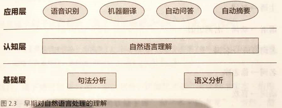
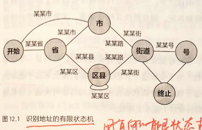
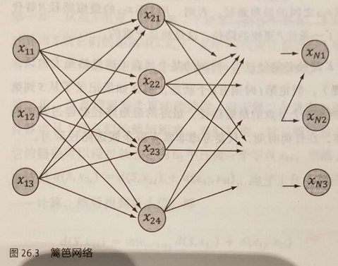
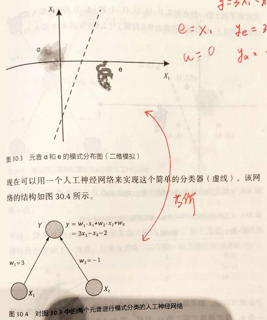
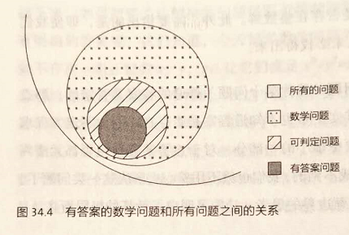

# 《数学之美》 吴军

文字和语言 vs 数字和信息

1. 语言的产生是为了传达更多的信息
2. 为什么翻译是可行的？因为文字只是信息的载体，而非信息本身。不同语言只是对信息进行加解密而已
3. 古埃及一般用象形文字记录历史，罗塞塔石碑记录着古埃及的重要历史
4. 为什么十进制比较通用？因为人是十根手指
5. 玛雅文明采用二十进制（手脚都用上）
6. 玛雅人的一个世纪为400年，2012年为太阳纪的最后一年
7. 从象形文字到拼音文字是一个质的飞跃，因为人类从描述物体外表的阶段过渡到了抽象概念
8. 信息论最短编码原理：把最常用的信息用最短的编码实现，以尽可能减少需要传送的编码长度
9. 中国古人需要把文字刻在竹简上，因此惜字如金，文言文很难懂
10. 词可以认为是封闭集合，而语言则是开放集合；前者有完备的编解码规则，后者不具备这个特性

自然语言处理——从规则到设计

1. 任何语言都是一种编码方式，是对信息的一种编码，语言的语法规则则是编码算法
2. 自然语言处理第一阶段：用电脑模拟人脑，对语言进行语法分析，然后解释

1. 问题：无法对复杂语句进行语法分析
2. 原因：语言在发展过程中产生了上下文相关的特性；有上下文相关特性的语言会导致计算量指数倍上升

- 自然语言处理第二阶段：采用数学模型和统计方法

统计语言模型

1. 统计语言模型背后的出发点：一个句子是否合理，就看他的可能性大小【是否符合人的判断方法？】
2. 如何判断一个句子是否合理？
3. 对句子的词进行分解，看这些词组合在一起的概率有多大
4. 为降低计算复杂度，假设每个词只和前面一个词的出现概率有关
5. N=1：上下文无关模型
6. N=2：与上一个词有关
7. N=3：与上两个词有关
8. 概率模型的背后理论支撑：大数定理。因此要求统计语言模型背后有大量的语料数据库

谈谈分词

1. 分词就是对一句话的词进行分解，分解为若干词组的组合，常见的方式是查字典（可用贪心法）
2. 分词的贪心法和非贪心法没有绝对的好与不好，只有合不合适
3. 网页搜索倾向于非贪心法（尽可能细的拆解词语）
4. 机器翻译倾向于贪心法（尽可能多的组成长词组）

隐马尔科夫模型

1. 通信系统的6要素：发送者、接受者、信道、信息、编码、解码

1. 观点：所有的自然语言处理可以等价为通信的编解码问题
2. 如何解决通信的编解码问题？最大期望值算法：从一系列信息串中找最可能的那个解
3. 马尔科夫过程（链）：随机过程的各个状态只和上一个状态有关
4. 隐马尔科夫过程：由于马尔科夫过程中的状态St不可见，假设每个St有且仅有一个Ot与之对应（独立输出假设），把求解St的问题转换为求解Ot的问题

信息的度量和作用

1. 信息量的大小取决于不确定度，不确定度越大，信息量越大
2. 信息度量算法：信息熵：负对数概念
3. 每个汉字携带的信息熵怎么算？取决于汉字背后的汉字库大小。若有7000个汉字，则一个汉字对一个的信息量大约为13bit
4. 信息冗余度：从编码角度的得出的信息熵存储空间与计算机字节直接内容存储的比，成为冗余度
5. 汉语是所有语言中冗余度相对较小的

贾里尼克和现代语言处理

1. 小学生、中学生没有必要花那么多时间读书，社会经验、生活能力和在那时树立的志向将帮助他们一生
2. 大学阶段人的理解能力非常强，非常适合读书

简单之美——布尔代数和搜索引擎

1. 搜索引擎的三大组成部分：
2. 下网页（建立数据库）
3. 建索引（便于查找）
4. 结果排序

图论和网络爬虫

1. 两种基本的图遍历算法：
2. 广度优先搜索：队列
3. 深度优先搜索：堆栈
4. 哈希表的作用：把不等长的信息变成等长的信息存储，便于索引，一般应用在大数据查找场景

PageRank——Google的民主表决式网络排名技术

1. 一个搜索结果的两个重要指标
2. 相关性
3. 网页本身质量（被链接数量）

如何确定网页和查询的相关性

1. 用户对结果的点击数量对查询结果的相关性贡献最大
2. 搜索关键词度量TF-IDF
3. 归一化的关键词频率
4. 去除停止词（虚词）
5. log(D/Dw)，将结果归一化到\[0,1]之间

有限状态机和动态规划——地图与本地搜索的核心技术

1. 有限状态机可解决地址识别问题。有限状态机本质上是一种特殊的有向图

1. 地图软件中的导航均采用了动态规划算法（DP）：目标是寻找全局最短路径，把该问题分解为多个局部最短路径问题

余弦定理和新闻的分类

1. 余弦定理用于求两个向量之间的夹角，若把夹角与相关性联系起来，并且可以把一条新闻看成是一组向量，则可用余弦定理实现新闻分类
2. 新闻的特征向量：构建一组关键词词库，一篇新闻包含各关键词数量组成向量。可利用TD-IDF

矩阵运算和文本处理中的两个分类问题

1. 矩阵分解：SVD：A=XBY，同时完成了：
2. 矩阵降维（A->B）
3. 词义归类（X、Y）
4. 若X、Y均为方阵，则称为酉矩阵

信息指纹及其应用

1. 将任意长度的字符串转换成固定长度的字符串的算法：伪随机数产生器算法
2. 一个数的平方掐头去尾，取中间几位数
3. 用途：用于比较两个集合是否相同
4. 做法：将其中一个集合映射为一张哈希表，再用另一个集合中的元素一一与其对比，计算复杂度为O(N)

由电视剧《暗算》所想到的——谈谈密码学的数学原理

1. 密码学中一个重要原则：加密结果在统计上符合均值分布，即无法从输入与输出猜出加密算法
2. 加密算法的核心是大数质因数分解难以在现在的计算机上短时间内计算出来

闪光的不一定是金子——谈谈搜索引擎反作弊问题和搜索结果的权威性问题

1. 由于搜索比较的是关键词，因此作弊最朴素的思想是冒充关键字

谈谈数学模型的重要性

1. 现在的日历叫做格里高利日历。早之前托勒密用40多个圆拟合地心说模型构造了当时的日历，1500年后发现误差有一个节气，因此在1582年教皇删除了10天，并规定在每400年回归一个闰年来解决

不要把鸡蛋放到一个篮子里——谈谈最大熵模型

1. 最大熵原理：对一个随机事件进行概率预估时，应该：
2. 满足已知的条件
3. 对未知的情况不做任何假设

拼音输入法的数学原理

1. 输入法输入速度的两个决定因素：
2. 敲击次数
3. 寻找每个按键所需的时间
4. 朴素的思想：对键盘上26个英文字母做映射，映射到50多个拼音
5. 问题：抽屉原理，必定出现重映射问题，带来了歧义
6. 极端追求更少的敲击次数，可直接对词组进行编码，但是这样要求打字员记忆庞大的词组与键盘映射关系，不便于推广
7. 输入一个汉字需要敲多少个键？
8. 从信息论角度出发：汉字信息熵为10bit，26个英文字信息熵为4.7bit，综合来看需要敲击10/4.7=2.1次
9. 拼音转汉字的解码过程：
10. 相当于最大值期望模型：一些拼音的组合在一起的最大可能的拼音组合是什么？

布隆过滤器

1. 布隆过滤器要解决的问题：传统的哈希表占用内存过大（50%效率，要将每一个数据转换为hash表）
2. 方法：固定存储空间，通过不同的伪随机数产生器对数据进行映射

马尔科夫链的扩展——贝叶斯网络

1. 每个状态只与他直接相连的状态有关

维特比和他的维特比算法

1. 篱笆网络：从起始点到终点过程的传递网络，中间有若干状态变量：

1. 维特比算法所要解决的问题就是篱笆网络中有向图的最短路径问题
2. 实例：对于一连串的拼音输入，最可能的组合路径是什么？
3. 算法：计算从i->i+1的最短路径，只需要考虑从S到i的最短路径+本次走的路径，计算复杂度为O(n\_i \* n\_i+1)
4. CDMA技术的发展历史：
5. FDMA。通过不同频率区分信息。发现频率不够用了，改进：
6. TDMA。通过不同发射时间区分信息。发现时间也不够用了，改进：
7. CDMA。通过信息内容的地址来区分信息

Google大脑和人工神经网络

1. 神经网络本质上就是一种有向图
2. 一般分为三层：输入层、隐含层、输出层
3. 神经网络中每一层只和上一层有关
4. 分类器的本质：一种比目标维低一维度的线性空间（例如直线是一种二维线性分类器，他与只有输入和输出层的神经网络结构等价）：

1. 神经元网络：只能是对输入变量的线性组合后进行一次非线性变换
2. 神经网络的设计要点：
3. 网络层设计
4. 非线性函数设计
5. Google大脑本质上能够进行并行运算的神经网络系统

区块链的数学基础

1. 椭圆加密函数：y^3=x^3+ax+b。该函数关于x轴对称
2. 椭圆加密函数是基于图形的加密算法（在曲线上求交点，难点在于给出起始点和终点，无法快速得知经过几次计算得到），相比传统的RSA算法速度更快，秘钥更短

大数据的威力——谈谈数据的重要性

1. 没有得到数据之前，不要给出任何结论
2. 大数据的基本要求
3. 数据足够多
4. 数据必须有代表性

随机性带来的好处——量子秘钥分发的数学原理

1. 量子通信和量子纠缠没关系，只是一种特殊的激光通信，即利用光的偏振
2. 在发送和接收端均随机放置光的偏振方向，发送和接收双方反复通信确认秘钥（光的偏振方向），确认后秘钥只使用一次便丢弃（用时间换取通信安全）

数学的极限——希尔伯特第十问题和机器智能的极限

1. 图灵认识到计算其实一种机械运动，当某种机械运动停止时则可得出结论
2. 机械运动可保证重复性，在相同输入下，法则不变，可得到完全相同的结论
3. 问题边界：

1. 所有问题->数学问题->可判定问题->有答案问题->可计算问题->工程可实现
2. 我们离人工智能还非常非常远，现在只是解决了部分工程科实现的问题上
3. 图灵机：把人类做数学题的过程抽象成一个读写头+无限长纸带的问题
