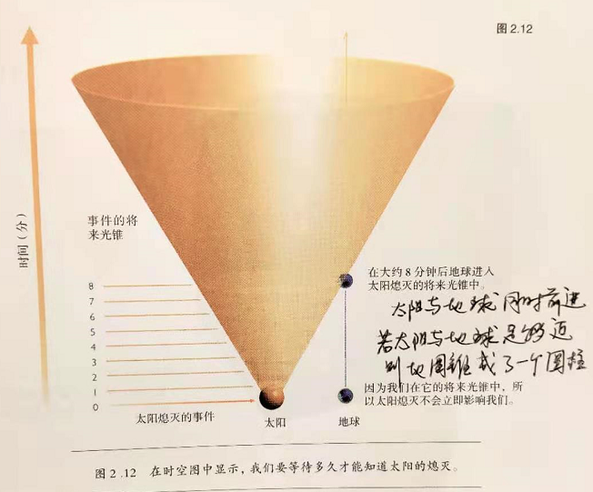
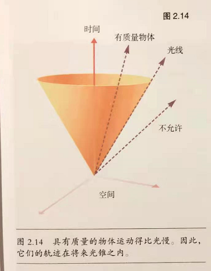
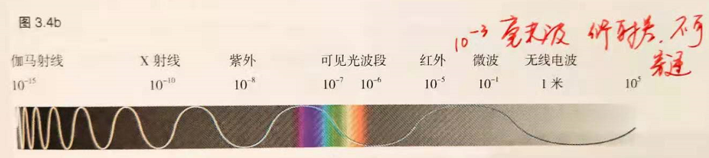
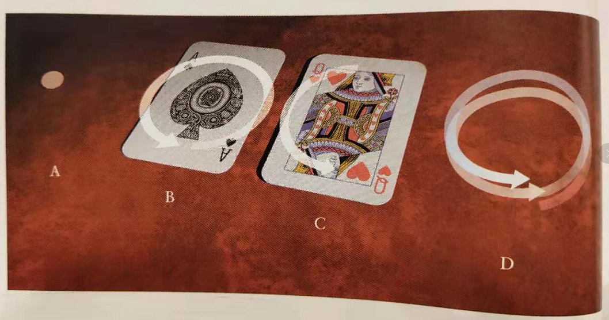
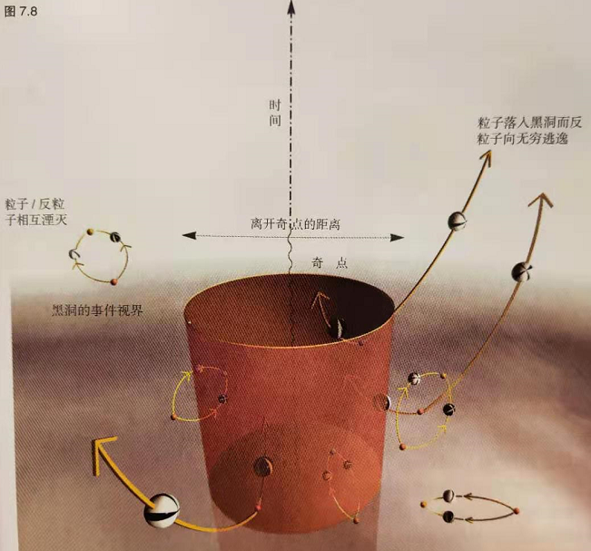
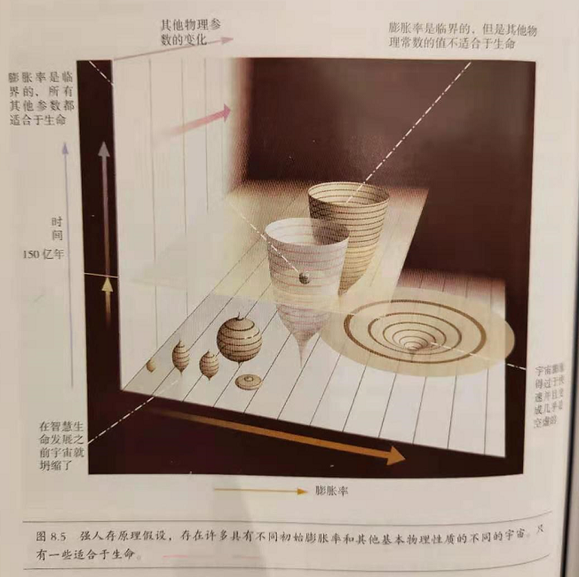
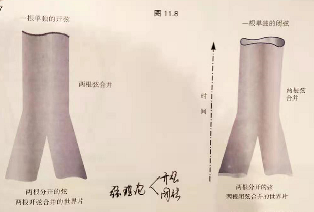

# 《时间简史》Stephen Hawking

我们的宇宙图像

1. 印度教宇宙：地球是驼在6只大象的背上，而这6只大象又由1只乌龟驮着
2. 亚里士多德+托勒密：地球是宇宙中心，所有星球围绕地球旋转
3. 托勒密用40多个圆套圆的方式解释了托勒密学说
4. 哥白尼：太阳为中心，地球围绕太阳旋转
5. 开普勒：修正哥白尼系统，指出行星轨道不是完美的圆，而是椭圆
6. 宇宙的开端起始于大爆炸时刻，时间开始于此，所以追问大爆炸之前的时间是没有意义的
7. 不管我们朝哪个方向看去，远处的星系都在急速地飞离我们而去，这意味着：宇宙正在膨胀
8. 追溯这种状态的开端：宇宙起始于一个奇点，此时体积无限小，密度无限大，此时所有的物理定律失效
9. 一个好的理论必须能做到两点：能够解释现有现象；能够预测未来的现象
10. 牛顿理论在宏观上适用，但在强引力场下失效；量子场论在微观粒子上适用
11. 广义相对论解释了牛顿理论中引力长程力的本质：将引力描述为因为时空中的质量和能量而引起的时空弯曲，并于1919年成功观测到光线弯曲现象

空间和时间

1. 伽利略：通过观察、实验的方式（比萨斜塔实验）证明了物体下落速度与物体质量无关
2. 牛顿：力不是维持物体运动的原因，而是改变物体运动速度的原因，即牛顿第二定律
3. 牛顿定律的前提是惯性参考系：即无法区分静止与匀速运动两种状态
4. 这会导致：相同时间发生的事件是否在相同的空间位置这个问题就无法回答
5. 麦克斯韦理论预言：电磁波或者光波是以某一固定速度传播的，而这一固定速度是相对于谁的没有说清楚。对于此问题物理学争论了很久
6. 相对于以太。莫雷实验证明：在地球上沿着任何方向传播光得到的光速完全一样，这意味着没有以太这种物质
7. E=mc2。质能方程说明能量和质量是等价的，仅仅只是差一个系数而已，因此当我们试图把一个物体加速到光速时，它具有的大动能意味着具有很大质量，此时是无法将越来越重的物体一直加速的，因为这需要非常多的能量
8. 米的定义：光在铯原子钟在0.000000003335640952s行进的距离，这个定义也是按照保存在巴黎的特定铅棒上两个刻度之间的距离
9. 事件光锥：横轴为空间，纵轴为时间的一个坐标系。定义了某一事件的理论传播范围

1. 有质量的物体其事件光锥一定落在光波光椎之内，因为它的传播速度比光速慢

1. 光线不是沿着直线传播，而是沿着测地线传播。大质量天体会弯曲它周围时空，导致引力现象，光也不例外
2. 根据广义相对论，靠近大质量天体的时间过的比较慢，因此山底的时钟跑的比山顶的时钟要慢

膨胀的宇宙

1. 行星测距的两种方法
2. 视差法。根据地球直径或者地球公转直径时测距
3. 视亮度。根据亮度和距离的关系测算距离
4. 不同波段的波长

1. 现在的宇宙由于密度比膨胀率决定的临界值还要小，因此现在的宇宙是不断膨胀的
2. 根据现在观察到的宇宙微波背景辐射，得出了宇宙不断膨胀的结论。而追根溯源，一定存在一个开头，宇宙从一个奇点诞生，即宇宙大爆炸理论

不确定性原理

1. 不确定性原理。你不可能同时测量粒子的位置和速度，你对其中一个量测量的越准，另一个量就越不准
2. 用红光看粒子，则速度更准，位置不准
3. 用蓝光看粒子，则位置更准，速度不准
4. 位置不确定性 x 速度不确定性 >=普朗克常量
5. 双缝干涉是只有在波中才会有的现象，而在电子的微观世界里也会呈现双缝干涉现象（往双缝一次性发射一个电子，时间长了也会有双缝干涉条纹）
6. 原子核外电子被认为是一种波，波长取决于电子运动的速度
7. 如果电子围绕一圈产生的波峰和波谷是叠加的（正整数周期倍），则这些轨道是被允许的，否则不被允许，这也就是量子轨道的来源

基本粒子和自然的力

1. 布朗运动：分子在空气中做无规则运动
2. 有6种夸克：上、下、奇、粲、底、顶。每一种还有三种颜色：红、绿、蓝

1. 上下不是空间位置，指的是自旋反向。
2. 中子：1个上旋，2个下旋
3. 质子：2个上旋，1个下旋
4. 观察粒子->需要用更短波长（X光）->频率高->能量高（需要高能粒子加速器）
5. 粒子自旋特性：

1. A：自旋=0。各个方向都一样
2. B：自旋=1。旋转360°重合
3. C：自旋=2。旋转180°重合
4. D：自旋=1/2。旋转720°重合

- 物理学中的四种基本力

1. 引力。一种长程力，强度较弱
2. 电磁力。作用于带电荷粒子。电磁力使得电子围绕质子旋转
3. 弱核力。只作用于自旋为1/2的粒子，负责粒子放射性现象
4. 强核力。将质子和中子束缚在一起的力。能够把粒子束缚成不带颜色的结合体
5. 介子：一个上旋，一个下旋

- 物理定律服从CPT对称

1. C（电荷）对称。定律对于正粒子和反粒子是相同的【质子与电子的轨迹运动】
2. P（宇称）。定律对于任何场景和它的镜像（右手自旋镜像为左手自旋）是相同的
3. T（时间）对称。颠倒粒子和反粒子的运动方向，系统可以回到之前的状态

黑洞

1. 几个典型的恒星诞生、演化和死亡过程
2. 褐矮星。一直保持固定体积和大小
3. 一个太阳。最后膨胀后缩小为白矮星
4. 10-30个太阳。膨胀后会缩小，要么是中子星，要么是黑洞
5. 天狼星是天空中最亮的恒星
6. 事件视界：光或任何物质不能逃脱出该区域达到观察者
7. 一旦进入事件视界，则会很快到达无限致密的区域和时间的终点
8. 广义相对论预言过重的物体在运动时会引起时空曲率涟漪，这就是引力波
9. 两个黑洞之所以会越来越近是因为引力波辐射带走了他们的能量
10. 黑洞之所以是黑的是因为光线无法逃离出来，要观察黑洞只能通过旁边被吸收的恒星辅助观察

黑洞不是这么黑的

1. 事件视界的范围会随着两个黑洞合并到一起而增加
2. 具有温度的物体会向外释放辐射，因此黑洞会向周围释放热辐射。且质量越大则温度越低（黑洞越小，负能粒子变成实粒子走的距离越短，温度越高）
3. 释放的X射线不是从黑洞里面来的，而是从事件视界外的空间来的（虚粒子交换：正粒子落入黑洞，负粒子从黑洞逃逸）

宇宙的起源和命运

1. 起源于大爆炸
2. 强人存原理：存在许多具有不同膨胀率和其他物理性质不同的宇宙，但是只有一些适合生命

1. 弱人存定理：只存在一个空间宇宙，在某些区域才有智慧生命
2. 太阳系年龄大概50亿年，宇宙年龄大概150亿年
3. 引力场由弯曲的时空来代表：粒子在弯曲空间中试图沿着最接近于直线的某种路径走
4. 地球的表面在范围上是有限的，但是没有边界和边缘。宇宙也同理，会在时间和空间形成一个范围有限但是无界的宇宙

时间箭头

1. 时间不是绝对唯一的，他是相对于观察者而言的（运动快的载体的时间走的慢）
2. 标准秒是基于两个磁铁之间的蒸发的铯原子133振动的次数
3. 三种时间箭头
4. 热力学时间箭头：熵增方向
5. 心理学时间箭头：记忆过去而不是未来
6. 宇宙学时间箭头：在该方向上膨胀而不是收缩
7. 以上三种箭头的结论是：三个箭头方向一致
8. 热力学箭头决定心理学箭头，且方向相同
9. 你不可能记忆未来而忘记过去，这与熵增方向相反
10. 为什么是熵增？因为从结果上来讲，无序的组合比有序的组合多的多，从概率上将，有序概率更低
11. 宇宙开始于一个非常有序的状态，随着时间慢慢演化为无序状态
12. 关键问题：如果宇宙不膨胀了，进入缩小阶段，则此时宇宙时间箭头反向，但是热力学箭头不会方向，依然是熵增方向

虫洞和时间旅行

1. 虫洞可以为两个几乎平坦的时空提供跨越捷径
2. 平行宇宙的概念可以解释时间旅行佯谬（你穿越时空回去杀死了自己的祖父，你不会消失，而是会在当时立即创建一个新的时空分支）

物理学的统一

1. 大统一理论（GUT）的目的是为了统一四种基本力：引力，电磁力，强电核力，弱电核力。目前已经统一了后三者
2. 弦理论：基本对象不再是粒子，而是一条条弦，这些弦可以自闭合，分开，连接不同粒子

1. 低于二维，高于三维的空间不适合智慧生命生存，因为引力反比于空间距离的n次方，维度越高引力越弱，不可能形成诸如恒星系
2. 即使找到了大统一理论，我们也不能随时随地预测未来，理由
3. 量子力学的不确定性原理（测不准原理）
4. 过度复杂的方程，无法给出准确解
