# 《李永乐西瓜视频》1

## 目录

- [手机摄影超越单反？ 触手可及的AI让每个人成为专业摄影师](#手机摄影超越单反-触手可及的AI让每个人成为专业摄影师)
- [河南郑州为何突降暴雨？李永乐老师解读三大暴雨成因](#河南郑州为何突降暴雨李永乐老师解读三大暴雨成因)
- [跳水运动员为啥总是这姿势？李永乐老师教你看懂跳水比赛](#跳水运动员为啥总是这姿势李永乐老师教你看懂跳水比赛)
- [给电动车加个充电宝？关于增程式电动车的一切](#给电动车加个充电宝关于增程式电动车的一切)
- [埃里克森如何“死而复生”?心源性猝死的急救常识：心肺复苏和AED](#埃里克森如何死而复生心源性猝死的急救常识心肺复苏和AED)
- [如何快速测量近视度数？快来给自己检查一下！](#如何快速测量近视度数快来给自己检查一下)
- [中国人为何能造出杂交水稻？除了袁隆平，也应该铭记这些人](#中国人为何能造出杂交水稻除了袁隆平也应该铭记这些人)
- [什么是杂交？遗传学之父孟德尔和他的豌豆杂交实验](#什么是杂交遗传学之父孟德尔和他的豌豆杂交实验)
- [姚期智百万富翁问题：大数据时代，如何保护个人隐私？](#姚期智百万富翁问题大数据时代如何保护个人隐私)
- [神奇的零知识证明！既能保守秘密，又让别人信你！](#神奇的零知识证明既能保守秘密又让别人信你)
- [熟鸡蛋返生有可能吗？这项研究得了“诺贝尔奖”](#熟鸡蛋返生有可能吗这项研究得了诺贝尔奖)
- [“元气森林”真的没有糖吗？人类为什么喜欢吃糖？](#元气森林真的没有糖吗人类为什么喜欢吃糖)
- [眼见一定为实吗？我们是如何看到颜色的？颜色如何影响思维与认知](#眼见一定为实吗我们是如何看到颜色的颜色如何影响思维与认知)
- [智能汽车如何眼观六路、耳听八方？传感器融合与卡尔曼滤波技术](#智能汽车如何眼观六路耳听八方传感器融合与卡尔曼滤波技术)
- [香蕉皮能展成平面吗？微分几何之高斯绝妙定理](#香蕉皮能展成平面吗微分几何之高斯绝妙定理)
- [人脸识别啥原理？人工智能（二）卷积神经网络](#人脸识别啥原理人工智能二卷积神经网络)
- [电脑如何像人一样思考？人工智能（一）机器学习与神经网络](#电脑如何像人一样思考人工智能一机器学习与神经网络)
- [熊孩子是怎样炼成的？和孩子一起做的10个心理学实验](#熊孩子是怎样炼成的和孩子一起做的10个心理学实验)
- [千万不要用微波炉烧水！李永乐老师讲过热/过冷液体](#千万不要用微波炉烧水李永乐老师讲过热过冷液体)
- [游戏驿站GME股票为何暴涨？美国散户如何血洗华尔街？](#游戏驿站GME股票为何暴涨美国散户如何血洗华尔街)
- [如何才能长生不老？生命的时钟在哪里？](#如何才能长生不老生命的时钟在哪里)
- [它凭什么成为创造未来的新技术？李永乐老师为你解读5G！](#它凭什么成为创造未来的新技术李永乐老师为你解读5G)
- [检查悖论](#检查悖论)
- [蚂蚁金服如何把30亿变成3000亿?资产证券化如何导致美国次贷危机](#蚂蚁金服如何把30亿变成3000亿资产证券化如何导致美国次贷危机)
- [11.11优惠可以被预测吗？用组合数给你「加鸡腿」](#1111优惠可以被预测吗用组合数给你加鸡腿)
- [一期分摊4块多，相互宝到底值不值？](#一期分摊4块多相互宝到底值不值)
- [乙肝病毒如何疯狂感染全球20亿人？第一支乙肝疫苗是如何诞生的？](#乙肝病毒如何疯狂感染全球20亿人第一支乙肝疫苗是如何诞生的)
- [甲肝是一种什么样的传染病？](#甲肝是一种什么样的传染病)
- [自动驾驶技术是个啥？](#自动驾驶技术是个啥)
- [孩子是如何认识世界的？孩子学不会，家长怎么办？](#孩子是如何认识世界的孩子学不会家长怎么办)
- [如何看待高校相对封闭管理政策？为啥烟草征重税、电车有补贴？](#如何看待高校相对封闭管理政策为啥烟草征重税电车有补贴)
- [黑豹演员博斯曼因结肠癌去世！普通人如何逃脱消化道肿瘤魔爪？](#黑豹演员博斯曼因结肠癌去世普通人如何逃脱消化道肿瘤魔爪)
- [骑自行车为什么比走路省力气？](#骑自行车为什么比走路省力气)
- [布朗运动是什么？太阳光到地球需要多久？](#布朗运动是什么太阳光到地球需要多久)
- [如何把“天问一号”探测器发射到火星？霍曼转移轨道是什么？](#如何把天问一号探测器发射到火星霍曼转移轨道是什么)
- [宇宙速度：跑多快才能逃出地球？](#宇宙速度跑多快才能逃出地球)
- [“百年一遇”的洪灾为何年年遇？究竟什么是“百年一遇”？](#百年一遇的洪灾为何年年遇究竟什么是百年一遇)
- [神奇的鲁珀特之泪：子弹打不碎，一捏就爆炸](#神奇的鲁珀特之泪子弹打不碎一捏就爆炸)
- [虎门大桥为何异常抖动？风能吹塌一座桥吗？](#虎门大桥为何异常抖动风能吹塌一座桥吗)
- [神奇的饮水鸟：只需要一杯水的“永动机”](#神奇的饮水鸟只需要一杯水的永动机)
- [原油期货-37美元/桶，原油宝钱赔光了还欠银行钱！期货风险为啥这么大？](#原油期货-37美元桶原油宝钱赔光了还欠银行钱期货风险为啥这么大)
- [井底之蛙如何看到广阔天空？猫眼（门镜）啥原理？](#井底之蛙如何看到广阔天空猫眼门镜啥原理)
- [英国首席科学家嘴里的“群体免疫”真能有效吗？病毒多久能传染整个欧洲？](#英国首席科学家嘴里的群体免疫真能有效吗病毒多久能传染整个欧洲)
- [美股一周两次熔断，中美股民谁更赚钱？股票指数是什么？](#美股一周两次熔断中美股民谁更赚钱股票指数是什么)
- [牛顿在家躲瘟疫时干了什么?红外线温度计啥原理?太阳的温度咋测的](#牛顿在家躲瘟疫时干了什么红外线温度计啥原理太阳的温度咋测的)
- [如何正确使用酒精消毒？84消毒液和洁厕灵混着用会发生什么？](#如何正确使用酒精消毒84消毒液和洁厕灵混着用会发生什么)
- [“冠状病毒”是什么？新型肺炎病毒是如何使人生病的？](#冠状病毒是什么新型肺炎病毒是如何使人生病的)
- [细菌对人类有什么作用？为什么要勤洗手、戴口罩？](#细菌对人类有什么作用为什么要勤洗手戴口罩)
- [史上最靓身份证号即将诞生！李永乐老师揭秘身份证号码的秘密](#史上最靓身份证号即将诞生李永乐老师揭秘身份证号码的秘密)
- [屁为什么是臭的？人为什么能闻到上万种气味？李永乐老师讲嗅觉](#屁为什么是臭的人为什么能闻到上万种气味李永乐老师讲嗅觉)

# 手机摄影超越单反？ 触手可及的AI让每个人成为专业摄影师

1. 超级分辨率一般采用SRCNN神经网络算法，后台训练数据库

   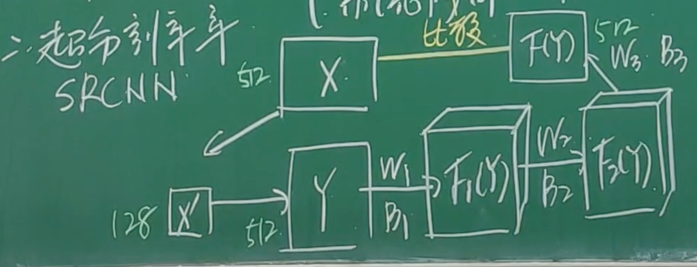

# 河南郑州为何突降暴雨？李永乐老师解读三大暴雨成因

1. 三圈环流。热带低压（温度高，气体蒸发跑到高空，所以低压），北极高压（温度低，空气沉降到地面，所以高压），空气从高压向低压区流动，造成环流

   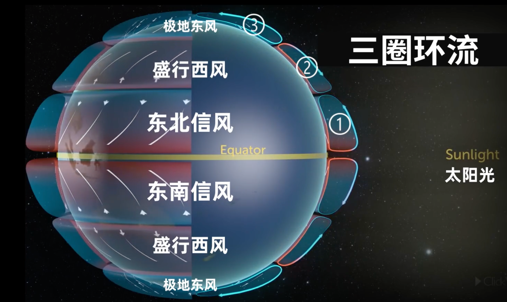
2. 白天海洋温度低，高压，陆地温度高，低压，则海风从海面吹向陆地，称为海风
3. 晚上反过来，风从陆地吹向海洋，成为陆风
4. 中国地形三大阶梯。喜马拉雅；昆仑、阿尔金、祁连；大兴安岭、太行、雪峰山

   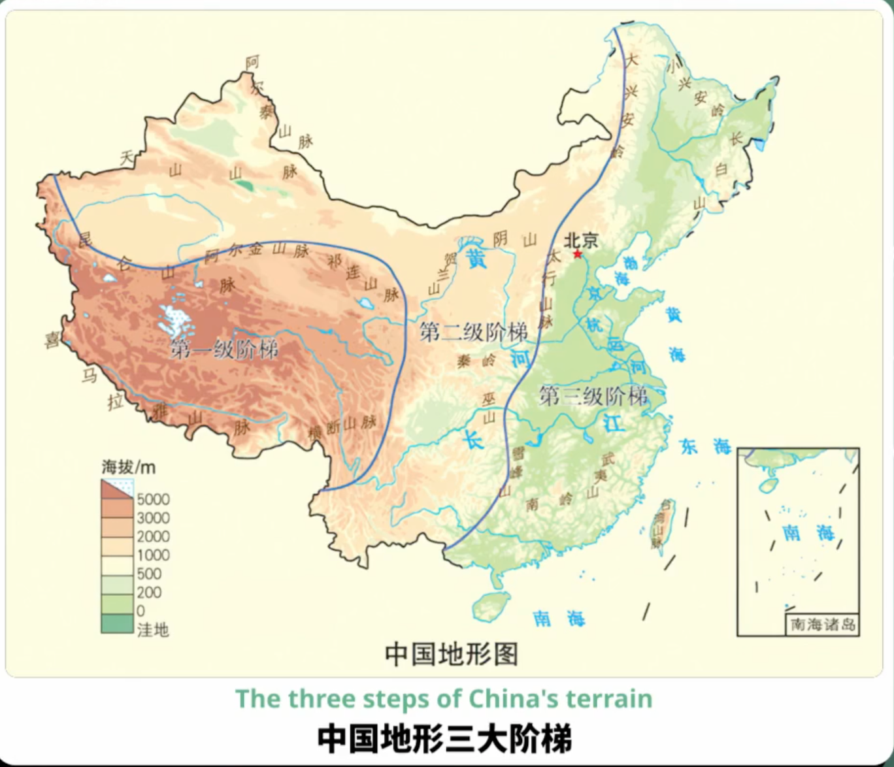

# 跳水运动员为啥总是这姿势？李永乐老师教你看懂跳水比赛

1. 代码：组别+姿势。数字表示翻腾圈数，半圈为1，一整圈为2
2. 直立翻腾转动惯量20kg*m2，纵向转体转动惯量1kg*m2
3. 空中整个过程角动量守恒，所以双手呈现太极的手势是为了让身体倾斜10°，然后把横向x轴的惯量分解到身体纵向y轴上产生转体运动

   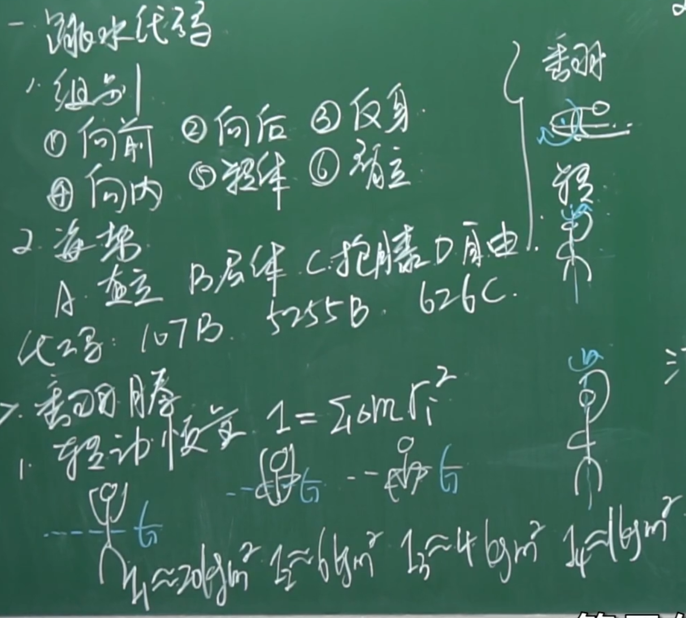

# 给电动车加个充电宝？关于增程式电动车的一切

1. 没有减速箱，发动机提供的动力给电池充电，通过电池驱动电动机

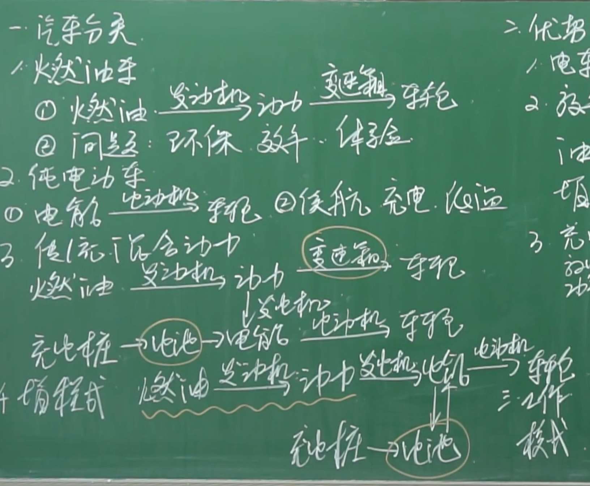

# 埃里克森如何“死而复生”?心源性猝死的急救常识：心肺复苏和AED

1. 窦房结控制整个心脏的规律跳动。室颤不是心跳暂停，心电图不是0
2. 叫。拍肩叫醒。叫不醒，且无胸腔起伏（呼吸暂停），再进行下面操作
3. 叫。叫别人打急救电话，并拿AED
4. 压。CPR。按压5-6cm，100-120次/min，每30s加两次人工呼吸
5. 电。AED除颤

   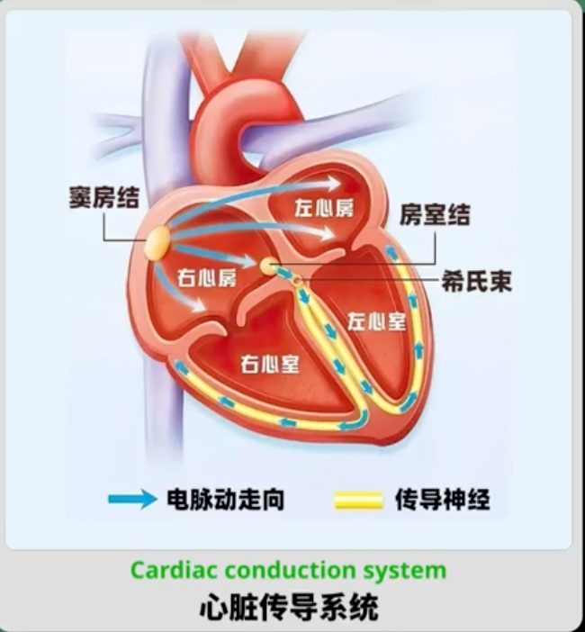

# 如何快速测量近视度数？快来给自己检查一下！

1. 凹透镜把远处的像拉近到近处，成立一个缩小的虚像
2. 1/u+1/v=1/f。凹透镜时，v和f<0
3. 屈光度D=-1/f
4. 度数=100D=-100/f

   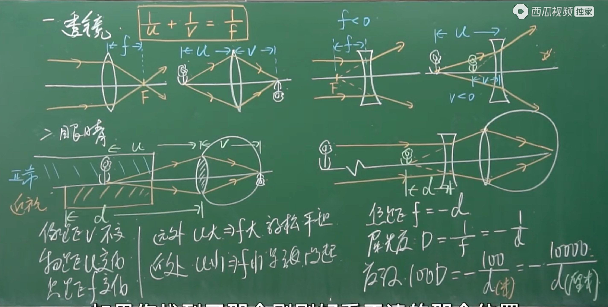

# 中国人为何能造出杂交水稻？除了袁隆平，也应该铭记这些人

1. 三系培养：不育系、保持系、恢复系（给农民的种子）
   1. 1978年11月23日，在海南找到一株不育系，野败
   2. 1972年，颜龙安，珍汕97A
   3. 1980年，谢华安，明恢63A
   4. 1986年，珍汕97A+明恢63A=汕优63，一直用到2001年
2. 二系培养（还未开发出来）：不育系、保持+恢复
3. 一系培养（还未开发出来）：一步到位

   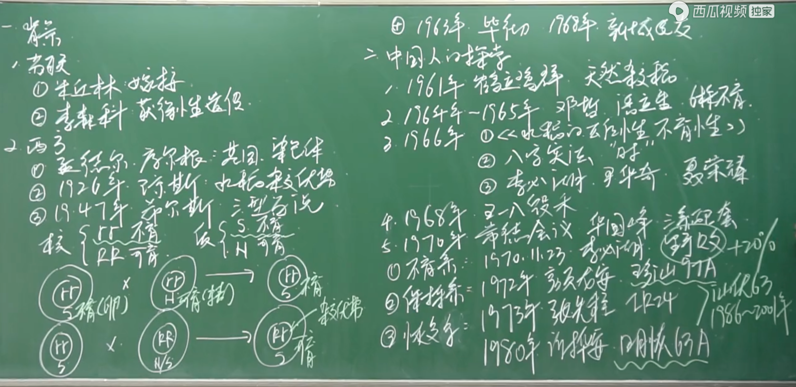

# 什么是杂交？遗传学之父孟德尔和他的豌豆杂交实验

1. 为什么用豌豆？因为豌豆是自交植物，且花瓣会紧密包裹住雌蕊，其他花粉无法进入，方便控制
2. 遗传第一定律：显性基因、隐形基因：单/双眼皮
3. 性状分离会增加生物多样性，进一步支持达尔文生物进化论
4. 遗传第二定律：遗传因子分离后自由组合

# 姚期智百万富翁问题：大数据时代，如何保护个人隐私？

1. 双方都不需要知道对方具体多少钱，但是有办法知道是自己钱多还是对方钱多
2. 基本逻辑：B把自己的的金额进行二次加密发给A，A枚举解密，然后把自己的金额进行第三次加密发回B，B只需看原先加密的数据排在第几位即可

   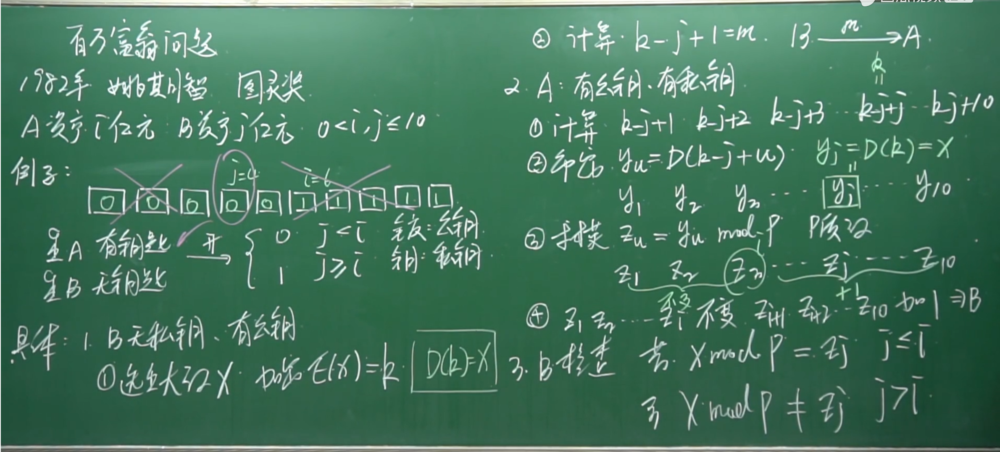

# 神奇的零知识证明！既能保守秘密，又让别人信你！

1. 比如阿里巴巴向四十大盗证明：我不告诉你怎么打开金库的大门，但是我有办法让你相信我有能力打开大门
2. 原理：通过多次独立、不相关的测试方法，验证他给出的结论，从概率上证明了确实了解证明过程

# 熟鸡蛋返生有可能吗？这项研究得了“诺贝尔奖”

1. 蛋白质由氨基酸构成（CHON）。你吃的蛋白质都会分解成氨基酸
2. 9种必须氨基酸只能从外部获取。所以不能挑食，要吃肉
3. 2个氨基酸进行脱水缩合，形成二肽，这是最简单的肽链

   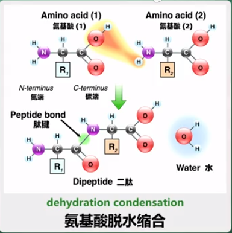
4. 蛋白质有四级结构：级数越高越复杂。

   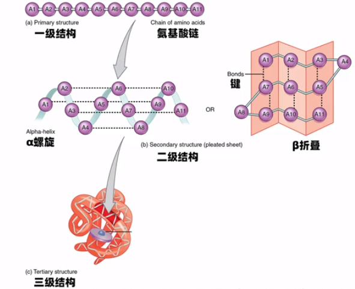
5. 蛋白质变性本质：肽链断开，高级蛋白质变成低级蛋白质；疏水结构抱团形成沉淀
6. 蛋白质为什么会自动复性？因为特定蛋白质的结构在能量上是最低的。好比为什么水珠在外太空呈现球形，是因为他的表面积最小

# “元气森林”真的没有糖吗？人类为什么喜欢吃糖？

1. 碳水化合物：Cn(H2O)m
2. 单糖。葡萄糖、果糖、半乳糖（C2(H2O)6）
   1. 人体获得能量的直接来源。葡萄糖经过有氧呼吸，释放ATP能量
3. 二糖。2个单糖脱水合成。
   1. 葡萄糖+葡萄糖：麦芽糖（麦芽，甜度单位0.46）
   2. 葡萄糖+果糖（甜度单位1.7）：蔗糖（厨房里的糖、甘蔗，甜度单位1）
   3. 葡萄糖+半乳糖：乳糖（牛奶，甜度单位0.16）
4. 代糖（甜味剂）。甜，但是不长脂肪，不是碳水化合物
   1. 阿斯巴甜（零度可乐），甜度单位200倍
   2. 赤藓糖醇（元气森林），甜度单位0.8倍
   3. 三氯蔗糖，甜度单位600倍
5. 多糖。
   1. 淀粉（大米）。水解变成单糖
   2. 糖原。肝脏把多余的单糖保存起来，相当于小仓库；吃的太多，合成脂肪（皮下、内脏）
   3. 纤维素（木头、棉花、蔬菜）。不能消化，比如金针菇不能消化，英文叫See you tomorrow。促进肠道蠕动消化实物。
      1. 为什么动物可以消化植物？动物也不能消化，是消化道的微生物帮助消化

# 眼见一定为实吗？我们是如何看到颜色的？颜色如何影响思维与认知

1. 视杆细胞。能感受光强，不能分辨颜色
2. 视锥细胞。能分辨颜色，不能感受光强
3. 世界本无色，只是人和动物的眼球能够对不同波长的光线产生反应才感觉到了不同的颜色。有的动物有四种视觉细胞（比如鸟类），能够看到的颜色比人类多。
4. 品红色在自然界中并不存在（原因是品红色是红色和蓝色广播的叠加，自然光中都是单色光），人类能看出品红色完全是因为两种受体细胞的同时作用。黄色是红色和绿色是受体细胞同时作用，大脑脑补的结果
5. 颜色恒常性。大脑反过来影响眼睛，让我们认为没有颜色的物体会自然给他赋予正常的颜色。比如明明是灰色图片的草莓，看到图片后依然认为是红色
   1. 比如煤炭是黑的，雪是白的，草莓是红的
6. 颜色负后性。盯着一种颜色的时间长了，大脑会对补色更加敏感
7. 颜色适应性。长期生活在一种颜色下，慢慢会感觉不到这种颜色
8. 混色原理
   1. 加色混合。比如RGB三色混合

      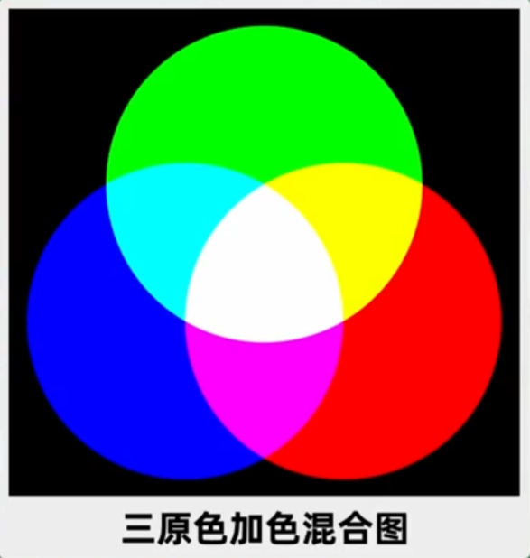
   2. 减色混合。C（青色）M（品红）Y（黄色）K（黑色）。一般在印刷品中常用【相当于加色混合的对立面，把混色图翻过来看】

      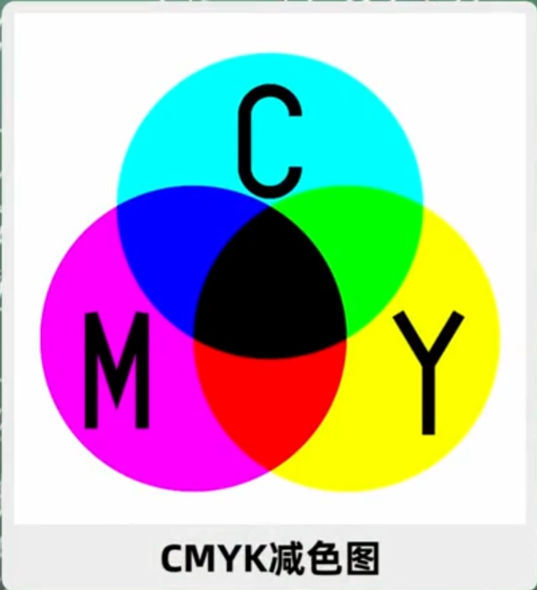

# 智能汽车如何眼观六路、耳听八方？传感器融合与卡尔曼滤波技术

1. 激光雷达。机械旋转式、固体扫描式。由于波长很短（\~905nm），所以可以扫描出物体表面形状，进行3D建模；缺点是由于波长短，很难穿透雨雪天气
2. 毫米波雷达。相比于激光雷达，由于波长长，所以可以在雨雪天气中使用
3. 如何达到厘米级定位：需要一辆专门的采集车，采集道路地图，预先存放在车里，才能实现cm级定位
4. 卡尔曼滤波的最优估计：

   
   1. 2种传感器有2个输出值z1、z2，具有不同的方差sigma1、sigma2
   2. 新的sigma比原来的sigma1和sigma2都要小

# 香蕉皮能展成平面吗？微分几何之高斯绝妙定理

1. 曲率圆的半径r，则曲率k=1/r。直线的曲率为0
2. 高斯绝妙定理：曲面的等长变换下（只是改变曲面形状），高斯曲率不变，K=K1\*K2，其中K1、K2分别为曲线的两个主曲面，且两个主曲面一定垂直。比如弯曲披萨，则两个主曲率会变化，但是乘积=0，曲面可展开
3. 墨卡托投影。用一个圆柱保住地球，把地球投影到圆柱体上。问题是南北两极的陆地面积会被放大

# 人脸识别啥原理？人工智能（二）卷积神经网络

1. 分类问题（如X光照片识别肿瘤、人脸识别）都可以转化为一个数学问题：即用直线切分超空间平面，最常见的方法就是梯度下降算法
2. 梯度下降求解最小二乘方程组：

   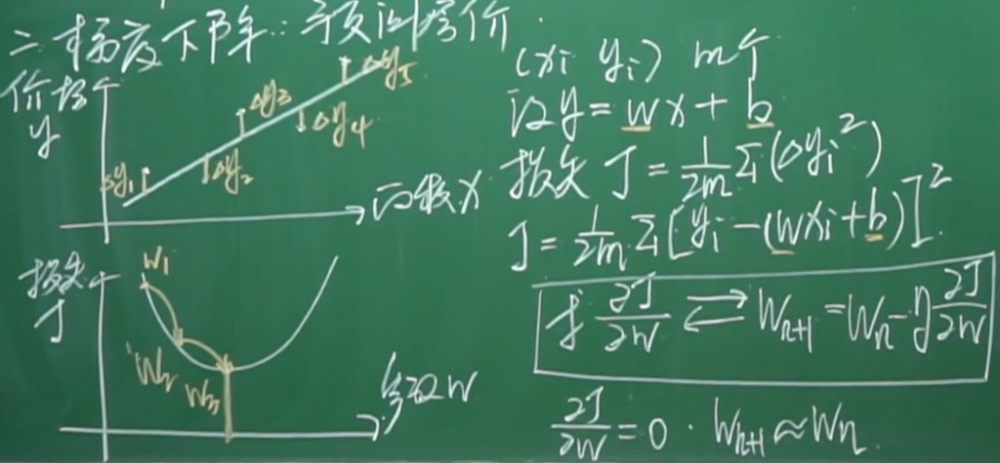
   1. 求出一条直线方程，使得它距离每一个数据点的距离最短。方法是写出损失函数J，然后对参数w进行参数化，求偏导，设计一个步长来迭代求解，直到Wn+1\~Wn

- 神经网络的M-P模型，本质上是一堆输入变量的加权线性组合，然后经过一个非线性激活函数后（如sigmod），输出一个变量，是一种多输入单输出系统

  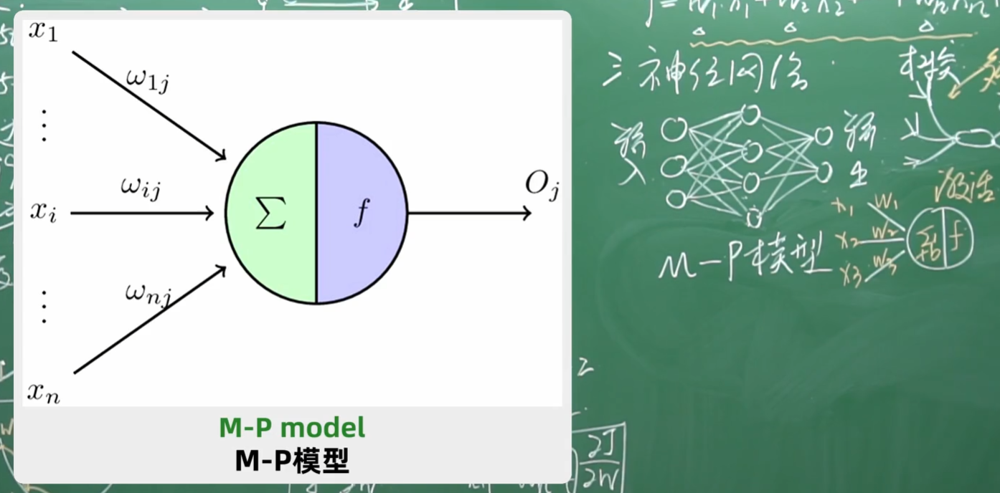

  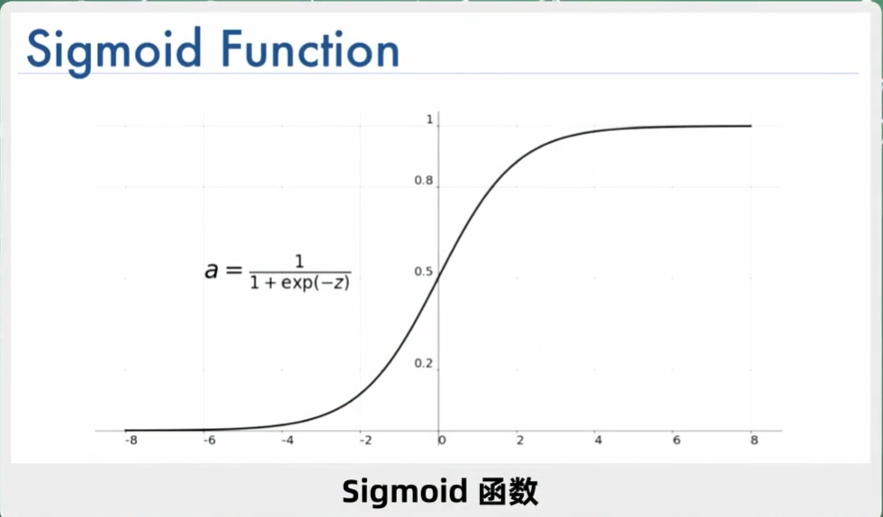

1. 人工智能框架：Tensorflow(Google)；SageMaker(Amazon)；CNTK(Microsoft)；PyTorch(Facebook)；MindSpore(华为)：并行计算+二阶优化+全场景协同(不用云计算，直接在手机上计算)

# 电脑如何像人一样思考？人工智能（一）机器学习与神经网络

1. 人大脑中视觉神经的分层结构：像素->边缘->组件->判断

   
2. 卷积神经网络CNN（杨立昆）。
   1. 卷积。卷积核与图像进行卷积运算，结果是提取出了图像中具有卷积核特征的特征图

      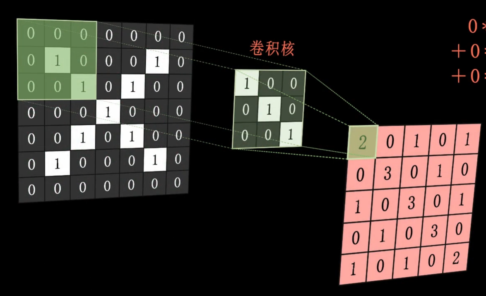
3. 池化。对特征图进行池化，将特征图尺寸进一步缩小，只保留池化区域的最大值，目的是尽可能保留特征

   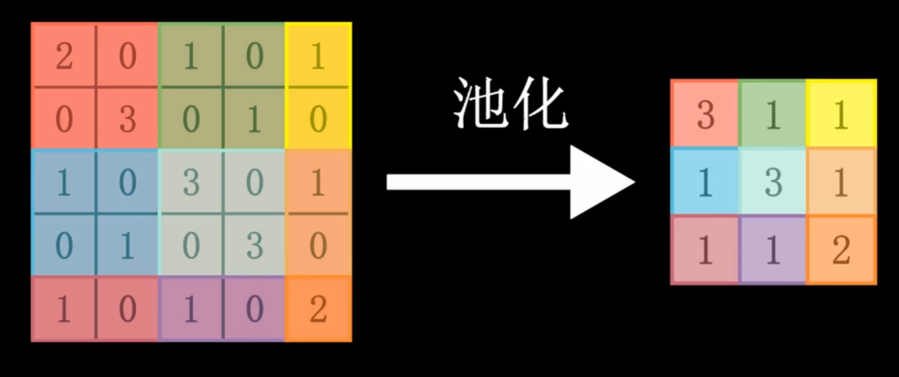
4. 激活。对池化图进行归一化处理：

   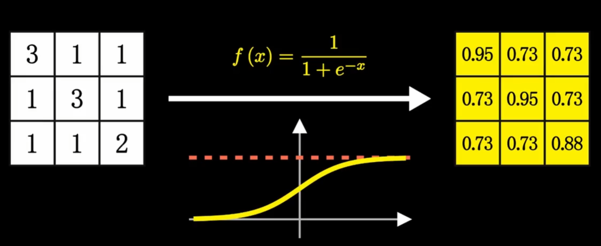
5. 再次卷积，再次池化，再次激活。
6. 神经网络处理器NPU：华为昇腾910。32个AI核

# 熊孩子是怎样炼成的？和孩子一起做的10个心理学实验

1. 0\~2岁。感知运动阶段。无法区分自身和外界
   1. 你把脸在小孩面前捂住，小孩会觉得你消失了，所以他们比较开心
2. 2\~7岁。前运算阶段。无守恒，以自我为中心
   1. 水杯高度试验（无守恒概念）。不同体积的水杯
   2. 分饼干试验（无守恒概念）。一块饼干分2份，和2块大饼干，要哪个
   3. 三山试验（以自我为中心）。山的两边物体不一样，让孩子说出另一边有什么
   4. 果汁试验（以自我为中心）。看起来像果汁的白开水，让他回答如果是别人来回答这是什么，他会回答这是白开水
3. 7\~12岁。具体运算阶段。有守恒概念
4. 12+。形式运算阶段。可以理解爱恨情仇、逻辑；可能性思考、假设性、前瞻性思考
   1. 单摆周期与什么有关，能否探究出来

# 千万不要用微波炉烧水！李永乐老师讲过热/过冷液体

1. 水开了之后之所以会冒泡是因为水蒸气饱和气压>标准大气压，此时大气压压不住水杯里的气泡，气泡就冒上去了
2. 高压锅原理：空气被加压后增加了锅内的空气压强，可以保证水在很高的温度下不沸腾，水温很高
3. 过热水（纯净水、容器光滑容易出现）。标准大气压下的水温度超过了100℃不沸腾，原因是出现了半径很小的气泡，表面张力引起的气压非常大，抬高了水的沸点。为了防止液体暴沸，加入带孔的东西，减少小体积气泡的数量
4. 可乐+曼妥思暴沸不是因为发生了反应，而是因为曼妥思表面粗糙，让可乐里的气泡聚集成更大的气泡释放出来；你往可乐里加盐也有气泡出来
5. 过冷液体（冻雨）。温度低于0℃的液体，因为液体纯净所以没有凝结，如果扰动一下或者加入一些杂质立马结冰

# 游戏驿站GME股票为何暴涨？美国散户如何血洗华尔街？

1. 融资买股票：用现有资产做抵押，向券商借钱买股票；如果股票价钱跌了，如果我不加保证金，券商把我股票卖出，叫做强行平仓
2. 看空（香橼、浑水做空中概股）：卖出融券。借别人的券往外卖。空头向拥有债券的人借债券，卖给多头，坐等股票下跌，下跌后又买回来，还给原先借债券的人。

   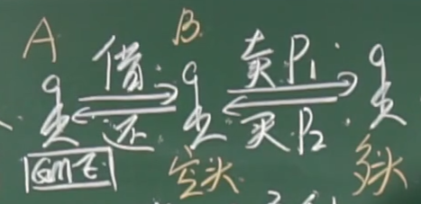
   1. 如果股票上涨，空头亏损，多头盈利
   2. 如果股票下跌，空头盈利，多头亏损
   3. 另一方面，做空股票的投资公司不一定是坏事，盯住一些坏股票
3. 期权。以某一价格买入/卖出股票
   1. 看涨call。本质是一种杠杆买入（直接买股票涨价再卖出没有杠杆，通过买call再行权买入相当于用较少的投资获得了更多的收入，这就是杠杆）
      1. 卖call的人会引起股票上涨，因为这个人会在市面上买一些股票屯着以便别人到期后收割
   2. 看跌put。

# 如何才能长生不老？生命的时钟在哪里？

1. 核苷酸基本结构

   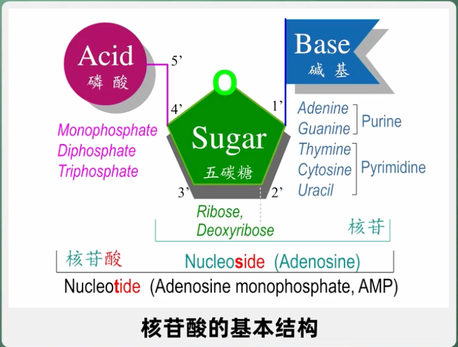
2. DNA分子链接结构（反向平行链接在一块）

   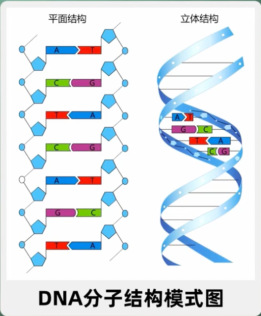
3. 端粒保护了DNA中间的遗传信息不被破坏，每分裂一次，端粒长度就少一截，直到损害到遗传物质则生物开始衰老。端粒酶能够有效增加端粒的长度，端粒酶只在生殖细胞中特别活跃，因此人生下来就是0岁，体细胞中端粒酶活性非常低，因此用体细胞做克隆生出来的孩子岁数不是0，没有生殖细胞新；癌细胞的端粒酶特别活跃，所以它能无限繁殖

# 它凭什么成为创造未来的新技术？李永乐老师为你解读5G！

1. 1G。模拟信号，移动蜂窝，只能传输语音，不能传输数字信号
2. 2G。数字信号，支持加密，可以传输文字
3. 3G。CDMA技术，速度更快
4. 4G。OFDMA。同一频段利用正交的信号实现进一步对频率带宽的有效利用
5. 5G。高速率，低延时，大容量
   1. 5Gbps（毫米波才能达到），相比4G的20倍。c=W x log2(1+S/N)。c为传输速率，W为带宽，S/N为信噪比
   2. 6GHz以下：sub-6 5G。中国联通：160MHz。相当于5倍的4G
   3. 24G\~100GHz：毫米波5G。相当于4倍sub-6 5G
6. 延时指标：
   1. 4G：10\~100ms
   2. sub-6 5G：1ms
   3. 毫米波5G：0.1ms
7. 大容量：万物互联的基础
   1. 4G：2000个/km2
   2. 5G：100万个/km2

# 检查悖论

1. 每个班多少人。教务处给的数据比学生少。因为那些人少的课的人你没法抽样到
2. 你朋友的朋友比你的朋友多。因为受欢迎的人更容易成为你朋友
3. 监狱服刑平均时间。采样的人比真实数据长。因为采样的时候那些短刑期的人早就被释放了，你统计不到

# 蚂蚁金服如何把30亿变成3000亿?资产证券化如何导致美国次贷危机

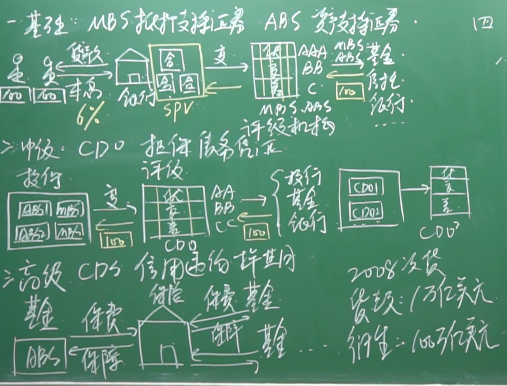

1. 基础金融衍生物。抵押支持证券MBS，资产支持证券ABS。
   1. 银行把借贷人的合同打包，变卖为债券卖给基金、信托、其他银行。债券由评级机构评级AAA，BB，C
2. 中级金融衍生物。担保债务凭证CDO
   1. 购买了MBS/ABS的投行，把这些MBS/ABS再次打包转卖给其他投行、基金、银行；可多次打包CDO2，CDO3
   2. 到这一层，已经看不到原始资金来源，全是金融产品
3. 高级金融衍生物。信用违约掉期
   1. 基金给MBS/ABS买保险。提供保险服务的机构是其他基金

# 11.11优惠可以被预测吗？用组合数给你「加鸡腿」

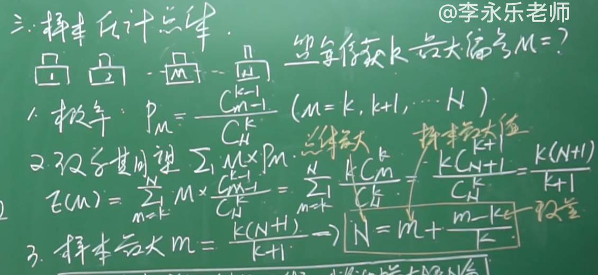

1. 如何根据样本最大值来估计总体最大值：N=m+(m-k)/k；N为总体最大值，m为样本最大值，k为抽样数量
2. 前提：总体呈现均匀、连续分布。如根据学号估计班级总体人数

# 一期分摊4块多，相互宝到底值不值？

1. 股份制：传统意义上的保险，交保费，赔款
2. 相互制：会费平摊，无组织运营，依靠的是大数据定律，年轻人收益

   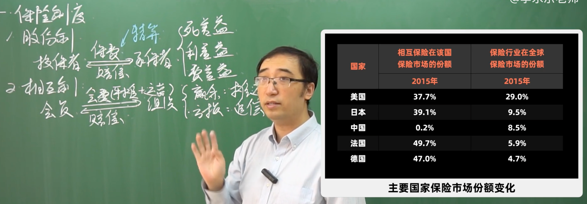

# 乙肝病毒如何疯狂感染全球20亿人？第一支乙肝疫苗是如何诞生的？

1. 2011年全世界20亿人感染，2-3亿人成为携带者，15-25%的人会导致肝硬化，肝硬化之后进一步会导致肝癌
2. 乙肝五项：表面抗原（病毒）/抗体、E抗原（复制是否活跃）/抗体、核心抗体
3. 大三阳（病毒携带者）：有病毒+正在复制+核心抗体
4. 小三阳（病毒携带者）：有病毒+没有复制+核心抗体
5. 如果干细胞大量死亡，会产生谷丙转氨酶，此时变成慢性肝炎
6. 不会传染的途径：进餐、拥抱、接吻、打喷嚏
7. 会传染的途径：母婴、血液（输血、洗牙、吸毒、纹身、耳洞）、性传播
8. 双链DNA，所以性质稳定，有疫苗就不怕了
9. 血源性乙肝疫苗：用乙肝病毒人血制作疫苗
10. 700万美元默克公司把酵母菌基因重组技术卖给中国，拯救了无数新生儿童

# 甲肝是一种什么样的传染病？

1. 肝脏的作用：存储营养、处理色素、分泌消化液（厌油）、凝血因子、调节激素
2. 甲肝、乙肝、丙肝、丁肝、戊肝；HAV、HBV、HCV、HDV、HEV
3. 甲肝传染方式：粪口传播（5个F：手指、苍蝇、水、食物、田野）；自限性疾病，可自愈，不会变成慢性疾病

# 自动驾驶技术是个啥？

1. L0\~L5，一共6个级别；2020年在L2级别左右
2. L2级别自动驾驶：高级自适应巡航、主动车道保持、变道辅助、停车辅助
3. 毫米波雷达测速度、距离、角度技术。根据频率差测速度、根据雷达阵列测角度

# 孩子是如何认识世界的？孩子学不会，家长怎么办？

1. 认知发展理论。让\*皮亚杰，图式的同化，顺应的过程；内心从不平衡到平衡，再到更高级的平衡

# 如何看待高校相对封闭管理政策？为啥烟草征重税、电车有补贴？

1. 消费者剩余+生产者剩余=社会福利。市场看不见的手来调节

   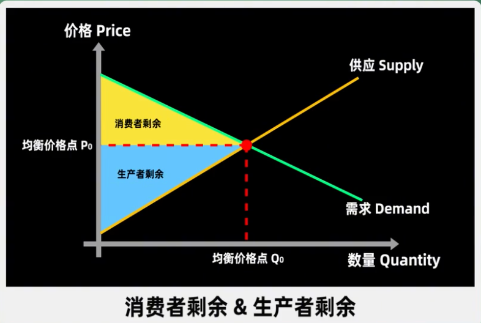

   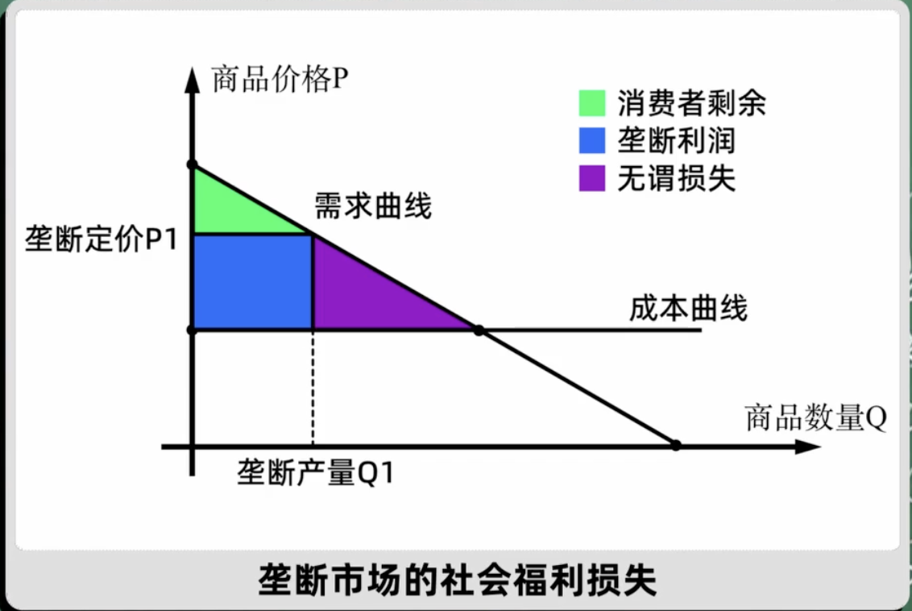
2. 由于有正/负外部性引入，导致市场失灵

   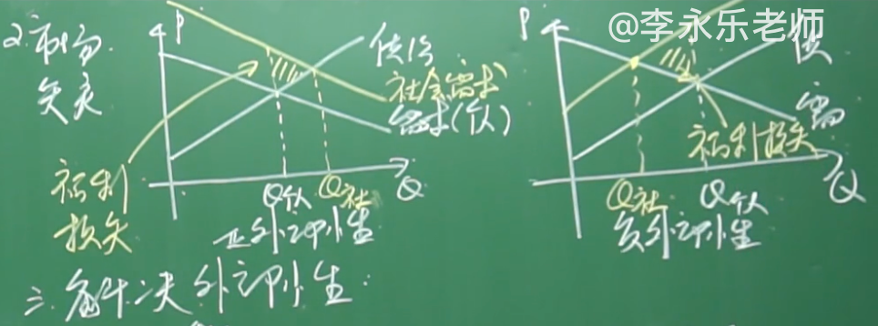
   1. 正外部性：社会需求>个人需求；供不应求；需要想办法提高个人需求意愿（打疫苗、教育、油改电）
   2. 负外部性：社会需求<个人需求；供大于求；需要想办法限制个人需求意愿（吸烟、污染、养狗）

# 黑豹演员博斯曼因结肠癌去世！普通人如何逃脱消化道肿瘤魔爪？

1. 食物消化工程：消化道+消化腺

   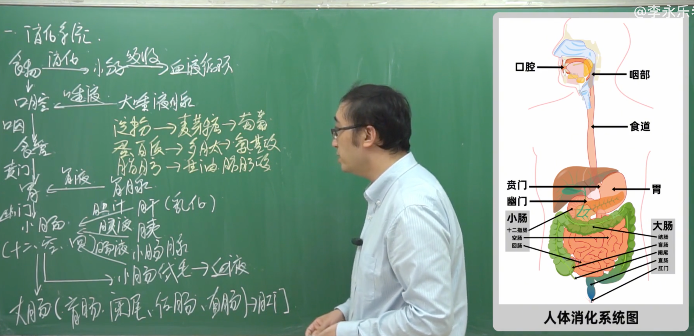
2. OR值（判断某因素是否是病因的一个数值）。病人组中某因素所占比例/未病组中某因素所占比例（比如一组有肺癌，一组没有肺癌，同时统计肺癌组吸烟的比例和没有肺癌组中吸烟的比例）

   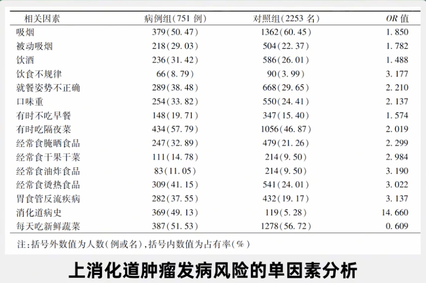

# 骑自行车为什么比走路省力气？

1. 走路重心会上下移动
2. 走路速度会加减速
3. 走路腿部要支撑，不如坐着骑车舒服

# 布朗运动是什么？太阳光到地球需要多久？

1. 光子在做无规则运动，从太阳核心通过扩散的方式扩散到太阳表面，需要耗时500万年
2. 酒鬼走路模型，估计酒鬼距离出发点的平均距离。Rn=sqrt(N)\*L
3. 考虑到分子模型，假设分子移动速度v，时间t，移动行程L，则Rn=sqrt(VTL)，速度越大，时间越长，行程越长，则扩散的距离越长，根号关系

   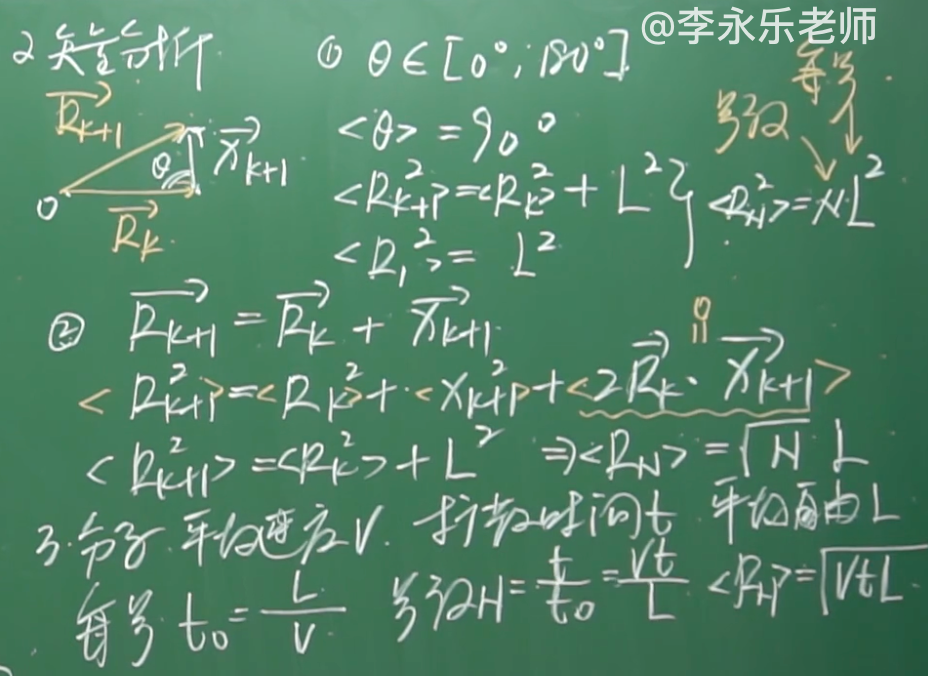

# 如何把“天问一号”探测器发射到火星？霍曼转移轨道是什么？

1. 从一个轨道加速、减速到另一个轨道上，需要两次操作
2. 火星周期为687天，地球和火星的共同周期为780天，意味着每两年左右才有一次发射火星探测器的窗口

# 宇宙速度：跑多快才能逃出地球？

1. 第一宇宙速度。围绕地球圆周运动的速度。7.9km/s。这个速度20倍声速，世界上最快的航天器6-7倍声速，航天飞机，火箭能逃离地球不需要飞到这么快的速度，因为自身有动力，第一宇宙速度指的是仅依靠自身惯性围绕星球飞行的速度；实际上火箭的速度再慢都可以逃离地球，因为自身有动力
2. 第二宇宙速度。脱离地球轨道的速度。11.2km/s
3. 第三宇宙速度。脱离太阳轨道的速度。16.7km/s
4. 第四宇宙四度。脱离银河系轨道的速度。大概在500km/s

# “百年一遇”的洪灾为何年年遇？究竟什么是“百年一遇”？

1. 百年一遇的大水指的是一年内发生的概率为1/100；如果是10年内不发生的概率为1-0.99^10=90.4%
2. N年内发生k次洪水的概率为二项分布：Cnk*P^k*(1-P)^(N-k)

# 神奇的鲁珀特之泪：子弹打不碎，一捏就爆炸

1. 外层快速冷却，内层缓慢冷却，外部给内部施加压应力，7t/cm2
2. 钢化玻璃根据此原理制造的；相比于普通玻璃无法切割，因为一切割就裂开，容易自爆、破碎
3. 钢化玻璃之间增加PVB胶水，可以制造防弹玻璃

# 虎门大桥为何异常抖动？风能吹塌一座桥吗？

1. 卡门涡街。特定流速的气体/液体在经过阻流体时在障碍物后方产生的交替旋涡现象

   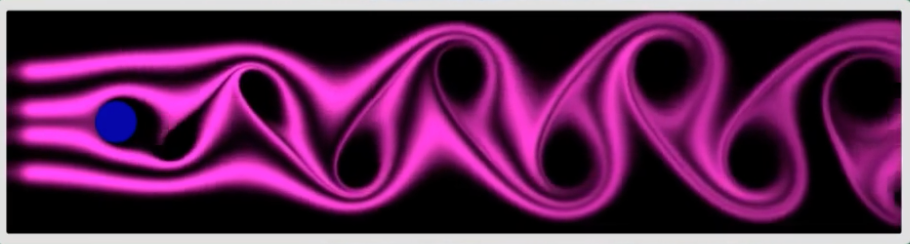
2. 振动频率与流体流速、阻流体尺寸有关：f=0.2\*v/d。利用此公式，可以在管道上方安装一个木棍，通过测量木棍的晃动频率来测量液体流速
3. 大气中也有类似卡门涡街的现象，桥体振动，潜水艇上面的潜望镜

# 神奇的饮水鸟：只需要一杯水的“永动机”

1. 水之所以会蒸发完是因为空气中的水分子密度比水里的低，如果空气中达到了饱和蒸气压的状态，则水杯里的水是不会干的
2. 50℃的水，饱和蒸汽压为0.1atm（atm表示标准大气压），此时水是不会继续蒸发；意思是空气中有10%的压强来自于水蒸气
3. 100℃的水，饱和蒸汽压为1atm，但是空气中包含有其他杂质，因此100%的水还是会沸腾。沸腾就是水里的水分子跑到了大气中【这也是高压锅原理，继续增加压强，饱和蒸气压达到2.3atm，此时水的沸点为125℃】

# 原油期货-37美元/桶，原油宝钱赔光了还欠银行钱！期货风险为啥这么大？

1. 远期合约。日本幕府与农民之间的稻米合约
2. 标准期货合约。芝加哥。规定了质量、数量、时间、地点、场内交易。注意，没有约定价格，价格是波动的
3. 开仓（卖方向买方出售）、平仓（买方向卖方兑换）、多方（买方）、空方（卖方）

   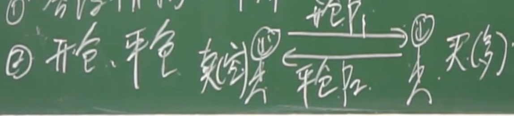
4. 和股票不一样，期货市场交**保证金交易制度**，不需要买卖双方参与，只需要向期货交易市场交钱即可
5. 买方如何赚钱，卖方如何亏钱（杠杆）。双方必须有保证金，如果交不上就强行平仓（就是强行进行买卖交易，不仅亏了货，还倒欠交易所保证金）

   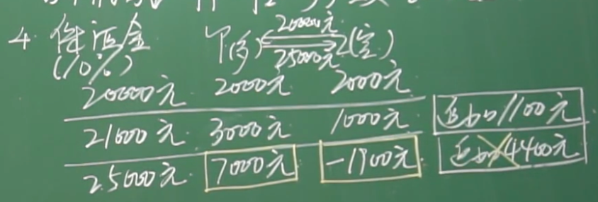
6. 为什么WTI原油期货价格会变成负数？因为期货是要交货的，负数表述我不仅不要这些油，并且我还倒贴钱给你，你把这些油拿走然后找地方存起来

# 井底之蛙如何看到广阔天空？猫眼（门镜）啥原理？

1. 凹透镜：正立缩小的虚像（物体在f以外），凸透镜：正立放大的虚像（物体在f以内）
2. 利用一个凹透镜，一个凸透镜组合在一起，可以将外面的物体缩小，然后再放大，这就是猫眼原理；并且屋外的看不到屋内的

   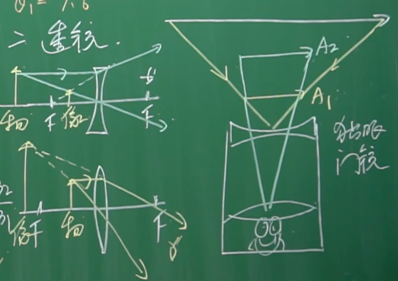

# 英国首席科学家嘴里的“群体免疫”真能有效吗？病毒多久能传染整个欧洲？

1. 不同疾病的R0传播数值

   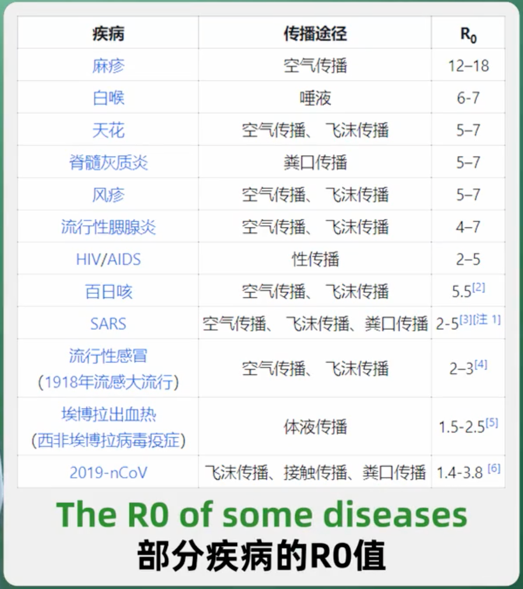
2. 人群中，对病毒免疫人群为P，不免疫人群为1-P，则为了获得群体免疫效果，也就是说为了把R0降低为1以下，需要R0(1-P)这么多人<1
3. 对于新冠病毒来说，R0\~3，则要想获得群体免疫，需要感染人群达到66.7%

# 美股一周两次熔断，中美股民谁更赚钱？股票指数是什么？

1. 查尔斯\*道，于1896年选择了12只工业股，40.94作为基准股票；后来于1928年把12支扩充到30支，10月1日，基准点100
2. DJIA指数有问题：高价股影响大（因为他的算法就是价格的简单平均）；30支股票太少，无法影响整体，因此出现了标普500和纳斯达克股票
3. 上海综合指数SSEC：流通+不流通，所有上市公司的市值加权（不像DJIA是股价加权），基准点为100
4. 深圳成分指数：流通，500个上市公司市值加权，基准点为1000

   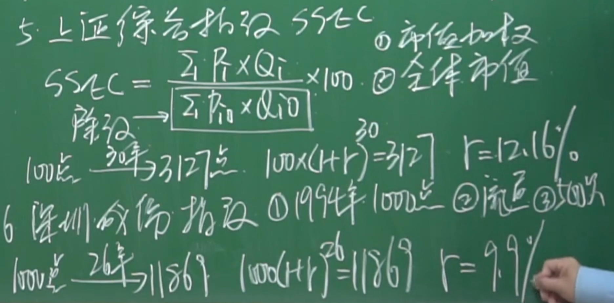

# 牛顿在家躲瘟疫时干了什么?红外线温度计啥原理?太阳的温度咋测的

1. 可见光波长400\~760nm；红外线：760nm\~1mm
2. 红外光的用途：遥控器、遥测（不容易色散）、夜视、测温

   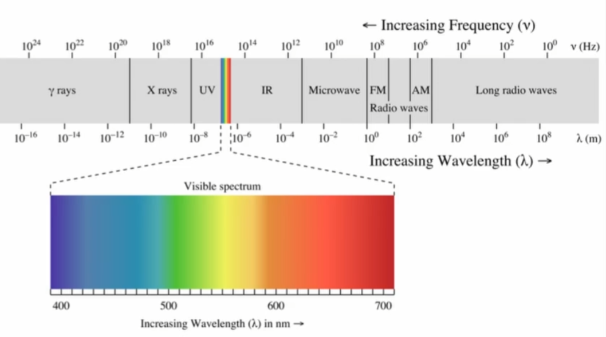
3. 玻尔兹曼定律：P=sigma\*T^4。意思是物体温度与它所发射的功率存在4次方的关系，如果知道功率，则可以反推物体温度
   1. 这就是人类测量太阳表面温度的方式（5700K）

# 如何正确使用酒精消毒？84消毒液和洁厕灵混着用会发生什么？

1. 酒精杀毒的原理：外部浓度高，细胞内脱水；酒精进入细胞内部破坏蛋白质；使得细胞膜（磷脂层）溶解
2. 浓度不能太高（脱水速度过快，没有效果）；要擦拭，不要喷
3. 84消毒液于1984年发明，主要成分为NaClO，具有强氧化性，与酒精混合后无毒，只是没有杀菌效果了；与洁厕灵混合后产生有毒气体氯气

# “冠状病毒”是什么？新型肺炎病毒是如何使人生病的？

1. 烟草花叶病毒是人类研究的第一个病毒
2. 病毒是介于生命体和非生命体之间的物质
3. 噬菌体是一种病毒，专门吃细菌，它是病毒家族里数量最多的病毒
4. 病毒=RNA+蛋白质
5. 抗生素对所有病毒无效，原因是抗生素用来破坏细菌的细胞壁，而病毒没有细胞壁
6. 病毒只能依靠自身的免疫力来清除

# 细菌对人类有什么作用？为什么要勤洗手、戴口罩？

1. 巴氏消毒法就是巴斯德发明的，巴斯德于1864年通过鹅颈平证明了空气中存在细菌，正是细菌导致了肉汤的腐烂
2. 细菌的形状：球状（葡萄球菌）、杆状（大肠杆菌）、螺旋状（螺旋弧菌）
3. 细菌的结构：DNA+细胞质+细胞膜+细胞壁+夹馍（夹馍特别滑，晚上吃东西不刷牙睡觉后早上起来牙齿很滑，就是有很多细菌）
4. 细菌在遇到极端环境时会进入芽孢状态，也就是休眠，生存能力极强；阿波罗登月，一个摄像机围绕月球两年，回到地球上可以继续生存

# 史上最靓身份证号即将诞生！李永乐老师揭秘身份证号码的秘密

1. 身份证后4位。前三位是顺序号，由各个派出所决定，且第三位为奇数表示男性，为偶数表示女性

# 屁为什么是臭的？人为什么能闻到上万种气味？李永乐老师讲嗅觉

1. 人的鼻腔上方有嗅上皮，只有几cm2的面积；嗅上皮的嗅觉细胞是神经细胞，一旦受损很难恢复
2. 嗅觉传递给大脑的速度超过了视觉和听觉（均需要经过下丘脑），原因可能是嗅觉在视觉和听觉感官之前形成，它是一种更为基础的感觉
3. 小狗刚生出来眼睛还没睁开，就可以依靠嗅觉寻找狗妈妈的奶头
4. 人舌头只能分辨5种味道：酸甜苦辣咸，更多的味道依靠是鼻腔（可以尝试吃东西的时候把鼻子捏住，就感受不到食物的味道了）
5. 精子依靠卵子发出的气味，向着卵子游过去
