# 《李永乐西瓜视频》2

## 目录

- [房贷合同要变了，LPR利率和固定利率哪个合算，会影响房价走势吗?](#房贷合同要变了LPR利率和固定利率哪个合算会影响房价走势吗)
- [如何制造一颗原子弹？氢弹又是什么原理？](#如何制造一颗原子弹氢弹又是什么原理)
- [别被高价“不粘锅”忽悠了！李永乐老师讲莱顿弗罗斯特效应](#别被高价不粘锅忽悠了李永乐老师讲莱顿弗罗斯特效应)
- [天空为什么是蓝的？](#天空为什么是蓝的)
- [天猫“双11”2684亿销售额造假了吗？用本福特定律检验一下](#天猫双112684亿销售额造假了吗用本福特定律检验一下)
- [如何才能摆脱贫穷?穷人和富人有什么差别?](#如何才能摆脱贫穷穷人和富人有什么差别)
- [外星人如何才能发现地球？李永乐老师解读诺贝尔物理学奖](#外星人如何才能发现地球李永乐老师解读诺贝尔物理学奖)
- [钱学森弹道和乘波体飞行器是什么？东风17导弹能在太空打水漂吗？](#钱学森弹道和乘波体飞行器是什么东风17导弹能在太空打水漂吗)
- [量子足浴盆排毒：谋财又害命！李永乐老师告诉你哪些保健品不能买](#量子足浴盆排毒谋财又害命李永乐老师告诉你哪些保健品不能买)
- [日本房地产是如何崩盘的?广场协议是美国的阴谋吗](#日本房地产是如何崩盘的广场协议是美国的阴谋吗)
- [庞氏骗局是什么？如何识别传销诈骗？](#庞氏骗局是什么如何识别传销诈骗)
- [宇宙为什么会大爆炸？星际旅行用什么燃料?](#宇宙为什么会大爆炸星际旅行用什么燃料)
- [史上最有钱的公司是哪个?牛顿炒股赔了几十年工资](#史上最有钱的公司是哪个牛顿炒股赔了几十年工资)
- [一朵花换一栋楼？疯狂的荷兰郁金香和长春君子兰](#一朵花换一栋楼疯狂的荷兰郁金香和长春君子兰)
- [一滴水从高处落下会砸死人吗？雨滴的形状远不是你想的那样！](#一滴水从高处落下会砸死人吗雨滴的形状远不是你想的那样)
- [陀螺为什么不会倒？自行车如何保持平衡？](#陀螺为什么不会倒自行车如何保持平衡)
- [香港、台湾和大陆，哪里贫富差距大？李永乐老师讲基尼系数](#香港台湾和大陆哪里贫富差距大李永乐老师讲基尼系数)
- [台风利奇马来袭，摩天大楼如何应对？李永乐老师讲风阻尼器](#台风利奇马来袭摩天大楼如何应对李永乐老师讲风阻尼器)
- [地球的半径和质量都是怎么测量出来的?](#地球的半径和质量都是怎么测量出来的)
- [『无限能源搅拌杯』倒热水自动搅拌,能量从哪来?](#无限能源搅拌杯倒热水自动搅拌能量从哪来)
- [摩托车压弯为啥不会倒？火车转弯处铁轨为啥是斜的？](#摩托车压弯为啥不会倒火车转弯处铁轨为啥是斜的)
- [杨振宁为啥得诺贝尔奖?镜子里外的世界一样吗?李老师讲宇称不守恒](#杨振宁为啥得诺贝尔奖镜子里外的世界一样吗李老师讲宇称不守恒)
- [锂电池安全吗?电动汽车为什么会自燃?李永乐老师教你安全使用电池](#锂电池安全吗电动汽车为什么会自燃李永乐老师教你安全使用电池)
- [静脉曲张竟然引起大喷血？李永乐老师告诉你如何预防和治疗？](#静脉曲张竟然引起大喷血李永乐老师告诉你如何预防和治疗)
- [宜宾地震，成都为何能提前61秒预警？李永乐老师讲地震预警原理](#宜宾地震成都为何能提前61秒预警李永乐老师讲地震预警原理)
- [茅台的股票为啥这么贵？如何用市盈率、市净率衡量股票价值？](#茅台的股票为啥这么贵如何用市盈率市净率衡量股票价值)
- [如何判断股票的价格是否合理？李永乐老师讲『贴现法』对股票估值](#如何判断股票的价格是否合理李永乐老师讲贴现法对股票估值)
- [音乐也有科学道理？哆唻咪到底是咋定的？李永乐老师讲乐理知识](#音乐也有科学道理哆唻咪到底是咋定的李永乐老师讲乐理知识)
- [个人所得税计算方法](#个人所得税计算方法)
- [汽车发动机啥原理?排量、缸数、涡轮增压是啥?李永乐老师讲内燃机](#汽车发动机啥原理排量缸数涡轮增压是啥李永乐老师讲内燃机)
- [首张黑洞照片咋拍的?事件视界望远镜EHT是什么?李永乐老师告诉你](#首张黑洞照片咋拍的事件视界望远镜EHT是什么李永乐老师告诉你)
- [四川凉山火灾爆燃是什么?消防知识不得不学!李永乐老师讲轰燃爆燃](#四川凉山火灾爆燃是什么消防知识不得不学李永乐老师讲轰燃爆燃)
- [石墨烯是什么？骗局还是未来黑科技？李永乐老师讲碳的同素异形体](#石墨烯是什么骗局还是未来黑科技李永乐老师讲碳的同素异形体)
- [万有引力是如何发现的?牛顿和胡克为啥是死对头?李永乐老师告诉你](#万有引力是如何发现的牛顿和胡克为啥是死对头李永乐老师告诉你)
- [粒子也有波动性吗?什么是物质波?李永乐老师讲德布罗意公爵的故事](#粒子也有波动性吗什么是物质波李永乐老师讲德布罗意公爵的故事)
- [麦克斯韦方程组是什么?电场磁场啥关系?李永乐老师讲最美物理公式](#麦克斯韦方程组是什么电场磁场啥关系李永乐老师讲最美物理公式)
- [传销能挣钱吗？买贵了退差价咋回事？李永乐老师讲一美元拍卖陷阱](#传销能挣钱吗买贵了退差价咋回事李永乐老师讲一美元拍卖陷阱)
- [流浪地球中“引力弹弓”效应是啥?李永乐老师教你如何逃出太阳系](#流浪地球中引力弹弓效应是啥李永乐老师教你如何逃出太阳系)
- [比特币交易如何防伪?私钥公钥地址啥意思?李永乐老师讲比特币](#比特币交易如何防伪私钥公钥地址啥意思李永乐老师讲比特币)
- [什么是波？什么是波的干涉？李永乐老师讲神奇的驻波实验](#什么是波什么是波的干涉李永乐老师讲神奇的驻波实验)
- [ABO血型啥区别？父母能给孩子输血吗?李永乐老师讲造血干细胞移植](#ABO血型啥区别父母能给孩子输血吗李永乐老师讲造血干细胞移植)
- [外星人存在吗？人类为什么看不到外星文明？李永乐老师讲费米悖论](#外星人存在吗人类为什么看不到外星文明李永乐老师讲费米悖论)
- [日光灯是如何点亮的？节能灯为啥节能？李永乐老师讲荧光灯原理](#日光灯是如何点亮的节能灯为啥节能李永乐老师讲荧光灯原理)
- [农历就是阴历吗?二十四节气和闰月是咋回事?李永乐老师讲中国历法](#农历就是阴历吗二十四节气和闰月是咋回事李永乐老师讲中国历法)

# 房贷合同要变了，LPR利率和固定利率哪个合算，会影响房价走势吗?

1. 利率=基准利率 \*（1+浮动）；其中中央银行给出基准利率，而银行自己可以调整浮动利率

   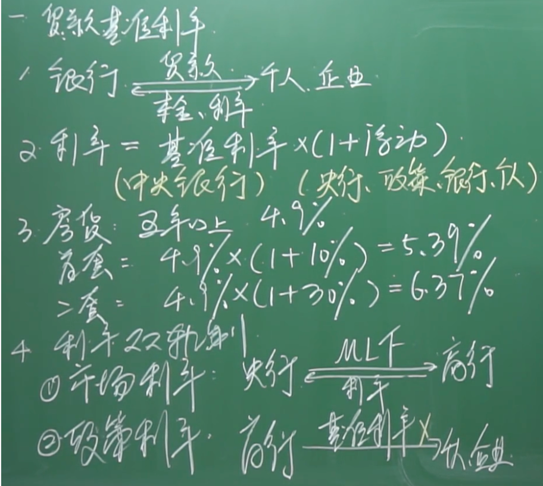
2. 利率双轨制。市场利率是央行通过MLF贷款给商行的一种利率，商行根据MLF自己选择向不向央行借钱；政策利率是商行贷款给个人/企业的利率，是央行决定的。存在政策利率受到政府干扰问题，为了避免政策干扰，用LPR利率取代固定基准利率

   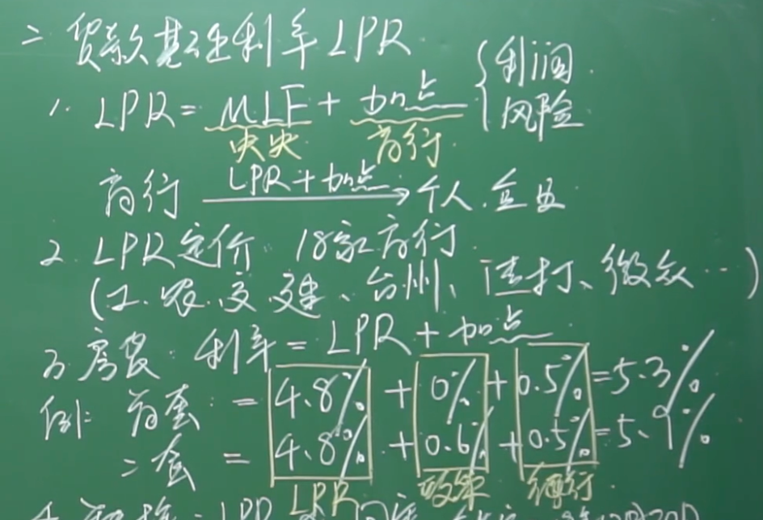
3. LPR=MLF（央行决定）+加点（18家银行共同投票决定）
4. 商行给个人/企业的住房贷款利率=LPR+加点（根据企业和个人的信用情况）

# 如何制造一颗原子弹？氢弹又是什么原理？

1. 原子弹。核裂变链式反应，1个中子撞击1个235浓缩铀，释放Ba+Kr+3个中子，释放出的3个中子继续反应，质量发生亏损，释放能量
2. 氢弹。1个氘+1个氚聚变成为1个He，并释放1个中子，质量发生亏损，释放能量；太阳里的反应，只有1/22亿的能量抵达了地球

# 别被高价“不粘锅”忽悠了！李永乐老师讲莱顿弗罗斯特效应

1. 两个温差特别大的物体在接触后，其中一个液体剧烈沸腾，在两者之间形成一层蒸汽保护层，阻止热量进一步散走。比如手打铁水、液氮洗澡
2. 空气是一层很好的隔热层。冬天室外不穿衣服，在绝对没有风的场景下其实不冷；北极熊毛也不厚，但是有空气层所以保暖；气凝胶衣服

# 天空为什么是蓝的？

1. 黑体辐射：只向外辐射，不吸收的物体；太阳就是一个黑体；黑体辐射能量在不同波段的曲线呈现一个钟罩型，这种特性使得我们人眼进化成了能够看见可见光

   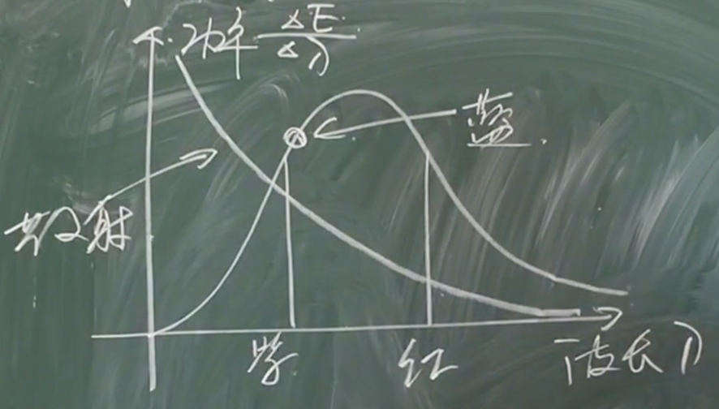
2. 波长越长，散射能力越弱，波长越短，散射能力越强
3. 月亮上没有大气层，没有散射，所以天空都是黑的，不是蓝的
4. 日出、日落的时候，太阳光斜照着地面，经过了厚厚的大气层，蓝光被散射掉，只剩下红光
5. 颗粒物尺寸远远小于光波波长尺寸：符合瑞利金斯散射公式

# 天猫“双11”2684亿销售额造假了吗？用本福特定律检验一下

1. 10进制数中，首位为n的概率，Pn=lg(n+1/n)

   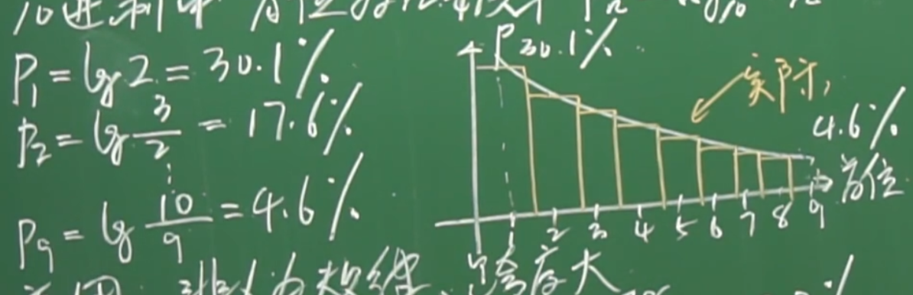
2. 非人为规律、数据数量级跨度大的数据才行。视频播放量、国家国土面积、国家人口、GDP、放射性元素半衰周期

# 如何才能摆脱贫穷?穷人和富人有什么差别?

1. 家长对孩子教育的重视程度最能影响教育的质量
2. 穷人的问题在于对自己没信心，不相信自己可以摆脱贫困陷阱，所以你给他钱，他会把钱花在其他地方，不注重对自己的投资

# 外星人如何才能发现地球？李永乐老师解读诺贝尔物理学奖

1. 如何发现地外行星存在的证据？视向速度法。通过观察旁边恒星的周期红移和蓝移现象来判断行星的存在（双星系统会导致恒星产生微小移动，进而产生光谱的多普勒频移）。具体判断的方法就是观察恒星的吸收光谱的移动范围，结果在3x10^-10m
2. 凌日法。通过观察恒星阳光被周期性遮挡的周期来判断是否有行星存在

# 钱学森弹道和乘波体飞行器是什么？东风17导弹能在太空打水漂吗？

1. 打水漂必须得有自旋，利用陀螺的定向原理保持方向不变，角度与水面呈现20°左右夹角
2. 打水漂原理还可以运用在导弹上，从空中投递高速旋转的导弹，到达水面上后可以跳跃
3. 巡航导弹：喷气式发动机+弹翼，2500km，0.7马赫（900km/h）
4. 弹道导弹（V-2导弹）：火箭发动机，10000km，4.8马赫，可以飞出大气层；土星五号搭载阿波罗飞船
5. 乘波体：超音速导弹会有，后面的声波会与前面的声波发生嵌套

   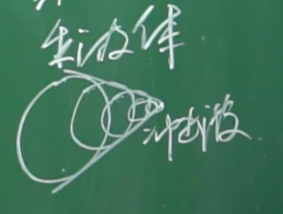

# 量子足浴盆排毒：谋财又害命！李永乐老师告诉你哪些保健品不能买

1. 碘酒+淀粉变蓝色的原理：I2+I离子->I3离子，与淀粉中的螺旋结构的直链淀粉发生反应，吸收其他光谱，反射蓝色光谱，造成蓝色

# 日本房地产是如何崩盘的?广场协议是美国的阴谋吗

1. 美国与日本有贸易逆差，美国通过货币贬值的方式降低逆差，导致日本出口受阻，日本银行为刺激经济，降低贷款利率；同时日元升值，国际资金涌入

# 庞氏骗局是什么？如何识别传销诈骗？

1. 如何识别传销组织，三连问：有没有商品、一年的利率有多少、有没有制造紧迫感

# 宇宙为什么会大爆炸？星际旅行用什么燃料?

1. 利用反物质作为燃料，反物质是把全部质量转化为能量，而不是现在核裂变和核聚变的质量亏损

# 史上最有钱的公司是哪个?牛顿炒股赔了几十年工资

1. 荷兰东印度公司，市值7.9万亿美元；从东印度海运香料到欧洲售卖
   1. 第一个股份制公司，14个小公司联合创立
   2. 第一个发股息的公司（股票发利息）
   3. 第一个有董事会的公司（管理公司股权）
   4. 第一个证券交易（股票不可退还，只可转让）
2. 密西西比公司，市值6.5万亿美元；从非洲贩卖奴隶到北美，实际是一种债转股玩法，泡沫公司
3. 英国南海公司，市值4.3万亿美元；同样是债转股公司

# 一朵花换一栋楼？疯狂的荷兰郁金香和长春君子兰

1. 第一个期货概念从郁金香狂热案例中诞生；1637年左右发生，价值最高的一朵郁金香可以购买相当于几千万美元的豪宅
2. 长春君子兰。非洲到日本，再到北京，流落到民间长春；1985年左右发生，价值最高的君子兰14万元，可在北京购买5套房

# 一滴水从高处落下会砸死人吗？雨滴的形状远不是你想的那样！

1. 空气阻力与速度平方呈正比，雨滴的阻力公式f=1/2*p*v2*Cd*A；其中A为雨滴的投影面积，运用简单的运动方程，得到最大速度为

   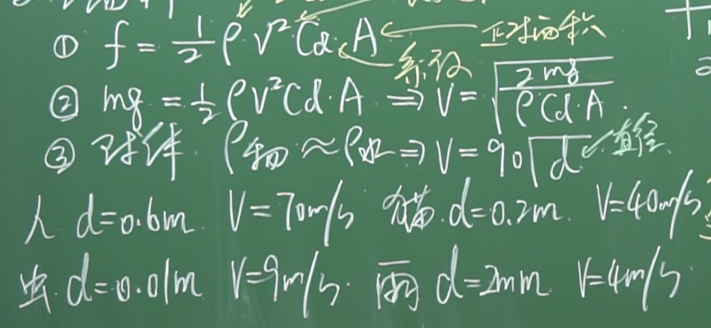
   1. 简化版公式v=90\*sqrt(d)，d为水滴直径；意思是直径越大，收尾速度越快，因此昆虫落地的速度很慢，只有9m/s
2. 雨滴的收尾速度为2\~10m/s。雨滴在下落过程中处于不断加速，减速的过程，原因是质量变大后因为阻力变大，导致水滴破裂

   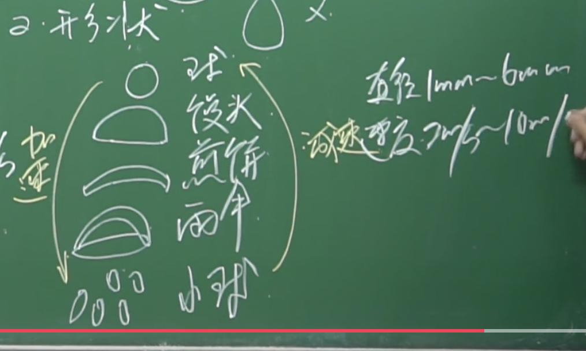

# 陀螺为什么不会倒？自行车如何保持平衡？

1. 一个质点在一条直线上运动，则相对于直线外O点来说，角动量守恒：

   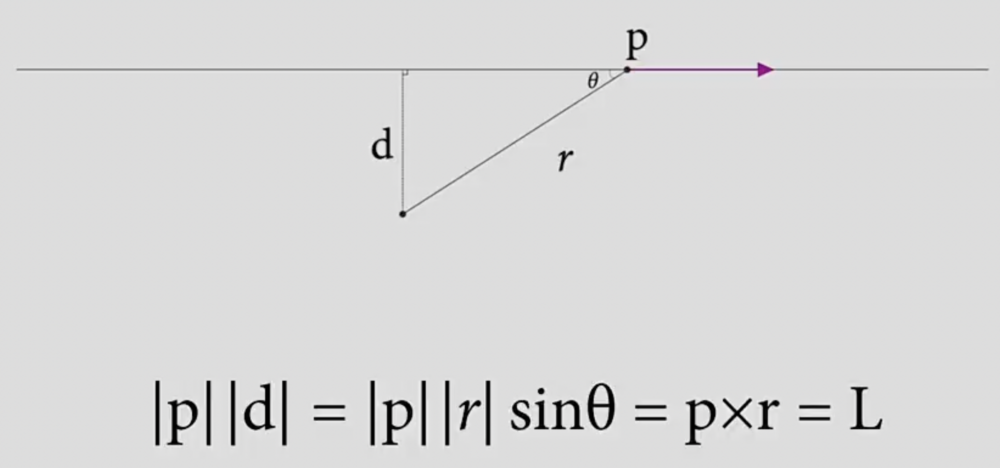

   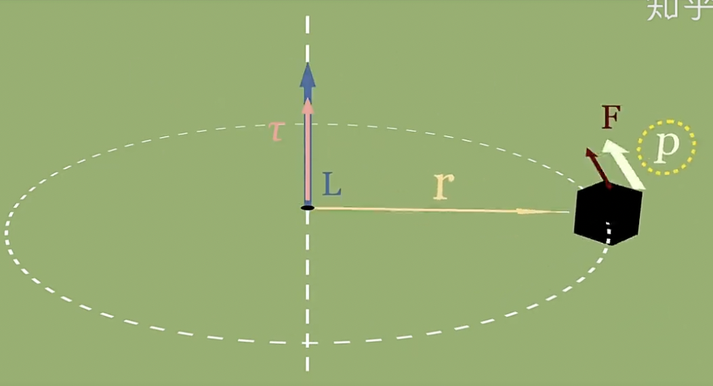
2. 角动量的方向是伪矢量，并不代表真实的运动方向
3. 一个旋转的陀螺有两个角动量，一个是旋转陀螺本身的角动量方向，方向向上；一个是重力距方向，方向平行于水平面，如下图所示

   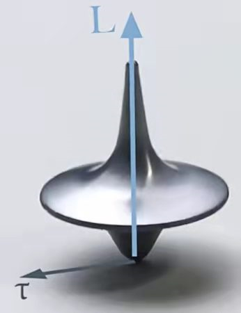

   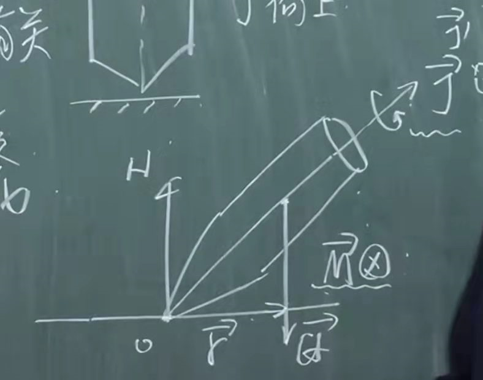

# 香港、台湾和大陆，哪里贫富差距大？李永乐老师讲基尼系数

1. 基尼系数计算方法：G=S1/(S1+S2)（横坐标为财富水平，纵坐标为财富累计值），G越小则财富分配越均匀，G越大则财富分配越不均匀

   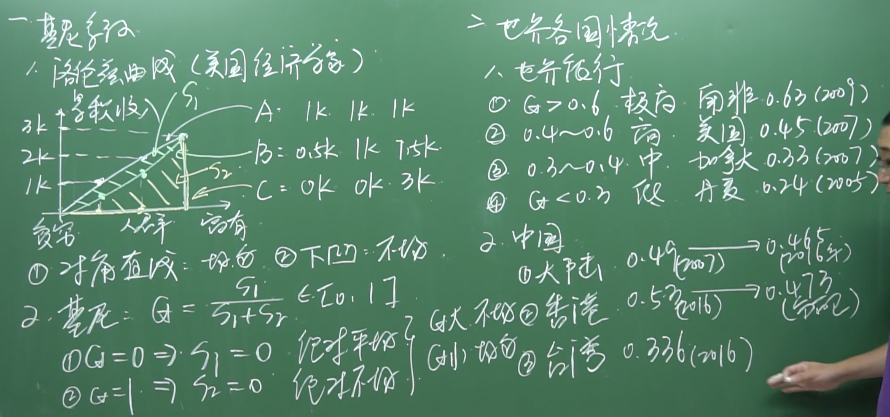

# 台风利奇马来袭，摩天大楼如何应对？李永乐老师讲风阻尼器

1. 阻尼器作用原理是通过二级减震系统，将大质量块的运动动能转移给小质量块的运动动能，并以内能（油阻尼杆）或者电能（涡流阻尼器）的方式耗散掉
2. 设计思路：
   1. 设计m2和k2，使得质量块的减震频率与大楼减震频率相同
   2. 设计c2，使得减震后的系统谐振峰值控制在合适的范围内
3. 台北101大楼的质量块660t，大楼周期6.8s，因此吊索的长度需要有11.5m（单摆周期公式：T=2pi\*sqrt(L/g)）；台风利奇马曾经让101大楼的质量块摆幅1m（设计值为1.5m）

   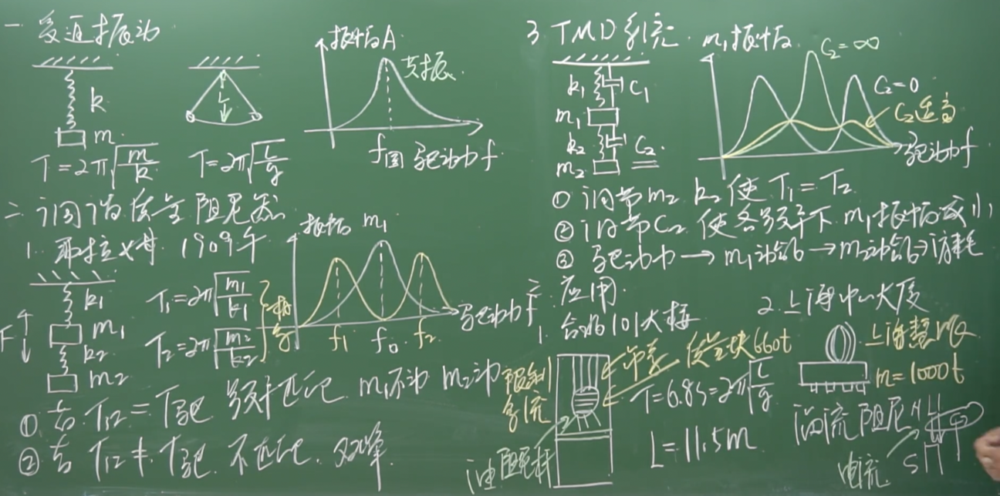

# 地球的半径和质量都是怎么测量出来的?

1. 通过万有引力公式测算。必须得知道常数G。这个数值由卡文迪许在实验室测量得到。方法是用一根细线吊着两个铅球，并再用两个铅球吸引，测量转动角度得出
2. 人类首先测量的是地球半径，其次是重力加速度，最后是地球质量。卡文迪许被称为测出地球质量的人
   1. 地球半径：古埃及通过观察两地太阳倾角，通过弧角公式，计算地球半径
   2. 重力加速度：自由落体实验

      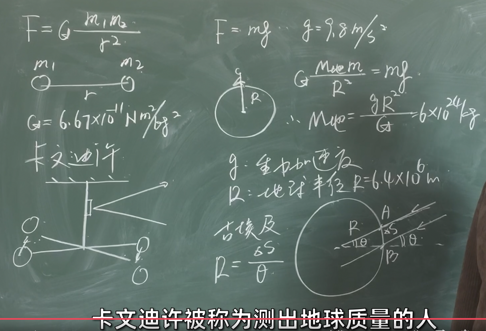

# 『无限能源搅拌杯』倒热水自动搅拌,能量从哪来?

1. 热电效应，即热生电。一头冷，一头热的金属丝，热那端的金属丝电子剧烈运动，会跑到冷那端的金属丝，导致热那端电子少，带正电，冷那端带浮负电，形成温差电动势

   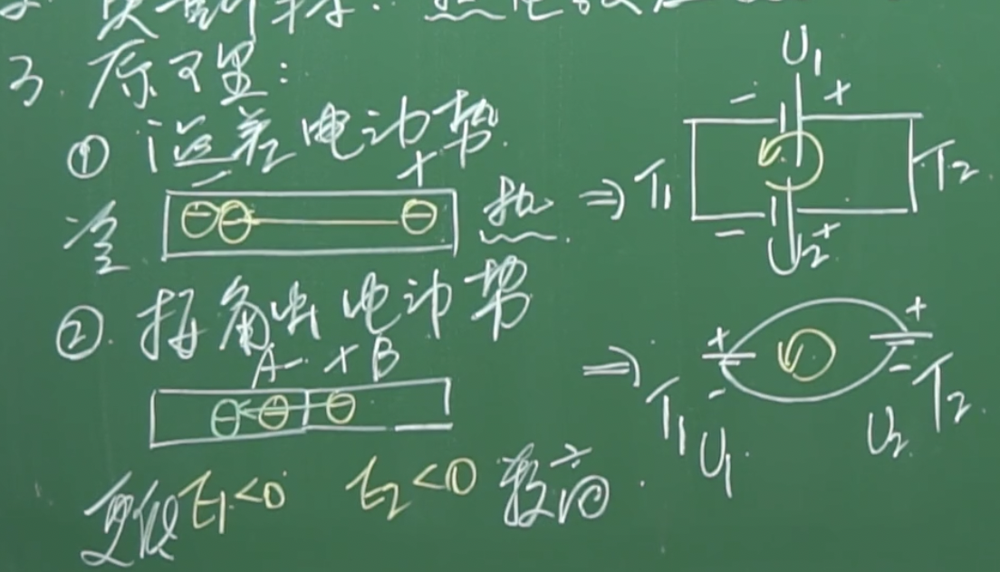

# 摩托车压弯为啥不会倒？火车转弯处铁轨为啥是斜的？

1. 是为了在转弯时，侧向的摩擦力后者合力能够提供向心力，否则摩托车或者火车可能会因为速度过快侧翻被甩出去

# 杨振宁为啥得诺贝尔奖?镜子里外的世界一样吗?李老师讲宇称不守恒

1. 时间平移对称——能量守恒
2. 空间平移对称——动量守恒
3. 空间旋转对称——角动量守恒

# 锂电池安全吗?电动汽车为什么会自燃?李永乐老师教你安全使用电池

1. Zn-Cu电池，利用Zn金属化学性质活泼的特性，容易释放电子，作为正极材料

   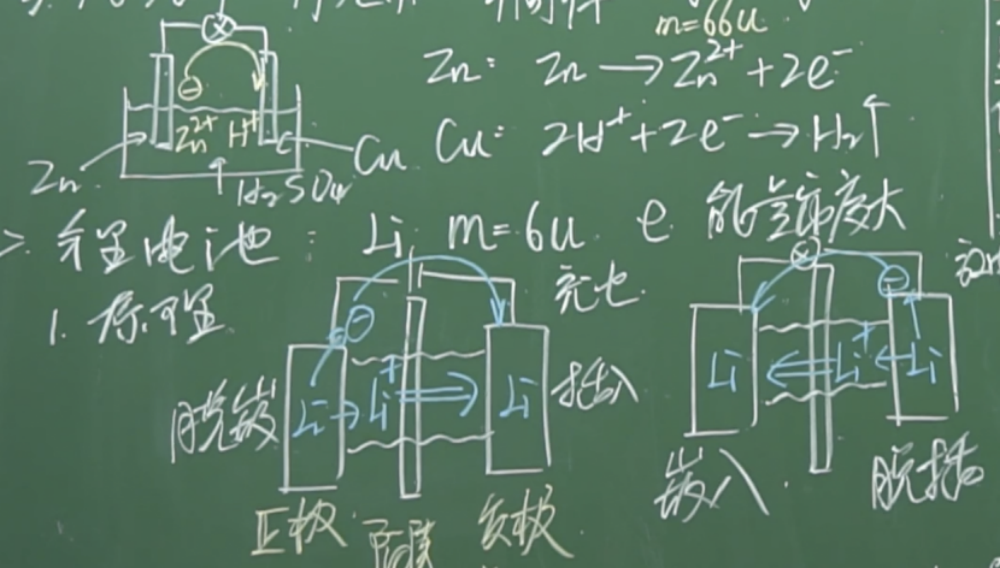
2. 特斯拉采用了18650电池，8000节

# 静脉曲张竟然引起大喷血？李永乐老师告诉你如何预防和治疗？

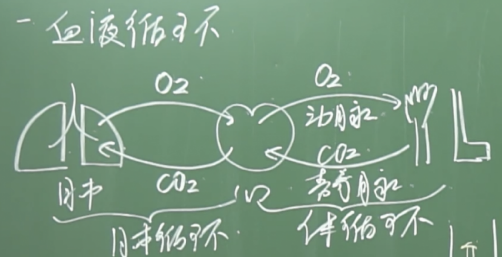

1. 静脉曲张出现在血液体循环过程中，久站不动容易出现。解决办法是多走动，长时间坐着需要抬抬腿，或者踮脚也可以缓解

# 宜宾地震，成都为何能提前61秒预警？李永乐老师讲地震预警原理

1. P波为纵波，传播快7km/s，危害小；S波为横波，传播慢4km/s，危害大；地震预测原理为利用P和S的传播速度差，在震源正上方检测到P波后告知周边的地区

   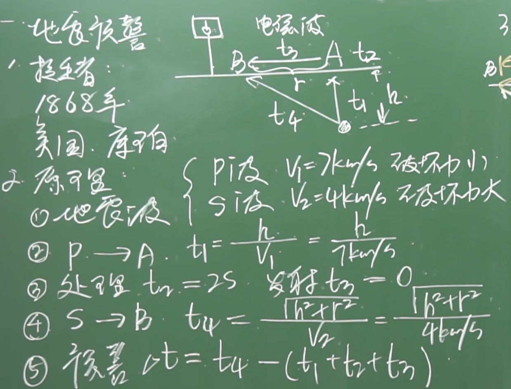

# 茅台的股票为啥这么贵？如何用市盈率、市净率衡量股票价值？

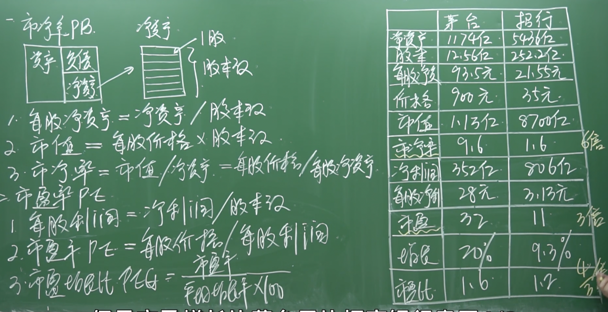

1. 市净率PB=市值/净资产=每股价格/每股净资产
   1. 市值=每股价格\*股数
   2. 每股净资产=净资产/股数
   3. 含义：每一个单位的净资产对应多少市值，越高说明市场越认可这只股票，但是风险也越高；越低说明市场不认可这只股票，是投资的好时机
2. 市盈率PE=每股价格/每股利润
   1. 每股利润=净利润/股数
   2. 含义：单位利润需要多少股价投入，越高说明投资回报周期越长，比如900元买一股茅台股票，则需要32年才能拿回900元的投资

# 如何判断股票的价格是否合理？李永乐老师讲『贴现法』对股票估值

1. 贴现率：今后某天X元，折算到今天值多少钱。这个概念可以对债券、股票进行估值，通过计算每年分红折算到今天的估值是否超过了股票本身价值来判断这只股票是否值得购买

   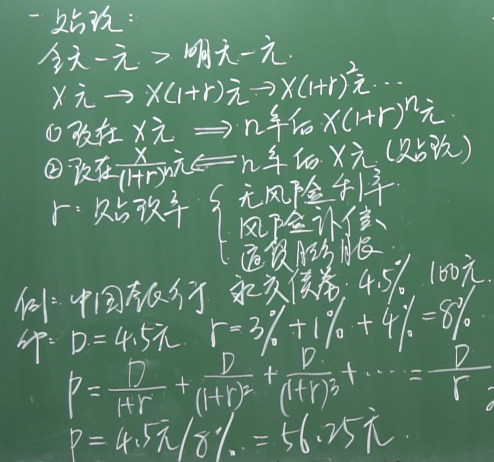

# 音乐也有科学道理？哆唻咪到底是咋定的？李永乐老师讲乐理知识

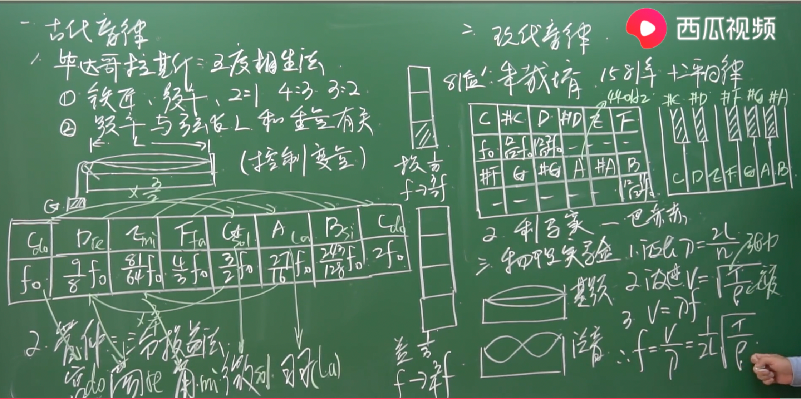

1. 古代音律：毕达哥拉斯的五度相生法
   1. 具备2：1，4：3，3：2的频率差的音乐具有一种美感
   2. 问题：无法转调。因为不同音之间的频率之差不固定
2. 现代音律：朱载堉的十二平均音律
   1. 1581年提出。解决了转调问题，即任意两个音之间的频率之比为定值，全音律为等比数列
   2. 1个八度平均12等分，2个八度之间的频率相差1倍，所以相邻两个音的频率之差为12次根号2

# 个人所得税计算方法

1. 年终奖之所以有盲区，是因为速算扣除数只算了一遍，扣少了，需要多扣一些，这样拿的更多
2. 速算扣除数是为了直接用应纳税收入乘以对应税率而发明的概念，不用逐级计算

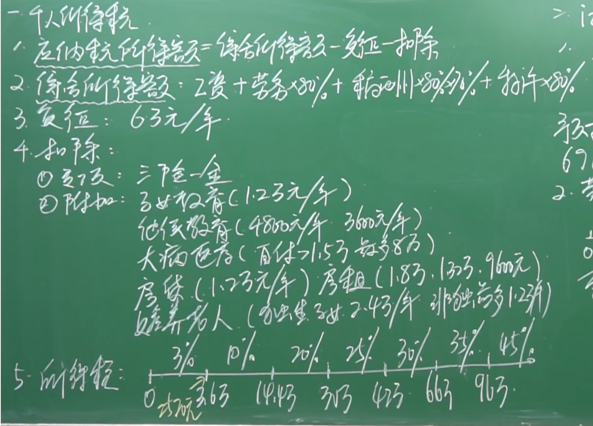

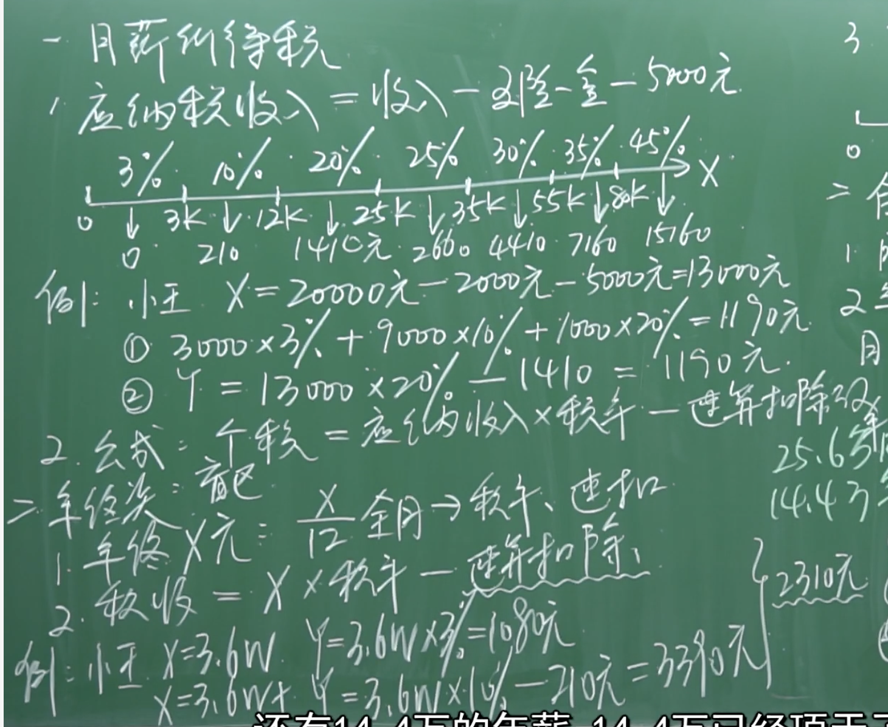

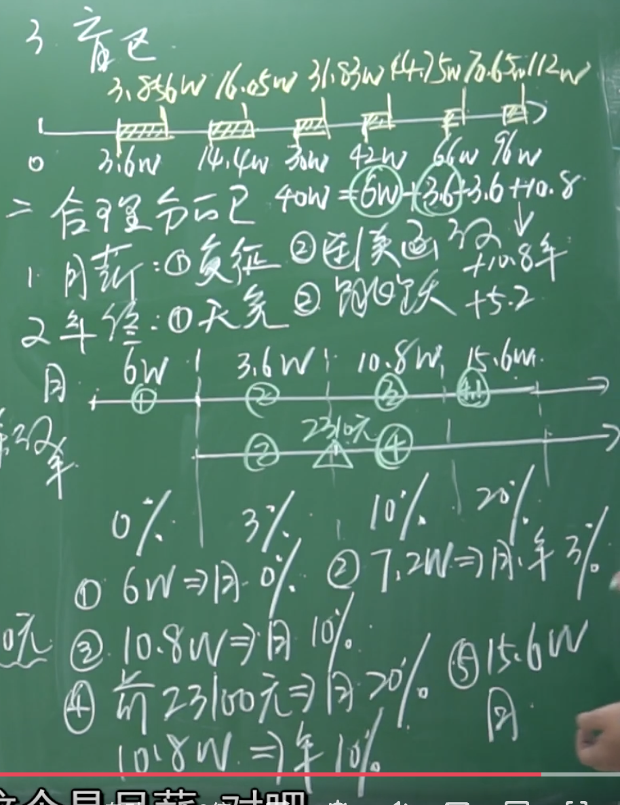

# 汽车发动机啥原理?排量、缸数、涡轮增压是啥?李永乐老师讲内燃机

1. 原理是奥托循环，早期的BMW工厂。
2. 吸气，压缩点火，做功，排气。刚好4个阶段，为了让输出功率更加平顺，至少需要4缸；缸数越多，功率越平顺，动力越猛

   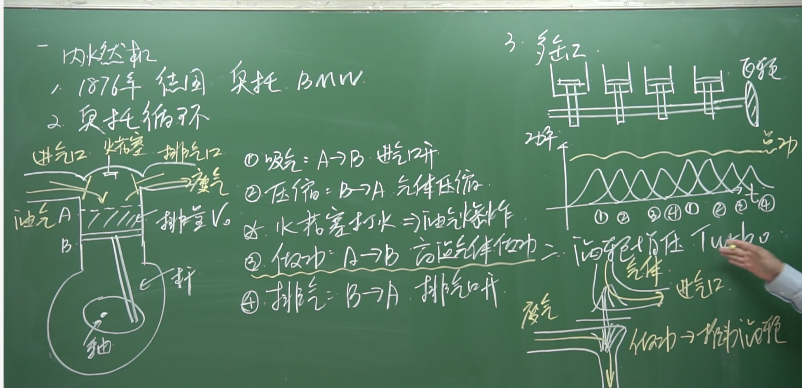

# 首张黑洞照片咋拍的?事件视界望远镜EHT是什么?李永乐老师告诉你

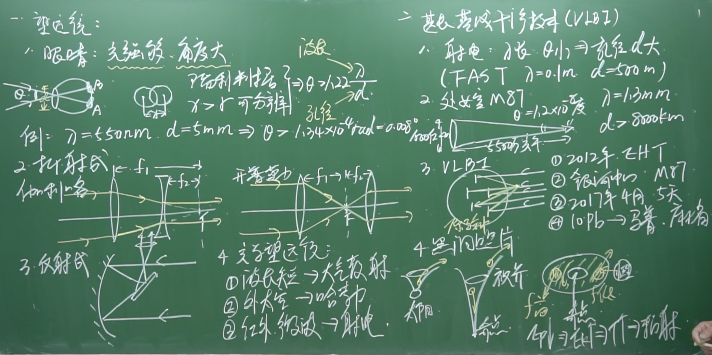

1. 瑞利判据：想要通过一个透镜成像观察清楚一个物体，必须满足theta>1.22\*lumba/d这个公式。想要分辨一个小角度theta的物体，尽可能用短波长，大孔径的透镜
2. 人眼要能看清物体，光强得够，因此望远镜的一大作用就是：汇聚光线
   1. 折射式望远镜。凸透镜+凹透镜（伽利略），凸透镜+凸透镜（开普勒）。存在主要问题是：有色差，画面很模糊，因为是光线折射原理
   2. 反射式望远镜。透过一个抛物线镜面罩反射到一个平面镜上，再汇聚光线
3. 这次的黑洞照片是利用全球各个地区的照片合成，把地球当成一个巨大的孔径去观察

# 四川凉山火灾爆燃是什么?消防知识不得不学!李永乐老师讲轰燃爆燃

1. 轰然。温度驱动，温度过高，达到了CO的燃点（610℃），瞬间点燃室内高空位置的空气，速度非常快，1-2s内
2. 爆燃。氧气驱动，开门窗后氧气涌入，形成剧烈燃烧，可能引发爆炸和冲击波。比轰然更可怕，会出现烟气倒吸现象

# 石墨烯是什么？骗局还是未来黑科技？李永乐老师讲碳的同素异形体

1. 一种同素异形体。石墨是多层结构，层与层之间没有共价键，可以相对滑动，因此石墨具有润滑作用；如果把石墨的一层拿出来，就是石墨烯（单层石墨），烯的意思是C-C双键
2. 2004年两位科学家通过粘胶带的方式发现了单层石墨，并获得了诺贝尔奖
3. 优点：
   1. 机械强度大。比钢铁强200倍。可以替代金属
   2. 拉伸性能好。自身的20%
   3. 导电性能好。和金属差不多
   4. 导热性能好。比Ag好10倍，计算机，手机用次材料散热好，会做的很轻

# 万有引力是如何发现的?牛顿和胡克为啥是死对头?李永乐老师告诉你

1. 1674-1679年，胡克两次给牛顿提醒说万有引力的大小和距离有关系，关系是平方反比，且运动轨迹为椭圆。
   1. 当时的一个数学难点在于：如何从平方反比的万有引力公式，推导出行星的运动轨迹为椭圆，这件事情牛顿用了9页纸做到了（1684年），后来在哈雷的帮助下，3年后，终于完成了《自然哲学的科学原理》旷世之作（1687年）

# 粒子也有波动性吗?什么是物质波?李永乐老师讲德布罗意公爵的故事

1. 光线的波动性：光线透过单缝，形成衍射条纹；光线的粒子性：光电效应实验
2. 德布罗意通过以上结论反推，提出：具有动量p的粒子也应该有波动性，只是不方便观察

   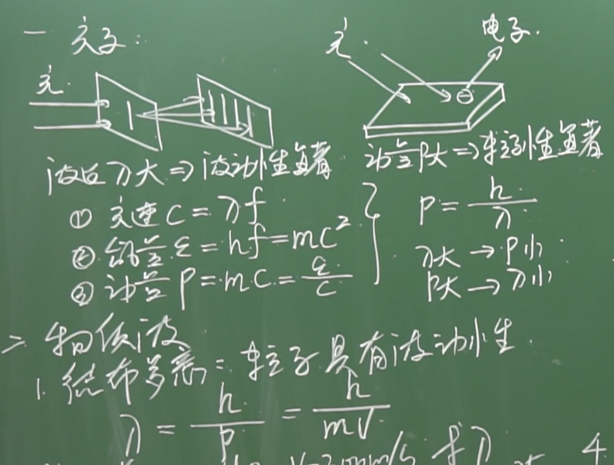
3. 波尔提出的电子轨道化方程里，恰好就可以用德布罗意波方程给出解释：电子轨道之所以只能满足整数方程，就是因为电子在运行轨道上必须满足整数倍驻波解

   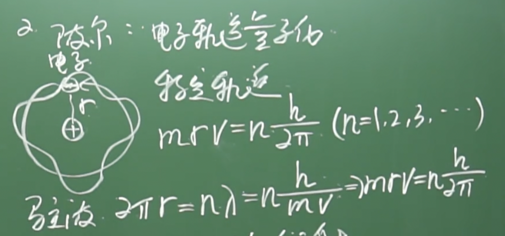
4. GP汤姆孙利用电子和晶体栅格，实现了电子的单缝衍射图，首次看到了粒子的波动性，证实了德布罗意方程

# 麦克斯韦方程组是什么?电场磁场啥关系?李永乐老师讲最美物理公式

1. 曲面积分与路径积分：

   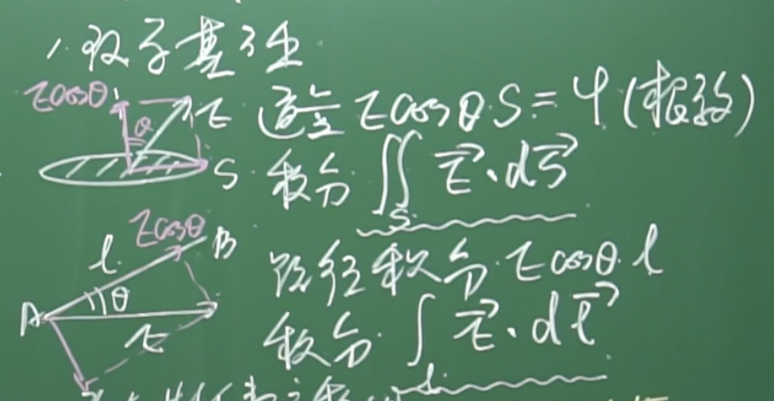
2. 方程1：电场在闭合曲面上的穿过根数（电通量），与包围的电荷量有关。原因是电场是有源场

   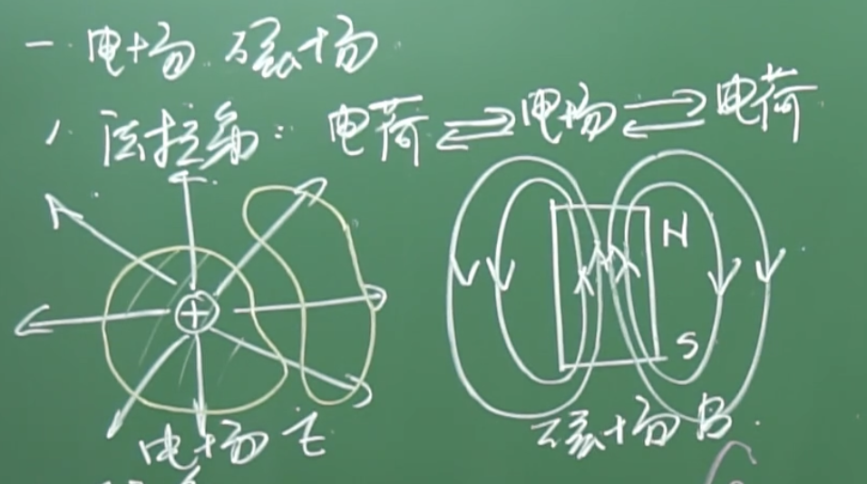

   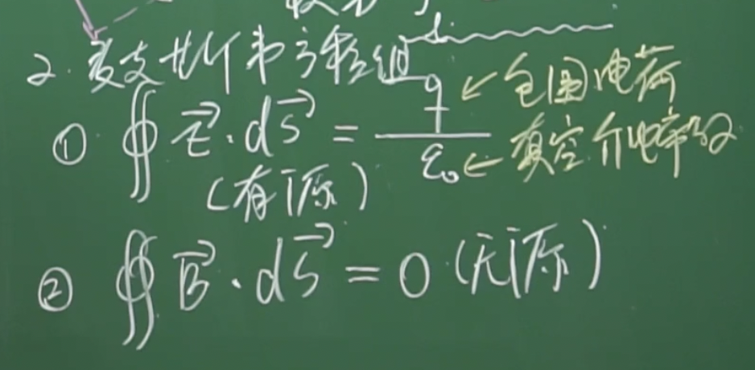
3. 方程2：磁场在闭合曲面的磁通量，永远是0。原因是磁场都是N-S成对出现，任意一个闭合曲线包络的磁感线一定是一对进，一对出
4. 方程3：电场沿着路径积分得到的电动势与磁场磁通量的变化率的方向相反

   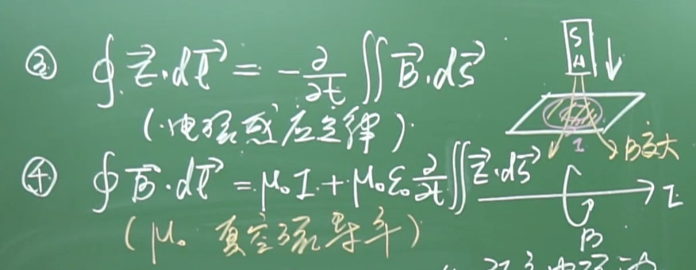
5. 方程4：麦克斯韦提出。变化的磁场应该也能激发电场
6. 最后在真空中，假设q=0，I=0，推导出电场和磁场满足正交90度的行波，且传播速度正好为光速，因此麦克斯韦预测：
   1. 预言电磁波的存在
   2. 且光是一种电磁波，就是电磁波的速度就是光速

# 传销能挣钱吗？买贵了退差价咋回事？李永乐老师讲一美元拍卖陷阱

1. 商家提出：**买贵了，退差价**的这种行为其实是对其他商家的威胁，告诉他们不要和他打价格战，避免陷入恶性循环

# 流浪地球中“引力弹弓”效应是啥?李永乐老师教你如何逃出太阳系

1. 引力弹弓类似于完全弹性碰撞，获得的速度增量是被撞物体自身运动的2倍

# 比特币交易如何防伪?私钥公钥地址啥意思?李永乐老师讲比特币

1. 每一个成功算出数学题的人（工作量证明），都会给予手续费和打包奖励费，这个费就是比特币
   1. 数学题：对字符串做两次HASH256运算，前n位为0表示计算正确，通过调整0的数量来调整计算难度
   2. 字符串内容：表头+账单+时间戳+随机数
2. 比特币设定为每4年比特币数量少一半，因此比特币的发行量只有2100万枚

   每10min打一个包，每一个包50个BTC

   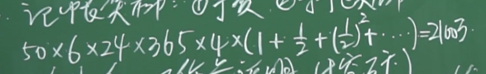
3. 什么是电子签名？

   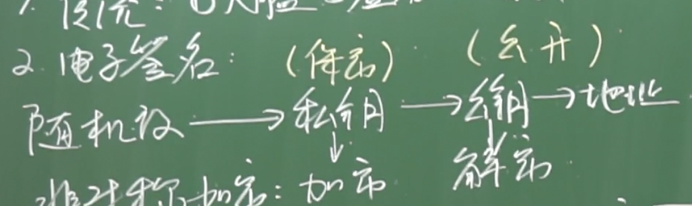

# 什么是波？什么是波的干涉？李永乐老师讲神奇的驻波实验

1. **行波**。就是行走的波，一根绳子一端系在墙上，另一端悬空，抖动一下就是行波
2. **驻波**。就是不动的波，两头都是墙的绳子，不断振动就是驻波
3. 现象解释：鱼洗盆，振动面板米粒。用手在边缘按住不同地方会形成不同的图案，原因是限制了波节，波根据波长重新分配，波的形状就变了

# ABO血型啥区别？父母能给孩子输血吗?李永乐老师讲造血干细胞移植

1. 根据红细胞表面抗原种类区分血型：

   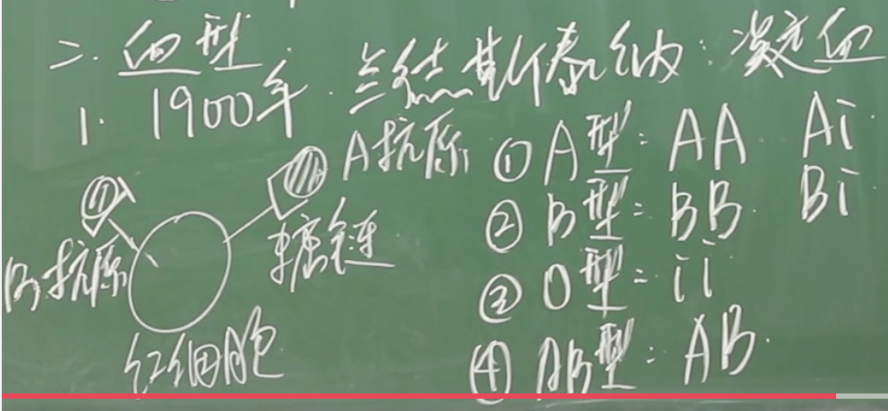
   1. 全是A抗原：A型血（如果所有抗原都是A则为AA，如果一部分有抗原A，一部分没有，则为Ai）
   2. 全是B抗原：B型血
   3. 没有抗原：O型血
   4. 有A和B抗原：AB型血
2. 人体内的血清会对非自身抗原产生抗体，导致血液凝固，血管堵死
   1. 比如A型血的人没有B抗原，如果在接受了AB型血输入时，会针对B抗原产生抗体，导致血管堵死；反过来是可以的，因为AB型的人有A抗原，所以A型血输入给他是没有问题的
   2. AB型血能接受所有人的输血（因为有AB抗原），但是他不能给所有人输血
   3. O型血不能接受任何人输血（没有任何一个抗原），但是可以给所有人输血（没有抗原）
   4. 血型由基因决定，有显隐性区分
   5. 亲生孩子的血型可能与父母不一致，且不能接受父母的输血，出现在父母一个A隐形，一个B隐形，生出一个O型血的孩子

      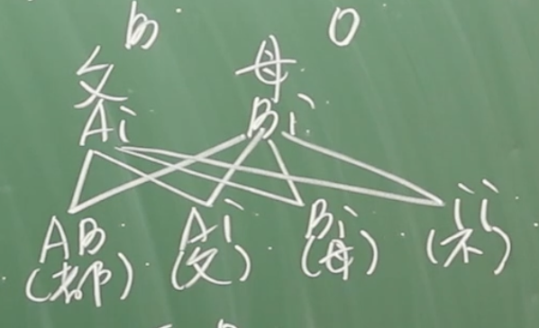
   6. 造血干细胞移植三种办法
      1. 骨髓移植。在髂骨上打洞，抽骨髓500\~1000ml
      2. 外周血。打一周动员剂，手术时抽取50\~100ml血液，再提取造血干细胞
      3. 【推荐，没有伤害】脐带血。在刚出生时保存脐带血

# 外星人存在吗？人类为什么看不到外星文明？李永乐老师讲费米悖论

1. 外星人存在悖论：推论来说宇宙肯定存在外星人，但是实际上并未发现
2. 对以上没有发现外星人的几种解释：
   1. 地球本身很稀有（产生生命），整个宇宙就只有地球一个文明
   2. 有外星文明，但是我们无法察觉。比如时间不够（相互探测对方的时间错过了），无法理解（细菌无法理解人类在干什么），黑森林法则（谁暴露谁死）
3. 卡尔达肖夫指数：定义了某种文明的发展等级，I类、II类、III类

   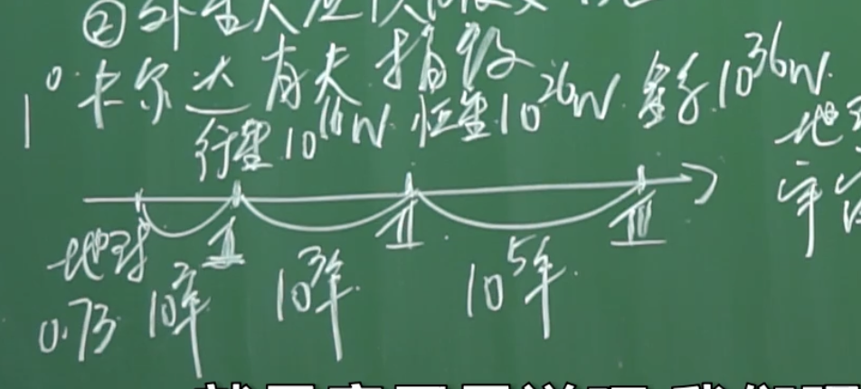

# 日光灯是如何点亮的？节能灯为啥节能？李永乐老师讲荧光灯原理

1. 日光灯启动原理：电感释放强大电动势击穿灯管里的气体，电流从灯管里走

   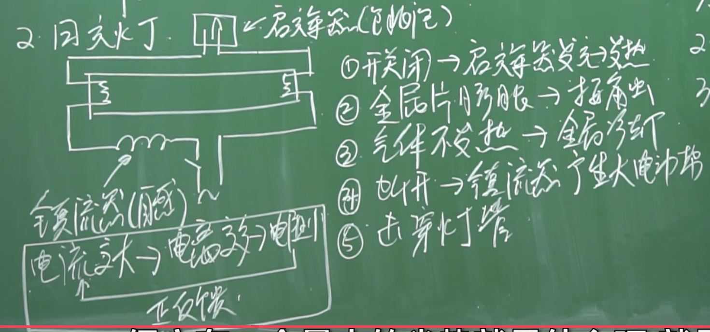
2. 日光灯发光原理：电子撞击汞原子，汞原子从高能态跃迁回到低能态的过程中发紫外线光，光被灯光内部的荧光粉吸收发出可见光

   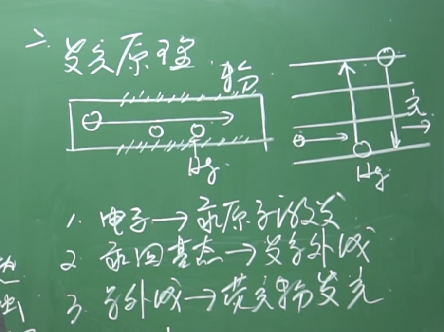

# 农历就是阴历吗?二十四节气和闰月是咋回事?李永乐老师讲中国历法

1. 中国农历俗称阴历，但实际上是阴阳合历。阴是因为考虑了月相周期，阳是因为考虑了太阳周期，加入了闰月概念
2. 阳历便于指导农业生产，因为太阳对环境影响更大。公历（格里高利历）就是典型的阳历，而伊斯兰历则是典型的阴历（没有闰月的操作，因此春节每年日期不同）
3. 24节气是根据太阳和地球相对位置决定的，因此也是一种太阳历。冬至就是影子最长的时候（南回归线），夏至就是影子最短的时候（北回归线）

   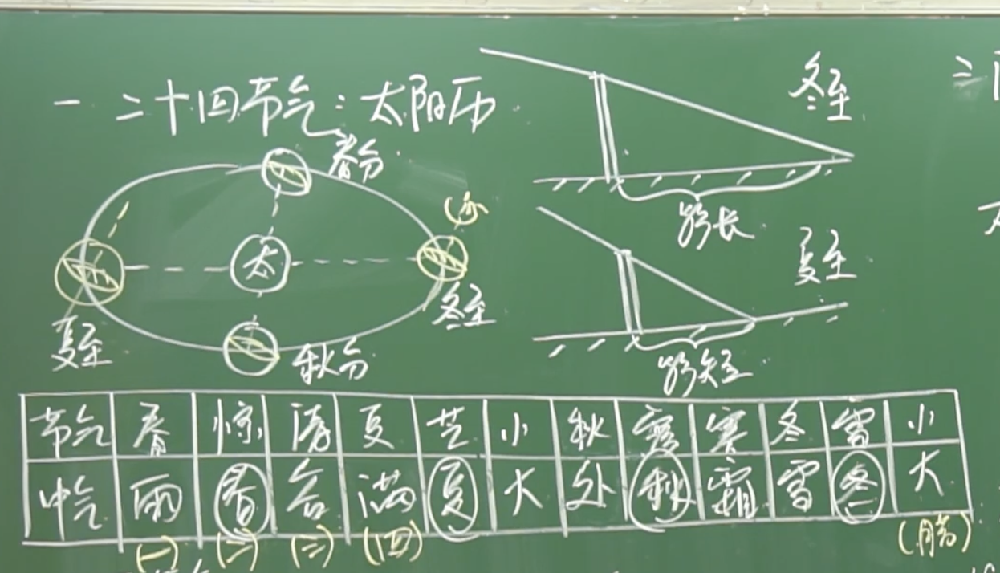
4. 为什么会有闰月：
   1. 地球绕太阳一圈365.2422天
   2. 月亮绕地球一圈29.53天，乘以12个月，就是354.36天。比地球绕太阳少了11天，为了调和这个矛盾，出现了闰月的概念
   3. 方法是：每19年插入7个闰月（插入的这个闰月没有节气）。刚好可以做到206.8天=29.53 x 7。206.8天就是太阳和月亮在绕圈19年之后的天数相差

      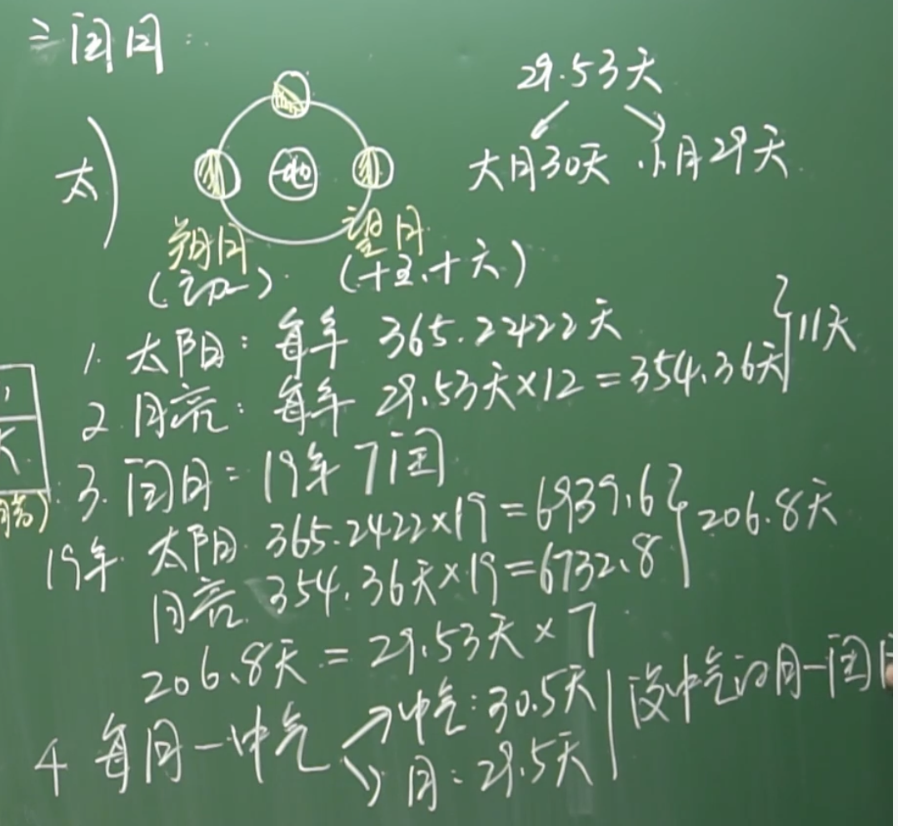
