# 《李永乐西瓜视频》3

## 目录

- [人推墙没推动，不做功为啥也会累？肌肉咋工作的？李永乐老师告诉你](#人推墙没推动不做功为啥也会累肌肉咋工作的李永乐老师告诉你)
- [鸦片战争为何会爆发？国际贸易的基础是什么？李永乐老师讲比较优势](#鸦片战争为何会爆发国际贸易的基础是什么李永乐老师讲比较优势)
- [“千克”是如何重新定义的？量子霍尔效应是啥？李永乐老师讲基布尔秤](#千克是如何重新定义的量子霍尔效应是啥李永乐老师讲基布尔秤)
- [霍尔效应是什么？车速表如何测量汽车速度？李永乐老师讲霍尔传感器](#霍尔效应是什么车速表如何测量汽车速度李永乐老师讲霍尔传感器)
- [车轮抱死时汽车为啥不受控制？ABS系统有啥用？李永乐老师告诉你](#车轮抱死时汽车为啥不受控制ABS系统有啥用李永乐老师告诉你)
- [糖尿病人用的胰岛素居然是大肠杆菌做的？李永乐老师讲基因工程(2)](#糖尿病人用的胰岛素居然是大肠杆菌做的李永乐老师讲基因工程2)
- [基因工程是什么?Crispr技术如何修改DNA?李永乐老师讲基因工程(1)](#基因工程是什么Crispr技术如何修改DNA李永乐老师讲基因工程1)
- [太阳会死亡吗？白矮星中子星黑洞都是哪来的？李永乐老师讲恒星演化](#太阳会死亡吗白矮星中子星黑洞都是哪来的李永乐老师讲恒星演化)
- [怎么说话才让人喜欢？如何做生意顾客更多？李永乐老师讲框架效应](#怎么说话才让人喜欢如何做生意顾客更多李永乐老师讲框架效应)
- [双11优惠活动为啥这么复杂？李永乐老师讲价格歧视](#双11优惠活动为啥这么复杂李永乐老师讲价格歧视)
- [如何看待风险投资？圣彼得堡悖论是啥？李永乐老师讲边际效用递减](#如何看待风险投资圣彼得堡悖论是啥李永乐老师讲边际效用递减)
- [帆船为啥能逆风航行？见过圆筒形的风帆吗？李永乐老师讲逆风行船](#帆船为啥能逆风航行见过圆筒形的风帆吗李永乐老师讲逆风行船)
- [1米有多长？美国人知道千米和千克吗？李永乐老师讲国际单位制](#1米有多长美国人知道千米和千克吗李永乐老师讲国际单位制)
- [时间到底是什么？1秒究竟有多长？李永乐老师讲石英钟和原子钟原理](#时间到底是什么1秒究竟有多长李永乐老师讲石英钟和原子钟原理)
- [古人如何计时？为啥机械手表拆了很难装回去？李永乐老师讲钟表原理](#古人如何计时为啥机械手表拆了很难装回去李永乐老师讲钟表原理)
- [给细胞手术的激光镊子、啁啾放大都是啥？李永乐老师解读诺贝尔奖](#给细胞手术的激光镊子啁啾放大都是啥李永乐老师解读诺贝尔奖)
- [光纤通讯啥原理？高锟为啥能得诺贝尔奖？李永乐老师追忆光纤之父](#光纤通讯啥原理高锟为啥能得诺贝尔奖李永乐老师追忆光纤之父)
- [麦克斯韦妖是啥？第二类永动机能造么？李永乐老师讲热力学第二定律](#麦克斯韦妖是啥第二类永动机能造么李永乐老师讲热力学第二定律)
- [开学第一课中“轻功水上漂”咋回事？李永乐老师讲神奇的非牛顿流体](#开学第一课中轻功水上漂咋回事李永乐老师讲神奇的非牛顿流体)
- [飞蛾扑火咋回事？蜜蜂为啥要跳8字舞？李永乐老师讲昆虫的光线导航](#飞蛾扑火咋回事蜜蜂为啥要跳8字舞李永乐老师讲昆虫的光线导航)
- [特斯拉线圈是啥玩意？人造闪电、无线输电咋回事？李永乐老师告诉你](#特斯拉线圈是啥玩意人造闪电无线输电咋回事李永乐老师告诉你)
- [台风是如何形成的？台风为啥是涡旋形状的？李永乐老师讲地转偏向力](#台风是如何形成的台风为啥是涡旋形状的李永乐老师讲地转偏向力)
- [七夕节想浪漫又不花钱？李永乐老师观星指南教你“卧看牵牛织女星”](#七夕节想浪漫又不花钱李永乐老师观星指南教你卧看牵牛织女星)
- [高考答题卡为什么要用2B铅笔？鼠标是啥原理？李永乐老师讲光传感器](#高考答题卡为什么要用2B铅笔鼠标是啥原理李永乐老师讲光传感器)
- [微波炉加热啥原理？微波对人有害吗？李永乐老师讲哪些东西不能放](#微波炉加热啥原理微波对人有害吗李永乐老师讲哪些东西不能放)
- [飞机被雷劈了会怎样？手机防辐射贴有用吗？李永乐老师讲静电屏蔽](#飞机被雷劈了会怎样手机防辐射贴有用吗李永乐老师讲静电屏蔽)
- [闪电是如何形成的？避雷针有什么用？李永乐老师讲雨天如何防雷电](#闪电是如何形成的避雷针有什么用李永乐老师讲雨天如何防雷电)
- [老哥：我先走了！高空跳水到底多危险？李永乐老师讲加速度对人伤害](#老哥我先走了高空跳水到底多危险李永乐老师讲加速度对人伤害)
- [2月为啥只有28天？竟然与凯撒和屋大维有关！李永乐老师讲公历演化](#2月为啥只有28天竟然与凯撒和屋大维有关李永乐老师讲公历演化)
- [等额本金和等额本息咋回事？提前还款吃亏吗？李永乐老师讲贷款利息](#等额本金和等额本息咋回事提前还款吃亏吗李永乐老师讲贷款利息)
- [行星冲日是咋回事？火星大冲又是啥？李永乐老师讲太阳系的行星运动](#行星冲日是咋回事火星大冲又是啥李永乐老师讲太阳系的行星运动)
- [疫苗到底有啥用？天花是怎么被消灭的？李永乐老师讲免疫系统](#疫苗到底有啥用天花是怎么被消灭的李永乐老师讲免疫系统)
- [你真懂了《皇帝的新装》吗？呐喊有多大力量？李永乐老师讲公共知识](#你真懂了皇帝的新装吗呐喊有多大力量李永乐老师讲公共知识)
- [光在引力场中会弯曲吗？黑洞里时间会停滞？李永乐老师讲广义相对论](#光在引力场中会弯曲吗黑洞里时间会停滞李永乐老师讲广义相对论)
- [星际旅行可能吗？双生子佯谬咋回事？李永乐老师讲相对论时间膨胀](#星际旅行可能吗双生子佯谬咋回事李永乐老师讲相对论时间膨胀)
- [我不是药神里的格列卫为啥这么贵？仿制药又是啥？李永乐老师告诉你](#我不是药神里的格列卫为啥这么贵仿制药又是啥李永乐老师告诉你)
- [轮船在风浪中如何保持稳定？李永乐老师解读普吉岛翻船事故](#轮船在风浪中如何保持稳定李永乐老师解读普吉岛翻船事故)
- [抽水马桶啥原理？朱元璋的公道杯又是咋回事？李永乐老师讲虹吸现象](#抽水马桶啥原理朱元璋的公道杯又是咋回事李永乐老师讲虹吸现象)
- [“孔子见两小儿辩日”咋解释？黑衣服为啥显瘦？李永乐老师讲视觉错觉](#孔子见两小儿辩日咋解释黑衣服为啥显瘦李永乐老师讲视觉错觉)
- [夏至冬至、春分秋分咋回事？夏天为啥白天长？李永乐老师讲24节气](#夏至冬至春分秋分咋回事夏天为啥白天长李永乐老师讲24节气)
- [存款准备金率啥意思？钱在银行里为啥会变多？李永乐老师讲货币体系](#存款准备金率啥意思钱在银行里为啥会变多李永乐老师讲货币体系)
- [世界杯骗局：你见过半夜两点的太阳吗？李永乐老师讲经纬度和时差](#世界杯骗局你见过半夜两点的太阳吗李永乐老师讲经纬度和时差)
- [C罗绝技电梯球啥原理？与香蕉、落叶球啥区别？李永乐老师讲世界杯](#C罗绝技电梯球啥原理与香蕉落叶球啥区别李永乐老师讲世界杯)
- [为啥毛巾能吸水？植物咋把水从根运到叶子的？李永乐老师讲毛细现象](#为啥毛巾能吸水植物咋把水从根运到叶子的李永乐老师讲毛细现象)
- [海浪为啥总朝着海岸运动？光为啥会折射？李永乐老师解释波的传播](#海浪为啥总朝着海岸运动光为啥会折射李永乐老师解释波的传播)
- [你真的了解储蓄中的“复利”吗？与欧拉数e啥关系？李永乐老师告诉你](#你真的了解储蓄中的复利吗与欧拉数e啥关系李永乐老师告诉你)
- [计算机是怎么计算加法的？模拟数字信号啥区别？李永乐老师讲门电路](#计算机是怎么计算加法的模拟数字信号啥区别李永乐老师讲门电路)
- [手机支付中“数字签名”有啥用？李永乐老师讲生日碰撞和哈希函数](#手机支付中数字签名有啥用李永乐老师讲生日碰撞和哈希函数)
- [初一十五为啥大潮？月球为啥总一面朝地球？李永乐老师讲潮汐锁定](#初一十五为啥大潮月球为啥总一面朝地球李永乐老师讲潮汐锁定)
- [航母排水量啥意思？如何测心脏体积？李永乐老师讲阿基米德浮力定律](#航母排水量啥意思如何测心脏体积李永乐老师讲阿基米德浮力定律)
- [中科院的井盖火了！李永乐老师带你了解十个最美的物理公式](#中科院的井盖火了李永乐老师带你了解十个最美的物理公式)
- [三体问题到底是啥？和“鹊桥”卫星啥关系？李永乐老师讲拉格朗日点](#三体问题到底是啥和鹊桥卫星啥关系李永乐老师讲拉格朗日点)
- [啥样的空调省电？能效等级是啥意思？李永乐老师讲热机和卡诺定理](#啥样的空调省电能效等级是啥意思李永乐老师讲热机和卡诺定理)
- [亮剑里李云龙“拇指测距”啥原理？李永乐老师讲视差法测天体距离](#亮剑里李云龙拇指测距啥原理李永乐老师讲视差法测天体距离)
- [近视眼是怎么回事？眼镜度数是啥意思？李永乐老师带你了解近视矫正](#近视眼是怎么回事眼镜度数是啥意思李永乐老师带你了解近视矫正)
- [你知道植物中隐藏的数学吗？李永乐老师讲神奇的斐波那契数列](#你知道植物中隐藏的数学吗李永乐老师讲神奇的斐波那契数列)
- [FM和AM是啥意思？收音机是咋收到音乐的？李永乐老师讲广播信号传输](#FM和AM是啥意思收音机是咋收到音乐的李永乐老师讲广播信号传输)
- [无线电报是啥原理？SOS是啥意思？李永乐老师教你如何通电全国](#无线电报是啥原理SOS是啥意思李永乐老师教你如何通电全国)
- [闰年是怎么回事？清华学霸李永乐老师十年前就给我讲明白了](#闰年是怎么回事清华学霸李永乐老师十年前就给我讲明白了)
- [银行密码系统安全吗？质数到底有啥用？李永乐老师讲RSA加密算法](#银行密码系统安全吗质数到底有啥用李永乐老师讲RSA加密算法)
- [电磁炉什么原理？对身体有伤害吗？李永乐老师告诉你什么是涡流](#电磁炉什么原理对身体有伤害吗李永乐老师告诉你什么是涡流)
- [电磁波有几类？被伽玛射线照了会咋样？李永乐老师8分钟全告诉你](#电磁波有几类被伽玛射线照了会咋样李永乐老师8分钟全告诉你)
- [量子到底是啥玩意？光是波还是粒子？李永乐老师讲8分钟全告诉你](#量子到底是啥玩意光是波还是粒子李永乐老师讲8分钟全告诉你)
- [“清明时节雨纷纷”为啥清明总下雨？李永乐老师4分钟告诉你原因](#清明时节雨纷纷为啥清明总下雨李永乐老师4分钟告诉你原因)
- [盯着星星看它就消失了是为什么？李永乐老师带你做有趣的盲点实验](#盯着星星看它就消失了是为什么李永乐老师带你做有趣的盲点实验)
- [星星为什么是黑白的？牛为什么是色盲？李永乐老师解释眼睛的色觉](#星星为什么是黑白的牛为什么是色盲李永乐老师解释眼睛的色觉)
- [彩虹大家都见过，可你见过霓吗？李永乐老师为你讲述霓虹间的区别](#彩虹大家都见过可你见过霓吗李永乐老师为你讲述霓虹间的区别)
- [为啥炎热夏天总感觉路面上有水？李永乐老师7分钟解释海市蜃楼](#为啥炎热夏天总感觉路面上有水李永乐老师7分钟解释海市蜃楼)
- [陀螺为什么不倒？自行车呢？李永乐老师6分钟讲生活中的物理道理](#陀螺为什么不倒自行车呢李永乐老师6分钟讲生活中的物理道理)
- [日地距离是如何测量的？百年不遇的天文现象李永乐老师却错过两次](#日地距离是如何测量的百年不遇的天文现象李永乐老师却错过两次)
- [雨中走路淋雨多还是跑步淋雨多？李永乐老师7分钟给你讲明白](#雨中走路淋雨多还是跑步淋雨多李永乐老师7分钟给你讲明白)
- [电饭锅可以用来烧水吗？李永乐老师4分钟带你了解温度传感器](#电饭锅可以用来烧水吗李永乐老师4分钟带你了解温度传感器)
- [百年一遇的月食月亮为啥是红色的？清华李永乐老师5分钟说明白](#百年一遇的月食月亮为啥是红色的清华李永乐老师5分钟说明白)

# 人推墙没推动，不做功为啥也会累？肌肉咋工作的？李永乐老师告诉你

1. 肌肉收缩靠的是粗肌丝上的肌球蛋白和细肌丝上的肌动蛋白进行相对滑动、拉扯，这个过程会消耗ATP，生成的ADP使得肌球蛋白弯曲，从而发生相对滑动

   需要依赖Ca离子，让肌动蛋白露出来，与肌球蛋白结合。所以如果人缺钙，肌肉是无法正常收缩的

   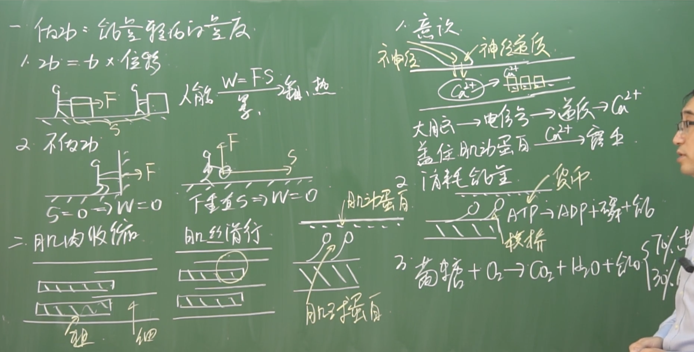

# 鸦片战争为何会爆发？国际贸易的基础是什么？李永乐老师讲比较优势

1. 鸦片战争爆发的原因是英国对中国有大量贸易逆差（进口茶叶、丝绸、瓷器，300万两），为了扭转此局面，英国在孟加拉国养殖鸦片卖给中国
2. 两国之间，不同人之间，有绝对优势（干什么都比别人便宜）和比较优势（干什么都比别人贵，但是相对自己来说，有些东西便宜的比例比别人更大）

   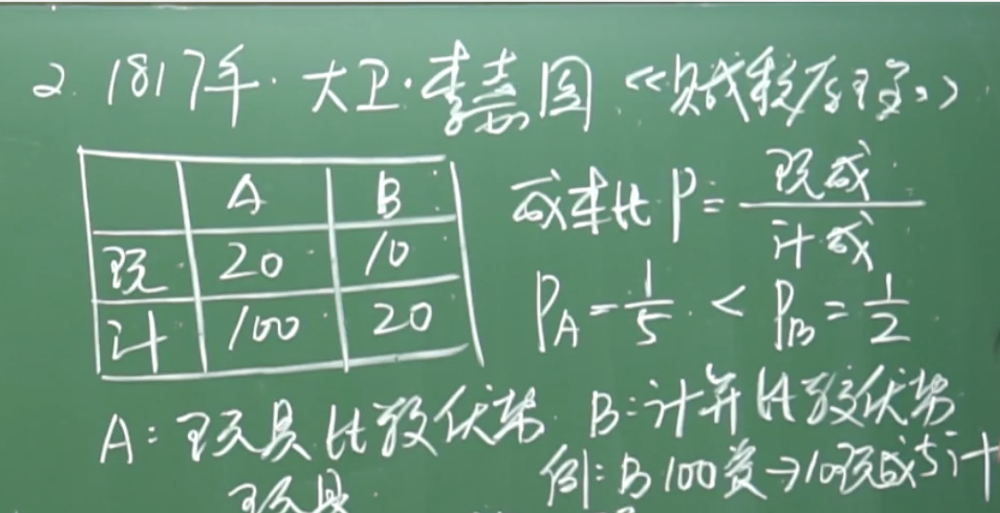

# “千克”是如何重新定义的？量子霍尔效应是啥？李永乐老师讲基布尔秤

1. 欧姆、电压都可以用自然常数定义

   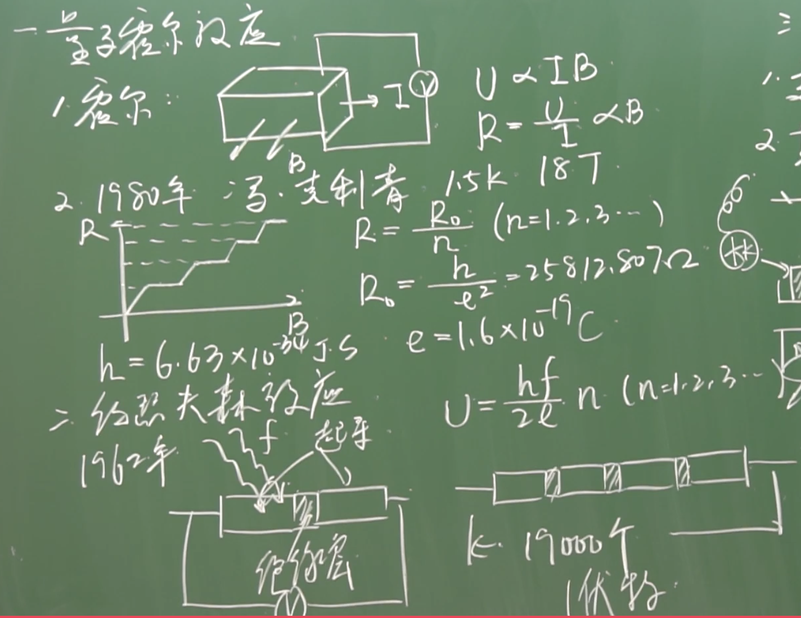
2. 千克的标准目前用的是实物基准，现在可以利用感应电动势原理，测量重量，原理是：速度法：电压U=BLV（运动速度），称重法：mg=IBL

   用速度法和称重法一起，得出UI=mgV。其中把I换算为欧姆R，则可得到
   $$
   \frac{U^2}{R}=mgV
   $$
   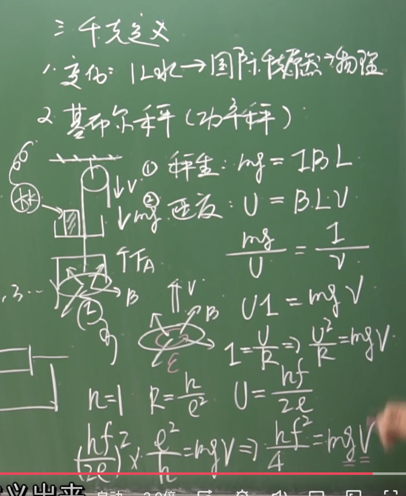

# 霍尔效应是什么？车速表如何测量汽车速度？李永乐老师讲霍尔传感器

1. 霍尔效应：通电导体（或者电荷）在磁场中会受到力的作用
2. 应用：
   1. 测量导体类型：正电荷导电还是负电荷导电
   2. 测量磁场强度：U=R\*IB/b
   3. 测量转速或者角度：一对磁铁的放置角度，或者ABS的防抱死系统测量车轮转速

# 车轮抱死时汽车为啥不受控制？ABS系统有啥用？李永乐老师告诉你

1. 什么是抱死？踩刹车力度过大，导致车轮被刹车片卡死，不动，俗称抱死
2. 抱死的危害。转弯过程中需要轮胎相对于地面滑动，与车行驶运动方向形成合速度，给车一个向转弯方向的摩擦力，才能转弯，如果出现抱死，则车无法转弯；在抱死过程中，如果4个轮胎与地面摩擦力不同，则会导致转圈

   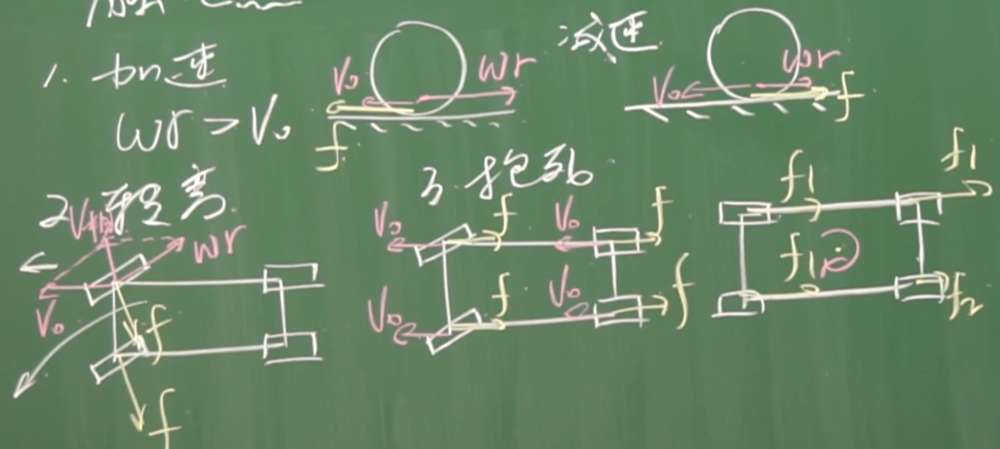
3. ABS系统相当于内置一个老司机，当我们用力踩下刹车时，车轮不会完全停止转动，而是保持一定的转速，使得轮胎与地面的摩擦力保持在最大值，且不会发生方向不可控的问题

   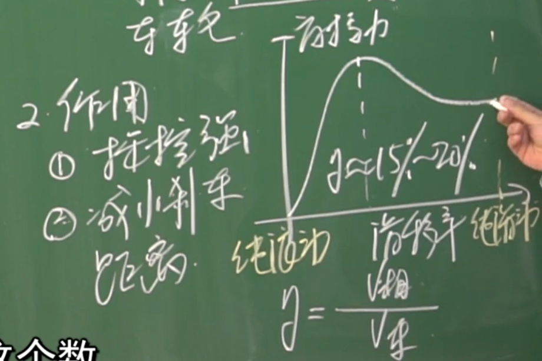

# 糖尿病人用的胰岛素居然是大肠杆菌做的？李永乐老师讲基因工程(2)

1. 胰岛素：把血液中的葡萄糖转移到细胞里，降低血糖浓度。如果缺少胰岛素，会导致人消瘦，因为细胞缺乏葡萄糖
2. 以前的人们利用狗、猪身上提取出来的胰岛素，后来数量很少，效果不好，改用细菌工厂制造人体胰岛素，方法是：利用内切酶把人体制造胰岛素的基因切下来，放到细菌的环状质粒里，让细菌帮我们生产胰岛素
   1. 最先开始使用大肠杆菌，后来使用酵母菌

# 基因工程是什么?Crispr技术如何修改DNA?李永乐老师讲基因工程(1)

1. Crispr指的是重复基因序列，Cas9指的是具有剪切基因片段的剪切酶，相当于一种手术刀，能够在靶向位置敲下基因，或者做基因编辑

   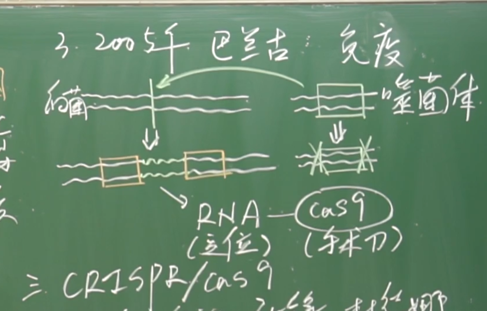
2. 故事：在部分大肠杆菌身体里找到多段重复基因序列，最后发现是噬菌体病毒里的某段基因，被大肠杆菌放到了自己的基因库了

# 太阳会死亡吗？白矮星中子星黑洞都是哪来的？李永乐老师讲恒星演化

1. 星云聚合在一起形成了恒星，根据质量的不同，恒星的结局也有不同，分为：棕矮星、红矮星、黄矮星（太阳）、蓝色恒星

   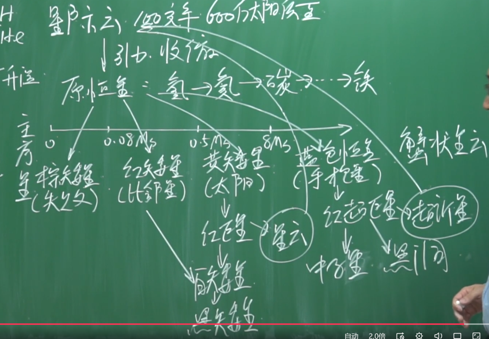
   1. 黄矮星→红巨星→白矮星→黑矮星。
      1. 膨胀的原因：持续燃烧，质量减少，引力减少，无法束缚住核聚变能量，体积增加
      2. 坍缩的原因：持续燃烧，体积变大，中心质量减少，所以中心部位密度减少，反应减弱，核聚变减弱，小于引力，恒星坍缩
   2. 蓝色恒星→红超巨星→中子星或者黑洞

# 怎么说话才让人喜欢？如何做生意顾客更多？李永乐老师讲框架效应

1. 面对收益，人们是确定性偏好，风险厌恶。比如股票涨了很想卖掉，把收益拿到手
2. 面对损失，人们是风险偏好。比如股票亏损不愿意跳出来，希望能涨回去
3. 描述风险的两种方法：积极、消极。人们倾向于使用积极描述，而不是消极描述，比如：

   _-ZJF1g87Rs.png)

# 双11优惠活动为啥这么复杂？李永乐老师讲价格歧视

1. 消费者剩余最大化，利润最多，社会福利损失最小：

   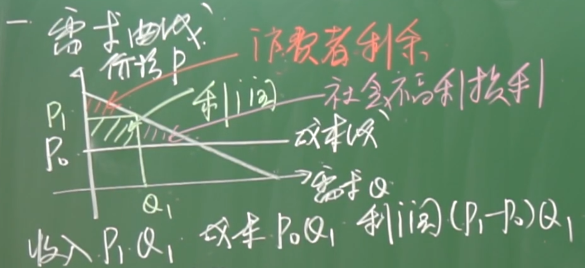
2. 如何让社会福利损最小？
   1. 一级价格歧视。按每个消费者定制价格。利润最大化，没有消费者剩余（卖的价格高于消费者心理预期），没有社会福利损失。但是成本最高
   2. 二级价格歧视。买的数量越多，价格越便宜
   3. 三级价格歧视。身份不同，价格不同。比如老人、学生票便宜
      1. 手机不同规格的差价
      2. 超市里保鲜膜的菜更贵

# 如何看待风险投资？圣彼得堡悖论是啥？李永乐老师讲边际效用递减

1， 1913年冯诺依曼提出在期望收益的基础上，应该还需要增加一项期望效用。原因是随着收益的增加，效用其实在递减，这就是期望效用递减规律

_ZKYsOM3__m.png)

# 帆船为啥能逆风航行？见过圆筒形的风帆吗？李永乐老师讲逆风行船

1. 帆船的帆布不是正面对着风，而是与风形成一个夹角，利用伯努利原理前进

   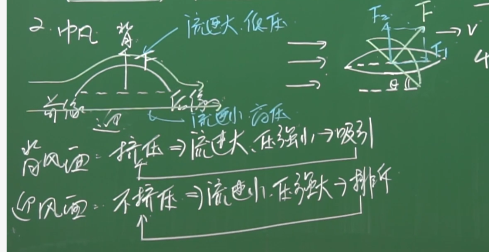
2. 逆风行船时，船会走之字形

   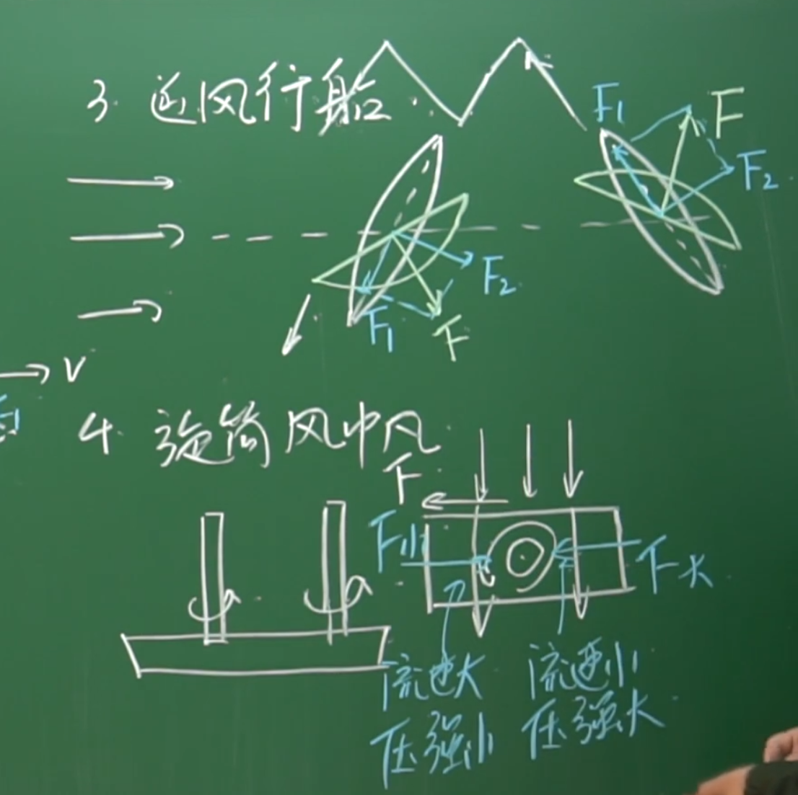
3. 旋筒风帆船也是利用伯努利原理前进，只不过需要侧风

# 1米有多长？美国人知道千米和千克吗？李永乐老师讲国际单位制

1. 7个国际单位制基本单位：长度m、质量kg、时间s、电流A（通电导线测算受力）、温度K（水三相点）、物质的量mol、光强cd（1m距离球面上受到的功率）

   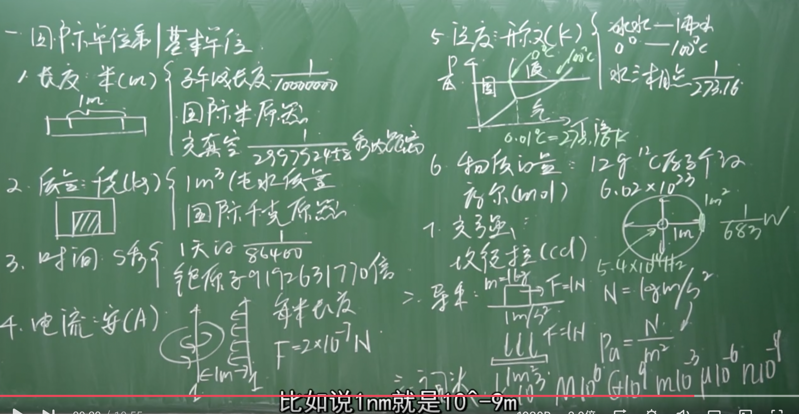
2. 其他单位为导出单位：牛顿N、压强Pa等

# 时间到底是什么？1秒究竟有多长？李永乐老师讲石英钟和原子钟原理

1. 为什么石英晶体的输出频率被设计为32768Hz？因为这正好是2的15次方，可以利用分频电路得到1Hz的脉冲输出，用来做石英手表

   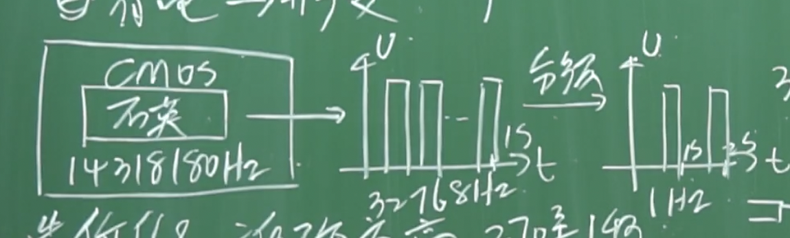

# 古人如何计时？为啥机械手表拆了很难装回去？李永乐老师讲钟表原理

1. 钟表的发展：利用阳光的天文计时，利用沙漏、水漏的计时，伽利略发现单摆的等时性，惠更斯提出单摆周期公式，单摆钟被发明出来
2. 单摆钟的工作原理：利用擒纵器在边缘时卡住齿轮，摆动时让齿轮在重力作用下自由转动

   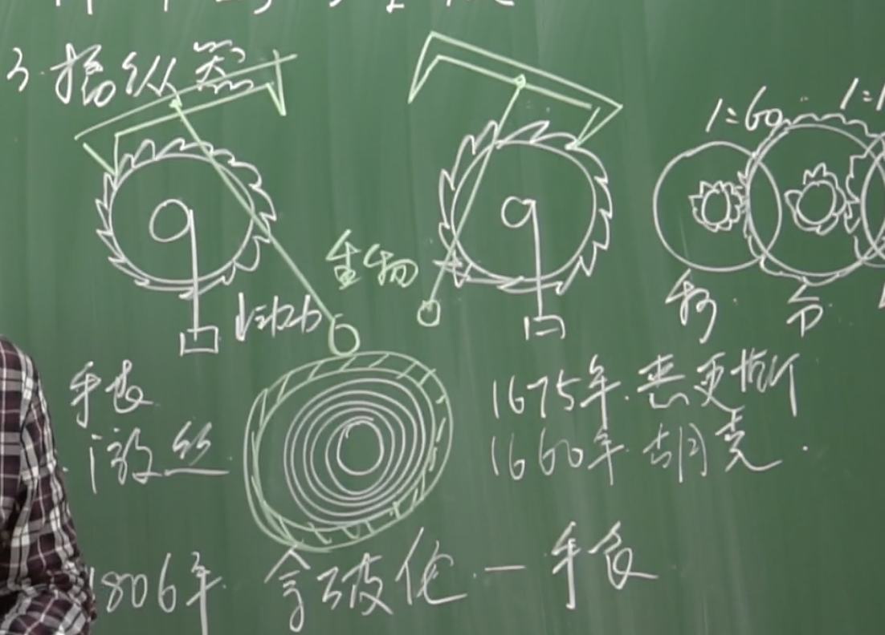

# 给细胞手术的激光镊子、啁啾放大都是啥？李永乐老师解读诺贝尔奖

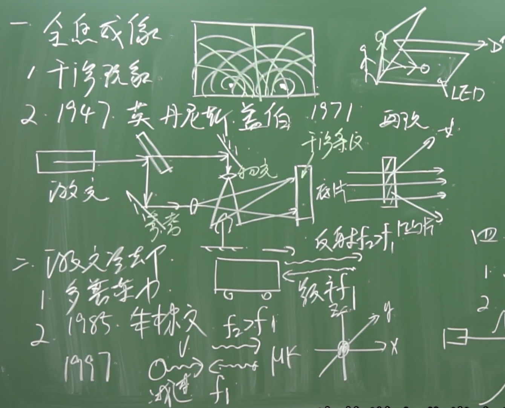

1. 全息成像。利用光的干涉技术，保存底片，照射底片从特定角度观察
2. 激光冷却。利用多普勒效应，用激光照射原子，让分子减速，降低动能，从而达到降温的效果

# 光纤通讯啥原理？高锟为啥能得诺贝尔奖？李永乐老师追忆光纤之父

1. 光线有8种振幅，8种相位，2种旋转方向，共计128种可能，构成了7bit信息
2. 世界上第一个激光发生器：红宝石激光器，利用红宝石内部原子受激辐射激发激光，激发同相位，同频率的光（类似雪崩效应）

# 麦克斯韦妖是啥？第二类永动机能造么？李永乐老师讲热力学第二定律

1. 第一类永动机。不需要能量输入就能源源不断的向外做功的机器
2. 第二类永动机。从一个热源吸热，并把这些热量完全转化成做功。实际上这也不可能，不能从单一热源吸热，必须从高温热源向低温热源流动

# 开学第一课中“轻功水上漂”咋回事？李永乐老师讲神奇的非牛顿流体

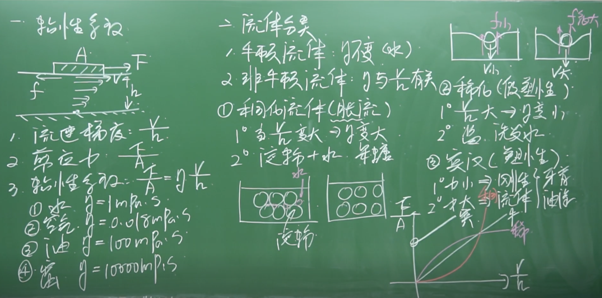

1. 淀粉是把面粉里面的蛋白质和脂肪全部去掉了，做实验的时候，得用淀粉，这样颗粒比较单一
2. 流速梯度与剪应力之间的比例关系，称为粘性系数。不同液体，粘性系数不同，系数越大，液体越黏稠，系数越小，液体越柔软
   1\.
   $$
   \frac{F}{A}=\eta\frac{V}{h}
   $$
3. 如果粘性系数因为流速的不同而改变，叫做非牛顿流体，如果粘性系数与液体流速无关，叫做牛顿流体
4. 稠化流体（淀粉+水，流速越大，剪应力越大）
5. 稀化流体（番茄酱，洗发水，流速越大，剪应力越小）
6. 宾汉流体（牙膏，油漆，力小呈现刚性，力大呈现液体）

# 飞蛾扑火咋回事？蜜蜂为啥要跳8字舞？李永乐老师讲昆虫的光线导航

1. 飞蛾扑火是因为和平行光线保持固定夹角飞行，以前只有月光时可以飞直线，但是现在发明了灯泡，所以才会出现飞蛾撞到灯泡上的现象

   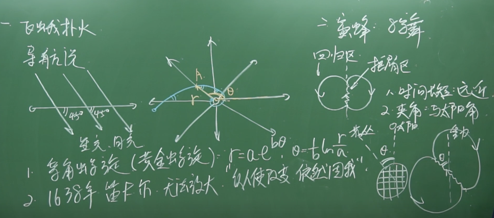
2. 蜜蜂的8字跳舞有左半边和右半边，方向表示与太阳入射的夹角，摇臀的半径表示距离巢穴的远近

# 特斯拉线圈是啥玩意？人造闪电、无线输电咋回事？李永乐老师告诉你

1. 特斯拉线圈的本质是高频交流高压电。利用了LC振荡电路，电谐振原理，通过调整次级振荡电路的C来使得次级振荡电路的电压U非常高。且由于功率一定，所以电流很小，对人体来讲是安全的

   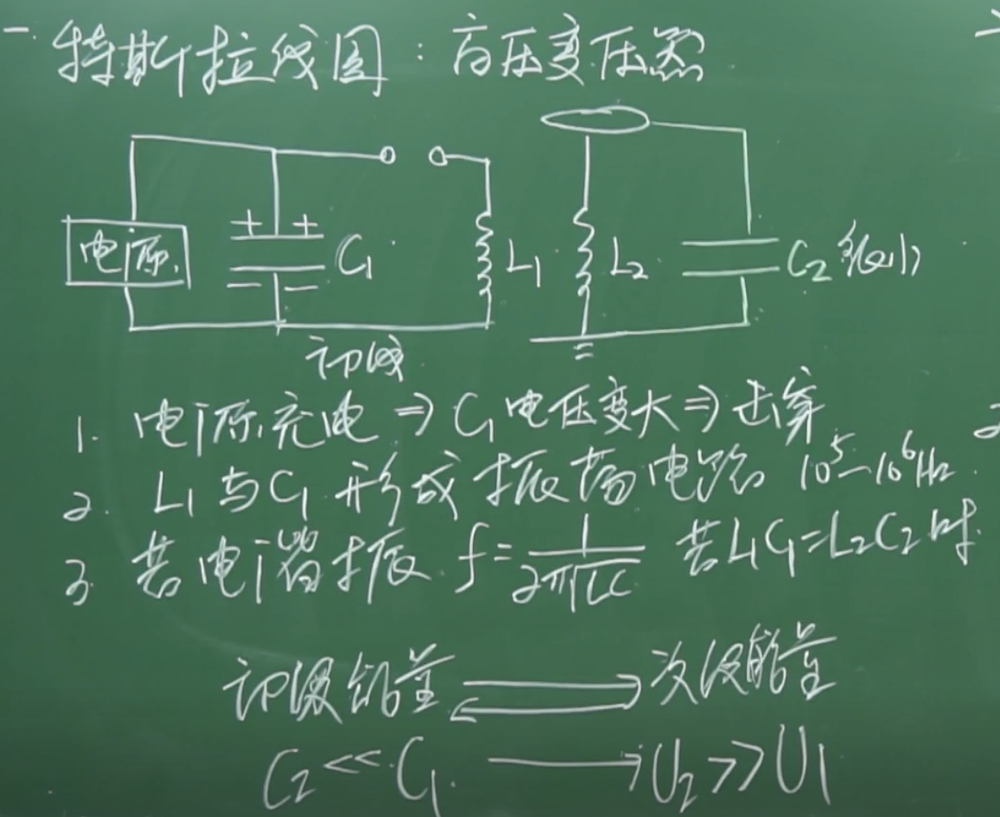

# 台风是如何形成的？台风为啥是涡旋形状的？李永乐老师讲地转偏向力

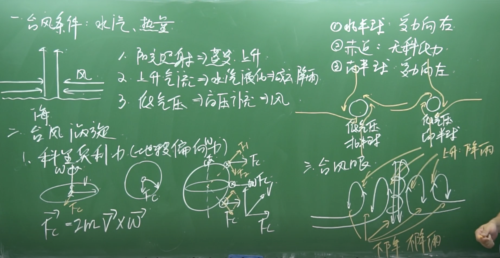

1. 台风的形成条件：阳光照射海面，温度升高，气化后上升，遇冷后液化，形成降雨；中心区域因为气流上升，周围空气向中间补充，形成风
2. 科里奥利力导致了北半球台风，北半球河流在流动时会有一个向右运动的趋势，这个趋势的力就是科里奥利力，方向：右手从运动方向绕向旋转角速度方向，大拇指方向为受力方向。所以南半球台风呈现逆时针，南半球河流左岸会受到侵蚀

# 七夕节想浪漫又不花钱？李永乐老师观星指南教你“卧看牵牛织女星”

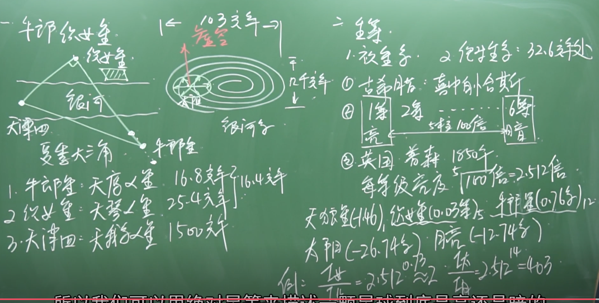

1. 织女星比牛郎星亮2倍，牛郎星附近有2颗在一条直线上的小星，并且与织女星共线，穿过银河
2. 夏季大三角：从牛郎-侄女之间的连线转90度可以找到天津四，形成一个直角三角形
3. 视星等（看到的亮度），绝对星等（32.6光年处观察）
   1. 视星等每个等级之间差2.512倍。亮度差距为2.512^n次方，n为视星等的数值差
   2. 天狼星为天空中最亮的星，-1.46，织女星为0.03，太阳为-26.74，月亮为-12.74
4. 银河是一种扁平状的行星带，看向上下两个方向为虚空地带，实际上是有星星的

# 高考答题卡为什么要用2B铅笔？鼠标是啥原理？李永乐老师讲光传感器

1. H越多，铅笔越硬，B越多，石墨越多，越软
2. 火灾报警器的原理：烟雾散射到光敏二极管，导通报警
3. 光电鼠标原理：识别桌面的花纹，通过移动速度来获取运动位置和速度

# 微波炉加热啥原理？微波对人有害吗？李永乐老师讲哪些东西不能放

1. 电磁波加热的原理：2.4GHz。交变电场对水分子（蛋白质、脂肪）产生往复运动，摩擦生热
2. 致癌的原理：高能量射线破坏了细胞核中的DNA，导致复制出错
3. 微波炉，wifi信号对人体是否有伤害？没有伤害，因为光更有伤害

   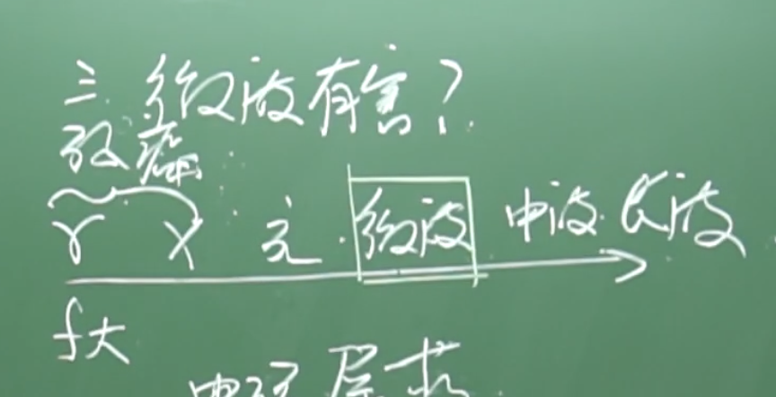
4. 不能放金属，不能放封闭物体（蒸汽爆炸），不能放普通塑料，可以放陶瓷和玻璃

# 飞机被雷劈了会怎样？手机防辐射贴有用吗？李永乐老师讲静电屏蔽

1. 静电屏蔽现象：金属外壳里不会受到外部电磁波的干扰。应用实例：特斯拉电笼、通信导线金属编织网等

# 闪电是如何形成的？避雷针有什么用？李永乐老师讲雨天如何防雷电

1. 静电感应效应：不带电的金属导体放在电场中会受到力的作用，除非金属导体接地
2. 电荷只会分布在金属的表面上，内部是没有电荷的
3. 在导体的尖端处电荷非常多，这就是尖端放电现象
4. 云为什么有时候是黑的？因为云太厚了，阳光射不透，如果射透了，云都是白的，而不是因为云很脏
5. 三种雷电
   1. 云内放电
   2. 云间放电
   3. 云与大地放电
6. 5s法则：如果看到闪电和雷声之间相差在5s以内，说明闪电与你距离很近（1700m），需要尽快躲开

# 老哥：我先走了！高空跳水到底多危险？李永乐老师讲加速度对人伤害

1. 跳水受到水面对人体的作用力分析：

   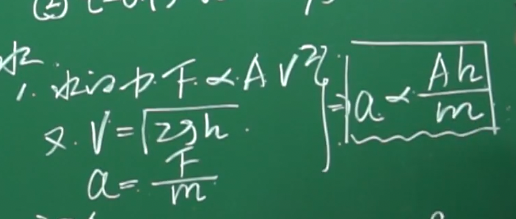
   1. 面积越大，高度越高，质量越小，受到水面的加速度就越大；如果要跳水，尽可能减少接触水的面积，并增加身体重量

# 2月为啥只有28天？竟然与凯撒和屋大维有关！李永乐老师讲公历演化

1. 儒略历：奇数月31天，偶数月30天，二月闰年29/30天
2. 后来屋大维死去之后，为了纪念他，把八月改成了31天（那1天从二月拿过来），与7月一样（同凯撒），然后把9、10、11、12调换了一下位置，就是现在的格里历
3. 十月革命发生在十一月，是因为俄国使用儒略历，是在十月，但是格里历是十一月
4. 1912年中国使用格里历

# 等额本金和等额本息咋回事？提前还款吃亏吗？李永乐老师讲贷款利息

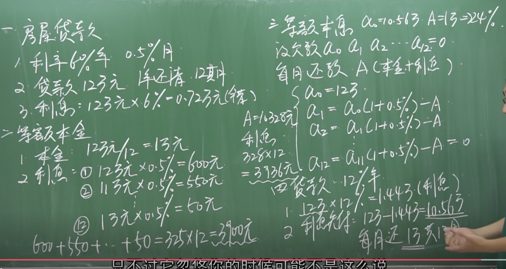

1. 等额本金：每个月还的本金是相同的，利息是递减的，总还款利息少
2. 等额本息：每个月还的本金+利息是相同的，总还款利息较多
3. 无论哪种还款方式，收取利息的方式都是按照未还款金额计算，也就是说，提前还款不会吃亏

# 行星冲日是咋回事？火星大冲又是啥？李永乐老师讲太阳系的行星运动

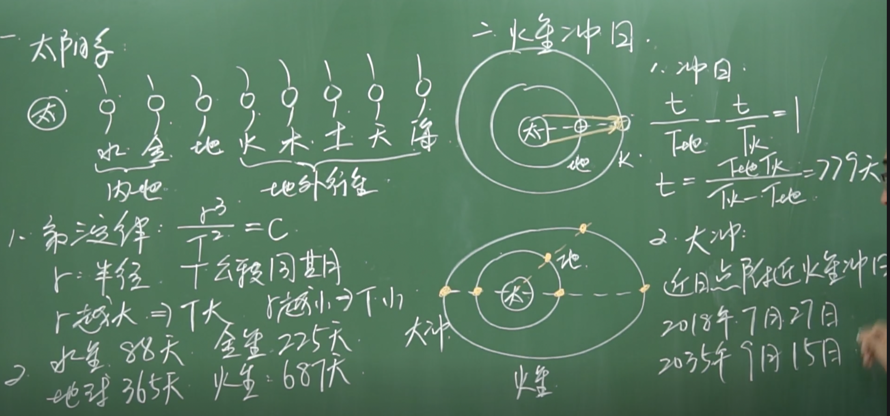

1. 地外行星与太阳、地球在一条直线上，叫做冲日；又由于轨道为椭圆轨道，如果冲日的时候三者距离太阳的距离最近，则叫大冲
   1. 每个大冲周期为17年
   2. 每个冲日周期为779天
2. 地内行星与太阳、地球在一条直线上，叫做凌日，有金星凌日和水星凌日

# 疫苗到底有啥用？天花是怎么被消灭的？李永乐老师讲免疫系统

1. 天花致死率为30%，80年代以后天花已经被人类灭除，现在人类对天花是没有免疫力的，仅有的两个天花病毒保存在俄罗斯和美国实验室里
2. B细胞有记忆的作用，能过记忆病毒细胞的外表皮；作用方式：
   1. 抓取病毒并被巨噬细胞吞噬
   2. 病菌上打洞，破坏病菌细胞膜
3. T细胞杀伤力更强，直接把毒素注入到病原体之中，让病原体直接死亡
4. 疫苗分为被动疫苗和主动疫苗
   1. 被动疫苗：抗原疫苗。注入减毒或者失活的病原体到体内，让免疫细胞识别并产生抗体
   2. 主动疫苗：抗体疫苗。直接把抗体注入人体内。比如狂犬病疫苗

# 你真懂了《皇帝的新装》吗？呐喊有多大力量？李永乐老师讲公共知识

1. 公共知识：每个人都知道这件事
2. 共有知识：每个人都知道“每个人都知道这件事”。与公共知识不同，他要求所有人信息共享，有讨论
   1. 垃圾股股票下跌

# 光在引力场中会弯曲吗？黑洞里时间会停滞？李永乐老师讲广义相对论

1. 引力变大与加速度等效：人站在电梯里无法区分是引力变大了还是电梯在加速上升，所以爱因斯坦认为引力与加速度等效，是一回事

   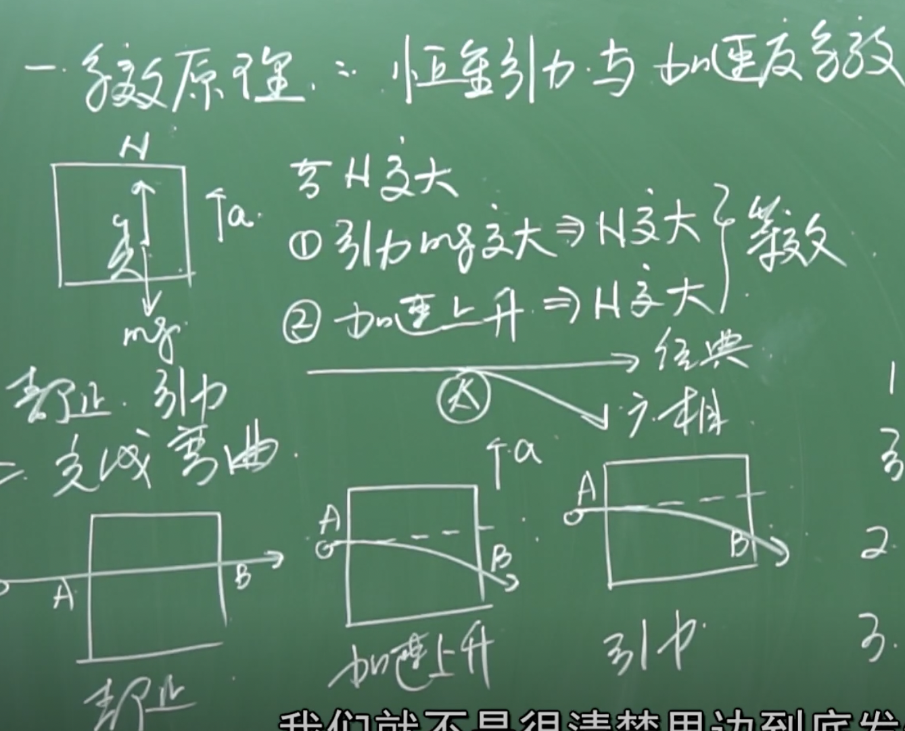
2. 光线弯曲的解释：在加速上升的电梯里光线会弯曲，同理，引力增加之后，光线也会弯曲

# 星际旅行可能吗？双生子佯谬咋回事？李永乐老师讲相对论时间膨胀

1. 火车以光速运动，火车上的人感觉时间是正常在走，但是地面上的人认为火车在放慢动作，时间过的长，原因是光线走了更长的距离

   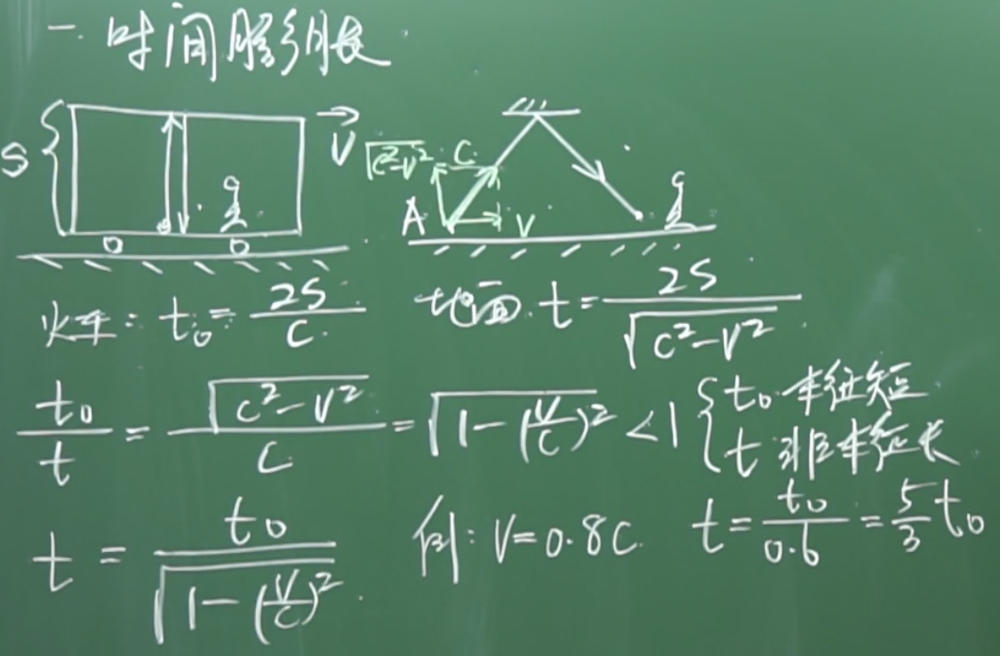

# 我不是药神里的格列卫为啥这么贵？仿制药又是啥？李永乐老师告诉你

1. 仿制药不是假药。FDA对仿制药的要求：
   1. 药学等效性。剂量（毫克）、剂药方式（注射、胶囊）、活性成分要相同
   2. 生物等效性。吸收速度相同
   3. 赋形剂可以不同。填充药物，促进吸收（比如乳糖等）
   4. 印度之所以能够买到便宜的药，是因为国家放松了专利的20年保护要求，因此印度本地可以仿制大量刚出的药物

# 轮船在风浪中如何保持稳定？李永乐老师解读普吉岛翻船事故

1. 船只不侧翻的要求：稳心M高于重心G。
   1. 货物要固定住，不要随便移动，改变船体重心
   2. 稳心M指的是浮心向上竖直做垂线，交于船体中心对称轴的交点，如下图的M点；中间的图船是稳定的，因为M高于G，重力作用下船会恢复到水平状态；右侧的船是不稳定的，因为M低于G，重力作用下船会继续侧翻

      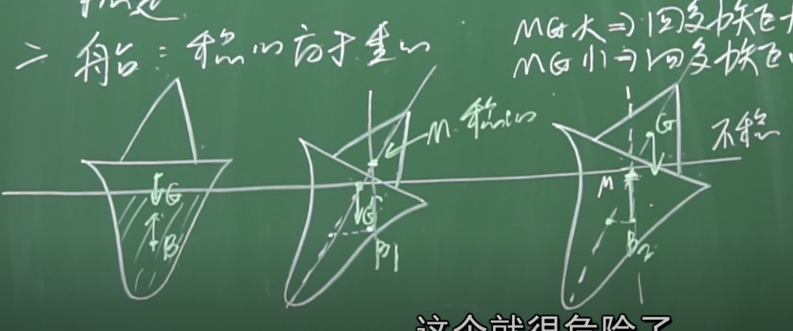

# 抽水马桶啥原理？朱元璋的公道杯又是咋回事？李永乐老师讲虹吸现象

1. 虹吸现象要求水位有高低落差，并且水管里的水必须要填满

   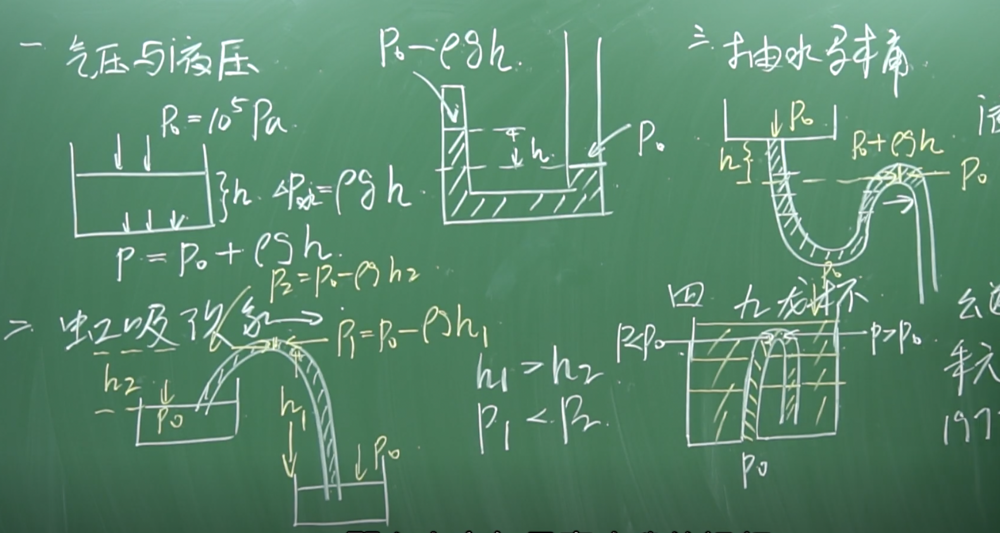

# “孔子见两小儿辩日”咋解释？黑衣服为啥显瘦？李永乐老师讲视觉错觉

1. 近日点在1月份，远日点在7月份。之所以感觉近日点冷是因为太阳高度角太大，阳光斜射在北半球，所以冷；而在远日点太阳直射在北半球，所以感觉热

   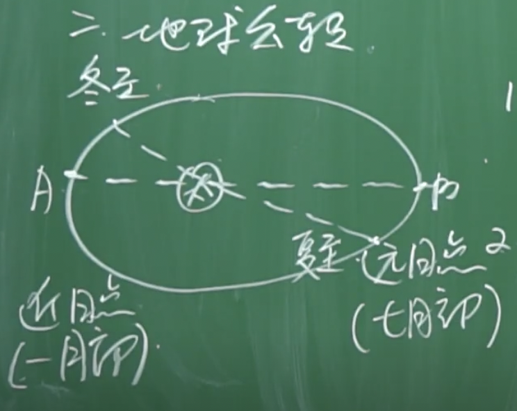
2. 红色膨胀效应。长波长的光线不容易被色散，折射率小，因此在视网膜成像体积更大，所以红色的物体看起来感觉更大，而紫色，蓝色，黑色物体看起更小

# 夏至冬至、春分秋分咋回事？夏天为啥白天长？李永乐老师讲24节气

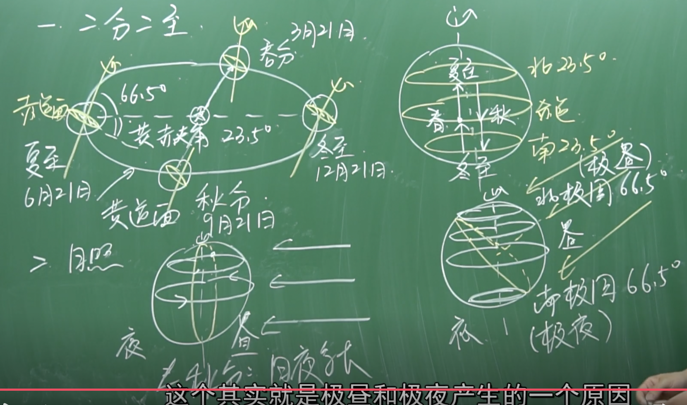

1. 黄道面：太阳与地球的平面；赤道面：地球的赤道平面。黄赤交角就是黄道面和赤道面的夹角，也就是北回归线，南回归线的角度
2. 春分和秋分是太阳直射在地球赤道面的时刻
3. 春分和秋分的白天、黑夜时间等长；由于地球是倾斜的，所以夏至时，北极圈内会出现极昼现象，冬至时，南极圈内会出现极夜现象

# 存款准备金率啥意思？钱在银行里为啥会变多？李永乐老师讲货币体系

1. 中央银行要求商业银行将存款固定比例金额上缴至中央银行，2018年比例为16.5%，2021年为8%
2. 其中S为市场总金额，S0为原始存款，P为存款准备金率
   $$
   S=\frac{S_{0}}{P}
   $$
   1. 准备金率P越低，则市场总金额S越多，市场上热钱也越多，这是一种放水的信号
   2. 假如央行调低0.5%准备金率，在S=140万亿的情况下，会产生7000亿的资金，这7000亿的资金在P=15%的杠杆作用下，又会产生4.5万亿的市场总金额

# 世界杯骗局：你见过半夜两点的太阳吗？李永乐老师讲经纬度和时差

1. 东经，西经各180度，0度在英国，叫做格林尼治天文台，180度经线叫做国际日期变更线
2. 全球有24个时区，东时区12个，西时区12个，还有个中时区，每个时区15度，东12和西12一共15度

   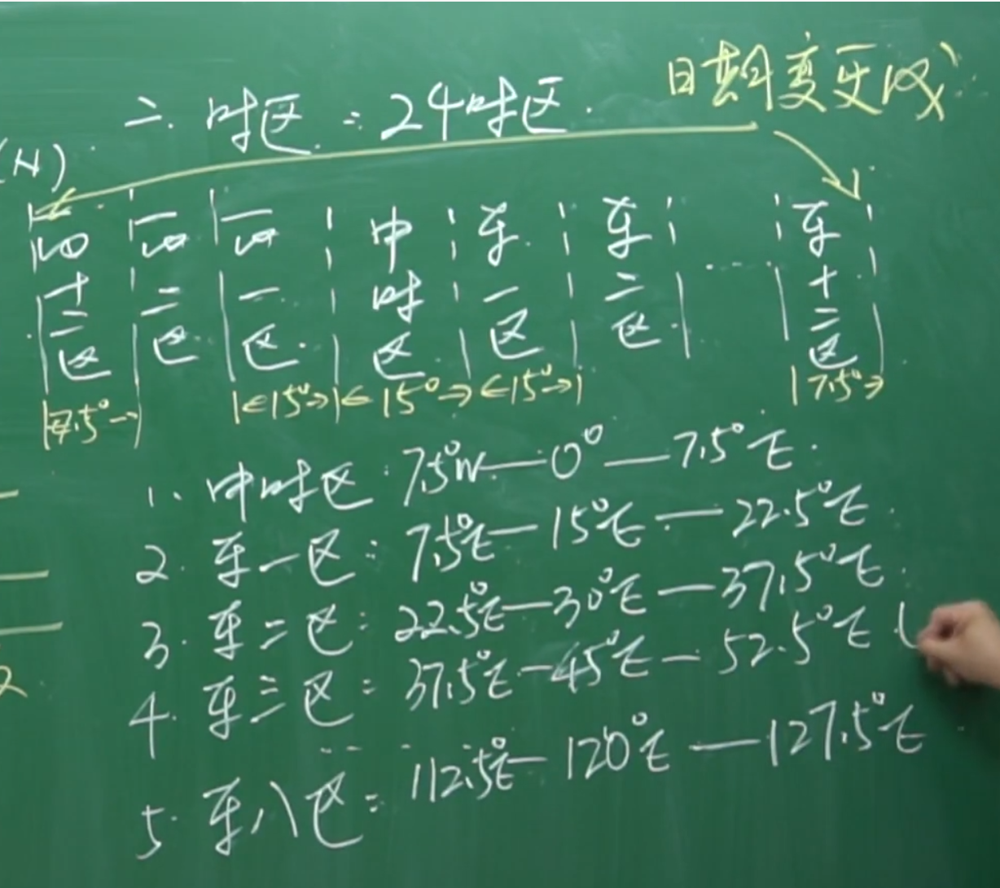

# C罗绝技电梯球啥原理？与香蕉、落叶球啥区别？李永乐老师讲世界杯

1. 香蕉球、落叶球，一个左右旋转，一个上下旋转，都是利用了伯努利原理（空气不可压缩）和马格努斯原理（空气可压缩，定量计算）

   往哪边旋转，球就往哪边飞

   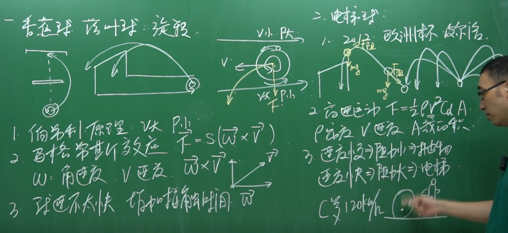
2. 电梯球（空中快速下坠）的要点：球速要非常快，快到空气阻力极大，才能踢的出来

# 为啥毛巾能吸水？植物咋把水从根运到叶子的？李永乐老师讲毛细现象

1. 水滴滴到玻璃上，会吸附在上面，摊开，叫做浸润现象。是因为水和玻璃表面的分子间间距小，水滴分子排斥，所以水面摊开
2. 水滴滴到蜡或者荷叶上，会滚成球，叫做不浸润现象。。是因为水和蜡烛表面的分子间间距大，水滴分子吸引，形成收缩效果，所以水滴成球
3. 水滴在玻璃管中形成下凹截面，两边被玻璃壁边缘拉起来

# 海浪为啥总朝着海岸运动？光为啥会折射？李永乐老师解释波的传播

1. 波面与波线垂直。波面：振动状态相同的点构成的平面，波线：波的传播方向
2. 惠更斯定理：光的入射角等于反射角的证明，为什么光从空气进入水面后会发生折射？因为光在水中的速度比在空气中慢，导致新的子波行走的距离短，所以光线

   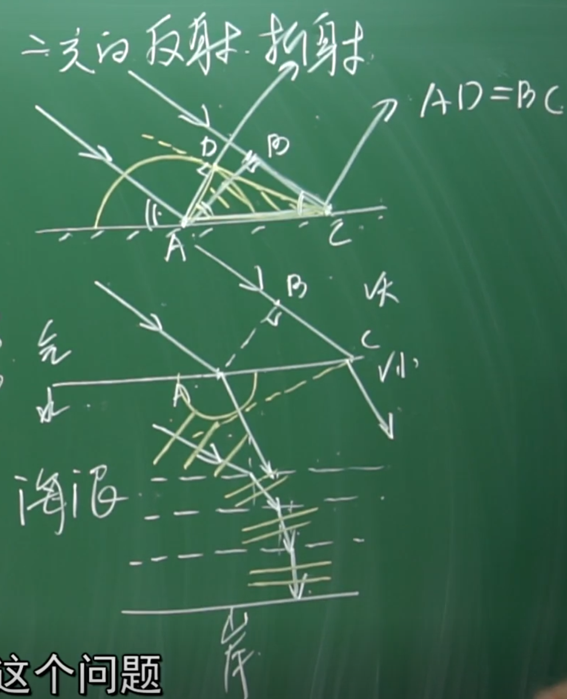
3. 可以把海浪想象成光线，在逐步靠近岸边的过程中，阻力越来越大，速度越来越慢，所以就会慢慢反生偏折，最终平行于岸边打在沙滩上

# 你真的了解储蓄中的“复利”吗？与欧拉数e啥关系？李永乐老师告诉你

1. 复利的上限就是自然底数e的r次幂。r表示利率。如果利率的周期计算的越短，则最后的收益越多，但是有上限，上限就是e^r

# 计算机是怎么计算加法的？模拟数字信号啥区别？李永乐老师讲门电路

1. 加法器是用最基本的异或门和与门实现的

# 手机支付中“数字签名”有啥用？李永乐老师讲生日碰撞和哈希函数

1. 数字签名实现的功能：为了证明我收到的信息是我想要的发送之人发送过来的，不是伪造的。具体方式：对原始信息进行HASH运算后再发送一次，这就是签名数据流，另一个是密码数据流

   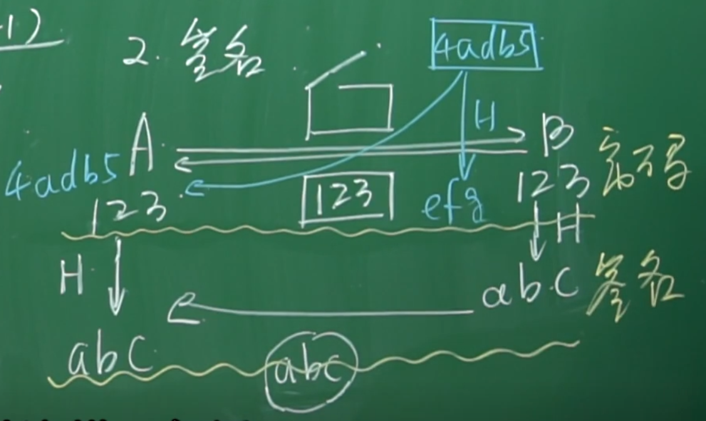

# 初一十五为啥大潮？月球为啥总一面朝地球？李永乐老师讲潮汐锁定

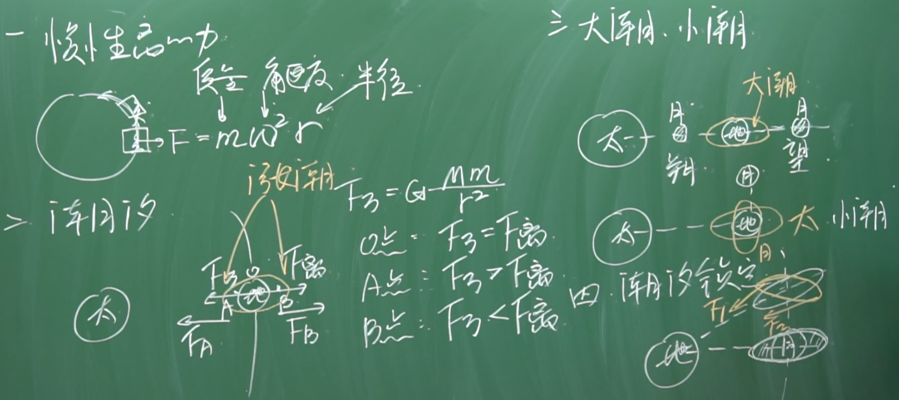

1. 潮汐力包括太阳对地球的潮汐力，也包括月球对地球的潮汐力，且后者影响更大。顾名思义，潮汐力影响的是潮水
2. 对于太阳，靠近太阳的一面会拉伸潮水，远离太阳的一面会拉伸潮水，因此在太阳和地球的连线上，地球会变得椭圆
3. 对于月亮和太阳，如果在一条直线上（初一或者十五），潮水涨的很猛；如果在上弦月或者下弦月，则潮水涨的很小
4. 因为月亮被地球始终拉扯，导致月亮一面始终对着月球；地球也可以始终一面对着月球，但是时间非常长。太阳系里的冥王星和他的卫星就是双面潮汐锁定

# 航母排水量啥意思？如何测心脏体积？李永乐老师讲阿基米德浮力定律

1. 浮力和排开水的体积有关，体积越大，浮力越大，与水的体积无关。因此即使只有一滴水，也能把万吨油轮给浮起来，主要他能够排开足够体积的水就行（按照船体的形状做模具）
2. 轮船的空载排水量就是船的自重

# 中科院的井盖火了！李永乐老师带你了解十个最美的物理公式

1. 傅里叶变换
2. 斯涅耳定律（光线折射）
3. 麦克斯韦方程组
4. 伯努利方程
5. 薛定谔方程
6. 海森堡不确定性原理
7. 阿基米德浮力
8. 质能方程
9. 卡诺定理。热机定理，热能的转换方向
10. 熵。S=k\*Omega，k为玻尔兹曼常数1.38x10^-23J/K，Omega为微观态个数。在一个孤立系统中，微观态个数Omega不断增加，导致熵S不断增加

# 三体问题到底是啥？和“鹊桥”卫星啥关系？李永乐老师讲拉格朗日点

1. 嫦娥工程的3个阶段：无人、载人、基地
   1. 2007年，嫦娥1号，实现无人绕月，最后撞击月球着陆
   2. 2010年，嫦娥2号，实现无人绕月，最后停在拉格朗日点L2
   3. 2013年，嫦娥3号（玉兔号），实现无人登月（人类历史上第二次）
   4. 2018年，嫦娥4号，实现人类历史上首次月球背面着陆，利用嫦娥2号做通讯
2. 双星系统的5个拉格朗日点，前3个由欧拉提出，后2个由拉格朗日提出

   L123为不稳定点，L45为稳定点（日-木系统中L45有两个稳定的小行星群，叫做特洛伊群，就是岩石行星-火星和气体行星-木星之间的小行星群）

   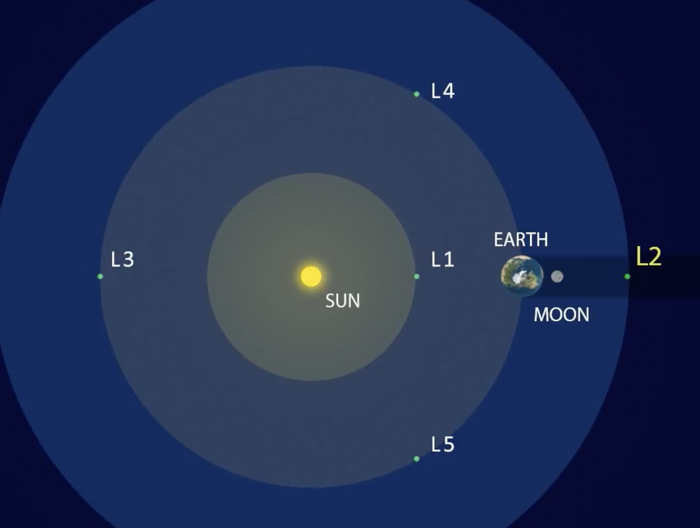

   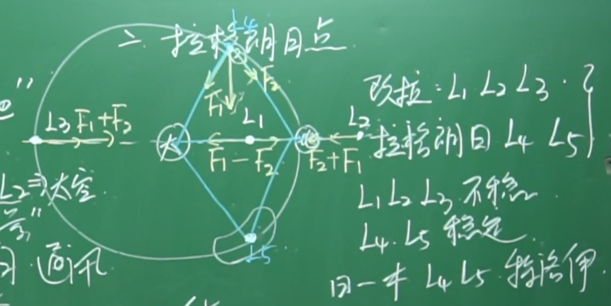

# 啥样的空调省电？能效等级是啥意思？李永乐老师讲热机和卡诺定理

1. 热力学第二定律：不能从单一热源吸热并使之完全做功。总要有一部分热量是需要释放到低温热源中的

   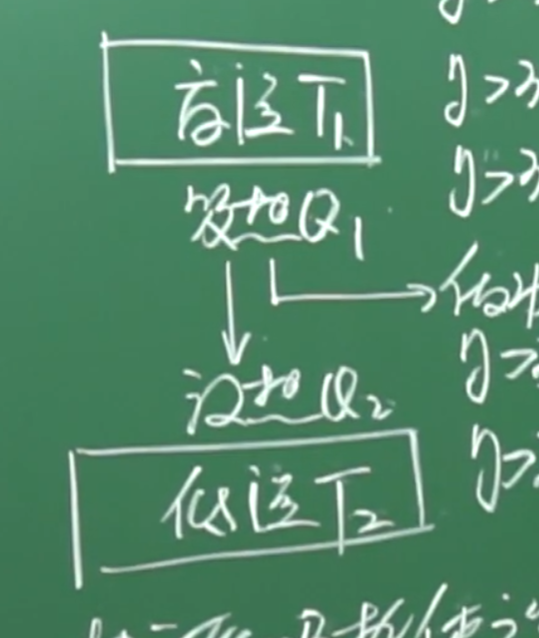
2. 空调能效比：吸收的热量/所做的功。意思是单位做功的前提下，能够吸收多少热量，显然越高越好

   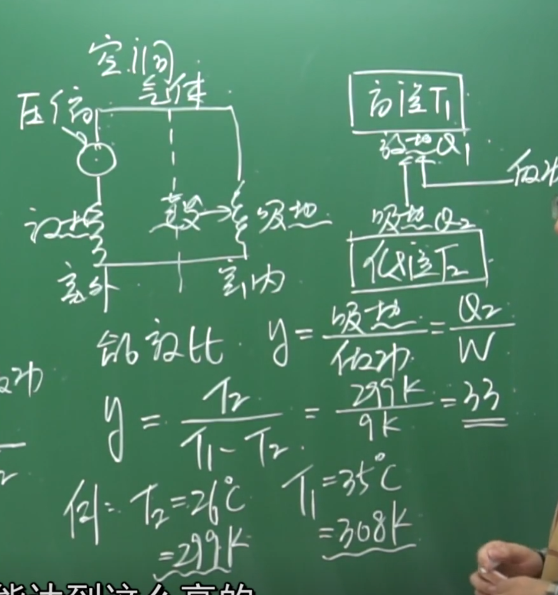

# 亮剑里李云龙“拇指测距”啥原理？李永乐老师讲视差法测天体距离

1. 为什么1度=60分。因为在古巴比伦时代，人们习惯使用12进制，用一只手的五根手指作为进位，另一只手的大拇指去点这只手其他四根手指的3根指节，所以是12x5=60进制
2. 拇指测距、利用行星观测角度差测距均利用了视差法原理测量距离。1AU表示太阳到地球之间的距离

   1pc：秒差距，1pc=1/360\*60\*60个圆周，相当于1pc=3.26ly

   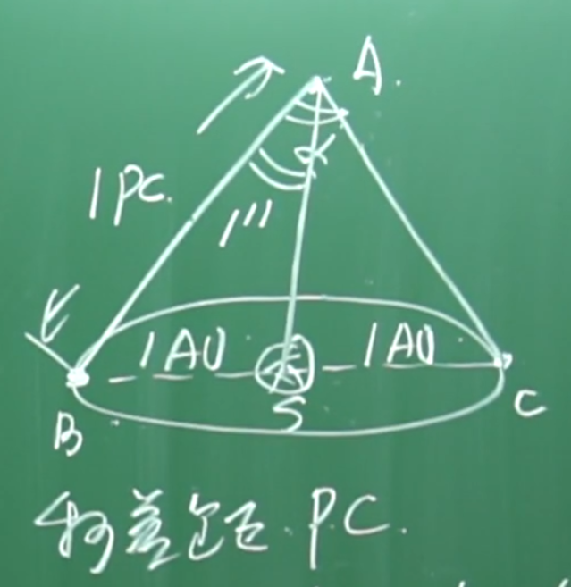
3. 宇宙年龄137亿年是怎么计算出来的。V=H\*D，V为行星相对地球的速度，H为哈勃常数，D为行星相对地球的距离。宇宙年龄t=D/V=1/H，其中H=70km/s/mmpc，得到137亿年

# 近视眼是怎么回事？眼镜度数是啥意思？李永乐老师带你了解近视矫正

1. 屈光度D=1/f，f为镜片焦距，凸透镜为正数，凹透镜为负数
2. 度数100D=100/f

# 你知道植物中隐藏的数学吗？李永乐老师讲神奇的斐波那契数列

1. 花瓣的数量，树枝的分支数，葵花籽的顺时针和逆时针条数，都满足斐波拉切数列

# FM和AM是啥意思？收音机是咋收到音乐的？李永乐老师讲广播信号传输

1. 无线电波的传输方式：

   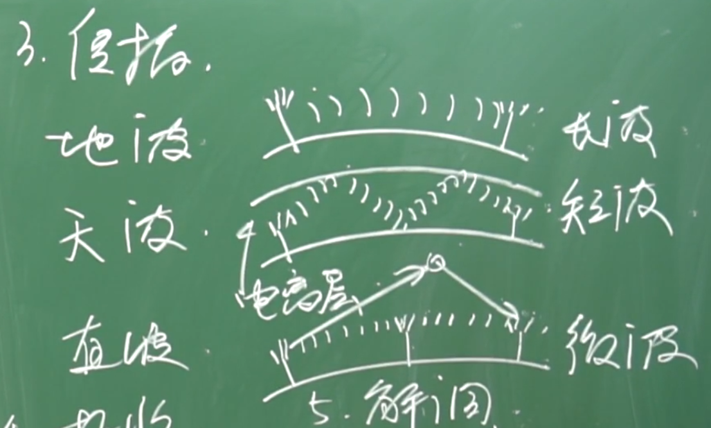
   1. 地波。长波，贴着地表面传播
   2. 天波。短波，在电离层和地面之间反复反射传播
   3. 直波。微波，在地面的不同发射塔之间直线传播

# 无线电报是啥原理？SOS是啥意思？李永乐老师教你如何通电全国

1. SOS并没有英语上的含义，只是因为在摩斯电码里，字母S和字母O最容易用点和横线表示：... — ...
2. 天线是怎么发展而来的？最先开始是一对上下平行的电容，后来掰开一定角度向外传播，再后来把天线一个顶到天上，一个顶到地下，最后形成了一根竖直的天线

# 闰年是怎么回事？清华学霸李永乐老师十年前就给我讲明白了

1. 是4的倍数，但不是100的倍数；或者是400的倍数，就是闰年
2. 为什么闰年这么复杂？是为了在10000年的尺度范围内凑够2422天。2422天怎么来的？
   1. 恒星年（以遥远的恒星为准）：地球围绕太阳旋转一整圈为一个恒星年，365.25636天
   2. 回归年（光线位置回归）：地球在经过自转后，回到去年的相同位置（观察太阳角度）需要的时间为一个回归年，365.2422天
3. 10000年内有多少个闰年？2425个闰年，与2422只差了3天

   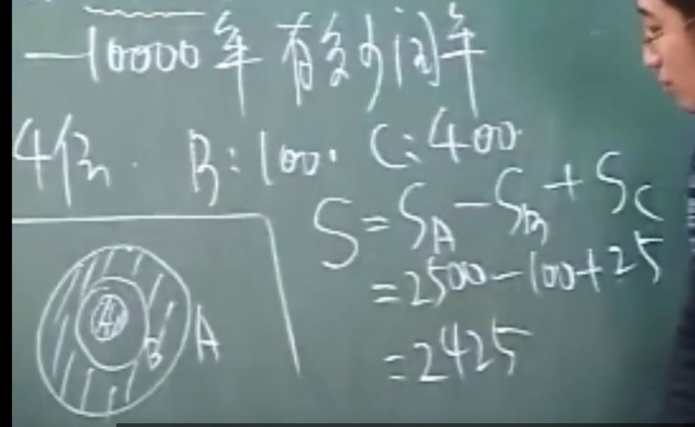

# 银行密码系统安全吗？质数到底有啥用？李永乐老师讲RSA加密算法

1. 对称加密。加密与解密使用相同的秘钥，可靠性较低
2. 非对称加密。加密与解密使用不同的秘钥，可靠性更高
3. RSA是一种非对称加密算法，由MIT的三位教授发明出来，RSA是三位教授的名字首字母

   加密算法难破解的根因在于很难进行大数的质因数分解，量子计算机可以并行计算，大大加快这个过程

   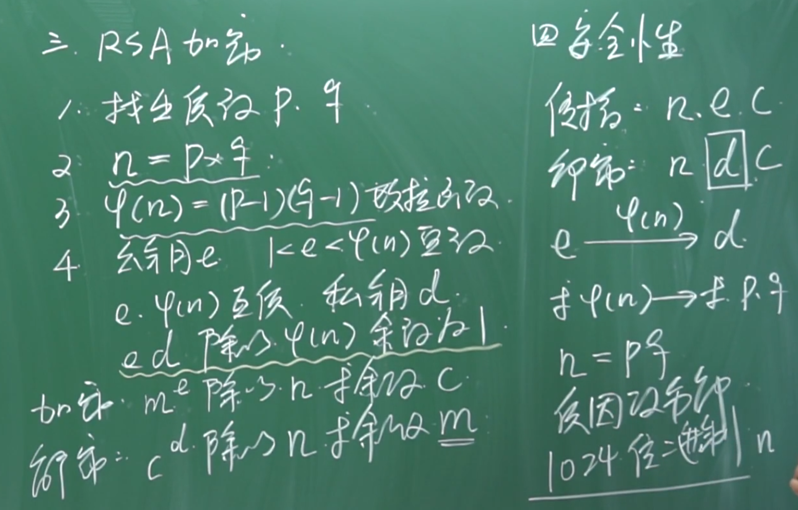

# 电磁炉什么原理？对身体有伤害吗？李永乐老师告诉你什么是涡流

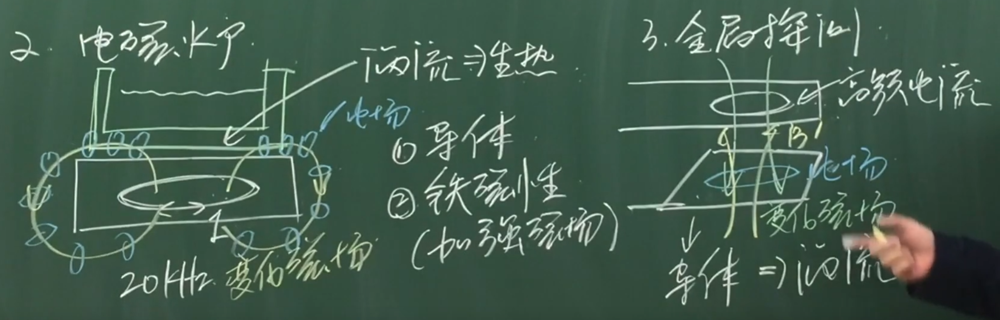

1. 电磁炉内部有很多圈导线，通以20KHz变化频率的电流，并产生变化磁场，再产生小的变化电场，这个电场在导体中产生涡流，并生热
2. 金属探测器的原理和电磁炉类似，高频电流产生高频磁场，高频磁场在金属导体中产生变化电场，变化电场又激发磁场，磁场被检测到就报警

# 电磁波有几类？被伽玛射线照了会咋样？李永乐老师8分钟全告诉你

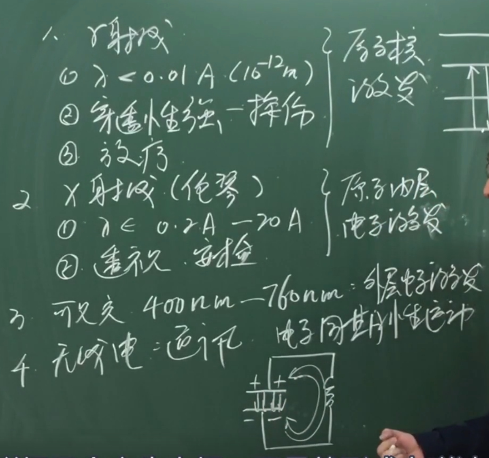

1. 伽马射线。原子核内部激发
2. X射线。原子内层电子激发
3. 可见光。外层电子激发
4. 无线电传输。电子周期性运动

# 量子到底是啥玩意？光是波还是粒子？李永乐老师讲8分钟全告诉你

1. 普朗克对黑体辐射（只吸收和发射，不反射电磁波）的解释开启了量子力学的篇章。他认为振动粒子的能量不是连续的，是一份一份的，且爱因斯坦也因为借鉴了这个思想，解释了光电效应现象，因此获得了诺贝尔物理学奖，并提出了光线的波粒二象性

# “清明时节雨纷纷”为啥清明总下雨？李永乐老师4分钟告诉你原因

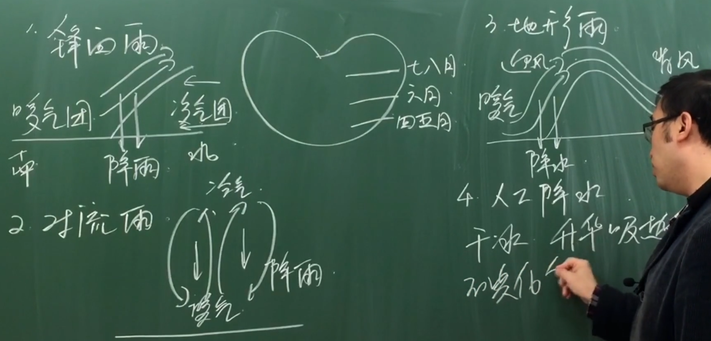

1. 锋面雨。冷暖空气相遇
2. 对流雨。暖空气上升
3. 地形雨。山峰
4. 人工降雨。

# 盯着星星看它就消失了是为什么？李永乐老师带你做有趣的盲点实验

1. 盯着星星看：成像在视网膜的黄斑处（中央凹），此处只有视锥细胞，能够感光强光和颜色，而对弱光信号不敏感，无法感知，所以盯着星星看，星星会消失。而如果把目光移到其他方向，中央凹附近有视杆细胞，对弱光敏感，因此星星又出来了

# 星星为什么是黑白的？牛为什么是色盲？李永乐老师解释眼睛的色觉

1. 视锥细胞在强光下工作，能够分辨颜色
2. 视杆细胞在弱光下工作，无法分辨颜色
3. 狗、牛都是色盲动物，没有视锥细胞，只有视杆细胞
4. 因为星星的光到我们眼睛里的强度较弱，只有我们的视杆细胞在起作用，所以觉得没有颜色，如果用天文望远镜或者相机长曝光，能够看到五颜六色的星空
5. 星星颜色与星星的温度密切相关，温度越高，颜色从红色逐渐变化到蓝色

# 彩虹大家都见过，可你见过霓吗？李永乐老师为你讲述霓虹间的区别

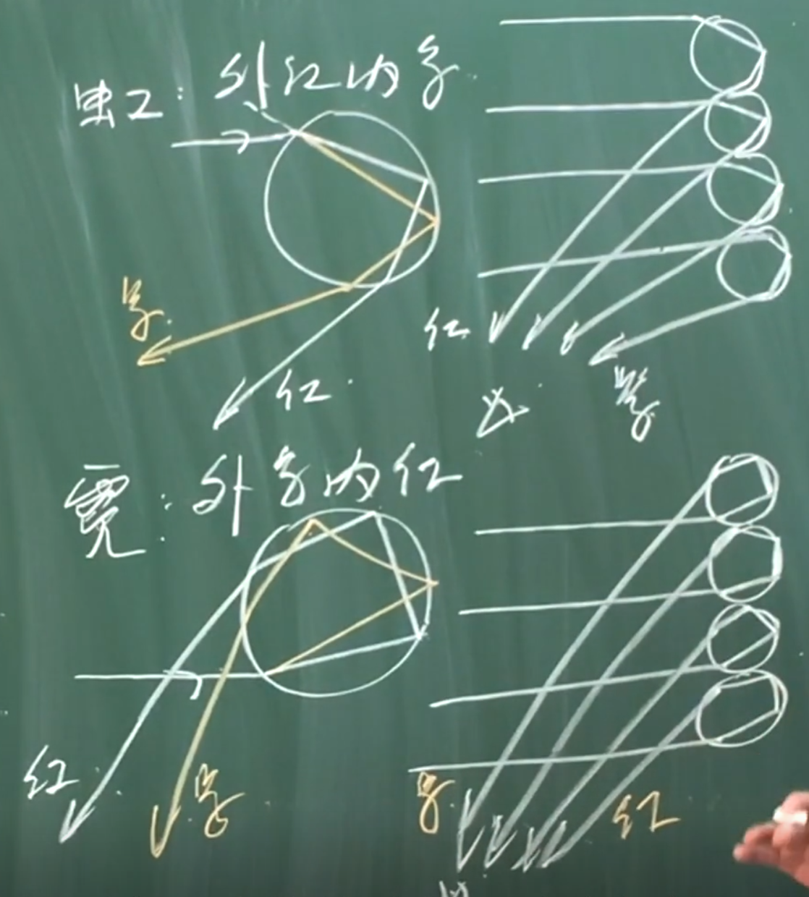

1. 彩虹：2次折射，1次反射。外红内紫，紫光更水平
2. 霓虹：2次折射，2次反射。外紫内红，红光更水平

# 为啥炎热夏天总感觉路面上有水？李永乐老师7分钟解释海市蜃楼

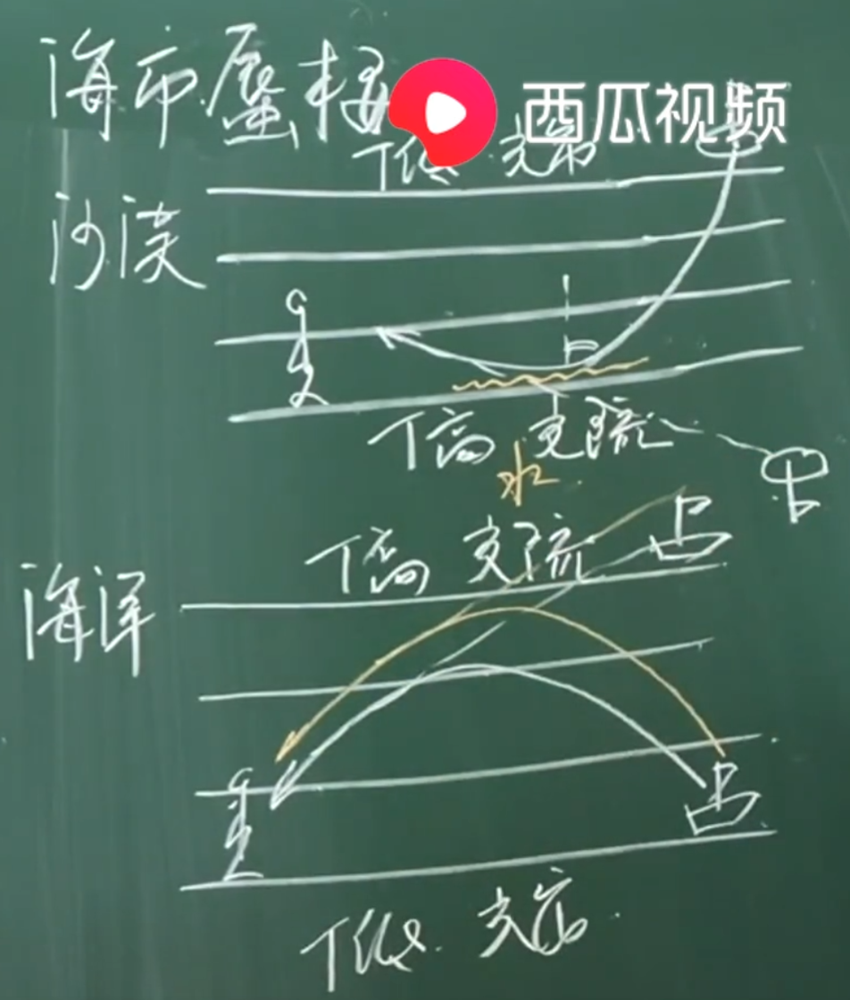

1. 在沙漠中，地面沙子温度高，空气密度低，光疏介质，云彩从天上照射到地面上反正折射和全反射，人眼看过去以为云彩倒立在沙漠里
2. 在大海上，海面温度低，光密介质，船只从海上反射的太阳光线进入空中，经过折射和全发射进入到远处岸边人的眼里，形成了海市蜃楼现象

# 陀螺为什么不倒？自行车呢？李永乐老师6分钟讲生活中的物理道理

1. 力矩方向：从力臂方向指向力的方向，右手法则，则大拇指指向力矩方向
2. 角动量方向：四指指向旋转方向，右手法则，则大拇指指向角动量方向
3. 力矩变化方向与角动量变化方向相同。因此这就是为什么逆时针旋转的陀螺，在地面上会逆时针扭动；反之，顺时针旋转的陀螺，会在地面上顺时针扭动

   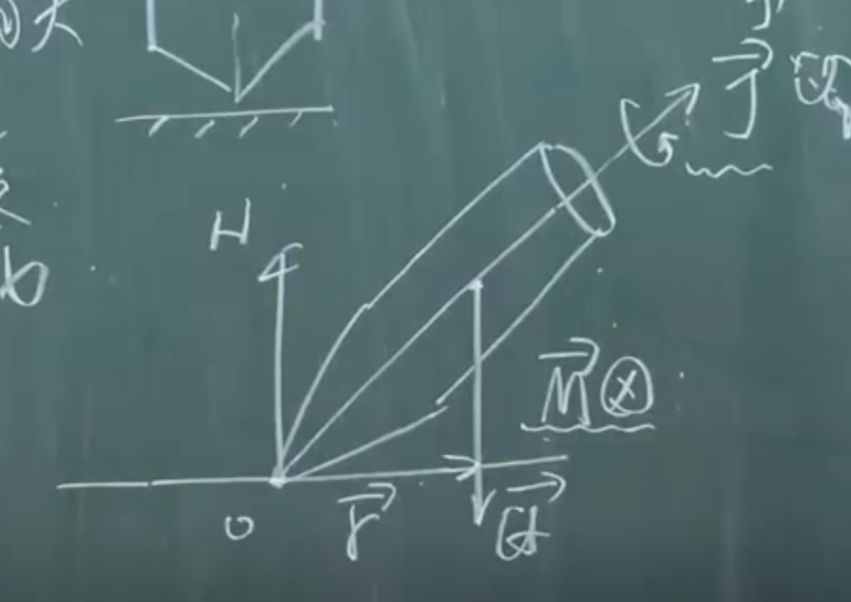

# 日地距离是如何测量的？百年不遇的天文现象李永乐老师却错过两次

1. 根据开普勒第二定律，公转半径的三次方与公转周期的平方比例一定，只需要知道地球对太阳的距离，就知道其他行星距离太阳的距离
2. 通过计算地球相对金星的距离，来计算上述数值。方法是金星凌日法，通过测量地球上两个不同点对金星的观测夹角，根据三角形计算地球相对金星的距离

   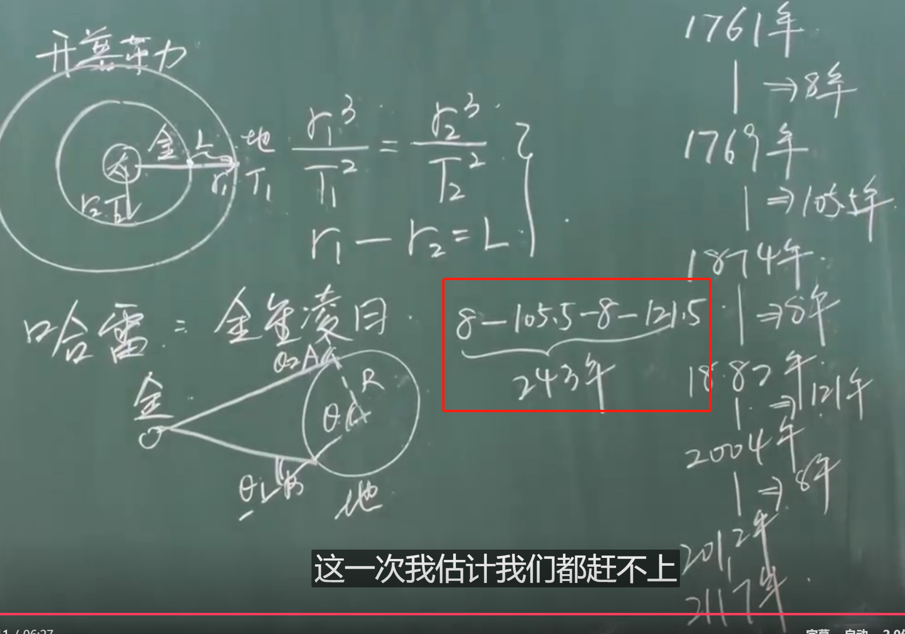

# 雨中走路淋雨多还是跑步淋雨多？李永乐老师7分钟给你讲明白

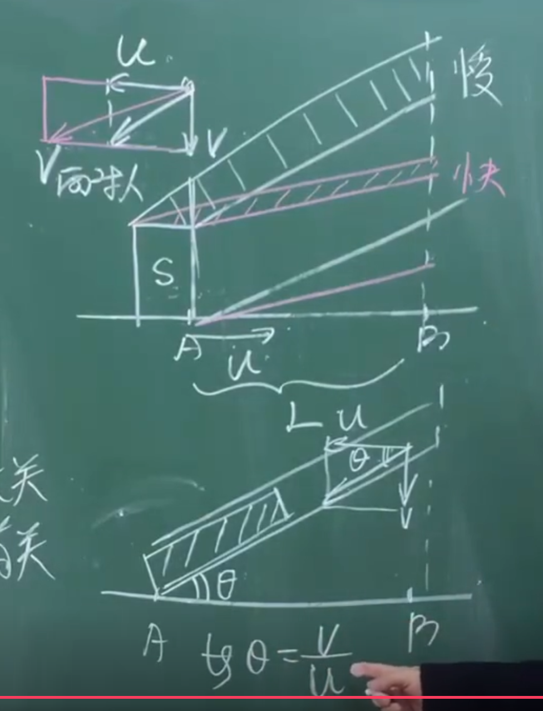

1. 落在人身上的雨滴是在前进方向上的一个圆柱体内
2. 身体前面的雨滴多少与是否跑步无关，但是头顶上的雨滴多少和速度有关，速度越快，雨滴越少
3. 如果跑步速度与雨滴速度一样，且身体往前倾45度，则雨滴最少

# 电饭锅可以用来烧水吗？李永乐老师4分钟带你了解温度传感器

1. 电饭锅根据锅底的感温铁氧体来实现控温：温度超过103℃则会自动失去磁性，因此断开电路加热。如果用它拿来烧开水是不行的，因为水的沸点是100℃，水在电饭锅里会一直封腾直到烧干
2. 电热壶的原理是利用不同金属的膨胀系数不同而实现自动断开、连接加热电路（例如Fe和Cu）

# 百年一遇的月食月亮为啥是红色的？清华李永乐老师5分钟说明白

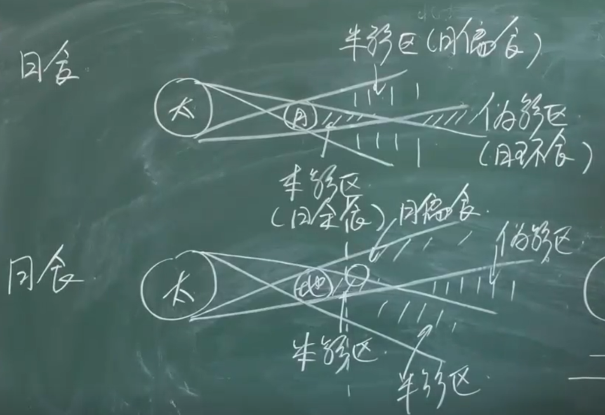

1. 在发生月全食时，月亮变红的原因：太阳光经过大气层后，短波长的蓝光经过散射消耗掉，剩下长波长红光照射到了月亮上，所以月亮呈现红色
