# 《李永乐西瓜视频》4

## 目录

- [美团被罚34亿！阿里被罚182亿！互联网垄断巨头是如何诞生的？](#美团被罚34亿阿里被罚182亿互联网垄断巨头是如何诞生的)
- [千万粉丝科普大V翻车？30万公里长的导线，灯泡几秒才会亮？](#千万粉丝科普大V翻车30万公里长的导线灯泡几秒才会亮)
- [我们为啥总花钱买没用的东西?异常消费之交易效用](#我们为啥总花钱买没用的东西异常消费之交易效用)
- [100亿美元造的韦伯空间望远镜望能干啥?宇宙演化和外星生命就看它](#100亿美元造的韦伯空间望远镜望能干啥宇宙演化和外星生命就看它)
- [为何我们能赢0.01秒？短道速滑中国夺冠！](#为何我们能赢001秒短道速滑中国夺冠)
- [伦镍暴涨，青山控股遭逼空！LME为何“拉偏架帮中国人”？](#伦镍暴涨青山控股遭逼空LME为何拉偏架帮中国人)
- [哥尼斯堡七桥问题：什么样的图形可以一笔画？](#哥尼斯堡七桥问题什么样的图形可以一笔画)
- [什么车能吸在隧道顶狂飙？不得不学的空气动力学！](#什么车能吸在隧道顶狂飙不得不学的空气动力学)
- [病毒为何不停变异？旅行推销员问题和遗传算法](#病毒为何不停变异旅行推销员问题和遗传算法)
- [谷歌面试题：12个小球里找次品，天平最少秤几次？](#谷歌面试题12个小球里找次品天平最少秤几次)
- [核酸检测原理是什么？如何从千万人中找到阳性感染者？](#核酸检测原理是什么如何从千万人中找到阳性感染者)
- [浙江舟山惊现“血红色天空”！专家是这样解释的……](#浙江舟山惊现血红色天空专家是这样解释的)
- [什么样的游戏有必胜法？象棋、围棋、金铲铲…哪种博弈更复杂？](#什么样的游戏有必胜法象棋围棋金铲铲哪种博弈更复杂)
- [详细解读锂离子电池微观尺度下的工作原理（收藏必备）](#详细解读锂离子电池微观尺度下的工作原理收藏必备)
- [交养老保险值不值？退休后你能拿多少养老金？](#交养老保险值不值退休后你能拿多少养老金)
- [福建舰的“电磁弹射”技术是什么？为何能巨幅提升航母战斗力？](#福建舰的电磁弹射技术是什么为何能巨幅提升航母战斗力)
- [梦见裸体、考试、亲人死亡…啥意思？弗洛伊德说这是未满足的欲望](#梦见裸体考试亲人死亡啥意思弗洛伊德说这是未满足的欲望)
- [为啥十五的月亮十六圆？你能读懂“月相”吗？](#为啥十五的月亮十六圆你能读懂月相吗)
- [梅洛定理：游戏开始时，结局就定了！博弈论与纳什均衡（一）](#梅洛定理游戏开始时结局就定了博弈论与纳什均衡一)
- [奥密克戎到底有多毒？抗原检测啥原理？](#奥密克戎到底有多毒抗原检测啥原理)
- [买车必修课：气缸排量、扭矩功率、涡轮增压、混合动力…都是啥？](#买车必修课气缸排量扭矩功率涡轮增压混合动力都是啥)
- [宇宙有多大？天上的星星和地上的沙子谁更多？](#宇宙有多大天上的星星和地上的沙子谁更多)
- [耗资2.5亿美元的生物圈2号实验失败！人类还能创造生态系统吗？](#耗资25亿美元的生物圈2号实验失败人类还能创造生态系统吗)
- [俞敏洪整理一次书架要多长时间？10000本书，哪种排序算法最好](#俞敏洪整理一次书架要多长时间10000本书哪种排序算法最好)
- [如何避免《狂飙》悲剧？空气开关、漏电保护开关啥原理？](#如何避免狂飙悲剧空气开关漏电保护开关啥原理)
- [室温超导硬核解析：未来已来还是科学骗局？](#室温超导硬核解析未来已来还是科学骗局)
- [硅谷银行为何倒闭？这和全球疫情、中美摩擦、俄乌战争都有关](#硅谷银行为何倒闭这和全球疫情中美摩擦俄乌战争都有关)
- [“五一”挤死也要旅游，图个啥？用马斯洛需求层次理论分析一下](#五一挤死也要旅游图个啥用马斯洛需求层次理论分析一下)

# 美团被罚34亿！阿里被罚182亿！互联网垄断巨头是如何诞生的？

1. 梅特卡夫定律：网络节点越多，价值越高，价值效用与节点数量为平方关系
   1. 腾讯、Fackbook日活用户作为节点，公司营收之间满足平方关系
   2. 千团大战、打车APP、ofo摩拜抢用户都是基于以上定律的现实现象

# 千万粉丝科普大V翻车？30万公里长的导线，灯泡几秒才会亮？

1. 电荷的热运动速度：10^5m/s
2. 电荷的定向移动速度：10^-4m/s。这也就是说，灯泡亮的原因不是因为电荷的移动，而是有其他原因
3. 电场建立的速度：3x10^8m/s
4. 坡印廷矢量S：电磁波在真空中传播的方向，即能量流动方向

   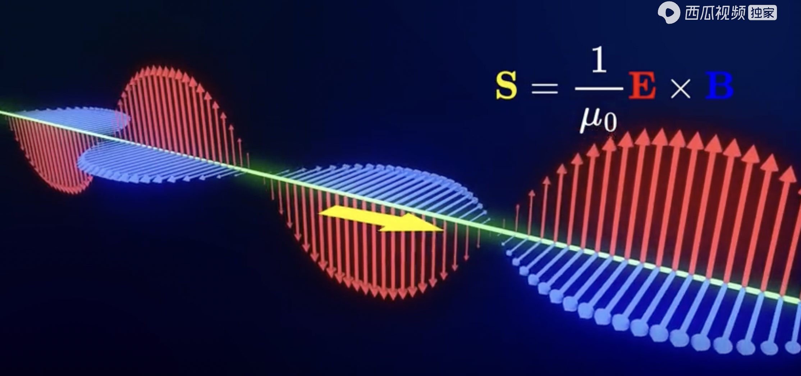
5. 电路电场、磁场、电磁场方向图：能量从电池发出，在灯泡吸收

   红色为电场方向，正电荷发出；蓝色为磁场方向，符合右手螺旋定则；黄色的电磁场能量传播方向，满足ExB的右手差乘方向

   无论电流方向如何，电磁场能量方向始终从电池传向灯泡

   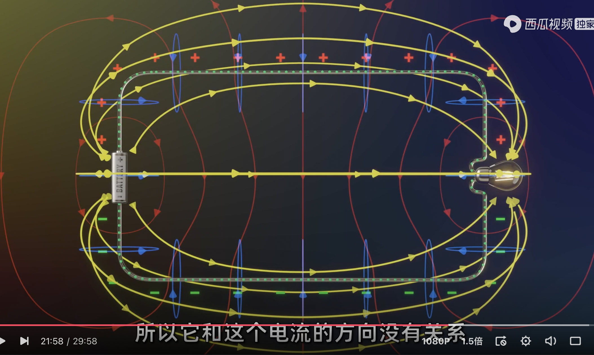
6. 根据实际实验，表明电流在导线中传播的速度差不多为2x10^8m/s

# 我们为啥总花钱买没用的东西?异常消费之交易效用

1. 产品总效用=获得效用（f（z-p））+交易效用（f（p *-p）），其中z为价值，p为价格，p*为参考价格
   1. 你认为的产品总效用由获得效用和交易效用组成，你觉得价值高，但是卖的价格低了，你会觉得赚到了，这就是获得效用高
   2. 你觉得价格虽然高，但是参考价格更高，你也会觉得赚到了，这就是交易效用高
   3. 举例：旅游高价购物你不需要的东西、图书定价原价更高、电商划线价、优惠券

# 100亿美元造的韦伯空间望远镜望能干啥?宇宙演化和外星生命就看它

1. 宇宙年龄138亿年，可观测宇宙半径为465亿光年（膨胀速度>光速）如果我们能够看的更远，则能看到宇宙之初形成的样子（现在最远可以看到134亿年前的星系）。如果有个距离地球几亿年前的外星人观察地球，则会看到恐龙时代的地球模样
2. 望远镜能看什么？
   1. 遥远的宇宙。看的更远
   2. 古老的宇宙。红外线拉伸量
   3. 行星的大气。通过观察光谱
3. 几款典型的望远镜型号：
   1. 哈勃望远镜：观察到了红移现象，催生了宇宙大爆炸理论的诞生

      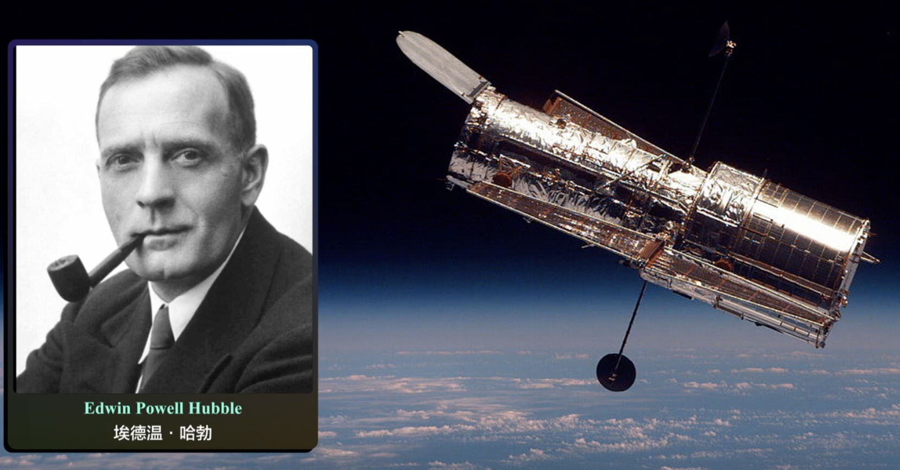
   2. 韦伯望远镜：在地球后面150万公里远的拉格朗日点

# 为何我们能赢0.01秒？短道速滑中国夺冠！

1. 衣服表面不是越光滑阻力越小，空气阻力分为两种：摩擦阻力、压差阻力
   1. 压差阻力需要减小物体背后形成的湍流，所以凹凸不平的表面其实更有利于减阻

# 伦镍暴涨，青山控股遭逼空！LME为何“拉偏架帮中国人”？

1. 青山控股的资本业务流转图，主要生产不锈钢

   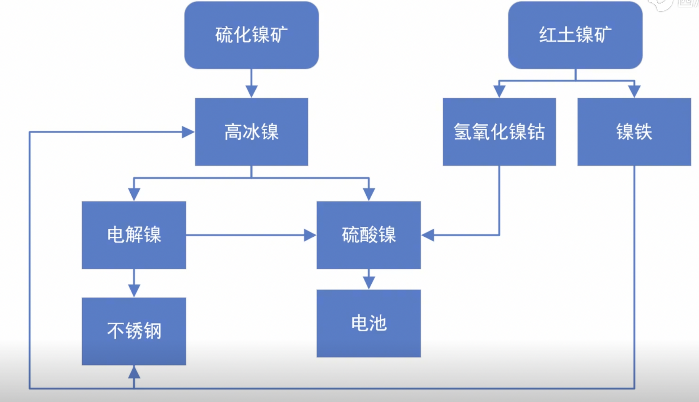

# 哥尼斯堡七桥问题：什么样的图形可以一笔画？

1. 可以一笔画的图形：0个奇点或者2个奇点
   1. 原因：0个奇点表示全是偶点，意味着所有点一进一出；2个奇点表示一个奇点为起点，另一个奇点为终点

# 什么车能吸在隧道顶狂飙？不得不学的空气动力学！

1. 液压机原理：液体能够传递压强，两端页面的压强是一样的，如果面积不同，则产生的压力/推力会不一样，由此可以发明液压机

   F1/S1=F2/S2

   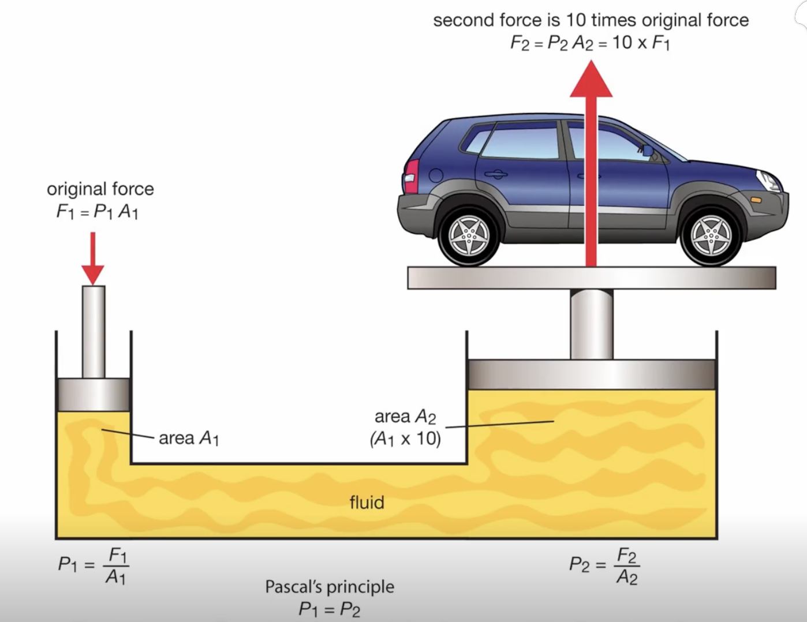
2. 飞机的地面效应：能够减少翼尖涡流作用，所以在近地面时上升力会增大
3. 汽车要吸在隧道顶上，必须满足空气下压力大于车身重力，路透斯的一辆跑车可以满足要求，但是仅限于理论计算

# 病毒为何不停变异？旅行推销员问题和遗传算法

1. 基因在遗传时符合分离重组定律，同时会有小概率的同源染色体互换，这两个特性会导致后代呈现新的特性
2. 遗传算法原理：随机选中几个样本，选取目标参数，取倒数后作为适应度因子，后续遗传过程中通过随机交换，找到近似最优解

# 谷歌面试题：12个小球里找次品，天平最少秤几次？

1. 信息熵问题。每次把天平的3种可能性全部发挥出来，每次降低到原先1/3，需要降低k次，才能锁定到1颗球。
   1\.
   $$
   2 N \times\left(\frac{1}{3}\right)^{k} \leqslant 1
   $$
2.

# 核酸检测原理是什么？如何从千万人中找到阳性感染者？

1. 核酸检测的流程：提纯RNA，逆转录cDNA，PCR扩增，荧光定量
   1. 已知病毒RNA，利用引物，逆转录出cDNA，并对DNA进行PCR扩增，再通过特异性的荧光探针来标定扩增效果，在紫外线照射下，如果快速出现荧光效应就是有病毒（Ct<37次扩增）
   2. 时间上不超过4个小时，这个限制条件是PCR扩增速度给出的

# 浙江舟山惊现“血红色天空”！专家是这样解释的……

1. 当空气气体分子尺寸直径大于光波波长时，会出现米氏散射。现象是所有光波全部被散射，这就解释了为什么云彩是白色的；乌云是因为光透不过去才是黑色，而不是因为云很脏

   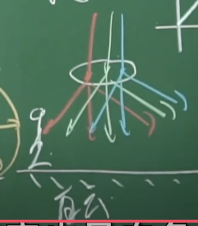

# 什么样的游戏有必胜法？象棋、围棋、金铲铲…哪种博弈更复杂？

1. 完全信息博弈：信息双方都知道，比如围棋，象棋，五子棋。此类游戏一定有一个最优解，从而得出要么先手胜，后手胜，或者和棋
2. 井字棋的结局：26830种

   状态空间复杂度：每个格子可能的状态数量

   游戏树复杂度：游戏总共的决策分支数

   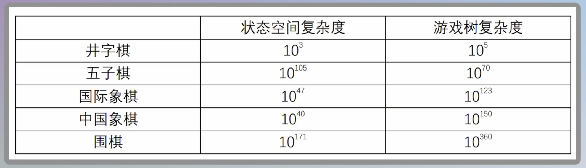
3. 麻将的信息集复杂度（不完全信息博弈）：10^165=10^115（信息集大小，已知的信息个数）\*10^49（信息集个数，未知的信息个数），复杂度比围棋低一些

   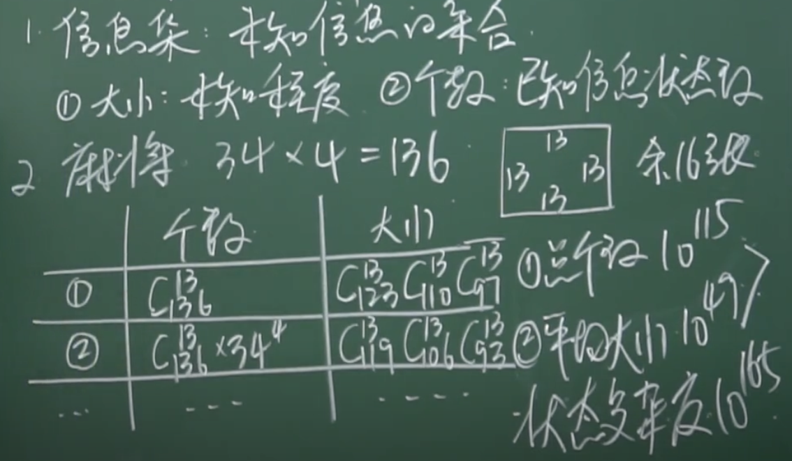

   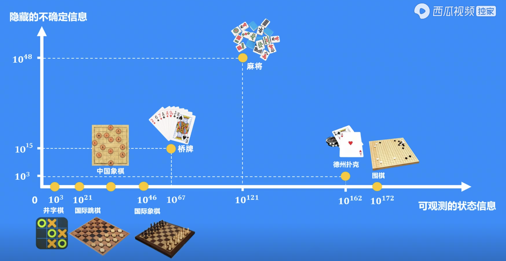
4. 完全信息博弈可以找到最优策略，但是不完全信息策略无法找到最优策略，因为存在不确定性

# 详细解读锂离子电池微观尺度下的工作原理（收藏必备）

1. Li原子有两层电子壳，第一层2个电子，第二层1个电子，最外层电子非常容易失去，容易形成电流
2. 充放电过程：电场通过场把能量传递到灯泡，正离子在电解液中慢速运动（扩散）；Li原子在电解液的两边一会失去电子，一会捕获电子，不是同一个电子
3. LiNi电池：Ni的氧化物缺电子，向Li原子借电子
4. 充电过程（分离Li原子的粒子和电子）：Li+粒子电离进入电解液进入到负极，电子经过外部回路进入到负极和Li+重新结合成Li原子

   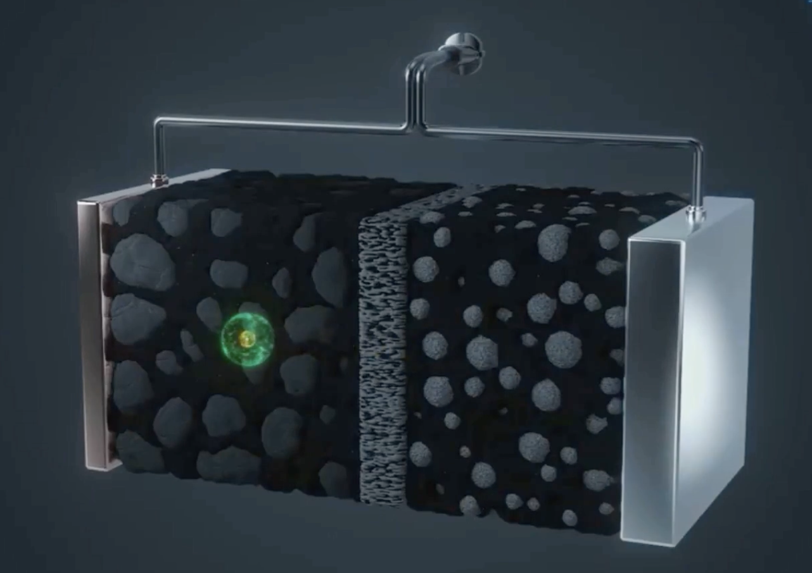
   1. 随着充电的时间增加，正极失去的Li原子越来越多，正极就把电子拽的更紧，需要更高的电压把Li原子分离出来
5. 电解液中有隔膜，目的是通过Li+离子而不通过电子，避免正极和负极材料短路；电解液必须呈现电中性
6. 负极材料的表面因为电解液中有VC溶剂所以会形成一层保护膜（SEI膜），从而保护负极材料，这会消耗5-10%的Li，从而降低5-10%的电池容量【出厂前就已经发生了】

   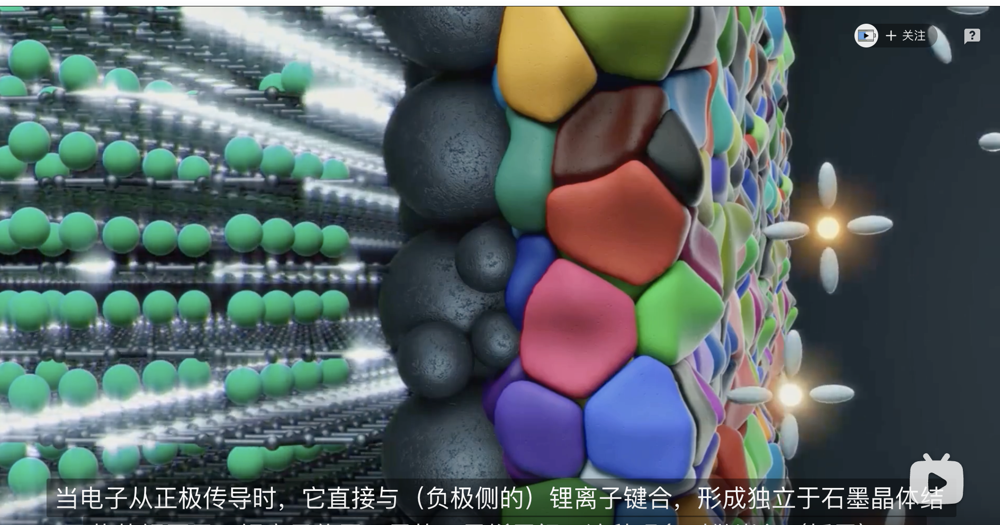
7. 嵌入：来自导线中的电子与Li+在石墨层中间碰头合并为Li原子，这种现象叫做嵌入
8. 充满电的状态：

   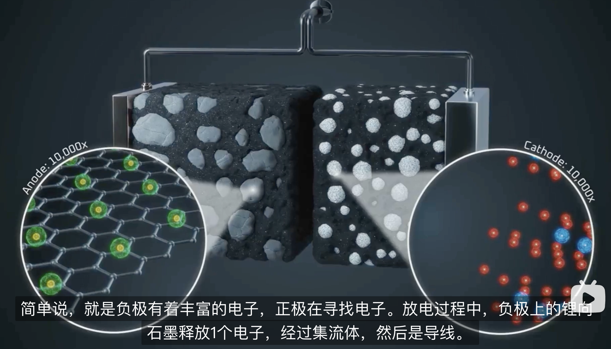

   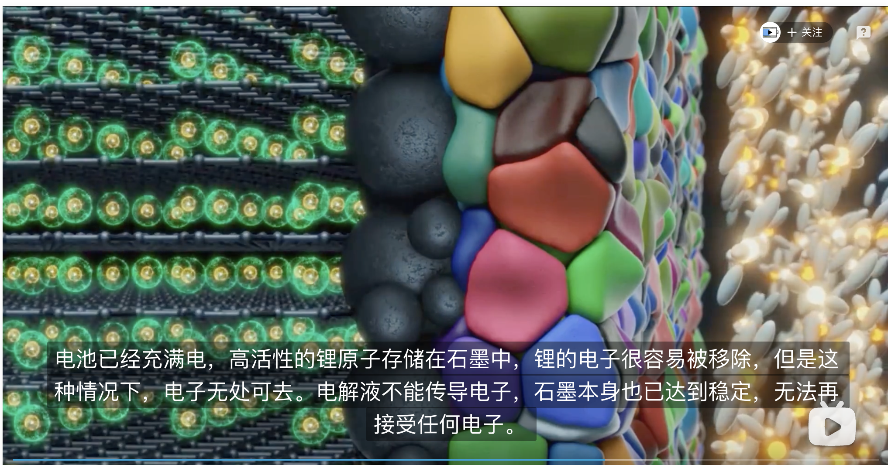

# 交养老保险值不值？退休后你能拿多少养老金？

1. 中国养老金体系：

   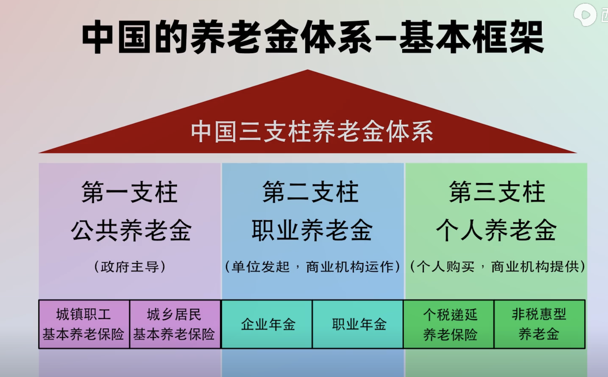
2. 城镇职工基本养老保险：
   1. 个人养老金：8%跟着个人走，钱可以积累，到一个新地方可以转移过去，死后可以继承
   2. 基础养老金：16%是企业交的，现收现付，意思是你现在交的钱给了现在的退休老人，并且不会转移地点，所以退休去其他城市可能当地政府不欢迎，因为你的钱没转移过去，要靠当地人收入给你养老
   3. 拿到养老金的条件：
      1. 交满15年
      2. 达到退休年龄
      3. 发多少钱：账户余额/计发月数。计发月数如下：

         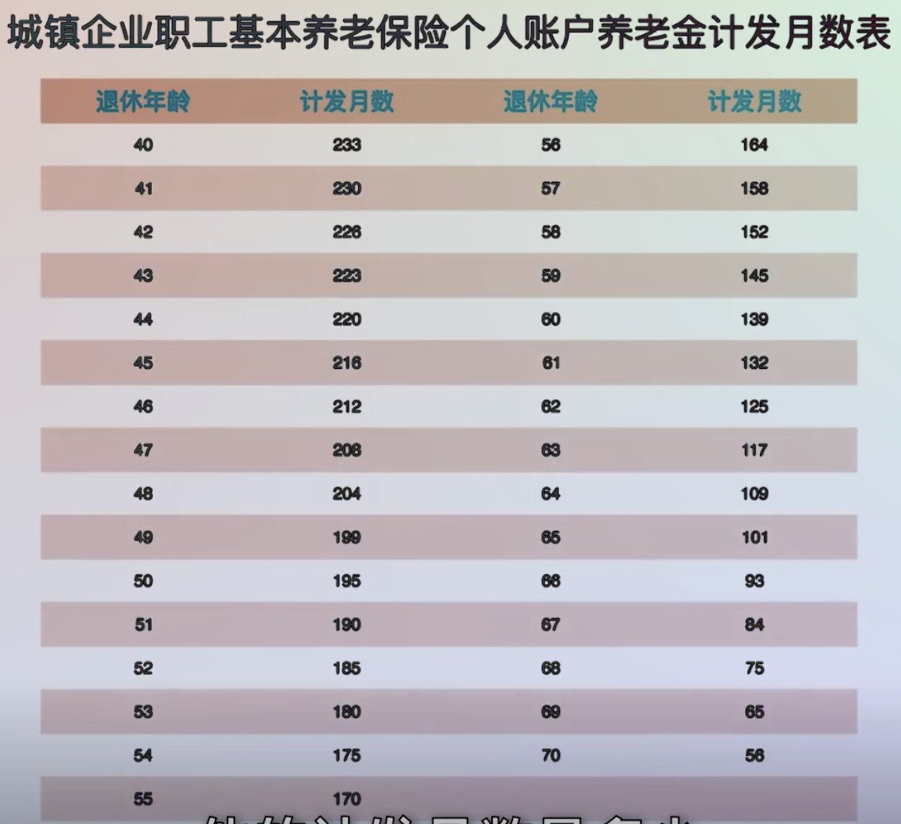
      4. 只要人一直活着，养老保险就会一直发，不会停发，即使账户没钱了也没关系；如果中途去世，养老保险由家属继承
   4. 退休后能拿到的养老保险总额=个人保险（个人账户余额/计发月数）+单位保险（市平均工资 *(1+平均工资指数)/2*年限\*1%）
      1. 平均工资指数=你的工资/市平均工资
   5. 老人去世后，亲属还可以拿到丧葬费、抚恤金
      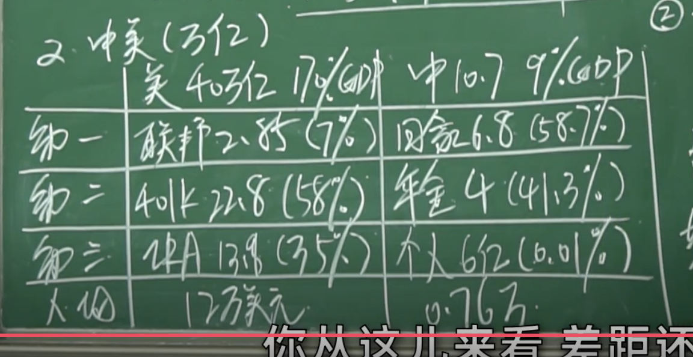

# 福建舰的“电磁弹射”技术是什么？为何能巨幅提升航母战斗力？

1. 航空母舰上飞机的起降技术：
   1. 垂直起降
   2. 滑跃起飞。航空母舰舰头上翘
   3. 蒸汽弹射。用巨大的蒸汽缸，用蒸汽带动战斗机前轮弹射起飞。问题：预热时间长（24小时），耗水量大，无法拖动重型飞机（比如带有雷达的预警机）
   4. 电磁弹射。中国的福建舰和美国的福特舰拥有此技术
      1. 电子电力。
      2. 电力储能。旋转飞轮储能
      3. 直线电机。单匝通电导线磁场加速，多匝线圈直线加速

# 梦见裸体、考试、亲人死亡…啥意思？弗洛伊德说这是未满足的欲望

1. 所有的梦，来源于：潜意识、俄狄浦斯情结、性冲动
2. 梦是欲望的满足。为什么梦要伪装？因为如果不伪装，意识的稽查机制会把意识给枪毙掉，所以必须进行伪装

# 为啥十五的月亮十六圆？你能读懂“月相”吗？

1. 互文修辞手法。并不是月亮在十六更圆，月亮在十四\~十七都有可能更圆。
   1. 秦时明月汉时关
   2. 将军百战死，壮士十年归
   3. 不以物喜不以己悲
   4. 千里冰封，万里雪飘

# 梅洛定理：游戏开始时，结局就定了！博弈论与纳什均衡（一）

1. 回合策略制游戏，一定会存在一个最优解，直接决定了先手赢还是后手赢
   1. 从最后一步开始往回溯，可以推导出先手的最优策略
2. 纳什均衡点并不一定是集体最优解。如同加塞堵车，显然不是集体最优，但是一定是个人最优

# 奥密克戎到底有多毒？抗原检测啥原理？

1. 核酸检测有三种：
   1. 核酸检测。直接检测整个病毒。准确，但是速度慢
   2. 抗原检测。只检测病毒表面的蛋白质结构（抗原）。
   3. 抗体检测。只检测是否有抗体。可用在检测这个人是否得过新冠
2. 核酸检测胶体金法：

   因为金原子反射光线，所以看到红色；两条杠代表阳性，一条杠代表阴性，没有杠代表试剂失效

   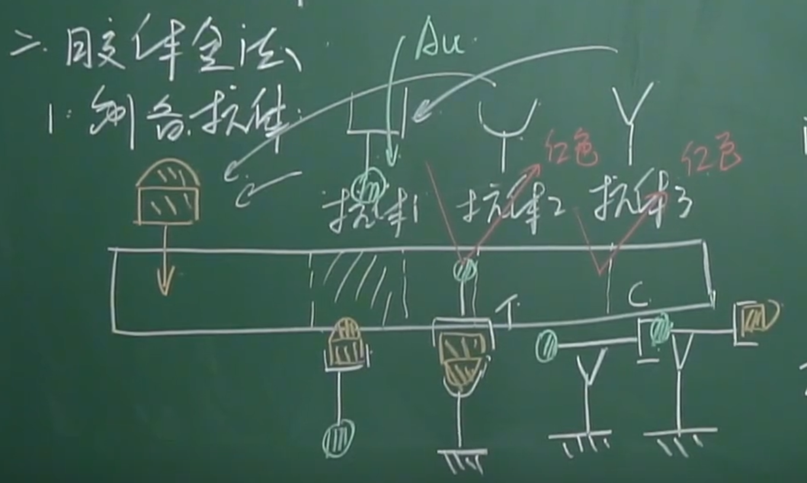
3. 是否能生产单克隆抗体是衡量一个生物制药公司的关键指标

# 买车必修课：气缸排量、扭矩功率、涡轮增压、混合动力…都是啥？

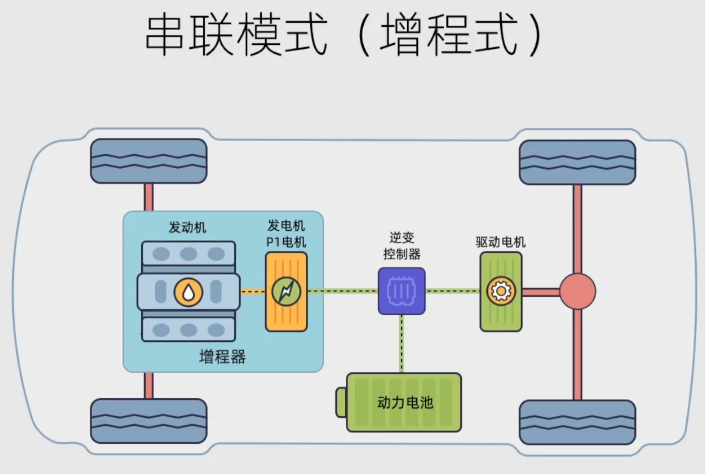

更省油

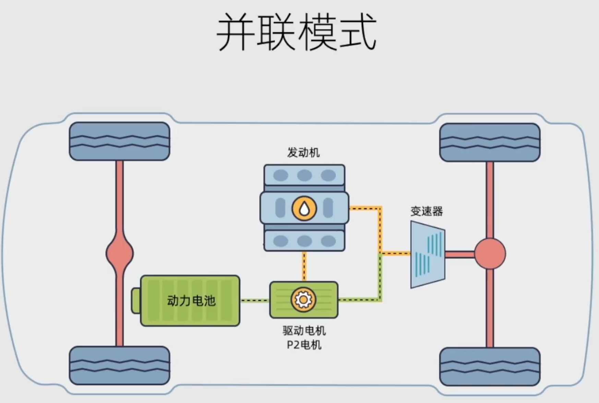

功率大，但是系统更复杂

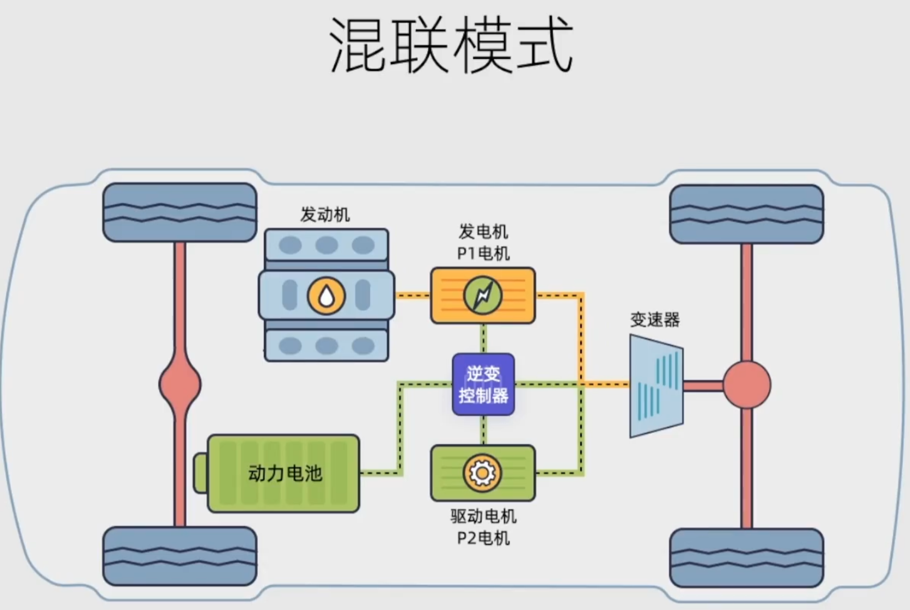

# 宇宙有多大？天上的星星和地上的沙子谁更多？

1. 天狼星最亮，双星系统，8.6ly
2. 南门二（三体星系），4.2ly

   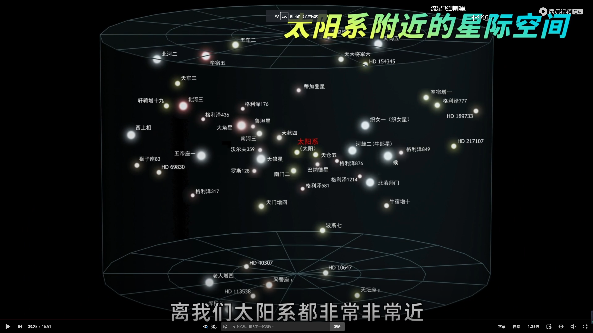

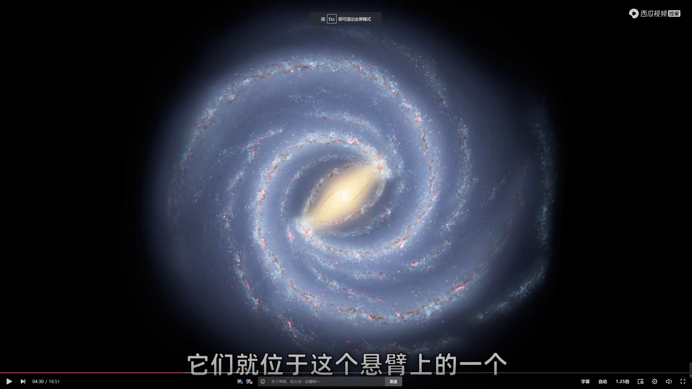

银河系有4个悬臂，里面有1000-4000亿颗恒星；直径10w ly

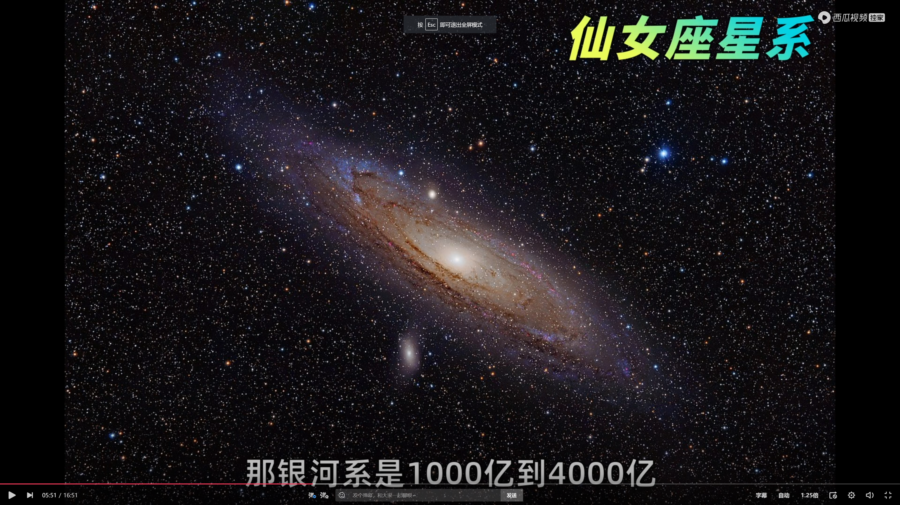

仙女座星系：1W亿颗恒星；距离银河系250W ly

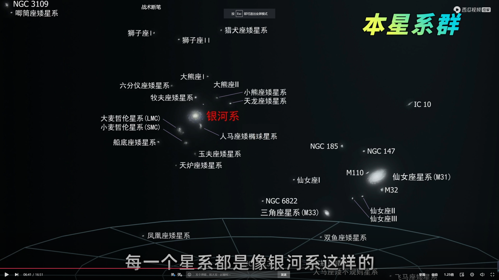

# 耗资2.5亿美元的生物圈2号实验失败！人类还能创造生态系统吗？

1. 生态系统的三大功能：能量流动（食物链）、物质循环（C循环）、信息传递（蚂蚁）。
2. 生物圈二号实验失败了。目前人类没有能力创造自主的生物圈，只有一个地球

# 俞敏洪整理一次书架要多长时间？10000本书，哪种排序算法最好

1. 直接排序。每次选最小，逐步排最小。复杂度恒定n2
2. 冒泡排序。相邻选最小，逐步排最大。复杂度平均n2
3. 快速排序。选某个标准，小的在前，大的在后。复杂度平均nlog2n，最差n2
4. 归并排序。先分组，再合并。复杂度平均和最差都是nlog2n

# 如何避免《狂飙》悲剧？空气开关、漏电保护开关啥原理？

1. **保险丝**。火线断路
2. **空气开关**。

   快跳闸。极大电流引起的火线断路，能够立即恢复

   慢跳闸。长时间大电流引起的金属片弯曲火线断路，需要金属片冷却后才能恢复

   多金属片灭弧室
3. **漏电保护**。电磁感应现象。因为漏电涉及到磁场变化，可以引起电流变化，根据电流变化同时切开火线和零线，实现漏电保护

   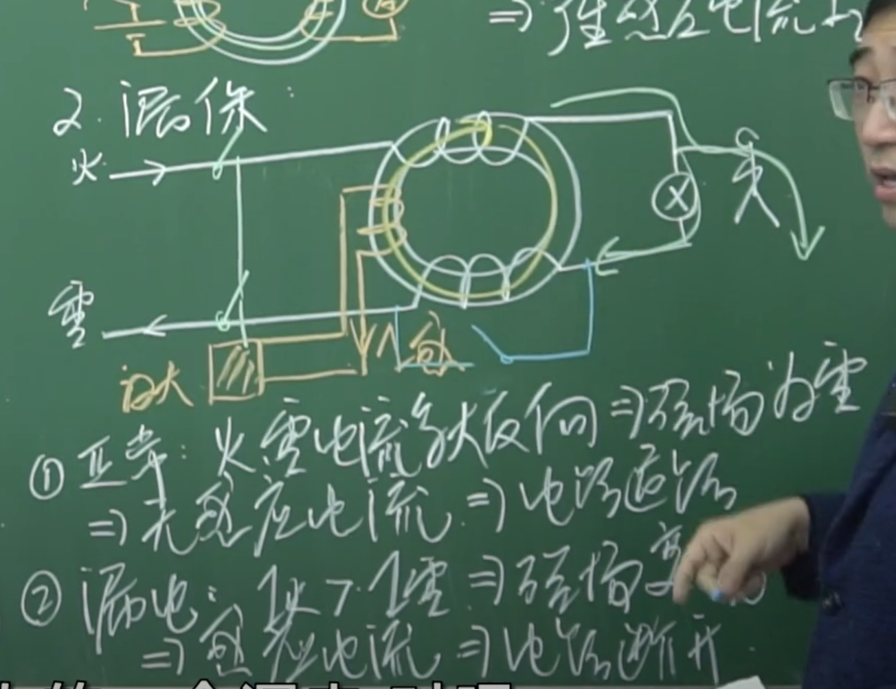

   每个月按一次的按钮可以检查开关是否好使

# 室温超导硬核解析：未来已来还是科学骗局？

1. 普通金属为什么通电会发热？

   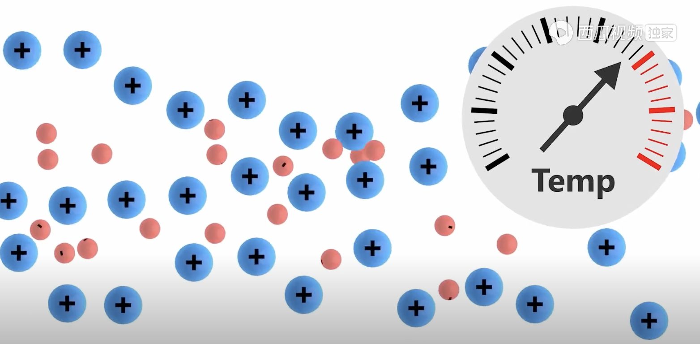

   正电荷固定在栅格里做小范围的运动，自由电子来回运动形成电流，自由电子在运动过程中撞击正电荷栅格从而引起发热
2. 在金属温度降低到一个临界温度时会产生电阻变为0的现象
3. 完全抗磁性：磁场无法穿透超导体，而是绕过超导体，超导体内部产生与外界反向的磁场，实现物体的悬浮
   1. I型超导体：完全无法穿透
   2. II型超导体：一部分磁场可以穿透。现在大部分的超导体实验是II型的，这种超导体可以实现物体的空中悬浮
4. 超导体的应用
   1. 输电导线
   2. 计算机芯片
   3. 强大磁场。核磁共振，拍的更清晰
   4. 磁悬浮
5. 超导体的方法：降温、加压

   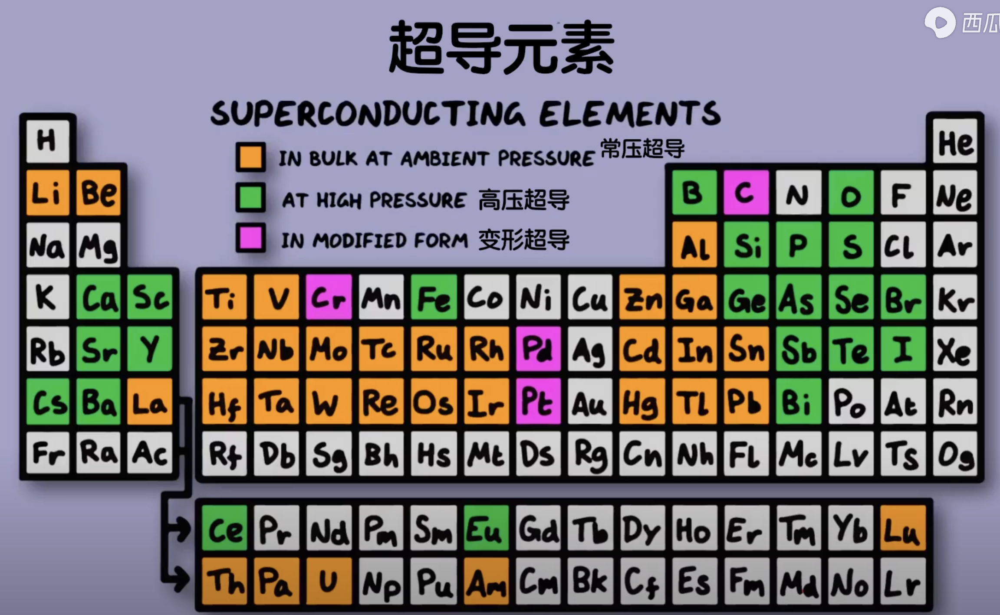

   BCS理论。库伯对、凝聚

# 硅谷银行为何倒闭？这和全球疫情、中美摩擦、俄乌战争都有关

1. 为什么会发生通货膨胀
   1. 需求变多了。如需求释放，更有钱
   2. 供给变少了。外部不可控因素，越南水灾导致硬盘价格上涨
   3. 解决通货膨胀的常见方法：加息。增加存款利息和贷款利息，通过这两种方式减少货币流通量，从而降低通货膨胀的影响
      1. 增加存款利息，居民不愿意消费，都把钱存银行了，抑制消费需求
      2. 增加贷款利息，企业不愿意贷款，组织货币流动，抑制供给
2. CPI是消费价格指数，用于判断通货膨胀
   1. 一般2%比较合适

# “五一”挤死也要旅游，图个啥？用马斯洛需求层次理论分析一下

1. **生理需求**。生存、睡觉、吃饭、性
2. **安全需求**。人身安全、财产安全
3. **爱与归属**。陪伴、家人、归属感
4. **尊重**。自信、获得尊重
   1. 审美需求、求知需求
5. **自我实现**。
