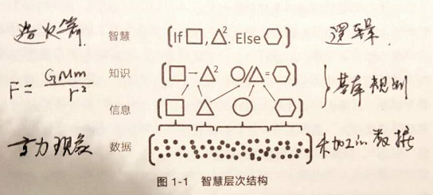
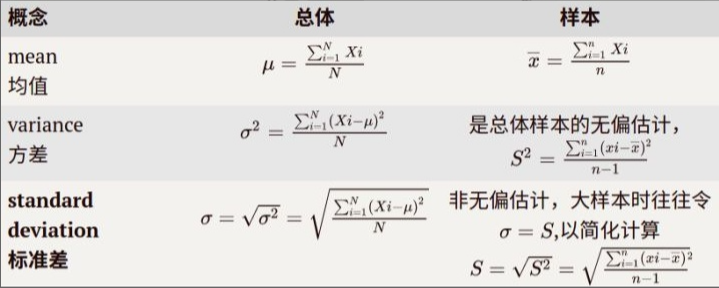
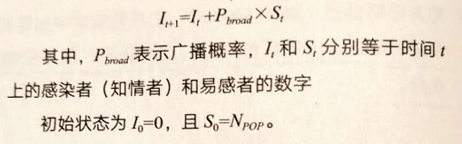
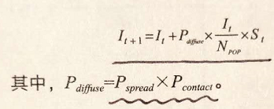
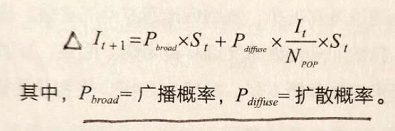
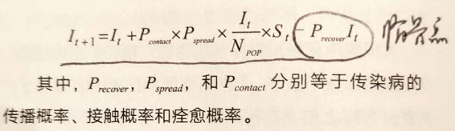
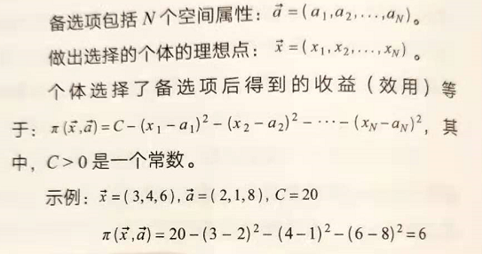
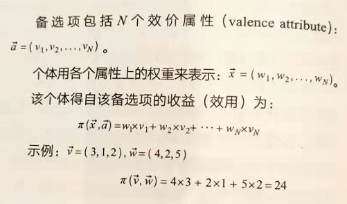
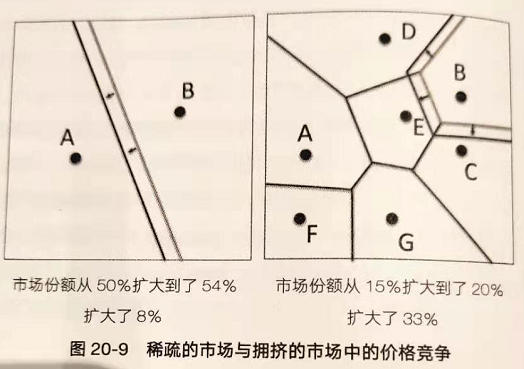

# 《模型思维》 Scott Page

做一个多模型思考者

1. 模型不需要掌握很多，掌握几个关键模型即可（一对多）
2. 智慧层次结构：数据->知识->智慧

1. 所有模型都是错的（只能解释一部分，无法解释全部），但是多个模型综合解释是对的

模型的7大用途

1. 推理
2. 一些相反推理的例子：

1. 解释（重要）
2. 设计
3. 沟通
4. 行动
5. 预测（重要）
6. 天气、流行病、犯罪率
7. 解释并不一定能预测（地震原理），反之亦然（销售量预测）
8. 探索

多模型思维

1. 孔多塞陪审团定理（数量多）
2. 多数投票正确的概率比任何人都更高；当人数变得足够大时，多数投票的准确率将接近100%
3. 多样性预测定理（多样）
4. 多模型的存在可以尽可能降低模型误差，使得结果更加接近于真实值
5. 分类模型。对随机变量进行多维度分类
6. 模型种类的选择需要折中处理。因为模型误差=分类误差+估值误差
7. 分类误差：多分类可以减少分类误差，减少bias
8. 估值误差：少分类可以减少估值误差，减少variance
9. 超级油轮：增加边长时，体积增速比表面积增速快，因此收益曲线为线性增长
10. 女性CEO：大型公司需要15次升职才能当CEO，而因为男性升职率高于女性，所以在大型公司里男性CEO更多（类似指数复利积累效应）
11. 利用中心极限定理，在对一组大数据进行拟合时可以采用多次采样，分组拟合，多次平均，这样求出来的均值和方差都是无偏估计

对人类行为者建模

1. 经济学模型里总是倾向于假设人是自私、理性的，往往不切实际；尽管如此，为了降低模型复杂度，上述假设依然可以使用，作为参考
2. 人的社会行为具有不一致性这个特征：如果A>B，B>C，则一定有A>C；但是这在人的日常行为中不一定总是成立【比如夏天的时候喜欢吃西瓜超过吃香蕉，而在冬天的时候基本不吃西瓜】
3. 损失厌恶
4. 有限损失，无限收益；实际上人们的做法是无限损失，有限收益：
5. 讨厌损失，不喜欢固定损失，面对损失偏好风险（一定不要损失，哪怕损失多一点，也不喜欢固定损失）
6. 喜欢收益，喜欢固定收益，面对收益厌恶风险（一定要拿到，不喜欢概率）
7. 双曲贴现
8. 对近期的贴现率远远高于未来的贴现率（表现为只想要今天的收益，不想要未来的收益）【薛兆丰：不耐，喜欢确定性】

正态分布

1. 正态分布一般为随机变量的求和、均值分布
2. 正态分布的两个关键参数
3. 均值
4. 方差
5. 1西格玛68%；2西格玛95%；3西格玛99%
6. 中心极限定理指出：如果随机变量是独立分布的，那么当N达到一定数量时（一般为20），则其N的和（或者均值）呈现正态分布
7. 例如：为了得到全国身高的总体分布，但是不可能统计全国所有人的身高，可以采取抽样的方式通过样本估计总体：一次采样50人，一共采样1000组，虽然每一组的平均值和方差可能和总体的均值、方差差很多，但是一旦数量增多，则均值、方差会很接近真实值
8. 前提条件：变量之间相互独立；样本数够多；方差有限；结果不是由极个别样本决定
9. 应用：由于中心极限定理支出需要大样本，因此一些小样本里容易出现一些极端结果
10. 解决办法：要么增加样本数量；要么增加采样次数
11. 我们的目标是得到总体的均值、方差，但由于无法得到总体的数据，因此朴素的想法是通过样本推测总体
12. 理论保证：中心极限定理

1. 样本方差S是总体的无偏估计，注意分母是n-1
2. 样本均值标准差=总体标准差\*1/根号N。N为样本数量，意味着样本数量越大，则样本均值标准差越接近真实值

- 独立随机变量如果呈现乘法分布，则总体随机变量的分布为对数正态分布【相乘意味着变量之间具有较高的耦合度，相加则相对独立】

1. 例如：工资分布（因为加薪是根据基本薪水的百分比，而非绝对金额）

幂律分布

1. 人口分布、物种灭绝、网页连接数量、企业规模、视频下载量、学术论文引用等都呈现幂律分布
2. 幂律分布通常表现为非独立性，马太效应，正反馈
3. 两种基础幂律分布模型：
4. 优先连接模型（城市规模、网络连接）
5. 新加入的实体加入已有组织
6. 自组织临界模型（交通拥堵、地震、火灾）
7. 森林火灾。通过网络相互依赖关系逐步扩大规模至一个临界点【池塘荷叶】
8. 数学定义：P(x) = Cx^(-a)，a>1决定了尾部长度，且要求C=(a-1)x^(a-1)确保总概率的分布为1
9. 事件越大，发生的概率越低，小事件发生的概率很高
10. 特例：齐普夫定律，指数为2的幂律分布。排名 x 事件大小=常数
11. 例如城市人口 x 排名 = 常数
12. 由于长尾分布的存在，会导致：不平等增加（少数赢家，多数输家）；灾难更大；波动性更大

线性模型

1. 数学定义：y=mx+b
2. 线性回归自变量系数：
3. 符号：正相关、负相关
4. 显著性（p值）：不可能情况的概率，越低越好（1%，5%）；是对假设本身的检验
5. 大小：自变量系数的估计
6. 相关≠因果。线性回归无法解释因果逻辑关系，只能表明两者之间有相关性
7. A\~B\~C，显然A和C是有相关的，但是并不存在因果，因果只存在A\~B，和B\~C之间
8. 例如某大学学术表现与参加马术队的人数有正相关，虽无直接因果，但是因为参加马术的人家庭收入和学校资助水平高，因此有理由相信学术水平也不差
9. 实力-运气方程：成功 = a x 实力+(1-a) x 运气
10. 启发：要奖励实力，不要为运气买单
11. 在实力相当的竞争环境中（例如奥运会决赛），运气很大程度上决定输赢

非线性模型

1. 凸函数：指数增长模型（复利模型）：Vt=V0 \* (1 + R)^t
2. 72法则：翻倍所需的周期数=72 / 利率R
3. 半衰期模型：剩余比例=(1/2)^t(t/H)
4. 凹函数：凸函数的相反数，即对数函数。一般表现为边际递减效用
5. 经济增长模型：L个工人，K个单位资本，则总产出：
6. 产出 = 常数 x L^a x K^(1 - a)，其中a为0\~1的常数
7. 当a = 1/2时，则有索洛增长模型：产出 = 常数 \* sqrt(LK)
8. 经济增长模型支出：工厂、企业产出与投入不是线性关系，而是非线性，为了达到投入与产出线性增加的效果，必须将工人、设备同时投入
9. 折旧率会在产出规模增加后显著引起产出与拖入非线性关系，因此可在产出规模较大时适当考虑如何降低折旧率
10. 中国的经济增长从10%逐步放缓6%，并非坏事，是经济增长模型的必然结果，否则你将会看到本世纪末中国人均GDP超过1亿美元

与价值和权力有关的模型

1. 最后上车者价值：团队已经形成情况下加入团队的边际贡献
2. 夏普利价值：理想假设实验参与者遍历团队所有成员依次加入的价值平均值
3. 组织和团队的目标应该是尽可能降低最后上车者价值，否则组织会变得很脆弱，权利过大

网络模型

1. 网络的结构：节点node、边edge、度（节点的邻居数量）
2. 聚类系数：一个节点的邻居也具有相同节点
3. 常见网络结构：
4. 随机网络
5. 地理网络
6. 幂律网络（具有多个中心节点的随机网络）
7. 小世界网络（具有随机连接的地理网络）
8. 如何判断一个网络是否是随机网络（蒙特卡洛方法）：与一个真正的随机网络的节点数、连接数、介数等进行统计值比较
9. 友谊悖论：如果网络中的任何两个节点的度不同，则平均而言，该节点的度会低于相邻节点的度
10. 例如：一篇论文的参考文献的参考文献多于这篇参考文献
11. 例如：你朋友的朋友比你自己的朋友多【人缘不好的人不会成为你的朋友】
12. 六度分隔理论：地球上任何两个人可以通过不多于6个人连接起来
13. 网络一个重要作用是抗冲击。一个好的网络必定是局部聚类的随机网络

广播模型、扩散模型和传染模型

1. 巴斯模型=广播模型（r型）+扩散模型（s型）
2. 广播模型（r型增长曲线）：I(t+1)=I(t)+p\*S(t)，其中N=I(t)+S(t)

1. 人群被分为知情者I(t)和非知情者S(t)，总和为N
2. p为非知情者的转化率

- 扩散模型（s型增长曲线）：I(t+1)=I(t)+p*I(t)/N*S(t)，其中p=p1传播\*p2接触

1. 扩散取决于个体本身接触概率p2，以及被接触后的传播概率p1

- 大多数消费品和都是通过巴斯模型传播：I(t+1)=p1*I(t)+p2*I(t)/N\*S(t)，其中p1为广播概率，p2为扩散概率

1. SIR一般应用在流行病学研究领域，相比于巴斯模型，多一个治愈者角色：

1. SIR的临界点会出现在传播\*扩散概率=治愈概率的临界点，此时有治愈率V>=(R0-1)/R0，传染病传播才不会扩大传播，即R0<=1
2. R0=p1\*p2/p3，其中p1为扩散概率，p2为广播概率，p3为治愈概率，显然当R0<=1时，传染病才会被控制

熵：对不确定性建模

1. 四类现象的结果通常可用熵的概念来区分：均衡、周期、复杂、随机；其中均衡的熵为0，周期熵较低，复杂熵再高一些，随机现象具有最高熵
2. 信息熵公式：

1. 熵就是对不确定性的建模（测度）。测度的本质是什么？
2. 如何建立N个事件与2^N结果之间的数学关系。即N=f(2^N)\~2^N，利用对数函数即可，即：N=-log2(1/2^N)
3. 最大熵分布指的是在对一种现象进行评估时，总是避免做出任何特殊假设和主观偏见，做出最合理的分布估计：
4. 如果现象是在给定\[a, b]范围内，则均匀分布最合理【例如投骰子】
5. 如果现象具有某个均值，则指数分布最合理【例如薪水分布】
6. 如果现象具有均值和方差，则正态分布最合理【例如身高分布】

随机游走

1. 一维、二维随机游走会无限次回到起点，而三维随机游走则几乎不可能回到原点（例如一间房间不可能出现某个局部区域缺氧）
2. 伯努利翁模型：G灰球，W白球，则在反复取出N次时，灰球期望数量P=G/(G+W)，标准差为sqrt(N*P*(1-P))
3. 随机游走模型：Vt+1=Vt+R，其中R范围(-1,1)。Vt期望为0，标准差为sqrt(t)，t为步长
4. 随机游走模型既是周期性的，又是无界性的（可能非常大，可能非常小，只要时间足够长）
5. 企业生命周期满足幂律分布：返回为0定义为结束
6. 物种数量满足幂律分布：返回为0定义为灭绝
7. 股票满足正态随机游走（带偏移）：不会回到零点，但是会无限次穿过零点
8. 利用随机游走估计网络规模：例如测量一条信息从发出到返回的时间来估计网络规模

路径依赖模型

1. 波利亚过程：盒子装着一个白球和一个灰球，每次取出一个球，并放入与取出球颜色一致的球
2. 波利亚过程为典型的正反馈过程，与之对应的过程为均衡过程，即负反馈：每次取出一个球，放入与取出球颜色不一致的球
3. 无论是波利亚过程还是均衡过程，都会产生一个路径依赖结果
4. 现实生活中路径依赖的例子：销量大的产品、好评多的电影、评价高的外卖、投票结果、非独立群体决策等

局部互动模型

1. 在一个棋盘网格中存在两种基础互动模型：局部互动、生命游戏。前者有一种趋同效应，前后则是相反效应
2. 局部互动模型：自己的状态取决于周围邻居的状态。如果更多的邻居处于状态A，则自己也会变成状态A。此种模型会导致系统最终处于均衡稳定状态
3. 生命游戏模型：自己的状态与周围状态相反。如果更多的邻居处于状态A，则自己变成状态B。此种模型对初始值十分敏感，结果会存在均衡、周期、随机和复杂性四种结局

李亚普洛夫函数与均衡

1. 如果模型具有李雅普诺夫函数，则该模型必定会达到某种均衡（例如一座城市不同地区的人流量会因自组织特性而达到均衡）
2. 李雅普诺夫函数：一个离散动态系统由可配置状态和转移规则组成。若
3. 条件一：下一状态比本状态具有更低的均衡值
4. 条件二：系统均衡值有最小值
5. 满足以上两个条件的系统必定均衡，且能估算出收敛时间
6. 典型案例：触底博弈模型。N个博弈参与者，提出自己的支持水平（0\~100），提出了最接近平均水平2/3的参与者获得最终奖励
7. 例如每个州给与贫困人口的援助，必定低于社会收入平均水平，但是不为0

马尔可夫模型

1. 以一组固定概率在有限状态之间不断转换的系统。短期的扰动只会产生短期的效果，只要不改变转换概率，系统一定会回归原先的平衡态
2. 佩龙-弗洛宾尼斯定理：一个系统满足如下四个条件则必定收敛于一个统一的统计平均值：
3. 状态有限
4. 固定转换概率
5. 任意状态可遍历
6. 非循环
7. 启发：短期内的突发活动不会带来长期的影响（例如三分钟热度突击学习，短期的社区送温暖活动）

系统动力学模型

1. 从正反馈与负反馈的角度分析系统在受到干扰后的影响是什么。例如正反馈的马太效应（论文引用量）
2. 为了解决马路拥堵问题，扩宽马路，导致马路更堵了（因为马路宽了，上路和买车的人更多了）
3. 为了解决抽烟严重的问题，减少烟中尼古丁含量，导致人认为烟更安全，抽烟的人更多了
4. 为了降低车祸率，要求增加ABS系统，导致人们认为车更安全了，更加肆无忌惮的开车，车祸更多了

基于阈值的模型

1. 骚乱模型（骚乱并非暴乱，一种群聚性活动）：个体根据总体的某个变量是否超过阈值来决定自己采取的策略，如果超过阈值则采取行动，否则则采取另一个行动
2. 情况一：阈值分布{10,10,10,...}。则不会发生骚乱
3. 情况二：阈值分布{0,0,0,3,4,20...}。则骚乱发生到一半会终止
4. 情况三：阈值分布{0,1,2,3,4,...,999}。则骚乱一直发生，并最终扩散到到全体
5. 这也意味着阈值的分布比阈值更重要。透露出的实际指导意义是，为了能顺利发动某项社会活动，必须有一个小团体造势，并发动群众，降低他们的阈值
6. Airbnb创始人初期遇到了房东与租房者困境。采取的策略便是挨家挨户找房东采集房屋的资料，然后在网站上挂牌，有了这一波初始房源后，降低了租房者租房的阈值，这样会更多的租房者来Airbnb租房，形成正反馈，越滚越大。这叫双重骚乱（双方角色的阈值博弈）
7. 谢林派对模型。随机游走模型+骚乱模型。在一个聚会上分为男性和女性，每位参与者有一定概率p从A房间走向B房间，反之亦然。概率p与当前房间内的性别比例有关：高于阈值则留下，低于阈值则离开。
8. 这会产生一个隔离结果：即一段时间以后，房间A几乎全是男性，房间B几乎全是女性。之所以用几乎是因为不排除某些宽容度较大的人，他们阈值十分高，不介意周围全是异性。这也说明阈值分布的多样性不会导致完全隔离，同时也会加速隔离
9. 例子：女护士，男性推销员
10. 与之相反的一个模型是乒乓球模型。相反指的是策略相反：如果某个阈值过大，则采取相反策略。这是一种典型的负反馈系统
11. 股市的下跌后增长可以用骚乱模型+乒乓球模型来解释
12. 下跌：一部分人引发的下跌初始化，引起一些低阈值的人采取行动，进而导致股价进一步下跌，正反馈
13. 增长：由于股民的多样性，当看到下跌过大时，会有一部分人选择抄底，阻止价格下跌，负反馈

空间竞争模型与享受竞争模型

1. 空间竞争模型。一种对象具有多个空间属性，而每个人对不同属性有不同的偏好，对每个偏好取欧氏距离，计算出加权值。

1. 应用领域如沙滩冰淇淋选址；市场占有率分析；政治候选人意识形态
2. 以上模型会导致上述场景里各方选择“中间”位置，以获取最大的投票占比

- 享受空间模型则强调属性的多少：越多越好。比如房子要大，车排量要大，手机待机时间长

1. 市场价格竞争：在稀疏竞争的领域，降价不可取。因为通过降价得到的占比提升相比销售量提升来说不成正比；而在竞争激烈的领域，降价是划算的方式，同等比例的降价，销售量提升更多

1. 价值评估模型。几种解释不同商品价值的模型
2. 享受模型。价值取决于商品本身内在属性（成本+属性偏好）
3. 协调模型。社会团体构建。比如艺术品
4. 预测模型。对商品的未来估值。比如房价、股票、比特币

博弈论模型

1. 标准零和博弈：单方面来看，无论对方选择何种策略，自己的收益或者损失是最优的，或者相对可以接受的
2. 纳什均衡之所以能够达到，是因为没有人愿意单方面改变策略

合作模型

1. 通过重复和声誉机制实现合作
2. 如果背叛诱惑收益T太大，则我们需要想方设法促使博弈P能够重复发生，否则就会导致对方一次性背叛
3. P>(T-R)/T，R为不背叛正常收益
4. 如果T>3R，重复博弈概率>66%；如果T>10R，重复博弈概率>90%
5. 几种博弈者策略：一直背叛；一直合作；开始合作，别人背叛我一直背叛；开始合作，往后复制对方上一轮的策略；就平均收益来看，一报还一报的策略最佳
6. 在群体内部，背叛者收益更大，但是在合作者团体和背叛者团队集体对抗中，一定是合作者团队收益更大

与集体行动有关的问题

与机制设计有关的模型

信号模型

学习模型

多臂老虎机问题

崎岖观景模型
