# 《浪潮之巅》吴军

帝国的余晖——AT\&T公司

1. 1996年，AT\&T公司重组，分离成AT\&T（电信）、朗讯（设备制造）、NCR（计算机）
2. 2006年，朗讯被阿尔卡特收购；2016年，阿尔卡特被诺基亚收购
3. 1925年，AT\&T公司成立贝尔实验室。发明了：射电天文望远镜、晶体管、数字交换机、UNIX、C语言，提出信息论（香农）、发射第一颗商用通信卫星，铺设第一条商用光纤
4. 新技术对传统行业的打击是全方位的：互联网对传统电话业务的冲击，数码相机对胶卷制造业的冲击

蓝色巨人——IBM公司

1. IBM的前身是一家制表公司。CTR公司，一般用于处理经济生活中的报表处理需求
2. IBM的基因决定他的主要服务对象为政府部门，企事业单位，而非个人用户
3. IBM参与了制造勃朗宁自动步枪和M1冲锋枪
4. 美国研制计算机的目的是为了在第二次世界大战中为军方计算弹道
5. IBM为快速研制一台PC：直接采用英特尔8088为处理器，同时委托独立软件公司开发软件，耗时1年，IBM PC问世
6. IBM为什么没能在个人电脑时代成为领导者？
7. IBM对政府部分服务的基因
8. 反垄断后遗症（IBM被要求公开PC技术，导致一大批IBM兼容机出现）
9. 微软崛起
10. 微软抓住了每台计算机需要一个操作系统的机会，用7.5万向DR公司买下DOS操作系统（IBM和DR没谈拢），转手卖给了IBM
11. 郭士纳领导IBM从一家计算机硬件公司转变为一家以服务和软件为核心的服务型公司
12. 郭士纳之前是一家食品公司总裁，不懂计算机
13. 郭士纳治疗IBM的方式：开源节流。砍掉没盈利的项目，裁掉冗余部门，变卖没有用的资产。同时将研究和开发结合起来
14. IBM先后发明了（1950-1960年）：计算机硬盘、FORTRAN语言、计算机内存DRAM
15. 如何衡量一名研究员的工作？发表论文、申请专利、产品化
16. 2004年，IBM将PC业务以17.5亿美元卖给联想
17. 2014年，IBM将x86服务器业务以23亿美元卖给联想
18. 2008年金融危机中心是美国，但是各行业的龙头企业影响较小，是因为这些公司的主要收入来自于海外（IBM、惠普、微软、英特尔、思科、苹果、Google、甲骨文、高通）

“八叛徒”与硅谷

1. 原有产业+集成电路=新产业
2. 1947年，肖克利发现了半导体P-N结的单向导电性，利用此原理发明了晶体管，为集成电路的发展奠定了工程基础
3. 八叛徒（离开肖克利创办的公司）在一张1美元的纸币上签下了各自的名字，成立了仙童公司（Fairchild，费尔柴尔德，投资人）。包括摩尔、诺伊斯等
4. 单个晶体管制作示意图：

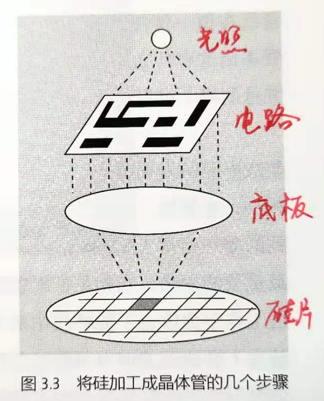

1. 集成电路的由来：用硅片做晶体管，再切割下来，再在显微镜下把一个个晶体管用导线连接起来，最后焊接到电路板上。诺伊斯直接把晶体管和元件直接做成底板，刻在一个硅片上，这就是集成电路
2. 张忠谋受到德州仪器的基尔的启发（晶体管一个个排在硅片上），创办了台积电
3. 诺伊斯和德州仪器因为谁先发明集成电路这件事打了官司，后来共享集成电路专利
4. 仙童公司因为股权设置问题，导致创始人的投票权越来越低，导致诺伊斯和摩尔辞职，创办了英特尔
5. 旧金山湾区之所以能成为硅谷，很大程度上是因为有了仙童公司（马太效应）

科技产业的时尚品牌——苹果公司

1. 在每一次技术革命中，新技术必须比老技术有数量级的进步才能站得住脚
2. 1976年，乔布斯和沃兹尼亚克研制出世界上第一台通用个人电脑Apple I（无图形交互界面）
3. 1984年，苹果发布麦金托什Macintosh（有图形交互界面）
4. 图形交互界面最早由施乐公司研制出来
5. 以太网
6. 1986年，乔布斯以500万美元买下一个动画制作室，重构成用图形工作站做动画的Pixar工作室。后来被迪士尼以74亿美元价格收购
7. 2001年，iPod诞生，颠覆了音乐产业（CD）
8. PC的销量在2011年达到顶峰后开始下滑（平板电脑上升）
9. 2007年，苹果的正式名称从原来的“苹果计算机公司”改为“苹果公司”，这也意味着苹果的侧重点从原来起家时的计算机逐渐偏向于个人消费电子（如iPod音乐，iPhone手机，iPad平板），同年发布iPhone
10. 乔布斯一生没什么挚友，虽然事业上很成功，但是也算不上什么好人（欺骗沃兹尼亚克、没有什么捐助）
11. 在美国，真正的富豪不是看挣了多少钱，更不是看花了多少钱，而是看捐了多少钱
12. 日本索尼公司创始人盛田绍夫可以说是20世纪70年代的乔布斯，他发明了随声听Walkman

信息产业的生态链

1. 摩尔定律：每18个月，计算机等IT产品性能会翻一番，或者说相同性能的计算机等IT产品，每18个月价格会降一半
2. IT公司在产品发布后的18个月内必须收回成本
3. 公司的软硬件基础架构升级必须按照目前计算能力的10倍来设计
4. 存储容量的增长会更快，平均每15个月翻一番
5. IT行业的成本主要是制造设备的成本和研发成本，原材料都是硅，不值钱
6. 硬件厂商和软件公司的关系比较暧昧：软件公司（微软）的更新吃掉硬件提升带来的优势，然后用户感觉到电脑运行慢升级硬件，硬件厂商有钱按照摩尔定律继续研发新硬件，为下一轮软件更新做好准备
7. 既然手机芯片性能增长的这么快，为什么还是感觉响应速度没有质的提升呢？
8. 性能的提升一部分放到拍照上
9. 软件共同更新，吃掉了硬件提升带来的红利
10. 摩尔定律在服务器芯片、ARM手机处理器上依然成立，但是在个人电脑上慢了一倍：主要因为个人电脑的需求乏力，从Win7之后没有什么大改进
11. 反摩尔定律：一个IT公司如果今天和18个月前卖掉同样多的产品，它的营业额就要掉一半。这也意味着IT公司必须要持续找到新的业务增长点
12. 摩托罗拉于2012年被Google收购

奔腾的芯——英特尔公司

1. 搭着IBM PC上车，给IBM PC提供低成本芯片的解决方案，占据了个人电脑的芯片市场
2. 个人电脑工业生态链：操作系统开发商才是关键路径，因为计算机制造商出售电脑需要预装，且应用软件开发商依赖操作系统

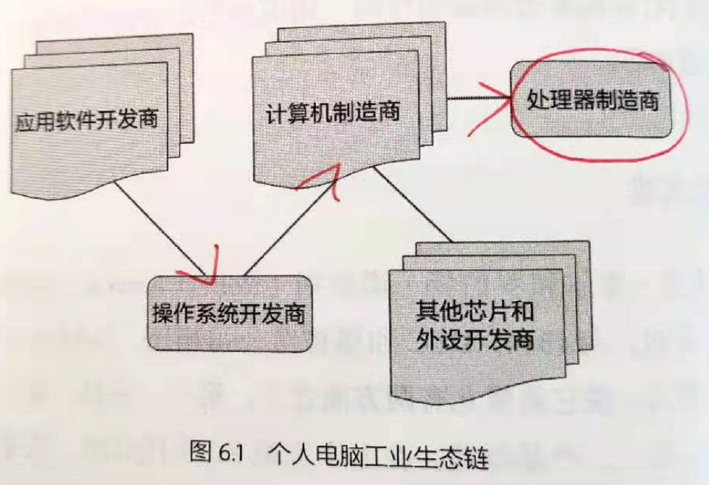

1. 摩托罗拉比英特尔的8086早2年推出性能高5倍的32位处理器68000（68000个晶体管），后来又推出68020处理器，相比同期的英特尔80386依然要好，且被选用成为麦金托什的处理
2. 由于英特尔得到了IBM PC在个人电脑领域的市场份额加持，所以他的客户非常多，而摩托罗拉最后只剩下苹果一个客户
3. 计算机系统结构可分为复杂指令集（CISC）和精简指令集（RISC）
4. CISC（英特尔）：设计复杂、每个指令执行时间不同、功耗高
5. RISC（摩托罗拉）：设计简单、执行时间相同，便于流水线操作
6. AMD的创始人搞销售出生，他没有从技术上另起炉灶抗击英特尔，而是不断推出与英特尔兼容的替代品
7. 英特尔主要开发CISC处理器，在RISC处理器上没啥建树。很多超级计算机都是用RISC搭建的，平板电脑也是RISC处理器，如ARM架构的处理器
8. 2017年，英特尔收购图像识别和无人驾驶Mobileye公司

IT领域的罗马帝国——微软公司

1. 微软表面上和IBM一起开发OS/2操作系统，但是暗地里确自己开发Windows操作系统
2. 微软给计算机制造商预装的操作系统还是DOS，目的是为了让用户对微软产生依赖。DOS有着很明显的缺点：不能直接访问640KB以上的内存，任务完全是串行的
3. 在微软之前，软件不能直接挣钱，他的商业模式都是卖给硬件公司，硬件公司在装机时送给用户。即软件的价值必须通过硬件来体现（苹果就是这么做的）
4. 1990年，微软发布Windows 3.0，这个对苹果的打击是致命的，他的销量超过了IBM的OS/2
5. 在发布Windows 3.0之后，立即收购了当时大型软件开发公司（莲花公司、WordPerfect公司等），并率先推出办公软件Word、Excel
6. 微软利用操作系统的垄断便利，把IE捆绑到了操作系统里，不可删除，打败了网景公司。被司法部盯上了
7. 后来又相继捆绑播放器软件打败了RealPlayer和RealNetworks公司
8. 微软的Windows和苹果的麦金托什很相似；Media Player和RealPlayer很相似；Office和Lotus、WordPerfect很相似。相当于走了避免走了很多弯路
9. 美国不鼓励从父辈继承巨额遗产而不劳而获的做法，所以美国的遗产税高的吓人（45%左右）
10. 美国对投资收入也征收很高的资产增值税（15\~35%左右）
11. 美国的富豪们一般都会把钱捐给慈善基金会，这样可以免除三种税：遗产税、资产增值税和投资增值税。这样是留给孩子资产最好的方式
12. 在微软内部，IE并没有上升到一个很高的战略位置，放在了操作系统部门下的一个应用软件，错失了互联网时代
13. 雅虎在微软和网景斗争时，抢到了门户网站的先机，并率先为大家提供免费的电子邮件服务
14. MSN买下了Hotsmail，目的是为了与雅虎竞争
15. 现在存在的现象，当初产生它的时候必然有它的理由。但是一旦这个理由不存在了，终究有一天他会消亡
16. 要想赚大钱，就要开拓每一个贴近日常生活场景的市场
17. 微软、东芝联盟提出HD-DVD标准，另一方是索尼的蓝光DVD标准，后者的容量是前者的两倍，结局是索尼获胜
18. 微软自从通过Windows和Office进入企业级市场后，大部分收入来自企业而不是个人用户
19. 2011年，微软收购诺基亚手机部门
20. 2014年，微软CEO更换为纳德拉，出生于印度，留学到美国。在他的改造之下，微软从过去的软件公司逐渐转型为互联网和云计算公司
21. 微软收购了领英LinkedIn公司

纯软件公司的先驱——甲骨文公司

1. 过去的数据库一般采用层次模型、网络模型，缺点是逻辑实现和物理实现无法解耦，开发复杂；甲骨文提出的基于关系型数据的方案解决了上述问题，不仅能将软件与硬件解耦，同时极大简化了系统复杂度
2. 在1970年代，计算机市场多为企业市场，软件盈利的商业模式都是软件随硬件一起售卖，并收取服务费，没有纯软件公司；而甲骨文开创了纯软件公司的先例，即购买软件，并且后续不用再支付服务费用
3. 一个产品线较长的公司，在某个产品上往往竞争不过专门从事这项产品的专一公司（比如摩托罗拉敌不过英特尔，手机敌不过诺基亚；苹果在操作系统敌不过微软；微软在在线业务上敌不过雅虎，Google和Facebook；雅虎在搜索上敌不过Google，Google在社交网络上敌不过Facebook；百度、腾讯在电子商务上敌不过阿里巴巴）

互联网的金门大桥——思科公司

1. 中国最早的互联网出现在大学
2. 路由器早已出现，但是由于不同网络设备厂家采用的网络协议不同，导致没有哪个公司愿意为其他公司做路由器，因此路由器的市场十分混乱
3. Cisco是旧金山英文名San Francisco的最后5个字母，思科公司的标志正是旧金山的金门大桥
4. 思科的出现是十分幸运的，恰好出现在需要一个统一路由器的时机（多协议路由器）
5. 互联网的兴起，使得全球数据业务量增加，语音通话量下降
6. 钱伯斯改变了IT公司的组织架构形式，不再采用工业时代层级森严的树状组织结构，变成了网状结构
7. 硬件制造商利润一般在20%左右，软件公司一般利润较高（微软80%，思科60%等），石油工业35%
8. IBM替华为诊断的10大问题中的前6个：
9. 缺乏准确、前瞻的客户需求关注
10. 没有跨部门的结构化流程
11. 组织上存在本位主义
12. 专业技能不足
13. 依赖个人英雄，而且这些英雄的成功难以复制
14. 项目计划无效且实施混乱，无变更控制，版本泛滥
15. 诺维格定律：当一家公司的市场占用率超过50%后就不要再指望占有率翻番了。意思是，必须要找到新的市场和增长点
16. 思科是最早投入到互联网电话业务的公司，即VoIP（Voice over IP）

英名不朽——杨致远、费罗和雅虎公司

1. 一个产业早期领导者选定的行业模式对这个产业的作用几乎是决定性的（雅虎对互联网产品采用的是免费门户，因此现在的互联网几乎都是免费访问，美国在线在雅虎同时期需要收费上网）
2. 在Google成为主流搜索引擎的很长时间里，大量用户通过雅虎门户访问互联网，门户网站在一定程度上起到了操作系统的作用
3. 日本软银风险投资机构一度占有雅虎40%的股份，且占用阿里巴巴75%的股份
4. 为了效仿雅虎的做法，搜狐、新浪、网易也一共成立（约1998年）
5. 杨志远照搬了报纸等传统媒体的商业模式：不向终端用户收钱，而向电子商务，广告费收钱
6. 雅虎早期坚持用人工方法筛选互联网网站，而Google则采用算法自动分类
7. 有的公司创办的目的是尽早卖掉；而有的人则是想创办一家百年老店
8. 2017年，美国电信运营商Verizon以48亿美元收购了雅虎

硅谷的见证人——惠普公司

1. 2015年11月，惠普拆成两家公司：个人电脑、打印机为主的惠普公司；企业级IT服务为为主的惠普企业公司
2. 硅谷的前身是在斯坦福大学拿出的一块相当于清华大学面积的用地创办的
3. 1960年代，惠普从仪器制造进入小型计算机领域；1980年代，进入激光打印机和喷墨打印机行业（发明者）
4. 惠普衰落的原因：领导者的错误和“中国/日本制造”的崛起
5. 1999年，惠普产品线的三个方向：科学仪器（万用表、示波器：安捷伦）、医疗仪器（核磁共振机）、计算机及外设
6. 惠普选择把喷墨盒的价格提的很高来赚取利润，事实证明这种做法不可取。墨盒技术含量不高，很多人可仿制

没落的贵族——摩托罗拉公司

1. 摩托罗拉公司原名高尔文制造公司，1928年创立，是创始人的名字，最早生产汽车收音机
2. Motorola前5个字母的意思表示汽车，ola是美国很多商品名常用的后缀，比如可口可乐CocaCola
3. 摩托罗拉帮助军方研制无线通信设备（对讲机，1942年）
4. 按照通讯的通用分类方法：
5. 【AT\&T】有线单向：闭路电视
6. 【AT\&T】有线双向：电话
7. 【RCA，美国无线电公司】无线单向：收音机
8. 【摩托罗拉】无线双向：手机电话、Wi-Fi
9. 1963年，摩托罗拉发明了世界上第一个长方形的彩色显像管
10. 1967年，摩托罗拉生产了美国第一台全晶体管彩色电视机（转向民用）
11. 美国阿波罗登月计划中，无线通信设备和很多电子设备都采用了摩托罗拉的产品
12. 摩托罗拉对世界最大的贡献则是1980年代发明的民用蜂窝式移动电话，即大哥大（现在说的电话）
13. 摩托罗拉垄断了第一代移动通信市场（1G），即模拟信号
14. 欧洲联合起来发力，1989年制定了第二代移动通信市场标准（2G：GSM，Group Special Mobile）
15. GSM的核心技术是时分多址技术，TDMA
16. 2G时代的主要应用场景依旧是短信、电话居多，因此摩托罗拉依然是老大
17. 铱星计划：不再通过基站，手机直接和头顶卫星通信，达到全球互联的目的。由于需要架设77颗同步卫星，铱元素核外电子有77个，所以称之为铱星计划
18. 最后在2000年3月宣告破产。原因是成本高昂，投资60亿美元，收购时仅用2500万美元
19. 铱星计划过于超前，不太适合
20. 美国的高通公司在第三代移动通信上发力，提出CDMA的垄断性专利，成为3G手机芯片的最大提供商
21. 摩托罗拉的半导体部门在2004年被分离出去，成为现在的飞思卡尔，后者又在2015年被NXP收购
22. 2011年，摩托罗拉被拆分为两个独立公司上市：手机业务和个人家庭电视机顶盒（摩托罗拉移动）、经营企业级通信产品
23. 2011年，Goolge收购摩托罗拉移动，又在2014年卖给联想公司

硅谷奇迹探秘

1. 旧金山之所以叫旧金山，是因为那里在19世纪盛产黄金，高峰值每年76吨
2. 纳斯达克前100的公司，硅谷拥有40家
3. 硅谷成功的秘密
4. 气候条件宜人。全球有很多地方气候宜人，但是并没有硅谷
5. 斯坦福提供了人才。深圳近20年发展非常快，但是也并没有什么一流大学
6. 专利数量。2017年专利数量排名（没有苹果、Facebook）

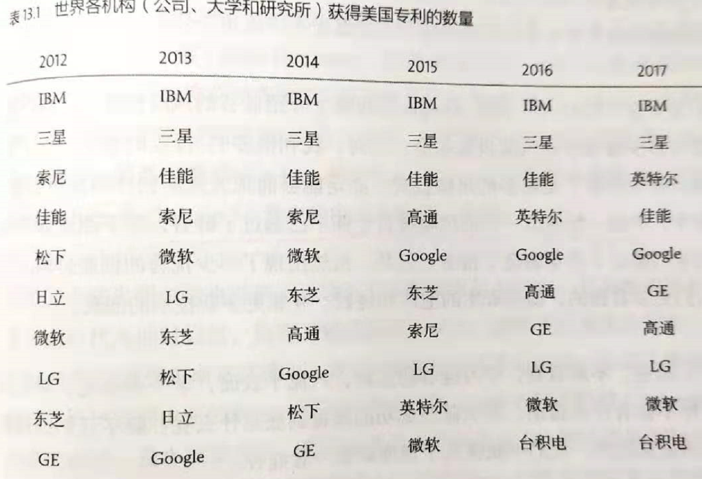

1. 硅谷投资中，大约每年有4000多起投资，其中只有不到30家公司可以上市（1%）
2. 一个创业者要成功，必须同时具备很多因素：
3. 初始团队很重要。不计较个人得失，能同甘共苦
4. 精力过人
5. 多面手
6. 技术不容易被模仿
7. 有商业头脑，能找到能盈利的商业模式
8. 还依赖外部环境，配套条件
9. 硅谷的加班强度十分高，每周工作七八十小时是家常便饭的事
10. 简历上的经历只能证明你以前做过什么，不能证明你今后能做什么
11. 硅谷的个性：不会因为某个权威说怎么做就循规蹈矩，而是会不断挑战传统，寻找新办法
12. 自古英雄出少年。这是风险投资家的普遍看法
13. 诺伊斯发明集成电路32岁
14. 乔布斯发明个人电脑21岁
15. 比尔杰伊发明BSD操作系统23岁
16. 塔克设计出第一个图形操作界面29岁
17. 创业的年轻人要保持适当的饥渴感（Stay Hungry, Stay Foolish）
18. 现在硅谷中“硅”的含量并不高（半导体），更多的是互联网通信公司
19. 硅谷最明显的特征：叛逆。即不断挑战传统，不断进行产业升级，不断站在浪潮之巅（半导体、互联网、云计算）
20. 很多原创的发明并不在硅谷，但是在硅谷被发扬光大，改变了世界（麻省理工是真正技术的发源地，但是只开花，不结果）
21. 硅谷地区的人口结构：曾经是西班牙殖民地，主要居民是墨西哥，后来在淘金热中来了大量美国白人，随后有很多爱尔兰人，意大利和中国人移民至此
22. 硅谷的企业面向全球，而不只是在美国加州一个小地方；反观国内公司，除了华为和联想，绝大多数高科技企业在海外的收入几乎为零
23. 和软件产业同时崛起的有基于基因技术的生物产业（基因泰克）
24. 美国专利法对新药有20年的专利保护期。但是是从它完成研制，申请专利的时间开始算起。从这个时间点到上市一般还需要10年左右时间，因此实际上一款新药的实际保护期只有10年。这也意味着药品公司必须加快研发速度
25. 人类至今才发明了5000种被批准使用的药物

短暂的春秋——与机会失之交臂的公司

1. 太阳公司名字的由来：斯坦福大学校园网（Standford University Network）的首字母缩写
2. 太阳公司的胜利是基于UNIX服务器和工作站的系统对传统集中式小型机和终端系统的胜利
3. 太阳公司和微软公司的竞争，本质上是操作系统的竞争（Solaris vs. Windows NT）
4. 微软通过控制操作系统垄断了各硬件厂商生产的PC（如戴尔、IBM、联想、惠普等），而太阳公司则野心更大，通过在互联网提供跨操作系统平台来统治整个PC、工作站和大型机

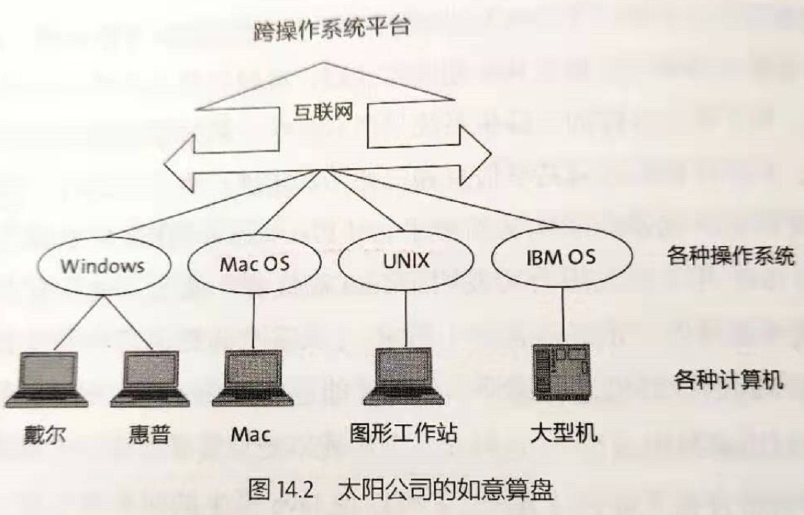

1. 太阳公司推出Java语言，Java因为不需要在特定平台上编译和解释，他支持实时解释，因此适合做跨操作系统的平台
2. 太阳公司开发基于Java的JSP IDE，而微软则推出了基于VB的ASP IDE，2005年以前会看到网络上有很多ASP和JSP网站
3. 2006年，太阳公司更换了CEO：开源Solaris，并把公司从硬件公司转型成为软件开发商和服务商
4. 2010年，太阳公司被甲骨文公司收购
5. 施乐公司的帕洛阿尔托实验室发明了以太网，几个科学家创办了3Com公司，并开发出以太网的适配器，即网卡。解决了微机联网问题
6. 从小型机的集中式网络后来升级成为以以太网作为桥梁的分布式联网架构：

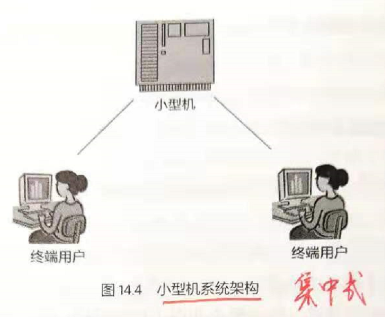

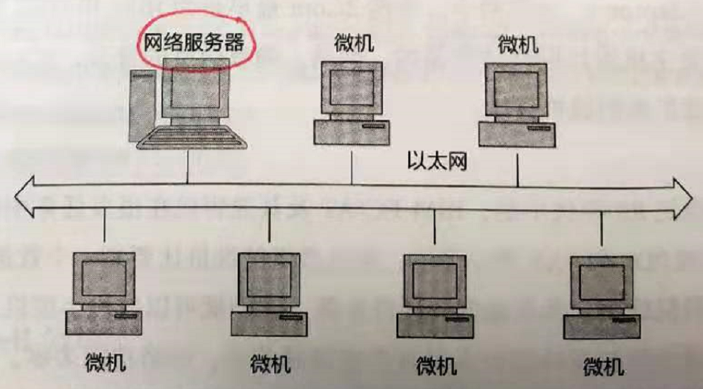

1. 局域网的网络架构优势在于：成本低，微机可单独工作，总算力大于独个小型机
2. 网络服务器的操作系统是局域网中的关键技术，因此Novell公司诞生了。NOS操作系统
3. 在互联网时代，浏览器是人们通向互联网的入口。因此，如果在浏览器的首页上做门户网站，可以说是一个非常具有市场前景的爆发点
4. 网景公司没有打赢微软IE浏览器的原因：
5. 没有居安思危。没有意识到微软垄断操作系统对他造成的威胁
6. 商业模式还停留在卖软件上。没有意识到门户、流量也是可以赚钱的
7. 依旧停留在买软件的用户，没有抓住使用互联网的用户。比如可以以邮箱作为打开互联网的敲门砖
8. AT\&T实验室对高保真激光唱片的音乐进行有损音频压缩，提出了标准MPEG-1 Audio Layer III，简称MP3
9. Windows Media Player为了打败对手RealPlayer，同样采用了安装Windows捆绑安装的方式
10. RealNetworks有望成为YouTube那样的公司，只是网速过慢，无法提供在线服务

幕后的英雄——风险投资

1. 风险投资无需抵押，也无需偿还
2. 对私有企业的投资大致有两种：
3. 收购长期盈利看好但暂时遇到困难的企业（比如巴菲特就是这么做的），即私募基金
4. 投资一个初创小公司，将他做上市或被其他公司收购
5. 由于新技术会不断取代老行业在世界经济中的地位，所以专门投资新兴行业和技术的风险投资从长期来讲回报必定高于股市
6. 私募基金一旦收购一家企业，首先要做的就是更换管理层，裁员，变卖不良资产
7. 风险投资的关键是准确的评估一项技术，并预见未来科技的发展趋势
8. 风险投资基金主要有两个来源：机构、非常富有的个人
9. 为了避税，在美国融资的基金一般注册在特拉华州，在其他国家和地区融资的基金注册在开曼群岛或巴哈马等无企业税的国家和地区
10. 在美国，一旦一家公司的股东超过500人并具备一定规模，就必须像上市公司那样公布财务和经营情况
11. 风险投资公司每融资一次便成立一家有限责任公司，寿命从资金到位到所有投资项目要么收回投资，要么关门结束，一般为10年
12. 投资中的关键角色：
13. 总合伙人：管理权，管理和决策，权力最大
14. 有限合伙人：所有权，投资方，出钱的人
15. 财务审计
16. 董事会：一些顾问
17. 中国海归创办的最大风投公司：北极光、华山资本、赛伯乐
18. 风险投资公司一旦进入被投的公司之后，就变成了该公司的股东
19. 天使投资本质上是早期风险投资。这些人之前曾经成功创办过公司，不愿再辛辛苦苦创业，愿意出钱让别人干。即不愿当经理，只愿当董事
20. 一家公司创办的三个关键要素：
21. 知识产权。先申请专利
22. 新技术比传统技术有数量级的提高
23. 商业计划。搞清楚商业模式
24. 风投的过程：两个人现有技术想法；找第三个人讨论商业计划，输出商业计划书；找人投资，投资人成为股东；预留额外股票留给公司早期员工；更大的投资团入伙，不断拉入新的投资人以及CEO；到这里，因为有大量投资进来，导致原先创始人股份被稀释（总价值增加，但是每股价格不变，总股数增多，导致绝对股数占比总股数减少）
25. 融资分为多轮融资。首轮融资风险高，不确定性大，一般参与人不多，在最后一轮剩下的公司少，不确定性小，成功率大，但是收益也较低
26. 一个好的创业题目必须具备如下几个条件
27. 项目有市场，且能横向扩展（能快速、低成本的扩展到其他相关领域。如软件）
28. 今后的发展能以几何次数增长
29. 技术或者商业模式是革命性的，数量级的优势
30. 风险投资就是投人。创始人的德行比能力来的更重要
31. 创业公司失败是常态，成功都是特例
32. 几乎所有大公司的标志和名称字体都是单色设计，这是因为彩色印刷比单色印刷贵，且传真机和复印机为黑白，彩色标志公司的logo复印后颜色没有原彩色好看
33. 老牌风投公司的手头上有很多CEO，这些CEO以前都有创业成功的经历。在投资某家公司后会作为顾问进入公司，帮助公司开展业务
34. 在纳斯达克上市的科技公司至少有一半是在一条叫做沙丘路的投资公司投资的，比如红杉资本、凯鹏华盈、NEA等
35. 红杉资本（红杉树，高达100m，直径8m，寿命2000年）
36. 投资了苹果、Google、思科、甲骨文、雅虎、YouTube等
37. 每个阶段的投资额差一个数量级，分别为10-100万、100-1000万、1000-5000万
38. 对公司的要求：
39. 公司的业务几句话说清楚
40. 市场规模有10亿美元以上
41. 给客户带来的好处一目了然
42. 有核心竞争力（技术或者商业模式）
43. 对创始人的要求：
44. 思路开阔、头脑灵活
45. 基因要好，初始团队好
46. 动作快，效率高
47. 凯鹏华盈KPCB（4个创始人的名字首字母）
48. 投资了太阳、美国在线、基因泰克、Google、eBay、亚马逊等
49. 人脉非常广。美国前总统，国务卿等
50. 亚洲著名投资公司：日本软银集团。投资了雅虎、阿里巴巴
51. Facebook花高价收购了一些似乎不很知名的小公司，这是因为这些被收购公司的投资人、顾问都是Facebook高管

信息产业的规律性

1. 70-20-10律。在某个领域发展成熟后，一般在全球容不下三个以上的主要竞争者
2. 个人PC。微软、苹果
3. 消费电子。苹果、亚马逊
4. 个人PC处理器。英特尔、AMD
5. 网络设备。华为、思科
6. 互联网。Google、Facebook
7. IT服务。IBM、甲骨文、惠普
8. 电商（中国以外）。亚马逊、eBay
9. Vista的安全性其实比苹果iOS高，之所以我们有苹果操作系统安全性高的错觉是因为微软用户多，更容易受到攻击
10. 高通公司是3G通信技术的规则制定者，最早提出CDMA2000的标准，并通过专利堵死了绕过专利的解决方案，从而达到垄断3G手机市场的目的
11. 中国为了不受制于欧洲指定的标准，自己又提出了TD-SCDMA。同时又加快进入4G时代的步伐，因此国内的3G时代时间较短
12. 721定律一般在IT领域，传统领域没有（石油、汽车、医疗、零售业），这是因为
13. 传统行业研发成本低，制造成本和销售成本高【传统行业扩大生产必须投入等比例的制造成本，IT不用】
14. 信息产业各环节的耦合性高，粘性高【类似幂律分布】
15. 为什么加拿大对华为不满？因为华为打击了加拿大科技行业标杆的北电公司
16. 诺维格定律。如果一家公司的市场占用率超过50%后，就无法再翻番了。这也意味着公司必须寻找新的增长点，才能做到基业长青
17. 避免诺维格结局的具体方法有两种：横向扩展和业务转型
18. 横向扩展：现有业务的边缘扩展
19. Google从基于搜索的广告扩展到基于内容的广告
20. 微软从操作系统Windows扩展到应用软件Office
21. 惠普从小型机扩展到PC
22. 迪士尼从少儿动画片扩展到传统影视和娱乐
23. 业务转型：
24. 难度较大。很少有成功的例子
25. 通用公司陆续出售了飞机和雷达部门、卫星制造、卫星电视等。通用汽车公司始终认为自己是一家汽车公司，因此基因限制了他的发展
26. 基因决定定律。一家已经在一个领域成功的公司已经被优化的非常适应这个市场（企业文化、做事方式、商业模式等）
27. IBM的基因是卖服务器，并捆绑服务，他不会费心思考虑怎么把电脑卖给每个人
28. 微软的基因是卖软件，不适合互联网以广告收入来提供免费服务的商业模式
29. Goolge的基因是存储和处理信息，不是通信，不适合做社交网络
30. 苹果的进是封闭。软件的价值必须通过硬件的销售来体现，通过硬件挣软件的钱

硅谷的摇篮——斯坦福大学

1. 斯坦福夫妇为了纪念自己孩子，创办了小利兰斯坦福大学（Leland Standford Junior University）。建校100多年，哈佛大学建校400多年
2. 斯坦福大学在专业设置上覆盖了哈佛大学、麻省理工学院的合集。且最热门专业在全美名列前茅
3. 斯坦福大学同时强调素质教育和专业教育
4. 大学来自联邦政府研究经费与它到华盛顿特区的距离成反比
5. 政府究竟该不该资助项目？
6. 如果是基础研究，短期没有收益的项目，政府应该支持，这是为了国家的长期发展
7. 如果是商业用途，则没必要资助，交给市场优化，此时资助政府只会添乱
8. 斯坦福大学腾出大块工业园地租给公司，大学和公司有深度的合作项目，学校也支持学生中途创业，形成了良性循环
9. 斯坦福大学的毕业就业率是在全美最高的（因为硅谷就在斯坦福）
10. 什么是“高等”教育。高素质、有文化，有教养（本科）的人才，他们不是职业教育机构，是培养绅士的地方，是教授礼仪、修养和德行
11. 德国的洪堡教育理念倾向于职业和技能教育，除此之外，还强调教育和研究的综合，因此大学必须有研究生院。但是国内很多大学的研究生院比本科差很多，忘了本
12. 商学院，如牛津大学，剑桥大学叫做学院（College），特点是学生和教授住在一个社区，共同生活，交流
13. 妨碍一个创业者成为业界领袖的两条主要原因：好高骛远、小富即安

挑战者——Google公司

1. 搜索领域的两个关键指标：查准率（Precision）和查全率（Recall），前者表示查的是不是我想要的，后者表示你查找的结果全不全
2. Google的PageRank算法将整个互联网看作一张庞大的图，每个网站就是一个节点，每个网页的链接就像一段弧，这样整个互联网就可以用一张图或者一个矩阵来描述
3. Google做的是平台，它不生产互联网的内容，只需要负责把互联网送到千家万户即可
4. 任何人的差距是数量级的，Google认为1个头等软件工程师抵得上10个二等工程师，1个二等工程师抵得上10个三等工程师，且他们不会要三等工程师
5. Google成功的直接原因是通过关键词广告打开了互联网的广告市场
6. Google的关键词广告与用户搜索的主题相关，因此点击率非常高
7. Google虽然在搜索技术上超过了雅虎，但是论品牌口碑，广告销售网是比不过雅虎的。因此Google决定收购DoubleClick公司
8. 微软通过在他的浏览器上捆绑MSN搜索来争取搜索领域的市场份额，Google采取的方式是与PC厂商提前签署Toolbar协议，以应对微软这种垄断手段
9. 硕士能把你带到别人去过的地方，而博士能把你带到没人去过的地方
10. Google认为杀鸡一定要用牛刀。一个本科生能完成的事，如果我能用硕士来完成一定完成的更好【前提：公司的关键岗位一定是博士】
11. 2007年底，Google联合全球几十家移动运营商、手机制造商和芯片制造商成立了安卓联盟
12. 网络搜索的速度之所以比本地搜索快是因为网络搜索建立了索引而本地PC没有
13. 对于公司的新业务，不太适合由该领域的专家担任，原因是他的经验会把新部门发展成行业已有的模式，在行业中没有竞争力，最好用新人才
14. Google、华为本身注重技术上的研发投入，而苹果、Facebook和腾讯则是以产品经理为主的企业文化，工程师围着产品经理转。后者的公司产品质量取决于工程师自觉性
15. 2006年，Google收购Youtube，进入了互联网视频领域，收拢了互联网一大波流量

科技公司的吹鼓手——投资银行

1. 美联储的诞生是因为私人银行的能力有限，在遇到经济灾难时国家无法出手抵抗金融危机风险，因此银行家JP摩根牵头，在威尔逊总统的支持下建立了美联储
2. 银行种类：
3. 商业银行。花旗银行，摩根大通银行。只能发放商业、房屋贷款，不能买卖股票
4. 投资公司。高盛，摩根士丹利。替客户买卖证券、期货、不动产等商品
5. 共同基金公司。投资。
6. 对冲基金。文艺复兴技术公司。炒作，可以做空
7. 私募基金和风险投资基金。
8. 资产管理公司
9. 高盛公司的业务
10. 替别人做交易和承销公司的上市
11. 财产管理
12. 基金（包括对冲、私募基金）
13. 高盛在承销公司上市的过程中会认购公司原始股，这使得高盛成为很多公司的大股东（阿里巴巴、农行、工行、Visa、Docomo等）
14. 风投公司要收回投资，对于公司来说一般有两种方法：
15. 被收购
16. 公开出售（即IPO）
17. 公司上市之前的三件事
18. 市值多少。
19. 上市公司希望越高越好，承销方希望适中
20. 价格太高，没人认购；价格太低，佣金太少
21. 美国证监会规定：公司内部股票必须在180天后才能到市场交易。这也就是说大量的散户要等到180天后才能从创始人，投资者和员工手里大量购入
22. 融资多少。
23. 上市公司希望合适，太多则导致股份稀释（估价100元，一共10股，融资2元，则自己剩下98元，每股9.8元；融资20元，剩下80元，每股8元，相比9.8元就被稀释了），太少则融资不够
24. 一般融资比例为估价的10-25%
25. 细节问题。
26. 给承销商的佣金，期权（承销商希望压低发行价，这样期权利润空间很高）
27. 华尔街一般为每个科技公司定下营业额和预期，只要能达到，则会继续提升股价；达不到则打压到底

社交网络和Facebook

1. 社交网络的四个特性
2. 用户能创建自己的资料
3. 用户能自己创建内容，并保留通信记录
4. 允许用户访问其他用户发布的信息
5. 允许用户寻找新的社交对象
6. Friendster是一家加拿大的互联网公司，他的产品满足了上述4个关键特点
7. Friendstar的问题在于用户资料的真实性，而Linkedin是第一个将虚拟世界和真实世界相结合的社交网络
8. 扎克伯格在哈佛做过的FaceMash网站上放了哈佛9个宿舍同学的照片让同学挑选出辣妹，此行为反应出扎克伯格
9. 具有产品意识，快速开发
10. 把握年轻人对异性渴望的特点
11. 没有版权意识和对个人隐私的尊重
12. Facebook之前只允许使用EDU邮箱的用户注册，在2006年开放了所有用户注册
13. 对于用户的账户管理，Facebook开发了一套账户管理系统（你会发现一些国外网站登陆时可直接通过FB账号登陆），国内的微信，微博账号登陆借鉴了此思想
14. Facebook非常擅长并购，从2012年IPO开始陆续并购
15. 10亿美元并购Instagram
16. 200以美元并购WhatsApp
17. 经常使用社交网络的人，关注其他人的能力增加了，而阅读能力减弱了

成功的转基因——诺基亚、3M、GE公司

1. 诺基亚最初业务是木材加工和造纸。1868年公司在Nokianvirta河畔成立了第二家工厂，诺基亚的名字来源于此
2. 从1960年代开始为军方制造对讲机
3. 诺基亚颠覆了摩托罗拉在1G模拟时代的垄断地位，采用数字规范定义了2G GSM的时代到来
4. 诺基亚试图把天线小型化，做到了机身内，虽然牺牲了一定的通话质量，但是大幅度提升了便携性和功能性
5. 3M允许员工用15%的时间干任何自己喜欢做的事，后来Google沿用了这种做法，叫做“20%项目”
6. 3M公司一直在不断转型，其成功的原因
7. 坚持以创新为公司的灵魂
8. 强制淘汰看似赚钱但是前景不好的产品
9. 客户群体是消费类广大用户，群体广
10. GE：通用电气公司。是全球飞机发动机主要生产商，波音747/767
11. 在美国除了万事达、维萨、运通和发现（Discover）四种通用的信用卡，其他各个连锁店发行的信用卡背后的银行都是GE商业银行
12. 公司的信用评级直接决定了企业的贷款成本

生产关系的革命

1. 生产关系的三个重要因素：所有权、分配权、经营权（人与人的关系）
2. 所有权决定了分配权
3. 工业时代资本非常重要，谁掌握了资本，谁就掌握了经营权
4. 工业时代提效的主要矛盾是生产成本，谁更懂得经营（基于分工的科学管理），谁就能提高利润率；而在信息时代，由于生产成本很低（Si就是沙子），主要矛盾转向了制造工艺，因此技术和知识就更加重要
5. 工业时代人与人的关系是零和博弈，而在信息时代，为了从制度上解决零和博弈困境，引入外部变量让零和博弈变为非零和博弈，即增发期权，解决利益分配问题
6. 期权的价值依靠公司所有人共同努力来实现，提升价值的唯一出路就是提升销量和利润，让市场肯定公司表现，推动股价上涨
7. 期权不可随意增加，需要低于增长的那部分，否则会稀释股价
8. 想要推动某种文化（工程师文化），光说不做是不行的，得有配套的制度
9. 比如工程师文化，公司得有某个因为工程师得到了丰厚待遇的例子和渠道
10. 一个合格的工程师不需要别人来告诉他怎么做，能够独立完成一个项目，这才能成为工程师，否则称为码农
11. 安卓名字的由来：安德鲁+小东西词根。Andrew+oid=Android
12. 关于朗道等级的说明
13. 每个等级之间是数量级的差别（10倍）
14. 一、二等工程师不可能出自第五级工程师
15. 一、二等工程师需要三、四级工程师的配合
16. 不同等级工程师的基本公司差别不大，差别主要在期权
17. 真正的扁平式管理公司，上级对下级只有人事的否决权，没有决定权
18. 只能否决被提升的员工，不能提拔他们自己个人喜欢的员工
19. 一些错误的扁平式管理思维
20. 公开场合座位强调行政等级
21. 与上级沟通要层层传递
22. 福利、津贴、差旅标准因职级不同
23. 审批流程复杂，分权不够
24. 扁平式管理的本质：契约合作精神，而不是雇佣、拥有的关系。让大家把心思花在做事上，而不是比较福利上
25. Google的AlphaGo团队，前身是英国的DeepMind公司，花了4亿英镑收购了这家只有十几个人的公司

印钞机——最佳的商业模式

1. 好的商业模式都非常简单，如果几个小时说不清楚，基本上是在骗人
2. 在所有的商业模式中，最理想的就是能像印钞机那边自动挣钱的模式
3. Google广告系统
4. 广告收入才是报纸营业额的大头
5. 根据关键词来决定广告内容，做到精准投放
6. 自动接纳广告系统，即订单处理【非常重要，真正做到了印钞机】
7. eBay电子商务系统
8. 将线下的跳蚤市场搬运到了线上，提供买卖双方沟通平台，收取手续费
9. 关键问题：信用问题、付款问题。他们收购了PayPal公司
10. 阿里巴巴成功原理：平台+信用+支付
11. 戴尔PC直销系统
12. 将传统设计、采购、运输、加工、订单、批发、零售7个环节进行优化，减少到2个（订单、零售），开启厂商直销模式（用户在官网下单后直接在工厂组装后发货）
13. 腾讯虚拟物品和服务
14. 大型社交网络的用户自己就是内容生产者和消费者，腾讯提供平台
15. 算不上好的商业模式
16. 每增加一份收入必须多雇佣一个人【软件行业成本摊开了】
17. 无法横向扩展业务，或者成本非常高
18. 消耗过多的原料、设备、成本【供应链长，生产制造慢】
19. 过度依赖政府政策【太阳能】

互联网2.0

1. 互联网2.0的特点
2. 提供平台。可以接受并管理用户提交的内容
3. 允许用户在平台上开发自己的应用程序【微信小程序】
4. 交互性
5. 非竞争性和自足性。自己不生产内容，不参与与用户内容的竞争【优酷、爱奇艺不是】
6. 在互联网1.0时代，最终能让互联网用户发言的地方只有BBS
7. 在互联网2.0时代，blogger诞生，这使得作者可以和读者在评论区产生互动。信息交互的实时性远超传统报纸和杂志
8. Blogger的创始人埃文威廉姆斯离开Google后创业，成立了Twitter
9. wiki：一种提供在线协同编辑功能的技术；pedia：古希腊语paideia，意思是教育和文化。wiki+pedia含义就是基于wiki技术的百科全书
10. 百科全书：encyclopedia
11. 大英百科全书的200年历史产出了65000条词条，而wikipedia在10年多的时间产生了两千万条词条
12. 维基百科的特点是提供平台，内容属于用户，不属于自己
13. YouTube允许用户创办自己的频道，鼓励全社会为他提供内容
14. Twitter规定没条消息不超过140个字节。这种规定最初被以为会削弱它的传播力，实际上创造了一种非正式信息传播方式
15. 微博和微信的朋友圈也是借鉴了Twitter的思路，信息量少，快速传播
16. 微信本身并不盈利，后来通过微信支付找到了商业模式

金融风暴的冲击

1. 2008年金融危机的故事
2. 克林顿政府为了让穷人也有住房，提供了首付贷款这个个东西（次级贷款）
3. 这导致把钱借给了一些完全没有能力还贷的人
4. 次贷本身不是主要矛盾，政府的钱还能够应付，真正危险的金融衍生物CDS。相当于风险转嫁，一层层转嫁给后级，一旦最后一位还不上钱，整个链条上的人全部受灾
5. （初级）MBS。抵押支持债券。【对贷款的直接债券化】

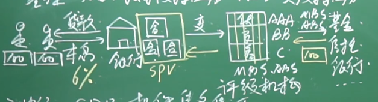

1. （中级）CDO。担保债务凭证。【债券的债券，无限套娃】

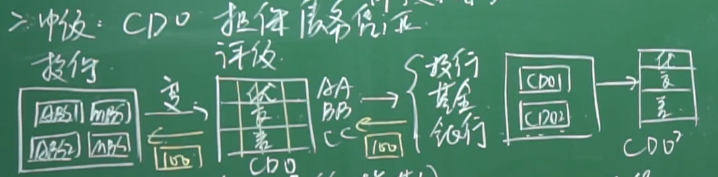

1. （高级）CDS。信用违约掉期。【给债券买保险，卖保险的人没有持有债券，是一种对赌行为】

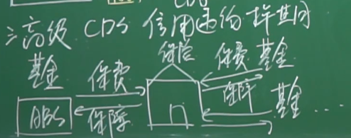

1. 欧债危机。美国次贷危机是因为房地产和金融衍生物导致，而欧洲则是长期不思进取，寅吃某粮的结果。希腊是欧债危机的中心，一直想要高福利，不愿意劳动
2. 欧盟要发型债券必须要得到所有成员国的统一，因此效率十分低下
3. 十字军东征时欧洲内经常发生伯爵向商人借债的事情，因为打仗需要用钱。历史同时期发生了《威尼斯商人》这种历史名剧
4. 欧洲的路易十五时期，正是因为国王的债务已经无法偿还，才导致了路易十六上断头台。这是社会各阶层的经济地位发生变化所导致的结果
5. 无论世界如何变化，经济和财富决定政治地位的规律始终没有改变

云计算

1. 为什么上网本会消失
2. 本质是低端PC，没有新东西
3. PC降价越来越快，他的低成本没有太大优势
4. 上网费高
5. 亚马逊理解的云计算：给电商提供通用的网站托管服务，交易平台，无需自建网站，租用亚马逊的云计算资源
6. Google理解的云计算：原本将PC上运行的软件搬到了服务器端，便于协同开发。例如日历、Docs
7. 云计算的本质
8. 保证用户可以随时随地访问、处理和共享信息
9. 保证用户可使用云端计算资源，包括CPU、存储，无需自己购买设备
10. 云计算核心技术
11. 存储与读取。多台计算机上的分布式存储海量数据技术。一种软件上的文件系统，目的是存储，而不是随机读写
12. 随机读写与存储的设计要分开，前者的数据要放在内存中，提高访问效率
13. 任务分解。MapReduce。专门负责把任务逐级分解为小任务丢到各个服务器上计算，最后合并
14. 资源管理。Borg。CPU、内存分配管理
15. 美国联邦和UPS竞争手段主要是提高服务品质，甚至提高价格；而在中国，同行之间的竞争则是降低成本来打价格战

汽车革命

1. 汽车虽然改变了人类出行方式，但是由此也带来了新的问题
2. 温室气体和废气
3. 噪音污染
4. 交通拥堵
5. 交通事故和人员伤亡
6. 电动汽车的历史比内燃机骑车还要长（19世纪中期之前）。1914年，爱迪生发明了第一款电动车
7. 致命问题：电池能量密度太低，电池本身太重
8. 2003年，艾伯哈德和塔彭宁两位超级跑车爱好者成立了特斯拉公司，专门开发电动跑车。后来马斯克投资了这家公司并入股，成为公司董事长
9. 一般产品进入已有市场时采用的是渗透策略，即低价入市，农村包围城市的方式从低端占领，开始走向高端；而马斯克的特斯拉公司则是反其道而行之，从最高端市场进入（目标好莱坞明星）
10. 2016年特斯拉推出Model 3，之所以取这个名字主要是为了对标宝马3系的性能和价格
11. 为什么特斯拉选择在中国建厂？
12. 美国工人雇佣成本高
13. 美国场地的配套措施不完善，建设工期太长
14. 美国电池制造、组装成本高
15. 在中国建厂不需要自己掏钱
16. 电池管理核心技术：如何控制每个电池的充放电；如何阻止两块并联电池彼此循环放电
17. 汽车的价值在于使用，而不在于停放。鉴于此，滴滴公司的作用很大，起到了优化汽车使用效率的作用
18. 好的商业模式是什么？是让大家不断地花钱，把市场做得越来越大，而不是替大家省钱，让市场做的越来越小
19. Google与其他大学做无人车的最大区别在于，把无人驾驶问题看做大数据问题，而不是机器人问题
20. 通过移动通讯网络与Google的超级数据中心链接，计算能力非常强
21. 汽车的能耗在1/3花在了风阻上，因此尾随的汽车可以节省能耗

工业革命和颠覆式创新的范式

1. 工业革命之前，人类的人均GDP在2000年时间里没有什么本质提高
2. 古罗马人600美元；西欧800美元；西汉末年450美元；
3. 工业革命之后，欧洲增加50倍，中国10倍
4. 工业革命之后人类的寿命大幅增长

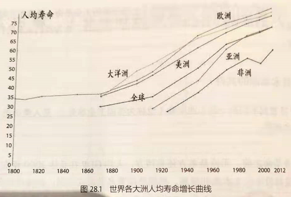

1. 人类历史上最富有的75人，20%出生在同一个国家，且都在1830-1840年。就是因为工业革命的浪潮
2. 第一次革命：蒸汽机（外燃机）
3. 理论基础：牛顿奠定了经典物理学理论基础
4. 第二次革命：爱迪生用电
5. 内燃机普及了汽车，航空业
6. 理论基础：麦克斯韦奠定了电磁学理论基础；开尔文、奥托奠定了热机理论基础
7. 第三次革命：半导体与信息产业
8. 半导体集成电路
9. 信息论、控制论、系统论
10. 生物DNA双螺旋结构
11. 理论基础：布尔奠定了二进制代数基础；香农奠定了用电路实现二进制的半导体集成基础；图灵奠定了计算机可计算性的理论基础
12. 人工智能当前的瓶颈是芯片能耗，现在大部分能量都耗在散热，而不是计算上。Google的TPU和英伟达的Xavier为代表
13. 这俩集成电路的能量密度已经超过了核反应堆内的能量密度
14. 存储技术发展路径
15. 卡片、纸带。1980年代消失
16. 磁存储。如磁带，机械硬盘
17. 激光存储。如DVD光盘
18. 固态物理存储。SSD
19. 颠覆式创新的特点
20. 有杀手锏功能。
21. 蒸汽船：逆风行驶
22. 微软：个人低成本PC
23. Google：互联网连接到每个人
24. ARM：低功耗
25. 苹果：触屏
26. 有相关技术为杀手功能做支撑
27. 杀手锏功能一定有不完善的地方。比如蒸汽船不可靠；微软和Google功能弱；ARM速度慢；苹果手机价格贵
28. 现有产业+蒸汽机=新的产业
29. 制瓷业（手工->机器）、运输业（帆船->蒸汽机）、纺织业（手工->机器）
30. 现有产业+电=新的产业
31. 电梯使得大楼可以建的很高
32. 电报、留声机、收音机
33. ATM使得银行营业网点可以遍布全球，实现跨行、甚至跨国存取
34. 工业革命的范式：现有产业+新技术=新的产业
35. JP摩根和杜邦不懂电的原理，但都收益于电的普及；贝佐斯、马云都不会写程序，但都受益于信息时代的一群人
36. 第四次工业革命范式：现有产业+大数据=新的产业
37. 小米并不是一家硬件公司，不满足于挣硬件的利润，而在于获取用户及其数据

信息时代的科学基础

1. 机械论：牛顿时代人为世界上的一切规律都是机械运动那样确定、可预测【建立在确定性基础之上】
2. 控制论：对于无法理解和预测的复杂问题，采用反馈在线调整的方式使得现状和目标之间差距保持在一定范围内【建立在不确定性基础之上】
3. 信息论：量化信息，认为信息就是一种不确定性。为了消除不确定性，就需要引入信息。引入信息的方式就是大数据的概率模型
4. 系统论：强调整体>部分
5. 泰勒的管理学理论
6. 提高效率是本质
7. 依靠的是标准化流程和管理（ISO标准的理论基础）
8. 树状的组织架构与产品功能模块化分解一一对应
9. 泰勒的科学管理理论适用于工业时代，但在信息时代，特点是变化快且复杂，结果不可预期，不适用
10. Gantt发明的甘特图原来用于管理工厂生产进度，现在常被用来管理软件项目开发进度
11. 预测不如反应迅速
12. 对象复杂，难以预测（股市）。重要的是反应
13. 任务导向的契约式管理而不是自上而下的人事管理
14. 连接比拥有重要
15. Airbnb共享住房；Uber打车；阿里巴巴的购物、支付平台
16. 拥有用户比拥有资产更重要
17. 局部引入负熵，增加扰动，触发创新，企业需要转型
18. 匹兹堡：钢铁；底特律：汽车；新泽西：电话
19. 期权不能随意发行，发行量超过利润增长幅度会导致股价下跌（估值不变但是股票流通量增加，导致通货膨胀）
20. 期权的本质是把零和博弈的存量分配变为正收益的增量分配
21. 以某一价格在今后某个时间点买入，如果市场看涨，股价上升，则被分配者和公司都收益，增量分配
22. 如果市场看跌，股价下跌，被分配者和公司都没有好处
23. 因此期权是一种非常好的锲约，把被分配者和公司的利益绑定，只有大家一起努力才是唯一出路
24. 扁平式管理的本质
25. 简化组织架构，减少信息传导路径
26. 做好分权
27. 互联网的本质：拓宽信息带宽将自己的产品和服务推向每一个角落
28. 香农第一定理：信息熵量化：

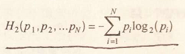

1. 霍夫曼编码：最短的编码给予最常见的情况（莫尔斯电码），这样信息熵低，传输效率高

- 香农第二定理：信息传输率与带宽的关系

1. c=W\*log(1+S/N)。
2. c：速度极限
3. W：频率带宽
4. S：信号功率
5. N：噪声功率

下一个Google

1. 下一个Google一定不是在搜索领域，下一个微软一定不是在计算机领域，因为这些公司掌握了绝大多数流量，无法撼动；并且搜索、应用软件对民用来说已经够用，没必要更换
2. 未来可能的新产业
3. 新能源。太阳能、风能、核能
4. 问题自在于电量存储和传输（白天不用电，风大的地方的电传输到城市）
5. 核能更加清洁（核废料掩埋），更加安全（公众事件虽然严重，但是概率低）
6. 生物和制药技术（辉瑞、默克、基因泰克、安进）
7. 人类到目前为止发明了1万种药品，批准上市5000种
8. 大数据医疗和IT医疗
9. 针对癌症，用大数据思维解决，开发速度快于变异速度即可
10. 新绿色农业
11. 基因种子
12. 电子商务
13. 中国没有经历某个企业铺设全国零售网的阶段（如沃尔玛、家乐福），直接进入了电子商务时代（阿里巴巴、拼多多）
14. 中国公路网收费贵，原因之一
15. 移动互联网和IoT
16. 初代互联网：PC
17. 二代互联网：移动终端互联网
18. 三代互联网：IoT
19. 核心技术：新一代处理器和操作系统
20. 无人驾驶
21. 人工智能
22. 中国IT领域的最大问题：找不到执牛耳工程师，毕业五六年后开始做管理
