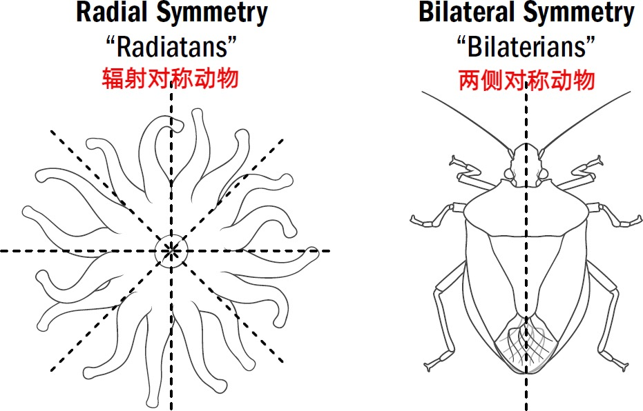
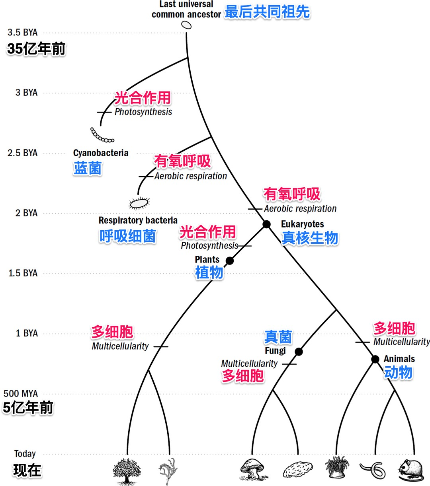
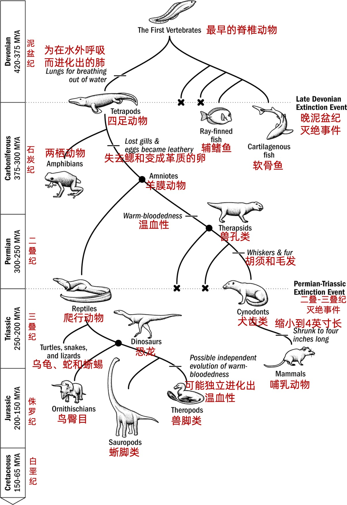
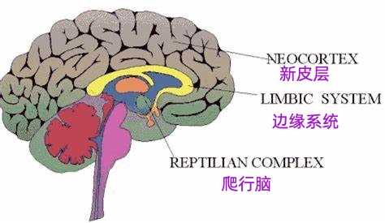
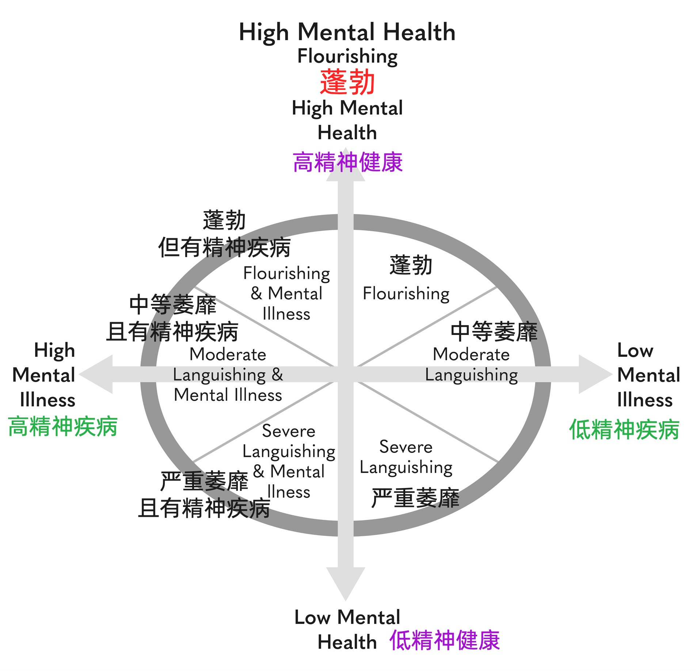
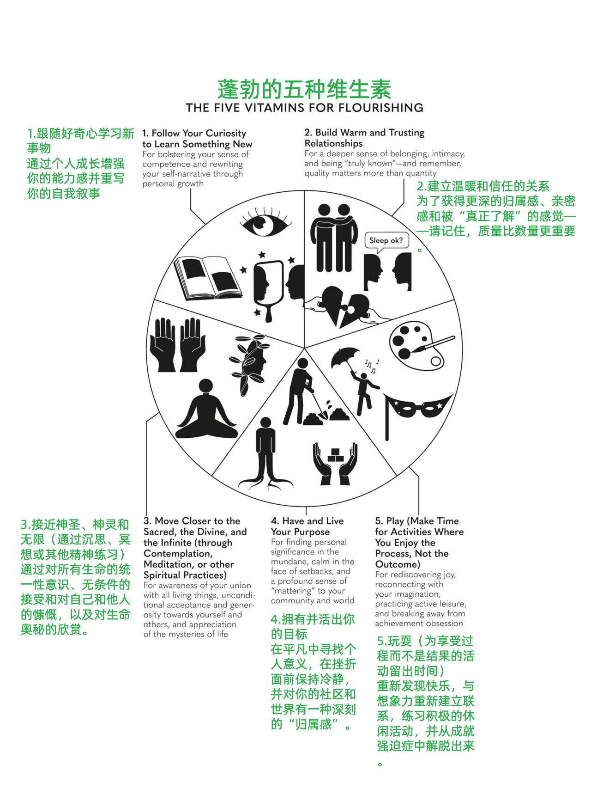
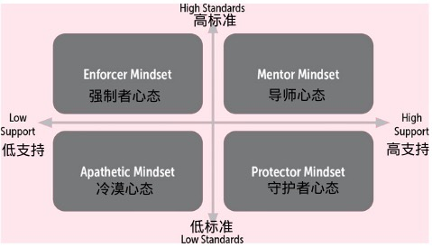

# 《精英日课第六季》万维钢

再看一眼

1.「习惯化」的三个原理：

再好的东西，你也会因为习惯而厌烦。

快乐源于欲望的不完全(事情做一半，保留神秘感)和间歇性（中间间隔一段时间，要中场休息）满足。

不快乐的事最好集中起来一次性做完。

2.快乐要间隔，因为你不想习惯它；痛苦要集中，因为习惯能减轻痛苦。

1.撒谎，是个逐渐升级的过程，大脑对撒谎的情绪反应，会习惯化。有一个跟撒谎类似的升级过程，冒险。

去习惯化。就是喜欢＝熟悉+意外。当你做一件事不习惯的时候，你会更有意识地做这件事，你可能会做得更好。

稀缺大脑

「中等强度有氧」运动是一切锻炼的基础 \[1]。简单说就是快走或者慢跑，说话有点困难、稍微有点喘不上气来这种运动。你很容易做到，而且学者建议每周只要有150分钟 —— 如果你练习5次的话，每次只要30分钟 —— 就足以支持心血管系统健康。

当大脑大量释放多巴胺的时候，你精确的感觉不是快乐，而是\*想要\*去做一件可能会带来快乐的事。

多巴胺释放最多的时刻，不是在得到奖励之后，而是在得到奖励之前。

稀缺性循环只会在三种情况下停止：一是机会消失，取消机会最好的办法就是改变环境。二是取消随机性奖励，固定 = 无聊；禁忌 = 刺激。三是慢下来，不要快速重复。费力得到的东西让我们感觉更值得。

2.高级的东西不会一直高级，低级的也不会永远低级。事物没有固定不变的意义，这就是「延异」。比如咖啡，丝袜

为什么我们就这么痴迷于数字呢？阮教授说，这是因为现在的世界过于复杂，有太多的不确定性，人们总是不知道自己的选择对不对。指标系统虽然窄，但是很清晰。游戏里输赢对错你非常清楚。做对了马上加分，错了就会丢分。

游戏化是对现实的扭曲，追求指标是对现实的逃避。

2.「聚光灯效应」：当人在别人面前做一个什么事情的时候，总是会高估他人对自己的评判。

心智重构

与其说愤怒和仇恨是我讨厌那些人，不如说只是我在为别人的过错而惩罚自己。

不要担心社交尴尬，其实你的尴尬没有人在意，别人关心的是自己不尴尬。只要别人都在尴尬，你就无需尴尬。

当你请求别人做一件什么事的时候，哪怕你给一个“不能算是理由的理由”，也能大大提高别人的顺从度。

社交水平差的人总觉得我要做自己，不管跟谁都用同一个方式表达，这是错误的。你不应该用跟小孩说话的方式跟警察说话。对不同的人要用不同的对话风格。

「幽默是温和的违反。」可以是违反一个社会习俗，或者是你的身份设定，或者违反一个逻辑，又或者像踩西瓜皮，是违反了别人对你走路趋势的预期：反正你违反了一个什么东西，但是又没有太过头，人们就会觉得好笑。

你在“选择做什么”这种战略性、全局性的决策中，必须有一个强有力的外部驱动，为了赚钱也好为了荣誉也行 —— 但是在每天“具体怎么做”这种战术性的、微观的操作中，应该尽量享受工作本身的乐趣，必须有内部驱动。

我们可以把这种心态称为「大方向功利主义」。

亚当斯的洞见是，女人总是希望伴侣同时满足两个要求：第一，你必须有决断力，敢负责；第二，你必须接受她对决策的支配权。

影响力是威逼利诱高压手段之外的软性权力，是让人心甘情愿照你说的办的能力。

要说服一个人跟你一起去做什么事，最好强调「自由」。

要让人相信一件事，最好的办法就是「重复」。

要让人理解一个高难度概念，最好的办法是「类比」。

按理说，人们应该先对事实达成一致，完了再研究解决方案。但现实是人们在面对事实之前就已经有了想要的解决方案，都想让事实为方案服务：你先说你到底想干什么，完了咱们再说这个事实我们承认不承认。

智商、尽责性和情绪稳定性这三个指标最能预测谁是优秀人才。在这三个项目上的得分越高，这个人就越有可能在工作上出类拔萃。

如果说要找结婚对象，什么长相、身高、收入、种族啥的都不重要，你就看四点：对生活满意度高、有安全依恋风格、尽责性和成长思维模式

人活着最重要的不是开心。而是要有意义，有目的，有使命。

认知能力的退化，并不是因为大脑生理性地“老了”，而是因为你不用它了。

决定你对一件事的反应的，并不是这件事本身，而是你如何解读它。

什么是个好职业？你热爱的，你擅长的，社会需要的，三者的交集

保持认知谦逊，不能一上来就坚持自己是对的；善于切换视角，能从他人的角度、从更远更高的位置看待问题；理解世事无常，再成功的策略该改变也舍得改变；确保多元权衡，不能一门心思盯着一个指标去优化；寻求妥协整合，哪怕是跟竞争对手，也要设法达成双赢；不忘求证自省，大胆征求反馈，不断地自我迭代。

1.匮乏心态和富足心态反映了人们对世界的不同基本假设，这种世界观决定了人们的行为模式。匮乏心态以「物」为中心，富足心态以「人」为中心。

2.在当今富足时代，许多人仍保持着匮乏心态，导致一些不合时宜的行为，如过度囤积、追求稳定和将知识视为稀缺资源。

你必须跳出自己的那一层，从更高一层的视角往下看，才能明白眼前这件事到底该怎么做。真正的智慧不是看清规则，而是看清规则背后的东西。

中国人收入低是因为生产力水平低，生产力水平低是因为科技含量低。中国经济今日的成就主要是靠蓝领工人的劳动取得的，中国企业的创新还处在模仿和价格战的水平上，还没有成为驱动经济增长的引擎。

2017年的数据，中国平均每个劳动者每小时创造的GDP是10.68美元，美国则是65.51美元，日本是43.35美元。

一台典型的iPhone卖给美国消费者的零售价是999美元，其中归中国的，也就是富士康的组装劳动收入，只有8.46美元

你的商业价值并不是跟粉丝数成正比 —— 而是跟粉丝数的\*对数\*成正比

你注意到没有，几乎所有动物的身体都是左右对称的，学名叫「两侧对称动物（Bilaterian）」，它们占了地球动物总量的99%。其余那1%，像珊瑚虫、海星、水母这些动物，则具有中心旋转对称性，叫「辐射对称动物（Radiatan）」

新皮层各处的神经元也好，神经元组织方式也好，都完全一样。整个新皮层相当于是把同样的微电路排队复制的结果。

新皮层能让人类做计划，预先模拟，开始想象

我们其实分不太清哪些是想象，哪些是真的。回忆过去其实是一种生成性的重放，是新皮层的功夫。

新皮层就如同AI神经网络，有时候处于接收信息的状态，有时候处于生成 —— 也就是想象 —— 状态，而这两种状态不能同时进行。

当前AI类似系统1，直觉输出没有犹豫。未来的AI应该要设计成系统2，多个模型同时推理，再综合评估给一个最佳的

萎靡

关键在于，如果一个人很蓬勃，每天充满朝气，做事积极主动有干劲，那就算他患有抑郁症，可能偶尔会感到悲伤绝望，也没关系。

对工作的三种理解：

一份活。没你也行，总有人能干

一份工作。你获得了成就，地位，有价值

一份事业。这个世界没你不行，使命

《超高效的大脑》

大脑三挡。一档放松，二挡注意力，三挡紧张

任何形式的体育运动都能升档，而且运动的强度越大、持续时间越长，升档的效果就越好。

深呼吸可以降档

进入低能量二档区提高创造力的另一个办法是散步。

最好的动力不是来自你的意志力，而是登上每个山头的山顶往下滑的那个愉悦感。是这个工作本身让你感到有意思。

人面对威胁的时候很可能因为上了三档，发挥不出应有的水平；而在面对挑战的时候则更可能上到高能量二档，从而超水平发挥。关键在于，你是把这个事儿视为一个「挑战」，还是一个「威胁」。

《。。。》

「我给你这些评语是因为我有很高的标准，我知道你能达到这些标准。」

「先同步再领导」，道理是先给安全感：你在我心中地位很高，我对你的看法很正面，我对你有如此高的期待。

1.X理论假设人性本恶，认为员工的天性都是自私和懒惰的，所以管理者必须强化监督，是强制者心态；Y理论相信人的自我控制能力，认为员工会主动寻求承担责任，所以合理的企业文化应该是宽松的，让大家心情愉快，才好创新。Y理论是保护者心态。

2.X理论和Y理论截然相反，但都不是最好的领导力方法。导师心态，高标准高支持，才是最好的办法。

一个沟通技巧是「镜像法」：对方每回答一个问题，你就直接重复他那句话的最后三个单词，加一个问号。

把这些因素再考虑到，影响寿命的八个重要因素，从高到低排列，大约是锻炼、有节制的饮食、良好的社会关系、睡眠、心理健康、营养平衡、无污染和有机食品。

日常的事儿，一般现场员工自己就能决定，并不需要层层审批。但如果现场各方有利益冲突，或者涉及重大资源调动，那么管理层就会派人过来「调停」，也就是帮助大家达成共识。

重大决策一般都是这样建立在共识的基础之上。一旦定了，管理层就会签字确认，相当于拍板。那么相关人等就必须按照这个方向执行。

注意这里管理层的拍板只是确认，而不是单方面自上而下发布命令。这是管理高水平公司的关键：在场都是专家，你一个当领导的懂什么，你发布什么命令？

人生的五种财富

时间财富

身体财富

精神财富

社交财富

财务财富
