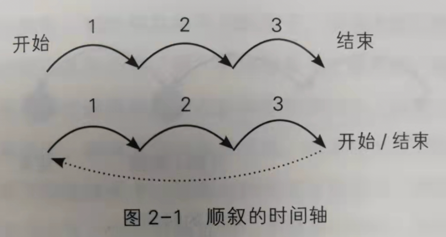
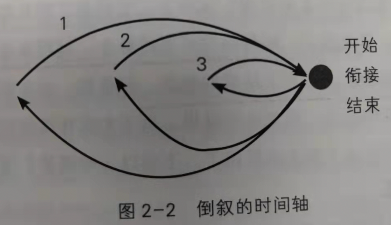
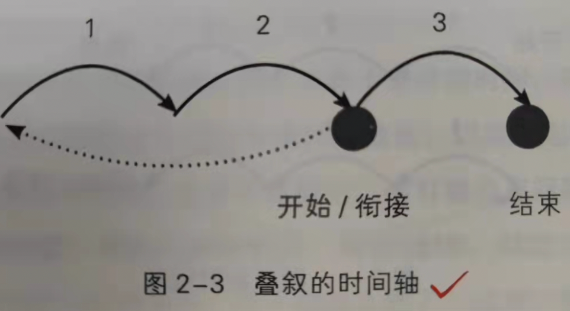

# 《阅读与写作讲义》吴军

序章 从大语文讲起

1. 要想达到精英水平，就得提高综合素质，而非获得一个个单一的技能
2. 上名校更大的收益在于学校提供的通识教育
3. 很多人数理化学不好，很大的原因在于看不懂教科书，看不懂题目
4. 语文包含两个方面的内容
5. 感受：听、读、观察和理解
6. 表达：说、写、唱、表述和表演
7. 沃森和克里克在1953年发表的DNA论文只有一页纸，就把双螺旋结构讲的明明白白
8. 怎么描述荷叶呢？
9. 倒立的雨伞
10. 亭亭的舞女的裙
11. 如果你想进入更高的阶层，你就得用那个阶层的用语（比如好莱坞电影里底层人民和上流社会的用词）
12. 哈佛大唯一一门面向全校学生的必修课：写作课
13. 大语文包含的三个递进层次的概念
14. 词汇（丘吉尔掌握二十万词汇）
15. 语法与修辞
16. 书面、口头表达能力
17. 如何更好的理解他人，表达自己
18. 读和写【单人】。理解读者，书面表达自己
19. 听和说【多人】。线性接收与线性表达
20. 观察和视觉表达。
21. 美国语文教学对学生要求的三种能力
22. 口头表达能力
23. 阅读严肃读物，深刻理解作者思想的能力
24. 在生活中应用语文的能力
25. 如果一个孩子连自己家庭都介绍不清楚就丧失了学习语文的意义。（认识自己、社区、动物和植物、合作）

阅读的意义：理解他人

1. 阅读理解其实是一种信息的转换：把文字信息转换为表格信息。表格中包含了六大要素（when、who、where、what、how、why）
2. 读文章是要读懂作者的内心，了解他们写作的意图
3. 凡人要在伟大的事业中永垂不朽
4. 人类历史上那些伟大的时刻，在出现之前，都经历了长时间的酝酿和势能的积累
5. 《人类群星闪耀时》的主角并不是拿破仑等历史人物，而是茨威格自己。对人类世界充满美好现象，内心世界又极为丰富的一个人
6. 阅读文学著作的三个层次：（《荷拉斯兄弟之誓》、《拿破仑翻阅阿尔卑斯山》、《萨宾妇女》、《泉》、《拾穗者》）
7. 第一层次：读出作品本身的含义
8. 第二层次：读出作者本的本意
9. 第三层次：读出那个时代
10. 如何全面高效地构建知识体系
11. 第一步：从阅读“正统”文献或者作品开始。基准线思维。典型文献就是教科书。
12. 第二步：阅读权威的综述文章。科学领域《科学》、医学领域《展望》、工程《IEEE 频谱》
13. 第三步：读有趣的专著（比如《人类简史》）
14. 阅读学会分清什么是作者观点，什么是客观事实
15. 阅读速度的两个瓶颈
16. 人脑接受信息的带宽。100-200bit/s（12-25字/s），400页小说/4-7小时
17. 眼睛识别图像的速度。视角1°范围内的图像，大概在手臂距离只能看清4-5个字；之所以能感觉到看很多，是因为大脑合成的结果
18. 提高阅读速度的有效方法
19. 把书拿远一点。这样能看清的字数更多
20. 语音辅助阅读。本质是让大脑和视觉的速度保持一致，而发音和是一致的，所以通过提高默读速度的方法来提升大脑理解速度
21. 遇到不认识的字跳过去。
22. 如何兼顾阅读广度与深度。把阅读分层
23. 有些书仅供浏览，快速阅读即可
24. 有些书需要精度，逐句读完
25. 有些书需要典藏，反复斟酌和品味。比如参考书、文学著作
26. 英文原著诗歌翻译成中文就失去了原先的味道，这就如同把唐诗翻译成英文一样，一定没有母语文字本身的魅力

写作的核心：表达自己

1. 写跟说有什么不同
2. 用词用语不同。书面更加正式，说话更加口语
3. 表达结构不同。书面更加多样，包括顺序、倒叙、叠叙，而说话的信息是单一的
4. 信息方向不同。书面更加复杂，而说话则是单方向、线性的
5. 逻辑复杂度不同。书面可以分复杂，但是口语相对简单
6. 写作者的两个阶段：从害怕写到天天想写，再从天天想写到不轻易写
7. 如何成为书面表达的高手
8. 第一步，找一个新鲜有趣的题材，开始写
9. 第二步，突出主题。不要记录流水账，就像摄影一样，画面必须得有主体
10. 第三步，形成具有动感的故事。有轮廓，有细节
11. 第四步，当读者产生共鸣。结合读者的心里感受和体验
12. 第五步，形成自己的风格
13. 如何让外行人理解陌生的东西：比喻
14. 比喻第一层：用熟悉的事物形容不熟悉的事物，即“由简喻难”
15. 比喻第二层：用来打比方的事物，相似点要直观
16. 比喻第三层：比喻产生美感，传神
17. 比如第四层：上升到思想层面，创造一些新概念。比如村上春树的“文化扫雪工”，其实就是小编；玻璃天花板形容职业天花板
18. 比喻的目的在于形象、传神的传达一种思想，让听着有深刻的印象
19. 为什么要写景，因为寓情于景，看似写景，实则抒情
20. 如何寓情于景
21. 第一层：采用千百年来人们产生的思维定式。比如不同颜色代表不同心情；不同季节代表不同预期
22. 第二层：通过不同人看同一景物的不同态度，折射出他们的心情和性格
23. “夕阳无限好，只是近黄昏” vs. “明天太阳照样升起”
24. 第三层：情和景之间建立一个桥梁。《岳阳楼记》、《滕王阁序》
25. 海明威的写作手法是用老人的独白来反应他的内心
26. 心理活动的描述：直接和间接。其中间接分为：描述行为来表达内心和借别人的嘴说出来
27. 叙事方法
28. 顺叙。让读者注意力集中在“是什么”上

1. 避免写成流水账。有主题
2. 避免跑题
3. 避免结构散掉。

- 倒叙。读者注意力集中在“为什么”上

1. 叠叙。
2. 挑选好靠后的锚定点，必须足够吸引人
3. 并且后面的结局必须比锚定点更高潮
4. 【工作应用：先将困难是什么，再讲困难怎么出现的，最后提出解决方案】

1. 高级写作技巧
2. 设置悬念。
3. 期望式悬念。结局是可预期的，缓缓道来。比如《沃森克里克在1953年发表的DNA双螺旋结构》
4. 突发式悬念。结局是不可预期的，非常有反转的味道
5. 有张有弛。把我描写节奏，不要一直高紧张的状态描写。【比如《三体》的分段场景描述】
6. 管中窥豹。通过一个人物的故事来侧面反应整段历史背景（比如《拯救大兵瑞恩》、《阿甘正传》、《人类群星闪耀时》、《文明之光》）
7. 点睛之笔。善于总结，用一句带有标志性的话总结出来。
8. 反讽手法。
9. 真正对写作有帮助的，就是那些经典著作，这些经过了上百年，上千年筛选下来的经典作品一定有他内在的原因
10. 一篇文章要受欢迎有三要素
11. 选题好
12. 内容真实有效，或者有独特性
13. 材料组织的好，有文笔，能让人读得懂

日常实用写作

1. 写好日记的第一要素，是动笔之前想清楚写什么和不写什么
2. 工作日记值得写。发明专利有用
3. 读书心得和收获值得写。
4. 特殊经历值得写。特别是失败经历的感受，以防自己好了伤疤忘了痛
5. 如何写好工作邮件。还包括了工作重需要书面表达的内容
6. 不想留底的内容不要写。
7. 没有经过深思熟虑的内容不要写。
8. 负面的内容，特别是气话不要写。
9. 需要反复讨论才能搞清楚的事情不要写。
10. 4点写邮件的技巧
11. 简要清晰地说明发邮件的目的
12. 一封邮件最好只讲一件事，几件事要用几封不同的邮件讲
13. 写邮件也要像讲故事那样吸引人
14. 主观感受的表达要是收件人而定。一对一的邮件可以增加主观感受，一对多的邮件少引入主观看法
15. 如何写好简历。关键在于：不要把金子埋到沙堆里让人去找，而是要把沙子洗掉，让金子更耀眼
16. 切忌比小成绩当大成就夸
17. 切忌把别人的功劳当自己的夸
18. 切忌平均用力，没有亮点
19. 切忌用PPT写简历
20. 如何写简历的6个要点
21. 搞清楚写简历的目的
22. 分清楚资历和能力的差异。介绍自己重点讲能力，资历不用记流水账
23. 强调效果胜过强调水平。强调结果
24. 保持一致性和向上的趋势。挑选成就时学会舍弃部分成就，保留关键成就，给人一种一直在上升的感觉
25. 注意用词。上位词替代下位词，即用外延更广的词替代，比如用“花”替代“鲜花”，“工程”替代“计算机工程”
26. 切忌篇幅冗长
27. 有两类评论文章：
28. 第一类评论是对某个人、某件事的全面评价；
29. 第二类评论是对某个人的具体、独特的评论，后者比前者好写
30. 第二类具体评论应该如何写
31. 要有自己独特的视角，不能人云亦云
32. 非凡的结论要有非凡的证据。10分强度的结论要有10分强度的证据支撑
33. 三七分配原则。30%篇幅描述轮廓，70%篇幅描述细节，这样的评论才有血有肉，真实可信
34. 不要轻易写负面评价
35. 如何写好论文
36. 论文类文章也包括项目复盘总结报告
37. 要重视研究综述。如果在综述中引用审稿人论文，第一印象将会非常好
38. 要重视呈现研究方法。
39. 要重视比较工作
40. 要给N+2指明方向
41. 如何写好报告
42. 典型的综述报告：政府工作报告、巴菲特给股东的公开信
43. 综述报告要关注不同水平读者
44. 综述报告覆盖面要全
45. 综述报告特别强调内容对等性。不要把不同层次的问题放在一个话题中说
46. 综述报告不重过程，只重结论
47. 典型的研究报告：高盛给上市公司做的评估报告、市场竞品分析
48. 研究报告分析要中立、客观
49. 研究报告要做好横向和纵向对比
50. 研究报告要注意证据的充分性和数据的规范化
51. 研究报告要对数据解读，要做可视化处理

听和说的艺术

1. 做一个有效率的听众，自己要有所准备。会议前要提前看报告的的内容，如果已经听完报告的内容，可以提前走
2. 要预判重点和关键节点。
3. 听有逻辑的老师讲课，重点听关键节点，结论反而可以不听，因为教科书上有
4. 听没有逻辑的老师讲课，只听结论，过程他自己都搞不清楚
5. 适当做笔记。一般就你觉得是重点的部分，和你搞不清楚的部分
6. 通过提问搞懂没有听懂的地方
7. 找出报告着打马虎眼的地方
8. 口头表达的目的不是展现自己，而是要让听众听懂你要传达的内容和信息
9. 平静而有节制的讲话方式很重要，因为只有那样讲，大家才会相信你的话
10. 四讲四不讲原则
11. 最重要的主题讲，其余的不讲
12. 能讲清楚的讲，讲不清楚的或者太花时间的不讲
13. 自己的独到之处讲，别人都有的东西不讲
14. 对自己和对方有利的话讲，对自己和对方没有好处的话不讲
15. 提高口头表达能力的三个要点
16. 口头表达要有对象感。永远要用对方能听懂的事情和概念去解释，不要用只有自己懂的语言解释
17. 口头表达要有吸引力。讲故事、做类比、做对比
18. 《孟子》非常会讲故事
19. 从汉末到改革开放前，中国人均GDP增长了1倍，但是改革开放的40年，人均GDP提高了11倍
20. 口头表达要掌握节奏。从信息论的角度来讲，讲话要多加一点冗余度，因此可以采用重复的策略
21. 报告以口头表达为核心，PPT只是辅助，不能喧宾夺主
22. 四种PPT误区
23. 过于花哨，过于复杂
24. 文字太多。建议用短语，如果文字过多，听者会不自主花时间阅读你的文字，反而不听你讲；等他读完了发现你还在说会觉得你啰嗦
25. PPT写讲稿摘要和内容提纲
26. PPT数量太多。合适的张数=演讲分钟/2

关于人生

1. 王羲之《兰亭集序》。2/3的笔墨用来描述自己的感悟，描述了人的生命、人和宇宙的关系，人终有一死，和宇宙相比终究渺小；《兰亭集》中有很多出自名家之手，但是这篇序反倒流传千古，原因就在于他的立意高远
2. 张若虚《春江花月夜》。
3. “江畔何人初见月，江月何年初照人”。人类的历史很长，但是每个人的生命却又很短，把超越时空的景物，与当下人物的情感柔和到了一起
4. 选对超越时效性的主题，不能空对空，否则文字读起来很无趣，把外景、内心和时空融合到一起
5. 雨果《九三年》。雨果最出名的小说《悲惨世界》、《巴黎圣母院》
6. 体现对人性的思考。通过苏格拉底式的提问，抛出了很多问题。比如政治主张和亲情哪个更重要、郎特纳克有没有人性、郎特纳克做了善事有没有资格将功补过、郭文是不是个烂好人
7. 杜牧《张好好诗》。通过这首诗的原稿，才知道杜牧是一位大书法家，也是故宫的重要馆藏之一
8. 凭吊古迹的感怀之作。《赤壁》。“东风不与周郎便，铜雀春深锁二乔”
9. 香艳的情感诗。《赠别》。“娉娉袅袅十三余，豆寇梢头二月初”
10. 杜牧的诗通俗易懂。《清明》
11. 李商隐《锦瑟》。李商隐情商不高，一辈子没有机会做地方长官，所以从思华年、已惘然可以看出从踌躇满志到怀才不遇，再到无可奈何的坎坷一生；理解了李商隐的经历，就理解了李商隐的诗
12. 李煜《虞美人》。南唐时代的接班人，被宋太宗处死。早期的诗写的不好，后来被宋太宗抓住当做俘虏后才开始后悔当初，写下了千古名篇
13. “春花秋月何时了，往事知多少”、“问君能有几多愁，恰似一江春水向东流”
14. 了解西方文明和社会，要从古希腊开始，而要了解古希腊这个原点，则要从古希腊戏剧这个原点的原点开始
15. 阿波罗代表诗歌、光明、理性和逻辑；狄俄尼索斯代表生命力、戏剧、狂喜和醉酒，他俩都是宙斯的儿子。这两个人虽说是神，但是可以在我们人身上找到影子，我们人自身也是矛盾体
16. “悲剧”在希腊词语中愿意不是悲剧，而是“严肃的剧”
17. 为什么说人生是悲剧的？一是人生短暂，二是人生力量有限，三是命运无常。可尽管如此，我们还是可以选择笑着走完这段旅程，这就是悲剧底色下的喜剧色彩，个人的最终出路在于超越自我
18. 古希腊的神是人格化的，具有人的喜怒哀乐；而一神教（基督教、犹太教）的神是绝对精神、绝对权威和绝对智慧的象征
19. 罗曼罗兰的巨人三转《贝多芬传》《托尔斯泰转》《米开朗琪罗转》，都诉说了一个主题：市侩的大都市与有理想的年轻人之间的矛盾。而有一些英雄能够很好的解决这些矛盾，那就是理想主义者
20. 诺尔贝文学奖倾向于坚守理想主义的文学家，这是诺贝尔的遗嘱决定的
21. 好的诗歌是表达情感的范例

关于历史

1. 《诗经》是我国第一部诗歌总集，定义了我们民族的恋爱、婚姻价值观；相当于《几何原本》之于数学，《罗马法》之于法律，《圣经》之于宗教
2. 《红楼梦》是了解中国社会文化的一把钥匙，曹雪芹能够看到超越我们这个时代的民族共性
3. 自上而下的权力结构
4. 能够集中力量办大事
5. 自给自足的经济形态
6. 熟人社会的人际关系
7. 《红楼梦》至少从三个层次去读
8. 第一层次读懂内容，从故事、文学的层面读
9. 第二层次站在作者的角度，看看他到底想表达什么
10. 第三层次是揭露专制时代中国上层社会的普遍规律
11. 《牡丹亭》是一部可以与莎士比亚的戏剧相提并论的剧作，作者是汤显祖；涵盖了全世界浪漫爱情的基本元素
12. 要有一个无法替代的对象
13. 要有苦恋的成分
14. 一定要遇到反对力量
15. 要过命运这一关
16. 意大利是昔日罗马帝国的中心，以及文艺复兴的起源地
17. 《神曲》，是“神圣的戏剧”，关于神的世界的带有讽刺意味的作品，希望做到雅俗共赏，让各个阶层的人都来读一读
18. 书中采用了非常多的《诗经》典故，以及一部分罗马历史
19. 诗人做了很长一个梦，进入一个黑暗森林，有三只猛兽，分别是豹子（象征欺骗和恶意）、狮子（象征野心）和狼（象征贪婪）
20. 18层山，下9层是地狱，上7层是炼狱，还有一层是境界山，最后一层是人间乐园（即伊甸园）
21. 提供了一种特殊的描写历史的手法：通过对历史人物的描写，来描绘世界进程发展
22. 《傲慢与偏见》奥斯丁
23. 婚姻要建立在爱情的基础上，不能勉强，不能凑合。书中的女主角都是自己把握爱情和婚姻、不勉强、不凑合、精神上具有独立意识的新女性
24. 爱情要建立在理性的基础之上
25. 婚恋中的双方要是平等的。奥斯丁笔下的女主角都是人格独立、有主见、有自尊心，并且善于思考的知性女子。在知识层次、见识上与男性站在同等水平上
26. 理想的爱情要有物质基础
27. 《浮士德》。和中华民族比较像的民族——德国
28. 求索。是理解歌德这部作品的关键
29. 指出德国的出路：通过每个人的劳动建设一个国家
30. 托尔斯泰。被罗曼罗兰选中，作为人类历史上三个文化巨匠之一（其余两名分别为音乐巨匠贝多芬，视觉巨匠米开朗琪罗）
31. 《战争与和平》带来的启示：战争和政治的胜负并不完全由关键人物决定，而且是由很多不随人意志而改变的客观事实决定，即历史充满了必然性
32. 今天的中国和处于第二次工业革命的19世纪80年代的美国非常相似，被称为镀金时代
33. 镀金时代的美国信奉：通过个人劳动来获得财富，而不是靠继承祖上的遗产而不劳而获
34. 海明威。更早的意识到了人类必须有一个全球视角，来专注和处理社会发展所导致的民族、国家和利益群体之间的竞争与冲突。对比盖茨比和海明威，前者通过在前女友面前证明自己，夺回自己所失去的，而后者则是让自己过去的经历过去，继续往前走
35. 凡人要在伟大的事业中永垂不朽
36. 川端康成。日本是一个精致的小国，讲究的是物哀美学（伤感、凄凉、哀怜、感动），如同樱花转瞬即逝
37. 日本传统文化是男权社会，女人的地位实际上低于男人；现在表面上平等了
38. 中国的禅：静修、修心、顿悟
39. 日本的禅：剑道、茶道、饮食、极简

关于社会

1. 莎士比亚可以说是现代英语的开创者，在今天使用的英语中，有1700多个单词是莎士比亚发明的
2. 因为莎士比亚在戏剧作品中讨论的各种问题是人与人之间的问题，这种问题超越了时空，因此才会广为流传
3. 莎士比亚的一些人生智慧
4. 合理支配金钱
5. 忠于爱情，区分爱情和情欲；两性关系要两情相悦，水乳交融，不能勉强
6. 享受生活，体会文学和音乐的魅力，享受美食，不要过度悲伤
7. 克制欲望，不要酗酒、赌博、纵欲无度
8. 《十日谈》：黑死病后的欧洲变革
9. 如果你发现一个大厦有很多蛀虫但是却依然屹立不倒，那说明它可能有过人之处，如果能找到这个过人之处，你就可以放心投资
10. 看到表象和常识相违背的时候，表象可能是假的，我们需要寻找表象下面的本质。也就是在教会我们换一个角度看问题
11. 男生一定要读一读《诗经》，多一份文采和浪漫情怀；女生一定要读一读《简爱》，这是现代女性寻找理想伴侣的参考书
12. 简爱是坚持独立、平等，自己掌握自己命运的女性代表
13. 感激和爱情是两回事。不要因为感激而爱上一个人，这样的爱并不能持久
14. 鲁迅对中国国民性缺点的洞察
15. 奴性特点。对同伴的悲惨境遇麻木不仁，只要厄运没有降落到自己头上，就去当围观群众
16. 自欺欺人。阿Q正传
17. 做人和办事不认真。“差不多”先生
18. 张爱玲：现代都市红男绿女的生活
19. 张爱玲的作品在沉寂50年后才被广泛接受，原因是她生活在20世纪三四十年代，描述的是上海上层社会的生活，等到20世纪八九十年代后，这种生活在生活普遍化了，才逐渐被普及和亲近感
20. 《倾城之恋》关于好女人和坏女人的理论：男人希望女人在家是坏女人，在外是好女人
21. 米兰昆德拉：西方“存在主义”思潮
22. 即存在先于本质。是先存在，再有意义。人本身并没有什么先天的道德和灵魂，这些概念都是人存在的前提中创造出来的。所以人没有义务去遵守某个特定的道德标准或者信仰，都有自己选择的自由

关于体裁

1. 唐朝人在诗歌上的造诣，在于固定、形式化了诗歌的表现形式，这样使得创作出来的诗歌即使内容一般，读起来也朗朗上口
2. 韵律读起来让人觉得很舒服。即绝句、律诗
3. 杜甫一生写了3000多首诗，流传下来的有1400多首，其中以七律成就最高（《登高》，无边落木萧萧下，不尽长江滚滚来）
4. 两个黄鹂鸣翠柳，一行白鹭上青天
5. 一片飞花减却春，风飘万点正愁人
6. 杜甫总结的写诗的四点原则
7. 主题选取，要选择典型意义的事件、经历和人物
8. 寄情于景，在叙事中抒情
9. 叙事注重客观描述，少发议论
10. 在格律诗的原则下提升表现力
11. 李白有很多不讲究词句工整，行文不受约束，但是想象力丰富，气势雄浑（《望庐山瀑布》）
12. 飞流直下三千尺，疑似银河落九天
13. 词最开始是在歌楼舞馆里的流行歌曲，之所以能够登上大雅之堂的文学经典体裁，离不开苏轼、李清照、辛弃疾这些人的努力
14. 苏轼的贡献：将词变成表达人生思考的文学体裁。（《恋奴娇，赤壁怀古》）
15. 李清照的贡献：早期作品充满希望，晚期作品由于国破家亡，主题发生了变化，感慨命途多舛（《声声慢》叠词写法）。她的词清新脱俗，容易读懂
16. 今天流传下来的中国第一部词的总集《花间集》
17. 唐诗和宋词主要在文人圈子里交流，老百姓触及的非常少，而元曲则是更贴近真实老百姓的生活状态，做到了“三分引导，七分迎合”
18. 三分引导：作曲家将自己的思想通过元曲表达出来
19. 七分迎合：作品想表达的观点也要符合当时的社会环境和文化价值观
20. 大量低水平的俗文学里，“三言”和“二拍”脱颖而出，原因是他们都讲述了一些通俗易懂的民间观念
21. 好人有好报，恶人有恶报；负心汉会遭报应；富贵运气自有天命；家和万事兴等等
22. 三言《喻世明言》、《警示通言》、《醒世恒言》
23. 二拍《初刻拍案惊奇》、《二刻拍案惊奇》
24. 哥德式小说。通过制造悬念来让思想印刻在读者脑海里。比如《呼啸山庄》
25. 科幻小说。人类祖先具有超凡的想象力，这是一种内在需求，刻在DNA里，因此我们容易相信鬼神传说
26. 我们来自古猿
27. 我们好奇心极强
28. 我们最终会以信息的形式存在，而不再是生物
29. 即时报道的一些要求
30. 材料真实性
31. 材料时效性。不需要等到结果，有了信息就发
32. 注意讲故事的视角和内容
33. 注意人物塑造和场景还原
