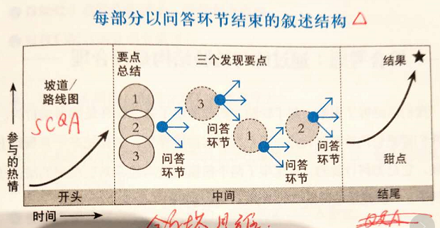

# 《高效演讲》Peter Meyers

演讲灵魂三拷问：你的听众想听什么？你的要点是什么？演讲内容和时间能不能减少一半？

前言

1. 杏仁体持续让人保持活跃，是人类早起预警系统的一部分
2. 交流的主角不是你，而是听众。你要清楚的知道听众想听什么，才能更好的达到演讲的目的

精心准备

1. 演讲三宗罪：
2. 信息量过大
3. 与听众不相关
4. 观点不明确
5. 准备的三个要点：
6. 结果。你想要获得什么？
7. 是听众知道？
8. 是听众了解？
9. 是听众理解？
10. 是听众行动？
11. 关联。为什么听众要关注你讲的东西？
12. 你讲的内容和听众有什么关联？能解决他们什么问题？
13. 要点
14. 提纲挈领总结明确的观点

巧设结构

1. 演讲内容架构分三个板块的内容：

1. 坡道【SCQA】
2. 一句话引起听众最大兴趣。可以采用SCQA的方式，切忌一上来来一段毫无价值的开场白
3. 要怎么做
4. 多用“你”，少用“我”
5. 开头的话要简练，精简
6. 多用统计数据说话
7. 提出问题
8. 运用“想象”这个词
9. 多讲讲故事
10. 提供路线图：演讲议程要清晰，明确，
11. 有多少个议题
12. 会花多少时间
13. 发现【金字塔思维，结论先行，以上统下】
14. 要点最好不超过3个，且富有逻辑
15. 总结。可以在最后增加简短的总结章节，概述一下本次演讲的主要内容
16. 甜点
17. 通过故事增加演讲内容的场景感，增强记忆

善用技巧

1. 故事。听众可能记不住三条措施和具体数字，但是一定会记得你讲的故事
2. 讲故事是为了让听众的思想与自己同步
3. 最优讲自己的故事，其次是总所周知的故事，不要讲杜撰的故事
4. 比喻。目的是为了将难以理解的概念形象化、具象化，通过类比的方式转化为听众容易理解的概念
5. 语言生动
6. 重复。通过重复一些关键词和关键句强化内容
7. 问答环节。
8. 如果没有人提问，可以自己事先准备好一个问题
9. 在正式场合，回答之间可以先大声重复一下问题，确保认知一致，也确保听众都听到了提问者的问题
10. 应对挑衅提问的方法：
11. 首先对听众的提问表示赞许，找出提问者的真知灼见，或者你认可的部分
12. 然后对难以回答的问题用更深层次的替代问题做回答，避免直接回答
13. 回答问题要实话实说，不要撒谎
14. 如果确实不知道问题的答案，可以承认，事后补充

锻炼声音

1. 强调句子的重点时，要放缓语速，也可以重复，还可以故意停顿

姿势与动作

1. 如果上台时手在颤抖，不要拿纸张，这样会放大你的颤抖
2. 深呼吸的作用非常明显
3. 在适当的时候摊开手掌
4. 如果发现台下有人交头接耳，可以往那人的方向走过去；也可以把眼神看向那边

表情和眼神

1. 可以试着找找镜子，看看自己在演讲时有着怎样的脸部表情
2. 可以将观众分区，用扫视的方式与观众交流
3. 通过记事本，卡片等方式提醒演讲要点，不要全篇背诵

身体模式

1. 身体模式反过来影响心理。Fake it till you become it.

心灵之眼

转变信念

直面危机

危机沟通

运用新技术

1. 少用“我”，多用“你”
2. 邮件要简短，尤其是发送给上级领导的邮件
3. 打电话之前，好好想一想你想要的结果是什么
4. 提问的时候可以指定某人来回答，避免尬场

个人愿景

人脉管理

合作与创新
