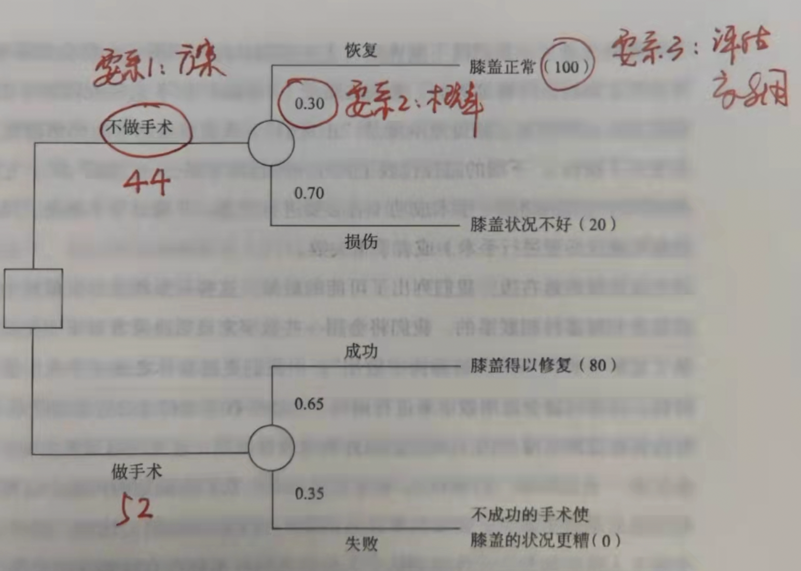
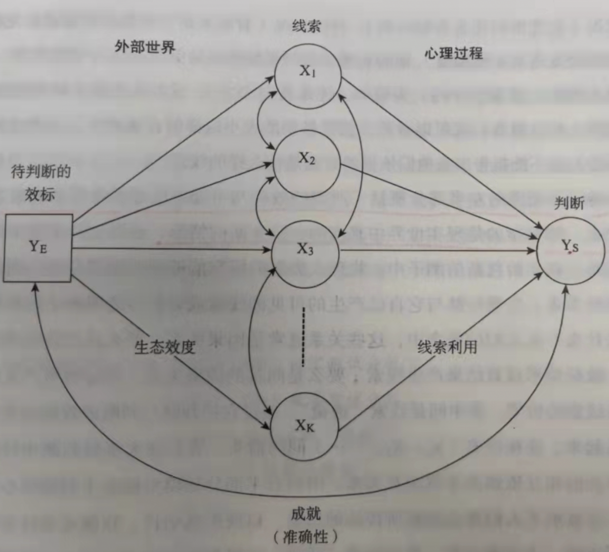
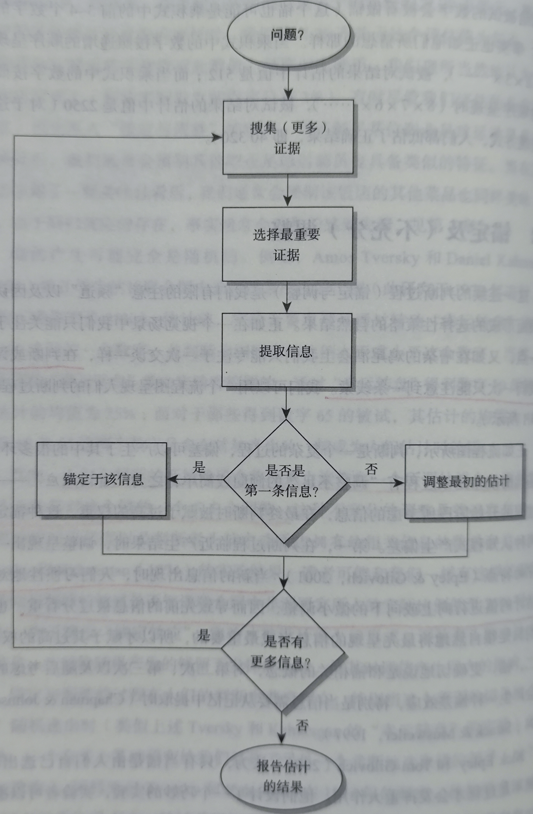
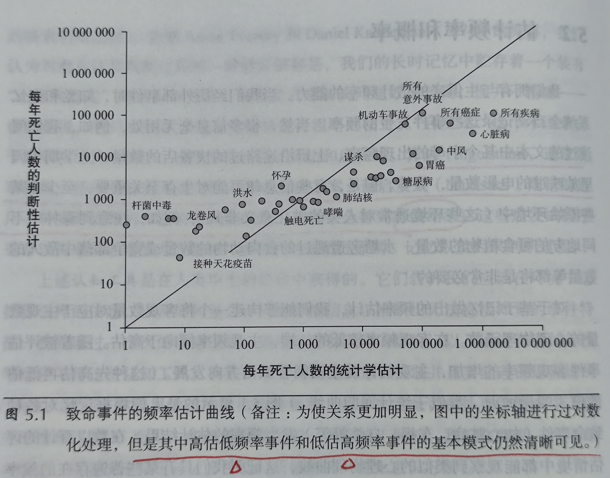
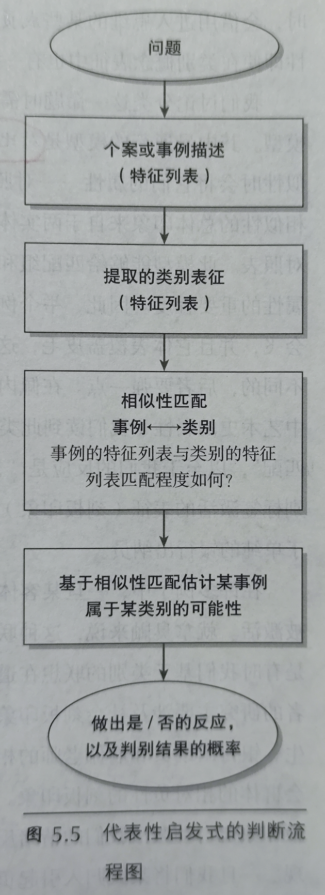
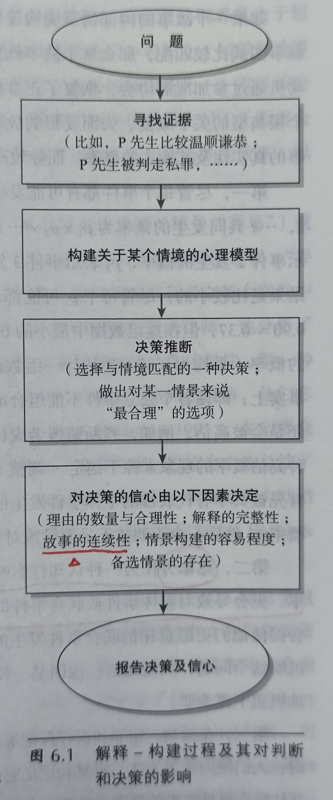

# 【DONE】《不确定世界的理性选择》Reid Hastie

## 目录

- [思维和决策](#思维和决策)
- [何谓决策](#何谓决策)
- [判断的整体框架](#判断的整体框架)
- [基本判断策略：锚定与调整](#基本判断策略锚定与调整)
- [启发式判断](#启发式判断)
- [基于解释的判断](#基于解释的判断)
- [偶然与因果](#偶然与因果)
- [理性思考“不确定性”](#理性思考不确定性)
- [对后果的评价：基本偏好](#对后果的评价基本偏好)
- [从偏好到选择](#从偏好到选择)
- [理性决策理论下一个是什么？判断与决策研究的新方向](#理性决策理论下一个是什么判断与决策研究的新方向)
- [赞美不确定性](#赞美不确定性)

# 思维和决策

1. 教人学会游泳的第一步就让对方觉得把头放在水里是舒服的[^1]
2. 思维拆分为：
   1. 自动的。不需要高级思维活动参与的，比如开车，走路等
   2. 控制型的。需要高级思维活动参与的，比如做数学题
3. 本书的基本论断：人在做判断和决策时常常使用自动思维，这会导致一些比较差的判断；而并不是所有自动思维的判断结构都是不可接受的，我们需要学会甄别何时使用控制型思维纠正自动思维引发的问题【与《思考，快与慢》的系统1和系统2观点类似】
4. 心理计算模型：把判断过程符号化，思维过程就是一系列富符号表征基本运算，就像计算机一样
5. 一个决策是否理性，不能仅仅以决策结果的好坏作为唯一的判断标准，还应该考虑
   1. 决策是否考虑了决策者目前的财富，生理状态，心理能力，社会关系
   2. 决策是否考虑了所有的可能结果
   3. 决策是否考虑了各种可能结果的可能性
   4. 决策是否具有一致性和适配性【往后再遇到此类问题，依然会如此决策】
6. 现代决策理论主要是“期望效用”理论

# 何谓决策

1. 决策组成三部分：
   1. 方案全不全，有没有漏的
   2. 每个方案有没有预估发生概率
   3. 每个方案的价值效用评估是多少
2. 分解决策使用决策树[^2]

   
3. 影响决策质量的3个因素
   1. 选项不全，方案没考虑完整
   2. 概率估计的不对，瞎拍脑袋
   3. 效用价值评估不准确，不符合未来预期
4. 关键洞见：人们日常决策不会使用决策树，太复杂，麻烦，往往更愿意聚焦在一两个结点上，给出广泛的推论
5. 沉没成本不应该影响未来的决策。即使如此，但是实际运用中依然会受到影响而不自知

# 判断的整体框架

1. 整体判断过程的透明模型：左边为外部世界投射到线索上的视角，右边为线索投射到判断结论上的视角

   
   1. 并非所有校标都能被线索化（校标：待评估对象，比如年轻）
   2. 心理过程可能存在非线性，即专家可能只会根据几个重要的2-3个指标得出结论
2. 专家并不能准确的给出他自己做出判断决策的线索权重
3. 诸多研究表明：基于统计数据的线性透镜模型给出的判断比专业用直觉给出的意见，具备更强的预测力
4. 作者设想：不仅仅计算机模型的推导模型是数字、线性的，人类的判断过程其实也如此，大脑的这样的机器，它的算法也是权重加法模式

# 基本判断策略：锚定与调整

1. 人们在做决策时，一般会把注意力放在一个锚点上，然后通过信息输入，不断对结果进行上下微调，因此最先开始的锚点非常重要[^3]；有可能是有意识，也有可能是无意识

# 启发式判断

1. 算法与启发式的区别
   1. 算法：针对某类特定问题设计的解决方案，因此方案是最优的
   2. 启发式：在某种解决方案的基础上，提出一种更有效率的解决方案，虽然有效率，但是结果可能是有偏的
2. 人们对一件事情的发生频次的估计值与实际值往往存在着不一致性，表现为：

   
   1. 高估低频率事件的死亡人数【例如坐飞机死亡人数，超市排队长，出门没带伞，这些经历记忆深刻导致】[^4]
   2. 低估高频率事件的死亡人数
3. 可得性启发判断（根据记忆联想到的信息做出的判断）所依赖的信息受限于信息提取的便捷性和流畅性。所以当记忆出现偏差时，往往自己还没意识到，做出了有偏差的决策
4. 代表性启发判断（提取相关事件的特征，然后与本次事件做模型匹配）。这种判断方式很容易出现相似不代表逻辑关系的错误论断

   
   1. 贝叶斯定理，把P(A|B)与P(B|A)的概念不经意间混淆[^5]。
      $$
      P(A|B)=P(A and B)/P(B)=P(B|A)/P(B)
      $$
      1. 比如在吸大麻的人群找吸毒的人，和在吸毒的人里找吸大麻的人，概率是不同的

# 基于解释的判断

1. 人们普遍相信多个事件的联合发生概率大于各个独立事件的乘积，这是合取谬误
2. 人在得到证据之后，会不自然的在大脑里构建一整套故事，这个故事说的越合理，越完善，则人们越容易相信[^6]

   

# 偶然与因果

1. 对于很多偶然性的事件，我们总是试图用一个确定性理论是解释，其实往往是我们的过度解释
2. 如果出现了均值回归现象，往往说明两件事情并没有因果关系

# 理性思考“不确定性”

1. 避免概率偏差过大的几种措施：
   1. 别忘记基础概率
   2. 把问题符号化，用贝叶斯定理推导
   3. 图表，分树形式的办法来想清楚概率

# 对后果的评价：基本偏好

# 从偏好到选择

1. 做好决策的方法：
   1. 列出所有应该考虑的变量、因素；
   2. 找出决策目标，追求什么指标；
   3. 根据这个指标筛选出最重要的变量；
   4. 重点参考这个变量的值做出决策

# 理性决策理论下一个是什么？判断与决策研究的新方向

# 赞美不确定性

[^1]: 教人学会游泳的第一步就让对方觉得把头放在水里是舒服的

[^2]: 分解决策使用决策树

[^3]: 人们在做决策时，一般会把注意力放在一个锚点上，然后通过信息输入，不断对结果进行上下微调，因此最先开始的锚点非常重要

[^4]: 高估低频率事件的死亡人数【例如坐飞机死亡人数，超市排队长，出门没带伞，这些经历记忆深刻导致】

[^5]: 贝叶斯定理，把P(A|B)与P(B|A)的概念不经意间混淆

[^6]: 人在得到证据之后，会不自然的在大脑里构建一整套故事，这个故事说的越合理，越完善，则人们越容易相信
