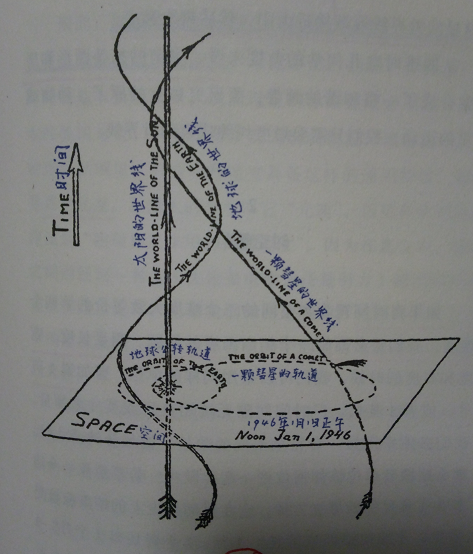
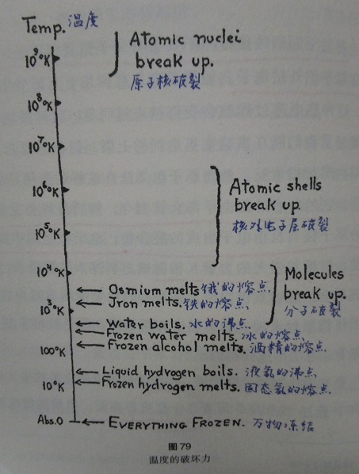
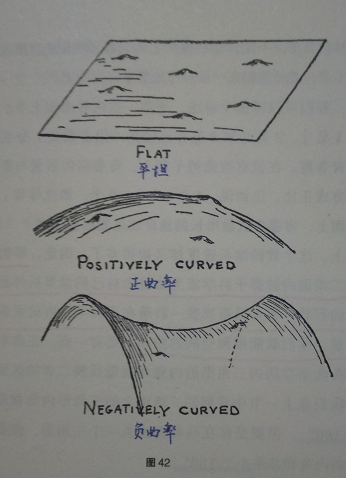
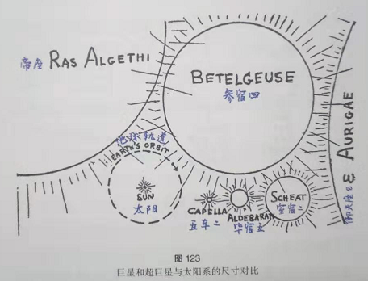

# 【DONE】《从一到无穷大》George Gamow

人类理解这个宇宙的基本路径：数数字->往大了看，思考时间、空间、宇宙、行星->往小了看，分子、原子、化学、生命科学

大数字

非洲土著数不清楚3，和我们现在数不清楚无穷数是一样的（N0,N1,N2）

1. 截至2018年，可观测宇宙的原子总数量约为10^80个
2. 康托尔提出的“无穷数”比较方法：两组无穷数进行配对，如果正好配对，则说明相等
3. 全体自然数集合和全体偶数集合，全体奇数集合是一样大的。即在无穷数的世界里，部分可能等于整体
4. 非洲土著数不清楚3，和我们现在数不清楚无穷数是一样的
5. 一条线上的点比整数、分数的数量多得多；一个平面上的所有点的数量等于一条线上的所有点的数量；立方体内所有点的数量等于平面或线段内所有点的数量
6. 三类无穷数：
7. N0。所有整数、分数数量
8. N1。所有线、面、立方体内的几何点数量
9. N2。所有几何曲线的数量

自然数字和人造数字

1. 哥德巴赫猜想：任何一个≥2的偶数都能表示为两个质数之和。目前只证明了“1+2”（陈景润），即由a+b或a+bc形式，其中a、b、c均为质数
2. 随着整数越来越多，质数在数字中所占的比例也越来越小。占比大致服从公式：1/lnN
3. x^n+y^n=z^n，在n大于2时，没有整数解。在1995年由坏尔斯证明，定义为费马大定理
4. 虚数。一个数乘以i，相当于让它在对应的点在坐标轴内逆时针旋转90度

宇宙的奇艺特性

1. 多面体顶点V，面F和棱E之间的关系：V+F-E=2
2. 正多面体只有5种：正四面体、正六面体、正八面体、正十二面体、正二十面体
3. 四色问题在1976年6月在计算机上得以证明
4. 左手性物体左手套和右手性物体右手套是不同的，不过他们可以离开三维空间，进入四维空间做某种方式的旋转，再回到三维空间，则可以做转换

四维世界

我们可以把时间定义为第四维。既然三维中可以旋转坐标进行坐标变换，那么在第四维中也可以进行时间和空间的转换，即时空变换（光年就是一个例子，假设光速为标准速度）

1. 三维立方体在平面上的投影表现为两个嵌套正方形，超立方体在三维空间内的投影由两个嵌套立方体组成
2. 把时间看作第四维，则可以在空间中建立一条时间线，如下：

1. 时空等价：通过定义标准速度（光速），来建立时间和空间之间的关系。比如光年就是一个例子：光这种标准速度在一年时间内所走的距离，就建立了时间（1年）和空间（300000*365*24\*3600m）之间的关系
2. 四维距离。三个空间距离的平方减去时间间隔的平方。之所以用减去，是采用了虚数单位

空间和时间和相对性

引力现象不再是隔空打牛，而是通过在四维空间中产生空间弯曲，周围所有物体沿测地线运动，这就变换成了空间几何概念

1. 时空互换。横轴为距离，纵轴为时间建立坐标系，若有一辆运动的汽车，则会出现一条新的时间轴，对他来说，两个事件发生时相对他的距离是不同的
2. 普通物质的所有力学性质都能追溯到构建物质的原子之间的相互作用
3. 如果某个物体运动速度极快，导致它的长度缩短了一半，那么它的时间就会膨胀到原来的两倍
4. 虽然遥远的星系距离我们非常远，但是对应坐在上面的人来说，如果飞船速度接近快速，那么他感受到的时间会非常短，可能几个小时就到了，但是对应地球上观察的人来说，过了几十年
5. 如何发现自己生活的空间是否弯曲？通过测量空间中的三角之和，若是180则说明平坦，若不等于180，则说明弯曲。而且这个测量必须具有相当的尺度范围，空间广，否则无法看到一些微小的形变
6. 直线概念：两点之间最短距离的线，这条线必须契合它所在的面或者空间。比如平面内就是直线，球面上则是大圆弧
7. 光总是沿着最短路径传播，即使是在大质量星体附近，光会沿着被弯曲的空间的最短路径行走（即测地线）
8. 引力现象不再是隔空打牛，而是通过在四维空间中产生空间弯曲，周围所有物体沿测地线运动，这就变换成了空间几何概念

下降的阶梯

通过用He不断轰击原子的试验方法，我们找出了原子核内部的真实的结构

1. 希腊时期，那时候的人认为原子有四种，分别对应基本元素：土、水、气和火
2. 通过油分子铺在水面上的高度来估算分子直径
3. 照射在物体上的光线波长必须小于拍摄对象的尺寸，否则照片无法看清
4. X射线能够穿透很多物质，不会发生折射，所以不能通过传统意义上的透镜来使用X射线观察细小的物体。为了解决这个问题，通过从不同方向拍摄X射线的方式，叠加多长图像合成最终的照片
5. 汤姆孙成功证明了原子由带正电和负电的部件组成，卢瑟福通过α轰击金箔实验证明了原子大部分质量的正电荷实际上集中在原子中央一个非常小的原子核里
6. 任何一种元素的物理性质和化学性质都可以用简单用绕核旋转的电子数量来表示，而元素化学性质的周期性，必定是因为电子层的结构具有某种周期性变化
7. 因为金属元素的外层电子有多余的，这些多余的电子游离在金属中，所以他们容易导电，形成电流
8. 经典力学无法解释原子里细小物体的运动规律，他具有一定的不确定性，不能用传统速度，位置这些物理量来表征。如果试图观测，会产生观察者效应，即测不准原理
9. 光线呈现波粒二象性特点

现代炼金术

发现原子核内同时存在内聚力和电荷力，正是这两种力使得原子能够保持其形态。而核裂变则是由于斥力大于内聚力导致，典型的核裂变反应就是利用一种天然可裂变物质U235不断释放中子来达到目的

1. 质子、中子可以相互转化：质子失去一个正电荷变为中子，中子也可以吸收一个正电荷变为质子。他们统称为核子
2. 在元素周期表前面的元素，中子和质子基本对半分，而对于原子质量较重的元素，中子数量普遍多于质子
3. 自然界确实存在正电子，反质子这些物质。只是他们无法共存
4. 电性相反的电子湮灭会释放电磁波（γ射线），电磁波经过某个原子核附近，又会创造一对正负电子
5. 中微子的发现是由于一些反应中缺失的部分能量，它的质量小于普通电子，不带电
6. 核子（质子、中子）因为有正电荷和不带电荷的例子，他们如何紧紧结合在一起不分开？是因为有内聚力；而为何没有进一步塌陷成点，是因为电荷之间有电斥力，这两种力相互抵抗，形成了电子核。如果斥力大于内聚力（Ag以后的元素），容易引起“裂变”
7. 核聚变则必须依赖核子的热运动，不断撞击，这个强大的外力大于电荷间的斥力，生成新元素，即He核
8. 热量单位“卡”：1g水升温1℃所需的能量
9. 重于Ag的元素原子核都不稳定，他们其实都属于放射性元素，只是速度极慢，我们根本不会注意到他的存在
10. 轰击原子的效率之所以很低，是因为电子层会拖慢粒子运动速度
11. 原子直径大约是原子核的10000倍
12. 因为发现了一种能让中子数几何增长的核反应过程（一个中子轰击另一个原子核，产生的两个或更多中子），这才引发了物理学领域的大爆炸。自然界中满足这样反应的原子核只有一种：铀235（天然可裂变物质）
13. 铀235以极低的密度参杂在同位素铀238中（0.7%），需要使用物理方式（扩散、磁场分离）进行浓缩、提纯
14. 为了能够控制核反应规模和速度，需要有一种能够控制中子移动速度的物质。这些物质不仅不能捕获吸收中子，而且要能有效降低中子运动速度。比如重水、碳等，称为慢化剂

无序的规律

分子热运动和扩散是物理学中最重要的过程（熵增），温度越低，运动越平静（如绝对零度），温度越高，运动越剧烈（固态、液态、气态、分子、原子）

1. 分子的热运动，即布朗运动。分子温度越高，运动越剧烈，皮肤感受到剧烈运动后，会感觉到“烫”
2. 温度达到绝对零度（-273.15℃）时，分子完全停止热运动
3. 从分子运动的角度解释固态、液态、气态：温度很低时，分子内聚力大，形成固态；温度逐渐升高，分子运动逐渐增强，分子间可以产生相对滑动，形成了液态；温度继续升高，分子运动剧烈，四处逃散，形成了气态
4. 给定温度下任何物质的分子携带的能量完全相同，只是不同物质的分子内聚力不同导致的不同固态、液态和气态的溶化点。如果温度继续升高，分子会继续打散，变成纯化学元素组成的气态混合物；如果温度再升高，电子和原子核也会分开，形成原子核与自由电子的混合物，这种温度一般在恒星内部经常出现。温度的破坏力天梯图如下：

1. 分子的热运动其实也可以建模得出它的运动规律：分子距离出发点的距离等于每次走过的直线的路程的平均长度x线段数量的平方根。即：R=1x根号N。公式成立的前提条件是分子运动足够随即，转向次数足够多
2. 扩散是分子物理学中最重要的过程之一。金属传热是靠电子扩散实现的
3. 光量子相当于细小的颗粒原子，从太阳中心通过扩散过程走到太阳表面需要耗时50个世纪！
4. 房间中的空气分子确实可能出现在某个时刻一半真空，一半空气的情况，但是这种概率非常低，几乎不可能。原因是空气分子数量太多，数据量特别大，本质上几乎不可能发生。倘若只有几十个空气分子，则很有可能出现上述情况
5. 所有依赖于空气分子不规律运动的物理过程必然朝着可能性更大的方向发展，直至最后达到可能性最大的平衡态。即朝着熵增的方向发展
6. 熵增定律（热力学第二定律，违反此定律的永动机称为第二类永动机），能量守恒定律（热力学第一定律，违反此定律的永动机称为第一类永动机）

生命之谜

活细胞具有的三种基本能力：进食、发育、繁殖（有丝分裂、减数分裂）

1. 生命体由组织构成，组织由细胞组成。细胞是保持组织特性的最小单位
2. 活细胞拥有的三种基本能力：
3. 进食。从周围环境摄取养料
4. 发育。将养料转化为生产所需物质
5. 繁殖。细胞分裂
6. 病毒是生命体和非生命体中间缺失的一环。【病毒=核糖核酸+蛋白质】
7. 细胞内的原生质都是透明的，为了能够看清楚内部结构，需要对细胞进行染色，其中细胞核因为是网状结构十分容易染色。但是一旦染色，生命体就失活。所以需要给处于不同发育阶段的细胞染色
8. 细胞有两种分裂方式，一种有丝分裂，一种减数分裂。前者复制一个完全相同的细胞，后者一般出现在生殖细胞中
9. 色盲是由X性染色体的缺陷引起的，且具有隐形遗传特征
10. 在减数分裂之前，成对的染色体常常纠缠在一起，所以他们有可能产生部分的交换，即交叉混合
11. 温度每升高10℃，化学反应速率大约提高1倍
12. 将基因突变与化学分子中的同分异构体概念可以联系起来，因为同分异构体在分子质量越大时，其形式越多，所以基因也因为分子质量大，其排列组合的形式也越多。这种思路也试图将生物过程中解释为纯粹的物理化学过程
13. 环境温度会影响动植物繁殖的突变率
14. 细菌有自身的原生质，可以自己存活；但病毒不行，它只能依靠其他生物的原生质完成增殖

不断扩展的地平线

我们虽不能离开地球，但是使用了类似视差法、红移蓝移等现象来观察我们的宇宙，逐渐知道了我们的宇宙很有可能是一个有限但无界（类比莫比乌斯带），并且曲率为正的空间

1. 可以利用视差法对遥远的星系进行距离估算
2. 利用地球尺寸测量地球公转轨道半径，同样可以利用地球公转轨道半径测算恒星距离，只是两次观测的时间较长
3. 太阳系在银河系的边缘
4. 银河系的中心并不是一个超级恒星，而是由无数颗恒星组成的中心，只是密度非常大而已
5. 通过观察天空中存在的恒星运动，以及红移、蓝移现象，从而证明了银河系的确存在旋转
6. 宇宙中还有类似银河系的星团：仙女座星云
7. 天空中的某些恒星亮度会呈现周期性规律变化：从明到暗，由暗复明，周而复始，不断循环。质量越大的恒星循环周期越长
8. 星系的形态非常多：螺旋状、球状、棒状
9. 宇宙空间到底是有限还是无限的？可能的答案是：空间可能是有限但是无界。类似二维世界的莫比乌斯带，形成一个自我封闭的结构，如果沿着测地线一直走，很有可能会回到原地
10. 曲率分两种：

1. 正曲率：体积有限的封闭空间。一定半径内的恒星数量小于半径三次方。研究表明我们的宇宙是正曲率宇宙
2. 负曲率：体积无限的开放空间。一定半径内的恒星数量大于半径三次方

创世年代

太阳内部的反应过程：H在CNO的催化作用下不断转化为He，期间释放α射线、β射线、γ射线

1. 地球内部，深度每增加1km，温度上升30℃左右
2. 刚诞生的地球是一个纯液态的球体，后来一直在冷却，未来可能会变成固态
3. 通过测算放射性元素中的元素含量，根据元素衰变周期可以推算岩石的年龄
4. 地球主要由O，Si，Fe组成
5. 太阳一半的质量是H，另一半是He
6. 在太阳内部，C，N，O之间不断的转化，期间释放α射线（He）、γ射线、β射线。从本质上说，是H在CNO的催化作用下生成He的过程
7. 一般情况下，恒星越重，则体积越大，即半径越大。而也有一些恒星不符合上述规律：红巨星（尺寸巨大，表面温度低，光谱红色）、超巨星。如五车二、参宿四、帝座等，这些恒星个体非常巨大，但是密度很低；另外一些直径非常小的白矮星（尺寸小，温度极高，发白光）

1. 消耗完了H燃料的恒星会逐渐萎缩，在最后时刻，亮度会突然增加，并以极快的速度扩张，到达某个极限后发生爆炸，称为”新星爆炸“或”超新星爆炸“
2. 超新星爆炸的亮度是新星爆炸的几十万倍，亮度峰值会照亮整个星系。与此同时会在附近位置看到”蟹状星云“，这是恒星爆炸时喷出的气体
3. 通过宇宙微波背景辐射来测算宇宙年龄，大约为136\~138亿年左右
4. 所有星系都在离我们远去，越遥远的星系后退的速度越快。即红移现象。我们可能在一个体积不断膨胀的气球上
