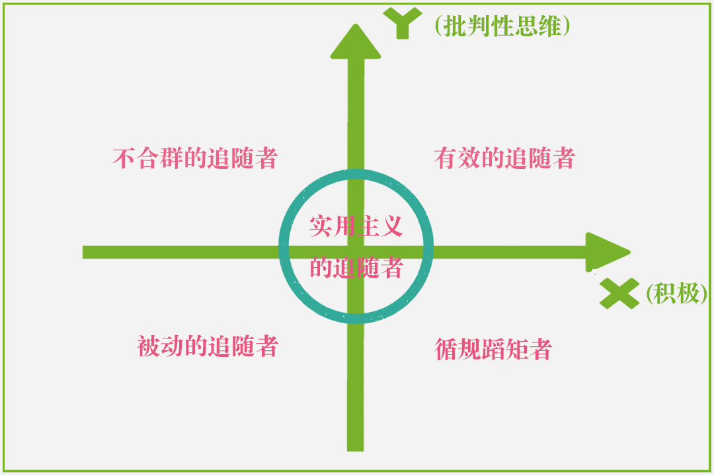
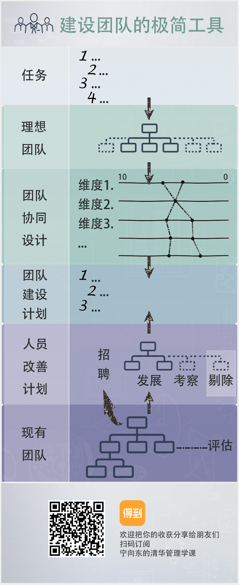
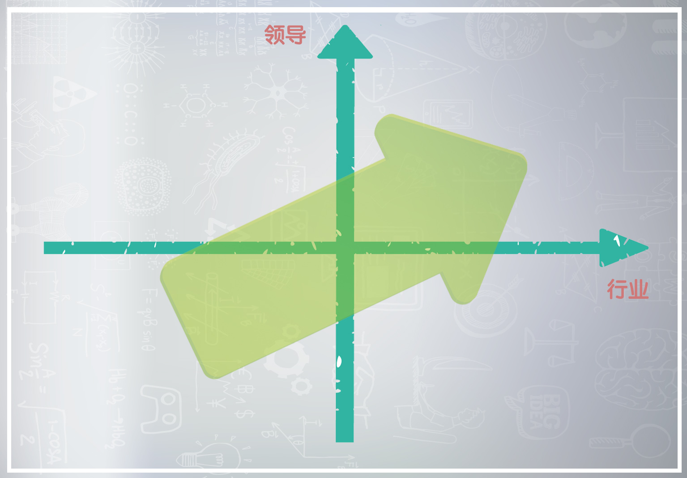
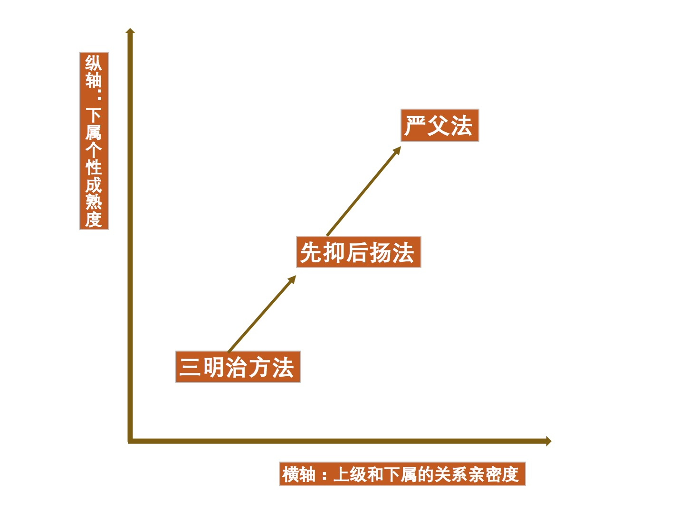

# 【DONE】《宁向东的管理学课》宁向东

## 目录

- [导论](#导论)
- [人与行为](#人与行为)
- [领导力](#领导力)
- [团队](#团队)
- [指导下属](#指导下属)
- [组织](#组织)
- [文化与沟通](#文化与沟通)
- [客户](#客户)
- [竞争战略](#竞争战略)
- [计划与变化](#计划与变化)
- [运作](#运作)
- [业绩](#业绩)
- [激励](#激励)
- [控制](#控制)
- [转型变革](#转型变革)

# 导论

1. 管理学，绝不只是管理公司的学问，它是帮你管理周围所有资源的学问。
2. 德鲁克提出了每个人都可以追问自己的三个问题：
   1. 不做当下这件事，又会怎样？[^1]
   2. 这件事，别人做，会不会更好？[^2]
   3. 有哪些事情，就是交给别人做，也毫无意义？
3. 管理学的目标，就是为了“破局而出”
   1. “ 局 ” 就是你身边各种资源之间相互关联和相互作用的状态与关系。这里有一个重要的管理学概念，叫做“资源”。什么是“资源”？人是资源，物是资源，名声也是资源，是一种无形的资源。总之，你身边的一切其实都是资源。
   2. “ 破局 ” ，本质上就是调整资源的性质，正的变成负的，负的变成正的，然后变换资源和你之间的相互关系，让自己能够走得通。
4. 能做大事的人和成功的企业都不会只靠自己的蛮力，而都善于借助外部的力量。
5. 所有的管理工具和管理方法，都是一把双刃剑，既能解决问题，也会带来新的问题。所以管理工作，很难一劳永逸。
6. 尽量树立 “ 业绩文化 ” ，来对冲掉 “ 关系文化 ” 。
7. 不要以为自己能破掉所有的局，有些局是破不掉的

# 人与行为

1. 霍桑实验得到两个结论，
   1. 第一，企业内部更有影响力的，是非正式的职场关系；
   2. 第二，员工的情绪，是会被带入到他们的工作过程中影响效率的。
   3. 如果把这两条结论合在一起，就会有一个推论：负面情绪可能会通过一个看不见的渠道快速传染，并且影响整个组织的工作质量和工作效率。
2. 比如你买了一只股票，因为你买了这支股票，你看这支股票的眼光就不客观了，你总是希望它涨，因为你希望它涨，所以你就不能用理性的心态去考虑什么时候把它卖掉。
3. 人为什么会慌张？情境、意识、慌张。情境让你产生意识，意识导致你的内分泌系统发生了变化，然后表现在你的行为上就是慌张，这是一个传导关系。
   1. 方法一：情感注入。把注意力转移到其他地方。比如看钉子，掐手指等
   2. 方法二：理性注入。理性分析慌张的必要性。准备充分没必要慌张，准备不充分就摆烂。
4. 人应该从事什么职业，是做通才，还是做专才，也就是说是走专业路线，还是走综合管理路线，都和人格特质有关。
5. “达克效应”的定义是：能力越低的人，越容易产生对自己过高的评价，至少会把自己的能力评价在平均水平以上；而能力较高的人，则会倾向于低估自己的能力。
6. 人的所有决策，都是情绪参与的结果。管理者要学会管理好自己的情绪
7. 真正的管理，应该是努力帮助他人改变工作情境、创造好的情绪、激发员工的动力，控制员工的惰性[^3]。
8. 任何人在工作中的业绩表现，都可以归因于两样东西：一是能力，二是愿望。
9. 管理其实就是管人。人的逻辑：“ 从动机到愿望，从愿望到努力，再从努力到目标 ” ，所以在进行目标管理的时候，首先要想一想能不能从改善动机、改善员工自身愿望的塑造过程这些角度做些文章[^4]。
   1. 动机有三种：获得成就感，获得权利，获得归属感
10. 四种管理方法
    1. 第一，给任务的时候一定要明确。管理者要能够相对清晰地提出问题，而不是大而化之地给人家一个工作方向。
    2. 第二，要善于定好小目标，这是方法层面的建议。管理者要善于把大目标分解成中目标和小目标。目标越小，评价周期越短，效果会越好。
    3. 第三，一定要给年轻人即时反馈。
    4. 第四，不要吝啬鼓励。当年轻人取得了阶段性的成果，一定要给予及时肯定，适当地要给予表扬。
11. 格局的格是个动词，意思是弄清事物，获得知识的意思，局就是各种资源之间的复杂关系，所以格局的意思就是：弄清资源之间复杂关系的能力。格局越大，则事情本质看的越透彻
12. 离职的同事其实是公司重要的人脉网络，因为他们对公司的评价是相当重要的
13. 辞职的本质：当一个人和企业不存在社会交换的时候就需要离职了。社会交换：成就感、归属感、经济收入等
14. 当辞职者离职时，一定要进行一次谈话，可以留不住人，但是要留住心
15. 好的管理功夫，就是首先要把问题深入解析，然后再去选择理论，如果没有理论可以帮你，就找到一个别人的最佳的参考做法，试着解决你的问题。
16. 管理工作，应该看重源头，而不是结果。从员工的源头动机出发，也就是激发员工的进取心
    1. 对于做出业务范围以外的动作，要有奖赏。

# 领导力

1. 五种权利：法定权力、奖赏权力、强制权力、专家权利、魅力权利。后两种权利是岗位之外的权利，可以超越岗位来影响下属，是更高级的影响力
2. 当你成为领导者之前，自己的成长是成功；而你当了领导者之后，帮助他人成长，才是成功。
3. 领导者重要的特质：自信乐观、诚实正直、自我驱动、勇于担责
4. 担责不是简单地把责任扛到自己肩上，而是扛那个结果。如何尽最大的努力，把事情善后
5. 对上级要提供解决方案，对下级要找解决办法，不要追责任[^5]
   1. 对于上级，他这么说：“沙书记，这件事我有责任，我认为下一步我们应该……”；对于下级，则是：“现在不是谈责任的时候，现在到底什么情况，你们都采取了什么办法？”
6. 当任何问题出现之后，告诉大家第一反应不是要推卸责任，而是正视问题
7. 二维坐标法：积极性+批判性思维，可以针对不同的人有不同的解决办法

   
8. 几种不同的领导模式：
   1. 硬权利领导。 让他们觉得正在和你做一件了不起的事情； 要让他们不断看到胜利的果实。
   2. 能力型领导者。必须要学会放权，防止下属依赖，这是组织规模发展到一定阶段的一个必修课
9. 要能够引领第一流的人去忘我地投入到工作之中，就一定要建构一个愿景，让他们知道他们正在做着改变历史的事情。
10. 中国绝大多数的企业文化，就是领导者文化，或者老板文化。
11. 饭桌上你要学会把自己当作客人，让员工当主人、让他们多讲。吃饭，核心的目的就是要让员工打开心扉
12. 饭桌上的三种话：你理解的话，员工嘴里说的话，员工心里的话
13. 领导者应该具备的三种能力：技术能力、人际能力、概念能力（综合理解、分析复杂事物的能力）。其中概念能力最难
14. 我虽然不知道这件事是怎么回事，但是我知道谁知道这件事是怎么回事。能找对人去问，其实是个大本事[^6]。
15. 一个好的接班人所应该具备的特征
    1. 对内部很熟悉
    2. 很忠诚
    3. 有批判精神，知道问题在哪

# 团队

1. 团队不能用三种人
   1. 性格不健全。负能量
   2. 态度不认真。消极对待
   3. 做事不职业。只抱怨不解决问题
2. 团队的三种人
   1. 领导者。给骨干提要求
   2. 骨干。有能力吧复杂问题拆解，给到辅助人员
   3. 辅助人员
3. 画图能力是核心能力，而且图要把背后的逻辑说明白[^7]，用工具化的东西呈现，只有工具化的东西才能解决问题
4. 一个无法去除老鼠屎的组织，本身就是老鼠屎。
5. 组织中的四种共同体
   1. 职业共同体。大家一起干一份活，养活自己
   2. 利益共同体。有利益可图，可以吧蛋糕做大
   3. 事业共同体。有理想，不仅仅为了钱，为了梦想和单纯的愿望
   4. 命运共同体。共生死，比如军队
6. 团队建设方法论

   
7. 团队的两种冲突，不同的冲突有不同的解决办法。遇到问题第一反应是分析问题性质和类型
   1. 事情冲突
   2. 人际冲突

# 指导下属

# 组织

# 文化与沟通

# 客户

# 竞争战略

# 计划与变化

# 运作

# 业绩

# 激励

# 控制

# 转型变革

指导下属

行业，领导二维矩阵。行业比领导更重要

行胜于言，就是事情做得好，远胜于说得好，远胜于吹牛吹得天花乱坠。

数字是最有说服力的东西，善于用数字来讲话，就会呈现出业绩导向，就会呈现出下属力。

吃苦不是目的，是手段，而交出结果，才是目标。

什么是一个令人感到胜任的好下属？“ 超过预期 ” 提供工作结果。而增强自己的下属力，可以从追求工作的“独特性”、职位的“不可替代性”、工作成果的“标志性”这三个方面上来考虑。

在一个组织里面，当下属拥有较多无法传递的“专有信息”的时候，高高在上的领导是不可能作出好决策的。或者说，由上级来作决策这件事本身就是不科学的。唯一的办法，就是把决策权交给下属，这就意味着分权。

不是你的情绪和态度影响了下属，而是你的行动会影响下属。

每个人都有自己的独特的认知方式和行为方式，你要能够容忍下属做事的方法和你不一样，甚至要有意鼓励他进行改进。

在指导下属的过程中，找到最能提升工作业绩的行为，加以指导，这比面面俱到要好很多。

是你的行动让他人产生变化，而不是你的观念。

听下属讲话的时候，你要能够听出来，他究竟是要：

a 抱怨；

b 无可奈何，不知所措；

c 求助；

d 寻求根本性的解决办法。

组织

把任务变成岗位的第一个原则，就是先理清工作任务，然后，再去把这些任务装在不同的岗位里，每一个岗位的负荷要适度，都要装个七八分，不要装得太满

因为人力资源工作的最终目标就是要改善组织的效率，而其中最基础的工作，就是把工作任务和岗位设置之间的关系理顺，匹配合理。

作为领导者发挥卓越领导力基础的，是企业的组织结构和管理制度。

管理幅度究竟多大合适，要具体问题，具体分析。有3人，5人，7人，甚至更多

工作目标越清晰，结果衡量越容易拿到，管理幅宽就越大

决定管理幅度的原则：

第一条： 工作任务是不是足够清晰，工作程序是不是可以被规定得非常清楚，工作结果是不是很容易被观察。如果工作任务足够明确，工作程序非常容易标准化，工作结果很容易观察，上级管理者可以管理的下属组织或者员工的人数，就可以比较大。管理幅度就可以比较宽。[^8]

企业努力健全制度，提高标准化作业的水平，本质上是要扩大自己的管理幅度，尽量使自己的管理层级少一点。

第二条： 管理幅度和我们前面讲的团队能力和下属力也有很大的关系。

为了让听到炮火的人指挥战斗，让有信息的人作决策。还记得我以前讲过的分权原则：分权的多少，与信息的分布有关；信息越多的人，越应该多参与决策。

一个组织厉害，是因为它背后一定有什么关键能力在起作用 

做企业，唯一不变的就是变革；只有通过持续的组织变革，才能达成企业家的初心。

企业文化是一套观念，是理念，是价值观。而且，这个价值观还要全体成员共享，是一种共享的观念。而另外一个内容，就是价值观是要影响组织的目标和成员行为的

企业文化能不能起到效果，不是看你说什么，而是要看你做什么，怎么做，要看领导者行为背后传递出怎样的价值观。

所以，聪明的领导者知道，公司的价值观、公司的历史，必须要靠故事来承载。一个好公司，必须要有故事。

学习就干了这么一件事：把很多信息拿过来，变成知识，再把知识中的一小部分转化成能力。

[^1]: 不做当下这件事，又会怎样？

[^2]: 这件事，别人做，会不会更好？

[^3]: 真正的管理，应该是努力帮助他人改变工作情境、创造好的情绪、激发员工的动力，控制员工的惰性

[^4]: 在进行目标管理的时候，首先要想一想能不能从改善动机、改善员工自身愿望的塑造过程这些角度做些文章

[^5]: 对上级要提供解决方案，对下级要找解决办法，不要追责任

[^6]: 我虽然不知道这件事是怎么回事，但是我知道谁知道这件事是怎么回事。能找对人去问，其实是个大本事

[^7]: 画图能力是核心能力，而且图要把背后的逻辑说明白

[^8]: 如果工作任务足够明确，工作程序非常容易标准化，工作结果很容易观察，上级管理者可以管理的下属组织或者员工的人数，就可以比较大。管理幅度就可以比较宽。
