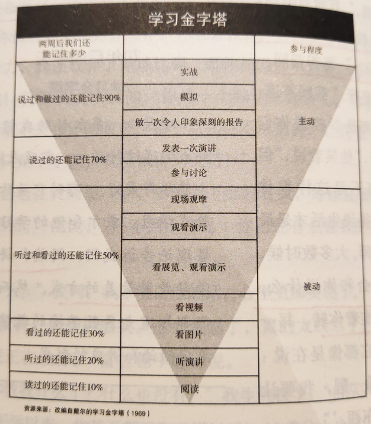
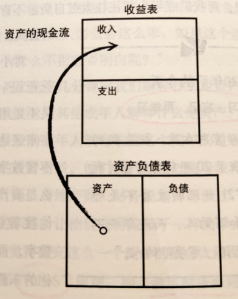
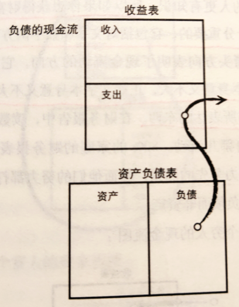
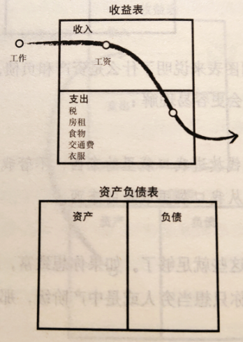
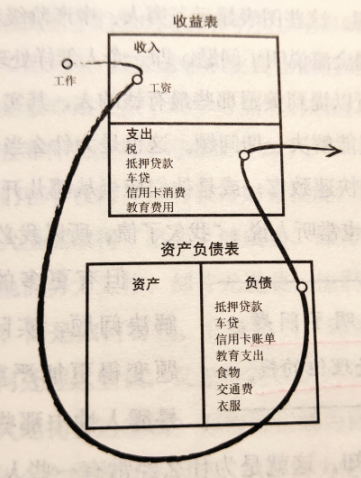
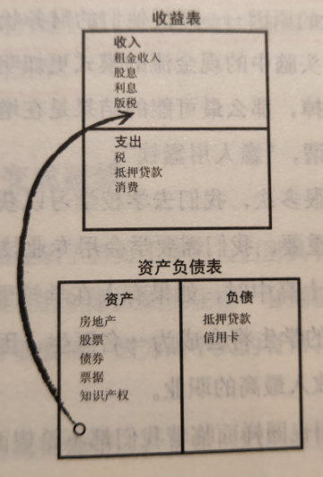

# 【DONE】《富爸爸穷爸爸》罗伯特清崎

穷人和富人的本质区别在于他们看待钱的四维方式不同，体现出来的是两种完全不同的现金流。穷人更关注收入和负债，而富人更关注资产，通过资产产生的现金来支出，以达到财务自由的状态。为了早日达到财务自由状态，我们必须提升资产，减少负债

序言

穷人和富人的区别在于思维方式的不同：穷人喜欢说“我付不起”，富人喜欢说“我怎么才能付得起”

1. 富爸爸、穷爸爸分别对应富人和穷人的观念
2. 富人之所以越来越富，穷人之所以越来越穷，是因为思想观念没有转变。而思想转念来源于家庭
3. 学校教育只专注于学术知识的传授和专业技能的培养，忽视了理财技能的培训
4. 穷爸爸总喜欢说“我付不起”，富爸爸总喜欢说“我怎样才能付得起？”，后者促使自己想办法解决问题，克服精神上的懒惰
5. 房子不是资产，是负债
6. 贫穷与破产的区别：“破产是暂时的，而贫穷是永久的”
7. 了解钱的运作规律并让钱为我工作，而不是为钱工作

富人不为钱工作

1. 你做出决定的速度越快，抓住机会的可能性就越大
2. 学习金字塔：

1. 对大多数人而言，给他们的钱越多，他们欠的债也就越多
2. 普遍的生活模式：没钱的恐惧促使人们努力工作，得到报酬后，贪婪或欲望又让他们想拥有所有用钱能买到的好东西
3. 许多人致富并非出于欲望而是由于恐惧，认为钱能消除贫困带来的恐惧，所以他们积攒了很多钱，却发现恐惧感更加强烈了
4. 我们需要学会避开恐惧和欲望组成的陷阱，不要被他们牵着鼻子走，而要利用好他们。即情感代替了思考，跟随情感，而非自己的思想
5. 工作只是试图用暂时的办法来解决长期的问题

为什么要教授财务知识

富人与穷人的收益表中现金流有巨大区别：富人是资产流向收入，再流向支出；穷人则是收入直接流向支出，或经过负债后再流向支出

1. 你挣了多少钱不重要，重要的是你留下了多少钱
2. 富人获得资产，穷人获得负债，只不过他们以为那些负债是资产（比如房产）
3. 规则：你必须明白资产和负债的区别，并且购买资产
4. 资产是能把钱放进我口袋里的东西
5. 负债是把钱从我口袋里取走的东西
6. 收益表（损益表）与资产负债表的现金流：
7. 资产的现金流：从资产流入到收入

1. 负债的现金流：从负债流入到支出

1. 财务数字本身意义不大，重要是数字和文字所表达的东西
2. 穷人的现金流图：

1. 中产阶级现金流图：

1. 富人现金流图：

1. 所谓的“老鼠赛跑”陷阱是说，当收入增加后，其支出也在增加，与此同时没有资产，更可怕的是负债也在进一步增加
2. 为什么房子是负债？因为房子越大，支出也越大，包括房子高额的保养费用、按揭贷款的压力
3. 为什么富人越来越富？
4. 本身支出少
5. 知道利用资产项产生的收入弥补支出
6. 利用剩余的收入对资产项进行再投资
7. 财富的定义：资产项产生的现金与支出项流出的现金进行比较的结果。如果结果为正，表示拥有财富（哪怕没有存款，但是财务自由）；如果为负，表示尚未达到财务自由，过不了多久，财富会减少为零

关注自己的事业

几种常见的资产：股票、债券、房地产、票据、版税

1. 富人关注的焦点是资产而其他人关注的是收入
2. 麦当劳真正做的是房地产生意，因为房产位置是每个分店获得成功的最重要因素
3. 注意区分职业与事业。职业只是暂时的一份工作，而事业才是自己真正应该关注的东西（比如开公司，或者关注自己的资产项）
4. 真正的资产有如下几类：
5. 股票
6. 债券
7. 房地产
8. 票据
9. 版税（音乐、手稿、专利）
10. 如果你对你喜爱的投资有深刻的理解和了解，并弄懂了其中的游戏规则，你的风险就会降低（不要投资自己不懂的资产）
11. 关于奢侈品的态度：富人是等到最后才买奢侈品，用资产所产生的现金流来购买奢侈品，而穷人则是用他们的血汗钱和收入来购买奢侈品
12. 债券：由授权发行者发行的向投资者借债并承诺到期偿还本金和利息的债务证券

税收的历史和公司的力量

财商的四个维度：会计、投资、市场、法律

1. 税收最初确实是针对富人，但是后来说服民众税收是为了惩罚有钱人（劫富济贫思想），民众同意后税收被写入宪法。结果现在税收力度不断增加，反过来惩罚了民众
2. 公司并不一定是一个真正的实体，可以只是一些装着法律文件的文件夹
3. 富人因为具备丰富的财商和法律知识，当然不会坐以待毙，会想方设法降低自己的税收比率，采用合理的手段进行避税，导致富人的税收低于穷人的税收
4. 财商由4个方面的知识构成：
5. 会计（解读数字的能力）
6. 投资
7. 市场
8. 法律
9. 公司的减税优惠：可以用税前收入支付开支。
10. 雇员：先挣钱，然后减税，剩余的支出
11. 公司：先挣钱，然后支出，剩余的缴税

富人的投资

1. 在现实生活中，人们往往是依靠勇气而不是智慧去取得领先位置的。富人更愿意承担风险，甘愿冒险，这是有别与穷人的地方
2. 如果你清楚自己在做什么，那就不是在赌博；如果你只是把钱放进一笔交易，然后祈祷，才是在赌博
3. 游戏是一种有力的教学方法，它能反映一个人的行为方式，因为它是一个实时的反馈系统

学会不为钱工作

1. 在学校和工作单位，最普遍的观点就是“专业化”。而富爸爸则鼓励我们应该做相反的事情：“许多知识只需要知道一点就够了”。学习整体知识有助于了解系统。也就是说我们要不断的学习新的知识
2. 在找工作时要看能从中学到什么，而不是看能挣到多少钱
3. 选择那些真正做过你想做的事情的人当自己的老师
4. 罗伯特认为最重要的专业技能是销售和营销技能。因为这涉及到沟通能力和表达能力，以及如何处理好人际关系，你处理的越好，你越能应对突发状况，生活也会越轻松

克服困难

1. 认为在通往财务自由的路上遇到的主要障碍：
2. 恐惧
3. 在财务上不成功是因为他们对亏钱所造成的痛苦远远大于致富所带来的乐趣
4. 平衡的投资策略确实相对安全，但是却不够迅速，如果想要快速致富，必须集中于一点突破
5. 不是每个人都适合冒险策略。如果害怕冒险或者超过25岁，就不要轻易改变自己投资的方式
6. 愤世嫉俗
7. 懒惰
8. 变得“贪婪”一点
9. 不良习惯
10. 先支付自己，再支付别人。这样制造压力是为了激发自己的潜能，迫使自己去思考，行动上需要更加主动
11. 自负
12. 唯一没有出现过投资亏损的人，是那些从未做过任何投资的人
13. 人人都怕赔钱，不同之处在于你如何处理恐惧和亏钱

开始行动

1. 精神的力量
2. 想清楚自己究竟想要什么，目标是什么，想过怎样的生活。这份想法就是自驱力
3. 选择的力量
4. 克服恐惧感，选择成为富人，不断学习新的知识
5. 关系的力量
6. 与有钱的人交朋友
7. 不要听贫穷或是胆小的人的话
8. 快速学习的力量
9. 信息快速变化的社会，你学到知识的那个时候就已经过时了
10. 自律的力量
11. 自律是将富人、穷人和中产阶级区分开来的首要因素
12. 开创事业所必备的3中管理技能：
13. 现金流管理
14. 人事管理
15. 个人时间管理
16. 如何首先支付自己?
17. 不要背上数额过大的债务包袱，保持低支出
18. 资金短缺时，让压力去发挥作用，不要轻易动用储蓄或资本
19. 好建议的力量
20. 聘请好质量的专业人士，并给与他们足够的报酬
21. 无私的力量
22. 作为投资者，第一个要问的问题：“我多久才能收回投资？”

结束语

变富有的关键是拥有尽快将劳动性收入转换成被动收入或投资组合收入的能力

1. 在会计领域里，有三种不同的收入：
2. 劳动性收入（工资）
3. 投资组合收入（股票、债券）
4. 被动收入（房产）
5. 变富有的关键是拥有尽快将劳动性收入转换成被动收入或投资组合收入的能力
6. 劳动性收入的税是最重的，而税赋最轻的收入则是被动收入
