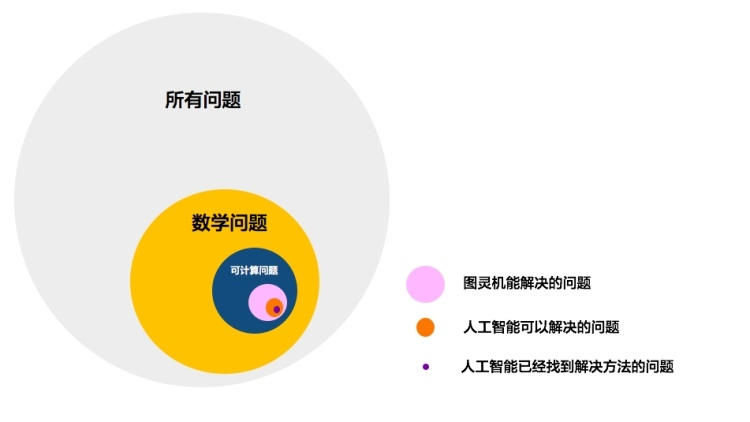
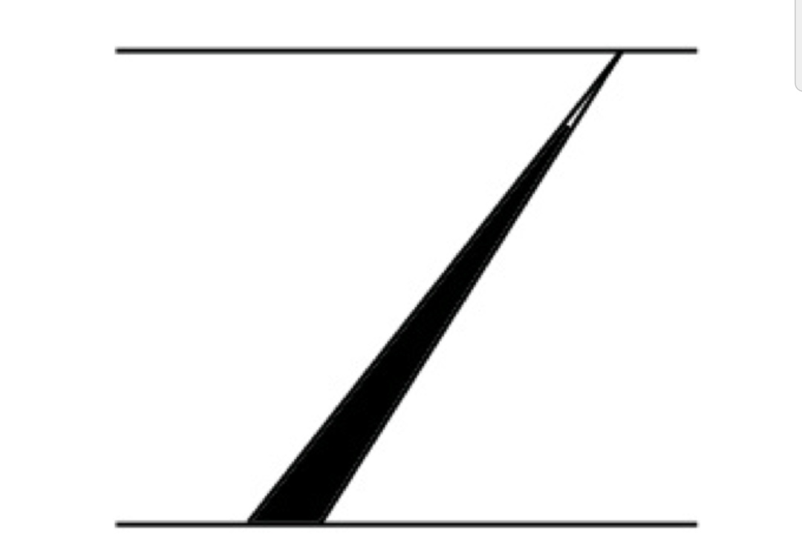
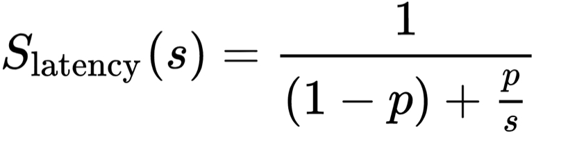
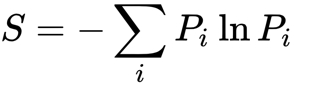

# 【DONE】《硅谷來信第二季》吴军

## 目录

- [职业天花板来自认识的局限性](#职业天花板来自认识的局限性)
- [工程思维：直觉和极限](#工程思维直觉和极限)
- [为什么计算机不是万能的](#为什么计算机不是万能的)
- [把事情做好的三条边](#把事情做好的三条边)
- [人一生要做的五件事](#人一生要做的五件事)
- [超越免费](#超越免费)
- [该不该去国外留学本科？](#该不该去国外留学本科)

# 职业天花板来自认识的局限性

1. 当我们嘲笑那两个酋长只能数到3的时候，计算机可能也在嘲笑我们算不清围棋的步数
2. 摩尔定律让计算机毎十八个月性能翻一番，这大约相当于每五年涨十倍，或者每十年进步一百倍
3. 从小数量总结出来的方法无法应用到更高量级的问题之上
4. 要擅长使用专业人士给出的，验证了无数次的答案，而不是自己凭着生活经验拍脑袋想出一个做法
5. 新闻门户网站的每况愈下和今日头条的兴起，实际上就是两种思维方式的对决。前者是依靠栏目分类，而后者依靠个性化筛选（大数字世界）

# 工程思维：直觉和极限

1. 任何产品的性能都有一个物理上无法突破的极限，这个极限并不需要等到工程上接近它的那一天到来时才知道，而是早就可以通过已有的理论直接给出
2. 今天所有的计算机，包括全世界正在设计的新的计算机，从解决问题的能力来讲，都没有超出图灵机的范畴[^1]。图灵其实为今天的计算机和很长时间以后的未来计算机所能解决的问题划了一条不可超越的边界
3. 人工智能的边界：
   1. 世界上有很多问题，其中只有一小部分是数学问题；
   2. 在数学问题中，只有一小部分是有解的；
   3. 在有解的问题中，只有一部分是理想状态的图灵机可以解决的；
   4. 在后一类的问题中，又只有一部分是今天实际的计算机可以解决的；
   5. 而人工智能可以解决的问题，又只是计算机可以解决问题的一部分。

# 为什么计算机不是万能的

1. 图灵同时猜测人的意识来自于测不准原理，这是宇宙本身的规律。图灵从此得出结论，计算是确定的，而意识可以是不定的，两者不可能划等号。这也就是说计算机不能具有意识，这是任何计算的边界
2. 两个衡量搜索质量好坏的客观标准：查全率（Recall）和查准率（Precision）
3. Google一词源于一个非常大的数字Googol，即10的100次方
4. 苹果在设计一款新产品时，会先了解当下技术的边界在哪里[^2]，哪些技术已经可以完全实用了，哪些还要等几年，对于需要等几年的，它会几年后再考虑
5. 苹果不会为了一个世界还没有解决的难题，自己投入巨大的气力从基础研究做起。这种做法如同为了吃回锅肉赶紧养猪
6. 只要把互联网的内容送到千家万户就行了，至于互联网的内容是谁的并不重要。由此诞生出检索服务

# 把事情做好的三条边

1. 我们所有的工作，都应该建立在这条线的基础上，而不是从它的下面开始做起，这一点很重要。为什么民间发明家花了一辈子时间搞出来的发明，除了让人家笑话，没有什么实际价值呢？因为他们的起点远远低于这个时代的基线。

上帝喜欢笨人

1. 做生意时，不论这笔生意对方挣到多少钱，我们只挣自己那一份，不要因为对方挣多了就试图多分一点。这样，生意就能持久
2. 一件事一件事地做，不要并行处理，或许是效率最高的工作方式。做事情，不在于开了多少个头，而在于结了多少次尾[^3]
3. 人如果存在先天不足，首先要承认它们，这是我们的边界，然后要提前准备好应对的方式

# 人一生要做的五件事

1. 第一件：恋爱、结婚、生子
   1. 中国人喜欢把孩子当作自己的私有财产，而西方人则会将他们视为上帝所赐给父母的礼物（享受孩子成长的过程，而不是要他们成为什么样的人）
2. 第二件：尝试一次做自己喜欢的事情，至少有一点像样的兴趣爱好
3. 第三件：回馈
4. 第四件：有一个信仰
   1. 未必是宗教信仰，什么信仰其实都可以，但是必须有。因为当我们失去了方向和动力，不知所措的时候，信仰会让我们知道该怎么做事情
5. 第五件：留下遗产
6. 这个世界如果没有我，是否会完全一样？如果答案是肯定的，说明你没有留下什么遗产

Google的个人英雄主义

1. 并不同意“三个臭皮匠能凑成一个诸葛亮”的说法。再多的臭皮匠也起不了诸葛亮的作用[^4]
2. Google 鼓励每一个人成为英雄，它希望每一个人都做出对公司有很大正面影响的贡献
3. 人只有在被人遗忘时才是真正的死亡。然后他笑着离开了

# 超越免费

1. 人对于将要失去的钱财特别在意，对白得来的东西并不珍惜
2. 免费之所以能够成功，是因为过去一些东西有稀缺性，当那些东西不再有稀缺性时，再免费就没有意义了
3. 超越免费的第一条是制造一种稀缺性，而这需要产品、服务本身具有一种难以复制的特性（饥饿营销、猫爪杯、限量销售）
4. 超越免费的第二条是时效性。
5. 超越免费的第三条是个性化。每一个人只有成为了有趣的人，有大家所喜欢的个性的人，大家才能喜欢你
6. 超越免费的第四个绝招是提供可用性（易理解性）的产品和服务。能够把事情解释清楚不仅是一个有用的本领，而且是一个很赚钱的生意
7. 超越免费的第五个绝招是提供可靠而易用的服务
8. 超越免费的第六个绝招是具有数据黏性的服务（配套数据库）
9. 阅读免费低质量的内容，远没有付费高质量的内容有意义。

他人的关注可能不值钱

1. ARPU值，也就是每用户平均收入（Average Revenue Per User）。ARPU注重的是一个时间段内运营商从每个用户所得到的利润。ARPU值高，则企业的目前利润值较高，发展前景好，具有投资可行性
2. 一个好的师父，进步应该比徒弟快，而不是比徒弟慢（和公司招聘比现阶段能力更强的人进来一样）
3. 微软的成功很大程度上得益于盖茨对于微机发展方向的把握，并引导整个行业往有利于自己的方向发展。而在互联网时代，佩奇和布林对于互联网的发展方向把握得比其他公司的领袖更准确
4. 在生存法则中，有两条线。忍是一条线，能是另一条线。这两条线之间的宽度就是生存的空间，忍人所不忍，能人所不能，生存空间就越宽，这种人的稀缺性就越高。

美国VS中国，哪里生活更好

1. 美国中等以上的家庭，家庭观念比中国人要强，中国人强的是家族观念（父母、祖父），不是家庭观念（夫妻、子女）
2. 美国人的家庭观念，主要体现在三个方面：
   1. 全家人要一起活动
   2. 家比工作重要
   3. 父母要参加孩子在学校的演出、体育比赛活动
3. 美国人做事总是要事先计划好，按部就班地做，很多计划一做就是一年，中间要想插进去事情很难
4. 在中国文化中，大部分父母认为孩子是自己的财产，而在美国的文化中，他们认同孩子是独立的个体，有自己的意识[^5]
5. 在亚历山大图书馆，欧几里得完成了人类历史上最有影响力的科学巨著《几何原本》，托勒密完成了影响深远的《地理学》。在长达几个世纪的时间里，亚历山大都是整个西方世界的学术中心

爱情生理原理

1. 在爱情中的人其实没有判断力。无论是一见钟情，还是日久生情，那种来电的感觉都是苯基乙胺的杰作[^6]
2. 苯基乙胺能让人感到极度兴奋，这会让人精力充沛、信心满满，因此恋爱时说出海誓山盟的话并不奇怪，因为陷入情网的人真的觉得自己有能力为对方做一切，这倒不是有意欺骗
3. 人在恋爱中还会分泌另一种物质，叫做去甲肾上腺素，它不仅让人血压升高，而且会产生性冲动
4. 无论是苯基乙胺，还是去甲肾上腺素，平均只能维持不到三年的时间

聪明人和笨人

1. 人成熟与否，就看吃自助餐是否能做到不比平时吃得多
2. 好的工程师都懂得在什么条件下，给出相对来讲最好的解决方案。而没有做过工程的人，才会在对错上不断地纠结
3. 高盛选拔人才三原则：
   1. 基本的专业知识和与人沟通的基本技巧；
   2. 用什么样的思路解决问题，比知道答案更重要；
   3. 知道自己能力的边界，如果遇到超出自己能力的问题，懂得求助于别人[^7]

发明背后的逻辑——飞行

1. 飞机的发明最关键的技术分别是：
   1. 升力（被凯利解决了）
   2. 动力（被发明内燃机的奥托解决的，也可以说是被莱特兄弟解决的，因为是他们二人将内燃机装上飞机的）
   3. 控制。（莱特兄弟解决：从控制风筝的方法中得到启发，发明了飞机控制机翼的操作杆。思维方式的一个飞跃，标志着人类在飞行控制问题上的思维摆脱了原先的模仿，而进入到从原理出发进行发明的阶段）
2. 发明并非是简单的从0到1的过程，而是一个非常漫长的过程，开始的时候是量的积累，最后一个发明人完成质变

为什么算盘是计算机？

1. 算盘是靠一套珠算口诀来控制算盘操作，这种口诀相当于今天控制计算机运行的指令
2. 真正会打算盘的人，都不是靠心算的，而只是根据背熟了的珠算口诀拨动算盘珠子而已，人所提供的不过是机械动能，而非运算能力。 计算则是算盘在口诀指令的控制下完成的机械运动，这就和图灵机所描述的机械运动相一致了

计算机从简单到复杂

1. 摩尔定律能够成立的重要原因。 要理解IT这个产业，就要理解模块化
2. 当世界上任何东西越做越复杂的时候，就是开始从复杂往简单转变的时候了，即搞清楚问题的本质，然后用简单的办法把它解决。 图灵和香农就是这样的人

事半功倍VS事倍功半

1. 大的目标要分解成简单的，一个个解决， 一个复杂的问题如果能拆成两个等价的简单的问题，成功的可能性就大很多，就可以事半功倍。但是，这并不等于做两件收效小的事情，就等于一件大事，这就是事倍功半。

我们真的清楚为什么上大学吗？

1. 底层人士进入中产阶级的捷径就是在大学里学好专业技能，而中产阶级想进入精英阶层，除了做到这一点，还要进行博雅教育
2. 上大学很重要的目的是提高自己的格局。 格局不大，人就走不远
3. 提高自己格局和见识最好的方法就是和比自己强的人在一起生活[^8]

在大学，你需要补充自己的哪五种训练？

1. Google、微软、麦肯锡、高盛、摩根士丹利，在校招新员工时，很少关心候选人所学的具体专业，但是非常在意他是否将这个专业学好了，同时是否是从一个竞争很激烈的大学里走出来的
2. 第一，看透钱
   1. 上哈佛的目的，是成为精英，不是学习赚钱的技能。作为精英，有钱了是要反哺社会的
3. 第二， 先学会服从、合作；学会当助手、当领导
4. 第三，认清边界，学会在边界里做事情
5. 第四，把自己培养成健全的人， 要谈恋爱，要建立自己的朋友圈，和师长成为朋友
6. 第五，树立信仰。有了信仰，不仅做事情能理直气壮，百折不挠，就是和别人讲道理也能底气十足

高等教育的目的

1. 服务于社会，而不是为了获取名誉或者赚大钱。
2. 获得良知，并且在关键时刻表达出自己的观点，是大学教育的精髓所在
3. 如何“考好数学”：
   1. 阅读理解（Reading comprehension）。理解题意
   2. 建立比较完整的数学知识体系
   3. 善用逻辑
4. 对于一些对数学兴趣大，能力强的人，可以在中学学习难度深一些的数学课。对于这方面能力稍弱的人，可以少学一点，学浅显一点的数学课
5. 为什么要学习历史？是为了清楚我们自己所处的位置，并且看清楚未来的方向，以便在一个大规模的时间和空间内看待问题

为什么学习科学

1. 首先，掌握一种看待世界和解决问题的方法
2. 其次，帮助我们了解人类知识的边界
3. 第三，帮助我们获得可叠加的进步
4. 第四，成为一个讲道理的人。讲道理需要双方有共同的认识基础和彼此认可的讨论问题的方式，而科学本身就是帮助我们建立这样的认知基础和方法。 科学工作的过程本身就是一个讲道理的过程。

幸福的含义

1. 具有代表性的三种不同幸福人生：
   1. 以哥斯达黎加人为代表的“愉快式”幸福
   2. 以丹麦人为代表的“目的式”幸福
   3. 以新加坡人为代表的“自豪式”幸福
2. 幸福的四个特点：
   1. 人要和当地的价值观相匹配。如果把新加坡的寿司店老板放到哥斯达黎加或者丹麦去，他一定不幸福
   2. 上述三个国家对每个人都有基本保障
   3. 上述三个国家的国民生活很省心，以及相互信任
   4. 社会生活丰富

旅行浅谈

1. 知识的获取归纳为三种：亲身感知（旅行）、他人告知（读书）和逻辑推知（较少）
2. 旅行的第一个意义是增长见识，对于他人告知的事情，亲身验证一下，才能记住，变成自己身体中的一部分

什么是风险投资？

1. 一种特殊的私募基金。 所谓私募，就是说不公开针对大众募集资金，当然在管理上，也采用封闭式管理，既不对外公布业绩和投资回报的细节，也不能在市场上随意交易
2. 所谓风险投资的特殊性是指，真正意义上的风险投资，只投资给未上市的创业公司，甚至是还没有成为公司的创业项目，通过帮助它们成功获得很高的回报
3. 风险投资无需抵押，也不需要偿还
4. 无论是对投资人，还是对创业者来讲，风险投资的资金，是让创业者在一定时期内，能够专心致志做自己想做的事情，不必为收入和成本发愁，而不是用来烧钱购买市场
5. 风险投资的管理者，都会成为了技术专家，而不是财务专家， 他们擅长发现有潜力的创业者和项目，而不需要专注于资本运作
6. 从结果上讲，极少数的风险投资基金拿走了整个行业绝大部分利润， 这一点和二级市场的股票投资完全不同

# 该不该去国外留学本科？

有四种人我觉得可以出去：

1. 第一类就是特牛的人
2. 第二类人就是我们家有钱，我孩子将来也不知道要干什么，就是要接受一些精英教育、素质教育
3. 第三类大学在中国的家庭中占比非常多，假如在中国只能上一个二本，或者一本靠后的大学，孩子数理化成绩还不错，不如申请一个美国学校。一般只要运气好，都能申请到一个美国州立大学
4. 第四类就是我将来全家要到国外去发展

有四种人我觉得不适合出去。哪四种呢？

1. 第一种：孩子在国内清华、北大是能上的，但到美国哈佛百分百是上不了的，最后也就上一个州立大学中排个十来名的，这种情况下，美国就别考虑了
2. 第二种：孩子缺乏自我管理的能力，如果出去全打游戏，或者在那买了一个跑车，天天不上课
3. 第三种：有些家境稍微差一点的，孩子出去变成了家庭非常大的负担，这种情况也就算了
4. 第四种：特别怕出国的孩子，我有一个朋友的孩子就属于这种，要送他出去，他提前一个月就睡不着觉了。这类孩子也不适合送出国留学

美国哪类大学适合留学？

1. 第一类：顶级私立名校，在美国大概有20所左右，比如常青藤的八所大学，再加上MIT和斯坦福，还有大概差不多十所左右的私立名校，这是第一档。它的要求是什么呢？
2. 首先，学习成绩不能差。
3. 第二，你要有一两项特长，哪些方面的特长都行。关键是在做特长训练的时候，证明这个孩子能够克服困难，能够有一个很明确的目标，能够表现出他的勇气，能够表现出合作精神。
4. 第二类：加州大学、伯克利、伊利诺斯大学、密歇根大学等等。对中国人非常有利，一个办法就是看成绩，只不过它不是高考成绩，而是你的平均成绩。
5. 第三类就是我刚才讲的，在中国反正孩子只能上一个二本靠前或者一本靠后的学校，美国有比较多的州立大学还蛮好，比如说马里兰大学、马萨诸塞州立大学。美国前20的大学各有千秋，前50的大学有些方也不差，所以这是一个蛮好的选择。

美国大学有哪些不同特点？

1. 第一类：研究型大学。美国大学专门有一大类是研究型大学，一些比较大型的学校研究水平比较高。你如果说我将来想成为这个领域做得最好的人，你最好到美国这些研究型大学读书，而且最好读一个博士。举个例子，麻省理工学院是一个典型的研究型大学，很多改变世界的发明都是从这里出来的。（美国研究经费最大的大学：约翰·霍普金斯大学，每年有20亿的研究经费。世界最大的太空望远镜是那里造的，还有把一个航天器降落到几亿公里以外的小行星上，这种工作都是在那里完成的，以及最早对世界暗物质和暗能量理论的推测结果也是在那边做出来的）
2. 第二类：培养领袖型。比如说哈佛就是典型的这种学校。在常青藤中出名人最多的不是耶鲁，也不是普林斯顿，而是哥伦比亚，这是典型的培养领袖的大学。他们培养人的方式不一样，你在研究型大学得是一个学霸，在这些地方，你如果花太多的工夫读课程类的内容反而不行，你需要做好多好多课外活动，所以每个人根据自己的特点来选学校。没有最好的学校，只有最适合你的学校。
3. 第三类是强调非常基本的素质教育。除了我刚才讲的普林斯顿，还有美国很传统的常青藤大学、布朗大学等等。
4. 这三类大学不一定谁比谁更好，但是都有自己的特点。没有最好的学校，只有最适合的学校。

什么是好的计算机算法？

在比较算法的快慢时，需要考虑数据量特别特别大，大到近乎无穷大时的情况[^9]。

1. 决定算法快慢的因素虽然可能很多，但是所有的因素都可以被分为两类。第一类是不随数据量变化的因素，第二类是随着数量变化的。
2. 如果两种算法在量级上相当，在计算机科学里，就认为它们是一样好的。
3. 计算机算法和组织的管理，乃至社会的管理，在道理上有相通性，想要提高效率就是要少做事情。

计算机科学和工程有什么差别？

1. 方向和道路之分别。科学常常指出正确的方向，而工程则是沿着科学指出的方向建设道路。
2. 科学和工程需要关注不同的事情，工作的环境也不同。科学家聚焦于数量级上的优化和改进，具体到工程上，节省几倍的时间，甚至20%的时间是很有意义的。
3. 科学家和工程师跟钱的距离不同。要想当科学家，就要离短期的利益远一点，这样才能把目光放远。

事物的认知

1. 认识是不断进步的，对问题的理解也是如此，因此最初理解的本质后来看起来可能会很肤浅，但是随着见识的提升，我们对一个问题的理解会越来越透彻。
2. 事物的本质永远是简单明了的，如果搞出很复杂的东西，通常是走偏了。

如何索引

1. 为了方便地查找信息，一个简单有效的方法就是根据信息的内容，建立索引。善于建索引，不仅是Google搜索引擎查找信息非常快的根本原因，也是保证Google的产品在信息爆炸时代能体现出高质量的原因

出奇制胜的思考

1. 为人处世，成功的第一要素，就是走正道，不要老想着出奇制胜。我们很多人，总在想抄个近道，赚别人一点便宜，这样不是走得更快么？其实这种想法是不断地兜圈子，走弯路。
2. 其实差异化本身只是手段，而不是目的，目的是把事情做得更好。

什么是好产品

1. 牙刷原则：一个好的产品要有牙刷的功能。让用户每天都必须用上几分钟，就如同刷牙一样，久而久之用户就养成了使用该品牌产品的习惯。
2. 爆款效应：一个好的产品或者品牌，每过一段时间就要给大家带来一个惊喜，提醒大家它的存在。

公司的生老病死

1. 不介意公司的死亡，不会刻意去拯救一个衰老的公司，认同公司最终死掉这件事是常态，在这个前提下，再去考虑如何传承公司的基因和文化，而不是试图维持一个不死的公司
2. 为了避免重复IBM和微软失败的老路，佩奇才把已经成熟的果实交给他人看管，自己负责起最需要支持，最需要资源的新业务。

通才教育与专才教育

1. 通才教育和专才教育需要看一个国家处于什么样的发展阶段，一个受教育者处在什么样的社会阶层。教育显然应该先解决温饱，再追求高远。至于每一个人应该做什么选择，则看他上大学的目的是什么，是掌握一技之长，还是追求博雅教育。

比贫穷更可怕的是什么？

1. 比贫穷更可怕的是缺乏见识、缺乏爱（分享）、缺乏规矩。
2. 没有见识，视野就被局限了。 你可能有这样的体会：和某些人讲道理永远讲不通，这并非是那些人故意要和你作对，而是他们实在没有见识，大家的认知水平根本不在一个平面上。
3. 其次，缺乏爱。一个善于分享的人，会懂得把钱或者爱花在别人身上，投入到社会再生产中去，获得更高的回报。
4. 最后，缺乏规矩，首先是自己倒霉。在高速公路上竞走的人，早晚有一天会成为车下鬼。缺乏规矩的结果，轻则没有人愿意帮他们，重则大家会和他们作对

高德纳与图灵

1. 高德纳为了写书，苦于没有好的编辑排版软件，干脆就自己写了一个排版软件，这就是著名的Tex（后来被人做成了更方便使用的LaTex）。Tex是一场出版界的革命，直到现在仍是全球学术排版的不二规范。Tex被称为是全世界bug最少的软件。
2. 图灵不直接研究计算机，他只是研究可计算性这个数学问题，因此他更应该被看成是一位数学家。在机器智能方面，他最大的贡献就是提出了一种客观判定计算机是否有智能的标准，即所谓的图灵测试。

申请哈佛本科有什么秘诀？

1. 高中生的成绩当然不能差
2. 然后要有一项做到极致的专长，比如获得小提琴比赛的第一名。为什么要求学生做到极致？他说，做到极致非常困难，在这个过程中要克服很多困难，如果一个年轻人能够最终走过来，达到极致，他就练就了一身克服困难的本领

计算机数据结构

1. 第一种数据结构是线性表。这相当于几何图形中的直线，它也是最基本的数据结构。
2. 数组。缺陷：插入元素非常困难
3. 链表。解决数组插入元素困难的问题。新问题：索引必须从头开始
4. 专业人士和业余人士做东西的一个重要差别在于，前者掌握了如何使用基本图形、结构和组成部分来构建复杂设计和产品的方法，后者根据自己脑子里的构思和直觉，直接构建最终的产品和设计。
5. 第二种数据结构是二叉树（解决判断真假、比较大小、排序、挑选最大值、快速查找到某一个数值等）。

货币的起源和本质

1. 货币的两个特性：自身的价值和记账工具，而能够同时满足这个特性在早期只有大宗商品了。但是大宗商品难以运输，不便于开展商业，于是，就需要使用有价值同时又便于携带的物品。
2. 纸币的发行需要金属货币（即所谓的硬通货）或者其他大宗商品背书，或者由政府背书，否则会一钱不值。既然没有了黄金背书，那么美元只能由美国政府背书了。美元之所以能在美国国内流通而不至于有太高的通货膨胀，因为从理论上讲美国政府有征税的能力，保障美元的稳定。

技术诞生公司

1. 一项改变世界的技术会导致一批公司诞生，而领头羊则会利用这样的时机成为一个巨无霸型的跨国企业，当初AT\&T、GE和IBM都是这样发展起来的。

优点、缺点和特点

1. 世界上很多东西（无论任何事），无所谓优点和缺点，只有特点。很多看似是优点的地方，其实在另一个条件下就是缺点

公平的教育

1. 一定不能搞完全公平的高等教育。因为最好的教育资源永远是紧缺的。因此，大家对此需要有清醒的认识，不要梦想将来最好的教育资源能够普遍化，这是不现实的。
2. 过分讲究公平性虽然可以培养出大量中上等的人才，但是很难培养出精英，也很难留住精英。
3. 在美国，从政这件事对提高整个族裔的地位非常重要，但是要想在政界混出头，需要20年甚至更长时间的努力，在这20年间，没有什么经济利益可以获得，完全是在为同胞们做贡献，这种事情，过分精明但缺乏见识的亚裔是不愿意做的。
4. 美国名牌大学不愿意招收亚裔的另一个原因是亚裔总体来讲不愿意回馈母校，不愿意捐钱。

计算机死机的几种原因

1. 调度不合理，会有一大堆程序堆在队列中，在用户看来计算机似乎不动了，感觉上就像死机了一样。这是我们见到的死机的第一个原因。
2. 形成死循环，计算机就真的“死翘翘”了，除了重启没有更好的解决方法。
3. 再有第三种情况，各种程序进入队列或者堆栈，在离开时次序搞乱了，也会出现死机。

什么是递归

1. 递归的本质有两条：其一是自顶而下，其二是自己不断重复。
2. 人的思维方式是自底向上的递推。

顶层设计VS底层设计

1. 做一件事应该先从最顶层入手，还是先从最底层入手？坦率地讲，这个问题没有标准答案。

机器学习

1. 机器学习，实际上是寻找一种数学模型，让这种模型符合它所要描述的对象。比如说我们要寻找一种描述天体运动的模型，让它符合太阳系行星的运动情况。
2. 如果使用到的数据是杂乱无章的，机器想从这些数据中学习并得到规律，就被称为“无监督的学习”，也就是说没有人的监督。
3. 反过来，如果由人来标识出每一颗星星的名称，再让计算机学习，那就是有监督的学习，也就是说机器学习是在人的监督下进行的。
4. Alpha Go就采用了一个新的学习方法，就是所谓的“强化学习”( Reinforcement Learning)。它的方法其实也很简单，就是计算机在没有人为给定方向的条件下，自己试着走一个方向，然后由人设定的一些原则告诉它好不好，也就是说需要有一个判断价值的反馈信号送还给机器学习系统。

阿司匹林（镇痛药）

1. 1897年德国著名的拜耳公司的霍夫曼经过多年研究，把合成出来的含有水杨酸有效成分的水杨苷经过一些小的修改之后，得到一种对胃刺激相对较小的镇痛药，起名为阿司匹林（Asprin）。“阿司匹林”这个词来自于提炼水杨苷的植物旋果蚊草子（拉丁文名称：Spiraea ulmaria）。
2. 医药行业新药研制的两个原则。
   1. 第一个是无害原则。（一期试验）
   2. 第二个是有效性原则。（二期、三期试验）它们也是今天美国食品药品监督管理局（FDA）批准新药的原则。
3. 所谓一期试验，就是看看吃了会不会死人，当然它的正式说法是药品的毒性试验或者药品的副作用试验。
4. 当第一期试验通过之后，药厂就要进行FDA第二期和第三期临床试验了，它们的目的是测试药效的。一种药是否有效，需要通过双盲测试。在双盲测试中，病人被随机编入实验组和参照组，前者吃药，后者吃安慰剂。
5. 至于第二期和第三期的区别，主要在于实验的范围的不同。比如一种药在上海华山医院使用后证明有效，就通过了二期测试。接下来，在全国范围内证明有效，就是通过了第三期测试，这款药就可以上市了。
6. 在美国，药品和保健品是完全分开的。保健品只要吃了不死人，没有明显副作用，标明成分即可出售。因此，保健品，比如人参，其实不需要FDA批准出售。很多保健品说通过了FDA验证，其实只是验证了它吃了无害，FDA从来不验证保健品的疗效，这点和药品不同。

众利勿为，众争勿往

1. 如果一件事大家都觉得有好处，那就不要做了；如果一个东西，大家都在抢，就不要去凑热闹了。其一，我们的见识不够，可能有些东西没有看懂，看透，盲目乐观。其二，投资的最好时机已经过去了。
2. 喜欢一个人，但是还能看到他的缺点；讨厌一个人，还能看到他的好处，这种人很少。

分享利益、独立决定

1. 利益要分享，但是很多时候作决策自己一个人作就好了，未必都需要民主集中，征求所有人的意见。

台积电

1. 台积电是全世界最大的独立的半导体制造公司，今天像英特尔、高通这样的公司更多地集中在半导体的设计上，而台积电则负责制造。它制造了全球60%的芯片，第二和第三名加起来还不到它的1/3。

美国中小学生书单

1. 第一类、开阔眼界，了解世界。
   1. DK出版社出的《世界奇观》（DK Eyewitness Books: Wonders of the World）；
   2. 国家地理出版的《世界真奇妙》（National Geographic Kids Weird But True!）；
   3. 《吉尼斯世界纪录》，我的孩子就喜欢从学乐的书单上订这本书。
2. 第二类、了解历史、了解美国。
   1. 给小学生读的《什么是独立宣言》；
   2. 介绍印第安人的《美洲原住民英雄》（Native American Heroes）二种是关于历史人物，比如林肯等人的传记。但这些传记的主角不仅包括伟人们，也包括各行各业的杰出人物，比如写运动员的书有：《冠军：拳王阿里的故事》（Champion: The Story of Muhammad Ali）；讲13岁登上珠峰男孩的故事书《视线之外没有高峰》（No Summit out of Sight）；关于科学家的书有居里夫人的，介绍美国杰出人物的有关于第一个飞越太平洋的女飞行家阿梅莉亚∙埃尔哈特（Amelia Earhart）的小传。
3. 第三类图书是百科类，包括很多科普读物。比如：
   1. 《化学小实验》（Icky Sticky Chemistry）；
   2. 《海底世界》（Undersea）；
   3. DK和史密森尼博物馆出版的《科学》（Science）；
   4. 介绍地质的《宝石的世界》（Gemstones of the World）。
4. 第四类很有意思，是宣传女权主义的图书。这类书的数量还特别多，比如：
   1. 《克拉拉和戴维》（Clara and Davie），介绍创立了美国红十字会的克拉拉∙巴尔顿（Barton）。
   2. 《伊丽莎白引路》（Elizabeth Leads the Way），介绍争取妇女投票权的伊丽莎白∙斯坦顿（Elizabeth Cady Stanton）。
   3. 《舞动的生命》（Life in Motion），介绍美国史上第一个非裔的女芭蕾舞领舞科佩兰（Misty Copeland）。
   4. 当然还有介绍希拉里小时候的书《美国女孩》。
5. 第五类是讲述冒险和探险的书籍，
   1. 国家地理的《终极探险者指南》（Ultimate Explorer Guide）；
   2. 《谁是斯坦·李》，讲述蜘蛛侠、绿巨人、钢铁侠、雷神和X战警的创造者凡尔纳的各种书；
   3. 让孩子们在惊险刺激的冒险中体验生活的《篷车少年大冒险》（The Boxcar Children Great Adventure Series）；
   4. 当然，也还有《哈利·波特》这样的书。

走出越穷越忙，越忙越穷的怪圈

这样的人有几种特点：

1. 干不该干的事情，特别是亲朋好友托付的事情。
2. 喜欢并行处理任务。
3. 未老先衰的心态。
4. 相信自己能找到别人找不到的捷径，不能沉住气提升自己。

337调查

1. 它得名于1930年《美国关税法》第337条款。根据该条款，美国的国际贸易委员会（ITC）有权调查有关专利和注册商标侵权的申诉。凡是被337调查认定存在侵权行为的外国出口产品，将直接禁止进口和在美国市场的销售。

计算机的作用

1. 对于计算机的作用，CS的人和EE的人还有不同看法，前者认为他们的工作本身就是核心，一切都要围绕着计算机进行，后者认为计算机仅仅是一个工具，永远是给别人服务的。

成功并不难，而在于少犯错误

犯了哪些错误？

1. 首先，他们以两个静态的观点看待未来。
2. 第一个是以今天的收入考虑未来的消费。
3. 二个静态是以今天的能力应对未来的挑战。
4. 第二个错误是积攒资源，而不是利用资源。攒钱是成为不了富翁的，只有赚钱才能成为富翁，这是一个再普通不过的道理。
5. 第三个容易犯的错误是太在意一时的得失。我发现很多人辞职换工作，并非因为新的工作更好，仅仅是因为在原单位没有被提拔受了点委屈而已。
6. 第四，虽然马拉松可以分解成400多个100米的比赛，但是每一个100米并不是独立的，因此，跑当前这个100米的策略不是让它的成绩最好，而是为了让全程的成绩最好。
7. 永远不要指望有一个所谓纯粹的、干净的环境，让我们能不受干扰地做事。人本事的大小不在于理想状态下的发挥，而在于有各种干扰时依然能发挥。

高等教育切不可完全照搬

1. 真正世界一流的高等教育一定具有本国特色，美国不可能照搬英国和德国的教育体系，因为它不具备欧洲的社会条件。同样，今天中国的高等教育也不可能照搬美国的经验，如果以美国的教育成果批评中国的不足，其实意义不大。
2. 人要想后来居上，就要少犯前人犯过的错误。
3. 初等教育是为了满足大家立足于社会的需要，职业教育是为了谋生需要，而高等教育是为了两个目的，一个是发现知识，创造知识。另一个是获得智慧，以便今后作出各种正确的选择。

孩子学习外国语

1. 如果想成为完全双语的人，四岁之前尤其关键，那个时候的孩子很容易掌握各种语言，过了那个时期，学习新的语言就是学习外语了。

无向图与有向图

1. 无向图：没有方向的图，即双向；有向图：有方向的图，即单向
2. 遍历算法总的来讲有两种。
   1. 第一种叫做深度优先算法（在计算机领域大家称它为DFS，Depth First Search的首字母缩写）。
   2. 第二种方法是先从北京出发，先把所有直接相连的城市走遍，这种走法因为是尽可能广地访问各个城市，被称为广度优先算法（在计算机领域大家称它为BFS，Breadth First Search的首字母缩写），它可以保证访问到全部的城市。

人工智能的空气动力学

1. 正如我们无法依靠模拟鸟的飞行让飞机上天，而要通过掌握空气动力学的原理设计出能够有效飞行的飞机一样，人工智能也不是简单模仿人的思维和动作，而要找到适合计算机获取智能的“空气动力学”。

维特比算法

1. 把一种指数复杂度的问题，变成了线性的复杂度。这可能是所有的计算机算法中复杂度下降最大的改进。今天，除了语音识别、机器翻译、拼音转汉字、汉语的分词等用到了维特比算法，各种语言的拼写纠错，基因的测序，通信的解码都要用到它。
2. 维特比算法可以理解为一种移动窗口的判断方法，只对当前点要处理的任务进行判断计算，而不是全域的计算

Facebook与Google

1. Facebook和Google之争，从本质上反映出两种整合信息方式的区别。
2. Google是一家信息处理公司，擅长于用算法处理信息，这让它在搜索以及后来人工智能领域执牛耳。
3. Facebook是一家通信公司，善于理解人们沟通中的需求，因此它实际上是靠人的关系整理信息。

什么是好大学

1. 是让它的毕业生在今后不需要提大学的名字，就足以证明自己，甚至这所大学，能够从毕业生的身上沾光。这说明它真的把人培养好了，如果是反过来，一所大学的毕业生在人前总需要提母校的名字，才能显得自己有水平，那么这四年的大学生涯算是耽误了。

家庭教育

1. 教育是一种投资，既然是投资，通常需要很长时间才能看到效果。
2. 看一个人是否有出息，看看他是如何花闲钱，如何使用闲暇时间就知道了。

学习加速器

1. 如果我们没有理论水平，不能够从具体的事例中抽象出理论，那么我们的学习就是线性的积累，能够从具体的事例中找到本质和共性，然后通过解决一个理论问题达到解决一连串实际问题的目的。

为什么美国少有亚裔出生的领袖？

1. 亚裔并非天生缺乏想象力，也不保守，而是缺乏远见，并且对当下利益特别是钱，有超出其他族裔的嗜好。即便是在学术界，亚裔教授对钱的喜好也远远超出其他族裔的学者。

相对成绩

1. 有时候你不需要做绝对胜利者，在一个群体内保持领先就可以打败很多人了

有效像素

1. 按照每平方厘米500万像素的极限来算（光学不干涉的极限），全幅相机CMOS的有效像素大约只能做到4500万左右，这就是为什么尼康和佳能今天分辨率最高的相机的像素分别在4600万和5000万的原因。如果你倒推手机的分辨率，大部分手机有效的像素不会超过一百万。即使考虑到手机拍照时可以连拍，然后通过后处理提高分辨率，那么能分辨清楚的像素大约也就是200万左右。
2. 和单反对应的是无反光镜的相机。它克服了单反相机的三个缺陷，体积和重量大，反光镜抬起时有震动和声响，结构复杂、成本高。无反光镜的相机因为去掉了反光镜，让光线直接打到CMOS上，因此可以做得比较薄，但是由于没有反光镜，因此在目镜处看到的是电子取景器合成的图像，而非光学成像。

如何将知识讲的通俗易懂

1. 一个合格的专业人士，不仅要有自己领域的知识，还要懂得如何将自己领域的知识翻译成所有人都听得懂的语言。可以利用一些原则来将复杂概念翻译成容易被人理解的概念:
2. 简单规则
3. 打合乎逻辑的比方，作合理的延伸
4. 强迫对方忽略细节
5. 忽略一些误差

几次科技时代革命

1. 第一代（1956-1970）模仿人
2. 第二代（1972-2000）数据驱动
3. 第三代（2001-2016）大数据＋深度学习
4. 第四代（2016-至今）超级智能=AI+loT+区块链。2016年，AlphaGo赢了李世石之后，这是人工智能的一个节点。AI＋IoT＋区块链＝超级智能。

镜头解析力

1. 第一种是在底片上每毫米能够清晰地分辨出多少条黑白线。这种参数源于过去胶卷时代，测镜头的解像力就是在目标处白纸上画上很多细线，看看拍的照片印出来能有多清楚。一些好的镜头，成像的中心位置可以做到每毫米150线，边缘可以做到100线。由于那些线是黑白相间的，因此分辨出一条线相当于能够清晰成像两个像素（一黑一白）。
2. 第二种衡量解像力的参数是每幅多少点，而这个每幅是按照全幅相机底片的高度，即24mm来定的。

阿姆达尔的计算机性能平衡方程

1. 在公式左边的大写的S代表系统最后的性能提升（加速），右边分母中的小写的s，代表某一项指标的性能提升，比如你把计算机里面内存的速度提升了两倍，右边的小s就是两倍。p代表这项提升被用到的比例（或者说概率，因为在计算机中一个局部对计算时间的影响是估计出来的，因此阿姆达尔用概率p代表），比如说内存的读写访问，占了计算机程序运行的20%的时间。
2. 对于个人而言，阿姆达尔法则也是我决定该做什么事情，不该做什么事情的原则。那些只能产生1%效果的事情，你就是把结果提高一百倍，影响力也有限；相反，那些占到了一半以上效果的事情，哪怕改进5%，至少我们能看到2.5%的整体提高。即抓主要矛盾。

雇佣新员工的原则（奥格威定律）

1. 如果雇佣比我们能力差的人，公司会越来越差，只有雇佣比我们能力强的人，公司才会越来越伟大
2. 硕士能把你领到别人到过的地方，而博士可以把你带到以前无人去过的地方

杀鸡用牛刀

1. 一个本科生能完成的事，如果我能找到一个硕士生来做，那么一定比同类公司做得好！在Google里面实际上是贯彻一种“瑞士制造”的指导思想，Google把这称为“Google的品质”。

什么是经验

1. 所谓的经验，不是简单地将上一次成功的过程复制一遍，而是知道在暂时看不到前途时知道是该坚持，还是退回来。

Google的两种广告系统

1. 一种是点击结果后直接转换为购买（或者其他消费），这样的广告被称为是即时效应的广告，比如电商的广告便是如此，只要一定数量的广告费一投入，马上立竿见影。
2. 另一种广告有一种滞后效应，一定数量的广告费投入后，一段时间内几乎看不到效果，但这并不意味着广告投资就完全没有效果，因为广告效果具有一定的滞后性，顾客从接受广告信息到作出购买商品决定这个过程可能要几周，甚至几个月。因此，Google通常建议广告商合理地分配这两种广告的预算。

地球文明的精华

如果地球毁灭了，我们怎么能够在一张名片上写下地球文明全部的精髓，让其它的文明知道我们曾经有过的文明。

1. 第一个公式。1＋1=2。
   1. 学会定义，寻找确定性，因果关系
2. 第二个公式。是爱因斯坦狭义相对论中质量和能量转化的公式，即E＝mc^2
3. 第三个公式。熵的定义了。熵是热力学和信息论的基础，它在这两个学科中的定义在本质上是一致的，在形式上略有不同

1. 总结：人类是一个善用抽象概念、寻找确定性和因果关系的物种（1+1=2），在这个基础上建设起了它的文明。人类懂得它的认知程度可以远远超出它的直观想象力（质能转化公式），并且掌握了核武器。人类还认识到世界充满了不确定性（熵的定义），并且在不确定性的基础上建立了现代的通信。

钱和感情的本质关系

1. 通常女生不为男生花钱，不一定说明没有感情，但是如果女生为男生花钱，说明真动了感情。反过来，男生为女生花钱，未必有感情，但是不花钱，一定没有感情。这就是钱和感情之间表象和本质的关系。

生活的世界限制了我们的认识

1. 今天的人很容易接受牛顿力学的三定律，因为它所描述的世界和我们能感知的是一致的。但是，我们难以想象相对论，因为我们见到的物体运动速度相比光速太慢了。

新产业如何来？

1. 现有产业＋新技术＝新产业。新技术是一个工具，利用这个工具，将人类最基本的需求做好，就是新产业。

应对快速变化世界的两种做法

1. 第一是你变得比它还要快。我在《智能时代》一书中讲到过，癌症之所以难治愈是因为癌细胞会变化。但是，如果对一个患者来讲，有一个专门的团队为他开发新药，而且开发的速度超过癌细胞变的速度，那么他的病就不可怕。
2. 另一个思路则是寻找一些不变的东西，或者变化慢的东西，影响深远的因素，把握好它们，以不变应万变。

[硅谷来信第二季总结.html](file/硅谷来信第二季总结_RCrzz6q-6r.html "硅谷来信第二季总结.html")

[^1]: 今天所有的计算机，包括全世界正在设计的新的计算机，从解决问题的能力来讲，都没有超出图灵机的范畴

[^2]: 苹果在设计一款新产品时，会先了解当下技术的边界在哪里

[^3]: 做事情，不在于开了多少个头，而在于结了多少次尾

[^4]: 并不同意“三个臭皮匠能凑成一个诸葛亮”的说法。再多的臭皮匠也起不了诸葛亮的作用

[^5]: 在中国文化中，大部分父母认为孩子是自己的财产，而在美国的文化中，他们认同孩子是独立的个体，有自己的意识

[^6]: 那种来电的感觉都是苯基乙胺的杰作

[^7]: 知道自己能力的边界，如果遇到超出自己能力的问题，懂得求助于别人

[^8]: 提高自己格局和见识最好的方法就是和比自己强的人在一起生活

[^9]: 在比较算法的快慢时，需要考虑数据量特别特别大，大到近乎无穷大时的情况
