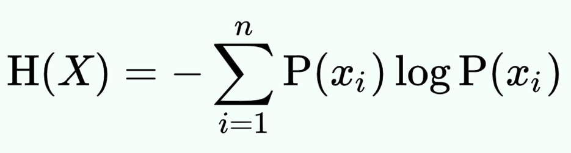
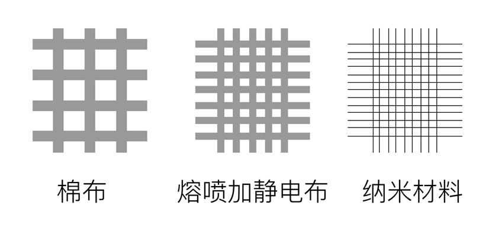
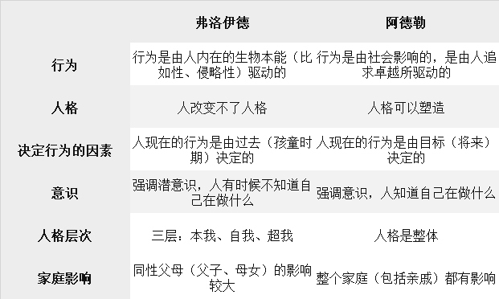
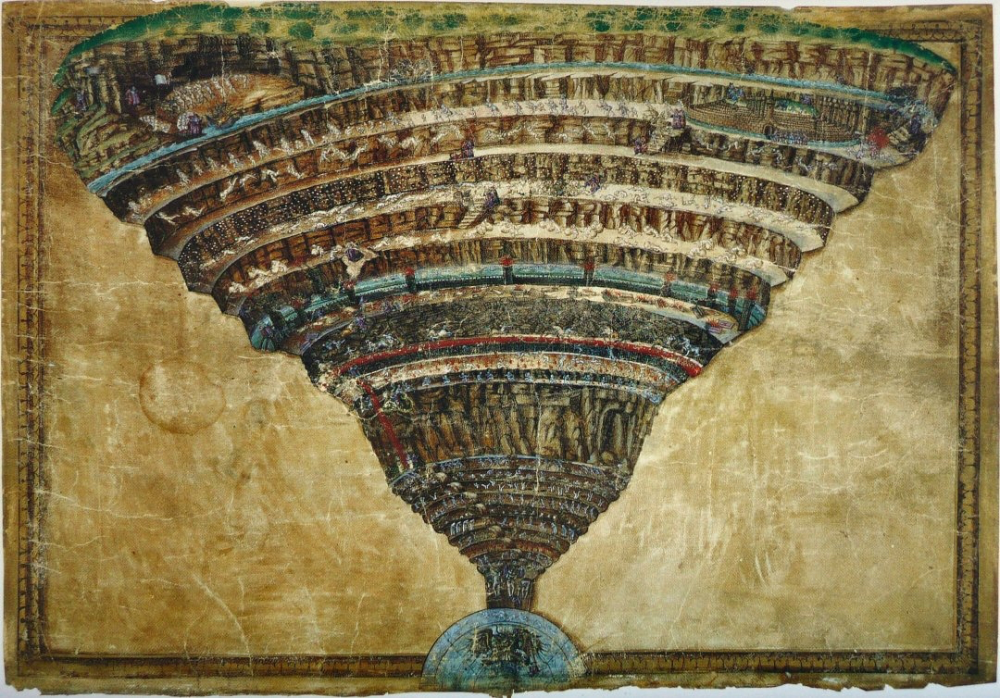
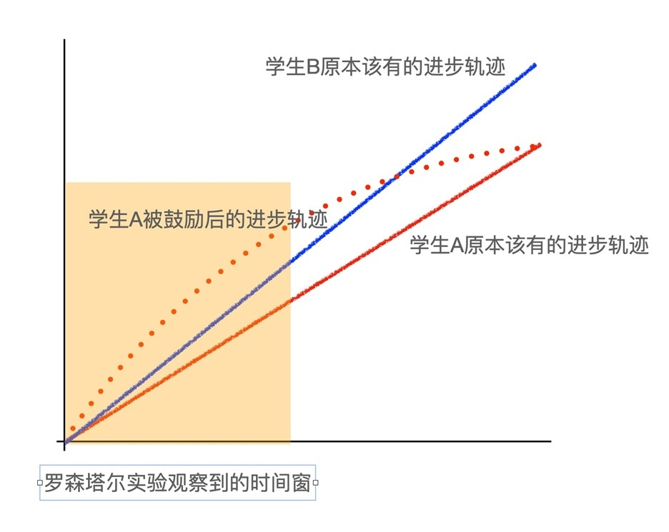

# 【DONE】《硅谷来信第三季》吴军

谈硅谷与全球化

1. 李嘉图定律。中心地价高，可以辐射到周边；经济好的时候，中心会带动周边一起涨；经济不好的时候，周边会暴跌，但中心地区因为总有人想挤进去，因此能够基本上维持住
2. 硅谷比较成功的原因就在于，它是一个比较纯粹的技术社会、商业社会和公民社会。这三个属性是现代社会的基本特征
3. “叛逆”是硅谷的本质特征
4. 今天的商业社会遵循的是所谓“消费者主权论”。需求和消费力成为了经济增长的动力，企业要做好三件事
5. 开发新技术
6. 需要增强管理和充足资金。原因是迭代速度太快
7. 持续扩大市场
8. 如果把硅谷企业在加州以外的收入算到硅谷的GDP中（其实就是大致计算硅谷地区的GNP），那么硅谷一个地区的产值比俄罗斯整个国家还多
9. 公民社会：自己的问题自己解决（自己管自己），没有政府可以依靠。大家要通过协作和法律，调整人和人的关系，解决彼此的冲突，让大家能够和谐相处、把精力放在做事情上
10. 硅谷在衰退，衰退周期很长，至少30年，但是在衰退过程中依然是美国经济龙头
11. 美国高中毕业生80%不会解一元二次方程。加州公立学校的教育水平在全美国50个州里面排在第48名。大公司老板的孩子不会上公立学校，上私立学校
12. 解决环保问题，要依赖提高科技水平，而不是纸面上的什么协议，再多的协议也不能把碳排放降下来。
13. 中国在过去的四十多年里之所以发展得很好，最重要的政策就是允许每一个人劳动致富
14. 在硅谷地区，即使一家只有十几人的初创企业，做的也是全球市场；大企业更是一半的收入都来自海外。
15. 政治、经济、法律和社区是欧美现代社会的四个支柱。在硅谷，政治几乎是空白，非常弱，但经济、法律和社区非常强。
16. 美国早期的成功在很大程度上是清教徒精神的成功：崇尚勤奋及节俭、尊重个人自由，同时又严于律己宽于待人。
17. 今天美国生活在富裕社会中的人，缺乏祖辈们踏实做事的精神，沉醉于各种鸡汤。比如一味追求虚无缥缈的极端环保理论，立志要拯救地球，拯救全人类。而生长在富裕社会中的穷人，也缺少了要靠自己努力改变现状的想法，总希望不劳而获。
18. 我们为什么要上学？
    1. 柏拉图：人只有通过和别人的讨论，才能知道我们自己的经验是不是真实的[^1]
    2. 讨论不是为了相互抬轿子，证明自己的观点正确，而恰恰是去听到不同的意见，然后促使自己反过来再思考。如果有人因为一个观点和你争吵，其实这是告诉我们，世界上还有另一种截然相反的观点存在，这是好事情。
19. 为什么有人反对全球化？因为他们没有从全球化的浪潮中获得利益，如果有，他们会瞬间从反对者变成支持者
20. 从第二次工业革命开始，全世界经济有两个明显的趋势
    1. 原材料（包括能源）成本在产品中的占比逐渐下降，电子产品比重增加
    2. 看得见、摸得着的产品占比越来越低，虚拟产品和服务的占比越来越高

教育与科学

1. 科学也好，任何理性的探求真相的过程也罢，它是一个实践的过程。在这个过程中，我们不断得到“够用的”真相
2. 关于人性，通常有两种观点：性善论和性恶论
   1. 哈奇森是人性善的代表
   2. 休谟是人性恶的代表。探讨如何借助人的自我满足欲，让人的欲望成为改良社会的动力。他认为利己主义才是最基本的，自私和目光短浅才是人的本性，人类为了利益可以不顾一切，甚至不惜践踏法律。所以人类不能靠道德教化来规范，而是需要用规矩来管束。
3. 道德的本质是什么呢？哈奇森说道德是与生俱来的美德，休谟却认为道德是社会强加的结果。道德教化和法律约束双管齐下，这其实就是今天现代国家的治理方式。
4. 政府的角色主要有两个：第一个是守夜人的角色，也就是管好治安和国防；另一个则是司法体制和制度的维护者，这一点常常被人所忽略。
5. 亚当·斯密提出劳动价值论，他认为相比土地和资本，创造财富的能力才是真正的竞争力
6. 法国启蒙运动的目的主要就是反对教会和反抗王权，也就是说，和苏格兰启蒙运动不同，法国启蒙运动有着明确的反对对象。
7. 法国启蒙运动是具有先进思想的社会上层人士，在反对教会和国王。孟德斯鸠、伏尔泰和达朗贝尔、卢梭和狄德罗。底层民众对他们的思想也并没有真正的理解，在实践中甚至是有很多误解
8. 苏格兰的启蒙思想家们可以说基本都是平民。苏格兰启蒙思想能够更好的被普通民众所理解
9. 白底红十字的圣乔治旗和蓝底白叉的圣安德鲁旗合在一起，就是今天米字旗的主体形状。这个图案的旗帜在1707年苏格兰和英格兰合并成大不列颠王国时，成为大不列颠王国的国旗。

1. 到1801年不列颠王国和爱尔兰合并时，又把爱尔兰的圣帕特里克旗，也就是红色的斜十字图案融入到联合王国的国旗中，就成了今天我们看到的样子

1. “哈德良长城”。今天苏格兰和英格兰的分界线，在历史上，它们又标志着罗马帝国扩张的最北边界
2. 国家越发达，第三产业的占比越高。因为第一产业和第二产业的天花板很快会被达到（农业，工业，服务业）
3. 基础教育的目的是为了在社会里生存，包括对世界的看法，学会使用工具和生活技能。要不要把孩子放到国外留学，取决于孩子将来会在哪里生活
4. 硕士生和博士生有什么区别？硕士是学会使用前人经验，解决实际的问题，而博士则是需要创造出前人不知道的知识。
5. 军长应该是个博士，因为做决定要考虑到方方面面，面对很多没有答案的事情，他得拍板解决
6. 衡量一个博士水平的高低，不在于当初曾经解决了哪一个问题，而在于将来能解决多大的问题
7. 科学就是把钱变成知识，技术就是把知识变成钱[^2]
8. 不是给乡村孩子们教更多的文化课，让他们考更好的分数，而是让他们从小接受现代文明的理念，在视野、科学素养和领导力方面超越他们的父辈。学业上的差距，将来在大学多读一年可能就能补上；而在非学业的素质上有了差距，常常需要花很多年才能弥补，甚至一辈子补不上。
9. 孙悟空很快发现他被神的圈子所接纳了，在以后的降妖除魔过程中，他不再是一个人奋斗，背后有了一个强大组织的支持
10. 自律的基础是认可自己的价值（只有认可自己的价值，你才会觉得自己的时间宝贵，觉得时间宝贵才不会浪费时间，去做更有价值的事情）
11. 日本明治维新之所以成功，是因为改变了日本人的生活习惯（喝牛奶，多吃肉），又保留了文化传统。其实，文化这个东西根深蒂固，很难改过来，而生活习惯的改变就容易得多。同时，生活习惯改变产生的效果之大，很多人可能都忽略了。
12. 很多人想要自我提升，但要一夜之间改变自己的世界观和见识，这是很难的；其实从生活和工作的习惯做起，循序渐进地改变，就能面貌一新。
13. 养成和改变习惯的四个要点
    1. 让自己身处于一个好的环境（想要早睡远离手机，想要健身远离撸串朋友，想要考研和有大决心的人一起复习）
    2. 找到坏习惯的替代方法（很多人戒烟戒不掉，其实和个人毅力关系不大，根本原因是生活中有压力，而吸烟可以减压）
14. 约翰∙霍普金斯大学2016-2018年，工学院里三分之二的硕士研究生来自于中国。在哥伦比亚大学的统计系，这个比例高达90%
15. 奥运冠军、攀登珠穆朗玛峰与获得诺贝尔奖、成为亿万富翁哪个更难？后者更难，因为他们的目标不能量化，不单一，没有套路，所以难度非常高[^3]
16. 如果去问一个普通人，你觉得自己能得奥运金牌吗，估计绝大部分人都会承认不能；但如果问你能成为亿万富翁吗，有些人可能就会说，那也不是没有可能。为什么会这样呢？原因是对于奥运冠军的指标是明确且单一的，不行就是不行；但是对于成为亿万富翁这种依靠情商、智力、认知水平、市场能力等无法量化和评估的能力，人们倾向于否认，盲目相信自己也能行
17. 在应试教育的问题之一在于把人才培养这件复杂的事情简单化，而且过分依赖量化指标。把好学生这个原本应该多维度考量的事情，变成了用成绩数据来衡量。
18. 休谟用一把“叉子”，把人类的知识体系和获得知识的方法一分为二。一边是不需要经验验证的纯理性知识（比如数学和自然科学），另一边则需要经验学习获得（除数学和自然科学以外的）
19. 理性主义无法告诉我们那个正确的答案是什么，但它能够告诉我们什么是错误的，因为它们不合乎逻辑，不合理【实践出真知】
20. 宪法第十修正案讲得很清楚：法律没有禁止，就默认是可以做的。如果将来发现问题，再通过一个新的判例纠偏就好
21. 法国法典代表的这一类法律，就被叫做大陆法。但是，大陆法实行起来对法官的要求非常高，它的每一条法律就像是科学上的一个定律，怎么解释、怎么应用，依赖于使用者的水平。而判例法就像是一个习题集，每一个判例就是一个例题，后面的人抄作业就好了。
22. NBA有两项特别的规定，就是为了防止某个球队独大：
    1. 第一，每年选新秀时，要让上赛季战绩差的先选；
    2. 第二，限定每个球队的工资总额。
23. 这两个规定的目的都是为了防止出现马太效应，强者越强，弱者越弱。
24. 经历和经验是两回事。一个人坐牢20年，也是一种经历，但你要说他有什么社会经验，肯定谈不上。
25. 李希霍芬考察了江西、安徽一带，其中到过景德镇，了解了当地的瓷器制造业，在景德镇的高岭山看到了矿工们开采瓷土的景象。他在后来的著作中，就以“高岭土”来命名瓷土这种矿物，后来这个名称被全世界所采用。
26. 历史上第一次人类最重要的会议：1900-1920年的索尔维会议，普朗克、爱因斯坦、波尔、居里夫人
27. 历史上第二次人类最重要的会议：1946年到1953年间，在纽约比克曼（Beekman）酒店。工业革命后，从能量转换到了信息层面。香农大牛重新定义了什么是信息：信息就是不确定性的度量，要消除信号源或者说一个封闭系统的不确定性，就需要引入信息[^4]
28. 香农还给出了一个著名的公式，来计算一个带有不确定性的信息源中，它的信息熵究竟是多少。

1. 在二战之前，衡量经济发展和科技进步，最简单直接的指标是物质和能量的总量，而在今天，这个指标已经变成了信息。
2. 我经常和创业者讲，你要么能够自己掏钱养活团队，要么有本事挣钱养活团队，然后才有机会培养团队，才能依靠团队赚钱，回过头来养活自己。没有本事挣来公司的第一笔钱，也就别开公司了。
3. 每当到了经济危机时，电影业的生意就特别好。1929年的经济危机促成了好莱坞的崛起；1975年的经济危机，催生出《星球大战》等一大批优秀的电影系列。2008-2009年金融危机时也是如此，电影院的生意变得特别好。
4. 一种食品算不算“垃圾食品”，不完全由食品的成分来决定，而要看它对个人的健康有没有用。没有垃圾食品，只有垃圾吃法。[^5]
   1. 比如麦当劳的巨无霸汉堡或者方便面等等，天天吃这些食物，那它们就是垃圾食品。但是你如果要参加体育比赛，赛前和赛后，它们其实是不错的食品。
   2. 越野赛途中有哪些好的食品呢？除了士力架这样的能量条之外，方便面也是可以吃的。里面有很多盐。
   3. 赛后，为了迅速补充水分，给身体降温，平时非常不健康的各种高糖碳酸饮料，也成了营养饮料。
5. 总统总是会尽可能地在自己任期内通过提名大法官和各级联邦法官的方式，延伸自己的影响力。
6. 耶路撒冷最著名的景观包括圣墓教堂、西墙（哭墙）、圣殿山区等等，三者分别是基督教徒、犹太人和穆斯林的圣地，圣殿山也是传说中犹太圣殿的所在地。
7. 死海是世界地表海拔最低的地方，在海平面400米以下，一般海水的含盐量在3%左右，而死海表层水中盐的含量大约是30%，底层湖水的盐含量完全饱和，温度也是恒定的。死海湖底全是盐结晶，脚踩上去会非常疼。
8. 巴勒斯坦人对以色列人的态度其实很矛盾。一方面他们对以色列人抱有敌意，另一方面又要在一定程度上依靠对方解决吃饭问题。
9. 分析历史事件的8个纬度：
   1. 国家和民族。
      1. 比如要了解古罗马的历史，就需要了解它是如何从拉丁人的部落开始，通过联合萨宾人和伊特拉斯坎人组成罗马人公社，然后一步步在亚平宁半岛建立了王政、共和国和帝国。在这个过程中，它又是如何将古希腊、古埃及、小亚细亚、高卢、英格兰等地的居民整合到一起，构成了一个多民族的国家。
   2. 经济，贸易，科技
   3. 地理和环境
      1. 400毫米等降水线。为什么这条线很重要，因为这条线往北，气候就不适合农耕而适合游牧了，因此它通常是中国农耕民族和游牧民族活动范围的分界线。
      2. 800毫米等降水线则是中国水田和旱田的分界线，它和秦岭淮河一线是重合的。这也就是为什么南北对峙的朝代，大家常常以秦岭和淮河为分界线，因为在军事上，固然南方对于拥有骑兵的北方难以构成威胁，北方的骑兵过了这条线，进入到水网密布的南方，优势也就不容易发挥了
   4. 人口，迁移
   5. 政治，权利
10. 人类早期的文明基本上都分布在纬度25-35度之间。美洲的三个早期文明，玛雅文明、阿兹特克文明和印加文明也是分布在纬度较低的位置，具体来说是北纬20度左右，以及南纬10-20度之间
11. 来到拉美的西班牙人，往往都是代表国王而来。一批又一批到美洲探险的西班牙人，每一批都拿着国王的特许状，他们代表国王宣布新发现的哪一块领土属于王室，然后就成为当地的管理者，获得当地的经济收益和税收。一批批不同的殖民者占据了不同的地方，这在后来就形成了南美洲不同的国家。
12. 很多人掌握了一些修改的权力，就喜欢把别人做的东西按照自己的意愿改一下，尽管其实没有差别
13. 对于任何问题，不要基于下决定，要尽可能找到多的方案，总是要尝试寻找更好的方案[^6]
14. 如果一个文明能够驾驭它所在的行星上所有可用的能量，就达到了第一型文明的标准。第二型文明的标准则是能够驾驭所在恒星系恒星的能量
15. 聪明一点的人都会避免自己成为那个不得不将坏消息告诉某个人的人。很多人倒霉，不在于他做错了什么事情，而在于他成为了那个将坏消息告诉别人的人。
16. 在准备告诉对方一件事情的时候，首先要考虑的不是怎样表达，而是该不该和他讲。
17. 提薪，语气要谦逊，态度要坚决，一次说清楚，不要三番五次反复暗示；提醒人还钱也是这样
18. 讲笑话时特别不能开对方的玩笑，也不能开残疾人、老人或者其他一些弱势群体的玩笑，这么做就不是情商低的问题了，而是缺乏对人起码的尊重。
19. 上帝是什么？按照金鱼和鱼缸的解释来说，鱼是无法理解人的存在的，水为什么变清了、变冷了，都超出它们的认知，我们是超越者，给予了鱼缸这个环境；上帝就是我们的超越者
20. 20世纪伟大的数学家哥德尔严格证明了，在数学上，不存在一个自洽的、而且还能够证明其体系内部所有真命题的公理系统，这就是著名的哥德尔不完备定理[^7]。这个定理打碎了著名数学家希尔伯特希望建立一个完备的大一统的数学体系的构想。不仅数学如此，其他领域的知识体系也有这个特点，就是自己难以证明自己的正确性。
21. 托尔斯泰讲，“幸福的家庭都是相似的，不幸的家庭各有各的不幸”，道理也差不多。幸福的家庭都具备了幸福所需的必要条件，而不幸的家庭所缺失的可能不尽相同，补上一个缺陷，也未必能找到了导致不幸的真正原因。
22. 周围都是和自己一致的观点，这常常让我们失去思考能力，理所当然地认为自己的想法就经得起检验，毕竟“大家都和我一样”。一群媒体在一起，看到的是一个他们讨厌的特朗普；一群特朗普支持者在一起，看到是一个备受欢迎的总统。【多样性红利】
23. 事实性报道最客观的媒体是，AP美联社，reuters 路透社、AFP 法新社、Bloomberg 彭博社。为什么它们会比较客观？因为这些媒体的受众定位并不是大众，而是电视台、电台和报纸。它们会去购买这些通讯社的报道，然后在自己的媒体上进行刊载。
24. 科技公司提供的是技术，所以理论上来讲它不需要为平台上的内容负责。它们的责任是保持中立，在法律允许的范围内，保证所有人都可以通过平台发声。
25. 区块链的美妙之处在于，它可以将验证信息这件事和拥有信息完全分开。也就是说数据的使用者不需要拥有信息，但他可以在得到授权的情况下验证信息的真伪或者是否具有某种特性。
26. 你把1万元存入银行，银行以贷款的方式提供给第三方使用，第三方就需要向你支付利息（实际上你在银行存款获得的利息就来源于此）。而银行从中间赚取一个存款利息和贷款利息的差值，作为银行替你管理钱财的成本和自己的利润。

***

1. 美国两党的诞生
2. 联邦党：财政部长汉密尔顿主张大政府，强调中央集权，支持工商业，希望政府和富人结盟，建立一个由富人鼎力支持的强大国家，强调需要有一个统治阶级，强调贸易保护
3. 精英阶层，工商业人士，他们集中在北方和南方个别的港口城市
4. 民主党（总统）：杰斐逊和麦迪逊就成立了共和民主党，这就是美国建国之后诞生的第二个政党，强调各州的权利，崇尚个人自由，反对贸易保护
5. 南方和新开发的西部，他们代表种植园主和农民的利益
6. 一件事情造成了损失，你有过失，你需要对你的过失道歉，但仅限于对你的过失和这件事情本身，而不需要对无限的连带责任道歉。
7. 去南极一般需要提前18-12个月定船票，因为南极各个岛屿每天允许登岸的人数有限制。有的岛每天人数的限制只有50人左右，即使限制较松的岛，最多也就允许每天100多人登岛。因此，把每个岛能够接纳的人数加起来，每年只能满足4万人左右造访南极。
8. 相机、防寒服、晕船药（耳贴晕船药，有副作用，但是效果好）
9. 去程、回程预留两天时间
10. 南极洲的形状，如果从天上看，像英语字母Q，圈就是南极大陆，与南极圈重合；尾巴叫做南极半岛，世界上绝大多数南极考察站也都建在南极半岛上
11. 南极公约。1959年美国、苏联、阿根廷、澳大利亚、英国、日本等十几个国家发起并签署了南极公约。禁止破坏南极生态。如果违规了相当于违反各自国家的环境保护法规
12. 南极不属于任何国家，各国对它没有领土要求
13. 第一是要防止和南极之间任何可能的物种交换，第二是要保护当地的环境和生物。
14. 孵蛋的工作就要交给企鹅爸爸来完成，企鹅爸爸们在孵蛋时常常是排成一排，这样背可以挡住风；企鹅爸爸们要这样站在风中不吃不喝60天（帝企鹅孵蛋时间可能长达65天），直到小企鹅孵出来为止。在这个过程中，企鹅爸爸的体重要下降45%
15. 企鹅和鲸鱼都以磷虾为食，因此有大群企鹅的地方就有可能找到鲸鱼的踪迹
16. 世界语为什么没有流行？因为世界语没有文化。语言的一大作用就是文化的传承
17. 6G联盟两件重要的事情
18. 全球供应链安全。生产放置在全球各个国家
19. 手机和移动通信要更加人性化。比如支持助听器
20. 6G与技术相关的关注点
21. 支持AR
22. 实时机器翻译
23. 安全、身份识别
24. 要求：速度比5G快50倍以上，延时再低一个数量级
25. 5G通信的两个标准
26. 非独立组网（NSA）。6GHz
27. 独立组网（SA）。28GHz
28. 6G工作频率：1TGHz
29. 要想过滤和透气要同时做的好，纤维与纤维之间的空隙要小，但是不能太小，纳米纤维就可以

1. 衣服保暖需要两个基本条件【类似细胞的半透膜】：
2. 一个是防风，防止冷风吹进来；
3. 另一个是防辐射，防止人体的红外辐射把自己产生的热量散出去。
4. 纳米纤维可以做到
5. 三种疫苗：减毒疫苗，灭活疫苗，RNA疫苗（注射RNA，在人体内合成蛋白质触发免疫反应）
6. mRNA疫苗的好处
7. 比灭活疫苗更安全
8. mRNA不可能进入细胞核，不影响DNA
9. 生产优势。它不需要培养病毒
10. 一个中等体重的男子每天平均产生733克二氧化碳，这样一年会产生大约270公斤的二氧化碳，一棵树龄10年的大树，平均一年只能吸收22公斤二氧化碳；差不多要12棵树
11. 在电池领域可没有摩尔定律，单位容量电池价格每年下降的速度只有3%左右，最终提升的空间可能也不会超过一倍。
12. 电池单位质量的能量密度取决于材料的两个性质
13. 第一个是材料密度，材料密度越小，造出来的电池越轻。而锂是最轻的金属，因此用它做电池同样重量电池的能量密度就更高。
14. 第二个因素是材料的一种化学特性，被称为标准电极电位，通俗地讲就是这种材料能产生多少电。金属锂同时也是电极电位绝对值最大的金属之一，绝大多数化学元素都不如锂。也就是说自然界的元素不管怎么配，要取代锂几乎是不可能的。
15. 新能源技术未来的发展方向：储能，使用寿命（降低储能成本）
16. 锂电池两种的技术路线
17. 三元里电池。充电次数少，不稳定，容易爆炸
18. 磷酸铁锂电池。高温稳定，充电次数多
19. 以特斯拉电动汽车为例，90克石油的化学能就相当于一度电的电能。90克和6.3公斤，差出来将近两个量级，这也是目前电动车难以取代内燃机汽车的原因之一。另一个原因是充电速度
20. 世界各个经济体的发展前景排个序
21. 第一梯队是中国和美国，而中国远远在美国前面。
22. 第二梯队有两组，印度、越南和墨西哥为一组，讲英语的发达国家为另一组，前者远远在后者前面。
23. 第三梯队也有两组，欧盟、韩国日本为一组，世界其他新兴市场为另一组，发达国家的一组排在新兴市场国家一组的前面。
24. 学生统计的平均人数大于教务处给的评论人数，记者统计的囚犯坐牢时长长于真实囚犯的坐牢时长，都是因为采样出现偏差导致。你调查的同学大概率是上过大课的人，你没调查到的囚犯早就离开监狱了
25. 财务自由的几个典型解释
26. 钱非常多，想干什么干什么
27. 钱非常多，你不想干的事可以不干
28. 你的资产每天产生的收入多余你每天的开销
29. 财务自由是手段，真正的目的是人的安全感和自由，人有了安全感和自由，及时没有钱也没有关系
30. 30岁的人虽然辛苦，但是有好的身体，应该去寻找自己的乐趣。有些人为了挣钱拼得太厉害，把身体搞垮了，虽然挣了一些钱，但30多岁就不得不过60岁的生活，其实这是得不偿失。
31. 霸凌的范围其实比我们想象的要大，并不只是动手伤人了才算霸凌，有很多霸凌行为其实是精神性或者关系性的。
32. 比如职场上，有同事总是贬低你、在任何场合都拒不合作；
33. 在学校里，几个孩子号召一群人孤立某个孩子；
34. 在亲密关系上，一方对一方索要无度，试图在精神上控制对方；
35. 在家庭生活中，长辈和晚辈之间、配偶之间一方强制要求另一方服从
36. 这些都属于霸凌行为，因为都出现了一方只考虑自己的利益、试图控制和操纵他人的现象。
37. 最高境界的中小学教育应该达到两个目的：
38. 第一个是把孩子培养成好孩子、好人，这比成绩好要重要得多。只要把孩子培养成好孩子，让他感受到爱，接下来的事情将来孩子自己都能解决。
39. 第二个是要激发孩子的求知欲望，以及一辈子对知识的迷恋。
40. 弗洛伊德和阿德勒对人的思考

1. 阿德勒认为，所谓自卑，就是一种心理的平衡被某件事打破了。这样的自卑不是坏事，它能促使我们努力做更好的自己，最终超越现在的不完美
2. 面对一道很难的数学题，我们可能缺乏信心，不相信自己能解决它
3. 你见到心仪的对象，话都说不利落了
4. 单位里的朋友讨论买什么汽车，大家都说本田好，可你就喜欢福特车，这时你就不敢说出自己真实想法了
5. 很多人为什么会争夺利益，因为他们认为其他人和自己是不相容的，和自己也没有关系。如果人能够做到包容，把其他人也包容进“我”这个概念里面，就不需要刻意地去“无私”，而是很自然地就会去爱他人，因为这就和爱自己是一样的。
6. 雅利安人进入印度地区，建立起吠陀文明，那些和神打交道的祭司和探索知识的学者就被称为婆罗门，他们处在社会阶层的顶端。随之就诞生了一套完整而严格的等级制度，也就是种姓制度
7. SpaceX拿的也是NASA的钱；美国研究最新飞机、导弹、潜艇的，都不是国家研究机构，而是拿了政府合同的私营企业和大学
8. DARPA是从当年万尼瓦尔创立的ARPA发展而来的，这两个机构其实是一回事。DARPA支持的主要是和国防相关的基础研究。互联网最早也叫做ARPA网（APRA net，中文也翻译成阿帕网），后来美国要搞星球大战计划，就把管理机构ARPA的名字前面加了一个字母D（defense），表示高级研究规划署的性质是为了国防
9. 量化衡量一个地区科技水平的指标：
10. 一个地区适龄工作人口的数量，这个数量不能太小。
11. 受过大学教育的人口比例，特别是从优秀的大学获得科学（包括工程）学位的人口的比例。
12. 人均专利数量。
13. 这个地区的宜居程度，具体来说包括房价、犯罪率、交通便捷程度等等。
14. 人要想成为通才，第一个前提是对知识要痴迷，甚至说要上瘾。
15. 知识的价值和掌握它的人数成反比。凡是你容易获得的知识和信息，其他人也很容易获得，因此价值就可能有限。
16. 社会分工越来越精细，不再需要借助朋友的力量，交给陌生人去做更好。（比如装修房屋，房屋搬迁）
17. 无论是网络上的朋友还是身边的朋友，他们应该是让你的生活变得更好，彼此都能从这段关系中有所收获，这段友谊是让彼此生活得更舒服、更健康，而不是反过来。
18. 决定一个人能走多远的，是他自己的品质和能力，包括从小的教育和环境塑造出来的部分，而不是他上了哪一班车。登了不同的车，只是走的路径不同，最终人都会达到自己该到的目的地。能看到什么样的风景，不完全取决于那辆车。就算重来一次，换一辆车，可能最后还是会到达同样的地方。
19. 什么叫有文化：
20. 有根植于内心的涵养，无需他人提醒的自觉性，能够真心实意为他人着想。
21. 怀疑权威但是敬佩天才，喜欢探究而又善于表达，乐于吸取新观念。
22. 有一种更细腻、更敏锐的情感，能够欣赏精美的雕塑、绘画，优美的音乐、诗歌，甚至能够思考哲学问题。
23. M2货币，包括现金、企业存款、居民储蓄存款以及其他存款等等，总的来说主要就是以存款和现金的形式存在
24. 通货膨胀最大的影响对象应该是中收入人群。因为高收入人群的财富投入到再生产比例高，能够抵抗通货膨胀，而低收入人群因为现金流少，影响很少
25. 早期文明都是以小邦国形式出现的（苏美尔文明是由12个独立的邦国构成，古埃及是由上下埃及多个独立的城邦构成，古希腊也是由独立的城邦所构成的），后来行政管理水平提高，出现了专职的行政管理系统，方圆百里甚至千里的王朝才有可能出现
26. 怎样在这浮华的世界中做到心静如水呢？奥勒留的观点是，坚守自己心中的神明。如果一个人心中有神明，就能摆脱感官的诱惑，不会放纵情欲，而是能够克制自己、超越享乐
27. 学习最高的目标其实是让自己的灵魂纯洁，摆脱愚昧和邪恶
28. 神曲分为三个篇章，对应着主人公但丁的三段旅程，分别是《地狱篇》、《炼狱篇》和《天堂篇》。
29. 画中的地狱世界分为九层，地狱的入口在耶路撒冷郊外的森林中，整个地狱的形状像是一个不断螺旋向下的大漏斗，从上到下空间逐渐缩小。越向下，里面的灵魂罪恶越深重，直到地心，那里由魔王撒旦掌控。

1. 炼狱其实是那些罪行比较轻的灵魂接受考验和完成修炼的地方，而不是更深层的地狱。炼狱的形状正好相反，它是一座层层盘旋而上的高山。炼狱这座山分为七层，分别代表七宗原罪，也就是骄傲、嫉妒、愤怒、懒惰、贪婪、饕餮（或者翻译成暴食）和淫乱。灵魂到达炼狱之后，每上升一层就会消除一种罪过，直到山顶就可以升入天堂。这七层炼狱，再加上底层的净界山和最顶层的人间乐园（也就是伊甸园），一共也是九层。
2. 孩子一定不要有和别人不一样的优越感。
3. 要给孩子立大规矩，比如危险的事情不要做（过马路），要诚实不能投机取巧（偷东西）。
4. 出版社擅长的不同类别的作品：
5. 文学类：人民文学出版社、译林出版社
6. 社科类：三联出版社、商务印书馆在
7. 经管类：中信出版社
8. 每一个孩子都是上天给予家庭的天使，他们应该有自己的生活，活出自己的人生，而不是为了父母的期待从小成为“鸡娃”，或者以后成为“牛人”。如果忘记了原本的目的，眼中只剩下了手段，也许只会离幸福渐行渐远。
9. 亚里士多德认为私德优先于公德，举例来说，就是你先要对家人朋友好，然后才是对社会好。
10. 在亚里士多德看来，法律的根本目的在于培养民众的德性，而不是用严刑峻法去约束和威吓人们
11. 没有人能够靠学一百门管理学课程管好公司，也没有人可以通过读一百本爱情小说收获爱情。所有的知识，都是我们不断触碰这个世界的结果。
12. 佛陀和孔子生活在同一时代，彼此相差不超过一百年。和孔子一样，佛陀也出身于贵族阶层，他出家前的名字叫做乔达摩·悉达多，是印度北部释迦部落首领的儿子。我们今天称呼佛陀叫做“释迦牟尼”，这个词的本义就是“释迦部落的圣人”。
13. 人类眼睛的分辨率连老鹰的十分之一都不到
14. 2020年，在招商银行的客户中，1.96%的人拥有了82.15%的财富。1.96%是招商银行资产50万元以上客户占招行客户总数的比例
15. 人这一辈子要挑金子，不要过滤沙子。
16. 在选片的时候，专业摄影师都是从一大堆照片中只挑几张好的照片出来，而比较业余的摄影师通常则是删掉不好的照片，把其余的都留下，舍不得删。
17. 困境是留给你以后回过头来看的，不是给你现在看的
18. 在多给孩子鼓励的同时，逐渐引导他知道世界上比他聪明的孩子多的是，才是对他成长最好的做法。
19. 流感疫苗大部分是用鸡蛋做的。用针枪把病毒注入到鸡蛋里，然后瞌碎取它的蛋清，得到活病毒。
20. 头脑风暴的五项原则：
21. ①没有傻主意；
22. ②不要批评别人的想法；
23. ③要在别人思路的基础上搭建；
24. ④要在数量的基础上追求质量；
25. ⑤不要评判。
26. 有的人反对特权，其实只是反对自己没有特权，而不是反对特权本身的不合理
27. 考试的时间也就一两个小时，能够在一场考试中解答出来的问题能有多难呢？在工作中我们遇到的实际问题，有多少是两个小时就能解决的呢？
28. 一个内向的人千万不要被外向者的节奏带着走，也不要盲目模仿外向者的方式和人交往，因为违背自己的天性做事是做不到的。
29. 本来只要你跑得比别人快，不论是否经历弯道，自然会超过前面的人。那种强调“弯道超车”的说法，重点不是放在“跑得快”上面，而是放在“弯道”上面，其实只是变了个方法讲捷径。
30. 情商包含的内容：以积极的方式理解和管理自己的情绪、缓解压力的能力，同情理解他人的能力，以及与他人进行有效沟通的能力
31. 你和你的孩子是两个完全独立的个体，但很多家长把自己的东西，梦想，三观，面子等，全压在了孩子的身上。这是很不自信且推卸责任的做法。家长应该负责让她看到ABCDE条路，看到这个世界，并以我们的经验告诉她每条路会引向什么样的结果供她参考，但所有的选择都她自己做，然后无条件地支持鼓励她的选择。否则你所谓的尊重，只是表面文章。
32. 卢梭认为，人的自然天性是美好的，但不好的教育体系会将人教坏；教育真正的目的在于使人成为自然人，让一个人能够依照自然的顺序、遵从自然的法则做事情。
33. 要把孩子当孩子的反例：
34. 希望孩子考第一；
35. 给孩子讲很多道理和逻辑，希望孩子能够完全听懂，就不再走弯路了；
36. 让孩子牺牲当下的幸福或快乐，理由是“都是为了你将来好”；
37. 教给孩子很多他一知半解的知识。
38. 我们最应该教给孩子的不是各种知识点，而是自己学习、自己认识真理的方法
39. 爱情的本质什么？是吸引。只有当对方也喜欢你的时候，你所有的付出才有意义
40. 什么是对的人？佛说，一见你，就笑的人。真爱不需要你若即若离、不需要你使用各种套路、不需要你使劲展示自己、不需要你欲擒故纵，那都是因为对方不够爱你，你不是ta的菜。
41. 不是把心思全花在他身上，而是自己身上。只有你的优秀才能证明你是值得被爱的。所以，我是鼓励一段感情中，全身心投入的，否则恋爱的乐趣在哪里? 但是不管你如何喜欢他，你一定不能忘了要有自己的生活自己的事情自己的圈子。这是为了你有一份可以随时离开一个人的勇气和底气。只有有了这样的勇气和底气，他才会认真对待你，你没有后路可退，就只有被蹂躏的份了。敢爱并且敢离开。
42. 当你对一个人太好的时候，往往会造成这么几个效应：
43. ta会自我膨胀，觉得你的价值不如ta。因为人都是追求比自己高的东西的，所以，说明ta比你的地位高。
44. 免费的东西一般都得不到珍惜。
45. 你没有时间经营自己，所以，差距越来越大，ta更加看低你。
46. 你的重心偏了，ta被你压得喘不过气来，就会想逃离。
47. 随着你的沉没成本越来越大，你的不安全感就会越来越大，你们之间的争吵就会越来越多
48. 别人对待你的方式，往往取决于你自己对待你自己的方式。如果你自己都不爱你自己，对自己不上心，你如何指望别人对你上心，尊重你？
49. 是因为我们需要教育，所以才有了学校；而不是因为身在学校，我们才要接受教育
50. 加德纳提出了他著名的多元智力理论，认为人的智力其实包含多个维度，加德纳主要指出了七个维度：语言能力、数学-逻辑能力、音乐智能、空间想象能力、运动智能、人际交往以及自我认知。
51. 语言是描述世界的模型，而之所以能够和现实世界对应，是因为他们都服从“逻辑”。使用语言这种工具对现实世界进行再现，再现的方式就是逻辑
52. 如果语言能力不过关，其实对世界的理解是有限的
53. 我的语言的极限意味着我的世界的极限——维特根斯
54. 教育的本质是，一棵树摇动另一棵树，一朵云推动另一朵云，一个灵魂唤醒另一个灵魂
55. 教育者和被教育者是平等的
56. 最终解决教育平等问题的是职业平等。我们每一个人都应该善待各种职业的人，无论是对外卖小哥、餐厅服务员、工厂工人，都是如此，也许我们的后代未来也需要从事这些职业
57. 学习一项新技能的三连问：
58. 为什么学。最重要，避免三分钟热度
59. 怎么学。跟老师学
60. 学习成本是多少
61. 从某种角度上说，我们都是这种多巴胺化学奖励下的奴隶。因为一个生物的多巴胺总是在它做对了事情的时候分泌出来，让它爽。比如努力工作，玩命加班，想法提升职位，或者是坚持长跑，写书法，做智力题，踢足球比赛
62. 海洛因为什么让人上瘾的生物学原因：神经细胞抓取内啡肽，然后通知脑垂体释放多巴胺。海洛因因为太替代了内啡肽，直接让脑垂体产生发大量多巴胺
63. 美国国立卫生院NIH给出了六个对于智力发展有重要影响的因素：
64. 父母的智商
65. 自己的基因
66. 家庭构成（Family Style）
67. 父母养育时的习惯方法
68. 营养
69. 教育
70. 皮亚杰把孩子的认知和智力发展分为了四个阶段：
71. 2岁之前。感知运动的阶段（Sensorimotor Stage）。孩子无法分清自己和周围的世界。11个月左右才会意识到外部和自己是两回事
72. 2-7岁；没有理解逻辑的能力，经常你和他讲一些事情他听不懂（无法区分体积和数量），无法多角度看待问题（假山问题，白色果汁问题），从自己的视角出发，自我为中心来理解事物
73. 7-12岁（最重要）；具体运算阶段（Concrete Operational Stage）。理解背后简单的规律，有形象思维和逻辑思维，缺乏抽象思维（比如理解方程式较难）。培养的方式不是多学文化课，而是要多培养归纳推力、多兴趣、学习方法、培养对世界的好奇心。多培养词汇量。多去看植物园、博物馆，多看绘本，多了解工具，电器，建筑，风景，交通工具，对世界有更加全面的认识
74. 12岁以后。
75. 对人最有帮助的行为是让他承担他自己所有行为的后果，不需要患难与共，这不是患难与共的时候。生活中豆大一点点的事，让她孩子自己承担后果，自己解决。
76. 全世界一共有14座8000米以上的山峰。其中9座在喜马拉雅山脉上，位于中国和尼泊尔边境或者两国境内。另外5座在喀喇昆仑山脉上，位于中国和巴基斯坦边境或者巴基斯坦境内。乔戈里峰由于是喀喇昆仑山脉被考察的第二座山峰，因此在登山界被称为“K2”，K代表的是喀喇昆仑山（Karakoram）。当然，有K2，就有K1、K3、K4和K5。但它们的名气要比K2小很多。
77. 攀登K2有多难呢？我的师兄是这样讲的：他攀登过三座8000米以上的山峰，如果说攀登珠峰的难度是30，另外两座的难度大概是20，按这样算，K2的难度就会是100。也就是说，攀登K2的难度比珠峰高出好几倍。
78. 全世界只有300多人成功登顶过K2，相比珠峰的5000多人少了一个数量级还多。K2不仅难以攀登，事故概率也极高。
79. 美国民事纠纷的赔偿一般都包含两个部分：一是补偿性赔偿，二是惩罚性赔偿。惩罚性赔偿的目的在于警示社会，旨在改善社会事务中有缺陷的地方。
80. 全球变暖从根本上说，是地球吸收的太阳能量比散发出去的能量要多，尤其是地球表面大气层所保有的能量，城市道路和建筑表面会吸收大量太阳辐射，再以红外辐射的方式将吸收的热量散发到大气中。城市热岛效应（道路、建筑）导致大地升温非常快，解决此问题的方式就是用新材料混凝土，增加沥青的比热容
81. 布鲁诺执行火刑的理由并不是他坚持“日心说”，而是推崇古埃及的赫尔墨斯法术，认为意大利是一切罪恶的渊源，耶稣是个魔术师，魔鬼将获得拯救之类的言论。之所以会把它作为宣扬“日心说”的学者，是因为在他崇拜的另类宗教里，还有对世界的描述，那就是宇宙没有大小之分，没有有限跟无限之分，没有中心与周围之分，这个就强行和“日心说”扯在一起。
82. 关键洞见：布鲁诺1600年被烧死，但是哥白尼的《天体运行论》在1616年才被列为禁书。如果一个人只因为宣扬“日心说”就要被烧死，那怎么可能“日心说”的书籍要在这个人都被处决后16年才被定义为违反教义呢？
83. 巴菲特挑选的都是好的行业、有能力挣钱的公司，但他通常是在目标公司出现暂时困难时买入，这样一来价格合理，二来他好安排人进董事会。那些企业之所以会出现暂时困难，不是因为生意不赚钱，而是管理出了问题。巴菲特在大量入股后，会通过董事会调整企业管理团队，这样一来，那些做着好生意、能挣钱的企业就逐渐步入了正轨。因此，与其说巴菲特是股神，不如说是经营之神。很多人学了巴菲特的皮毛，但没有实力控股一家公司，就只能任由那些有问题的企业停留在诸如帕金森定理之类的管理陷阱中。
84. 罗森塔尔效应是有问题的，把时间放长之后效果就不明显了。之所以在短期有效果是因为关注度和教育资源的倾斜

1. 批评不是对对方做个人评价，而是对他们做的事情给出反馈。也就是对事不对人
2. “寓教于乐”都只不过是个伪命题，这种方式只能培养出平庸之辈。如果一个人到了大学阶段，依然要通过追求快乐来学习，说明他其实并没有学习的动力；如果老师只有把课程讲得像娱乐节目一样，学生才觉得能听懂、能听进去，这只能说明学生缺乏理解抽象知识的逻辑思维能力，相关智力开发不足
3. 面对一件事，如果一个人的心态是“我们没有钱，这件事不可能做得成的”，就是穷人思维；
4. 如果心态是“我们要做成这件事，虽然需要钱，不过办法总是有的”，这就是富人思维。
5. 人的梦想并非一成不变，而是会自然生长，我们也不必觉得自己现在的梦想不够伟大、不值得追求
6. 《异类》强调起跑线上的优势，一开始占优，后面就越发展越好；而且强调人要投入大量练习，成为专业化的人才。《广度》则认为，早期优势没有那么大的作用，比起专业化，现在的世界更需要的是通才。
7. 关键洞见：第三类人更有优势：比起有广度没深度的人，还是有深度、但广度有所欠缺的人更容易成功一些。
8. 孩子一开始在知识的积累上慢一点完全不需要担心，倒是他们心智的发育上要尽可能快地成熟。比如一个孩子应该能够懂得如何在课堂上好好上课，如何与小朋友相处，遇到问题要学会找老师处理
9. 很多人总是在问，专才遇到了事业的天花板怎么办？其实对绝大部分人来讲，他们最大的问题是成不了好的专才，过早操心天花板以外的事情没有太大的必要。
10. 贴标签本质上是因为懒惰，懒得花时间去发现别人身上真正的价值
11. 一个复杂的事情，如果我们还没有尝试过最简单的方法，那就先不要去想复杂的方法了。
12. 生命中9件不重要的事情分别是：
13. 服装和购物
14. 高档餐饮
15. 八卦
16. 社交媒体
17. 新闻资讯
18. 太在意别人对自己的看法
19. 过度思考
20. 总想让自己正确
21. 经常用的东西使劲挑牌子
22. 对明天的担心

[^1]: 柏拉图：人只有通过和别人的讨论，才能知道我们自己的经验是不是真实的

[^2]: 科学就是把钱变成知识，技术就是把知识变成钱

[^3]: 奥运冠军、攀登珠穆朗玛峰与获得诺贝尔奖、成为亿万富翁哪个更难？后者更难，因为他们的目标不能量化，不单一，没有套路，所以难度非常高

[^4]: 信息就是不确定性的度量，要消除信号源或者说一个封闭系统的不确定性，就需要引入信息

[^5]: 没有垃圾食品，只有垃圾吃法。

[^6]: 对于任何问题，不要基于下决定，要尽可能找到多的方案，总是要尝试寻找更好的方案

[^7]: 存在一个自洽的、而且还能够证明其体系内部所有真命题的公理系统，这就是著名的哥德尔不完备定理；简单来说就是自己无法证明自己的正确性
