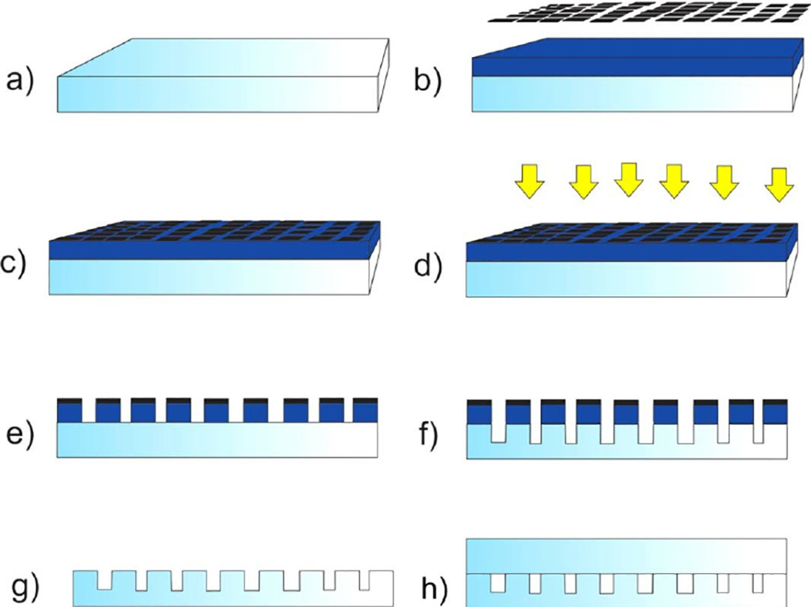
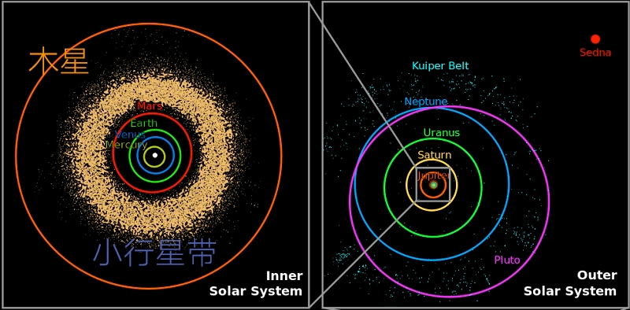
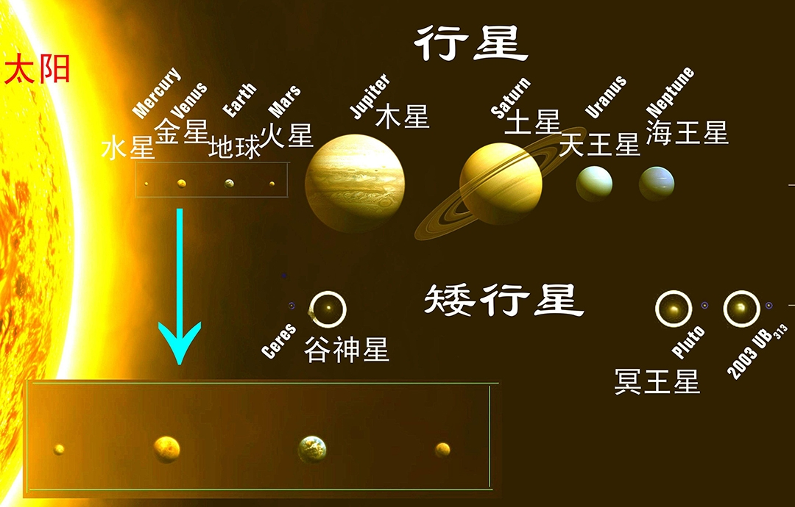
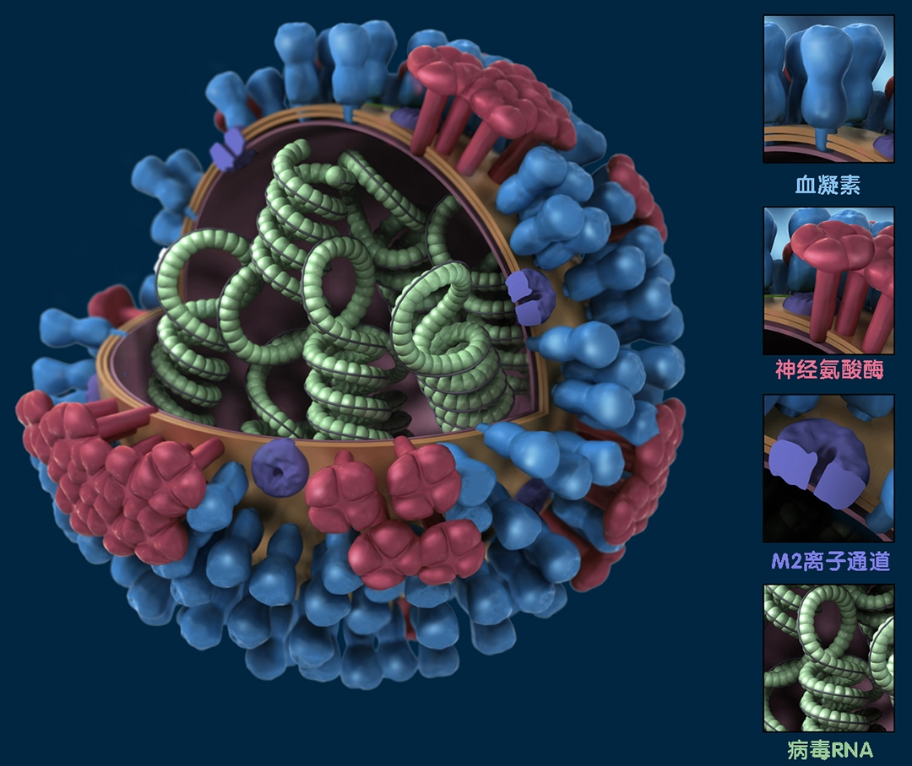
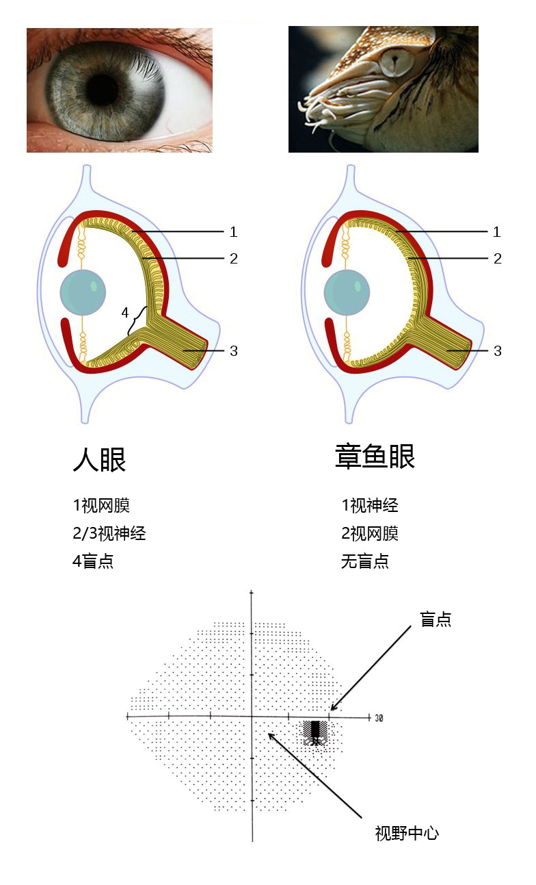
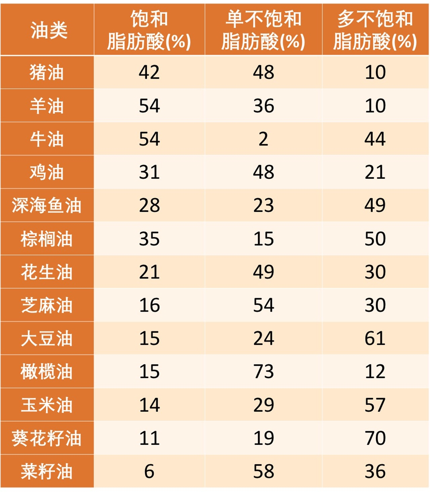

# 【DONE】《科学思维课》卓克

1. 火电厂是如何发电的呢？ 火车把煤运到火电厂，煤通过传送带送到磨煤机上，短时间内进行充分燃烧，利用燃烧煤带来的巨大能量，高温高压的水蒸气推动汽轮机转动，电就发出来了。
2. 从机械开关到电子开关的优势在开关次数的数量级提升，这就是场效应管的由来。发明人是朱利尤斯·利林菲尔德
3. 如果进一步提高开关频率，会带来巨大发热的问题。而要降低发热问题的高效思路是降低开关损耗，也就是把闸门做小，就是把芯片缩小，这样功耗就降下来了
4. 从2007年开始，这招不管用了，因为尺寸虽然变小，但是依然有电流
5. 芯片雕刻的过程：

1. 临床三期要验证的项目：没有毒性，能治病，能批量治病
2. 都说手机有辐射，手机的发射功率为1W，阳光的辐射功率为1400W，如果担心手机辐射，更应该担心阳光照射
3. 人体大约有60万亿个细胞，匀到每个细胞大约是1.2亿个阿莫西林分子，所以小分子化学药物起效并不是因为它们有能力寻找病灶，而是凭借超大规模的数量，均匀地分布在血液中，让你身体的每个细胞都被1.2亿个药物分子包围，那些对药物分子敏感的微生物就活不下去了，它们一死，病就好了
4. 电车的续航测试对环境有要求，空气阻力和路面摩擦力影响非常大，通常低温，高海拔地区的续航效果非常差，因为低温导致电池性能下降，且空气密度上升，导致阻力也增加，所以汽车厂商送去工信部测续航绝不会选择冬天，否则标称的续航里程就惨不忍睹了。
5. 身高70%是由基因决定，剩下30%就是在骨骺(hóu)线完全闭合之前的营养、锻炼、睡眠，这些因素决定的。 对身高影响最大的骨头就是大腿和小腿骨的长度，只要它们的骨骺线闭合了，那就基本决定了身高。
6. 所有的头疼都是因为硬脑膜上的血管过度充盈，刺激了硬脑膜附近的神经导致的，不论是发烧的头疼，还是高原反应的头疼，或者用脑过度的头疼，都是这样。这种刺激实际是在提示我们不要继续从事当前活动，最好找个安稳的地方休息。
7. 消炎药分两种，一种是抗生素，是杀灭细菌，另一种是抑制身体反应，让人舒服，但治标不治本。
8. 1克脂肪提供9千卡热，1克碳水化合物或者1克蛋白质提供4千卡热，1克膳食纤维提供2千卡热，1千卡有时候也被叫做1大卡，都是热量单位，指的是让1公斤水升温1摄氏度所需要的热能。【9421，脂肪、碳水化合物、膳食纤维】
9. 影响食物能量吸收的因素：食物本身热量、生熟区别（熟食容易消化，人体消化耗能少）、细菌数量、人体吸收率（饿的人更容易消化吸收）、人体自身耗能、肠道微生物.
10. 太阳系分内太阳系和外太阳系，内太阳系是4个岩石行星，就是脚踏上去有坚实的陆地，而外太阳系还有4个气态行星，它们是没有明确的边界的，就是一团气体。水、金、地、火是4个岩石行星，火星再往外走，就是第一颗气态行星木星了，但是火星和木星之间还存在一道宽宽的小行星带，就像河流一样，只要迈过去就都是气态行星了。

1. 中国的食品安全国家标准中，有几类食物是不用标保质期的，比如食盐、固态食糖、食醋、味精、10%浓度以上的酒精。因为在这些食物中微生物基本无法生存无法繁殖
2. 牛顿想出的办法，就是在边缘刻上复杂的花纹，这样造假币的就无法从上面蹭下金属了（剐蹭会把齿轮破坏掉），这个办法甚至沿用到现在
3. 侏罗山上发现了不少恐龙化石，白垩土里也发现了不少恐龙化石，然后经过时间上的测定，发现埋在侏罗山的化石和埋在白垩土中的化石在时间上相隔了几千万年，侏罗纪是2亿年前到1.4亿年前，白垩纪是1.4亿年前到6500万年前，之后古生物学家就这么叫下去了
4. 榨出的果汁浓缩成浓缩液，冷冻后送往各地。冷压技术缩写HPP，就是想方设法把果汁里的细菌全灭掉，但丝毫不破坏里面的成分，保持口感
5. 4000个大气压0-4℃高压，细菌细胞膜破裂而死
6. 诺贝尔为什么没有数学奖？因为诺贝尔的遗嘱要求“对人类做出最大贡献的人”，而数学研究的是逻辑层面的东西，没有实践
7. 我们可以看到物体的极限尺寸，是那个探测波的1/2波长。【如果一个物体的尺寸小于380-760nm的1/2，则无法用光学显微镜看清】
8. X光比可见光的波长短太多了，所以能帮我们看到蛋白质。但它还是不够短，那些蛋白质上挂的侧链还是看不清楚
9. 引力波：只有黑洞那么大质量的东西合并，在一点几秒内把四五个太阳质量，按照 E=MC² 的规律给它转化成能量，这份巨大的能量挤压了空间，给空间产生了些许的扭曲，以至于让距离这个事件发生地10亿光年以外的地球附近产生了一个空间上大约是一个原子核直径千分之一的压缩效果，我们测到了
10. 感冒指的是病毒在鼻黏膜上繁殖引起的病症，分为普通感冒和流行性感冒。眼睛中有泪管，它跟鼻子是通着的，所以你揉眼睛的时候，病毒就会顺着泪管感染到鼻黏膜上
11. 为什么大风天降温容易得感冒？因为空气干燥，风大，有利于病毒飞起来，飞到鼻腔里
12. 免疫系统杀灭病毒的一些措施
13. 利用鼻塞让更多的鼻涕瘀积在鼻腔里，然后鼻涕里的粘蛋白把病毒裹住，排出体外
14. 调高体温，让体内的一些酶活性降低，这样病毒繁殖就不那么顺利了
15. 安排出一些打喷嚏的动作，咳嗽的动作，尽量让入侵者赶快离开身体
16. 流感有三种，甲、乙、丙，甲流跟乙流是占比最大的。

1. 甲流病毒有专门的结构，表面的蛋白质有两种，一种叫血凝素，缩写是 H，一种是神经氨酸酶，缩写是 N，而血凝素又有很多很多种，比如说 H1、H2、H3、H4，这神经氨酸酶也是这样的，有 N1、N2、N3、N4，所以甲流的分型就是 H 几 N 几，这形容的就是甲流表面上那些蛋白质都是什么类型的。
2. 乙流就没有这么复杂了，它只有两种。
3. 丙流基本不会导致流行。

- 有哪些“内卷”的例子？

1. 毫无意义的精益求精。比如说有的公司开会的时候，桌面上的茶杯摆得无比整齐，非常精确，横看竖看侧看皆成行。
2. 将简单的问题复杂化。第一步先要出调研报告，然后邀请专家讨论评审，再将评审结果逐级上报，最后由领导拍板决定。
3. 低水平的重复
4. 封闭体系内越来越剧烈的内部竞争。最典型的就是今天的中小学教育，学生为了多考一点分数，被迫在教学大纲内下苦功夫，比谁做的题多，比谁做的题难。
5. 所谓的“内卷”可能只不过是社会经过高速发展之后，到达平稳发展的状态时出现的一个必然结果而已，中国因为刚刚到达这个阶段，因此社会上这两年开始关注这个问题。究其原因，可能是在社会发展相对缓慢之后，各种机会增加的速度较原先显得少了，竞争显得激烈了，仅此而已

- 中国过去40年里的那一代人，可能是全世界有史以来最幸运的一代人，没有之一。我研究了世界各国的发展历史，过去40年的中国，实现了人类历史上主要经济体唯一一次长达40年的高增长。在此之前，在中国的历史上，从有甲骨文记载的信史开始，找不到长达40年不打仗的年份。
- 进化没有方向，也没有终点。
- 黑眼圈是怎么回事儿？血管被看见了，静脉血的颜色是偏深的，所以会让皮肤映着发黑发暗
- 旧世界观，就是那种强烈的，要把某些东西分类，要给某一件事找出原因的念头，这是一种原始冲动，这种冲动也推动着我们用非演化论的观点去看世界，硬要找出事物之所以成为这样背后的那个总设计师，而实际上可能根本就没有这个总设计师。
- 每个大陆上大型的动物绝灭的时间都和人类第一次到达那个新大陆的时间吻合得非常好，基本就是几百年，上千年的时间，体重超过2吨的大家伙都被人类干掉了。
- 地球上几乎所有的动植物都有线粒体，它是所有能量的发动机，只有像蓝藻这样的原核生物没有，可是蓝藻是非常非常小的。H+离子和O结合就成了有氧生物，和S结合就成了厌氧生物
- 性别，是一种更具竞争力的生存模式。因为形状多样性会导致基因多样性
- 性别的出现，是依据生存压力出现的各种分类，生物的繁殖策略千差万别：有些是性染色体决定了性别；有些是由孵化温度决定性别；有些动物能够在雌雄间进行变性、有些是雌雄同体、有些有多种性别，甚至数百种性别；人类的性染色体也有多种组合。
- 老寒腿不是因为不注意保暖患病的，而是因为长期的软骨的磨损，外加长期饮食营养过剩造成的动脉硬化导致的，寒冷不会导致关节炎
- 陆生的哺乳类动物靠阳光来合成维生素D，皮肤做这个工作效率还是挺高的。比如说夏天穿一个 T 恤，穿一个短裤出去，20分钟晒回来的成果就能支撑一整天对维生素 D 的消耗 
- 褪去毛发的人类可以保持中速的奔跑3个小时以上，而其他的动物能坚持30分钟以上的都凤毛麟角了。所以就算草原上很多动物的奔跑速度是人类的2倍、3倍，但是它们持续奔跑的时间只有我们的1/6到1/10。
- 但因为非洲大草原日照强烈，没有毛发会导致大量的皮肤癌，所以后来又进化出了用黑色素来吸收紫外线辐射的能力。
- 冰雪的表面反射阳光的反射率非常高，往往超过70%，照在上面的阳光又被反射到太空中去了，热量大部分就没留住。可是像有土壤、有植被的地方，哪怕是沙漠，这反射力都很低，只有10%，所以阳光射过来就能把大部分能量留在地球上。
- 内陆湖的盐分都非常高，这是因为日积月累的阳光照射，把水分都蒸发到了空气中，留下盐在湖水
- 地球最近5.5亿年，生命史上一共发生过5次大灭绝：

1. 4.4亿年前死了86%的物种；
2. 3.6亿年前死了75%的物种；
3. 2.5亿年前死了96%的物种；
4. 2亿年前死了80%的物种；（盘古大陆分裂，分解南美洲和非洲）
5. 6500万年前死了76%的物种。（小行星撞击墨西哥）。而我们最最熟悉的就是6500万年前那一次，因为恐龙这种最吸引人的物种灭绝了，而且还是在小行星撞击地球下灭绝的。

- 高度近视的人要避免头部做剧烈运动。比如像拳击、蹦极、赛车、跳水，否则会导致视网膜脱落
- HIV 病毒盯上的靶子实际上就只有一种细胞，就是辅助性 T 细胞；艾滋病难以治疗，是因为 HIV 病毒的外壳蛋白容易变异，免疫系统难以识别
- 当你转了10圈之后，前庭里的液体正在剧烈地晃动中，旁边扶你的人，你也可以让他看看你的眼珠，一定是滴溜溜地乱转
- 现在全世界非常主流的玉米、土豆、西红柿、烟草、可可、橡胶，都是在哥伦布大交换之后才从美洲流向世界的。而牛奶、大豆、小麦、甘蔗、大米、高粱、苹果，这些是从欧亚大陆流向新大陆的。
- 梅毒一定程度上塑造了近代文明，贝多芬、舒伯特、舒曼、梵高、尼采、海涅等众多伟大的音乐家、画家、哲学家、诗人都是梅毒患者，免不了有很多精神失常时期的创作。
- 出生尽量要保持顺产，不要剖宫产。因为婴儿在经过产道的过程，他会不自觉地吞咽很多产道里的液体，他的皮肤、他身上的黏膜也会被这些液体裹住，液体里包含了大量的微生物，它们就是婴儿肠道微生物最早的一批殖民者。
- 章鱼视网膜在前面，视神经在后面，光线直接照在视网膜上，没有盲点；而人的视网膜在后面，视神经在前面，后面的视网膜感光完成后通过前面的视神经传输给大脑，中间开个孔，这个孔就是盲点

1. 雄性鼹鼠没有Y染色体，这可能是哺乳动物的未来
2. 把任何射过来的电磁波都转化成自身热能的一个物体，这样的物体就叫做黑体
3. 树木：500W焦耳/kg；煤（陆生植物尸体）的燃烧效率：2000W焦耳/kg；标准煤：3000W焦耳/kg；石油（水生植物尸体）：4300W焦耳/kg
4. 油页岩是石油的初步形态，需要继续沉淀很久才会形成油田
5. 贫血主要因为缺乏微量元素
6. 对比猪肝来说，红枣的补铁效率只有猪肝的1/126。多吃猪肝可以补铁，猪血的铁含量比猪肝还要高8倍，但是因为含量太高了反而不好
7. 牙膏加氟对牙齿有好处，氟离子会取代原来牙齿表面上的氢氧根离子，牙齿表面的成分会从磷灰石变成氟磷灰石。而氟磷灰石比人类牙齿表面本来的成分更耐磨，更耐腐蚀
8. 人眼的分辨率是0.1度，距离300公里外，在视网膜上能分辨的最小距离是523米，因此我们无法在太空中看见长城
9. 止咳的原理在于清除肺部黏膜上的病原体，最有效的液体就是糖分，所以棒棒糖都比梨有效（川贝枇杷膏）
10. 不要吃那些药品名称里就包含了疗效的药物，例如“止咳水、止咳糖浆、克咳片、消咳片、定喘止咳片、止嗽丸、保肺丸”；现代医学止咳药“右美沙芬、苯丙哌林、盐酸那可汀、喷托维林”
11. 地球上南北半球平静的水面下出现的漩涡是顺时针还是逆时针，都有可能，是由水中那些我们都察觉不到的因素造成的影响，那些因素的影响也依然比科里奥利力要更强
12. 食用油的主要成分是脂肪酸，一般纯度在99.5%以上
13. 食用油中的脂肪酸有三种：单不饱和脂肪酸、多不饱和脂肪酸、饱和脂肪酸（会积累一些坏的胆固醇）
14. 饱和脂肪含量低，同时单不饱和脂肪酸含量高，是特别好的选择，满足条件的是：菜籽油、芝麻油、橄榄油
15. 饱和脂肪含量高的油：动物油、椰子油、棕榈油

1. 皮肤好坏有这么几个因素构成
2. 第一，是皮肤有没有被感染的地方；
3. 第二，就是毛孔有没有被堵塞的地方；
4. 第三，是水分是否充足；
5. 第四，是皮脂分泌是不是合适；
6. 第五，是细胞的新陈代谢的情况。
7. 面膜只能解决3、4两个问题
8. 空调1度电的使用条件：密封性、隔热性非常好的建筑材料，一个小房间只有一面外墙和一个小窗户，周围都是28摄氏度的温度的时候，室内没有其他任何用电器，人还是睡眠状态，只有一个人他不能活动，空气的湿度还要低于30%，它是真的可以达到8小时只耗1度电的
9. 一个人平静时候的发热功耗：70W，8小时差不多0.56度电
10. 角度的单位本质上是一个比例，是一个数字，因为任何一个东西旋转一周，然后再把这一圈均匀地切成360份，每一份的大小就是1度
11. 单位化标准大思路就是用完全抽象化的逻辑概念、不变量来提到原先通过实验测量出来的物理量
12. 电流，在真空中相距1米的两根无限长平行导线，通过相等的恒定电流，当每米导线上所受到的力是2×10^（-7）牛的时候，每根导线上流过的电流，这个时候是 1A；从1946年起，安培这个定义就改了，改为了由单个电子携带的电荷的量
13. 温度，不再用水，二用玻尔兹曼常数定义
14. 摩尔，以前用多少个碳12原子来定义的。在1971年，也就改为用阿伏加德罗常数来定义，它也脱离了具体的实物原子
15. 精子跟卵子形成受精卵之后，最初这个细胞就是干细胞
16. 酒精都是通过肝代谢掉的，酒精（乙醇，有害）->乙醛（有害，氨基这一端是很容易跟乙醛结合上）->乙酸（无害）->二氧化碳+水，最终代谢完全
17. 某一个成就，如果不是由某一个伟大的人做出来的，大概率说还会有另外的伟人在那个时间点附近作出差不多的结果。 
18. 牛顿万有引力。胡克也有可能发现
19. 牛顿惯性定律。伽利略的斜坡实验跟惠更斯的碰撞实验离这一步的结果也不远了
20. 牛顿微积分。莱布尼茨
21. 爱因斯坦。亨德里克·洛伦兹。因为实际上狭义相对论最重要的工具就是洛伦兹变换
22. 司南并不能指南，因为勺子太重了
23. 治疗严重偏头疼最早出现的有效药物就是从麦角胺开始的。这种物质出现在过期的粮食里，会强烈的收缩血管，导致手指头和脚指头缺血坏死
24. 舌头可以分辨出多少种味道，答案还是5种，酸、甜、苦、鲜、咸。没有辣，辣是痛觉。
25. 大部分的牛马羊也都不爱吃青椒，因为青椒是苦的，这种苦是由青椒里的生物碱带来的；对动物来说，苦味儿是判断食物有没有毒的重要标志
26. 人体总处于能量过于充沛的状态，就会产生更多自由基，造成细胞出现损伤，所以轻断食，或者说适当地保持饥饿状态，对身体是有益的，有助于抵抗衰老。
27. 自由基的另外的功能就是它很可能提供了一个警报信号，就是告诉机体，你要开始启动自我修复的机制了。这种信号越多，自我修复的功能就越强，带来的正面效果反而比自由基带来的负面效果大得多。
28. 线粒体质量的下降是导致衰老的重要因素，线粒体既是供能的单元，也是执行死刑的单元。
29. 颈椎病就是颈椎间盘挤压周边的组织
30. 第一类，是挤压了脊髓。走路像踩棉花一样
31. 第二类，是挤压了椎动脉。脑供血不足，头会非常晕
32. 第三类，是神经根型
33. 第四类，是压迫交感神经
34. 如何减缓颈椎病：每隔三四十分钟，用脑袋在空中画10个农田的“田”字，还有就是买一个合适的枕头
35. 二维码的4个角上，除了右下角以外，在其他3个角告诉手机二维码这张图在哪里，方向是朝哪边的，右下角虽然没有大眼睛，但仔细看，你能看到这张图横平竖直地还分布着22个小眼睛，它和3个大眼睛配合在一起，用来调整图形畸变。
36. 最低版本是21×21个格子，最高的是177×177个方格
37. 纠错码可以纠多少错误是有分级的，有7%，15%，25%，30%四个级别，也就是最多遮挡住30%的区域不影响解码。
38. 骨头中的钙极少能溶于水，通过喝骨头汤补钙从根本上就是没有希望的，而且99%以上的其他营养物质也都在肉里
39. 虾皮虽然含钙量比较高，但盐含量过高，用其补钙得不偿失
40. 人体的骨密度处于动态中，钙只是其中一种原料，单纯吃钙片补钙，或者添加维生素D，对中老年人预防骨质疏松、预防骨折没有用。
41. 通过喝牛奶，以及适量的运动，是最好的保持骨密度的方式。
