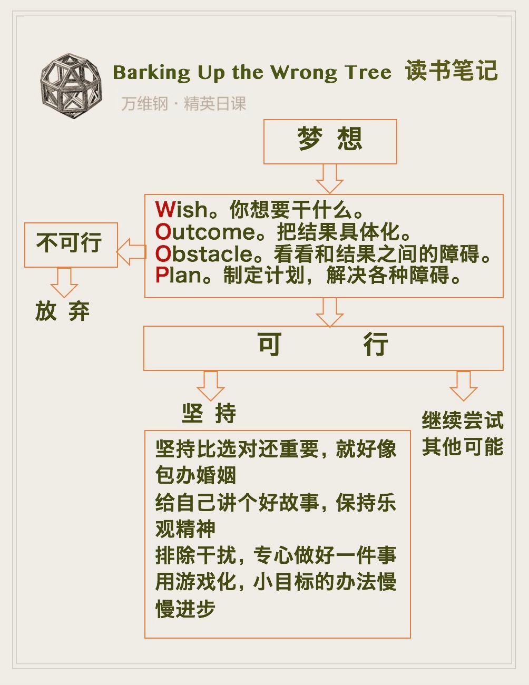
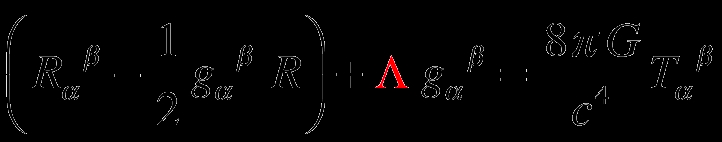
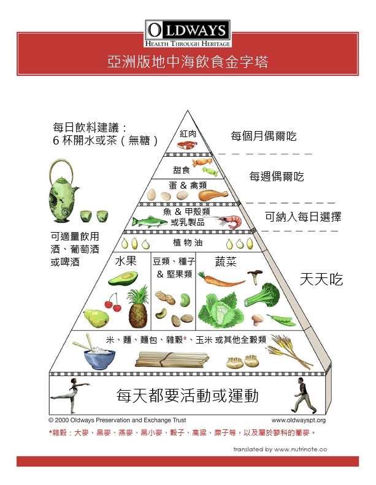
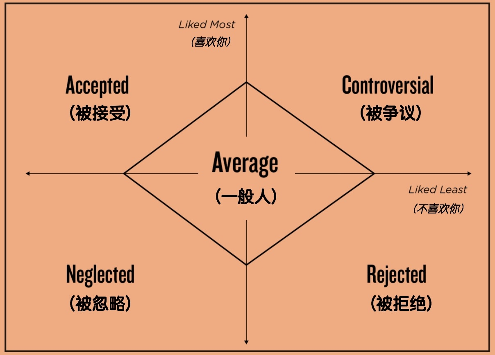
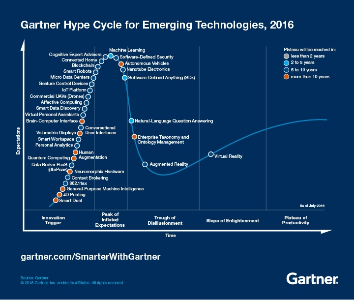
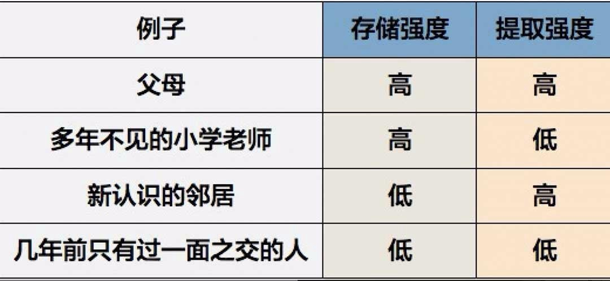
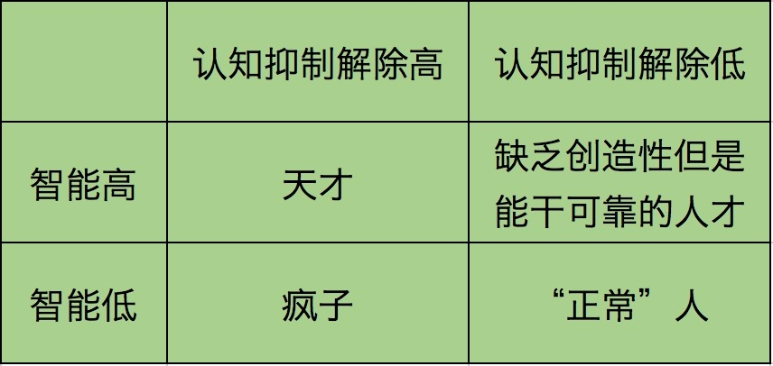
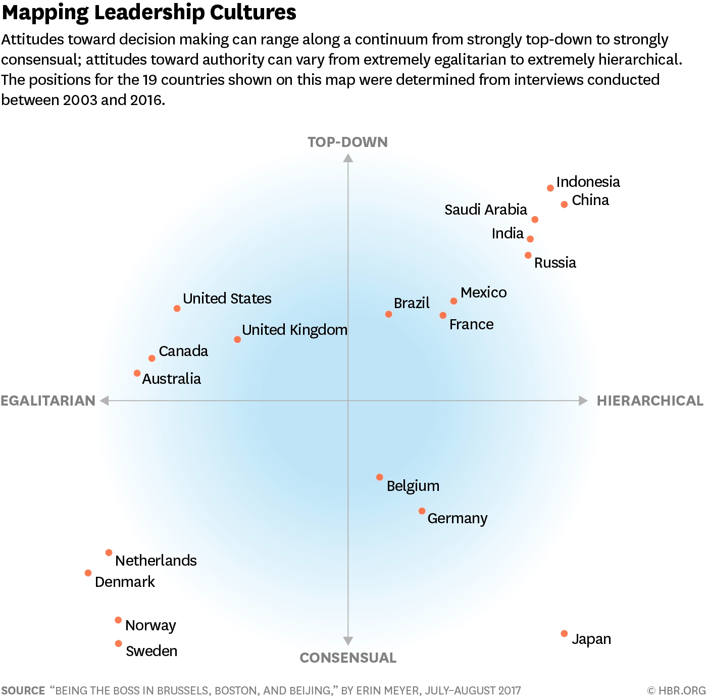

# 【DONE】《精英日课第一季》万维钢

精英能够理解复杂的抽象概念，而普通人处处使用简单形象思维 •  &#x20;

精英探索未知，而普通人恐惧未知 •   精英能从长远打算，而普通人缺乏自控 •  &#x20;

精英注重个人选择和自由——尼克松正是用这一点说明为什么美国需要不同型号的洗衣机，而普通人认为别人应该跟自己一样 •  &#x20;

精英拥抱改变，而普通人拒绝改变 •  &#x20;

精英跟各个阶层的人都有交往，而普通人只跟本阶层的人交往 •  &#x20;

精英爱谈论想法，而普通人爱谈论人和东西 •  &#x20;

精英把自由时间花在学习上，而普通人把自由时间花在娱乐上

# 《未来简史》

1. 历史学家的作用不是在紧要关头告诉我们下一步的历史一定会往哪个方向走，反而恰恰是告诉我们你可以想象多种不同的可能性，让历史往一个不一样的方向走。“ 学历史最好的理由，不是为了去预测未来，而是把你自己从过去解放出来，去想象不同的命运！”
2. 赫拉利以历史学家的眼光告诉我们，智人要向“神人”演化了。为此我们正在干三件事：
   1. 第一是追求获得永生；
   2. 第二是追求幸福，
   3. 第三就是直接成神
3. 所以农业社会的人认为神是第一个可宝贵的，人是第二个可宝贵的。位列其他所有动物之上。
4. 赫拉利说，但是单个人的这个功能还不算厉害，真正厉害的，能让人群实现大规模的灵活合作的，不是个人想象出来的主观现实，而是所谓“ 互联主观（Intersubjectivity）” ——人幻想出来的虚构的东西，而且还能让人人都相信。
   1. 上帝、国家、金钱、公司、价值观，这些都是我们想象出来的互联主观[^1]。
5. 真正有权势的人类组织根本不在乎真相如何，他们在乎的是把虚构出来的信仰强加给每个人，并且利用这个信仰去改变真实的世界。
   1. 比如金钱，就是政府虚构出来，并且把价值强加给我们。
   2. 学位证书也是虚构的。
   3. 宗教更是这样。
6. 苏美尔人崇拜天上的神，跟我们今天崇拜“苹果”这个品牌有什么区别？古埃及人崇拜地上的法老，跟我们今天崇拜贾斯汀·比伯有什么区别？
7. 虚构的强大力量，不在于它距离真实有多近，而在于它能把更多的人有效地组织在一起，促进这些人的合作。以此来说，其实很多东西都可以被称为“宗教”。
8. 满足下面这三个特点的，就是宗教：
   1. 它有一套号称不是人发明的，而且不能被人改变的道德法规（moral laws），要求人们必须遵守；
   2. 它给人们一个许诺：只要你遵从这套法规，就会有什么什么好处；
   3. 它的目的是为了巩固自己设想的社会秩序。
9. 人文主义，倡导我们崇拜人性，用人性取代过去宗教里神的位置，用人的体验，给外部世界制造意义。
10. 一个文明人，要善于体察各种细微的感觉，否则你就是个粗人。赫拉利说：“我们的一生之中，有时候我们伤害别人，或者被伤害；有时候我们同情别人，或者被同情。如果你去注意体会这些伤害、同情的感觉，你就会越来越敏感，那么这种体验对你来说就是一种很好的道德知识。逐渐你就会分辨对错，成为更有智慧的人，这就是人生的旅程。”所以有人就说，人为什么活着？活着就是要追求尽可能广的体验，以期从中获得智慧。
11. 所有人文主义者都认为“人的内心体验”是第一位的，一切道德应该从这里出发。
12. “正统”的人文主义，也就是我们今天说的自由主义——也就是现在欧美发达国家的主要意识形态。自由主义者认为不管是谁，每个人的内心体验都是重要的，都会让世界变得更丰富多彩，所以你应该赋予所有人自由表达的权利。
13. 社会主义的人文主义者，认为自由主义者太过强调个人的感情，尤其是太过强调了每个人自己的感情。
14. 进化人文主义者，则认为“所有人的情感都重要”根本就不对，有些人就是比另一些人强，我们应该让那些优秀的脱颖而出！如果你所谓的“优秀”是按人种分类的，那你就是纳粹。
15. 比如一个人说我想要什么就可以去追求什么，那我就是自由的——错了，这不叫有自由意志。大猩猩、狗和鹦鹉也可以想要什么就去追求什么，这没什么高级的，只不过是被欲望驱使。 根据欲望，想要什么，就选择什么，这是纯机械化的过程。科学家说的自由意志，是人能不能“选择”自己的欲望。【选择自己增长知识的欲望？】
16. 叙事自我评估一段经历的时候，对这段经历的长短没有感觉，而只在乎这段经历中感受最强烈的部分，和结尾的部分。这叫做“峰值— 结尾规则”（peak-end rule）。
17. 人既没有自由意志(被欲望驱使，没有能力去自由选择欲望，和猩猩动物没啥区别)，也没有单一的自我(左脑和右脑的不协同)。
18. 神人搞认知升级，会主要着眼在对经济和政治有用的各种能力上。市场和经济系统要求他们做出这些升级的同时，也会要求他们把另外一些认知能力给降级！
19. 原始人有非常敏锐的嗅觉。他们甚至能闻出来*恐惧*的味道——当人恐惧的时候，身体会散发某种化学物质。这个能力现在已经退化了，因为跟多人相处的时候这个能力没用。古人很可能比我们有更高的注意力，走到陌生环境能迅速识别各种细节，这个能力现在大多数人也没有了
20. 赫拉利考察当代科技精英的思潮，认为有两种新的宗教，可能会在不远的未来取代自由主义的地位。第一种叫做“技术人文主义（techno-humanism）”，就是要以神人取代智人，但这个过程可能会有副作用。

# 《无为》

1. 无为首先是一个个人状态。森舸澜说，无为就是“not trying”，不刻意追求，不用意识控制，好像特别放松的去做一件事，结果做得非常自然。注意，有些人误以为“无为”就是什么都不做，所以得出结论说老庄的思想特别消极，那就错了。森舸澜理解的无为不是不做事，而是做得特别自然，让人感觉他毫不费力。不生硬不刻意，还要有灵气，这才是无为
2. “刻意”，就是 ACC 和 lateral PFC 同时打开。任务主要由慢速的冷认知系统【系统2】完成，整个动作是有意识的。
3. “熟练”，就是 ACC 和 lateral PFC 同时关闭。任务主要由快速的热认知系统【系统1】完成，整个动作是无意识的。
4. 扫描发现，这时候他脑子中的“救火队”，也就是 lateral PFC 关闭，但是他的“报警器”，也就是 ACC，反而增强了！钢琴家没有刻意控制自己的身体，也不在意手指怎么运动，但与此同时，他对周围环境有非常机警的感知。
5. 越是追求无为，就越无法达到无为。这就是为什么有时候一个名演员在台上突然不会演了。有的运动员在场上突然就不会做动作了。
6. 森舸澜说，中国古代这些先贤，道家也好儒家也好，其实都在追求无为，他们的分歧是在于怎样达到无为。孔子和荀子这一派认为必须经过艰苦训练才能达到无为的境界。而老子这一派认为无为是人的天性，人只要发掘自己的天性，跟大自然和谐，就能达到无为。
7. 孔子认为，热认知主导的、人的天性，就如同野马和洪水，绝对不能放任自流，必须用冷认知加以控制
8. 移情作用来自人脑中的“镜像神经元”。因为有镜像神经元的存在，我们看别人受苦，感觉就好像自己受苦一样，这就是我们为什么看电视剧都有可能流泪，这是天生的。
9. 达到无为的四种方法：
   1. 孔子主张以冷认知为主导，通过勤学苦练，把先王的智慧凝结在人的热认知之中，是 try hard not to try；【系统2学习，固化到系统1中】
      1. 在学习任何技能的初期，我们应该用孔子的办法，勤学苦练，搞沉浸式的教育体验，争取习惯成自然【低复杂度的活动，如钢琴、体育等】
      2. 在培养孩子习惯上采用孔子的观点，通过勤学苦练形成好的学习及生活习惯
   2. 老子主张直接关闭冷认知，只保留“好的”热认知，是 stop trying；
      1. 具体做事的时候，尤其是要做那些能够影响别人的大事，我们应该参考老子的思想，不轻易干扰复杂系统
   3. 孟子主张人天生就有好的热认知了，应该把这些好的热认知给培养壮大，而不必用冷认知强行建一套新的热认知系统，是 try, but not too hard；
      1. 培养艺术品位，提升道德水准，我们可以用孟子的办法，找到身上的闪光点作为种子，慢慢发展壮大
      2. 在孩子日常陪伴过程中采用孟子的办法，看到孩子本身的优点，并及时的给予表扬，通过持续不断的正向引导来壮大热认知系统
   4. 庄子跟着感觉走，事先不做任何对和错的区分，是 forget about trying / not trying
      1. 如果面对一项压力巨大而又特别重要的工作，我们就应该学习庄子，忘记自我，让热认知引导我们发挥水平
      2. 在孩子兴趣的选择上采用庄子的观点，跟着孩子的感觉而不是我们认为好的选择走
10. 森舸澜说，这四个方法其实都有道理，都可以帮你达到无为。每个人应该根据自己的性格喜好选择不同的方法，而且在人生的不同阶段，也可以使用不同的方法。

# 《混乱》

1. 分心也好，任意的震动也好，其实就是给创造过程来一点不确定性。而真正的创新者，不但不怕不确定性，还要时刻欢迎，甚至主动增加一点不确定性。
2. 如何提高团队凝聚力[^2]。
   1. 第一招，是“按人分组” 。把相似的人分到同一个工作小组里，这个小组天生就有凝聚力。这里的“相似”可以是任何相似 —— 对某个大问题的看法相似、工作风格相似、人生经历相似、甚至是按照同乡、同学分都可以。
   2. 第二招，是“树立外敌”。本来一个团队内部可能会有各种摩擦，但只要他们意识到现在有个近在眼前，实力相当的外敌存在，团队很容易就会团结起来一致对外。
   3. 第三招，是“解决问题”。要想完成这任务必须得人人出力，而且还必须配合，这时候两个队伍就团结起来了。
3. 四个好朋友组成的团队，成绩远远不如三个好朋友加一个外人的团队。多样性高，决策准确度就高。
4. 所谓促进创新的办公室，其实无非就是两点：
   1. 它在设计上要能促进不同部门的交流。
   2. 它要给员工充分的自主权。自主权比交流机会更重要。这就是为什么强势的乔布斯最后也妥协了，改为在每层楼都设计了卫生间 —— 好在乔布斯大楼里还有很多其他地方可以交流。如果员工对办公环境没有自主权，一切设计和风格全是老板定的还不能更改，那不管你这个风格是极简还是混乱，你都是在“刻意地创新” —— 那就不是真的创新。
5. 我们到底应该在什么情况下探索新事物，什么情况下专注于已有的东西呢？
   1. 第一，年轻时代要大胆探索！
   2. 第二，随着年龄增长，要慢慢学会利用已有的信息，专注于收获。
      1. 人老了以后，就更希望能够专注于自己先前已经建立的关系[^3]。这也是为什么当一个年轻人到一个完全陌生的城市去上大学，周围都是陌生人，依然能够兴高采烈。但如果你让老人住进养老院，同样身边都是陌生人，他们就不会开心。这是因为老人的时间更宝贵，年轻人时间更充裕。前者折腾不起，愿意和家里人共度时光，年轻人有大把时间体验新的生活
   3. 第三，慢慢变老的过程中，我们的生活其实是越来越好。
6. 研究表明，随着年龄增长，我们的精神状态和生活状态都在越来越好。如果你已经知道自己喜欢什么，你就会很乐意被自己喜欢的事物所包围。
7. 当你看到一位老人，每天跟同一个人，去同一个餐馆，坐在同一个座位，点同样的饭菜，你可能以为他的生活很无聊 —— 殊不知这才是最浪漫的事，他是在享受自己用一辈子的时间所探索出来的成果！

# 《指导生活的算法》

1. 有些人做过大量功课，掌握了丰富数据和资料，为什么他们的决策水平，反而不如大佬短短时间内的快速判断？你的模型越写实，你的最终效果反而可能越差！数学家，管这个叫做“过度拟合”。
2. 你的模型想要一丝不苟地反映已知的所有数据，它对未知数据的预测能力就会非常差。这是因为所谓的“已知”数据，都是有误差的！精准的拟合会把数据的误差给放大 ——拟合得越精确，并不代表预测结果就越准确，拟合得过度精确后反而结果更加糟糕。一个好的模型不应该对数据如此敏感！
3. 面临重大决策 ，有时候没必要考虑太多细节，还不如当场念两句诗。
4. 如何抓住重点？[^4]
   1. 第一，限定思考时间。
   2. 第二，限定内容长度。
   3. 第三，在白板上讨论商业计划，要使用粗的马克笔。粗笔容易让人抓重点
5. 时间管理的方法：
   1. 小事优先 —— 根据GTD（ Getting Things Done ）理论，你要追求的是一个心止如水的境界：准备几份任务清单，只要时间地点合适，凡是能干的事儿就马上干，完成任务打了勾就可以把这件事儿给忘了
   2. 要事优先 —— 每天一到办公室，就要先做完今天最“ 重要 ”的三个任务
   3. 急事优先 —— 很多任务是有期限的，你应该事情分为四类：重要而紧急，重要不紧急，不重要但紧急，不重要也不紧急。我们应该优先完成重要而紧急的事情。
6. 做事建议：
   1. 对于紧急的事情：
      1. 如果你的任务都是有截止日期的，那就是按照截止日期的早晚安排任务，先做最早截止的任务。
7. 对于小事和要事：
   1. 如果这个任务牵涉到别人的等待时间，我们就应该用“小事优先” —— 也就是完成时间短的任务优先的原则。
8. 你先估算一下每个任务的“重要程度”，然后你算一算每个任务的“密度”。一个任务的密度 = 重要程度 / 完成时间。然后你就按照任务的密度从高到底的顺序去做事。这就能让你总的心理负担最小。我们把这个算法，叫做“ 加权最短处理时间 ”算法。该算法使用了任务密度概念，同时考虑了重要度和时间两个维度

# 《成功与运气》

1. 个人运气的规律大约有三条，咱们姑且称之为“ 运气动力学 ”。 
   1. 运气可以放大。人类社会是个非线性的复杂系统，这意味着初始条件好一点点，最终结果不是按比例也好一点点，而是很有可能不成比例地把初始优势放大很多很多。
   2. 运气可以累加。当然我们不是说盖茨全靠运气成功，天赋和努力就不重要。我们说的是，在某些领域，光有天赋和努力远远不够。
   3. 竞争越激烈，运气越重要。弗兰克介绍了一个计算机模拟的实验。假设有这么一种比赛，决定胜负的因素中，天赋和努力占95%，运气只占5%，你猜最后取胜的是什么人？—— 结果是只要参赛者足够多，最后胜出的都是运气特别好的人。这是因为比赛中有足够多的高手，他们的天赋和努力值都非常高，那么这些人之间又比什么呢？当然是比运气。
2. 可得性启发法”（Availability Heuristics）—— 人们在进行判断的时候，总是依赖最先想到的经验和信息。比如说，你经过一番努力，取得了一个了不起的成就。当你回顾这段经历的时候，你最难忘的，一定是自身在其中付出的努力，而容易忽略外界的偶然因素。即使当时你觉得非常幸运，但时间过去你就容易忘记。所以过段时间之后，连你自己都会认为成功是自己努力的结果。
3. 人们特别容易记住自己逆风前行时付出的努力，而忘记顺风时的幸运。
4. 如果你要计划将来，你就应该相信未来尽在你的掌控之中，只要付出就能有所回报 —— 哪怕这只是一个幻觉，你也应该相信它，只有这样你才能全力以赴。但如果你已经取得成功，回顾往事的时候，你应该意识到你的所得超出了你的应得（you got better than you deserved），你应当为此感到庆幸。
5. “检验一流智力的标准，就是看你能不能在头脑中同时存在两种相反的想法，还维持正常行事的能力。”
6. 一个人的生活幸福感，很大程度上并不是由绝对的物质水平决定，而是跟周围人比较出来的。
7. 想要跟人合作，你最好有一个“好人”气质。这个气质怎么修炼呢？弗兰克说，最好的办法就是你要承认自己的成功之中有运气的因素，不要把所有的功劳都归于自己。一个承认运气的人，自然不会去抢别人的功劳，那么合作者就会信任他。

# 《平均的终结》

1. 平均脸、标准人，不过是人为想象出来的概念，在实际应用中并没有多大意义。人与人之间的差距比我们想象中大得多，根本没有人真的符合“标准”！如果你发现自己的某个特点和“一般人”不同，千万不要焦虑，不一样就对了 —— 一般人都跟一般人不一样，每个人都是独一无二的。
2. “泰勒制”的核心思想，就是这个标准化。我不要求你做得多，我也不要求你做得快，我要求你在标准的时间内完成标准的工作量。泰勒说，只有一种好的工作方法，那就是标准的工作方法。
3. 一个人的SAT（相当于中国高考）成绩，和这个人的工作能力毫无关系；毕业院校和工作能力也没关系；是否曾经在编程比赛中获奖，和工作能力也没关系；在大学的学习成绩，和工作表现有关系，但这一点只在毕业三年内有效 —— 也就是说，如果一个人已经毕业超过三年了，再看他在大学里的学习成绩就没有意义了。这些结论是针对已经在Google工作的人调查得出的统计结果。一个人能进Google，他必然满足一个基本的学历和编程技能门槛 —— 如果你考察加油站工作人员和程序员，你肯定会发现上面说的那些统统有关系。
4. 正田裕一据此提出，人其实没有什么“本性性格”。他在这个情境下是一个性格，在另一个情境下完全可以是一个相反的性格[^5]。就算你把不同的情境都考虑到，给他算个性格平均值，又有什么意义呢？
5. 最科学的方法，是考虑一个人的“如果…就…特征”（If-then signatures）。每个人的性格不再是一组标签，而是一系列的列表，也可以说是一份有点复杂的使用说明书 —— 如果这个人在陌生人面前，他就表现得内向；如果这个人在熟人面前，就表现得外向；如果这个人面对压力的时候，就表现得有点内向；如果这个人在办公室里，就表现得特别外向……
6. 过去，我们都有个观念，学什么新东西，学得快就表示聪明，学得慢就是笨。而现在心理学家看来，学习的快慢，和我们昨天讨论的“性格”一样，并不是一种“特性”，而是与“情境”相关的。有的人学这个快，学那个慢；有的人学这个慢，学那个快 —— 你并不能从一个人学习某个特定东西的快慢来判断他的能力。

# 《注意力商人》

1. 人的注意力有两个特点：
   1. 第一，你任何时候都在花费注意力，不用在这里就用在那里，随时产生随时花掉，既不能关闭也不能攒起来 —— 所以商家要争夺你的注意力，是有充分机会的。
   2. 但是第二，人的大脑还非常善于忽略信息，实际接收到的信息中绝大部分都被忽略掉了，越常见的，越容易忽略。这就意味着如果你仅仅拿信息轰炸读者，是争夺不来注意力的。 而且人脑的适应能力非常强。哪怕是新奇有趣的内容，也会很快变成熟悉的事物，然后就会被忽略。
2. 所以注意力生意其实并不好做，你必须不断地推陈出新，加大剂量给读者新的刺激 —— 最直接的策略，就是往越来越低俗的方向走。
3. 低俗是大众传媒的本质。看完内容还抱怨低俗，是你把注意力用错了地方。
4. 以前人们对广告的理解是提供信息，在消费者和产品之间牵线搭桥 —— 你有这个需求，我告诉你哪家的产品最好。可是高层次的广告，却是要在原本没有需求的情况下，去发明创造一个新的需求。
5. 在政治派别的竞争中，最关键的并不是争取对方阵营的人，而是把本方阵营的人留住！美国广告人早在1920年代就意识到了这一点，品牌的目的就是为了培养忠诚的消费者。广告商想让你像皈依宗教一样皈依品牌。这就是为什么在人人都早就知道可口可乐是什么东西的情况下，可口可乐还在不停地做广告。
6. 一个不了解这些内容的人可能会认为商业是现代社会的副产品，广告是商业的副产品。可是事实上，也许商业是广告的副产品，现代社会是商业的副产品！现在全反过来了。人民需求是发明创造决定的，品牌是比口碑先进得多的武器，买东西买的是一个精神追求，广告商可以改变社会规范。
7. 宣传的对象绝对不是知识阶层，而是文化程度不高的底层大众。面向有科学思想的知识阶层做宣传是毫无意义的。
8. 宣传的目的是引导，而不是告知。你要敢于让别人照你说的做，甚至照你说的想。
9. 宣传的手段是重复[^6]。普通大众接受信息的一个特点是速度非常慢，说一遍他们可能根本没有记住，一定要重复、重复、再重复。
10. 宣传的内容不能复杂，也不要列举一大堆道理，只要总结出来简单几条即可。最好是口号化，反复重复这几条口号，一直到这些口号深入人心，达到能主导人的思想的程度。
11. 宣传要调动感情。动之以情比晓之以理有用得多。教育、劝说的效果都不如直接诉诸感情。

# 《流行制造者》

1. 个人电脑一开始就有杀手应用 —— 所谓杀手应用，就是能让你为了干这件事儿而去买电脑的应用 —— 这当然就是游戏。早在八十年代初期，个人电脑就开始迅速在美国家庭普及，人们买电脑不是为了搞科研也不是为了处理账目，而是为了打游戏！所以这个原理就是，要想让一个新东西流行，它就必须得有一个杀手应用。
2. 电子邮件不是应用户需求而生的。它是政府科研经费多到没处花，弄了个形象工程，想到要给这个形象工程找点用处，才被发明出来。电子邮件在问世很长时间内，只是用于政府和科研单位传递消息，不为外人所知。
3. 网页广告、网上购物、隐私大数据，这些都是特别能赚钱的好东西。可是最早实践这些想法的公司，都死在了沙滩上。其中最根本的原因，大概是当时的技术条件不允许。网络速度慢，计算机性能差，广告不可能做得很好看，甚至大部分商家根本没有网站让你连过去。图片显示不了，网上购物就不可行。网上购物都不可行，网上广告就更没用。至于说开发用户数据，不用说计算和存储能力，就连成熟的算法理论都是近年才有的。
4. 简而言之，现在心理学家认为，明星 = 像我们 + 超越我们。这就和咱们日课上周文章《喜欢 = 熟悉 + 意外》是一个道理。不像我们，我们不感兴趣；不超越我们，我们觉得没意思。
5. “像我们”的极致，就是演技为0的普通人也能当明星。“超越我们”的极致，就是有名仅仅是因为有名。对现代的很多明星来说，演技和长相都是获得名望的敲门砖而已，而且最好的敲门砖其实是运气。怎么出名不重要，重要的是出了名以后怎么经营这个名望。【暴不暴富不重要，重要的是暴富之后怎么继续暴富】
6. 直接上广告，就影响用户体验；不上广告，就赚不到钱。怎么办？扎克伯格从Google的成功中悟出了一个道理 —— 只有在一种情况下，广告才不会影响用户体验 —— 那就是给用户看他本来就想看的广告。
7. 纵观全书注意力商人的历史，有一个规律非常明显—— 技术进步推动文化变革。每次出现新的技术，注意力商人就要探索新的开采注意力的手段。对报纸和电视，注意力商人都是很快就找到了盈利的方法；而对互联网，注意力商人探索了很多年。
8. Facebook上的交友是相互的，如果你是我的朋友，那我肯定也是你的朋友，就像生活中的朋友一样。而在Twitter里，你可以直接关注任何人，而不必经过他的允许。这个设定，使得Twitter天生就是个追星工具。我们上Twitter的最主要目的就是看那些名人又说了什么。
9. 乐句重复，主歌重复，副歌重复，主歌副歌编排重复，你要喜欢还会把整首歌重复播放很多遍 —— 这就叫“分形式的重复”。重复带来满足，满足带来喜欢。重复的模式：BBBBC - BBBC - BBC - BC - D。我们一方面喜欢熟悉的东西，一方面又不愿意承认我们喜欢熟悉的东西，我们自我感觉总是在追求新东西。
10. 观众到底爱看什么样的剧情？这个问题现在已经被人破解了。 答案是：只有一种故事。一个普通人，一段从已知世界到未知世界的旅程，在经历了一系列小磨难之后，面临一场终极考验，最后他战胜了这个考验，完成了从小人物到大英雄的转变。[^7]
11. 好故事还需要三个元素 —— 
    1. 要能鼓舞人，这意味着主人公一开始是个有缺点的小人物，到剧情结束的时候他不但取得了胜利，而且克服缺点完善了自我；
    2. 要可信，这意味着英雄不能是无敌的，也不能是一上来就说我要担负重大使命，他必须经历一番挣扎才接受这个使命；
    3. 要有悬念，英雄的征途上必须遭遇各种小失败。
12. 英雄的每个伙伴，要代表英雄的一个性格侧面。伙伴之间会发生一些小矛盾，这些矛盾就代表了英雄内心的冲突。英雄取得最后胜利的同时，他身上的各种性格冲突也要达成高度统一。
13. 你只能在一个人还处于儿童期的时候，改变ta对食物的喜好。过了这个窗口期想要改变就非常困难了。这可能也解释了为什么中国人永远非得吃中餐。
14. 我们对音乐的喜好也有窗口期。这个窗口期是在十几岁到二十几岁之间。更小的小孩更喜欢去尝试各种各样的风格，无所谓喜欢不喜欢；过了窗口期，一个人的音乐喜好就定下来了。在线音乐服务Spotify，2015年有个研究发现，大多数人从此不再听新歌手的歌曲的精确年龄，是33岁。过了33岁，我们基本上只听自己年轻时候听的那些歌。
15. 有些人不管多老都能接受新鲜事物。他们能听得进去新歌，能喜欢年轻人喜欢的明星，能接受女英雄当电影主角。如果时代变了，他们可以否定自己年轻时候的偏见。我看像这样的人，才算代表了“先进文化”。
16. 所谓的“时尚品位”，必须有一个时间变量。现在的好品位，几年前和几年后都不是好品位。【绅士戴帽子、中山装】
17. 时尚的内在规律是人们对一个东西的社会流行度的反应。有些人因为流行而喜欢，有些人因为流行而反对，大多数人选择“比较熟悉但又不是特别流行的东西” —— 熟悉而又有点意外 —— 结果他们引领了流行。
18. 所谓幽默，就是“温和的违反（benign violation）”。
    1. 可以是违反一个社会习俗，可以是违反身份，也可以是违反逻辑，违反什么都行，但是不能过头，必须是\* 温和的 *违反 —— 看到这样的情形，我们就会笑。一个人跌倒了，他违反了站立或者走路的正常方式，所以好笑。福特的双关语，本来大家是在说总统，他* 违反话题 \*突然提到汽车，所以好笑。用中国话说，就是在一个本来是一本正经的语境之下，突然来点“不正经” —— 这个对一本正经的违反，就是幽默。
19. 在美国社会学家看来，人的行为的“酷”的意思，是“积极正面的反叛” —— 是“对不合理的主流的一次正当的打破”。这些酷场面的共同特征就是大多数人在这个情况下可能不会这么反应 —— 大多数人会认怂 —— 而我非得按我想的干。

# 《俭省》

1. 避免陷入一味求多的思维模式，尽可能利用手里现有的资源发展。
2. 给一个预算限制，再让人设计一件产品，比没有预算限制情况下结果反而更好。这其中的原理就在于在限制条件下，你不得不对现有资源开发新的用法 —— 这个新用法往往有一个很好的创造性。反过来说如果要什么有什么，你可以用新资源来实现新功能，那就根本没必要研究什么新用法，也就没有创造性了。
3. 最有价值的人类劳动是“有差别的”劳动，是你能不能给手里的资源增加一个创造性的附加值。获得创造性的一个好办法，是人为设定一个限制，逼着自己在一个框架之内寻找发挥。
4. 有严格固定规则的领域，练习的作用最大；没有严格规则的领域，练习的作用非常有限[^8]。比如国际象棋就有非常严格的规则，在国际象棋的领域内，一个人的总练习时间能够解释他26%的表现。在音乐领域，练习时间长短能解释21%的表现；在体育中，练习时间能解释18%的表现。剩下的可能是天赋和临场发挥水平之类，也许还包含偶然因素。而教育、编程、航空飞行这些更常见的职业，往往不像体育比赛那样有什么固定规则，发挥更加复杂，一个人的练习时间，居然只能解释不到10%的表现。
5. 环境局面越是可控和可预测的，练习的作用越大；局面如果是复杂多变、不可预测的，练习的作用就很小。
6. 二十一世纪什么人才最贵？
   1. 答案当然是天才最贵。天赋无法复制，可遇不可求，是最稀缺的资源。
7. 那什么人才是第二贵的？答案是多面手。
   1. “通才式CEO”的平均工资，比“专才式CEO”高出19% —— 相当于每年多100万美元。如果是特别复杂的业务，比如涉及到公司合并、收购之类的技能的话，通才的工资甚至比专才高出了44%。
8. “什么知识到底有什么用”，这个问题就错了。如果哪个知识都可能有用，那你最应该关心的其实你对什么感兴趣。真正的斜杠青年追求的不是简历上多几个斜杠，而应该是培养广泛的兴趣，把知识本身当成回报。
9. “ 自证预言（Self-fulfilling prophecy） ” —— 你“预言”局面会如何如何，因为你按照这个想法去做了，局面真的就会如何如何。
10. 资源的“内在价值”是一回事，而人怎么利用这个资源，是另一回事 —— 如果人能够善加利用，就可以给任何资源创造新的价值，现代人，应该尽量干那种“有差别”的劳动 —— 也就是要创造。“俭省思维”，能激发人的创造性。
11. 俭省思维模式的关键，是从已有的资源中发挥出创造性的价值。一个最普遍的创造方法，就是“想法的连接”，即把一个遥远的想法跟你手里的东西连接在一起，提供一个新思路。
12. 中国一线城市限制人的办法是户口 —— 没有户口你来了也不给你福利，但是至少还让你来，还有工作给你。美国没有户口，只要你是美国人，来了就都是平等的，但美国城市限制人的办法是直接限制城市开发 —— 根本没有地方给你，想来也来不了。
13. 但大企业太强会阻碍创新，因为小公司没有发展的机会。其实大公司的最主要优势，并不是机器、厂房、人员，而是无形资产。而最重要的无形资产还不是研发能力和专利，而是大公司品牌的声望。
14. 之所以前一个50年技术进步那么快，是因为那都是“低垂的果实” —— 容易研发的东西那时候都研发完了，现在科技树不好攀了。

# 《自满阶级》

1. 即使一个社会对所有人完全公平，没有任何人拉关系走后门，出生在好家庭的孩子也更有机会得到更好的工作。他们一代代占据好位置，根本不想把机会让给底层。
2. 所谓高社会流动性，其实都是一个社会发生了极其不好的事情以后才有的结果。比如说灾难、经济大萧条、动乱，把所有人变穷，大家重新洗牌，然后才有高流动性。
3. 我们看到，给退休人员和失业者提供的社会保险、给老年人的医疗保险、国债的利息，这三项花费就已经占去了将近70% —— 这些花费就是你不能动的强制性开支。当然，不是法律意义上绝对不允许你动，而是一般不会动。许诺了公民的退休金总要发放，老人的医疗总要管，欠的债总要还。不但不能削减，而且随着人口老龄化越来越严重，社保医保的开支还要增加；如果利率升高，利息花费也要增加 —— 你不但不能削减，还只能眼睁睁地看着它们往上涨。
4. 过去的二三十年，中国人整个精神面貌就是想挣钱，钱是第一位的。那么很多知识分子看不惯这个现象，说中国人不讲礼貌没素质，全是暴发户没有真正的贵族。金钱至上的暴发户心态确实不太好，可是这也恰恰说明现在的中国充满活力！
5. 浏览信息的过程中，你怎么判断哪条信息值得作为素材呢？亚当斯说，你不应该听从大脑的判断，你应该听从身体的判断。可能大脑容易想太多，容易过度拟合，而身体则是自然反应。亚当斯总是观察他自己的身体的反应 —— 是不是不由自主地笑了？肾上腺素激增？产生强烈的情感波动？那就说明这个东西一定是个好素材。如果你的身体对什么信息作出强烈反应，那么别人大概也会关心这个东西。
6. 如果你想取得出类拔萃的成就，你大概有两个选择。
   1. 第一个选择是你把自己的某个技能练到全世界最好。这个非常困难，极少人能做到。
   2. 第二个选择是，你可以选择两项技能，把每一项技能都练到世界前25%的水平，这就比较容易。同时拥有两个能排在前25%的技能的人，其实是很少的，而如果你能把这两个技能结合起来去做一件事，你就可能取得了不起的成就。
7. 那威林克是怎么自我评估的呢？这个方法我在别的地方也看到过，非常值得借鉴 —— 那就是你要以一个第三人称的视角，旁观自己【元认知】。你正在做这件事，但是你能够时不时的跳出自己的身体，去观察你自己：我是不是生气了？我是不是太感情用事了？我是不是反应过度了？
8. 萨卡对年轻人的忠告是，任何时候都要真诚，不要模仿任何人，永远做最真实的自己 —— 而且你不必为此道歉。如果你的真实自我是一个很怪异的人，那你就做这样一个很怪异的人。

# 《巨人的工具》

1. 大数据时代，你不需要什么理论模型，也不需要什么假设，你只要用统计方法发现变量间的相关性就够了。所以在这个时代，“相关不等于因果”，应该改成“相关就足够了”。
2. 福特的原本的精神，是根本不在乎消费者想什么。老福特有句名言，“如果你问消费者想要什么，消费者只会告诉你他们想要一匹更快的马。” —— 好东西是我们发明出来的，不是消费者“需求”出来的。
3. 单纯用一个数字来代表一个人的性格是行不通的，人在不同的环境中会表现出不同的性格。想要研究这样的问题，与其收集很多人的“大数据”，不如收集少数人的“深度数据”。

# 《意会》

1. 洞见，不是你“制造”出来的，不是你“产生”的，而是你“获得”的。洞见不是“从”（from）你身上出来，而是“通过”（through）你出现。麦兹伯格用了一个词，叫“恩典”（grace）。洞见是一个恩典，是老天赐予你的礼物。【原本有，只是你获得了而已】
2. 溯因推理（反绎推理）就是从一大堆杂乱无章的事实中获得洞见的过程。总结下来，我们把它分为四步 —— 
   1. 收集大量的数据。我们前面讲过，数据不仅仅是可量化的信息，还包括文化、环境这些内容；
   2. 从数据中找到规律，发现“模式”（patterns）。你会发现数据并不是完全的杂乱无章，其实有各种组织和结构。你要把这些结构找到，好好总结。
   3. 把模式综合起来，形成理论。所谓理论，就是你能用一句话去描写那些数据，你可以得出一个理论，也可以是几个理论。
   4. 获得洞见。

# 《决断》

1. 决策，是面对不容易判断优劣的几个选项，做出正确的选择[^9]。
2. 四步决策过程的指导思想，总结成四句话：
   1. 扩充你的选项；
   2. 用现实检验你的观点；
   3. 从长远考虑；
   4. 为一旦决策错误做好准备
3. 哪怕你仅仅*意识到*自己还会有别的选项，你的决策水平都能大大改观[^10] —— 因为你现在不是钻牛角尖思维了。
4. 哪怕大多数人都失败的局面下，也总会有几个人是成功的，那你就看看那几个成功者是怎么做的。这个思路其实有点进化论的意思，事先不预设立场，让各路人马自由发挥，自然选择，找到成功的尝试。
5. 你看选秀节目选歌手，特别喜欢搞两两PK，这样做节目特别热闹，但严格来说并不科学。类似地，体操比赛一个比完给一个打分，其实也不科学。最好的办法是所有运动员都比完了以后统一打分，而且允许裁判回看每个人的录像。体育比赛本质上是娱乐节目，打分形式有戏剧性的追求。
6. 真正的决策一定要确保自己有多个选项，决策的第一步就是想办法增加选项[^11]。那今天要说的就是当你面对众多选项的时候应该怎么选。
7. 真实的决策，往往都是充满纠结的。如果你能一眼就看出某个方案比别的方案好，那你直接选这个方案就是，根本用不着什么决策[^12]。决策，就是要在看起来各有优点和缺点，没有明显好坏差异的几个选项中做出选择。
8. 做选择时候的很多纠结，其实是各种复杂情绪在影响你的判断。这些情绪往往是短期的，在别人眼中看，或者你自己过段时间再看，根本不重要。“旁观者清”，其实就是因为旁观者没有你那么多复杂情绪，往往能做出更理性的判断。
9. 希斯兄弟介绍了一个特别好的旁观技术，叫“ 10/10/10法则[^13] ”。这个方法要求你从三个时间尺度去考虑一个问题：
   1. 10分钟之后，你会对这个决定作何感想？
   2. 10个月之后，你会作何感想？
   3. 10年之后，你又会作何感想？
10. 基础比率是一个非常强大的预测工具。说白了就是你并不比别人强多少。如果别人做这件事需要那么长时间，基本上你也需要那么长时间。如果别人做这件事失败了，那么你做这件事最有可能出现的结局也是失败。你认为你了不起，其实别人在做这件事之前也认为自己了不起。你并不特殊。
11. 我们平时做决策，就得有这样的精神：第一看基础比率，第二看我到底特殊不特殊。
12. 决策，是面对不容易判断优劣的几个选项，做出的正确选择。完成老板给的任务，你没有决策；两个东西价格差不多，你选择了质量好的那个，也不叫决策。决策是在优势劣势相当的情况，拿主意。决策应该是一个非常纠结的心理过程。

# 《B 选项》

1. 最简单的增加选项的办法，是“借鉴”。借鉴的思路，是“寻找亮点”，在大多数人都失败的局面下，看那几个成功的是怎么做的[^14]。有了各种选项之后，要把多个选项摆在桌子上，把所有方案都摆出来，统一选择
2. 克服悲伤情绪，你一定要克服心理上的三个 P：自责（personalization）、永久化（permanence）和普遍化（pervasiveness）。
   1. 不要自责。
   2. 人们常常高估生活打击对自己情绪负面影响的持续时间。心理学家问热恋中的学生，说如果你跟你的恋人分手了，两个月之后你的心情会是怎么样的？他们都说那我肯定会非常悲惨。然后心理学家又去调查那些真的分手了两个月的人，发现他们根本没有那么难受。
3. 你遭受的打击不是全方位的。人刚刚遭遇不幸的时候，会认为不但这件事情是个灾难，而且自己所有其他方面也完了，天塌了，日子根本没法过了。其实不是这样的，比如桑德伯格只是失去丈夫，其他方面并没有失去什么。
4. 心理学家研究的结果是，面对亲友的不幸，你要跟他说的正确的话，一共有两句。
   1. 第一句，首先向他确认，你知道了他的不幸。
   2. 第二句，提出帮助。比如你可以这么说：“ 我听说了你的事，我知道了。如果有什么我能帮忙的，我随时都在。 ”
5. 人，是一个会成长的有机体，这跟机器是不一样的逻辑。人体的系统，在很多情况下会表现出“反脆弱” —— 经历一次打击之后，反而会变得更强。尼采说“凡不能毁灭我的，必使我更强大”。
6. 人犯了错，对自己可能会有三种态度[^15] —— 
   1. 自我放纵（self-indulgence）：我根本不在乎这个错误，你们爱咋咋地；
   2. 自我怜悯（self-pity）：我充满羞愧，我不行，我这个人就不行；
   3. 自我同情（self-compassion）：像同情一位朋友那样，同情自己。自我同情是最好的态度。这是能够客观中立地看待自己。
7. 不管是对别人还是对自己，都不要因为一件事否定一个人。只有对事不对人，才能从错误中获得教训。
8. 检验一流智力的标准，就是看你能不能在头脑中同时存在两种相反的想法，还维持正常行事的能力[^16]。

# 《人人说谎》

1. 传统上心理学家想要想知道人们想什么只能依赖问卷调查，现在更高级的方法是用功能性核磁共振扫描大脑，但是人们在问卷调查里可以撒谎，扫描大脑扫不出什么细节。而在这个几乎人人上网的时代，人们向 Google 吐露了心声。
2. 你察觉不到的规律，大数据能察觉到；你察觉到了的效应，大数据能评估这个效应的大小。更重要的是，大数据能得出一些跟我们的直觉相反，但却是更可信的结论。比如朋友圈重合度越高的夫妻或者男女朋友，越有可能在一定时间之后宣布再次单身。也就是说，最持久的关系，往往是双方各自有不同的朋友圈。
3. 媒体的政治偏见，是由地域决定的 —— 这家媒体覆盖地区的人大多有什么样的政治倾向，这家媒体就是什么政治倾向。如此说来，媒体并没有什么自己的立场，他们只是看读者想听什么，他们就说什么。甚至媒体的立场和这家媒体老板的立场关系都没那么大，真正起决定性作用的是市场。
4. 如果你想好好表现一番，增加自己在对方眼中的吸引力，你应该怎么做呢？对男性来说，最好的办法就是接受女性的领导 —— 女性讲了笑话，你就笑；如果她谈论某个话题，你就顺着这个话题往下说；如果她说要干什么事情，你要表示支持。这样就能大大增加她对你的好感。那么对于女性来说，有什么特别的对话技巧呢？对不起，数据显示女性用不着对话技巧 —— 男性最后选择的总是外表好看的。
5. 也许每个人的心中都有各种各样的偏见，这些偏见都是错误、不科学的，它只不过是平时都没有表现出来。那我们故意表现给人看的，又是什么呢？是朋友圈。
6. 千万不要拿自己的真实情况和别人发的朋友圈状态比，也千万别担心别人笑话你。事实是此恨人人有，家家都有本难念的经 —— 而且别人根本就没注意到你的“缺陷”。

# 《破除成功学的迷信》

1. 暴力犯罪根本就不是“学”来的，人天生就有暴力基因。暴力电影和游戏的作用根本就不是“教会”青少年犯罪，而是占用了青少年的时间和精力，使他们没有时间去犯罪！
2. 经济学家跟踪调查显示，这些有能力去名校而没去名校的人，日后的收入水平跟去了名校的人基本一样。
3. 牛人到哪里都是牛人。名校并没有“培养”牛人，名校只不过“选择”了牛人。
4. “好学生没有大出息”，这个现象并不限于中国，美国也一样。事实上，有人统计，美国百万富翁高中时的GPA，平均只有2.9（满分4.0），也就是中等生的水平。
5. “人才”其实有两种。
   1. 一种是“好学生”，乐于遵守各项规则，善于取悦老师，是体制的受益者。而学校奖励的，是遵守规则的人。巴克尔说，什么是规则？规则就是“去极端化”。
   2. 还有一种是“极端学生”，特别反感规则。绝大多数情况下，随大流挺好，极端的人不容易混好。可是特别厉害的人，恰恰也是极端的人。
6. 为什么在学校里表现特别好的，后来通常不是真正的牛人：
   1. 第一，学校表现不能反映真实能力。决定一个人的学习成绩的，智商只占一小部分 —— 更多的是自律、勤奋和遵守规则[^17]。老师让干啥就干啥，规定的任务全部完成，考试的项目全部达标，这就是标准的好学生。但是你想想，牛人，会是这样的学生吗？
   2. 第二，学校喜欢的是全面发展，而牛人是靠热情，也就是我们专栏常说的“passion”，驱动的。你不可能对所有东西都充满热忱[^18]！如果你特别喜欢数学，你肯定不想花时间去背什么历史的考试要点。所以真正厉害的人物，特别聪明充满热情的人，上学其实是比较难受的。有时候你得对抗体制，简直每天都在斗争。
7. 你是容易通过过滤机制的人，还是容易被过滤掉的人？是遵守规则的人，还是反抗规则的人？是蒲公英还是兰花，是正常人，还是极端的人？
   1. 第一种人，只要环境有明确的规则，做事有明确的路径，他们都会表现很好。他们是好学生、好员工。但是他们应对不了急剧变化的场面，如果有一天突然失业，他们的痛苦程度会比第二种人高得多。
   2. 而第二种人在正常环境中往往会很难过，非得找到特别适合自己的特殊环境，才能表现出色。
8. 成功学想把人变成算法，但人生从来都不是算法 —— 人生是矛盾。
9. 有一种人却能够准确评估自己，他们的自我评估和实验人员给他们的打分是一致的 —— 这些人是抑郁症患者。也许真实世界就是不太好的 —— 你要真看清了，你就抑郁了。乐观是一种自我保护！不然这日子怎么过下去呢？给自己讲个好故事，找到工作和生活的意义，保持乐观的精神，这是能坚持下来的前提条件。然后你再把大目标分解为各种小任务，把每个任务都游戏化，随时奖励自己，获得掌控感，用一个个小胜利慢慢积累进步，这就是通往成功之路。
10. 区别运气好与运气不好的关键，是你是否经常尝试新东西。如果你尝试的东西很多，你遇到好东西的可能性就越大，你当然就会有好运气。当然，从另一方面说，你尝试的东西多，遇到的不好的东西也会更多，但只要你遵循“可控”和“低成本”的原则，你就不怕那些小失败。
11. “坚持”和“多尝试”是个矛盾。注意这有一个时机问题。职业生涯的早期要多尝试，可以多跳槽，但确定了事业之后就应该坚持。最理想的状态是把无关的事情都推掉，每天只干最重要的这一件事儿。
12. 坚持的同时，也要多尝试。前面不管投入多少都是沉没成本，有新的好机会还是可抓住。总之是不坚持就干不成大事，不尝试就找不到“对”的事。这个矛盾永远存在。大部分时间集中力量干大事，同时确保一小部分时间尝试新事物，可能是个好办法。
13. 从梦想到现实，一共分四步 ——【类比《原则》的五步法】 
    1. Wish。你想要干什么。比如说你想要一个好工作，想到 Google 工作，可以。
    2. Outcome。把结果具体化，比如你去 Google，最理想的职位是资深工程师。
    3. Obstacle。这是面对现实的一步，看看现在距离这个结果有什么障碍。如果你现在技术水平已经很厉害，那你的障碍是怎么让谷歌的人知道你。但是如果你现在什么技术都没有，那你的障碍就很大。
    4. Plan。制定计划，解决各种障碍。
14. WOOP 方法，在我看来，最大的作用并不是帮助你实现梦想，而是帮助你放弃不切实际的梦想。如果你的梦想是不可行的，使用这个方法分析之后，你会强烈感觉到这个梦想确实不可行。

    

# 《给忙碌者的天体物理学》

1. 所谓内向、外向不能一概而论，很多人在一定场合上表现出外向，在另一些场合上就表现出内向。直接给人贴一个内向外向的标签，就过于简单粗暴了。
2. 外向者的职务可能更高，获得的奖励也可能更多，但是如果你考察人的真实水平，那水平最高的反而是内向者。
3. 所谓“自我关怀”，就是你看自己，应该跟看自己的一位好朋友一样。我们看朋友总是比看自己更客观，你不会觉得朋友是神，也不会觉得朋友一无是处。如果朋友犯了一个错误，你不会把他骂的一无是处，你会鼓励他。你会跟他说是人都会犯错误，下次改正就好。那么对自己，也应该这样。
4. 最厉害的人同时也是工作量最大的人。有人做过调查，每个领域里，基本都是10%最强的人干了这个领域80%的工作。比如学术界，大部分最重要成果是少数科学家做出来的。
5. 有些围观群众以为，高水平工作要使“巧劲儿”，只要你干活聪明，就不用花这么长时间，对吗？错了。真正的高手就没有不聪明的。有什么工作诀窍要是好使，肯定所有人都会这么用。现在的共识是，想要成为高手，你的智商必须要达到120 —— 而只要达到120，再高的智商意义就不大了，剩下的就是比谁的身体好，谁能投入更多能量，谁有足够耐力坚持下来【边际效应】。
6. 沉迷于电子游戏的人没有抱怨苦和累的，而好工作就好像游戏一样有意思[^19]。很多研究表明，如果你干的工作对你特别有意义，长时间的高强度工作就不但不痛苦，反而是幸福感最强的活动。所谓“有意义”，心理学家发明一个概念叫“个人特征强项（signature strength）”，也就是特别适合你的工作领域 —— 两个标准：
   1. 你必须觉得这个工作很重要；
   2. 你必须非常擅长这个工作。长期跟踪研究表明，做这样工作的人，连寿命都延长了。
7. “物质告诉空间怎么弯曲，空间告诉物质怎么运动。”大质量物体改变它周围空间的弯曲程度，其他物体根据感受到的弯曲空间运动，引力不再是超距作用了，它通过空间传递【质量弯曲时空】。
8. 因为引力是一个可传递的东西，广义相对论马上就预言了“引力波”的存在。然后等到2016年，物理学家果然观测到了引力波。
9. 方程中那个红色希腊字母 Λ ，是一个常数，它所在的那一项本来是没有的。最初，爱因斯坦用没有 Λ 的场方程对整个宇宙求解，发现这样得出的宇宙会膨胀。他觉得这肯定不对，宇宙应该是静态的，这才加入了 Λ 这一项。在数学上，有没有这一项，引力的性质都一样。Λ 仅仅是为了让宇宙不膨胀而存在，所以被称为“宇宙常数”。后来哈勃发现了红移现象，证实宇宙在是膨胀。再后来1998年发现的la型爆炸，证实宇宙不仅在膨胀，而且在加速膨胀

   
10. 如何发现太阳系外的行星？思考如何在太阳系外如何发现地球的问题。因为恒星太阳太亮，行星地球太暗，无法直接观测行星，所以只能看恒星。通过行星绕到恒星面前周期性遮挡恒星发光量来找类地行星。

# 《盗火》

1. 冥想也好，电磁刺激也好，药物也好，无非是一些操作大脑的手段。手段并不是最关键的，关键是你要把大脑操作到什么状态。《盗火》描述了心流状态的一些底层原理上的东西，我看非常值得了解。我理解这些技术最核心的原则，就是要把头脑中的几个声音给关掉。
2. 我们现在想要的是“热认知”主导的“无为”，而前额叶皮层主管“冷认知”。具体来说，你要关闭前额叶皮层主管的两个声音：一个是“ 自我批评 ”，一个是“ 时间感 ”。
3. 为什么我们在心流状态中做事会感到毫不费力，还充满愉悦感？因为前面提到的在心流不同阶段出现的这六种激素 —— 去甲肾上腺素、多巴胺、内酚酞、花生四烯酸乙醇胺、血清素、催产素 —— 都是带来愉悦感的激素。
4. 当你获得出神体验的时候，你的大脑会一下子分泌大量的多巴胺，这会给你带来极大的愉悦感。与此同时，你大脑的前额叶皮层处在半关闭状态，这会让你暂时没有理性思维能力。这两者结合起来，你本来是因为忘记自我而获得这个体验，现在却可能因为这个体验带来的多巴胺而产生一个极端的自我意识。你可能感到自己特别特别了不起，感到自己是个圣人。这就是耶路撒冷综合征。就是认为再大的事业，也可以一蹴而成！你会认为世间什么限制都不能阻挡你，你会决心立即出发追逐心中的伟大理想。比如说，爱情。比如说，救国图强。

# 《端粒效应》

1. 【更新】端粒长度与寿命没有因果关系。寿命是一种系统关系，十分复杂，端粒长度只是其中一个重要因素
2. 人之所以变老，是因为身上的某些细胞不再更新了[^20]。
3. 细胞是通过分裂更新的。问题就在于，有些细胞只能分裂这么多次。一定次数之后，这个细胞就不再更新了，它会失去作用，它对应的组织就会衰老，人就老了。那为什么会有这个分裂次数的限制呢？原理就在于“端粒”。
4. “端粒”，就是染色体末端的 DNA 序列。端粒上的 DNA 不参与编码，序列固定不变，一条链总是 TTAGGG 循环，配对的另一条链总是 AATCCC 循环。端粒在细胞分裂过程中，起到了保护 DNA 序列的作用。
5. 每一次细胞分裂都要复制染色体。每次复制染色体的时候，端粒内侧的 DNA 是全面复制，但是端粒那一段的 DNA，每次都会少一点。这就是说细胞每分裂一次，端粒就要变短一点。等到端粒短到一定程度之后，它对染色体的保护作用就没有了，染色体就不能正常复制，细胞就不能分裂了。 
6. 人变老的本质原因是端粒变短了。一个典型的人，刚出生时候的端粒长度是一万个碱基对，到35岁的时候就剩下7500个，到60岁就剩下4800个。
7. 压力会加速端粒变短。这也是那些最成功的运动员面对重大比赛时候的感觉。他们把威胁变成挑战，把压力变成动力。如果你能保持这样的心态，你的端粒就会很长。 面对压力人的端粒变短速度，取决于你的“威胁”感和“挑战”感各占多少比例。导致端粒缩短和健康恶化的并不是压力本身，而是压力感。把压力视为威胁还是视为挑战，这心态上的一念之差就会带来很不一样的、实实在在的生理反应。事情还是这个事情，仅仅是你面对它的态度不一样，结局就很不一样。
8. 真正影响端粒的是长期的、严重的负面情绪。除了对压力的威胁反应之外，还有三种。
   1. 第一个情绪是“敌意”。觉得周围人都是跟你做对
   2. 第二个情绪是“悲观”。
   3. 第三个情绪是“胡思乱想”。Rumination 是对一件负面的事情耿耿于怀。你明知道这件事想也没用、不值得再想，可是你无法停止想它。感时花溅泪，恨别鸟惊心，才下眉头，却上心头！
9. 抑郁症是端粒的大敌。没有抑郁症的人端粒最长，抑郁的时间越长，端粒越短。
10. 负面情绪：
    1. 威胁式压力感：缩短端粒
    2. 敌意：对男性的研究表明，缩短端粒
    3. 悲观：缩短端粒
    4. 胡思乱想，不能集中注意力：缩短端粒
    5. Rumination（耿耿于怀）：直接作用是减弱端粒酶，间接作用是可能导致抑郁症
    6. 抑郁症：非常缩短端粒
11. 正面情绪：
    1. 挑战式压力感：有利于端粒
    2. 乐观：没有发现对端粒的直接影响，但有利于减压
    3. 专注：对抗胡思乱想，有利于端粒
    4. 人生目标：对端粒长度的直接影响还不知道，但是确定能提高端粒酶水平
12. “反脆弱”，则是你打击它，它不但没有坏，而且还变得更强壮了。人体就是这样。你想让肌肉变强，就要对肌肉进行打击 —— 使用、磨损一下，然后让它恢复过来。它不但能恢复到磨损之前的水平，而且还能超越之前的水平。所以肌肉越用越发达。这就不但“抗打击”，而且还“喜欢被打击”，这就叫反脆弱。锻炼的本质是对身体的适度打击。 关键词是“适度”。既要打疼，又要能恢复过来。不疼就等于没练，恢复不过来就是过度锻炼。
13. 锻炼增加自由基。锻炼的时候，你会消耗更多的氧气，你的新陈代谢会加快，你身上的自由基就会增加。自由基增加本来是不好的，但人体是个反脆弱系统 —— 突然增多的自由基，会激发你的身体対抗性地增加抗氧化剂。结果你多生产出来的抗氧化剂比多出来的自由基还要多。所以锻炼改善了抗氧化剂和自由基的平衡，减轻了氧化应激。
14. 经常锻炼的比不锻炼的端粒长很多。
15. 最常见的锻炼方法可以分为三类，其中两类对心血管有好处。
    1. 第一类是“有氧耐力训练”。最典型的就是长跑，跑起来心跳加快、气喘吁吁，所以是有氧训练。有实验表明，每次跑四十五分钟，每周跑三次，坚持六个月，你的端粒酶的活性就能提高两倍，这是一个非常显著的效果。
    2. 第二类是“高强度的间歇训练”。这是短跑结合恢复的办法，快跑几分钟，停下来慢走休息，然后再快跑。这种训练对端粒酶的效果和有氧耐力训练是一样的。
    3. 还有一类叫“抗阻训练”，包括拉伸、举重这些，目前没有发现这种训练对端粒或者端粒酶有什么好处。但是这些训练有别的好效果，能让你更强壮，可以跟前两项配合 —— 训练方法要多样化才好。
16. 对端粒有害的食物：
    1. 红肉（也就是哺乳动物的肉 —— 鸟类鱼类两栖类的肉叫“白肉”）
    2. 加工肉类，比如香肠、火腿
    3. 白面包
    4. 含糖饮料
    5. Omega-6 多不饱和脂肪酸
    6. 过量饮酒不好，但少喝点没关系。
17. 对端粒有好处的食物：
    1. 植物纤维、全麦
    2. 蔬菜
    3. 坚果，豆类
    4. 水果
    5. 海带
    6. Omega-3
    7. 喝咖啡对身体有好处
    8. 地中海饮食金字塔

       
18. 贫困会影响端粒长短。但只要能满足基本生活需求，金钱对端粒的直接影响并不大。社会关系比金钱重要。如果一个人住在凝聚力高的社区，跟家人和朋友相处融洽，那就算钱少点也没关系。
19. 受教育程度会影响端粒长短。研究发现受教育程度对端粒的影响上不封顶，受教育程度越高，端粒就会越长。

# 《欢迎度》

1. “成功”的反义词不是“失败”，而是“平庸”。同样道理，“喜欢”的反义词也不是“不喜欢”，而是“不在乎”[^21]。
2. 很多时候我们支持一个人的决定，并不是因为她说的多么正确，也不是因为她使用了什么“说服力”、“影响力”话术，而是因为我们喜欢她这个人。受欢迎的人，干啥都对。
3. 欢迎度分类：我们平常说的这个人受欢迎，要么是被接受，要么是被争议（地位高）

   
4. 人的大脑中有个区域叫“腹侧纹状体”，这个区域负责大脑的奖励系统，能在某些情境之下给我们带来愉悦感。从青春期 —— 也就是差不多十三岁的时候开始 —— 腹侧纹状体给的奖励，重点偏向于社交领域。从十三岁开始，我们对同辈人的重视，就超过了对父母的重视。家长会明显感觉到这时候你再跟孩子说什么，他不再像以前那么听话了，他越来越不在乎你说的东西。其实你可能不知道，他现在最关注的是同学和朋友对他有什么评价。他的价值观将会变得跟家长老师都不一样，现在是同学们说什么东西好，什么东西才是真的好。
5. 在人生的不同时期，能提高社会地位的技能是不一样的。小学生靠听话取悦家长和老师获得社会地位，中学生靠逆反心理和欺负同学获得社会地位，大学生可能是靠学习成绩，工作以后还有各种复杂的情况，比如有的人靠欺下媚上获得社会地位。
6. 真正被人喜欢的人都是真诚的。他们有些共同的特征[^22] —— 
   1. 能跟人合作、爱帮助别人、好东西能分享
   2. 遵守规则
   3. 言行得体
   4. 聪明，但又不是天才式的那种聪明
   5. 经常有个好情绪
   6. 面对尴尬社交局面能巧妙化解
   7. 最重要的是，他们绝对不会对所在的集体搞破坏
7. 如果在十三岁这年，班上有很多同学喜欢你 —— 注意，不是认为你很酷，不是怕你，而是喜欢你 —— 那么恭喜，你这一生将会过得非常愉快。
8. 青春期之前，小孩大体上是“活在当下”的，他们喜欢什么就做什么，不喜欢就抗议，大部分行为都是对当前事物的反应。而到了青春期，我们心中的“叙事自我”越来越强大，我们开始思前想后，开始给自己讲故事，尤其关注别人对自己的评价。
9. 想要知道一个孩子受不受同学欢迎，你可以直接问他妈妈自己小的时候受不受同学欢迎。
10. 家长的干预应该有个限度。这个大原则是孩子越小你就越应该干预，比如两三岁的孩子玩的时候，家长甚至可以参与。事实上家长跟孩子以平等的身份玩游戏 —— 特别是体育游戏，双方严格遵守规则，是培养社交能力的好办法。但是孩子越大，你就应该越少干预[^23]。最好是只有当你发现他有社交困难，到了被忽略甚至被拒绝的程度才干预。

# 《巅峰表现》

1. “刻意”练习，是你做的这件事必须是你不太会做，但是努力一下又恰好能做到的事。你必须得经历一番挣扎，好不容易才做对，这样才能进步。
2. 想要达到心流状态，需要这个工作的难度和你的技能正好配得上。 技能低工作难，你就会焦虑；技能高工作简单，你就会无聊。心流是工作难度稍微比你的技能高一点点，你历经一番忘我的挣扎把它完成。这样你不但做事做得有意思、感到时间过得特别快，而且还能不断提高水平。
3. 锻炼专注的最重要办法，就是把所有能分心的东西拿走，眼不见为净。尤其是手机，实验表明，哪怕手机是关机状态、甚至哪怕是别人的手机，只要我们眼前有个手机，我们就总想着查看一下有什么消息，无法专注。所以直截了当一点，凡是要专注工作的时候就把手机放到别的房间去。
4. 四个常规休息法:
   1. 散步
   2. 回到大自然
   3. 和朋友聚会
   4. 休假
5. 睡眠的几个阶段：
   1. 浅睡的时候，你睡得比较浅。第一阶段只有10分钟左右，你的眼睛闭着，可以说是睡着了，但是随时可以醒过来。
   2. 到第二阶段，你的心率开始变慢，你的体温开始降低。这个时候如果有人叫醒你，你很容易就能起来。
   3. 进入深睡，你的身体就开始修复工作了。你的肌肉组织和骨骼开始生长，你的免疫系统也会得到加强。你的心跳很慢，你的呼吸很沉，你的肌肉已经松弛下来。在这个阶段你不会做很多梦，就算做梦了也记不住。这时候如果有人看见你睡觉的样子，会认为你睡得非常香甜。如果叫醒你，你会非常难受，迷迷糊糊根本不愿意醒过来。但是深睡还并不是最重要的睡眠阶段。接下来发生的快速眼动睡眠，才是最宝贵的。
   4. 快速眼动睡眠。你的肌肉现在比深睡的时候更松弛了，几乎是瘫痪的状态。也许这个肌肉瘫痪而大脑活跃的局面，就是有人在睡梦中会感到“鬼压床”的原理。科学家管这个阶段叫做“快速眼动睡眠（REM）”，因为他们发现人在这个阶段中，眼球一直在快速运动，就好像一直在到处“看”东西一样。有这样的视觉感受，是因为你正在做梦。人在这个阶段会做各种复杂的梦，而且这些梦容易被记住。睡眠的几乎所有重要好处，都是因为 REM 睡眠。
   5. 大脑在 REM 期如此活跃，是因为它在处理白天收集的信息。它要把新信息强化一番，存储在相应的地方，变成长期记忆。它还会回忆白天发生的各个事件，特别是引起感情波动的那些事件，形成更深入的理解和认识。也就是说，睡眠不仅仅是让身体恢复，更是让身体、特别是让大脑成长。而 REM 睡眠，就是成长的关键期。做梦多代表经历了更多的 REM 睡眠，是高质量的表现[^24]。

# 精英日课

1. 强力研读要求读书笔记必须包括四方面的内容：
   1. 清晰表现每一章的逻辑脉络
   2. 带走书中所有的亮点
   3. 大量自己的看法和心得（可以用【】表示自己的想法）
   4. 发现这本书和以前读过的其它书或文章的联系
2. 笔记是对一本好书最大的敬意。第一遍读是为了陷进去（深刻理解作者在说什么），第二遍读是为了跳出来（站在更高角度审视观点并评论）。
3. 所谓“见多识广”、“见怪不怪”，其实就是说这个人因为阅历丰富，不至于因为一些事情而大惊小怪，能够泰然处之。反过来说，如果有人遇到一点点不寻常的事情就大惊小怪，那他显然就是不成熟。所以，成熟度 = 对小概率事件的接受程度。
4. 无限责任公司：公司债务必须偿还；有限责任公司：公司债务无需动用个人资产偿还
5. 责任越有限，相关人员就越大胆，世界就越有活力；责任越无限，相关人员必然就会越保守，世界就越没意思。
6. “高德纳技术成熟度曲线”，英文是“Gartner Hype Cycle”，我们这里就叫它 hype 曲线吧。它表现的是一项新技术从出生，到变成 hype，到低谷，到真正实用化的过程

   
7. 对于一些复杂的问题，比如天气，就无法从第一性原理出发得到明确结论，需要经验和模型。模型和经验既然不是从第一性原理出发的，就有可能是错的，就有被改进的余地，将来就有可能被取代。而取代它们的，往往是更好的模型和经验。
8. “冠状动脉旁路移植术”，是一个非常复杂难做的手术，一旦失败就意味着病人死亡。有人研究了6516例这个手术，看看手术成败跟医生个人有什么关系，得出非常有意思的几个结果：
   1. 如果一个医生手术失败，他后继的手术会更容易失败，他的成功率将会一直下降。
   2. 如果一个医生手术成功，他接下来的手术会更容易成功，他的成功率将会上升。
   3. 如果一个医生手术失败，他同事的手术成功率会提高，因为他们从他的失败上吸取了教训！
   4. 如果一个医生手术成功，则对他同事没有任何影响。
9. 也就是说，我的失败不是我的成功之母，但是别人的失败则可能是我的成功之母[^25]。
10. 有效的反馈，“好的失败”，应该满足三个条件：
    1. 及时。一旦不对马上就有人给你指出来。
    2. 对事不对人。你错了，下次改正过来就是，没有必要上升到“你这个人行不行”的层面。
    3. 错误的代价很小。
11. 人生的常态是什么呢？
    1. 第一，根本不知道自己到底应该干什么。
    2. 第二，就算知道自己该干什么，也不知道怎么干才是对的。那些找到自己的使命，明确知道自己该干什么，而且还知道该怎么干的人，其实是特别幸福的少数人。
12. Bjork 家的理论说，人的记忆其实有两个强度：

    
13. 存储强度（storage strength）【只增不减】
14. 提取强度（retrieval strength）。
    1. 存储强度不会随时间减弱！我们每时每刻都在接收大量的信息，而其中的绝大部分都被大脑自动忽略了——这些被忽略的不算。那些剩下来的，你主动希望记住的东西——比如说一个人名，一个电话号码，一个英语单词——一旦进入记忆，就永远在那里了。下次再见到它，它在你大脑里的存储强度会增强，但是哪怕你再也不见它了，它的存储强度也不会减弱。存储强度只增不减。 
15. 为什么我们会忘记一些东西呢？那是提取强度出了问题。如果没有复习，提取强度就随着时间慢慢减弱。
    1. 如此说来，考试就是最好的复习。我看有的人背单词其实是念单词，拿本单词书在那从头到尾反复念——这种效率很低，因为你没有提取动作！复习的时候你应该先考自己这个单词什么意思，实在想不起来了再去看答案。 而最重要的是这个：提取的时候越困难，这个提取动作对两个强度的增加值就越大。
16. 谈判专家最有效的一个技术，是故意跟对方说一个自己的弱点。把自己内心的隐秘暴露出来，让对方觉得你也有弱点，你是可能被伤害的，你才算是把自己真实感情的一面展现给了对方。这样对方就能立即获得安全感，感受到信任。
17. 两种增长：
    1. 对数增长：这个技能初期的进步速度非常快，到后面则越来越慢，最后几乎是一个平台期，哪怕你付出极大的努力，也只能获得一点小小的突破。
    2. 指数增长：从你开始做这件事情，一直到很长很长时间内，几乎没有任何能让外人看出来的进步。一直到某个时候，你就好像突破了一个什么障碍一样，水平一下子就显现出来了，然后还越增长越快。
18. 科学休息法（断网、频繁休息）
    1. 放松：什么都不干，做做白日梦，或者做几个伸展运动
    2. 给身体补充点什么东西：喝杯咖啡之类
    3. 社交：跟同事聊聊天
    4. 认知：读读新闻，查看邮件
    5. 研究结果，真正有用的休息是1、3这两项。喝咖啡也没用。
19. 数学能力绝对是最重要的，比智商重要[^26]。
20. 空间思维能力，也就是能记住空间中不同物体的关系，能估算一瓶水倒在不同容器里的水位，这种能力也很重要，仅次于SAT数学考试成绩。
21. 如果你只关注其中智商“比较高”的人群，那些取得了“一定成就”的人，后天努力的因素很重要。
    1. 如果你再只关注“2”中更小范围的人群，那些取得了“非凡成就”的人，还是先天的因素厉害。
22. “以一般人努力程度之低，根本轮不到拼天赋” ——没错，但是对“不一般”的人来说，真得拼天赋。
23. 得体。就是你做事最好能符合别人的社交预期。比如身边发生一个什么事情，一般人反应是大笑，你最好也是大笑[^27]；一般人如果是微笑，你最好也是微笑。如果身边人都在微笑而你却在大笑，这就叫不得体。合理的社交方式，是跟人分享发生在自己身上大的坏事，和小的好事。
24. 美德。
    1. 第一是谨慎（prudent）。这意味着我们应该诚恳、老实、少说多做，千万不能高调张扬夸夸其谈，这样才能赢得别人的信任。
    2. 第二是正义（justice）。
    3. 第三是仁慈（beneficence）。仁慈要求我们主动做些好事去帮助别人。
25. 小钱要先给，大钱要后给。你让我去花时间挣一笔小钱，我懒得理你；但是如果你钱已经给我了，我不愿意欠你这个人情，所以我帮你。换句话说，当钱少的时候，人比较讲感情，并非是经济思维；当涉及到的钱多的时候，人就是经济思维了。
26. “理解”并不能带来“流利”，恰恰相反，其实是“流利”，才能带来真正的理解。
27. 只有当你分析和解决了自己的问题，你的道歉才配得上被人考虑。你在道歉中要告诉别人你自己对这件事的评价和反思，你对对方感情的响应。你本来想要的是什么结果，而因为你的错误，这件事变成了什么结果，给对方带来了什么伤害。这是因为你的态度还是因为你的能力？你会做出什么改进？道歉的目的，不应该是为了从对方获得什么[^28]——这个你控制不了。你只能控制你自己。
28. 一个好的道歉要有三步：
    1. 明确动机：不是为了赢回别人的信任，而是为了完善自己的人格。
    2. 学到东西：态度有问题就解决态度问题，能力有问题就解决能力问题。
    3. 提出道歉：说明你的错误，也说明你的改变，但是把是否原谅的决定权留给对方。
29. 所谓的领导魅力，就是他能让他的追随者相信，他能让更多的人参与到合作中来的能力。
30. 经过训练，是可以提升领导魅力的。训练策略包括：
    1. 讲话要善于打比方
    2. 善于讲故事
    3. 善于使用设问句和反问句
    4. 动员讲话要占领道德制高点
    5. 制定一个很高的目标，并且表达对完成这一目标的信心
    6. 擅长发挥语气和表情的作用
31. 作为一个不说谎的人，遇到实在不能实话实说的情况，你可以给对方一个“误导性的事实”。然而，当你用事实去误导别人的时候，可能自我感觉比直接说谎好，但在别人看来，你就是在说谎。用事实误导并不仅仅是为了给自己找个心理安慰。用事实误导，还是比直接说谎好[^29]。
32. 为什么老人总喜欢谈起年轻时候后悔什么，总喜欢说“没有做过的事”而不是“做过什么错事”？这是因为心理免疫系统没有办法找到因素去解释为什么没做，所以说没做的事心理负担小。
33. 好目标的要求就两条（目标效用 = 难度 × 具体）[^30]：
    1. 第一，要有难度Stretch；
    2. 第二，要具体Smart。
34. 古代有个人想象皇帝过什么样的生活，他想到他自己每天用铁锄头种地干活，而皇帝的条件肯定好很多，那皇帝大概是用金锄头来干活的。
35. 有效利他主义最值得学习的一个精神，就是慈善不是随意的：在同样的付出下，你应该设法让效果最大化，而这需要科学知识。
36. 如果一个人的智能高，他就能判断哪些细节重要，哪些细节不重要。他就能在“认知抑制解除”之后，再次忽略不重要的细节，把重要的细节留下，成为自己的灵感来源。而那些智能低，认知抑制解除水平又特别高的人，他的大脑就会被大量不重要的信息和幻觉轰炸，不能控制自己的想法，就成了一个疯子。这就是天才和疯子最重要的区别。【天才和疯子的区别在于是否能够区分哪些重要，哪些不重要】

    
37. 俄罗斯人认为爱情是个上天注定的东西，爱情来了你就无法抗拒，人们为了爱情愿意做出牺牲，甚至可以承担痛苦，总之是所有事情都应该为爱让路。美国人寻找恋爱和结婚对象，会特别理性地权衡比较 —— 对方能不能满足我的各种需要？我在这段关系中能不能舒服地行使自己的权利？就好像自己是在挑选一件适合自己的商品一样。他把俄罗斯人的婚姻理念称为“命运体制”，把美国人的婚姻理念称为“选择体制”。其实除了这两种体制之外，某些中国家长们的婚姻理念也是一种体制，也许应该叫“指标体制” —— 这些家长给子女挑选对象，都是按照一系列量化的硬指标来的：工资多少、学历多高、身高多少、年龄多大。
38. 你去考察那些携手走过大半辈子、婚姻幸福的老夫妇，你会发现他们的婚姻既不属于“命运体制”，也不属于“选择体制”，而是属于“ 契约体制 ”。在契约体制下，婚姻是一个承诺。为了实现这个承诺，双方都需要改变自己。布鲁克斯说，你们两个人得建立“我们”这个概念。从此之后，在生活中的优先级，你们两个人的\* 关系 \*是排在第一位的，排第二位的是对方的需求，而你自己的需求只能排第三位[^31]。契约体制认为双方结婚以后，不应该过分强调个人独立性，而应该互相依靠。
39. 布鲁克斯说，婚姻并不仅仅是两个人在一起，还有更高的目的，就像我们经常提到的那个“something bigger than yourself[^32]”。最显然的更高目的是孩子，照顾孩子需要两个人的努力。
40. 还有一个比孩子更重要的目标，那就是我们要通过婚姻关系，去增加自己的“可爱度”，也就是loveliness. “Lovely”这个词咱们以前讲亚当·斯密的时候说过，在这里并不是小孩那种聪明可爱，而是“值得被爱”的意思。说白了，就是一个结了婚的人，会慢慢变得不那么自私了。他学着去爱别人，自己也就变得更加值得被爱，他就变成了一个更好的人。归根结底，契约体制的出发点，就是爱比自私更有价值。做事永远都为了满足自己的需求，那种生活其实没什么意思，搞不好还是个自我窒息的过程。学会爱别人，才能获得真正的幸福。
41. 怎么说服别人？讲故事[^33]。因为故事能让听众的大脑和你同步。亚里士多德有个理论，说想要说服别人，你得提供三个东西。
    1. 第一个东西叫“Ethos”。Ethos代表个人信用。凭什么要听我说？因为我取得过什么什么功绩，我拥有什么什么专家头衔。
    2. 第二个东西叫“Logos”。Logos就是逻辑，就是理论推理和证据支持，比如说提供各种统计数字。
    3. 第三个东西叫“Pathos”。Pathos是感情和同情心，这就是故事的作用。加洛说，亚里士多德这三个东西中，最有说服力的就是 pathos —— 晓之以理不如动之以情。高手说服别人，一定要善于使用 pathos。
       1. 第一种，是自己的故事。【参考乔布斯在斯坦福大学的毕业演讲】
       2. 第二种，是别人的故事。
       3. 第三种，是某个品牌或者产品的故事。
42. 权力对你个人的作用是能暴露和放大你的品质
43. 权力，是通过掌握某种资源，而不是通过社交干涉，去控制人
44. 你不需要非得*控制*别人才能体现领导力。如果你特别热衷于某个想法或者某个运动，你带头实践，别人受你的感染自动跟随
45. 你使用更复杂的评分办法，或者是计算权重，或者是用什么大数据统计算法，得到的结果并不会比简单方法好很多【几个简单维度综合评分】。因为这可能存在过度拟合的问题。
    1. 选择几个你认为对结果有重要影响的因素，不要超过六个。
    2. 按照比如说满分十分的统一标准，对每个因素打分。
    3. 把分数简单相加获得总分。
46. CEO的特质：
    1. 第一快速判断 —— 就算不做什么大决策，这也是行动力的体现。别人还在犹豫不决的时候，可能你的工作都做完一半了 —— 那就算你做的不对，你现在至少获得了第一手的信息。
    2. 第二争取支持 —— 这就是跟人合作的关键。你可能没有手下，但是你做事也需要同事、特别是老板的支持。
    3. 第三点主动适应新局面 —— 我们干任何大事业，都得从长远考虑问题。
    4. 第四给人可靠感 —— 如果一个球员发挥稳定，他上场的机会，会比今天发挥很好明天发挥很差的球员多很多。
47. 要想培养孩子的抗打击能力，关键不在于什么穷养富养，而在于三条：
    1. 让孩子感到他很重要，别人关注他、关心他、依靠他；
    2. 给孩子陪伴；
    3. 跟孩子分享记忆，回顾家族历史 —— 特别是艰难的历史。
48. 当前的“科普”，有三个境界。
    1. 第一境界是科学知识。
    2. 第二境界是科学思想。有知识不等于有思想。知识只是一点，思想则是包含这一点的前因后果，是一个故事，还可以是一套方法论。思想可以借鉴，可以类比，可以举一反三，可以跟别的思想组合。思想可以让人成长，可以作为工具和武器。比如只是说蜜蜂如何跳舞只是知识，而如果讲他们为什么跳舞，如何集体决策，和人类决策有什么异同。
    3. 第三境界是科学本身。所谓的科学本身是指写文章，传播思想用科学的方法，引用论文，数据，研究结果。
49. 别对富人的爱心抱太大幻想。富人真要捐款也可以很大方，但肯定不是为了爱心，而是为了自己。高收入者救孩子不是为了那个孩子，而是为了给自己增加一项“曾经救过人”的成就。低收入者更愿意依靠集体的力量，更愿意互相依赖；高收入者更愿意自足，靠自己解决问题。
50. 以前有人做过深入研究，发现高收入者教育孩子更强调个人：孩子你一定要想办法去实现自己的目标。而低收入者更强调集体，让孩子把集体需要放到一个更优先的位置。
51. 演化可能是现在最重要的一种思想，落实在生物界就是达尔文的进化论，落实在经济学上就是亚当·斯密的看不见的手。但是里德利说，很少有人意识到，这两个东西其实说的是同一个道理。
52. 他会不迷信权威，不相信什么救世主，愿意靠自己。
53. 他不会有那么多人生的困惑，不会质疑命运不公平，不抱怨做好事怎么没有好报，更容易接受现实。
54. 这个人还会比较谦虚，他知道好的东西都是自发演化出来的，不是什么圣人设计出来的，所以他就不会有妄想，不会幻想自己能一手遮天，搞个什么顶层设计一下子就能治理好国家。
55. 如果你的工作需要有创造性的输入，时不时切换任务是有利的
56. 游泳课解决的不是防淹死的问题。游泳课的作用是让小孩对水产生舒适感、不怕水，能浮起来、能游起来[^34]。防淹死，是另外一套技能。防淹死的技能，是出现意外情况的应对技能。累了游不动了，抽筋了，受伤了，穿了衣服下水不舒服……这些时候他怎么办？解决这些问题，才是防淹死的技能。
57. 常规流程技能和意外状况的应对技能是两码事儿。
    1. 比如开车也是如此，你会开车并不代表你能很好地处理在路上遇到的各种紧急状况。
    2. 日常工作中也是这样，你能够按照一定的流程完成任务，并不等于你会灵活运用。
58. 怎么“养神”最好呢？皮莱提出了三个办法。
    1. 第一个办法是“积极的建设性的白日梦（positive constructive daydreaming，简称 PCD）” 。首先你要找个不需要费力的事情做。比如织毛衣、摆弄花草、散步之类，目的是让大脑放松下来，进入默认模式网络。然后你不要想那些负面的东西，主动想点好事儿 —— 好玩的事儿、在树林里穿梭，在游艇上躺着，或者纯粹是白日做梦，想想你期待的一个什么事情。
    2. 第二个办法是小睡片刻。
    3. 第三个办法是假装自己是别人。
59. 想要从一件事上获得满足感，仅仅分泌多巴胺还不行，你还得接受到多巴胺。大脑中有一种接受多巴胺的东西，叫做“多巴胺 D2 受体”。
    1. 如果你大脑中的 D2 受体比较多，那么分泌一点点多巴胺你就能感受到，你就容易满足。
    2. 可是如果一个人的 D2 比较少的话，那就有两个坏处。
       1. 第一是他很不容易满足。大脑分泌同样剂量的多巴胺，别人接受到很多，而他只能接受到很少一部分。
       2. 第二是他的大脑前额叶皮层活动会降低。我们这几天刚刚说过，前额叶皮层负责理性思维 —— 这就是说，如果 D2 减少，他的自控能力将会下降。
    3. 有两个因素，可以从后天影响 D2 数量。
    4. 一是压力。这里说的主要是生存压力，工作忙之类的不算。比如一个人的社会地位在下降，或者他感受到来自别人的支持和关怀在减少，有一种无助感，这种压力是最可怕的。
    5. 另一个影响因素更可怕：吸毒行为，本身会进一步减少 D2！
60. 过度肥胖代表自控能力差。这就是为什么人们看不起过度肥胖的人。而根据今天说的这个原理，胖子之所以贪吃，并不是因为他身体重，需要消耗这么多东西。不是他身体需要，而是他的大脑需要 —— 他多吃是为了让大脑获得满足感，而他的满足阈值太高！
61. 奥运精神最初强调的“参与性”是指“参与争胜，赢得漂亮。”“赢得漂亮”最初并不鼓励职业运动员的参加，因为“职业运动员”参与比赛的目的不纯粹，是“为了钱”。而因为电视，奥运会变得越来越商业化，影响力越来越大，电视观众的需求也越来越重要，因此改变了“赢得漂亮”的初衷。但是自始至终，奥运会的最本质精神还是要——“赢”。
62. 什么叫好总统？
    1. 平时无为而治
    2. 有机会可以搞搞长远布局
    3. 危急时刻能快速反应应对得当
    4. 不折腾别犯愚蠢错误
    5. 帮自己所代表的利益集团捞点好处
    6. 至于说有些总统的任期之内经济高速增长——那多半不是他真厉害，而是他运气好。
63. 一个系统如果是比较稳定的，那么领导人能起的作用就很小。美国早就是个成熟的市场经济，上市公司的业务模式早就定型了，这时候总统和CEO就没有多少大事可干。只有一个百废待兴的国家，或者是一个创业公司，这种急剧变化的系统，才是英明领导的用武之地。
64. have a skin in the game[^35]。比如你忽悠别人说某公司股票前景特别好，那我想问的是，你自己是不是花钱买了这支股票。如果你放了自己的真金白银在里面，用中国话说就是自己也出了点血——也就是 have a skin in the game——那我们就认为你是玩真的；如果你自己根本不下注，站在那里空口说白话，那我们根本没必要认真对待你说的。
65. 书中描写了一个对受试者进行电击的实验。第一组受试者被明确告知，你会被电击20次，每次的力度都是如此，很强。第二组受试者不知道自己会被电击多少次，也不知道每次的力度会有什么变化。结果尽管实际上第二组遭受的大多数电击都比第一组弱很多，他们的感受却比第一组差很多。这种不知道会发生什么坏事的感觉，真是非常非常难受。
66. 人脑的决策过程就如同是一个民主大会，额叶内区就是会议的主持人。他负责控制会议的时间，安排让多少代表发言和什么时候拍板决定。最后拍板其实很简单，就是谁的声音最大就听谁的。本质上，大脑中各种声音就是一个竞争的关系。
67. 有权利的人的演讲技术：
    1. 沉默。你要做的是沉默。不说话，慢慢审视全场，跟每个听众的眼睛对视。
    2. 有力。听众听完你的演讲如果只记住一句话，他应该记住什么？
    3. 简洁。必须让听众把注意力放在自己身上，而不能放在PPT上。如果一定要用PPT，那就尽可能简单，最好只用几页，每页上只有一句话或者一个图。
    4. 引用。第一，引用千万不要随意和泛滥；第二，最好搞得正式一点，甚至有点仪式感。
    5. 自然。不要低着头说话。See, Stop, Say 。具体来说拿着演讲稿，不要一个字一个字的念，要先往下看两行，记住；抬头，看听众；用正常对话的语气，把这两行的内容说出来。
68. 在孩子还很小的时候帮助他们阅读。比如对上幼儿园的孩子，如果家长每天在固定时间带着孩子阅读或者读书给他听，他的阅读理解能力会比同龄人高出1年的水平。等孩子15岁之后，家长最好和孩子多讨论一些文化、艺术、电影、社会新闻方面的话题 —— 总之就是那些并不是发生在我们身边的事情，也就是我们过去常说的“something bigger than yourself”，这将对孩子的思维能力有很积极的影响。如果家长本人就爱阅读，那么孩子也会受其影响，学习成绩会更好。
69. 正确的表扬得满足三个要求[^36]：
    1. 具体。你不能空洞地夸孩子聪明。如果他并没有付出努力，这种夸奖反而有害。正确的夸奖方式应该具体指出孩子哪件事情做得好。
    2. 稀少。不要轻易表扬。美国数学老师在课堂上对孩子的表扬是最多的，而美国学生的数学成绩是最差的。
    3. 真诚。你必须表现出对孩子所做事情的真实兴趣。
70. 斯坦福商学院录取四种人。
    1. 第一类是优等生，占招生总数的50%-60%。
    2. 第二类是特长生，占招生总数的5%-15%。
    3. 第三类是“提供多样性”的人，占招生总数的25%左右。
    4. 最后一类被称之为“秘密调料”。
    5. 这些人存在的目的之一，是让斯坦福的学生学会和不同背景的人打交道。把一批想法一致的聪明人聚在一起，是非常糟糕的情况 —— 你会以为世界上所有人都跟你一样，根本不知道真实世界是怎么回事！有了多样性，你才能学会从不同的立场上考虑问题。
71. 大学录取你，不是给你发的回报，而是对你的投资。
72. 同一品牌内，越是低端的类别，商标就越显眼[^37]。越便宜的LV包，LV两个字母就越显眼。奔驰越是低端的系列，车标就越大。
73. 奢侈品的最理想状态是很多很多人想要，但只有很少的人能得到。
74. 如何参观博物馆？[^38]
    1. 花太多时间看展品的说明文字，而不是看展品本身 —— 人们看说明文字的时间常常超过看展品的时间，你是来准备考试的吗？
    2. 头几个展厅看得太仔细，结果没时间欣赏后面展厅里更好的东西 —— 你的时间有限，应该优先看好东西，甚至根本就不应该看第一个展厅，人太多。
    3. 有人建议去博物馆之前应该先做大量预习，到时候按图索骥 —— 从节省时间角度，这也没必要，再说这仍然是考试思维。
    4. 过分关注“别人说好”的东西 —— 你应该关心的是你自己喜欢什么。科文的方法，是“ 以我为主 ” —— 想方设法调动自己的兴趣。
    5. 走到每个展厅，你都可以问自己这么一个问题：假设现在突然停电，一切保安设施都失效了，你可以随便偷走一件展品而不会被发现，那么在这个房间里众多的艺术品之中，你最想带走哪个？
75. 英文中有个专门的名词 —— “art snob”，也就是“艺术势利小人”。他们并不真的欣赏文化，他们喜欢的是谈论文化。他们看电影是为了批评导演，他们读书是为了获得谈资，他们参加音乐会是为了自拍。他们特别关注别人给文化艺术划分的高中低档，以高档为荣，以低档为耻 —— 他们自己从来不知道怎么分档。他们能滔滔不绝地背诵艺术家的生平八卦，但是从未被艺术打动过。他们关心的不是自己，而是“别人眼中的自己”。买幅油画挂在家里，是因为自己喜欢这幅画呢，还是为了向客人彰显自己的品位呢？
76. 你要人们不去想"粉红色的大象"，他就一定会想。唯一的办法就是让他去想一直绿色的兔子，自然就不会去想大象了。这意思是说辟谣和劝说应该多说"是什么"，而不是纠结以前的概念"不是什么"
77. 如果你的努力程度是一般人的两倍，你的收入也是一般人的两倍，那么你的“利润”，就是零。
78. 你因为掌握了稀缺的资源，就获得了几乎全部的差价。这个，才叫赚钱。
    1. 声望巨大的品牌
    2. 人无我有的技术
    3. 黄金的地段
    4. 你公司制定了行业标准
    5. 厉害的人脉关系
    6. 这些都是稀缺资源。谁拥有稀缺，谁才可能盈利。
79. 学生的考试成绩和学生对学校的态度之间，没有任何关系。很多好学生认为学校不起作用，纯属浪费时间，但他们的成绩就是那么好；很多差生认为学校很有用，充满感恩之情，可是他们的成绩还是那么差。你爱，或者不爱它，学校就在那里……而你还是你。
80. 如果一个班级水平高低不齐，老师想要提高全班平均分，最关注的其实是水平差的学生 — 他不在乎你能不能从95分变成100分，他把差生从60提高到80分，效果更明显。
81. 贫困的本质是生活压力和不确定性。贫困带给人的坏影响不仅仅是心理上的，也是生理上的，而且新研究似乎表明，这种影响能够遗传。让下一代人摆脱贫困的关键不仅仅在于物质供应，更在于能否提供一个稳定而又温暖的家庭环境。
82. 相对于只看数字，人总是过高评价“人与人面对面的直接交流”。那为什么一次简短的面试，还不如不面试呢？达纳说，这是因为我们的大脑太善于讲故事。你给大脑任何信息，哪怕信息极其不完善，大脑也能编一个非常合理的故事去解释这些信息。麦兹伯格说的意会，是非常非常深入的交流。你得全面理解一个人所处的文化环境，深入地理解一个人。而面试不是深入交流。所以顺序很简单：简单人与人交流不如直接看数据，只看数据不如深入地理解。
83. 商品定价策略：
    1. 第一个办法是让商品价格随时变动。比如早上市场和超市卖的贵吃利润。
    2. 第二个办法是让价格因人而异。价格歧视。
    3. 这就是第三招，制造“低价感”。通过真实降价一个主打产品，然后抬升周边产品。比如降价电视机，但是提升HDMI线的售价。
84. 领导文化有两个维度：第一是对权威的认同，第二是决策的方式。使用这两个维度，可以把领导文化分成四类。
    1. 等级与平等。第一个维度，所谓对权威的认同，就是你公司的人员是等级分明呢，还是人人平等？
    2. 独断与共识。第二个维度是决策方式，有两个端点。一种是“自上而下”，上级说怎么办就怎么办，下面的人只管执行。另一种是“共识性”的决策，要全体参与者达成共识再拍板。
       1. 比如美国，非常讲平等，老板看上去很平易近人，但是做决策却是老板说了算。日本公司没有那么强的平等意识，上下等级分明尊卑有序，但是日本公司决策非常注重“共识”。
       2. 独断和共识这两种决策方式很难说哪个好，是各有特色。美国公司决策快，面对快速变化的市场很善于创新。日本公司决策慢，但是日本很善于保证产品质量，对既定政策能坚持执行，特别适合周期长的项目。

          

左下角这个文化是“讲共识而且讲平等”，包括丹麦、荷兰、挪威和瑞典这几个北欧国家。

右下角文化是追求共识但是又讲等级，代表国家包括比利时、德国和日本。

右上角文化是自上而下的决策同时还讲等级。这里的代表国家非常多，包括巴西，中国，法国，印度，印度尼西亚，墨西哥，俄罗斯和沙特阿拉伯。

左上角文化是自上而下的决策同时也讲平等。这里都是一些讲英语的国家，包括美国、澳大利亚、加拿大和英国。

你要是分等级，那就得讲共识。你要是领导一个人说了算，那就得讲平等。你决策快，那就后面可以改。你决策慢，但是后面坚决贯彻执行。

\------------------------------------------------------------------------------------

1. Privilege。政府、机构授予你的特权
2. Right。则是天生就有的权利，不需要任何东西赐予你。比如美国《独立宣言》说“人人生而平等，造物主赋予他们某些不可转让的权利，其中包括生命权、自由权和追求幸福的权利”，这些就是rights
3. 著作权Copyright就是一种rights
4. 颜色饱和度越高，就越没有高级感[^39]。春晚舞台过多的使用了大红大紫导致缺乏高级感
5. 伟大的头脑谈论想法，中等的头脑谈论事件，弱小的头脑谈论人
6. 应该怎么批评一个人？
   1. 总结这个人的学说。要总结到比他自己讲得都好，甚至他会感谢你居然能帮他总结得这么好的程度
   2. 列举你赞同他的地方。
   3. 列举你从他的理论里学到的东西。
   4. 最后，才是批评他的理论里你不同意的地方。
7. 如何获得主场感
   1. 和老板讨论升职加薪最好在自己的办公室谈
   2. 任何活动要早点到
8. “报应理论”的核心还是索要被人的爱与包容：我做好事是为了积德，这样积分攒够以后自然会有人善待我，属于一种消极、被动的态度
9. 平庸公司的愚蠢运营
10. 成熟的流程和条例比创新重要
11. 把改名字和换品牌当成创新
12. 做一些毫无逻辑的企业文化变革
13. 怎么做才能让公司少点浪费？
    1. 每次只做一件事
    2. 追求把事做完
    3. 第一次把事情做对
    4. 好公司应该像球队，需要的不应该是全能型选手，而是不规则的人才。你让不同类型的人才互相配合，才能打出精彩的比赛
    5. 促进创新的办公室布局
    6. 促进不同部门交流
    7. 给予员工充分的自主权
14. 每个决定要设立反对派。如果听过所有反对理由之后，你们还是决定要投资，那这个投资决定就可能是比较靠谱的[^40]
15. 智慧是一种“明智的推理（wise reasoning）”，是指通过你的理性，来对生活中遇到的挑战，做出正确的选择和判断。这种选择能力，不是知识，不是智商，也不是情商
16. 兼听则明。我知道我需要更多的信息，才能合理评估这件事，我知道未来可能还有不确定性
17. 旁观者清。我知道我身在这个事情之中可能会当局者迷，如果能从旁观者的视角看问题，也许更好
18. 考虑别人。我知道不同观点的利弊，能理解这个事件的参与各方的想法和立场， 我不仅仅考虑自己的利益，也考虑跟别人的关系
19. 当你纠结一个决策时，10/10/10法则避免短期情绪。10min，10个月，10年后这个决策有什么影响
20. 当你面临困难选择的时候，你可以问自己：如果是你最好的朋友面临这个选择，你会给他什么建议？
21. 他看一个人能看到很多面，而且他只关注这个人最有价值的一面。他不会要求一个企业家不信气功大师，不会要求一个运动员说话处处符合政治正确，也不会要求一个演员反台独 —— 你只要在该对的地方对，就足够好了
22. 如果不是正态分布就不应该用平均值。比如收入
23. 从高端往低端走很容易被人接受，一开始是低端就没法高端了。一个好办法可能是先用低端的东西进入市场，等到发展壮大以后，再推一个高端款。比如丰田听起来低端，但是雷克萨斯听起来高端
24. 最理想的多样性是各人的价值观相同而看问题的视角、解决问题的方法不同，这就叫“君子和而不同”。好的团队也应该是这样
25. 讨价还价不是聪明人的特长，你再聪明也占不到什么便宜（零和博弈）。聪明人真正的领域是在复杂的事务上
26. 智商就像体温一样。体温并不能说明你身体有什么病，但如果你到医院，医生测量的第一个指标就是体温。智商也是如此，它虽然不能涵盖所有情况，但绝对是一个非常重要的指标。智商，代表了一个人的综合素质
27. 对孩子是最有利的，该有的东西都能有，但远远没到要啥有啥的地步。孩子必须知道，有些东西得辛苦努力才能得到
28. 只对最重要的事情使用科学决策法。 为什么扎克伯格总爱穿同样的衣服？为什么斯科特·亚当斯每天早上吃同样的早餐？因为他们不想把精力花费在这种“小决策”上。如果你要计较，生活中几乎每件事儿都值得计较一番，日常的每个行动都值得质疑、值得重新考虑 —— 但是你犯不上。
29. 领袖魅力的一个关键就是反应快[^41]。别人问你问题你能快速回答，面临某种突发状况，你能马上想出应对措施，这种能力其实比智商和性格更管用
30. 为什么预测股价没有什么效果？因为预测结果会影响被观测的对象。所以在股市中，每个预测股价的数学模型都只能使用一阵子。用这个模型的人多了，这个模型就不好使了，你就得再研究新模型
31. 人根本没有自由意志。自由意识不是我想要什么就去追求什么，而是我能决定我想要什么（比如你不喜欢吃芹菜，但是你能决定自己喜欢吃芹菜）

[^1]: 上帝、国家、金钱、公司、价值观，这些都是我们想象出来的互联主观

[^2]: 如何提高团队凝聚力：按人分组（相同背景的人）、树立外敌、解决问题

[^3]: 人老了以后，就更希望能够专注于自己先前已经建立的关系

[^4]: 如何抓住重点：限定思考时间、限定内容长度

[^5]: 他在这个情境下是一个性格，在另一个情境下完全可以是一个相反的性格。评价人不能用标签，还得用“如果...就....”，比如如果这个人在陌生人面前，表现内向，如果在熟人面前，表现外向

[^6]: 宣传的手段是重复（+简单）

[^7]: 只有一种故事。一个普通人，一段从已知世界到未知世界的旅程，在经历了一系列小磨难之后，面临一场终极考验，最后他战胜了这个考验，完成了从小人物到大英雄的转变

[^8]: 有严格固定规则的领域，练习的作用最大；没有严格规则的领域，练习的作用非常有限。比如国际象棋、钢琴、体育等

[^9]: 决策，是面对不容易判断优劣的几个选项，做出正确的选择

[^10]: 哪怕你仅仅*意识到*自己还会有别的选项，你的决策水平都能大大改观

[^11]: 真正的决策一定要确保自己有多个选项，决策的第一步就是想办法增加选项

[^12]: 真实的决策，往往都是充满纠结的。如果你能一眼就看出某个方案比别的方案好，那你直接选这个方案就是，根本用不着什么决策

[^13]: 10/10/10法则。3个时间尺度思考一个问题的决策。10min，10个月，10年

[^14]: 在大多数人都失败的局面下，看那几个成功的是怎么做的

[^15]: 人犯了错，对自己可能会有三种态度：自我放纵（我就这样，爱咋咋地），自我怜悯（是我的错，我不行），自我同情（最积极的情绪，朋友视角的自己）

[^16]: 检验一流智力的标准，就是看你能不能在头脑中同时存在两种相反的想法，还维持正常行事的能力

[^17]: 决定一个人的学习成绩的，智商只占一小部分 —— 更多的是自律、勤奋和遵守规则

[^18]: 学校喜欢的是全面发展，而牛人是靠热情，也就是我们专栏常说的“passion”，驱动的。你不可能对所有东西都充满热忱

[^19]: 沉迷于电子游戏的人没有抱怨苦和累的，而好工作就好像游戏一样有意思

[^20]: 人之所以变老，是因为身上的某些细胞不再更新了

[^21]: “成功”的反义词不是“失败”，而是“平庸”。同样道理，“喜欢”的反义词也不是“不喜欢”，而是“不在乎”

[^22]: 真正被人喜欢的人都是真诚的。他们有些共同的特征：分享、遵守规则、言行得体、聪明、好情绪

[^23]: 孩子越大，你就应该越少干预

[^24]: REM 睡眠，就是成长的关键期。做梦多代表经历了更多的 REM 睡眠，是高质量的表现

[^25]: 我的失败不是我的成功之母，但是别人的失败则可能是我的成功之母

[^26]: 数学能力绝对是最重要的，比智商重要

[^27]: 得体。就是你做事最好能符合别人的社交预期。比如身边发生一个什么事情，一般人反应是大笑，你最好也是大笑

[^28]: 道歉的目的，不应该是为了从对方获得什么，而是分析自己，解决自己的问题。态度有没有问题，能力有没有问题；原谅的决定权留给对方

[^29]: 用事实误导，还是比直接说谎好

[^30]: 好目标的要求就两条（目标效用 = 难度 × 具体）

[^31]: 你们两个人的\* 关系 \*是排在第一位的，排第二位的是对方的需求，而你自己的需求只能排第三位

[^32]: something bigger than yourself。比自己更重要的事孩子，比孩子更重要的是让自己“值得被爱”，要学会爱别人。如果做事永远只满足自己的需求，生活没什么意思

[^33]: 怎么说服别人？讲故事。自己的故事>别人的故事

[^34]: 游泳课的作用是让小孩对水产生舒适感、不怕水，能浮起来、能游起来

[^35]: have a skin in the game

[^36]: 正确的表扬得满足三个要求。具体+稀少+真诚

[^37]: 越是低端的类别，商标就越显眼。LV、奔驰

[^38]: 如何参观博物馆？停电了你带走哪个？关注物品本身，少读文字

[^39]: 颜色饱和度越高，就越没有高级感

[^40]: 如果听过所有反对理由之后，你们还是决定要投资，那这个投资决定就可能是比较靠谱的

[^41]: 领袖魅力的一个关键就是反应快
