# 【DONE】《精英日课第三季》万维刚

## 目录

- [被讨厌的勇气](#被讨厌的勇气)
- [成功公式](#成功公式)
- [分工与贸易](#分工与贸易)
- [九个工作谎言](#九个工作谎言)
- [生命视角](#生命视角)
- [计算机思维](#计算机思维)
- [范围](#范围)
- [模型思考者](#模型思考者)
- [怪异经济学](#怪异经济学)
- [搜索的喜悦](#搜索的喜悦)
- [行为](#行为)
- [第二座山](#第二座山)
- [博弈论专题](#博弈论专题)
- [逻辑思维专题](#逻辑思维专题)
- [期权的智慧专题](#期权的智慧专题)
- [相对论专题](#相对论专题)
- [士之修行、视野、认知、责任、生活](#士之修行视野认知责任生活)

# 被讨厌的勇气

1. 哲学推演的三个出发点
   1. 人都想要进步
   2. 人都追求幸福
   3. 人都追求自由
2. 弱者的路线，是先实现进步，才能换来幸福。阿德勒学说则是一条强人的路线。这条路线要求先要有自由。自由前提下的幸福才是真正的幸福
3. 咱们不要学弗洛伊德，不能一有什么问题都是你妈妈的错（主张决定论，认为你的命运不由你决定，由外部决定）。阿德勒认为相反，事实都是事实，取决于你的反应
4. 我做这件事并不是因为它会给我或者别人带来什么东西 —— 仅仅是出于*义务*，我认为这件事应该做。这才是真正的道德。这才是真正的自由
5. 阿德勒认为，人的一切烦恼根源就是人际关系。为什么烦恼？因为你总想获得别人的认可
6. 现代人的生活水平比几十年前不知道好了多少倍，但是幸福感可没提高多少。人们最在意的总是在人群中的相对位置
7. 幸福就是你出于对社会的关心，作为共同体的一员，积极参与其中，找到归属感。幸福来自贡献。比如妈妈洗碗，她不会认为洗碗是一件具有交换属性的事情，而会认为是在为这个家庭做出贡献
8. 幸福不是由具体贡献的大小决定的，而是由“贡献感”决定的[^1]
9. 所谓课题分离，就是每个人都有自己的课题，你只要为自己的课题负责，而不要干涉别人的课题。一切人际关系的矛盾都起源于对别人课题的妄加干涉，或者别人干涉了你的课题
10. 家长都希望自己的孩子学习好，你给孩子提供一个优良的学习环境，提醒他好好学习，告诉他为什么学习很重要，这都没问题。但是，如果你非要逼着他学习，强迫他做这做那，那就不对了。
11. 学习，是孩子的课题，不是你的课题。你的课题是给他提供帮助[^2]。如果你强行干涉孩子的学习，乃至于让他为你而学，他就可能会欺骗你，甚至报复你。
12. 乐趣和幸福是两码事，前者是做一些事情感到很满足，带来的短暂的愉悦感；后者则是赋予某些事情一个重要的意义（比如你为XX做出了什么贡献）
13. 茨威格：一个人生命中最大的幸运，莫过于在他的人生中途，还年富力强的时候，发现了自己的使命

# 成功公式

1. 业务表现好，不等于成功，是否成功取决于你的业务表现对“社会网络”的*用处*。也就是说，取决于别人对你业务表现的评价怎么样。说白了，就是你的成功不是你的事，是我们 —— 也就是社会 —— 的事
2. 艺术品的价值判断非常、非常主观。艺术品的价格不是由“好坏”、而是由艺术的“网络”决定的[^3]
3. 先上场的人就会有一个巨大的劣势。凡是有裁判打分的比赛都是这样。要解决这个问题就得允许裁判看完所有比赛之后可以修改前面的分数，但是目前音乐也好、体育也好，都没有这个机制。
4. 当所有对手都是金子的时候，你就需要找一些特别的点来突出自己
5. 如果你在这场竞争中真是鹤立鸡群、脱颖而出，那只能说明你走错了赛场。这个地方不适合你，你应该去参加更高水平的竞争
6. 在金子对金子的比赛中，“公平”这个词没啥意义。差距已经微乎其微，裁判再怎么样都无法保证绝对的公平
7. 如果你想知道一个东西好不好，你需要关注的是它的适应度，而不是欢迎度（欢迎度可以被炒出来）
8. 要想既有传统又有创新，团队成员必须既有强联系又有弱联系。你得有老人，有新人，还得有外人
9. 单个项目的成功，由两个变量决定：
   1. 第一个变量叫 r 值，r 代表想法的好坏。r 值越高，这个想法如果能实现的话，它的影响力就越大
   2. 第二个变量叫 Q 值，代表你把这个想法实现的能力，也就是你的执行力
   3. S代表成功，则成功公式：S = Qr
   4. 人的 Q 值，并不随着年龄变化
10. 如果业务表现可测量，业务表现驱动成功；如果业务表现不可测量，则是网络驱动成功
11. 打网球和考高中，是业务表现充分可测的项目。艺术品是业务表现完全不可测的项目。大多数项目处在二者之间：表现和网络都起作用

# 分工与贸易

1. 凡是这种一手补贴、一手限制市场准入、从而导致涨价的政策，可以说全是恶政。如此教育，医疗，房地产。没有政府插手的领域，市场总是让东西越来越便宜。政府插手，却有可能让东西越来越贵。[^4]
2. 确认偏误：如果有一个事实是别人理论的反例，那肯定是别人的理论错了；而如果有一个事实是我的理论的反例，那我肯定能“解释掉”这个反例
3. 政府在宏观上刺激经济无非就是两个办法。一个是财政政策，也就是增加赤字，通过政府直接花费提高“总需求”；一个是货币政策，也就是让中央银行降低利率，增发货币
4. 梅西之所以是梅西，不是因为他全面发展没有短板，而是因为他把自己的特长发挥到了极致
5. 在能够区分好团队和差团队的8个问题之中，预测力最强的一个，是“我在工作中每天都有机会施展我的特长”[^5]
6. 能力无法让旁观者测量。人的能力分为两部分：状态、特性
7. 状态是可变的，特性是不变的
   1. 培训只能改变他的状态，不能改变他的特性

# 九个工作谎言

1. 人才的短板，可以用多样性补足
2. “激进透明”这个反馈方法，很大程度上是对人：桥水总是试图判断你是什么人
3. 对待员工：有关注远远好于不关注，而正面反馈显著好于负面反馈
4. 好评最好不要泛泛而谈，你得发现具体的闪光点，说出具体的看法才行[^6]
5. 别人的专业技术你不一定全懂，那你怎么说呢？这里关键的一招，是你要谈论*自己的感受*。比如：你这个做法太厉害了，我很喜欢你这个做法
6. 每给一个差评，你需要给三到五个好评才行
7. 有没有过度疲劳的关键不在于总的工作时间，而在于在工作时间中有多大比例，是做你热爱的事情[^7]。如果你工作中有20%以上时间做的是你“乐之”的事，你就不太会有过度疲劳。低于20%，每低一个百分点，你的精疲力竭感就会上升一大块
8. 所谓特长，不是说你特别擅长，而是说你特别热爱，你在这个项目上是个“乐之者”
   1. 做这件事之前，你很期待
   2. 做这件事的过程中，你会进入心流状态
   3. 做完这件事，你会有满足感
9. 到底爱什么，可能是基因决定的，也可能是基因和环境配合决定
10. 别人选择追随你，才把你变成了领导。是追随导致领导，而不是领导导致追随[^8]
11. 领导真正给人提供的东西，是“确定感”。谁都知道公司应该做大做强，可是如何做大做强？
12. 夸孩子，一定要夸他这件事做得很努力 —— 而不能说他是个“聪明孩子”，否则他会因为害怕被证明不聪明而不敢挑战更高的难度[^9]
13. 谎言： 最好的计划能取得胜利
    1. 事实：是最好的信息和情报能取得胜利，因为世界变化比计划快得多
14. 谎言：最好的公司向下传递目标
    1. 事实：最好的公司向下传递意义，因为人们想知道大家到底是在做什么
15. 人才本来就是不拘一格的。公司用能力模型这种模板去生搬硬套，其实是出于一种错误的思维方式。人才的短板，可以用多样性补足
16. 我们不应该追求什么工作跟生活之间的平衡，因为你平衡不了 —— 我们真正应该追求的，是在工作之内的幸福。工作的幸福就是对特长的自我表达

# 生命视角

1. 孩子眼睛的成长需要室外环境。让孩子整天呆在室内，这是近一百年才有的事情。才造成了近视[^10]；如果一直生活在特别干净的环境中，他的免疫系统就会有问题
2. 坏人的本质是专门跟自己人竞争，不在于群里利益，眼界太窄，竞争的层次太低
3. 人类在一定程度上背负着基因的枷锁。富足环境下的应对策略和艰苦环境下的应对策略，其实每个人的基因里都有 —— 只是一个开启问题而已
4. “社会基线模型（Social Baseline Model）”:人类是群居动物。你怎么能脱离人际关系去研究一个人呢？
5. 演化思维的学习方法：学习 = 突变（variation）+ 选择（selection）。突变是各个方向上的各种尝试，结果是正面的，下次就加强；结果是负面的，下次就不做
6. 以上思路可以应用在孩子教育上：对好行为要给丰厚的奖励；对坏行为要给温和的惩罚；实在不行，再让惩罚升级
7. 演化思维认为首先得有多样性才能有创新。五花八门各色人等聚集在一起，让想法碰撞连接，才有创新。硅谷和以色列做到了这一点
8. *用*，比单纯地*学*外语，效率要高得多。我看有很多孩子在国内一直都说中文，放美国小学两个学期英文就完全流利了，根本不用操心。反过来说，中国的英语教育从小学到大学学了十几年，居然都不能达到流利对话、读书看报和收看电视节目的水平
9. 演化是可以继承的，好东西会得到奖赏，获得更多的繁殖机会，它会生育很多后代，更容易流传。
10. 演化这个思想，落实在生物界就是达尔文的进化论，落实在经济学上就是亚当·斯密的看不见的手。但是里德利说，很少有人意识到，这两个东西其实说的是同一个道理。

# 计算机思维

1. 算法的本质就是可推广。把数据问题步骤化，算法化
2. 1个人干12个月的活，绝对不是12个人在1个月内能干完的。项目用的程序员越多，平均每个人出活的速度就越慢。所以你规划项目的时候不要算什么“人月”
3. 现代软件工程要求，软件产品必须达到下面这五个目标，称之为“DRUSS” ——
   1. Dependable，可信赖，让顾客真能指望上你这个软件；
   2. Reliable，得可靠，不能总出毛病；
   3. Usable，软件是给人用的，得让人能够上手；
   4. Safe，用的时候不能出安全事故；
   5. Secure，它得不容易被黑客攻击才行。
4. 那些最有创造性的科研小组，成员都是来自多个不同领域，一开组会分析问题总能奇计百出火花四射，总能从各个临近领域借鉴解决方法。而那些创造力最弱的组，则都是由经过相同训练培养出来的人组成

# 范围

1. 正确的练习方法是混合练习。每次练习中都应该是混合的题型，每做一道题都得临时判断该用哪个套路，这才有点学以致用的意思。
2. 学习新知识的两种办法：
   1. 要加深对新知识的记忆，一个办法是先测验后学。先犯错再学习，这样记忆深刻
   2. 另一个方法有意识地设置时间间隔。学习曲线。
3. 让你回归10年前的自己，你会发现自己已经不再是以前的自己，兴趣爱好和观念发生了翻天覆地的变化；而让你想象未来10年后的自己却说应该没啥变化，这其实是个错觉，你意识不到自己在变
4. GTD的精髓在于Done。目的是不用想任务，Done是手段（事情做完了你就不用想了）
5. 不要试图用GTD做时间管理，让自己做跟多的事。如果真要提高效率，只有两种办法：少做事情、让别人帮你做[^11]（比如点外卖）
6. 拖延公式

   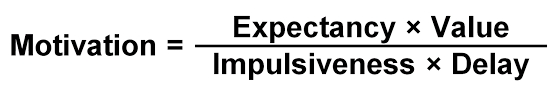
   1. 期望：做这件事情的难度
   2. 价值：做这件事情的意义和价值
   3. 冲动：做这件事情是否容易分心
   4. 延期：这件事情是否已经延期，如果延期了则更容易延期
7. 避免拖延的方法：避免干扰，原理干扰源
   1. 比如看书的时候就把手机放远一点

# 模型思考者

1. 大数定律是统计学的基石。正因为有大数定律，我们才可以对事物发生的频率做出判断，我们才能通过频率去推测理论上的概率。如果没有大数定律，所有的随机实验、一切通过统计发现事物背后规律的努力，就都是没有意义的。
2. 中心极限定理说，如果一个事件满足下面这些条件，它的分布就是正态分布 ——
   1. 第一，它是由多个 —— 至少 20 个 —— 随机变量*相加*的结果；
   2. 第二，这众多的随机变量是互相“独立”的；
   3. 第三，每个随机变量的方差都只有有限大；
   4. 第四，每个随机变量对结果都要有一定的贡献，否则如果只是其中几个起到决定性的作用，那也不能算“多”。
3. 如果一个事件的结果不是由独立随机事件相加、而是由相乘决定的，它的分布将是“对数正态分布”
   1. 员工工资就是对数正态分布：这就是因为你使用了相乘的方法[^12]。换个方案，如果规定业绩好的员工，不论之前的工资是多少，一律涨一万块钱，那么员工之间的工资差距就不会拉大。
4. 幂律分布是*不独立*的随机变量作用的结果[^13]。第一个模型是“马太效应”
   1. 明星的粉丝数量、公司的大小、城市的大小，都是幂律分布
   2. 核电站的安全性、地震、森林大火，这些事情中包含自组织，各个部分之间会有复杂的联动
   3. 容易出现极端事件
5. 索洛模型认为，长期看来，经济的产出

   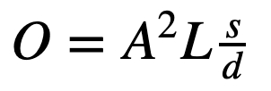
   1. 其中A代表技术进步，L代表劳动力，s代表储蓄率，d代表折旧率
   2. 只有创新能带来真正的增长
6. 广播传播的速率有限，且呈现瘪嘴型曲线。增长速度越来越慢，最终达到平衡。
7. 新闻的传播、知名品牌发布新产品之后的销售情况，基本都是广播式的。
8. 扩散模型是一种S型曲线，存在一个拐点
9. 政府给贫困户发钱解决负债问题行不行？
   1. 不行。因为从马尔科夫模型角度分析，你只是改变系统状态的初始条件，并不改变概率，宿命终究不变
10. 马尔科夫模型可谓是“江山易改本性难移”、“授人以鱼不如授人以渔”这些话的数学原理
11. 它给我们的教训是历史很难改变。临时性的措施往往没长久的作用，本性的力量很强大【没有构成系统，反馈回路没有建立起来】
12. 骚乱是否发生，并不仅仅是由所有人的平均阈值决定的，而是由阈值的具体分布情况决定的。
    1. 第一种情况每个人的阈值都是10，这个阈值很低，可以说大家都有相当强的骚乱意愿，但就因为缺少10 个带头的人，骚乱就没有发生。而第三种情况绝大多数人的阈值都很高，可以说大部分人都是老实人，但恰恰因为其中有带头的、有早期就追随的，骚乱反而发生了。
13. 你很难预测一场骚乱是否会发生。骚乱具有偶然性。
14. 领头的人非常重要。你要想防止骚乱，最首要的就是要打击带头的，看谁想出头就赶紧把他摁住[^14]
15. 如果竞争对手很少，你面对的是一个蓝海市场，那你降价只会伤害自己的收入。而如果竞争对手很多，你面对一个红海市场，价格战就能立即扩大你的市场份额，就很有效。
16. 路径依赖给我们的教训是一个东西能流行可能并不是因为它的品质好，而是因为它的运气好 —— 或者说，它早期的运营比较成功
17. 两个更高层次的思维模式 —— 一个是“一对多”，一个是“多对一”。
    1. 所谓一对多，就是要举一反三，能把一个模型用于很多看似非常不一样的场景。
    2. 所谓多对一，就是十八般兵器一起上，用多个模型分析一个问题。
18. 当你预测一件事的时候，你希望模型越复杂越好；当你要解释一件事的时候，你希望模型越简单越好

# 怪异经济学

1. 最有效的逼供手段有三种
   1. 第一种是睡眠剥夺。简单地说就是不让人睡觉。美国司法部规定审讯中睡眠剥夺的最高期限是72小时，但这条规定其实没啥意义，因为逼供专家发现根本没必要一直都不让犯人睡觉。你完全可以让犯人偶尔睡上一小会儿，这样就不违法，但是确保让他睡不成一个完整的快速眼动睡眠（REM）周期。他一进入快速眼动睡眠就把他叫醒。
   2. 第二个方法叫“撞墙（walling）”。用一条毛巾勒住人的脖子，审讯人员勒着毛巾，把犯人的头往墙上撞。这个墙并不是真的那种水泥硬墙，而是特制的软垫墙，所以犯人不会受伤。但是这种墙的特点是撞上去之后声音特别响，那个撞墙的声音会让犯人感到非常恐惧。
   3. 第三个方法叫“坐水凳（waterboarding）”。找一张木板床，把犯人绑在床上，把床倾斜起来，让犯人头向下45度斜躺。然后在他头上蒙一块布，把眼睛、鼻子和嘴都蒙上。然后透过这块布，往犯人的鼻子和嘴里灌水。这是最有效的一招。
2. 为什么一些企业家的孩子表现平平？这叫回归均值。我们根本不应该问这个儿子为什么是普通人 —— 因为人本来就应该是普通人 —— 而应该感慨这位父亲的运气特别好

# 搜索的喜悦

1. 好的调研必须满足三个要求
   1. 要高质量。你必须圆满回答一个问题，形成认知闭环
   2. 要可信。你的资料必须有来源，来源必须具有权威性，最好是科学论文
   3. 要表达好。你得把调研结果交付给读者，让人一看就明白
2. 搜索输入要干净利索，只列举关键词
3. 在一个关键词前面加个减号（-），作用是让搜索结果*不包括*这个词
4. 在关键词之前加入“site:网站”，注意冒号是英文的，前后都没有空格

# 行为

1. 别人做跟你差不多的事儿，是个什么水平 —— 然后你应该用别人的水平去预测自己
2. 美国人的十大死亡原因 ——排在前五位的死亡原因是心脏病、癌症、慢性下呼吸道疾病、意外受伤和中风。其中心脏病和癌症是两个最大的杀手，各自占据了超过 20%的死亡比率

   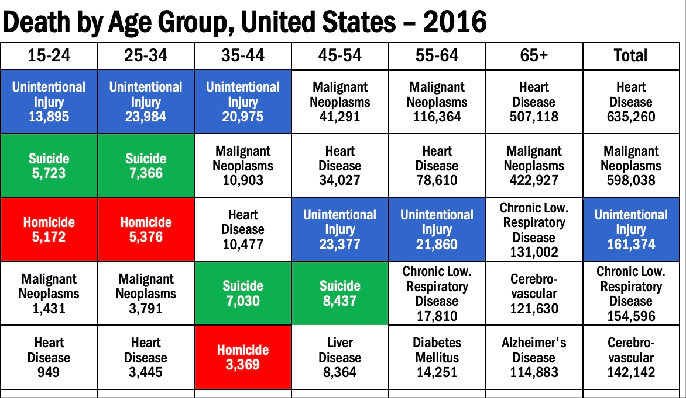
3. 落后国家的十大死亡原因分布——艾滋病、疟疾、肺结核和新生儿疾病
4. 为什么没有癌症？因为癌症是个概率事件，是人活得时间越长，越有可能遇到癌症 —— 落后国家的很多人还没等到得癌症，就因为别的原因先死了[^15]
5. 中国2018年人均预期寿命是77岁。如果你现在40岁，不意味着自己预期还能再活37年。所谓的人均预期寿命指的是：对于*刚刚出生的婴儿*来说，他平均能活 77 岁。如果对于一个40岁的人来说，他能够再活的时间比0岁活到77岁的时间更长，因为他排除了从0活到44岁的所有可能导致死亡的风险[^16]【贝叶斯定律】
6. 根据生物学家的命名规范，拉丁文名称是独一无二的。凡是正经介绍某一个物种的特性的文章，都会带有它的拉丁文名称
7. 始于好奇，陷于细节，忠于问题，痴于学习
8. 西海岸是北美板块的前沿，在这里北美板块和太平洋板块相遇，形成一个俯冲区。北美板块在这里比较低的部分直接就被太平洋板块给碾压了，所以海岸线看起来很界限分明。而东海岸则是北美板块的后缘，就好像一个尾巴一样，拖着一些东西，经过泥沙积累，就形成了各个屏障岛
9. 神经科学家保罗·麦克莱恩（Paul MacLean）提出的“三元脑（triune brain）”模型。按照在动物演化历史中出现的先后顺序，大脑可以分为三层 ——
   1. 第一层大约可以叫“自动控制层”。比如你体温低了就会发抖，血糖低了产生饥饿感。
   2. 第二层叫“边缘系统”，负责情绪。开心，压力，愤怒，沮丧，悲伤等，一般用于给第一层传递信号。像是杏仁核，多巴胺系统就是这一层。
   3. 第三层叫“新皮质”，是大脑在演化中最晚出现的部分。新皮质负责高级功能，比如认知、记忆、抽象思维、决策等等。也叫做额叶皮质（额叶皮质要等到 20 多岁的时候才能完全长成，所以小孩子的自控能力很差）。
10. 杏仁核又分为“中央杏仁核”和“基底外侧杏仁核”两部分。
    1. 中央杏仁核更古老，负责先天就会的恐惧 —— 比如一只在实验室出生的老鼠，从小跟着实验室的研究生长大，从来都没见过猫，但是你给它闻猫的味道，它会产生恐惧 —— 这就是中央杏仁核的作用。人天生怕蛇也是这个原理。演化已经把最可怕的东西编码写进了我们的中央杏仁核之中。
11. 而像我们对医院的害怕，则是后天习得的，由基底外侧杏仁核负责。
12. 多巴胺使人产生愉悦感，多巴胺是大脑对我们从事各种行为取得成功的奖励。
13. 多巴胺跟预期有关，达到预期，多巴胺给的少；超出预期，才会给很多。
14. 在猴子还没有得到葡萄之前，在它刚刚得知即将得到葡萄的那一刻，大脑就已经开始大量提供多巴胺！这说明大脑不但奖励你得到的报酬本身，而且更要奖励你对报酬的预期
15. 有时候你想一想过几天放假去干什么，比真的放假去做那件事感觉还好。这也是多巴胺的特点。
16. 杏仁核带给我们负面情绪，多巴胺带给我们正面情绪，而额叶皮质则能让我们不被情绪完全控制，提供理性思维。他相当于系统2，一般用来做理性决策。[^17]
17. 为什么有的人就能推迟满足，有的人就非得马上就吃那个棉花糖？这是因为腹侧被盖区产生的多巴胺有两个通道，如果那些多巴胺更容易通往负责情绪的边缘系统层，这个人就会对短期诱惑投降；而如果那些多巴胺更多地是走通往额叶皮层这个第三层的通道，这个人就能从长远打算。
18. 大脑是个“多元政体”。边缘系统（包括杏仁核和多巴胺等东西）和新皮质层（包括额叶皮质等）都是委员会的成员。[^18]
19. 前额叶皮质这位领导核心，也是由两部分组成的：
    1. “背外侧前额叶”，讲究纯粹的理性，他做决策无比冷静，擅长在复杂局面中做出最困难的决定，他纯粹是利益计算，完全不考虑情绪。
    2. “腹内侧前额叶”，则专门听取各种情绪的声音。比如面对一个冒险的机会，你是既贪婪又恐惧，那到底是听贪婪的还是听恐惧的呢？这个由腹内侧前额叶判断。
20. 情绪是快速的计算。视觉、嗅觉、听觉等等这些外界刺激，总是最快被边缘系统处理，形成各种情绪。很多情绪稍纵即逝我们根本意识不到，但是它们能影响腹内侧前额叶，乃至于影响整个前额叶皮质的判断。
21. 为什么安慰剂效应是有效的？因为安慰剂直接影响了情绪，情绪会影响新皮质的腹内侧前额叶，听取情绪的声音，影响自己的判断
22. 为什么有些人就不怕蛇？
    1. 因为在他们的额叶皮质驯化了杏仁核【杏仁核可以被理性驯化】。他们玩过蛇，他们的理性告诉杏仁核蛇并不可怕，杏仁核慢慢地接受了。
23. 多巴胺和荷尔蒙（有时候被翻译成激素）的区别
    1. 多巴胺是一种“神经传导物质”，只对大脑神经元有效，信号传递速度非常快，是毫秒级的
    2. 荷尔蒙则对全身各处的细胞都可以有影响
24. 睾酮就是所谓“雄性激素”的一种，主要由男性的睾丸分泌，肾上腺也会分泌比较少的量，所以男性体内的睾酮比女性多得多
25. 催产素能抑制中央杏仁核的活动，让人减少恐惧和焦虑，降低攻击性，感到安全[^19]
26. 亲密关系会让双方都增加催产素。一对情侣互相凝视，两人都会分泌催产素，同时带动多巴胺也加剧产生，于是双方是越看越觉得亲切
27. 女性生小孩的时候会大量分泌催产素
28. 睾酮的确能增加一个人的攻击性 —— 但前提是这个人本来就有攻击性。如果一个人面对这个特定场景根本就没打算攻击谁，那么就算增加睾酮也不会让他变得具有攻击性。
29. 睾酮的真正作用，是*放大*人在某些方面的行动力
30. 什么是青春？从脑科学角度来说，就是你大脑的其他部分都已经发育好了，只有额叶皮质还没成熟的那个人生阶段[^20]。我们知道额叶皮质负责理性、控制和决策，它要等到你 20 多岁的时候才能完全成熟。说白了，青春期中的你是个判断力跟不上感情的动物。
31. 青少年非常在意自己在同龄人里的关系和地位，非常在意别人怎么看待自己。
32. 根据家长对孩子的要求和回应程度的不同，有四种典型的家长：
    1. 低要求、低回应，叫做“忽视型”。这意味着父母完全不管孩子，彻底放任自流。
    2. 高要求，低回应，叫做“专制型”。家长对孩子要求极其严格，设定各种规矩，而且并不在乎孩子怎么想。
    3. 低要求，高回应，叫做“放纵型”。家长乐于满足孩子的各种需求，但是疏于管教，用中国话说就是“惯着”。
    4. 高要求，高回应，叫做“权威型”。家长对孩子要求严，同时也关注孩子的需求。这种家庭关系比较平等，设定什么规矩都要先跟孩子谈，取得双方的共识。
33. 转录因子允许你复制，你这段基因才能被“表达”出来。即环境信号 → 转录因子 → 开启基因 → 完成复制。简单地说，就是基因能决定复制出什么样的蛋白质来，而环境能决定要不要复制这种蛋白质。
34. 基因的表达由环境决定，基因的版本则是描写了人与人天生的差别
35. 社会经济地位越高的家庭里的孩子，基因的影响就越大；社会经济地位越低的家庭里的孩子，环境的影响就越大。
36. 富人家的孩子将来有没有出息，取决于他的基因。富人家小孩的智商，70%是由基因决定的。为啥呢？因为他的家庭有足够的条件，让他充分发挥自己的天赋。他的天赋上限不管有多大都能施展出来。
37. 穷人家小孩的智商，只有 10%是基因决定的。他可能有数学家的潜在天赋，但是家里条件有限他根本没有时间也没有机会学习最高水平的数学，他的天赋根本发挥不出来。他能发挥多少，取决于环境允许他发挥多少。
38. 大脑中有个专门负责识别面孔的区域，叫“梭状回”，能让你在大街上迅速识别自己认识的人，大约需要几百毫秒。
39. 我们识别“非我族类”，比识别熟人还要快（大约只需要50ms）
40. 人群看人群最常见的划分法，是一种“二分法”。用“温暖度”和“能力”这两个维度去把人群分类。温暖度代表这群人跟我们关系好不好，能力代表这群人本身行不行
41. 真正决定健康的其实不是绝对的地位，而是我们专栏多次强调过的那个“控制感”。只要你对自己的生活有掌控感，你的压力就大大减小。如果你进一步还能控制别人，而且还不用担心为此承担责任，你的健康还会更好
42. 我们并不是反复权衡理性推理和直觉的呼唤，再从中选择一个立场 —— 我们总是先因为直觉而有了一个立场，然后运用理性推理给这个立场寻找解释
43. 你可能会拼死救下近在眼前的落水儿童，而不会给远在天边的面临死亡威胁的儿童捐款。这是因为近在眼前的儿童触发了杏仁核活动，引起强烈直觉，导致人的决策很容易收到情感影响，做出偏向直觉的决策。而后者由于没有情绪系统的过多参与，决策也更理性
44. 洞见：不可能剥离直觉谈理性
45. 同理心就是对他人的痛苦感同身受：看到你这么痛苦，我自己也感受到了同样的痛苦【同理心是最高级的移情】
46. 更积极的情感：悲。我理解你的痛苦，但是我不跟你一起感受那个痛苦，因为我有一个更积极的姿态：我要帮你解除痛苦
47. 同情心（sympathy）是我承认你有痛苦，我为此感到遗憾，但是我没有什么感同身受，我不一定理解你的痛苦
48. 可怜（pity）是一种居高临下的情绪
49. 长时间打坐导致膝盖酸痛这个问题，有一位僧人的观点是：有时候会为了膝盖提早结束打坐 —— 但是那并不是因为我感到痛，而是出于对膝盖的慈悲
50. 将自己的感觉和膝盖的感觉分离，他选择解除的是膝盖的痛苦，而不是自己的痛苦[^21]
51. 真正能把最大规模的人群组织起来的，不是利益，而是某种想象的、虚构的东西，比如国家和宗教。一群人往往不是纯粹因为利益而组织起来，而是为了某个他们认为是神圣的价值观

# 第二座山

1. 人生要爬两座山[^22]：
   1. 第一座山是关于“自我（ego）”的，你希望自己越来越成功、越来越厉害，要实现自我，获得幸福。
   2. 第二座山，却是关于别人的，是关于“失去自我”的：你为了别人，或者为了某个使命，而宁可失去自我。
2. 第一座山讲个人自由，第二座山讲责任、承诺和亲密关系。
3. 第一座山讲独立，第二座山讲互相依赖。
4. 第一座山讲自我的成长，第二座山讲忘记自我。
5. 第一座山讲获得，第二座山讲奉献。
6. 第一座山中你是个消费者，第二座山中你被他人、被某个事业所消耗。
7. 第一座山追求的是幸福，第二座山得到的是喜悦。
   1. “幸福（happiness）”特指个人的幸福。比如你取得了成功，在竞争中获得胜利，实现了目标，增长了能力，让世界的某一部分听你的，再加上各种感官的快乐，这些都叫“幸福”。
   2. 喜悦（joy），则是另一种东西。喜悦是你攀登第二座山得到的副产品。
8. 这个世界上的知识都是现成的，真正稀缺的是你愿不愿意学习那些知识。要做一辈子的事儿，能力不足也许还可以培养，要是意愿不足，那就有点悲哀了
9. 到底要不要跟这个人结婚，你需要考虑几个问题
   1. 你愿不愿意为了婚姻而放弃自己对生活的控制权
   2. 你爱这个人到没到愿意一辈子都跟他聊的程度
   3. 这个人是否让你欣赏和敬佩？如果你从内心鄙视这个人，那这个婚姻就无论如何也不能维持
10. 你对TA的爱是哪种爱，这三种爱都要有
    1. 朋友之爱。你喜欢他是因为他是个有趣的人，跟他在一起你觉得很好玩
    2. 激情之爱。这个爱能让你深深迷恋对方
    3. 无私之爱。崇拜的爱
11. 婚姻是对你的教育（自己一个人不会发现自己的问题，有人在你身边指点才会）。婚姻能不能搞好，取决于你愿不愿意被改变。[^23]
12. 立场，是你在争论中支持哪一方；观点，是你能为这一方提供什么样有力的支持。立场是廉价的，但是观点却有高低之分[^24]
13. 低水平的观点可能占据正确的立场，高水平的观点可能占据错误的立场[^25]
14. 你得有勇气坚持一个不受欢迎的观点，其次你得有谦卑的品质，知道哪个观点可能是错的

# 博弈论专题

1. 《三十六计》里的计谋：瞒天过海、声东击西、暗度陈仓、笑里藏刀、欲擒故纵、偷梁换柱、上屋抽梯、美人计、空城计、反间计等等，这些“计”，本质上都是骗术
   1. 风险高。必须严密封锁信息，而且还得假设对手是比较愚蠢的
   2. 不能长期使用。骗人一次也许真能成功
   3. 零和游戏
2. 纳什均衡告诉我们评价一个局面不能只看它是不是对整体最好，它必须得让每个参与者都不愿意单方面改变才行
3. 对方背叛我一次，我继续合作；只有当对方连续背叛我两次，我再报复。研究表明，在有可能出错的博弈中，这个办法的效果比以牙还牙更好（容忍对手的操作失误）
4. 有限次博弈从理性角度来讲应该选择背叛，因为100次一定背叛，那么99次知道100次一定背叛则本次也应该背叛，以此类推，一直到第一次
5. 天然钻石的储量其实很大，钻石之所以卖那么贵，是因为钻石业务被垄断了
6. 把钻石和爱情联系在一起，和把圣诞老人送礼物和圣诞节联系在一起一样，都是商业宣传的结果。结婚戴钻戒的风俗是在19世纪才流行开来
7. 威慑有三个要素：实力、决心和让对手知道[^26]
   1. 我有实力摧毁你
   2. 我有决心摧毁你
   3. 你得知道我有实力和决心摧毁你
8. 政府应不应该搞“产业扶持政策”：
   1. 如果你现在是技术领先者，根本不知道下一个技术进步的方向在哪里，那产业政策就是政府在乱花钱
   2. 但如果你现在是个技术落后者，明确知道先进技术的方向在哪，产业政策就是最快速的模仿方法
9. 往哪个方向踢球。最终目的是守门员无论往哪个方向扑球，统计上他扑出球的收益最小
10. 左右进球概率 \* 选择左右踢球概率是相等的。这叫混合概率策略
11. 最根本的博弈思维，就是你必须考虑对手对你的策略做出的反应。然后你还得考虑你怎么对他的反应做出反应，他怎么再反应……博弈论要求你要站在两个、甚至更多个立场思考问题。
12. 如果各方有强烈的合作意愿，而博弈有不止一个纳什均衡，那我们就需要一个*聚焦点*。比如高速公路的车速
13. 如果合作对所有人都有好处，但背叛对背叛者有直接的好处，那就是*囚徒困境*。
14. 想要让别人按照你的意志行事，最好的办法是给他一个*可信的威胁或者承诺*。
15. 博弈局面一：各方有强烈的合作意愿，而博弈有不止一个纳什均衡。
    1. 采取策略：找到“聚焦点”
    2. 比如交通规则中“右侧通行”和“左侧通行”，都是纳什均衡
16. 博弈局面二：囚徒困境——合作对所有人都有好处，但背叛对背叛者有直接的好处。
    1. 采取策略：重复博弈+对背叛者的直接惩罚
    2. 到底应该惩罚行为本身，还是行为的后果。同样是在禁止烟火的地方抽烟，如果没有引起火灾，被发现了可能最多也就罚款200元；但如果引起火灾，造成巨大损失，那就会面临重罚。抽不抽烟，这是我们可控的行为；是否引起火灾，那是运气问题。难道应该因为一个人运气不好而惩罚他吗？
    3. 是的，应该。

# 逻辑思维专题

1. 数学之所以绝对正确，是因为它研究的并不是真实世界里的东西，数学世界是一个抽象的世界，是“柏拉图世界”，是“逻辑世界”
2. “想法”和“关于想法的想法”是不同层的东西。谈论一个想法时就单纯讨论这个想法，而不要上升到对想法的想法的讨论
   1. 例如：美国宪法保护公民自由，那如果一个公民要限制别人的自由，难道宪法也保护他的这个自由吗？
3. 数学不要靠死记硬背，他是讲究逻辑的学问，只有理解和内化公式，才会有不一样的体会
4. 如果你不能用简单的语言给一个外行解释一个东西，你就是没有真正理解这个东西[^27]
5. 怎么找到自己的原则呢？最好的办法就是不停地追问自己，我为什么这么认为？一直追问到没有为什么、我就相信这个，为止 —— 那就是你的原则。
6. 灰度认知，黑白决策。在原则的基础上进行讨价还价
7. 演绎闭合：
   1. 这个体系以内的东西不能互相矛盾
   2. 这个体系以外的东西，你一定不信
   3. 凡是能从这个体系推导出来的东西，你就一定相信
8. 宗教信仰是一个封闭的系统。或者以某一本经书为准，或者以某个“神”的话为准，不容置疑不可更改，这就是盲信
9. 科学与宗教虽然有一定相似性（相信权威），但本质上是不同的，科学是开放系统，宗教是封闭系统。前者允许新的证据出来并推翻以前结论，改变科学信念，而宗教则是一成不变的，不允许改变
10. 采写新闻是有框架的。比如有一个标准叫交叉验证（cross-checking），你不能光听一面之词，你得从多个侧面来了解事实，重要消息要求至少有两个独立信息来源才行

# 期权的智慧专题

1. 股票有两种期权（option），看涨期权（call）和看跌期权（put）。意思是给你一种可选项，你可以在今后某个时间点以某个固定的价格买进或卖出股票。用定金锁定未来的价格。把股票的预期当做一种股票，做杠杆。
2. 公司期权：对你来说这是一个很好的激励，你会全力以赴把股价干上去。对董事会来说，这是一个廉价的许诺：股价真上去了，董事们也跟着赚钱；股价要没上去，董事们在你身上啥钱也没花。

# 相对论专题

1. 地球绕太阳公转的速度是每秒29.8公里，比飞机快的多，但因为地球走得几乎是一条直线，你完全感觉不到它正在高速前进。
2. 伽利略相对论是说如果你不往自己的坐标系之外看，你做任何抛小球之类的*力学*实验都无法判断自己是运动还是静止 —— 而爱因斯坦相对论则是说，不用限制在力学，你*不管做什么*实验都无法判断自己是运动还是静止
3. 在大尺度上，水并没有动，是波在相对于水而动。水是波传递的介质，波传递的仅仅是信息和能量，而不是物质 —— 介质本身，不需要动
4. 1905年6月9日，爱因斯坦发表《关于光的产生和转变的一个启发性观点》，提出一个解释，说光的能量不是连续变化的
5. 1905年7月18日，爱因斯坦发表《热的分子运动论所要求的静止液体中悬浮粒子的运动》，解释了布朗运动。这篇论文是人类第一次实锤证明了分子和原子的存在
6. 1905年9月26日，爱因斯坦发表《论运动物体的电动力学》，这篇论文就是狭义相对论
7. 1905年11月21日，爱因斯坦发表《物体的惯性同它所含的能量有关吗？》，这篇论文用狭义相对论推导出现在尽人皆知的公式 —— E = mc^2，并据此说明质量和能量其实是一回事儿
8. 相对性原理：一切匀速直线运动或者静止的坐标系下，物理定律都是一样的
9. 相对论的两个典型效应：时间膨胀，长度收缩。时间膨胀指的是你的速度越快，你的时间就过的越慢。长度收缩指的是你的速度越快，你的长度就越短。
10. 在一个坐标系下看是同时发生的两件事，在另外一个坐标系看就可能不是同时的了。例子：行驶过程中的列车中放一盏灯，在火车里的人看来，灯同时到达火车前后，但是在地面上的看来，由于火车有速度，所以是灯光先到达车尾，再到达车头。

    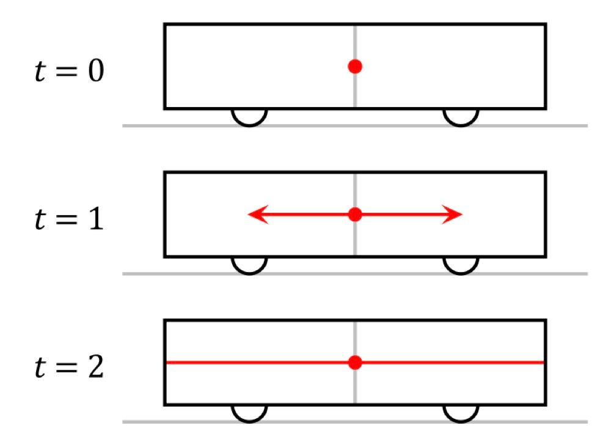

    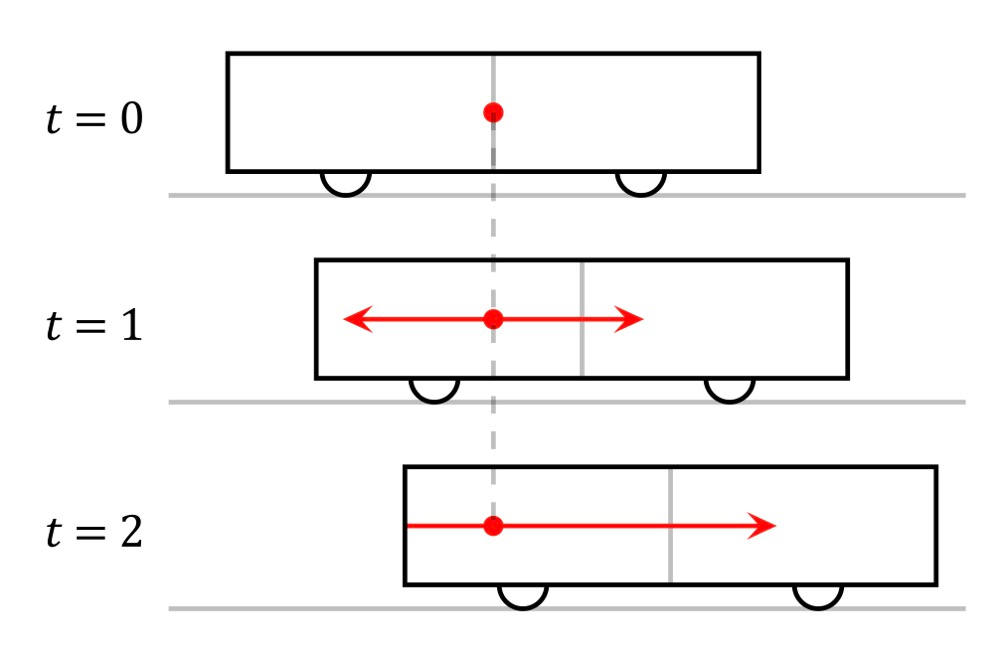
11. 一个事件的光锥，界定了它的边界。光锥以内的事件跟它*可以*有关，光锥以外的事件跟它*必定*无关[^28]
    1. 例如：未来事件C受到当前事件A的影响，当前事件A受到过去事件B的影响，但是与D和E无关
    2. 比如白天的时候太阳突然灭了，不是现在马上灭的，而是8的分钟之前灭的，因为光从太阳到达地球还需要8分钟。

       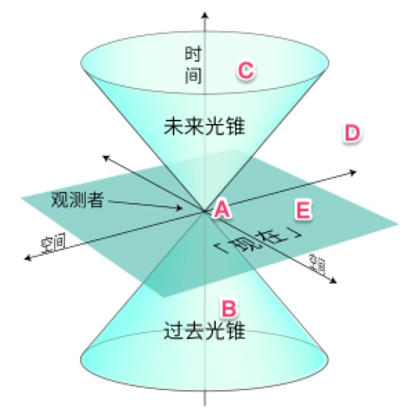
12. 为什么高速速度不可叠加？因为有长度收缩和时间膨胀效应。
13. 高速运动物体的质量会变重。当你的速度接近光速的时候，我眼中你的质量就会接近于无穷大【所以光子没有质量】

    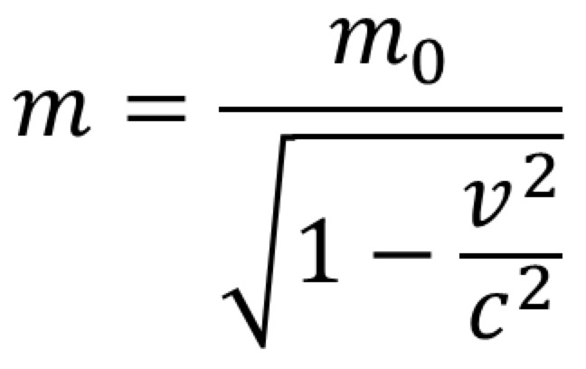
14. 速度叠加公式：

    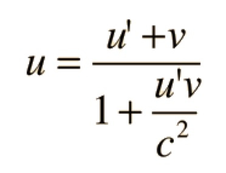
15. 爱因斯坦说，我能不能把相对性原理再推广一下，改成 —— 在所有的坐标系下，物理定律都是一样的（匀速直线扩展到加减速运动）。这就叫“广义的相对性原理”
16. 你在太空之所以感觉不到引力，是因为你是在做自由落体运动。宇航员绕着地球转也好，电梯从高层掉落也好，它们都是自由落体，都会失重，也都是“加速运动”
17. 你在电梯里的失重感和在绕地卫星中的失重感和在一个远离所有星球完全不受外力的匀速直线运动没有本质区别（无法通过实验区分自己在哪种场景）
18. 都是沿着测地线运动
19. 圆周运动的速度大小可以不变，但是方向一直在变，它跟匀速直线运动有本质的区别。所以，圆周运动也是一种加速运动
20. F=ma的质量叫做引力质量，F=GMm/R2的质量叫做惯性质量，这两个质量正好相等，没有为什么
21. 在任何局部实验中，引力和加速运动无法区分
22. 广义相对论，简单地说就是两句话
23. 一个有质量的物质，会弯曲它周围的时空。这叫“物质告诉时空如何弯曲”（不仅仅是空间弯曲，时间也会弯曲，即时间变慢）
24. 在不受外力的情况下，一个物体总是沿着时空中的测地线运动。这叫“时空告诉物质如何运动”
25. 什么叫自由状态，自然状态？
26. 亚里士多德：静止
27. 伽利略、牛顿：不仅仅是静止，匀速直线运动也是自然状态
28. 爱因斯坦：一切沿着测地线的运动，都是自然运动。比如匀速圆周
29. 总结：自由落体，跟匀速直线运动，跟静止，没有任何区别。你在其中一个封闭的实验室里不管做什么实验，都无法把它们区别开来。爱因斯坦说它们是一回事，都是沿着测地线运动，都是自然运动。
30. 怎么验证大质量天体会弯曲空间？利用太阳的日全食：1919年在巴西和非洲都看到了日全食旁边几颗原本被太阳遮住而看不见的躲在太阳后面的行星
31. 距离地面越高的地方时间过得越快【靠近黑洞则时间变慢，所以远离天体的地方时间过的快】
32. GPS 卫星距离地面很远，时间膨胀效应很强，所以计算时间必须考虑到广义相对论的修正。没有这个修正，定位精度就会差出去十几公里！这也是能让老百姓直接用上广义相对论的一个例子。
33. 距离地球越远，时间越快；运动速度越快，时间越慢。一个飞行了一千万英里的人，也就比地面上的人老0.059秒

# 士之修行、视野、认知、责任、生活

1. 学校里教的和书本上讲的知识几乎都是外显的。外显学习就如同程序员写程序，讲究“先定义、后使用”[^29]。这样学习的内容才符合逻辑，才能够被理解。
2. 小孩都是在潜移默化中学习语言。她根本说不清桌子的定义是什么，但是当她看见桌子的时候，她知道那是一个桌子。她不懂什么语法规则，但是她能把话说得符合语法；而且如果你故意说一句不符合语法的话，她能听出来这句话有毛病。这种学习就叫内隐学习。内隐学习是必不可少的学习方式。我们长大以后在学校学外语用的基本上是外显学习法，又是背单词又是记语法，中英对照，学得很生硬。你非得到一个真正的外语环境之中，跟当地人打成一片，慢慢说溜了，才知道各种地道的说法，才会识别不地道的说法，才能体会到那个说不清道不明的“语感”。
3. 外显学习，适合规则明确的简单领域。内隐学习，适合没有明确规则的复杂领域。
4. 这就解释了为什么学龄前儿童善于学语言而不善于学数学。学数学需要集中注意力。人脑负责集中注意力的区域主要是前额叶皮质。这个区域的发育非常缓慢，要一直到青春期以后才能成熟。儿童的前额叶皮质还没有发育好，当然就不善于集中注意力。[^30]
5. 那些投资者如果对自己投资的项目细节了解越多，他们自我估计的回报率就越高。也就是说，内部视角看到的信息越多，你的判断就会越极端。这个道理是如果一个人不去收集一些客观信息，只根据自己这边的信息坐在那干想，就容易越想越觉得要做的这件事儿能做成。你会一厢情愿地脑补一些东西，你会不自觉地假设事情按照你想要的方向发展。你越想，你设想的那个画面就越鲜活。你越想，你对自己的信念就越深。你越想，你的判断就会越极端。
6. 学习这个活动本身，是教育金字塔塔尖上的行为。而要想成功学习，你必须先准备好金字塔下方的两个基座才行。这两个基座是自信心和自我管理能力。

   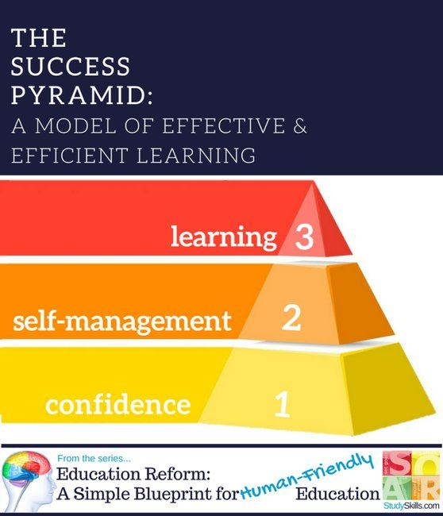
7. 为什么趋势会改变？
   1. 资源是有限的。世界上没有J型曲线
   2. 趋势导致外界变化，这个变化反过来影响这个趋势。比如人口增长
8. 人总是过度自信，高估自己低估别人
   1. 也许我挣钱不多，也许我能力有限，但是我可不像大多数人那样对世界充满偏见，我是一个公正的人。钱当然是个好东西，但我工作主要是为了理想和爱好，不像大多数人那样就为了挣钱。我一直都是在追求自我实现的层次，别人基本都只为名利奔忙
9. 人才可以分成两类。一类叫“正确型人才”，一类叫“优异型人才”。
   1. 正确型人才：专注于怎么把事情做*对*。标准化，模板化，套路化，正确型人才的价值由*短板*决定。培养的是正确型人才。什么东西都有正确答案，主要使用负反馈，学生有标准化的榜样，讲究意志力、组织性和纪律性。
   2. 优异型人才：专注于怎么把事情做*好*。差异化，不可替代。优异型人才的价值则由*长板*决定
10. 正确型人才是管出来的，优异型人才是惯出来的。
11. 优异型人才的特点，恰恰不是素质教育说的什么“全面发展” —— 而是在某一方面极致发展
12. 当你训练一个东西的时候，你给它的内容中应该有大约85%是它熟悉的，有15%是它感到意外的。研究者把这个结论称为“85%规则”。
13. “邓宁-克鲁格效应”说的是，自我评估的偏差程度跟能力密切相关：是越没能力的人，反而越能高估自己的能力。而那些真正水平高的人，反而还低估了自己的能力

    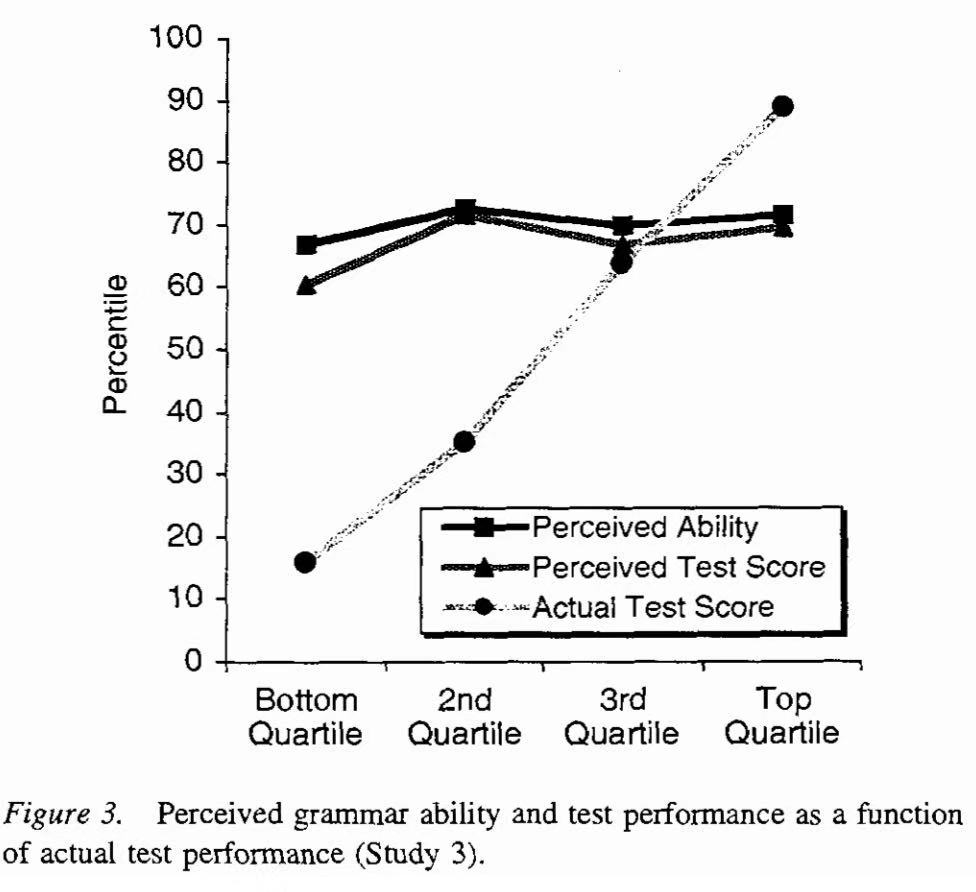
14. 神经元的内部参数，包括权重和偏移值，都是可调的。用数据训练神经网络的过程，就是调整更新各个神经元的内部参数的过程。我们要用的这个方法叫做“误差反向传播网络”

    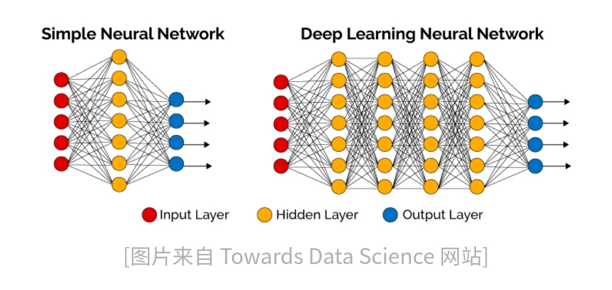
15. 人脸识别，卷积网络方法把问题分解为三个卷积层

    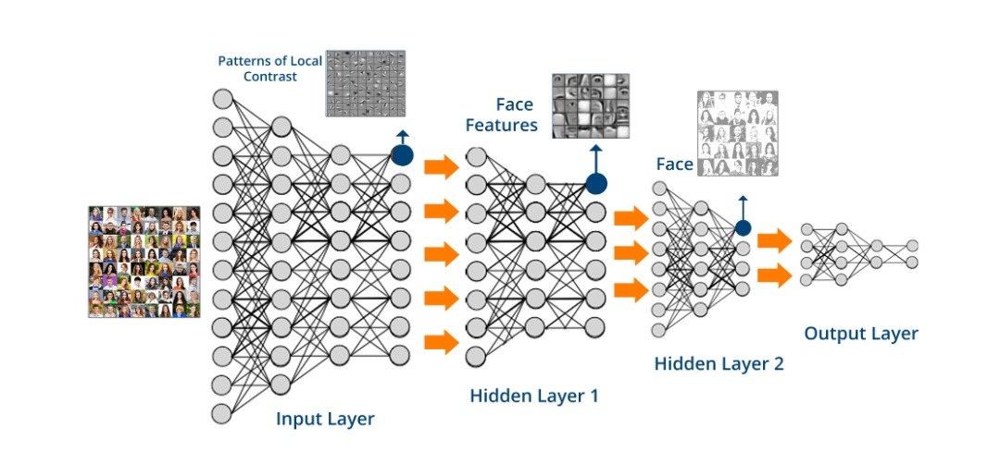
    1. 第一层，是先从像素点中识别一些小尺度的线条结构。
    2. 第二层，是根据第一层识别出来的小尺度结构识别像眼睛、耳朵、嘴之类的局部器官。
    3. 第三层，才是根据这些局部器官识别人脸。其中每一层的神经网络从前面一层获得输入，经过深度学习之后再输出到后面一层
16. 所谓“客观”，其实是一个错觉。你以为司马迁客观描写了古代的历史，那只不过是因为你没有机会看到别人对同一段历史的描写。
17. 书上的知识是死的，互联网上的知识是活的，永远都在生长和更新。而这恰恰才是知识的本来面目。小事不会导致大事，导致大事的不是小事，而是系统，是系统结构决定了大事的发生。比如是多米诺骨牌的排列方式导致了他们的倒下，而不是第一个触碰[^31]
18. 火星总会来的。小骨牌总要倒下。蝴蝶总要震动翅膀。你应该怪罪的是系统，而不是导火索
19. 人生在世面对的各种问题分成三类：单纯的问题、两难的问题、和棘手的问题。
    1. 单纯问题：有明确方向的问题（考清华大学）
    2. 两难问题：选择买哪座房子
    3. 棘手问题：问题没有清晰定义；没有终极答案；解决方法没有对错；决策了不会立即看到结果；不能试错；不知道有什么选项；没有先例可循；找不到根因；各方对这个问题的看法不一致[^32]
20. 面对棘手问题怎么办？往回退一步找意义，问题是无法解决的
21. 真实世界 = 抽象关系 + 实体。真实世界是抽象关系的实体化。真实世界中不存在数字“2”这个东西，只存在具体的实体，比如2个苹果，2个人
22. 悬念是在大事发生之前的感受，意外是在大事发生之后的感受。我打个不精确的比方，悬念就好像是“灰犀牛” —— 你知道这件事可能发生，但是你不知道它到底会不会真的发生，你不知道它什么时候发生。意外则有点像“黑天鹅” —— 你连想都没想到，它居然就发生了。【没发生的事就是悬念，发生了的事就是意外】
23. 要想让悬念最大化，你必须一直保留*剧情反转*的可能性。如果一方已经赢定了，或者读者早早就知道某人肯定是凶手，悬念也就不存在了。
24. 早教带来的早期优势会在一到三年内被冲刷掉，然后还可能会被逆转。儿童在六岁以前，真正的任务不是什么学习读书写字和做数学题，而是玩儿。孩子在玩儿的过程中能探索周围的东西都是干什么的，揣摩周围的人都在想什么。更重要的是，跟别的孩子一起玩闹，是一种社交演练。孩子必须在实际互动中学会公平、尊重和社交界限，学会分享、帮助和友情，学会怎样跟人相处。
25. 9个月以下的孩子不需要额外的音频和视频多媒体信息。长时间让孩子听音乐看电视会导致孩子长大以后不能集中注意力。
26. 18个月以下的孩子只有听真人说话、在有互动的情况下，才能提高词汇量[^33]。其他方法一律没用而且有害。
27. 两岁以下的儿童只适合接触三维的物体 —— 也就是真实世界里那些寻常的物体，比如玩具和人。而二维的东西，比如书本和图画，只会妨碍他们感知能力的发育。
28. 真正的天才都是跟成年人比，以自己家孩子提前两年学会小学二年级知识为荣，那是愚昧。
29. 垃圾回收，变废为宝不一定会更环保。因为回收需要考虑到清洗、燃烧等环节，这些过程需要成本，而如果直接用塑料桶填埋起来可能更快，成本更低
30. 课外补习对差生最有效；对数学和英语比较有效，对语文作用不大；
31. 学生的成绩反映了学生的智商；学生的智商是继承于家长的智商；家长的财富和学历，反映了家长的智商；所以学生的成绩才会跟家长的财富和学历有关。
32. 中国的科研政策有个潜意识，叫做“我有”。严重点说，叫做“我也有”。中国的整个科研策略都应该从“我有”思维转变为“是我”思维。如嫦娥四号在2019年1月3日实现了人类历史上第一次在月球背面降落的里程碑，这是典型的是我的思维：是谁实现了全人类第一次在月球背面着陆？是我！
33. 同样是你要去办一件急事，路上堵车了，如果你把堵车当做一个客观的事件，既然着急也没用索性就多听一会儿有声书，那这个小麻烦就不会影响你的健康。但如果一堵车你就非常恼火，一个劲儿地埋怨前面这帮人是怎么开车的，你的健康就可能会受到影响
34. 刻意练习的质量不是由练习时间决定的，而是由*练什么*决定的。只有练你不熟悉的东西、练有难度的东西，你才能提高水平[^34]
35. 对复杂项目有效，对简单项目无效：比如飞行员和卡车司机，确实是飞行小时数和驾龄是个不错的指标
36. 赌场不能一直靠让玩家赢钱来留住玩家。想要让玩家明明输了钱，但是还感觉自己马上就要赢了，这个方法就是让他“就差一点点赢”。
37. 越是背景相似的两群人 —— 比如既是邻居又是亲戚的两个家庭 —— 越是互相看不上眼。我们最强烈反对的，是跟我们最相似的人。
    1. 清华北大，复旦学生跟交大学生，国安球迷和申花球迷，华为手机用户和苹果手机用户，吴亦凡粉丝和鹿晗粉丝，都是彼此相似但是针锋相对的群体。
38. 模式识别的两种境界：第一境界叫“提取原型（prototype）”。比如说你要通过面试来录取一位优秀的程序员。所谓“原型”，就是你心目中，优秀的程序员应该有哪些特征。第二境界叫“范例（exemplar）”。进来一位应聘者，你刚跟他聊了几句，就感觉他特别像你认识的一位优秀程序员。你立即就判断这人行，结果果然行。那个你认识的优秀程序员，就是你头脑中的一个范例。在别人眼中，这是一位来自河北省的、很有特点的、有品位有个性的产品经理 —— 在你眼中，这位是“保定乔布斯”。
39. 熟悉得特别熟悉，意外得非常意外，才能让人印象深刻。
40. 致幻剂的作用并不是“制造幻觉”，而是让大脑建立更多的连接

[^1]: 幸福不是由具体贡献的大小决定的，而是由“贡献感”决定的

[^2]: 学习，是孩子的课题，不是你的课题。你的课题是给他提供帮助

[^3]: 艺术品的价格不是由“好坏”、而是由艺术的“网络”决定的

[^4]: 没有政府插手的领域，市场总是让东西越来越便宜。政府插手，却有可能让东西越来越贵。

[^5]: 在能够区分好团队和差团队的8个问题之中，预测力最强的一个，是“我在工作中每天都有机会施展我的特长”

[^6]: 好评最好不要泛泛而谈，你得发现具体的闪光点，说出具体的看法才行

[^7]: 有没有过度疲劳的关键不在于总的工作时间，而在于在工作时间中有多大比例，是做你热爱的事情

[^8]: 别人选择追随你，才把你变成了领导。是追随导致领导，而不是领导导致追随

[^9]: 夸孩子，一定要夸他这件事做得很努力 —— 而不能说他是个“聪明孩子”，否则他会因为害怕被证明不聪明而不敢挑战更高的难度

[^10]: 让孩子整天呆在室内，这是近一百年才有的事情。才造成了近视

[^11]: 如果真要提高效率，只有两种办法：少做事情、让别人帮你做

[^12]: 员工工资就是对数正态分布：这就是因为你使用了相乘的方法

[^13]: 幂律分布是*不独立*的随机变量作用的结果

[^14]: 你要想防止骚乱，最首要的就是要打击带头的，看谁想出头就赶紧把他摁住

[^15]: 落后国家的很多人还没等到得癌症，就因为别的原因先死了

[^16]: 对于*刚刚出生的婴儿*来说，他平均能活 77 岁。如果对于一个40岁的人来说，他能够再活的时间比0岁活到77岁的时间更长，因为他排除了从0活到44岁的所有可能导致死亡的风险

[^17]: 杏仁核带给我们负面情绪，多巴胺带给我们正面情绪，而额叶皮质则能让我们不被情绪完全控制，提供理性思维。他相当于系统2，一般用来做理性决策。

[^18]: 大脑是个“多元政体”。边缘系统（包括杏仁核和多巴胺等东西）和新皮质层（包括额叶皮质等）都是委员会的成员。

[^19]: 催产素能抑制中央杏仁核的活动，让人减少恐惧和焦虑，降低攻击性，感到安全

[^20]: 什么是青春？从脑科学角度来说，就是你大脑的其他部分都已经发育好了，只有额叶皮质还没成熟的那个人生阶段

[^21]: 将自己的感觉和膝盖的感觉分离，他选择解除的是膝盖的痛苦，而不是自己的痛苦

[^22]: 人生要爬两座山：自我和别人。自由vs责任、独立vs依赖、获得vs奉献、幸福vs喜悦

[^23]: 婚姻是对你的教育（自己一个人不会发现自己的问题，有人在你身边指点才会）。婚姻能不能搞好，取决于你愿不愿意被改变。

[^24]: 立场是廉价的，但是观点却有高低之分

[^25]: 低水平的观点可能占据正确的立场，高水平的观点可能占据错误的立场

[^26]: 威慑有三个要素：实力、决心和让对手知道

[^27]: 如果你不能用简单的语言给一个外行解释一个东西，你就是没有真正理解这个东西

[^28]: 一个事件的光锥，界定了它的边界。光锥以内的事件跟它*可以*有关，光锥以外的事件跟它*必定*无关

[^29]: 外显学习就如同程序员写程序，讲究“先定义、后使用”

[^30]: 学数学需要集中注意力。人脑负责集中注意力的区域主要是前额叶皮质。这个区域的发育非常缓慢，要一直到青春期以后才能成熟。儿童的前额叶皮质还没有发育好，当然就不善于集中注意力。

[^31]: 小事不会导致大事，导致大事的不是小事，而是系统，是系统结构决定了大事的发生。比如是多米诺骨牌的排列方式导致了他们的倒下，而不是第一个触碰

[^32]: 棘手问题：问题没有清晰定义；没有终极答案；解决方法没有对错；决策了不会立即看到结果；不能试错；不知道有什么选项；没有先例可循；找不到根因；各方对这个问题的看法不一致

[^33]: 18个月以下的孩子只有听真人说话、在有互动的情况下，才能提高词汇量

[^34]: 刻意练习的质量不是由练习时间决定的，而是由*练什么*决定的。只有练你不熟悉的东西、练有难度的东西，你才能提高水平
