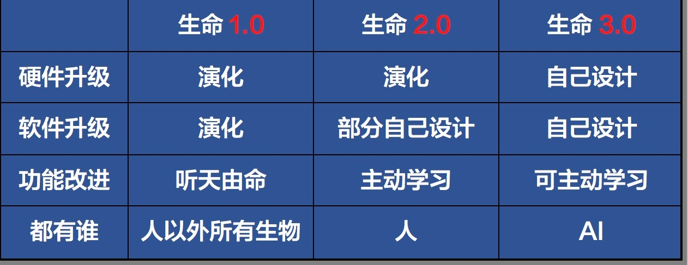
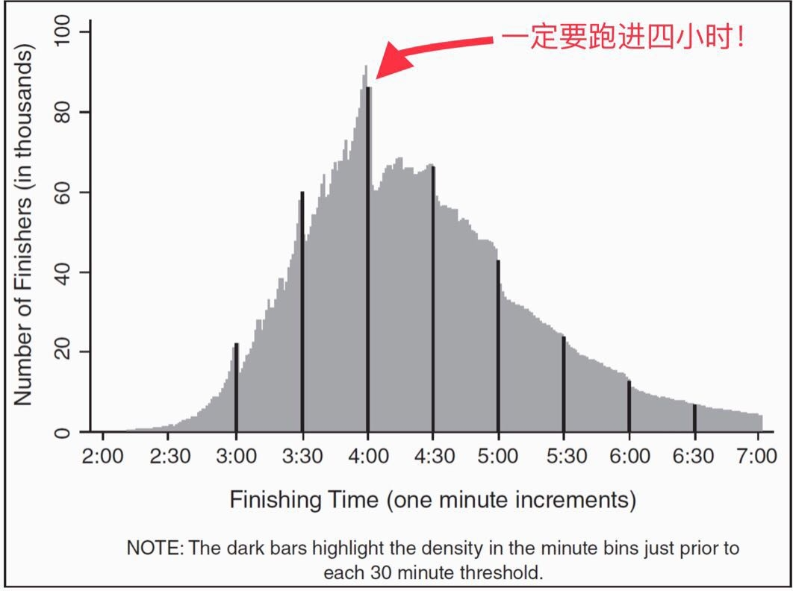
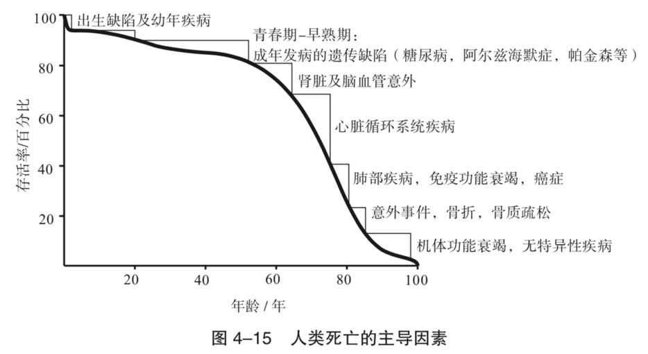
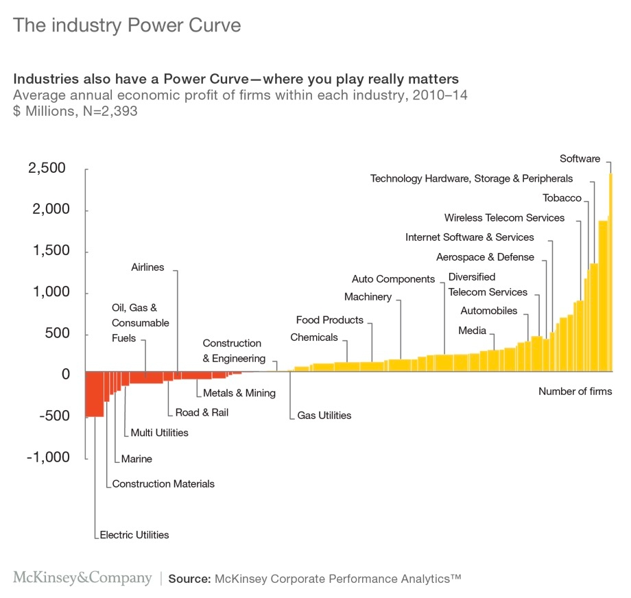
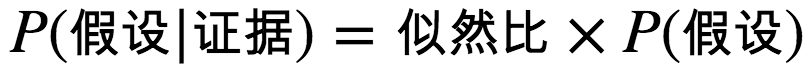
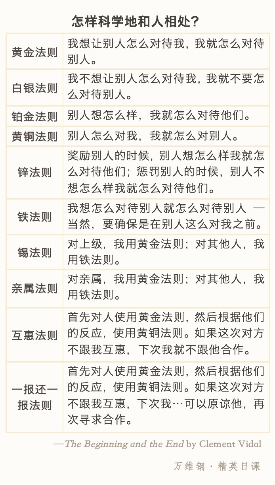
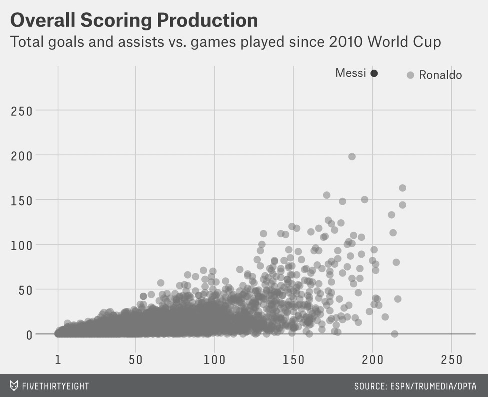
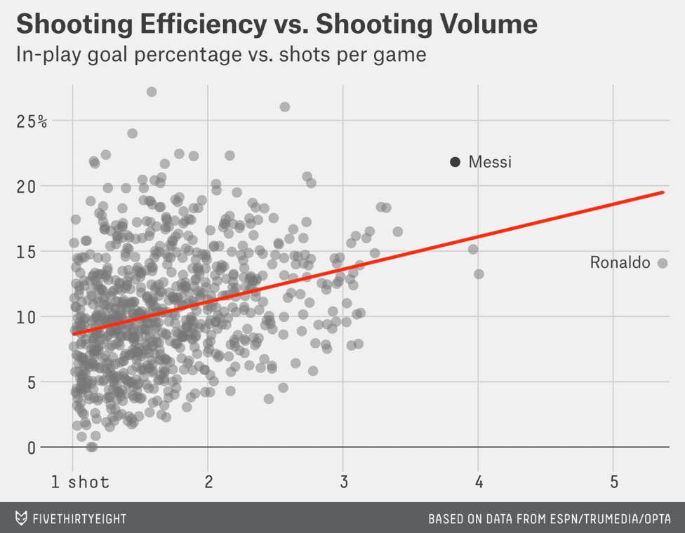

# 【DONE】《精英日课第二季》万维刚

## 目录

- [你能做任何工作](#你能做任何工作)
- [生命3.0](#生命30)
- [原则](#原则)
- [强力瞬间](#强力瞬间)
- [塑造现代经济的五十个发明](#塑造现代经济的五十个发明)
- [为什么佛学是真的](#为什么佛学是真的)
- [以大制胜](#以大制胜)
- [创造的起源](#创造的起源)

# 你能做任何工作

1. 如果你学的是人文学科，那么学习大概有三个层次：
   1. 第一层是“学事实”。你得记住哪个年代发生什么事儿，哪个皇帝有什么政策之类。
   2. 第二层是“学观点”。比如怎么评价太平天国运动，甚至各位名家的观点，你得知道。这些事实和观点，固然是必备的专业素质，但是如果你毕业以后就不搞这个专业了，它们就只是谈资而已。
   3. 第三层，是“学方法”。你能不能直接考察一下当时的原始材料，比如说太平天国相关的经济数据，清朝大臣的什么奏折之类，从中得出自己的观点，还能说服别人接受你的观点。这才是批判性思维，这才是真正值钱的技能。
2. 公司招人面试，最关心的是三个问题：
   1. 第一，你能不能干这个活；
   2. 第二，你愿不愿意干这个活；
   3. 第三，你跟我们公司般配不般配

# 生命3.0

1. 意识是我们对世界的主观感受。我们的喜怒哀乐，一切感情都是因为我们有意识。一辆自动驾驶汽车也许可以出色地完成运输任务，但是遇到红灯它不会暴躁，有危险它不会害怕，撞车了它不会疼，没油了它不会饿，完成任务它不会高兴，它只是机械地做事而已
2. 生命，就是可以自我复制的信息处理系统。其中的“信息”包括个体硬件复制的蓝图，以及个体行为的模式。一个生命体包括“硬件”和“软件”：硬件就是它的身体，软件就是信息
3. 生命1.0 ，是说这个生命的硬件系统和软件系统都是靠演化来进行更新迭代的，完全是自然选择的结果。
4. 生命2.0 ，是硬件升级仍然依赖自然演化，一部分软件升级则可以自己设计。
5. 生命3.0 ，则是硬件和软件都可以自己设计。
6. 想要实现智能，AI 大概只需要三种能力：
   1. 存储信息（memory）
   2. 计算（图灵机计算）
   3. 自我学习（基于神经网络的深度学习）
7. 戴森球：在外层空间造一个巨大的球体，把太阳整个给包围起来。然后我们人类文明就可以生活在这个球体上，面积绝对够用怎么折腾都可以 。这么一来，我们就把所有的太阳光都用上了，一点都不浪费。只要球体足够大，阳光并不会很刺眼，球的内侧永远都是白天 —— 而如果你想看星空，直接下楼去球的外侧看
8. 所有物理定律都可以用这种“目标论”表述：真实发生的物理过程总是在“优化”某个量，也就是总是*为了*把一个什么物理量最大化或者最小化
   1. 例如：光的折射。在传播速度快的空气中多走一段距离，在传播速度慢的水中少走一段距离，使得最终时间最短
9. 热力学第二定律说，封闭系统的熵总是增加。宇宙的秩序总是在减少，混乱总是在增加。一直到最后，所有的星星都会熄灭，所有的秩序都会变成混乱，宇宙变成了无生趣的一盘散沙，这就是所谓“热寂”。到处的温度都一样，再也没有什么值得流动的了，整个宇宙寂静了
10. 表面上看，一大堆杂乱无章的物质在引力的作用下聚集在一起了，他们的排列显然变得更加有序，事实是引力仍然在让熵增加（汇聚过程中热量散发）
11. 生命的确减少了自己的熵，但是它这么做的时候一直在加剧增加周围环境的熵
12. 宇宙的首要目标是让混乱越多越好，希望能快速达到热寂；宇宙的次要目标是在局部呈现一些秩序。正是这个目标，使得生命的出现成为可能
13. 生命的首要目标，本来是繁殖；各种情感本来是为了完成繁殖任务，我们头脑中的快捷方式。但是人类已经把满足情感需求变成了首要目标

# 原则

1. 达里奥系统的出发点、所有道理中最大的道理，是“演化”
2. 你不喜欢看到的事情发生了，或许他本身就应该发生，需要反思自己
3. 痛苦和失败是演化的必然环节，如果没有失败，你就没有在挑战自己的极限
4. 创新者、企业家和某些科学家和政治家，都可以称为 shaper。shaper的一个特点是有一个大想法，并能够将其实现
5. 人生最值得做的事情就是“失败 — 学习 — 改进”这个事儿
6. 整个做事的过程分为五步：
   1. 选择目标，你的目标可以有不止一个；
   2. 看看你距离目标有什么障碍，有什么问题；
   3. 诊断，你要发现这些问题根本原因是什么；
   4. 设计一个计划去解决问题；
   5. 去做。
7. 你跟世界这个“整体”是怎么*连接*的：身上所有这些连接，决定了你的价值。这也就是我们经常谈论的“something bigger than yourself”
8. 两个常见的认知障碍：
   1. 自我认知障碍（ego），总是试图证明自己是对的
   2. 盲点障碍。自己看的问题一定是不全面的
9. 可信的人具有的特点
   1. 在这个领域有至少三次成功的经验
   2. 解释观点，说通逻辑
10. 桥水的管理是把企业当做一部机器来运作，员工只是机器上的零件，结果不对，定位问题，找到根因，替换掉
11. 要管理“人”，大约有三种风格。
    1. 第一种是乐队指挥。
    2. 第二种是所谓“微观管理（micro-managing）”。
    3. 第三种是放任自流。

# 强力瞬间

1. 当我们回首往事的时候，记住的往往是一些“瞬间”。峰终定律（peak-end rule）
2. 获得好服务口碑的最重要的行业秘密：“多数可遗忘，偶尔特漂亮（Mostly forgettable and occasionally remarkable）”。你给顾客的绝大多数服务都很一般，让他完全不在意就行 —— 而好口碑则来自你偶尔给他一个特别好的体验
3. 如何制造完美瞬间
   1. 要有仪式感
   2. 整个过程应该短暂，不需要很长
   3. 要有惊喜
4. 里程碑（目标）的牵引作用[^1]

   
5. 如何增加团队凝聚力？
   1. 共同奋斗过，共同经历过苦难时期
6. 如何维持一段良好的感情？响应=了解+接受+关心
   1. 了解。知道我喜欢什么，讨厌什么
   2. 接受。不评判，接受这就是我
   3. 关心。

# 塑造现代经济的五十个发明

1. 铁丝网的发明实现了圈地的可能性，是的土地私有化成为可能，促成了美国的西部大开发
2. iPhone 的诞生，需要12个关键技术的储备[^2]（这12项技术都不是专门为了 iPhone 而发明的）—— 微处理器、存储芯片、固态硬盘、液晶显示、锂电池、快速傅里叶变换算法、互联网、HTTP 协议 和 HTML 网页语言、手机通讯网络、GPS、触摸屏、人工智能语音助手Siri

# 为什么佛学是真的

1. 快乐或许是个错觉
   1. 在做某个事情之前，我们觉得做这件事会有多么快乐，可是真正做了之后，又感觉到很空虚。猴子（灯亮后还没给猴子喝果汁，猴子大脑已经开始分泌多巴胺，这不就是快乐的错觉吗）和我们体会到真的快乐了吗？
2. 在漫长的人类历史中，男性想要获得配偶，就得拿出资源来。求偶模块在我们大脑中根深蒂固，一旦这个模块出来做主，它就要求赶紧拿到钱
3. 人脑不是君主制，而是一个“多元政体”。每个模块都可以暂时接管你的大脑，轮流坐庄，各个模块之间是互相竞争的关系
   1. 这就可以解释为什么在健身后吃了一顿大餐后会有罪恶感：吃之前是饿模块叫的凶，吃完之后饿模块休息去了，体型模块不满意了
4. 模块占据你大脑的方法，是感情。每个模块都向你输出一个感情，哪个感情强，哪个就容易抓住你的注意力
5. 为什么冥想困难？
   1. 当一个人什么都不干的时候，大脑的正常状态是随机漫步，各种想法和情绪会不断地冒出来，你会做各种白日梦。这个状态就是默认模式网络
6. 如何克服被想法劫持？
   1. 你站在一个火车站，各种想法就是火车，眼前的火车纷纷来了又走，而你始终不上车
7. 你越是拒绝某个想法或者情绪，你越要和它对抗，你就越受它控制。好比睡觉失眠时睡不着觉，不要因为失眠而烦恼，就应该失眠自己游走，不要试图去控制它[^3]
8. 每个模块的工作方式，都是感情。并没有哪个模块比哪个模块更理性 —— 各个模块都可以调用理性
9. 想要管住自己不吃巧克力，你就应该希望“不吃巧克力”这个模块的力量变强[^4]
10. 如何从模块感情的角度来提高自控力？
    1. 观摩研究这个感情（Investigate the feeling）。从旁观者的角度，分析这个感情，它的力量有多强？是我身体的哪个部分有吸烟的需求？这个感情有“颜色”吗？是什么“材质”的？当你从各个角度去分析它的时候，你就会发现这个感情不再是你的一部分了。你越分析它，它就离你越远
11. 色即是空。人为赋予了对象以某种意义，而不是对象本身。比如听到电锯的声音就恐惧，这是人为通过电锯想到的血腥场景
12. 慈善的最高境界是，我之所以做这件事，是因为这件事*应该被做*，而不是因为我自己*想要做*这件事
13. 我们大脑中并非只有一个自我，而且我们经常自己骗自己（你以为是自己想出来的，其实是大脑自己编出来的一个故事让他觉得合理。参考切分左右脑的一个实验。左眼和右眼看的内容不同，行动和解释不同）
14. 人并没有恒定的自我，你在不同时刻其实是被不同的思维模块所左右。求偶模块说了算的时候，你是一个形象，自保模块说了算的时候，你是另一个形象
15. 正定以后是正念，也就是美国流行的“mindfulness”。正念要求你把专注的功夫随时用在生活中的任何东西上。你可以专注地欣赏一朵花，可以在吃饭的时候专注地去体会饭菜的味道，专注于什么都可以

# 以大制胜

1. 武器级说服力首先关注的是先把注意力吸引过来，至于这个注意力是好是坏并不重要，甚至是批评也没关系
2. “先同步后领导（pacing and leading）”
   1. 先和孩子玩游戏，玩到当中说想要玩的好，要多学习
3. *具体*例子比抽象事实管用。你要号召人们给非洲儿童捐款，列举统计数字的效果远远不如一张长相可爱但是表情难过的非洲小女孩的照片
4. 有影响力的道歉
   1. 不就事论事，说做这件事的动机是好的

# 创造的起源

1. 社会规范是人类社会防止恶性竞争的伟大发明。很多动物都有社会等级，黑猩猩甚至有政治，但是只有人类有社会规范
2. 至少对发达国家来说，医疗体系对健康的作用并没有那么大。影响国民健康最大的因素是营养水平和公共卫生状况

不充分均衡

1. 医生在乎的是程序正确，他会采用最常用、最保守的治疗方法，而这种方法并不一定适合你

穿越平行宇宙

1. 有没有什么东西，是必须存在、凭空就存在、而且一直都是不可约化的复杂的呢？数学
2. 宇宙，只不过是数学王国中某些数学结构的物理实体而已
3. 每一个数学结构，都对应一个物理实体。但是那些不适合生命生存的数学宇宙，也都存在。什么叫存在？不一定非得让你摸得着看得见才叫存在，数学上存在就等于存在

见机

1. 早上最好做一些需要集中注意力的事情，比如面试，决策，分析。下午做一些有创造力的事情
2. 精准的休息方法：喝咖啡，设定25min闹钟，睡觉，25min后醒来。因为入睡需要5分钟，正好20分钟睡眠。睡的太长也不好，容易起不来

系统思维的艺术

1. 面对系统问题，千万不要说什么快速解决，也不是拨多少款的事儿。你得抓住系统的主要回路（正反馈回路、负反馈回路），也就是问题的关键
2. 好的系统应该有三个特点：
   1. 第一，它要有抗打击能力；
   2. 第二，它要有自组织能力；
   3. 第三，它应该有一个健康的层级结构
3. 任何系统要变大、变复杂，就一定要有稳定的各种子系统结构[^5]

文化密码

1. 坏消息总是比好消息重要，坏新闻比好新闻给人们的印象更深刻。如果一个人平时对你都很好，时间一长你可能就不在乎；有一次他突然对你不好，你对他的印象就可能永久地改变
2. 每个人都暴露自己的 vulnerability，团队才能有开诚布公的反馈，有这样的反馈才能进步

我们人类的基因

1. 同一个种族内部，人与人之间的基因差异，要比种族间的基因差异更大

利益有关

1. 如果你没有利益攸关，你不要给别人提建议。你要向谁推荐哪个股票，首先你自己得买这个股票
2. 黄金法则：你想让别人怎么对待你，你就怎么去对待别人
3. 白银法则：“己所不欲勿施于人” —— 你要是不想让别人这么对你，你就不要这么对别人

规模

1. 一个东西或者一个思想，你要想判断它将来还会存在多少时间，最好的方法就是看它已经存在过多长时间
   1. 比如说，再过1000年以后，手机这个东西还有没有，我们不知道。但是我们知道椅子这个东西肯定是还会有的 —— 因为椅子已经存在了超过1000年的时间
2. 非洲的食物是足够的，本身并不贵，导致食物供应短缺的根本原因是非洲的交通运输条件不行。贫困地区拿到的食物，80%-85%的成本都用在了运输上
3. F\~m^2/3；V\~m，由此可见生物体积越大，绝对力量增加的比体重慢，我们更容易在小体积生物上看到宏观上不成比例的力量（比如蚂蚁）
4. s\~l^2; v\~l^3; m\~l^3
5. F\~s\~l^2\~s\~m^2/3
6. 分形结构：局部放大发现和整体很相似
7. 人类寿命的大敌是衰老，不是疾病[^6]

   
8. 城市基础设施正比于人口的0.85次方
9. 城市产出正比于人的1.15次方
   1. 原因：城市产出之所以跟规模有个超线性关系，是因为产出是正比于人的连接，而不是正比于人数
   2. 结论：城市越大越好
10. 城市不能太大，得让人每天的通勤时间限制在来回总共一个小时

超越曲棍球杆的战略

1. 公司的战略选择，应该主要考虑市场上其它公司、甚至其它行业的公司都在干什么，而不是考虑自己公司去年干了什么
2. 不同领域的收益指数分布曲线：

   
3. 想要盈利，选对了行业，你就选对了50%。在一个平庸的行业做到领先的位置，你还不如在一个领先的行业做一个一般的公司
4. 集中力量办大事的精髓所在，是选择一个战略方向，把有限的力量集中在这个方向上去谋求突破；否则就是四平八稳过日子

园丁与木匠

1. 什么都重要就等于什么都不重要，什么都有就等于什么都没有。在各个方向同时努力，就等于没有努力[^7]
2. 你应该根据孩子的爱好和未来的趋势，精心选择一个方向、让孩子练到前1%的水平。或者你也可以像斯科特·亚当斯说的那样，选择两三个方向、让孩子练到前25%的水平
3. 你对孩子做什么操作，并不重要，重要的是你是个什么人，你跟孩子是个什么样的关系。有的人长大以后抱怨父母钱少，有的人抱怨父母虐待，但是我从来没听说过有谁抱怨父母当年没送他上书法学习班
4. 做家长不是做木匠去生产产品，而是做园丁，是提供良好的环境，让孩子自己好好成长（他们可以无责任地随便折腾，变复杂，以期适应未来多变的环境）
5. 特别是幼儿，会多少个汉字，能不能算二十以内加减法，根本不重要；重要的是能否适应不确定性
6. 童年时代的主要作用是探索和学习
7. 孩子最想知道的是这个世界上的东西都是怎么工作的，这个世界上的人都是怎么回事儿。而他们的学习效率，取决于你和孩子的关系好不好
8. 你跟孩子关系越好，他越愿意模仿你
9. 孩子模仿的对象，必须得是人
10. 如果你本人很靠谱，知识丰富充满自信，跟孩子的关系很亲密，孩子对你有安全感，他就愿意模仿你，他就更信任你的话。如果你本人的一举一动都很有教养，心地善良做事稳重，你的孩子也会是这样；反过来说，如果你自己根本不读书，却在孩子面前刻意表演一个什么知识，逼孩子死记硬背天书一样的东西，他就会认为你不靠谱，你给他带来的都是困惑
11. 三种类型的孩子：
    1. “安全型”的孩子，你送他到幼儿园、离开他的时候，他会对你依依不舍。他不想让你走，但是你走了也就走了。你去接他的时候，他看到你来会非常高兴
    2. “回避型”的孩子，你走他无所谓，你来了他也没表现出有多高兴
    3. “焦虑型”的孩子，离开妈妈的时候简直是难舍难分、强烈哭闹，然后见到妈妈也哭闹，根本没法哄，就好像极度地需要爱一样
12. 假装游戏能激发孩子们的想象力。一定要给孩子提供玩具让他玩
13. 动物界的普遍规律是未成年期越漫长的物种，智力水平越发达[^8]

人工不智能

1. 人工智能就是机器学习。机器学习就是统计模型。“人工智能”应该叫“人工不智能”

为什么

1. 贝叶斯定理（从结果倒推原因）

   
2. 芯片是人类最高技术水平的呈现。一个典型的CPU上芯片的面积大概只有不到两平方厘米，而上面有十几亿个晶体管

柏拉图和技术呆子

1. DNA 的遗传编码是用碱基对实现的，碱基只有四种，所以我们完全可以说 DNA 是一个四进制的数字信息编码。那也就是说，遗传信息是可数的
2. 哥德尔不完备性定理说：有限的元素造出来的东西，其中一定有些东西是系统本身无法解释的，必须要依靠外部知识解释。比如语言汉字是有限的，但是意思是无限的；乐曲是有限的，音乐是无限的

激进包容

1. 经验不是一个人身上所发生的事儿；而是人对他身上所发生的事儿的作为
2. 如何克服情绪对决策的影响：10-10-10法则。让过去的你，现在的你和未来的你一起做决策[^9]

多样性红利

1. 所谓的多样性红利指的是一个系统中能够提供多种不同的解决问题的思路，观点多样性
2. 如果长期处在压力模式下，放松模式不能启动，副交感神经系统不能正常工作，你的身体得不到修复，你没有足够的能量储备，你会感到很疲惫，你的免疫系统不能完全发挥作用，胃溃疡和各种传染病就是这么来的。附带的结果，还有糖尿病和抑郁症。可以说，这些病都是心病
3. 脊椎动物面对压力会开启交感神经系统，这个系统不是让你一直开着用的。你原本应该在短暂的危险过后赶紧切换到放松模式
4. 人对智能的思维模式可以分为两种：
   1. 一种是所谓“成长思维模式（growth mindset）”，就是你认为学习不在天赋，而在于努力，只要努力用功，什么东西都能学会
   2. 另一种叫“固定思维模式（fixed mindset）”，就是你特别相信天赋的作用，擅长的东西就是擅长，要是不擅长怎么学都没用。
5. 有效学习方法：
   1. 间隔学习，而不要突击学习【学习遗忘曲线】
   2. 不同场景学习
   3. 经常测验
   4. 与以前的知识建立连接
6. 寓教于乐不是最有效的学习方法，学习一定是痛苦的[^10]
7. 创造就是把东西连接起来。如果你问有创造力的人是怎么做出东西来的，他们会有一点负罪感，因为他们并没有真正“做”东西，他们只是能“看到”东西
8. 一个东西的信息量的大小，在于它克服了多少*不确定性*。信息，在于你制造了多少意外。信息，在于你有多大的自由度
9. 经济越发达收入差距就越大，恰恰就是因为发达的经济分了更多层，每一层分了更多份，能把商品送到每一个角落去，能给更多的人提供服务，同时也养活了更多的人
10. 可缩放劳动：理发师工作不可缩放，一次给一个人干活；演员工作可缩放，一次可以给很多人演出
    1. 显然高缩放的产业，其收入应该越高（例如软件行业）
11. 取得了好效果的实验，都是让人想象做事的*过程*。想象过程，相当于模拟训练。想象结果，那是精神鸦片【上台演讲前紧张，可以想象自己要做哪些动作】
12. 运气好的人有三个性格特征：
    1. 外向。
    2. 开放。愿意尝试新东西
    3. 神经质程度低。不容易焦虑、紧张、嫉妒
13. 每年都有人的投资回报率远远超过标准普尔指数啊？
14. 你看看今年投资表现排名前十的公司，再看看去年排名前十的公司，你会发现这两个名单非常不一样
15. 人的智慧跟情境密切相关。也就是说，一个人可以在某一方面、某一时刻表现出很高的智慧，但是在另外一方面却可能表现得很没有智慧
    1. 一个人谈起人生意义来头头是道，但是他跟同事的关系却搞不好
    2. 一个人工作能力特别强，把手下人管得特别好，但是家庭生活却非常糟糕
    3. 一个人私下场合很靠谱，发微博却爱胡说八道
16. 提高智慧的方法
    1. 要把发生在自己身上的事，想象成是发生在别人的身上[^11]
       1. 比如对象出轨，发生在别人身上，你怎么做
    2. 把一个眼前发生的事，想象成是一年以前发生的事[^12]，制造一点时间上的距离感
17. 为什么人们那么愿意主动给人提建议呢？因为提建议这个行为能让人产生一种权力感
    1. 意味着：向别人请教是一种比较好的沟通方法
18. 相关性不等于因果性
19. 喝红酒和身体状况好有相关性，但是没有因果性；可能是因为喝红酒的人经济状态好，所以身体更好
20. 应该让孩子参加哪些课外活动？
    1. 数学、阅读
    2. 培养孩子感兴趣的天赋
    3. 参加孩子特别喜欢的运动，享受快乐童年
21. 科学家的建议是只要孩子过了六个月大，就不应该哄睡了。让他自己哭一会儿，哪怕多哭一段时间，都不会影响健康，也不会影响将来的情感成长
22. 你专注的这一两个领域，你在乎的不是自己的*绝对*水平够不够用，而是你*相对*于同行来说，是个什么位置

补充：

1. 共情是人脑中镜像神经元起的作用，把发生在别人身上的事情当做发生在自己身上
2. 你学习一个知识并不是为了有朝一日用到它，而是为了*理解*这个世界到底是怎么回事儿。所以好奇心是比“有用”更好的学习驱动力。“会用”是“理解”的副产品，是在理解的基础上大量实践的结果；“理解”，才是学习的目标。【不一定，有些场合下不需要理解，但是不阻碍自己会用，比如操作系统，不用理解内核但是会用】
3. 高水平人才不是中学老师教出来的，是自己锻炼出来的。
4. 怎么科学地和人相处？

   
5. 那到底什么评议标准好呢？我认为这取决于你想干什么。你想赚钱，就是市场评议。你想追求最先进最高级，那就是同行评议。你想实用、有效，那就是时间评议
6. 中国过去几十年的经济高速增长，并不仅仅是因为中国政府的政策好、也不仅仅是因为中国人民勤劳勇敢。事实上同时期亚洲很多国家都有过每年10%的高速增长
   1. 中国经济长期高速增长的一个重要原因，是西方国家把制造业外包这个生产方式的大转型。允许你高速增长。说白了就是你赶上了这趟车
7. 宗教，是能给人提供一揽子综合的世界观和解决方案的东西。比如说基督教，对世界是怎么起源的、人类是怎么来的、我们人生在世应该做些什么、我们的未来会怎样，都给出了完整的解释和说明，这才是宗教。你接受宗教，就是接受这一整套解释和说明。一个真正的教徒是没有什么困惑的，他任何时候都知道世界是怎么回事儿、自己该干什么
8. 宗教的特点是“全知道”，而科学的特点恰恰是勇于承认“不知道”
9. 赚钱不能靠激情（中国每个文艺青年都非得开一次咖啡馆，然后唯一一种赚钱的结局是把咖啡馆转让给下一个文艺青年），要靠系统
10. 别人开餐馆都在研究怎么让饭菜更好吃，你却在“文化渊源”方面下功夫，用一个新特色吸引顾客，这是换一个维度的玩法
11. 普朗克时间和普朗克长度是现有物理定律“好使”的极限。也就是说，对现有的物理定律来说，小于这个长度和时间的内容，都是我们在理论上也无法推测的。不是极限
12. 我们的计算机比图灵机更高级，高级的地方在于允许两个程序实时互动，相互给新参数允许不停机；但是在底层执行每个单独的程序的单独一段任务的时候，仍然是图灵机
13. 员工的积极主动和公司的等级制度是根本性的矛盾。只要有等级，底层就不会那么积极主动。这不是态度问题也不是思想工作问题，这是制度问题
14. 团建不能提高凝聚力，提升士气和凝聚力的最好方式是一起打硬仗[^13]
15. 音乐产业：最开始的音乐家靠现场表演赚钱，后来有了音乐公司控制音乐家，集权管理，给音乐家带来了丰厚的利润，再后来盗版和P2P网络下载去音乐中心化，只有少量音乐家称为明星
16. 自动化的激素分泌机制不适应现代化的物质和精神生活。无比丰富的食物，和“持续的精神压力”，这些都是动物世界和原始人根本就没有的东西
17. 谁控制稀缺资源，谁就掌握权力。王母娘娘控制了蟠桃，定期召开蟠桃大会给各路神仙延长寿命
18. 玄幻小说第一定律：要想有剧情，法术系统就必须符合基本的经济学（即稀缺）
19. “正常化偏误”，则是说灾难*已经*发生了，但是有70%的人没反应过来，还在假装正常。火山已经爆发了，飞机已经撞上大楼，希特勒已经在迫害犹太人，这些人居然没反应
20. 天文学家数一数星系内部的可见物质，发现他们提供的引力根本支持不了外围恒星那么大的旋转速度。所以唯一的解释就是星系内部还有一些别的物质 —— 比可见物质多得多的物质 —— 在提供这个引力。暗物质。
21. 为什么足球比赛有较大的随机性
    1. 微观原因：足球这个项目的进球太少。足球的球场太大、球门太小、守门员的手太长、禁区里后卫的腿太多
    2. 宏观原因：现代足球是个充分竞争和充分交流的项目。各个球队的水平差不多
22. 足球的秘密：打法的特点是讲整体、多传球、快速推进、避免粘球盘带
23. 为什么中国足球不行？因为中国足球长期以来都没有一个按照现代足球打法科学训练的青训系统
24. 为什么中国女足比男足强？错误的提问，实际上男足比女足强很多，男足，是高度竞争、高度交流、完全职业化的竞技项目，是世界第一运动。女足，是一个只有少数国家的少数人参与的业余项目。男足的成熟度非常高，中国男足正走在变成熟的路上。女足的成熟度很低，中国女足是在跟其他国家的一帮业余选手瞎玩
25. 女足没有市场，真正花国家钱的恰恰是女足 —— 甚至有可能，是足协用男足挣的钱支持了女足
26. 中国在跳水和乒乓球上拿了很多金牌，但这并不能说明中国跳水队和乒乓球队是伟大的队伍 —— 因为这些项目的竞争度和交流度非常低
27. 可口可乐没请樊振东拍在阿拉伯世界播放的广告。樊振东不是非洲男孩心目中的偶像。叙利亚交战各方不会为了收看一场乒乓球赛临时停火
28. 中国在奥运会拿了很多金牌，但是实事求是地说，中国擅长的，几乎都是观众不在乎的项目
29. 有钱搞竞技体育，还不如把全民健身做好。这个说法不对，前者是市场经济，是一种产业，是人民精神生活范畴，后者并不是产业，属于医疗保健，根本是两码事
30. 梅西和C罗在当今足球界鹤立鸡群，可以说是bug级的存在。C罗进球多，很大程度上是因为在他在队友支持下射门的次数就特别多 —— 考虑到进球效率，C罗比梅西更应该感谢队友。

    

    
31. 普通的团队指望明星，高水平的团队指望领导力，最厉害的团队指望系统（制度制衡）
32. 一个国家的国家队比赛成绩到底是什么决定的呢？
    1. 第一，你的人口得足够多。足球人口决定了选材面。
    2. 第二，你的人均 GDP 得高。踢球能挣钱，孩子们才愿意踢职业足球。
    3. 第三，你的国际比赛经验得丰富。国际比赛经验代表交流和竞争水平。
33. 巴萨青训挑选球员不看身高，也不怎么看绝对奔跑速度，最关键的就看传球和跑位。巴萨的经典说法是，90分钟比赛里，真正球在你脚下的时间，平均只有53.4秒。剩下的那89分钟零6.6秒你都在跑位。
34. 有效市场的两个重要特征（赌球市场是个充分有效的市场）：
    1. 新信息会立即反映在价格上
    2. 没有新信息的时候价格不变
35. 国际足联的点球决胜规则不公平，点球先发者有明显的优势
36. 国家不是自发产生的，是一个一个被土匪统治的部落兼并和联合的结果，主要方式是战争
37. 正常国家讲强权，资本主义讲契约。正常国家有官方的意识形态，资本主义讲理性。正常国家沿袭传统，把所有意义统一起来，而资本主义实现了精神上的劳动分工，把不同的意义分开。
38. 资本主义的配方特点：
    1. 私有财产权
    2. 人的自由权利
    3. 限制君主权力
    4. 法治
    5. 科技创新
    6. 宗教宽容
    7. 多元的政治机构
39. 资本主义的真正标志，是人们对市场、企业和创新的态度发生了重大转变。突然之间，人们就觉得资本家赚钱挺好的，很多人想当资本家。突然之间，人们觉得新东西比旧东西好，觉得技术应该进步，社会应该进步，好奇心是个好东西。
40. 资本主义，是一个让好东西能自动冒出来的机制。在经济上，它是自由市场。在政治和思想上，它是“你行你上”
41. 官僚主义是等级制，但是是任人唯贤，是在一定程度上能跟陌生人合作。中国从秦开始对官员实行任命制度，不看家庭出身看能力，后来更是发展出一套科举制度，能让底层的人有一个上升通道，这是非常了不起的发明。
42. 中国在广阔的国土上实现了中央政府能够精确控制每一个县的官员任命，能让来自天南地北的官员跨越天南地北去任职，这是非常厉害的制度。
43. 真正的自信来自真实世界的有效反馈。只有自己去亲自实践，获得对世界的认知，对自己的认知，做到知己知彼，才是真正的自信

[^1]: 里程碑（目标）的牵引作用。参考马拉松跑进4小时的分布

[^2]: iPhone 的诞生，需要12个关键技术的储备

[^3]: 你越要和它对抗，你就越受它控制。好比睡觉失眠时睡不着觉，不要因为失眠而烦恼，就应该失眠自己游走，不要试图去控制它

[^4]: 想要管住自己不吃巧克力，你就应该希望“不吃巧克力”这个模块的力量变强

[^5]: 任何系统要变大、变复杂，就一定要有稳定的各种子系统结构

[^6]: 人类寿命的大敌是衰老，不是疾病

[^7]: 什么都重要就等于什么都不重要，什么都有就等于什么都没有。在各个方向同时努力，就等于没有努力

[^8]: 动物界的普遍规律是未成年期越漫长的物种，智力水平越发达

[^9]: 如何克服情绪对决策的影响：10-10-10法则。让过去的你，现在的你和未来的你一起做决策

[^10]: 寓教于乐不是最有效的学习方法，学习一定是痛苦的

[^11]: 要把发生在自己身上的事，想象成是发生在别人的身上

[^12]: 把一个眼前发生的事，想象成是一年以前发生的事

[^13]: 团建不能提高凝聚力，提升士气和凝聚力的最好方式是一起打硬仗
