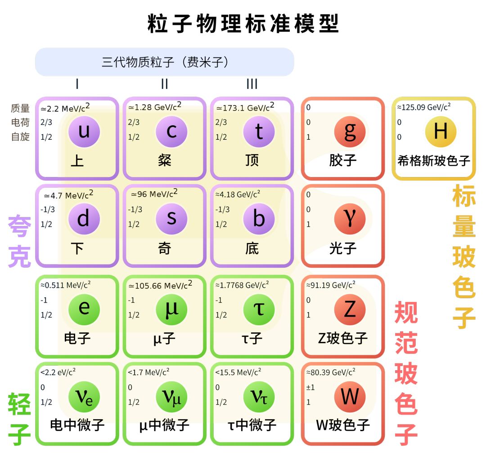
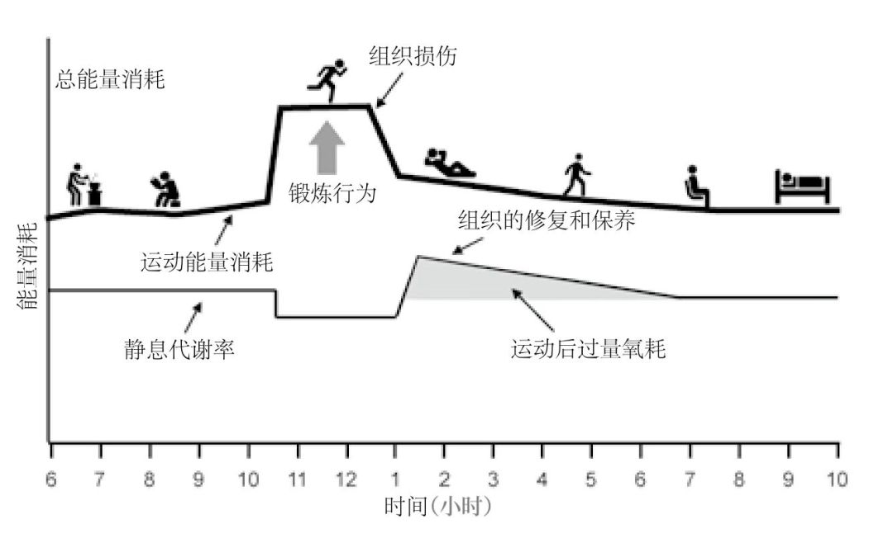
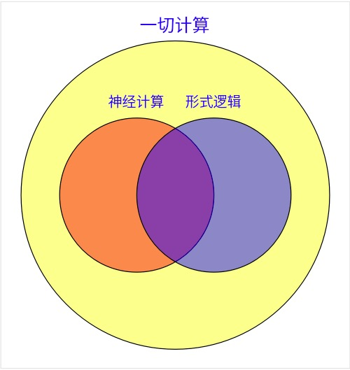
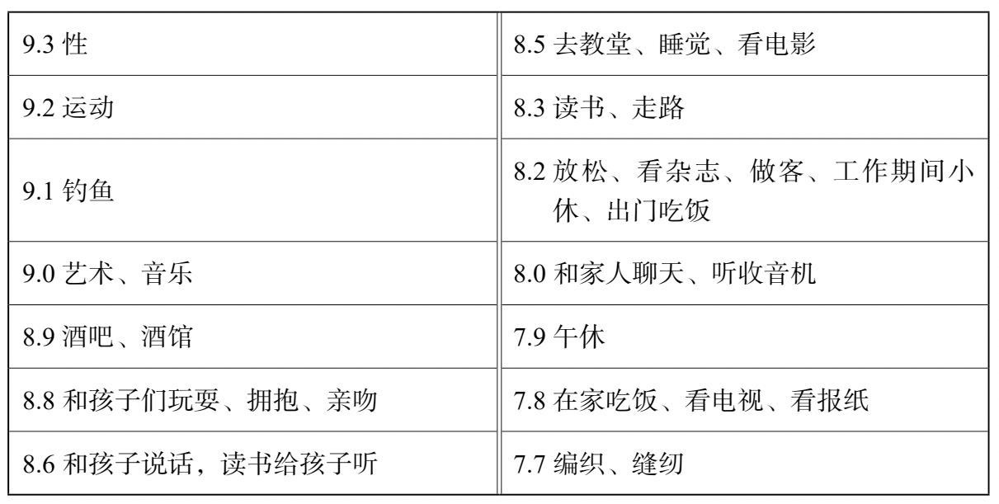

# 【DONE】《精英日课第五季》万维钢

内部掌控，外部影响

超越身份思维、观念同步更新、价值观向下兼容。

1.「内圣」是说你要有强大的内心修养；「外王」是说你要有领导力和影响力。2.在刺激和回应之间找到了自主的余地，能做出正确的选择，这就是对自己内心的掌控，就是「内圣」。3.用自己的内核去对接别人的内核，去激发他们最好的一面。这就是「外王」。

中庸就是对内掌控好自己的内心以达到能随时用理性统率情绪的境界，对外处理好各种事务以达到随机应变恰到好处的水平。

人生应该既有价值观，又有目标

理想人生的所有目标，最好都是从你的价值观中提取出来的。你的价值观会有很多个取向，你最好专注于一个方向用力。设定并且完成一个个从这一项价值观中提取出来的目标，就是你的「目的」。我用一个公式概括，就是 \[2] ——目的 = 价值观 × （目标1 + 目标2 + 目标3 + …）目的是一个以价值观为导向的目标系统。

价值观是高速公路，里程碑是目标，有里程碑的高速公路是目的

实现人生目的的五个过程：扰动，寻找，定义，专注，融合

「智力」是能帮你更快更好地把一件事做成的能力，「智慧」则是问自己为什么要做这件事的能力。

这就是为什么梦中的感觉那么真实 — 因为当时你没有评判力。你处于看见啥都信的状态。

妥协并不非得是双方都在自己的立场上往后退，更可以是往“上”走，到比当前各自立场更高的地方去找一个共同的立场。

我和你奶奶，我们从来都不是50和50的关系。我们从来都是90和10的关系。有时候给她90，我留10，有时候她给我90，她留10。当你爱对方的时候，你总是给对方更多……而不是讲什么公平。

王大顺的研究说，那些一生都在漂泊毫无定性的人是不太可能成功的，那些一辈子专攻一个小领域的人也不太可能成功。最成功的是那些经历几年探索期，再接几年深耕期的人。

星空信使

多样性高，意味着其中更容易出极端情况。比如黑人，跑的最快的和跑的最慢的都在非洲，最高的和最矮的也在非洲，最笨的和最聪明的在非洲

我们把这个道理推而广之，对于结果没影响的问题，就不要花时间。

我们的目标不是确保每一个选择都是精确的，而是确保在重大问题上的选择是准确的。要把宝贵的时间和精力留给更重要的问题。

光刻机，是人类有史以来最复杂的机器。我相信它比大飞机、火箭、宇宙飞船、包括詹姆斯·韦布太空望远镜都要复杂，都要高难度。

飞利浦的光刻机部门后来分出去成了一家独立公司，也就是ASML。这一次结缘给台积电日后跟ASML的密切合作埋下了伏笔。

从2000年代开始，半导体行业是由三种芯片组成的 ——

第一种叫逻辑芯片，也就是电脑的CPU和手机上那个主芯片，讲究摩尔定律。美国只剩一家英特尔在生产，韩国有三星，然后就是台积电。

第二种是存储器，就是内存和闪存。能造这种芯片的公司比较多，主要集中在东亚。

第三种则是声卡、显卡、通讯之类的功能性芯片。这种芯片不强求主频高，不在乎摩尔定律，关键看特殊功能的设计。因为门槛低，很多小公司在做，自己只管设计，找大厂代工就行。

像Google、亚马逊、Facebook、微软、腾讯、阿里巴巴都在搞自己的人工智能芯片。这些公司之所以能做芯片，包括高通之所以能做通讯芯片、苹果之所以能拥有自己的芯片，全都是因为张忠谋发明了「你设计，我制造」这个商业模式。

结果就是今天世界上能使用极紫外光刻机生产芯片的只有台积电和三星这两家公司。三星自己设计和制造芯片，别人家公司不敢把芯片设计图纸给三星制造，怕技术泄露。

\* 搞芯片设计的公司很多，也容易达到高水平，但设计用的软件是美国的；

\* 能制造最高端光刻机的，只有荷兰ASML一家，而ASML的主要技术专利和关键供应商是美国的；

\* 能生产高端芯片的，只有台积电、三星和英特尔三家，其中台积电最为先进；

\* 硅片等原材料由日本控制，而日本听美国的；

\* 存储芯片和专用芯片要求的工艺不高，包括中国在内很多公司都能生产。

你意识到自己有负面情绪，明确标记了那个负面情绪，你的负面情绪立即就减轻了。

每一项次级奖励的背后，都有初级奖励的影子。比如很多说不清楚为什么的习俗背后，其实有对应的科学原理。比如印度人爱吃辛辣不是文化，而是辛辣的食物能抑制细菌生长

人类学家把那些沉浸在一个文化里的人自己对一种文化现象的解释，叫做「主位（emic）解释」，主位解释往往是错的。学者站在外边，考察来龙去脉之后找到的终极解释，叫作「客位（etic）解释」，客位解释才是真正的解释。

1\. 见到无主的资源，别管自己实力大小，用最快速度先把它占了再说 —— 你先占就是你的；

2\. 你的主张一定要有正式名分；

3\. 名分的本质是人们都预期，谁不承认它谁就得面对激烈争斗；

4\. 力量大小远远没有名分重要；

5\. 但一件事如果有几个互相矛盾的名分，冲突就会发生，就得看力量大小了。

氘和氚是氢原子的两个同位素，氘是由一个质子和一个中子组成，氚是由一个质子和两个中子组成。它们两个聚在一起，会变成一个大原子核，也就是氦，和一个中子。其中这个氦原子核由两个质子和两个中子组成。现在有意思的事情发生了。反应两边质子和中子的个数一个没多一个没少，但是反应出来的那个氦原子核的质量，加上那个中子的质量，要小于之前氘和氚的质量之和 \[1]。那么根据爱因斯坦相对论，相差的质量就变成了能量，这个能量就是核聚变送给我们的礼物，可以用来发电。

1.论心还是论事，跟事情本身的性质没关系，纯粹是是否需要协调的问题。

2.该论事的时候，就一定要做得光明正大，越多人看到越好。这就是各种仪式和礼仪的底层逻辑。

3.该论心的时候，就要尽量低调，避免让人形成高阶信念。

得位，就是观点的水平达到了当前讨论的层次，抓住了其中的重点逻辑关系[^1]。你说的得位，你的话才值得听。

1.我们之所以愿意投入那么大的成本去做一项事业，绝不仅仅是为了热爱 —— 更根本的原因是我们要从中收取物质回报和社会回报。

而任何行为的最最直接原因，一共只有四种——第一是感官追求，也就是他想获得一种感觉。比如有的人整天咬指甲，就是因为喜欢咬指甲的那个感觉。第二个原因是逃避，也就是逃避自己不喜欢的事物。这个孩子为什么总在教室里乱跑啊，为什么他总不听话啊，为什么他对老师很不尊重啊，他想逃避学习。第三是试图引起别人的注意。老师正在讲课，这孩子在下面弄个怪声，或者在一群人中故意讲不合时宜的笑话，可能都是想吸引注意力。第四个原因是试图得到某种有形的东西，比如一个玩具。

地位高于金钱，金钱在相当程度上也是一种地位，追求绝对幸福比追求相对幸福容易得多。

健康、家庭和实实在在的生活，带给我们的是绝对幸福。

幸福有两种：一种是由跟别人比较的地位决定的相对幸福，一种是跟自己比较、自己说了算的绝对幸福。[^2]

效率当然重要，但是如果只有效率，那是一条可悲的竞争路线。只有高效率，本质上就是承认了你的可替代性：只要别人效率比你高，就可以立即替代你。

真正的战略是什么样的呢？鲁梅尔特这本书的核心思想，是你必须从考察自身出发，找到你面临的「关键难点（crux）」是什么。关键难点又叫「核心悖论（core paradox）」，也就是到底是个什么机制在阻碍你、约束你，为什么你这个事儿总做不好——把这个核心悖论搞清楚、突破了，你的问题才能解决。真正的战略是找到和解决关键难点[^3]。

你看是不是这才像战略的样子。找到关键难点，结合自身有什么特长，看看你能调动什么杠杆，怎么把这个关键难点解决，然后才是具体的步骤，这才叫战略。

这一讲的教训是战略不能生搬硬套，不是从一本攻略大全里做选择。战略必须是从自身出发，找到关键难点，搞清楚主要矛盾，再看看自己有什么特长和杠杆，创造一个解法。

总而言之，企业家的本分是让公司增长，而为了增长你最应该想的只有两件事：你能为市场创造什么独特的新价值，以及你能去哪开辟新的市场。

战略，必须得设定优先次序，看看哪些是最重要的，哪些是你能做的，而不是给巨婴们送圣诞礼物。

巨婴会提出各种愿望，那些愿望都是互相冲突的，政客只会对这些愿望和稀泥和寻求妥协，只有战略家才能选择一些愿望，放弃一些愿望，并坚决执行。战略必须得有确定的优先级和可行性。

标准模型把所有基本粒子分成三类——第一类基本粒子构成了各种物质，包括夸克、电子和中微子；第二类基本粒子负责传递各种物质之间的相互作用，包括光子、胶子等玻色子；第三类基本粒子只有一个，那就是著名的“上帝粒子”——希格斯玻色子，它赋予其他基本粒子质量。

你可以看到三个夸克不断地互相传递某种“小球”——那个小球就是「胶子」，负责传递强相互作用。基本粒子物理学认为除了引力之外，各种力都是由某种粒子传递的。比如你上中学学的那个“电磁力”，就是由光子负责传递的。

第一个原则是休息必须和工作分开[^4]。你得从压力模式切换到放松模式。

第二个原则是一定要有正式的休息时间。回家干家务活不是休息。

第三个原则是根据自身状况选择休息形式。简单说，有两种休息形式：一个是纯放松，一个是学点东西[^5]。休息的本质是解除压力状态。理直气壮地要休息，是现代人边界感的一部分。

七十岁以前，在很大程度上，不是衰老让你减少了运动——而是你因为减少了运动而衰老[^6]。

八十岁以后身体好不好主要看基因，八十岁以前身体好不好主要看锻炼。[^7]

1.现代生活中三个最不正常的现象：肥胖、久坐、未老先衰。2.应对以上不正常现象的最靠谱的方法，就是锻炼。3.一个锻炼理念，叫做「“超值修复”假说」，锻炼会开启你身体的自我修复，这个修复不仅仅会修复这次锻炼带来的损伤，也会把身体之前的损伤给修复一些。你的身体获得了一次小小的重生。4.现在学界公认性价比最高的锻炼方法：中等强度有氧运动、中高强度有氧运动、高强度间歇训练和力量训练[^8]。

学一门外语、一件乐器、一个体育项目、新的歌曲和舞蹈，或者哪怕读一本你不熟悉主题的书，都能起到这样的效果。原则是这件事必须对你是比较困难的，你感受到了挑战，你必须费一番心力才能做好。

那些八九十岁的超级老年人，仍然在每天迎接新挑战 \[4]。这才是他们跟一般人最大的不同。他们不断走出舒适区，他们忍受——实际上应该说享受——学习新技能过程中的不适感。

《首要怀疑》

对天气预报模型来说，麻烦就在于小尺度的湍流。

还是洛伦兹，在1969年的一篇论文中首先讲了这个问题。他在1971年的一次会议上提出：「巴西的蝴蝶扇动翅膀，会不会给德克萨斯州带来一起龙卷风？」说的就是湍流，这就是后来「蝴蝶效应」这个典故的出处。

天气预报其实有两种。前面说的要精准预报某一天的天气怎么样，那属于「短期天气预报」，最长期限14天，你要解纳维尔-斯托克斯方程。

1.原始世界信念就是你对这个世界最基本的信念是什么，就好像某种原始冲动一样，你内心最直觉地认为这个世界本质上是好的还是坏的，是安全的还是危险的，是有趣的还是无聊的。

2.往往并不是人的经历决定了世界观，而是人们在用自己的世界观去解释自己的经历。

3.原始世界信念，可能更多的是被灌输的结果——尤其是来自家长的灌输。

进化论的核心思想是基因随机突变，环境自然选择。本质上，物种的适应性不是体现在跟另一个物种之间的竞争，而是体现在对环境的适应。[^9]

你的婚姻幸不幸福其实主要不是取决于你的另一半——而是取决于你自己。预测你婚姻幸福的最重要指标是你结婚之前是不是幸福：如果你在结婚之前对生活就很满意，也不抑郁，总是很乐观很积极，你结婚之后也会是这样[^10]。你原本就有的幸福感对婚姻幸福的预测度，要比另一半身上\*所有\*的指标加起来的重要性还高出4倍。

寻常的吸引点——长相、身高、职业、个性像不像你什么的都根本不重要。如果要强行挑选，那就找那些拥有好品质的人，包括生活满意度、安全依恋风格、尽责性和成长心态[^11]。

切蒂的洞见是，社区对孩子真正的影响，是孩子把身边的大人当成了榜样。

当我们评估若干个理由的说服力的时候，我们不是在计算总数，而是在取平均值。

凯利认为人生本质上是一个「探索——优化（explore -- optimize）」问题：你应该不断探索自己想要成为一个什么样的人，并且在选定的方向上努力优化。「别成为最好的，成为唯一的。」

一个是「体验自我（experiencing self）」，它活在当下，负责感受此时此刻的感觉是好还是不好；另一个是「记忆自我（remembering self）」，负责生成故事、存下对这段经历的记忆。

记忆自我讲故事衡量的是情感，而情感是由这段经历中的变化、重要时刻和结局所决定的。这也就是我们多次讲过的「峰终定律」：我们评价一段经历都是根据这段经历中最极端的时刻和结局来评价的

所以如果你希望日子过得慢一些、充实一些，就应该给生活增加一些惊奇和冒险，多探索新事物——墨守成规几十年如一日的生活是浪费生命。

好事儿可以给意外惊喜，坏事要给人确定的预期。难受的经历，预期越清晰感觉越好。这就是为什么长途航班一定要给旅客清晰预期，不单是飞行时间，有的航空公司连几点关灯、几点开饭都事先交代好。

不确定性之所以给人压力，根本原因是不可控。

1.失败项目的一般规律是「快速思考，缓慢行动」，成功的项目则是「缓慢思考，快速行动」。[^12]

2.我们应该把项目分成两个阶段：规划和执行。前期是思考，后期是行动。

3.做大项目要想成功，根本原则就是谋定而后动：谋要慢慢地谋，动要快速地动。正所谓不动如山，侵掠如火。

大事计划失败的最根本原因，就是匆忙的commit。人们总是匆忙下手的原因有三种：1.过度自信、盲目乐观。2.战略误导。3.目的不明确。

1.所有足够复杂的好东西都是迭代出来的，而大项目的迭代必须发生在计划阶段[^13]。

《后资本主义生活》

我们真正应该算的是「时间」：这个产品或服务真正的价格，是你需要工作多长时间才能购买它[^14]。

财富的价值，取决于人们对这个东西的观念。一片荒地本来不值钱，城市规划方案一出来马上就值钱了。这块地的价值并不是土地本身这个物质，而是人们在土地上看到的愿景。

《医学的随机行为》

内科看知识(年轻医生)，外科看经验(年长医生)[^15]

女医生内科更好

沟通能力很重要。信任你才更配合

医学能力和学校背景没关系

《超预期寿命》

心脏病

癌症

神经退行（阿尔兹海默症）

2型糖尿病

80岁以前靠运动，80岁以后靠基因

四骑士找上百岁老人晚于正常人20-30年

胰岛素负责把单糖送到各个地方[^16]

碳水化合物变成糖原，糖原是葡萄糖的备份

先消耗血液葡萄糖，不够再消耗糖原，还有多的糖原会变成脂肪，首选皮下脂肪，是健康的。还有多的送四个地方：脂肪肝（肝脏），胰岛素抵抗(肌肉)，内脏脂肪（腹部），动脉粥样硬化（血液）

我们最应该关心的是三个指标：心肺功能、肌肉力量和稳定性。

你的心率大约是你最高心率的70%-85%。

运动初学者，每周两次、每次30分钟就大有助益。如果你有一定的运动基础，每周4次、每次45分钟效果更好。

心肺功能。最大摄氧量。越大越好，没有上限。快跑4分钟，慢走4分钟，反复4-6次。一周1-2次

稳定性是指你控制身体的程度。双手叉腰站立的时间来衡量。四十多岁的人的标准是闭眼单腿站立7秒钟，睁眼40秒钟；七十多岁则是闭眼2秒钟，睁眼18秒。[^17]

让身体变好靠锻炼，身体太差才需要饮食干预

第一，不要喝任何含有果糖的饮料。

第二，酒精没有任何健康好处。

第三，地中海饮食。橄榄油，坚果

一、决策过程有四个阶段：

1. 定义问题：要明确你想要实现什么目标，以及阻碍你实现目标的障碍是什么。
2. 探索可能的解决方案：看你能不能创造性地发现新选项。
3. 评估各种选项，做出判断：你得知道什么重要什么不重要，你需要先设定一个标准。
4. 执行最佳方案：坚持之前的决策。

-后果很小，直接决策，不用调研；

-后果不严重，具有可逆性的，要快速决策；

-后果严重而又不可逆，「边际效益递减」。当你感到判断正在收敛，新信息进来已经不能让你改变想法的时候，应该停止调研、开始行动。

《隐藏的潜能》

四种对人重要的品格，幼儿园重要

1\. 积极主动（Proactive）：主动提出问题、主动回答问题、主动从书本中寻找信息、主动在课外向老师请教；

2\. 亲社会（Prosocial）：善于跟同伴相处和合作；

3\. 讲纪律（Disciplined）：能集中注意力，不扰乱课堂秩序；

4\. 有毅力（Determined）：遇到困难问题能坚持求解，而且愿意完成比指定工作更多的任务。

普通人想要成为优秀人才必须有智商，但是从优秀到卓越不是靠智商，而是品格和智慧。

喜欢一件事和喜欢一件事带来的结果是两回事。前者是发自内心真正的热爱，后者是强迫热爱。

「最优秀的团队不是拥有最好的思考者的团队，而是能发掘和利用每个人最好的思考的团队。

三种克服困难、避免训练倦怠的方法：间隔休息、交叉练习和刻意游戏。

把管理作为一种专门的技能，让最会当领导的人当领导，让业务骨干继续做业务 —— 当然，前提是你必须允许业务骨干拿比领导高的工资

你干这个工作干得特别好，于是你被提拔，去干一个别的工作；你干那个工作又干得特别好，于是组织会再次提拔你……就这样一步步提拔，直到，你被提拔到一个你干不好的位置为止。彼得原理使得每个人都在做自己干不好的工作。[^18]

《一如既往》

不变的是人性：

- 被贪婪和恐惧所驱动；
- 被风险、嫉妒和部落归属感所说服；
- 表现出过度自信和短视；
- 把确定感当成一种幸福……

比平等更深层的人性是期望。你的幸福感不是由你的绝对生活水平决定的，而是由你的生活水平跟你的期望之间的差距决定的。

概率感的扭曲是出自事情的印象和事情的实际分布的不对称；而印象的不对称则是因为“你想听”和“你不想听”这两种情绪的不对称。

「生活中大多数伟大的事情 —— 从爱情到事业再到投资 —— 都是从两个东西中获得价值：耐心和稀缺。」

当你遭遇困难、艰苦到怀疑人生的时候，应该坚持还是放弃？标准很简单：看是否稀缺。稀缺就值得。而且特别值得。需要用耐心购买的东西，是最贵的东西。

1\. 经济稳定的时候，人们会变得乐观；

2\. 乐观会让人借债；

3\. 债务会让经济不稳定。用一句话概括：稳定就是不稳定。

人类原本擅长的、天生就会的计算，其实是神经计算。

所谓形式逻辑，就是把问题变成数学问题进行推导。

再比如你想要戒烟，跟朋友聚会时，有人给你递了一支烟，请问你应该怎么办。直观的回答是“不用了，我正在戒烟” —— 这个回答就太软弱了。你是在强调戒烟这个行为，你是一个挣扎中的烟民。正确答案是“我现在不抽烟了。”我的身份变了，我不再是烟民了。

养成好习惯的最好办法是两步 ——1. 选定一个新身份，看看你想成为什么人；2. 用生活中点点滴滴的小成就来向自己证明你就是这样的人。[^19]

任何组织的总价值的一半，是由这个组织总人数的平方根创造的。[^20]

金钱在很大程度上是一种地位，它带来的幸福感是相对的，是比较出来的。

幸福有两种：一种是由跟别人比较的地位决定的相对幸福，一种是跟自己比较、自己说了算的绝对幸福。

超级老年人的生活方式有一些共同点，是普通老年人所不具备的：锻炼、饮食、听力和视力、社交。最重要的因素，是学习。学习一项新技能，要在学习区，让新神经元保持链接

第一，世界是安全的，还是危险的。

第二，世界是精彩的，还是无趣的。

第三，世界是活的，在跟你互动，还是只不过是在机械地运转，并没有目的。

原始世界信念，可能更多的是被灌输的结果——尤其是来自家长的灌输。

陶渊明派读书法是以泛读为主，随着功力提升你会越读越快；司马迁派则是以精读为主，要求你把书中的逻辑脉络彻底搞懂

金钱买不来众人对你的认可，权力总会过期，只有地位才能真正让你满意。用暴力换取的支配型地位在现代社会越来越危险，但有时候也有效；对大多数人来说，声望型地位是最好的追求。

我们的记忆强度不是由事情的频率决定的，而是由事情给我们造成的情感强烈程度决定的。

一个有效的复杂系统总是被发现是由一个有效的简单系统演变而来。一个从零开始设计的复杂系统永远不会工作，也不能通过修补来使其工作。你必须从一个简单的工作系统重新开始[^21]

能用的复杂系统一定是演化出来的而不是设计出来的。

批评人的2条要求：有建设性、可执行性

怎么判断你是不是人才？如果你提出离职，你的上司想不想留你

你可以不按照流程办事，但是出了问题你要为最后的结果担责

责任越大，才能越自由

你考察科技史，伟大的创造几乎都是由一些谁也想不到的人、在谁也没计划的领域中做出来的。

[^1]: 得位，就是观点的水平达到了当前讨论的层次，抓住了其中的重点逻辑关系

[^2]: 幸福有两种：一种是由跟别人比较的地位决定的相对幸福，一种是跟自己比较、自己说了算的绝对幸福。

[^3]: 真正的战略是找到和解决关键难点

[^4]: 休息必须和工作分开

[^5]: 有两种休息形式：一个是纯放松，一个是学点东西

[^6]: 因为减少了运动而衰老

[^7]: 八十岁以后身体好不好主要看基因，八十岁以前身体好不好主要看锻炼。

[^8]: 现在学界公认性价比最高的锻炼方法：中等强度有氧运动、中高强度有氧运动、高强度间歇训练和力量训练

[^9]: 进化论的核心思想是基因随机突变，环境自然选择。本质上，物种的适应性不是体现在跟另一个物种之间的竞争，而是体现在对环境的适应。

[^10]: 预测你婚姻幸福的最重要指标是你结婚之前是不是幸福：如果你在结婚之前对生活就很满意，也不抑郁，总是很乐观很积极，你结婚之后也会是这样

[^11]: 寻常的吸引点——长相、身高、职业、个性像不像你什么的都根本不重要。如果要强行挑选，那就找那些拥有好品质的人，包括生活满意度、安全依恋风格、尽责性和成长心态

[^12]: 1.失败项目的一般规律是「快速思考，缓慢行动」，成功的项目则是「缓慢思考，快速行动」。

[^13]: 所有足够复杂的好东西都是迭代出来的，而大项目的迭代必须发生在计划阶段

[^14]: 这个产品或服务真正的价格，是你需要工作多长时间才能购买它

[^15]: 内科看知识(年轻医生)，外科看经验(年长医生)

[^16]: 胰岛素负责把单糖送到各个地方

[^17]: 稳定性是指你控制身体的程度。双手叉腰站立的时间来衡量。四十多岁的人的标准是闭眼单腿站立7秒钟，睁眼40秒钟；七十多岁则是闭眼2秒钟，睁眼18秒。

[^18]: 你干这个工作干得特别好，于是你被提拔，去干一个别的工作；你干那个工作又干得特别好，于是组织会再次提拔你……就这样一步步提拔，直到，你被提拔到一个你干不好的位置为止。彼得原理使得每个人都在做自己干不好的工作。

[^19]: 养成好习惯的最好办法是两步 ——1. 选定一个新身份，看看你想成为什么人；2. 用生活中点点滴滴的小成就来向自己证明你就是这样的人。

[^20]: 任何组织的总价值的一半，是由这个组织总人数的平方根创造的。

[^21]: 一个有效的复杂系统总是被发现是由一个有效的简单系统演变而来。一个从零开始设计的复杂系统永远不会工作，也不能通过修补来使其工作。你必须从一个简单的工作系统重新开始
