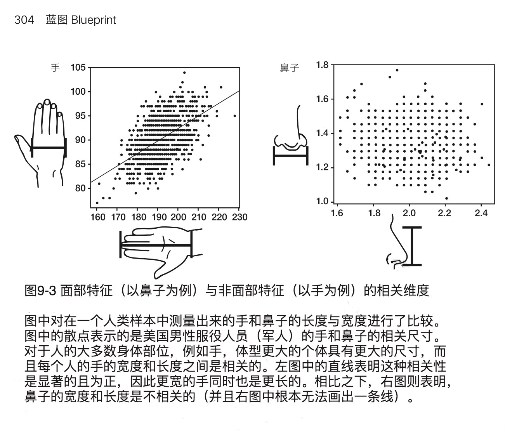
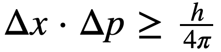
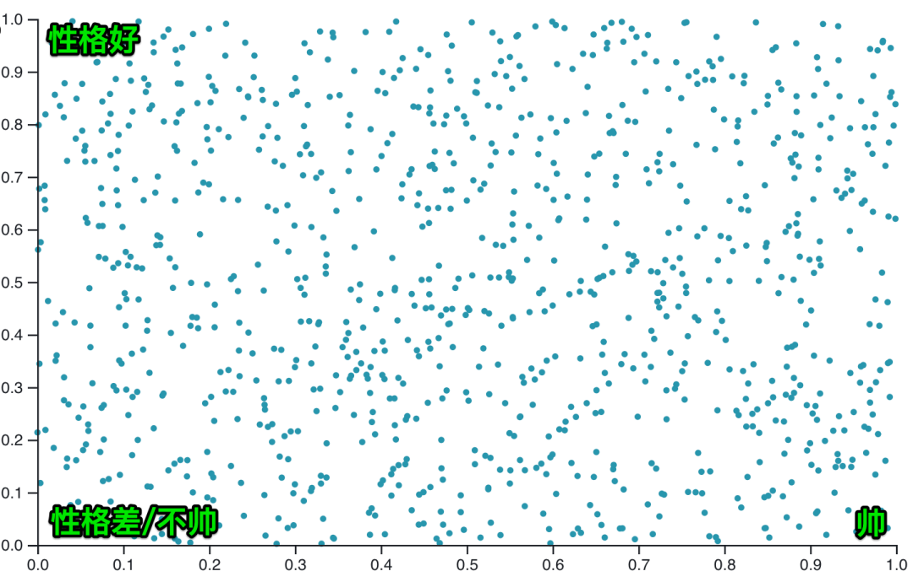
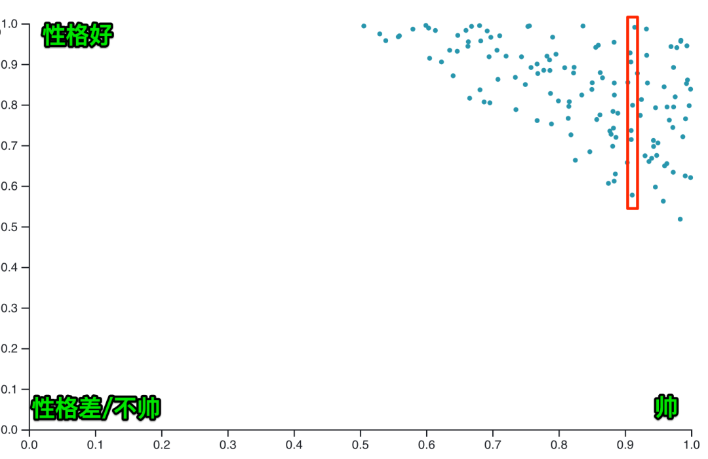
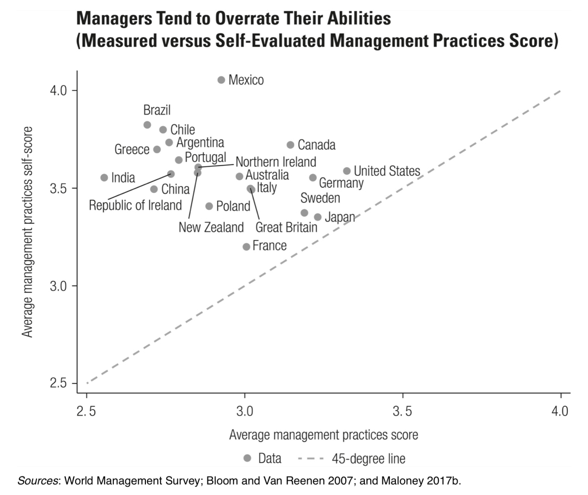

# 【DONE】《精英日课第四季》万维钢

## 目录

- [《上游》](#上游)
- [《你当我好骗吗》](#你当我好骗吗)
- [《我们如何学习》](#我们如何学习)
- [《重新思考》](#重新思考)
- [《不可能的技艺》](#不可能的技艺)
- [《量子力学》](#量子力学)
- [《噪声》](#噪声)

# 《上游》

1. 从前有两个交通警察，他们的使命都是要减少交通事故。第一个警察发现一个事故多发地段，有个坡，人们容易开快车，视野还不好很容易出事。于是这个警察就把自己的警车停在路边最显眼的地方，司机远远就能看见警车，怕吃罚单赶紧主动降速，结果这个地段就没有了事故。 而第二个警察的做法是躲起来，不让人看见他的车。等司机已经违章超速了，他再过去把车拦下来开罚单。 你想当哪个警察。 第一个警察是治未病的，他把事故消灭于萌芽状态，他防患于未然。但是没有人注意到他的工作。他就如同是扁鹊的大哥。而第二个警察是扁鹊：每次出去都能得到一大堆罚单，完成了任务指标，工作高度可见，可能还会立功得奖。&#x20;
2. 没有人要求你去做，也不是你应当做的事情，它不紧急但很重要，所以你主动要求去做，这才叫上游思维
3. 第一，在别人看不见问题的时候，你得能够发现问题。 第二，不是你的事儿，你也要当做你的事儿。 这才是上游思维[^1]
4. 你每天做的哪些事是必须得做的，哪些事是可以自己选择做的。我们要意识到可选项的宝贵，像安排工作时间一样安排余闲。 特朗普再忙，该度假度假；邓小平琢磨的事儿再大，不耽误打桥牌。疲于奔命的状态并不值得自豪。如果一个人忙得没有余闲，你就别指望他能思考大事 —— 说好听点他就是一个工具人，说极端点他是一个奴隶。 可丁可卯，做每一件事都要体现效率从来不浪费时间，一天到晚跟打仗一样连开玩笑、说闲话的都没有，这样的组织做的肯定都是小事。高水平工作需要浪费时间，创造性劳动需要没用的成分，上游思维需要气定神闲。
5. 决策分离：
   1. 参与者与拍板者分开
   2. 决策过程与决策结果分开。不能根据结果的好坏去评价决策水平。高明的决策者追求的不是每一次都赌赢，而是一个让赢的概率大于输的概率的科学决策系统。[^2]
   3. 决策贡献和决策身份分开，每个人都要敢发言
6. 考核指标会让官僚集团忘记自己的初心和使命，可是你要没有指标，他们简直就不知道该干啥
7. 邓小平说的“摸着石头过河”。中国要搞市场化改革，什么哈佛教授、芝加哥学派的经济学家都来给邓小平提建议，邓小平没有被别人一忽悠第二天就全国实施。但是邓小平也不是完全不听这些建议，他都是在先小范围弄几个试点，如果可行，再慢慢地向全国推广。
8. 要提出新政策，你至少要先问自己四个问题 ——&#x20;
   1. 第一，这个政策以前实行过吗，实行的效果如何？&#x20;
   2. 第二，能不能先在小范围做个实验？&#x20;
   3. 第三，执行政策的过程中，是否能够迅速得到有效的反馈，一边反馈一边改进？&#x20;
   4. 第四，如果事实证明这个政策不行，我们还能不能撤回来，回到从前的样子？
9. 不再渴望，是青春彻底死去的标志。意思是对新鲜的事物失去兴趣，不再能提起好奇心
10. 孤立，能让你更大胆地思考。卡赞引用了一些统计，说明创造力强的人物，常常是有点疏离感的人。比如艺术家和作家，小时候常常都是被视为是有点怪、有点特殊的孩子。
11. 跟下游相比，上游思维有三个不利之处。&#x20;
    1. 第一，下游的问题是显而易见的；而上游的问题不容易被看出来。&#x20;
    2. 第二，下游问题的责任非常明确，该是谁的事儿一清二楚；而上游问题没有明确的责任人。&#x20;
    3. 第三，下游的问题都比较紧急，不解决不行；而上游的问题常常是“重要而不紧急”的。&#x20;
12. 如何具备上游思维？
    1. 条件一：眼光：在别人看不见问题的时候，你得能够发现问题。&#x20;
       1. 你认为这里有个隐患，但是别人可都觉得没问题。而且就算有问题也不是你的问题。你作为一个旁观者，想要去解决一个在别人看来不存在的问题。没有人要求你去做，也不是你应当做的事情，它不紧急但很重要，所以你主动要求去做，这才叫上游思维。
    2. 条件二：责任感：不是你的事儿，你也要当做你的事儿。&#x20;

# 《你当我好骗吗》

1. 之所以被骗，不是因为骗子高明，而是因为被骗者愿意接受这个东西，是因为他们觉得这对自己有利[^3]
2. 只有两种人能稳定地存活下来：一种是开放而又机警的，一种是保守而又什么都听不进去的。
3. 宣传，并不能给人灌输什么新理念。宣传能做的只是再次确认人们之前就有的价值观、共识和偏见。
4. 人们为什么去信教？并不是像病毒那样听神父一讲就被感染了。大多数人坚持长期去教堂，是因为在教会中找到了社区感，大家经常互助，感觉挺温暖。
5. 广告有两个可能的作用。
   1. 第一个作用是告知，是让没听说过这个产品、不知道你是谁的人了解你。
   2. 第二个作用是好感，是让已经知道这个东西的人，改善对这个东西的印象。&#x20;
   3. 梅西尔这本书的结论是，第一个作用很明显，第二个作用几乎没有。

# 《我们如何学习》

1. 为什么人脑学习得那么快？因为每个人一出生，其实已经掌握了所有的知识
2. 六岁以前儿童最重要的学习方式是玩！是跟其他小朋友互动，体会亲情和友情，演练社交纷争，培养一个好性格[^4]，而不是背唐诗、算加减乘除和认识 500 个汉字。
   1. 那些背唐诗、速算之类的早教之所以流行，不是因为孩子需要这些，而是因为老师和家长们只会这些
3. 大脑的四种记忆：
   1. 第一种是“工作记忆（working memory）”。也叫短期记忆。
   2. 第二种是“情景记忆（episodic memory）”
   3. 第三种是“语义记忆（Semantic memory）”，是长期的记忆。晚上睡觉会把白天的情景重新编码；所以睡觉对学习是有帮助的
   4. 第四种叫“进程记忆（procedural memory）”，也可以叫内隐记忆，它记住的不是什么知识点，而是一段动作，可以说是肌肉记忆
4. 三种学习偏误：
   1. 成功偏误。模仿成功人士的一举一动，明显不对。
   2. 服从偏误。大多数人在做什么，你就做什么，也不对。
   3. 声望偏误。谁有名，谁声望大就听大的，更对了一些。
5. 认知再评估的本质就是，情绪是可以选择的，取决于你从什么角度看待一件事
6. 做错了什么事情，不要逃避责任也不要过于自责和懊悔，你可以把自己当成一个朋友，接受自己，鼓励自己[^5]。用这个方法直面错误，才能既吸取教训，又不至于让心态崩溃。&#x20;
7. 不是人们愚蠢到真的相信了什么东西，而是他们认为这样做对自己有利。
8. 人类的交流方式，就是开放的机警
9. 父母多跟孩子搞一些有意义的对话，比如说你问他一个问题，他回答，他再问你一个问题，你再回答，你们一起就一个话题展开讨论[^6]，这个活动能提高幼儿的智商。四岁以下的孩子如果经常跟父母有互动式的亲子阅读，能把智商提高大约 6 分。
10. 如果做一件事儿是“为了”什么什么，那这件事儿就是工具和手段；那个被“为了”的什么什么，才是目的。
    1. 比如锻炼身体，不是为了减肥，而是为了享受锻炼身体这个过程。目的不是减肥，而是享受
11. 你应该把最好的精力、最多的时间用在最能体现你价值的项目上。 设重点、偏科、不均匀、走极端，这才是自然之道。
12. 为什么我们更容易看脸识人，而不是看手识人？因为手的宽度和长度有相关性，而面部上的鼻子等细节尺寸没有相关性，五花八门，人更容易识别出来

    
13. 有时候学习不要强调有用，强调无用的学习才是真正的学习
14. 大脑喜欢言行一致，喜欢做事有始有终，喜欢表现得自洽和靠谱。所以一旦表态，你就会尽量让自己的行动符合那个表态
15. 学习的方向是 ——&#x20;
    1. 从特殊的事例，到一般的规律；&#x20;
    2. 从幻想和错觉，到现实和真相；&#x20;
    3. 从外表的丑陋，到深层的美丽；&#x20;
    4. 从上面的暴力，到底层的平和

# 《重新思考》

1. 一般谈判者和高技能谈判者的区别
   1. 一般谈判者从自己发，高技能谈判者从对方出发
   2. 一般谈判者会找3个以上理由，高技能谈判者只找1-2个理由。【如果你要说服别人，只要1个理由就好，不要太多理由】[^7]
   3. 一般谈判者喜欢说自己的理由，高技能谈判者喜欢提问
2. 对于蛮不讲理的人，可以问一个万能的问题：什么样的证据，才能让你改变想法？对方表现的越愤怒，自己就应该越平静和好奇，好奇对方为什么这么想[^8]
3. 对话的目的不应该是对观点做取舍，而应该是寻求更好的观点。[^9]
4. 组织文化的两个维度：安全感、责任感
   1. 怎么提升安全感：让领导本人先行动，当众表达自己接受批评的承受能力
   2. 同时有安全感，责任感，组织才能“团结紧张严肃活泼”
5. 那些从小立志要当科学家的孩子，到了一定年龄，常常意识到真正的科学家太厉害了，感觉自己比不过，就放弃了。反而是那些没有什么要“当科学家”的理想，只是喜欢做科学实验的人，反而对科学有更强烈的兴趣，更容易坚持下来。这个道理是你应该追求“做科学”，而不是“做科学家”。就算做不成科学，你还是你。你不需要用“科学家”定义自己的身份，更不需要用这个身份支撑自己活下去。[^10]
6. 有人说住三线城市不幸福，住北京才幸福。有的说北京太忙了不幸福，住海南三亚才幸福。有的说必须进入某个工作单位才幸福。这都是不懂幸福。事实是你如果在一个地方不幸福，换个地方也不见得幸福。
7. 职业、配偶和幸福都不是“匹配”出来的，是自我改变、自我发现和自我建设出来的。很多人以为应该找自己“感兴趣”的工作，可是你如果没做过、没深入做过，怎么知道自己有多大兴趣呢？深入的兴趣是培养出来的。

# 《不可能的技艺》

1. 现在你打游戏可以一连几个小时不抬头，一抬头发现天都亮了，这也是心流
   1. 心流，就是把注意力完全放在当下。注意力是心流的关键，前额叶皮质是注意力的关键
2. 心流有六个特征 ——
   1. 第一，注意力完全集中。
   2. 第二，意识和行动融为一体。你已经忘记了自己，你已经融化在这件事之中。
   3. 第三，内心评判声音消失
   4. 第四，时间感消失。
   5. 第五，强烈的自主
   6. 第六，强烈的愉悦感
3. 三级目标体系
   1. 一级：人生尺度上的目的。比如写出有影响力的书，推动某项事业等
   2. 二级：高难度目标。比如5个月以内写好一本书
   3. 三级：清晰目标。具体到每天要做的事情
4. 家庭背景决定下限，至少达到普通人的水平，孩子的智商决定上限，也就是是否优秀。孩子的优秀跟你\*本人\*够不够优秀很有关系 —— 因为他会遗传你的基因 —— 但是跟你是不是\*优秀的父母\*关系不大。
5. 如果要从优秀达到卓越水平，除了孩子自己的智商，还有两点：内在驱动+能理解和处理复杂问题[^11]
   1. 内在驱动。对一些事情的不妥协，有强大的目标感和使命感
   2. 你能理解和处理复杂问题
6. 从大脑的角度思考如何提高创造力
   1. 中央执行网络，注意力网络。注意力网络的主力是前额叶皮质，而前额叶皮质要长到 25 岁的时候才能完全成熟。小孩的前额叶皮质还没长好，所以他们的注意力比较弱，容易分心，容易冲动
   2. 默认模式网络。待机模式，自由想象，创造力从这里而来
   3. 突显网络。时刻监视各种想法和各种信息，评估它们的重要性

# 《量子力学》

1. 新一代物理学家可以先假装要测量波，等到光子已经不得不表现出波的样子，但是仍然在飞行之中、还没有最终到达目的地“官宣”的那一刻，突然改变主意，改成要测量粒子，你猜光子会怎么做？ 答案是它不但会临时变成粒子，而且还要改写自己之前的行为。
2. 所谓“量子纠缠”，是真的。互相关联的两个粒子，哪怕距离非常遥远，只要其中一个的量子态发生改变，另一个就会立即随之改变。这意味着它们之间存在某种超光速的、甚至是瞬时的协调。
3. 黑体，就是它不反射别的光，它发出的都是它自身的光。太阳、烧红的烙铁、黑暗中的人体，这些东西都可以近似为黑体。黑体发出的光是由它的热量导致的，也就是热辐射。
4. 海森堡不确定性原理：不可能同时精确知道一个电子的位置和动量[^12]。它的位置不确定性（Δx）和动量不确定性（Δp）都满足下面这个关系 ——&#x20;

   
   1. 要想知道一个电子在哪里，你就得用光去照一照它。光的分辨率取决于波长，波长越短，分辨率就越高，探测越精确。所以想要精确地测量一个电子的位置，你就得用波长非常短的光。而根据光量子理论，波长越短频率就越高，光子的能量就越高。你的测量实际上是用高能量的光子去打这个电子，你会把电子给打飞！那么你这个高能光子带来的冲击，就会掩盖电子原来的动量。 反过来说，如果想要精确测量电子的动量，你就得用能量比较低的光子去撞击它，而这就意味着那个光子的波长比较长，你就不能准确判断电子的位置。 总而言之，位置的测量误差和动量的测量误差有一个取舍关系，它们不可能都很小。
5. 量子力学的真正观点不是“测不准”，而是“不确定”。 不是你的能力问题，是电子的本性问题。 电子根本就不能同时拥有确定的位置和动量。不论是什么东西，电子也好、光子也好、宏观物体也好，位置和动量永远都有一个最小的不确定性，受到普朗克常数的限制。不是你测不准，不是你看不见，而是电子*根本就没有*确定的位置和动量，电子的行为有一种内在的不确定，它永远都是模糊的。 这个原理叫做“海森堡不确定性原理”。
   1. 世界上没有绝对静止不动的东西。这是因为如果一个粒子的速度是绝对的 0，那它就没有动量的不确定性，那么它的位置的不确定性就必须是无穷大，那么它就必须同时出现在宇宙中所有的地方[^13]
6. 量子力学只会算概率，只会计算大量数据的宏观概率，而无法预测单个电子的具体行为
7. 你把人的质量带入薛定谔方程求解，理论上也有一个不为零的概率，人可以穿墙而过。但是那个概率实在是太小太小了。
8. 你感受到的一切，都是电子间的电磁相互作用。你手上的电子和墙上的电子都带负电，它们一离近了就互相排斥。根据不同的距离和温度，这个排斥力有时候强有时候弱，有时候密集有时候稀疏，而你的全部感觉都来自于这个排斥力。
9. 中微子有三种，分别是“电子中微子”、“μ子中微子”和“τ子中微子”，再算上它们各自的反物质，也可以说一共有六种。这些名称你现在都不用管，中微子有个奇特的性质值得说一说。中微子非常轻，速度接近光速。
10. 热水为啥烫手？因为水分子的运动速度太快，速度快的分子撞在你的手上，你当然会感到疼痛。

# 《噪声》

1. 错误 = 偏差 + 噪声。对错误来说，偏差和噪声的贡献是一样大的。减少噪声，哪怕结果都是偏的，也比既是偏的又有噪声好一倍。哪怕你不知道偏差有多大，也应该减少噪声。
2. 偏差不是毫无规律的错误，而是“可预测的非理性”，是大脑中的思维定势。毫无规律的错误是噪声，有规律的错误是偏差[^14]
3. 判断力偏差的可能原因之一：替代偏差。为了回答一个比较难的问题，我们选择了一个简单的问题来替代它，并且把这个简单问题的答案，当做那个难的问题的答案。[^15]
   1. 评估一件事发生的概率是个难的问题，所以人们会用“我是否容易想到这样的事情？”这个简单问题来替代它。
   2. 替代偏差是给了某些容易获得的信息过高的权重，给自己不了解的信息过低的权重
4. 你不能简单说这人是什么性格，你应该列举他在各种不同场合中有什么不同的性格。同一个人在不同的场景下的性格表现是不一样的
5. 做判断一定不能只看眼前这一件事，一定要向外看，看看跟这件事类似的事情，都有什么样的结果
6. 临床判断明显不如机械预测，而复杂的机械预测往往并不比简单的机械预测好多少。
7. “想太多”弊大于利：想太多会大大增加你的判断噪声，通常不如按照几个简单指标、几条简单规则走标准化判断流程。[^16]
8. 如何机械预测
   1. 找评价指标，不超过5个
   2. 打分，每个指标设定分数区间
   3. 不用加权，直接相加得到总分
9. google面试的4个指标。指标不用多，多了有噪声，不如几个简单指标靠谱
   1. 一般认知能力
   2. 领导力
   3. google文化
   4. 专业角色知识
10. 如果你的判断力强，你就配得上拥有标准；如果你的判断力弱，你就只能拥有规则
    1. “请小心驾驶”是个标准，“限速120公里”就是规则。
    2. “反对职场性骚扰”是标准，“禁止任何身体接触”是规则。
    3. “企业必须在可行的范围内给员工提供安全的工作场所”是标准，“消防设施必须经过检查批准”是规则。
    4. “禁止攻击性言论”是标准，而“禁止出现裸体图片”则是规则。
11. 如果你尊重规则，你就可以不遵守规则；如果你不尊重规则，你就必须遵守规则。
12. 伯克森悖论是说，哪怕上面这些人的经验都是真的，他们从经验中总结出来的结论，也很可能是错的。
13. 很多人认为漂亮的女生都不聪明，颜值高的演员都没演技，有特长的人必定有明显短板，家里条件好的大学生必定不用功，这些都是伯克森悖论导致的偏见。出错的根本原因都是你统计的数据不够全面[^17]。平庸的寒门子弟、遵纪守法的富人、没有英雄壮举的屠狗辈、忠诚的读书人和安享晚年的好心人，他们的新闻阈值太低，他们的事迹没有四海传扬。你必须把这些人都统计上，才能得出正确的结论。

    

    
14. 幸存者偏差说的是因为我看到的这些个体都具有这一个特征，我就认为所有相关的个体都具有这一个特征，或者具有这样的特征才能成为相关的个体。 而伯克森悖论则更强调两个特征之间的关系。长得帅和性格好，是在一群人中被平等选择的两个特征，它们之间本来可能根本没有关系，仅仅是因为选择而有了关系。
15. 华为有一万五千人做基础研究，负责把钱变成知识；另有六万名工程师负责把知识变成钱。
16. 任正非认为如果别的国家已经有很好的技术，你应该花钱买过来用，而不应该自己再重新发明一遍 —— 他只在精神层面支持中国人创新。
17. 能解释为愚蠢的，就不要解释为恶意。 能解释为无知的，就不要解释为愚蠢。 能解释为可原谅的错误的，就不要解释为无知。 能用你未知的其他原因解释的，就不要解释为错误。 能用一群人在复杂系统中的互动解释的，就不要解释为恶意或者愚蠢。 能解释为情绪的，就不要解释为策略。 只处理事实，不猜测动机。
    1. 汉隆剃刀说的“愚蠢”，代表各种无知的、偶然的、非故意的的原因，这些情况发生的可能性远远大于恶意。
18. 所罗门悖论：给别人做决策和给自己做决策是两码事[^18]，两者没有相关性。破解所罗门悖论的方法，是你要把发生在自己身上的事，想象成是发生在别人的身上。
19. 直到两千多年以后，数学家有了极限的概念，我们才把这个悖论想明白。芝诺考虑的相当于是把无穷多个依次变小、乃至于趋近于无穷小的时间段相加，他以为这个相加的结果应该是无穷大，但事实上结果是有限的。正如1/2 + 1/4 + 1/8 + … 并不等于无限大，而是等于1。
20. 你要想让人按照某个道理去做事，最好的办法是引导他自己讲出这个道理。
21. 想让人买你的产品，一方面你需要提高人们的购买意愿，也就是告诉他这个产品有多好；另一方面则需要简化你的购买流程，最好能够一键购买（更重要）。
22. 技术进步的总体速度似乎没变，但是技术进步的*成本*，却是越来越高了
    1. 芯片摩尔定律，40年间，研究人员投入增加了18倍[^19]，可是完成同样的技术进步，今天需要的人数是过去的 18 倍 —— 这说明每个研究者的生产率降低了 18 倍。如果不是这些研究者跟以前的人相比变笨了，那我们只能说现在做研究的难度增加了 18 倍。
23. 世界上最值得你做的事情是那些别人都没做过而你能做的事情。
24. 登月思维。找一个看似不可能的大目标，公开宣布，然后集中力量把这个目标做出来，把不可能变成可能
25. 把以前只有少数人才能享受的东西提供给多数人，制造平价的奢侈品，看看富人们还有什么好东西，能不能把它量产，这是一个长期不变的商业思路。
26. 一切科学理论，在逻辑上都是不可能被“证明”的，只能证伪。你做个小球落地实验、你算一个飞行器的轨道，这些跟牛顿定律符合得再精确，也不能说牛顿定律被证明了 —— 你只能说定律“尚未被证伪”，假设暂时保住了。
27. 辉格史是用今天的价值观去评价历史上的人物和事件
28. 不能把国家当做一个人，国家有两种势力：资本家，劳动力；国际贸易的结果是穷国的工人和富国的资本家受益，而富国的工人受害。
29. 商品自由流动，可是人员和资本没有、甚至不愿意流动，这是全球化的一切毛病的根源
30. 原则上气味可以像颜色一样，通过几种标准的气味合成 ，人类有400个气体受体[^20]
31. 立场 > 理论 > 事实。事实为理论服务，理论为立场服务，立场才是高级的
32. 预测一段关系好不好：对方的因素 < 你自己的因素 < 你们在关系中的行为模式[^21]
33. 这段关系好不好，更多的取决于你自己，而不是取决于对方
    1. 对生活的满意度
    2. 抑郁和无助感
    3. 负面情绪因素
    4. 是否容易发怒、感到痛苦之类
34. 个人素质指标远远不如两人在关系中的行为模式重要
    1. 感受到的对方的忠诚度：亲密、感激、爱、性
    2. 感受到的对方的满意度：冲突
    3. 感受到的对方的响应度：信任
35. 人类进入文明时代之后，一开始是西方领先，原因是地理环境方便贸易
36. 大约公元 500 年开始，中国超过了西方，原因是隋炀帝修了京杭大运河，打通内陆贸易；中央集权制度带来长久和平，免于战争；科举制也带来社会流动性
37. 中国地理环境适合搞农业，耕地面积大，人口多，人力成本低，搞机械化不值得，所以没有工业革命的动机；欧洲人口少，想办法琢磨提高效率
38. 你要让人愿意遵守一个规则，那个规则最好是这些人自己制定的。
39. 如果你想跟人迅速成为朋友，让人立即对你敞开心扉，你应该主动告诉对方一个你的弱点[^22]。你说说自己内心隐秘的、本来不想让人知道的事情、你最伤心难过的事情、你做错了特别后悔的事情
40. 为什么中日韩三个国家的发展那么迅速？
    1. 东亚文明本身就有重视教育、热爱工作、有耐心、推迟享乐这样的品质
    2. 中日韩三国都由政府强制推行了婚姻家庭制度的改革，中国还强制推行男女平等，开始转向个人主义社会
41. 思考和决策是跟智商不一样的能力。智商高的人并不一定善于决策，聪明人的确会经常办傻事。事实上就连善于在理论上做决策的人都不一定善于在生活中做决策。我们讲过一个“所罗门悖论”，善于给别人出主意的人，都不一定能在关键时刻给自己出个好主意。
42. 当你评价别人的一个行为的时候，你会高估他的内部因素 —— 比如说性格 —— 的影响，低估外在的情境之类各种复杂因素的影响。而在评价自己时，往往过度依赖环境，说是因为环境导致自己这样，而不是自己的性格如此
43. 已经存在多长时间就意味着以后还会继续存在那么长的时间
    1. 比如凳子存在了几千年，往后还会继续存在，但是手机不一定[^23]
44. 批判性思维，是从立场出发，选取事实，通过逻辑推导，形成观点
45. 立场不同，可以妥协。妥协不仅仅是双方都在自己的立场上往后退，更是往“上”走，到比当前各自立场更高的地方去找一个共同的立场
46. 美国在日本广岛投下的“小男孩”，是世界第一颗爆炸的铀弹，50公斤铀235
47. 投在长崎的那颗代号为“胖子”的原子弹则是一颗“钚弹”，用的是钚239
48. 奥卡姆剃刀的本质不是“简单” —— 而是“浅”，能够解释即可，不要挖掘更深层次的原因
49. 世界上之所以有那么多不合理现象的事物能够长期存在，是因为它们是两因素系统：一个真的有用，另一个是其实没用，但是人们认为他有用（比如冬虫夏草）
50. 想让肉质鲜嫩多汁，就必须用猛火让它快熟[^24] —— 让它在水分还没有被挤出来之前就熟。这就是为什么烤肉好吃，炒菜好吃
51. 英雄不按套路出牌
    1. 如果说要在全中国范围内选拔几位“未来领军人物”，让他们在二十年内把中国通信行业带到世界第一，你会选谁呢？你肯定得从通讯技术的重点研究所、大专院校和国有企业中去选吧？你怎么可能会选一位退伍军人呢？所以你就肯定选不到任正非。同样地，如果要选一位中国互联网的领军人物，让他改变零售商业模式，推出电子支付手段，你怎么会想到去从教师中选拔呢？那你就肯定选不到马云。事实是行业领军人物这样的人才比铅球运动员复杂得多，标准化路线可能根本就出不了这种级别的大人物，任正非马云这样的人根本就不可能按部就班地成长[^25]。
52. 不是所有的事情都有原因[^26]。如果好运发生在某人身上，那一定是因为他做过什么好事或者有个什么美德，如果坏事发生在他身上，那他一定有自身的原因。什么“善有善报恶有恶报”、“可怜之人必有可恨之处”，包括什么“一切都是最好的安排”，都是这个错误。有些好事，有些坏事就这么发生了，没有原因
53. 人们常常会低估随机性，强加因果关系。**一个劳累的程序员猝死了，就说这一定是过劳死。还得知道有多少程序员一样劳累但是没有死，有多少程序员不劳累但是也猝死了，以及有多少程序员不劳累也没猝死 —— 把这四个数值都统计到，你才能知道猝死和劳累之间的“相关性”**[^27]。
54. 在判断责任的时候，我们必须考虑两个概率：一个是充分概率，一个是必要概率。简单说，对于王某开枪打死李某这件事，所谓“充分概率”，就是“在王某开枪的情况下，请问李某死亡的可能性有多大”；所谓“必要概率”，则是“如果王某没开枪，李某就不会死亡的可能性有多大”。
55. 年轻时的经历会决定一个人对金钱的认识。如果股市涨的厉害，会对股市有好的预期。中国人没有遇到房价暴跌，所以对房子的预期很高，不会跌
56. 巴菲特 30 岁的时候，资产只有 100 万美元左右，折合到今天大概是 930 万美元。在他 845 亿资产之中，有 842 亿，都是他 50 岁以后挣到的。其中更有 815 亿，是巴菲特在 65 岁以后挣到的。
57. 在你的一生之中，对你影响最深的可能就几本书。决定你前途的可能就是一两项技能。改变你命运的可能就那么几件事。对你最重要的也许只有几个人。
58. 发烧确实能增强人的免疫系统[^28]。人体温度每升高1华氏度（等于5/9摄氏度），就能让某些病毒的复制率下降 200 倍之多。如果你的孩子发烧在华氏 100 度到 104 度（摄氏 40 度）之间，烧一烧是可以的，没必要上医院也没必要吃药。
59. 历史其实是一系列意外事件的集合，人们吸取了历史教训之后就会改变历史，而使得之前的那个教训就不管用了
60. 承受股价波动所带来的心理压力，是你炒股必须付出的代价。这就好像买东西就得花钱一样，做投资就得承受心理压力
61. 想要和喜欢的区别
    1. 想要：得到就会有快感
    2. 喜欢：东西本身带来的快乐，得不得到没关系，享受这个过程
    3. 如果想要大于喜欢，则是上瘾。比如吸烟和毒品
    4. **设定读书目标，是想要还是真的喜欢？**
62. 可堆积因素可计划、可控、可以集中力量办大事，具有高度的主动性。不可堆积因素却是被动的，你只能寻访、偶遇或者等待。不可堆积因素就是X因素，正是这个X因素造就了这件事物的成功
63. 媒体爱报道坏消息，并不是因为人们更喜欢坏消息 —— 而是因为人们更容易注意到坏消息，因为只有坏消息具有突发性和意外性。
64. 人的开放性、尽责性和外向性会从某一年开始逐渐下降。老人慢慢地就对新事物不再感兴趣了，再也听不进去跟自己想法不同的意见，也不愿意到陌生的地方住，不想接触陌生人。老人慢慢地就不想操心了，你们爱怎么样就怎么样吧我以后不管了。老人会收缩自己的社交网络，只跟最熟悉的几个人来往。
65. 所有国家的管理层都落在中间那条 45 度角虚线的上方，这也就是说大家都高估了自己的管理水平。而且越是管理水平低的人，对自己的高估就越离谱[^29]。

    
66. 最理想的人才，应该是对自己的能力很自信，同时又承认自己掌握的工具不一定行的人
67. 组织里一般还有两种冲突：关系冲突、任务冲突。前者是“对人”的冲突，会调动情绪、树立敌意，后者是对工作的想法和意见上的冲突，是“对事”

[^1]: 第一，在别人看不见问题的时候，你得能够发现问题。 第二，不是你的事儿，你也要当做你的事儿。 这才是上游思维

[^2]: 决策过程与决策结果分开。不能根据结果的好坏去评价决策水平。高明的决策者追求的不是每一次都赌赢，而是一个让赢的概率大于输的概率的科学决策系统。

[^3]: 之所以被骗，不是因为骗子高明，而是因为被骗者愿意接受这个东西，是因为他们觉得这对自己有利

[^4]: 六岁以前儿童最重要的学习方式是玩！是跟其他小朋友互动，体会亲情和友情，演练社交纷争，培养一个好性格

[^5]: 做错了什么事情，不要逃避责任也不要过于自责和懊悔，你可以把自己当成一个朋友，接受自己，鼓励自己

[^6]: 父母多跟孩子搞一些有意义的对话，比如说你问他一个问题，他回答，他再问你一个问题，你再回答，你们一起就一个话题展开讨论

[^7]: 一般谈判者会找3个以上理由，高技能谈判者只找1-2个理由。【如果你要说服别人，只要1个理由就好，不要太多理由】

[^8]: 对于蛮不讲理的人，可以问一个万能的问题：什么样的证据，才能让你改变想法？对方表现的越愤怒，自己就应该越平静和好奇，好奇对方为什么这么想

[^9]: 对话的目的不应该是对观点做取舍，而应该是寻求更好的观点。

[^10]: 你应该追求“做科学”，而不是“做科学家”。就算做不成科学，你还是你。你不需要用“科学家”定义自己的身份，更不需要用这个身份支撑自己活下去。

[^11]: 如果要从优秀达到卓越水平，除了孩子自己的智商，还有两点：内在驱动+能理解和处理复杂问题

[^12]: 海森堡不确定性原理：不可能同时精确知道一个电子的位置和动量

[^13]: 世界上没有绝对静止不动的东西。这是因为如果一个粒子的速度是绝对的 0，那它就没有动量的不确定性，那么它的位置的不确定性就必须是无穷大，那么它就必须同时出现在宇宙中所有的地方

[^14]: 毫无规律的错误是噪声，有规律的错误是偏差

[^15]: 为了回答一个比较难的问题，我们选择了一个简单的问题来替代它，并且把这个简单问题的答案，当做那个难的问题的答案。

[^16]: 想太多会大大增加你的判断噪声，通常不如按照几个简单指标、几条简单规则走标准化判断流程。

[^17]: 很多人认为漂亮的女生都不聪明，颜值高的演员都没演技，有特长的人必定有明显短板，家里条件好的大学生必定不用功，这些都是伯克森悖论导致的偏见。出错的根本原因都是你统计的数据不够全面

[^18]: 所罗门悖论：给别人做决策和给自己做决策是两码事

[^19]: 芯片摩尔定律，40年间，研究人员投入增加了18倍

[^20]: 人类有400个气体受体

[^21]: 预测一段关系好不好：对方的因素 < 你自己的因素 < 你们在关系中的行为模式

[^22]: 如果你想跟人迅速成为朋友，让人立即对你敞开心扉，你应该主动告诉对方一个你的弱点

[^23]: 比如凳子存在了几千年，往后还会继续存在，但是手机不一定

[^24]: 想让肉质鲜嫩多汁，就必须用猛火让它快熟

[^25]: 标准化路线可能根本就出不了这种级别的大人物，任正非马云这样的人根本就不可能按部就班地成长

[^26]: 不是所有的事情都有原因

[^27]: **一个劳累的程序员猝死了，就说这一定是过劳死。还得知道有多少程序员一样劳累但是没有死，有多少程序员不劳累但是也猝死了，以及有多少程序员不劳累也没猝死 —— 把这四个数值都统计到，你才能知道猝死和劳累之间的“相关性”**

[^28]: 发烧确实能增强人的免疫系统

[^29]: 大家都高估了自己的管理水平。而且越是管理水平低的人，对自己的高估就越离谱
