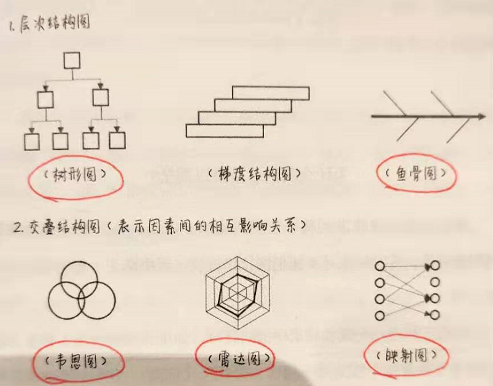
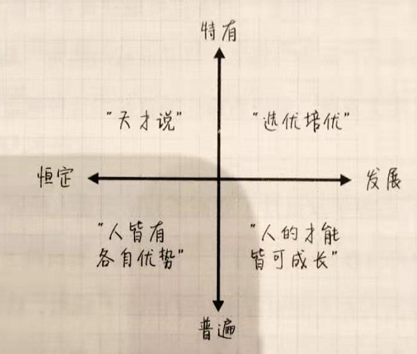

# 【DONE】《精进》采铜

生活中，多做长衰期的事情；工作中，优先完成“核心工作区间”的任务

时间之尺

根据收益、半衰期两个维度把事情划分为四个维度，分别是高收益长半衰期（如真爱、思维技巧），低收益长半衰期（书法、自由行等），高收益短半衰期，低收益短半衰期。多做长半衰期的事，少做半衰期的事

1. 一个人如何对待他的时间，决定了他可以成为什么样的人
2. 我们需要向小孩子学习那种“郑重”的学习态度，能够一丝不苟的玩玩具车。即一种认真地聚焦于当下的事情，自觉而专注的投入
3. 五种时间视角：这五种视角没有绝对好坏，需要分不同场合使用
4. 积极过去视角。亲情、友情
5. 消极过去视角。尽量避免
6. 享乐主义视角。旅游
7. 宿命论视角。
8. 未来视角。对待生活和工作
9. 三年太短，十年太长，五年是人生当中比较合适的一个时间尺度。包括五年规划，五年反思等
10. “合理利用时间”就是选择做正确的事，把时间花在值得做的事情上
11. 如何判断一件事情是否值得做？
12. 这件事情的收益值
13. 收益半衰期
14. 根据这两个维度，可以把事情划分为两个维度，四个象限：
15. 高收益、长半衰期。真爱、学习思维技巧
16. 高收益、低半衰期。买衣服、玩手机、打游戏、吃自助餐
17. 低收益、长半衰期。练书法、背诵诗歌、认真且有深度的自由行
18. 低收益、低半衰期。网络掐架等
19. 从收益期来看，尽量少做”短半衰期“的事情，多做“长半衰期”的事情
20. 我们为什么要多读经典？
21. 经典就是具有超长半衰期的作品；
22. 我们总能从中找到新的东西；
23. 包含了接近某种“事物本质”的东西，世间万物可能与这个根源性的东西发生共振
24. 侯世达定律：实际做事花费的时间总是比预期的要长
25. 工作要快，生活要慢：
26. 尽可能快的事情：家务体力劳动、事务性工作、商品购买、无法达成共识的争吵
27. 尽可能慢的事情：与家人共度时光、欣赏艺术作品、自我反思、重大决策

寻找心中的“巴拿马”

给自己设定更高的目标，才会有更好的选择

1. 人在面临选择时，通常会采用“满意原则”，而不是“最优原则”。即选择OK即可，不会去寻找其他更好可能性的答案
2. 给自己设定更高的标准，才会有更好的选择。比如一个二三流大学的学生，以985院校的高水平要求自己
3. 所谓的格局，指的是就是一个人为自己内心树立的最高标准，价值尺度。标准越高，格局也就越高
4. 如何做出更好的决策？从选项的各个维度进行深入分析，对不同方面进行加权选择，得出决策结果。而对于情感、喜好等主观意味特别强，复杂度过高的情况时，倾听内心直觉的声音往往更奏效

即刻行动

完成任务优先完成任务的“核心思考区间”，也就是整个任务最难啃的骨头，突破后再来完成周边的打扫性工作

1. 种一棵树最好的时间是十年前，其次是现在
2. 精益创业的思想：最小化可行产品MVP，在迭代中不断试错，最终进化出一个最好的产品
3. “先做好准备再上场”观念的一个致命问题是：我们永远都无法做好“完全”的准备。另一方面，我们也切不能不做任何准备就匆匆上场，准备程度的把握依据实际情况随时调整
4. “核心思考区间”的工作不可中断，以免增加“切换损耗”
5. 完成任务，优先完成任务的“核心思考区间”，也就是整个任务里最难啃的骨头，突破这个门槛后，剩下的就是周边的打扫性的工作。比如编写PPT，首先明确对象，然后整理演讲框架，前后思路逻辑关系，再来填充内容
6. 图层工作法：把一项任务中具有相同属性的工作安排在一起统一完成，效率更高。比如Word文字，Word图片，Word排版，不是顺序完成，而是先完成文字，其次是图片，最后是排版

怎样的学习，才能够直面现实

求知的三个层级：信息、知识、技能，三层次为递进关系

1. 只有最后作用于现实的学习，才是唯一有效的学习
2. “基于探究的学习”，是一种开放式学习法，通过开放式的提问方式，对问题进行进一步的深入研究。典型提问方式为“我们怎样才能解决这个问题？”
3. 你掌握了多少知识，并不取决于你记忆了多少知识以及知识的关联，而是取决于你能调用多少知识以及知识关联
4. 求知分为三个层级：信息（转瞬即逝）、知识（记忆为目标）和技能（内化为技能）
5. 一个高水平的学习者会有意识地把不同领域不同学科的知识摆在一起，然后尝试去分析、比较内在的关联
6. 【绝大多数情况下，解决本领域遇到的问题最高效的方式还是利用本领域专业知识，而当遇到瓶颈时，此时参考其他领域的思路是一种非常好的方法，通常能够给出创造性的解决办法】
7. 灵感和潜意识思考，并不是平白无故产生的，而是依赖与思考者丰富、充足、反复和多元的思考材料，潜意识只是借用了他强大的并行计算能力将这些材料进行整合
8. 一幅画的价值，不在于其线条、颜色和构图，而在于他背后传达的“理念”，艺术品的价值就是其理念的价值。所谓的理念，指的是一种颠覆了原先对艺术的理解，产生了新的价值

向未知的无限逼近

简洁的表达方式更容易抓住事物本质

1. 信息爆炸，信息过载并不是因为信息太多，而是因为我们的“过滤器”失效
2. 我们在获取信息时，要考虑其信息渠道来源（比如从A和B不同的信息渠道得到相同的结论，但是这两人都是从C那里得知）。如果通过不同的研究方法，不同的独立信息渠道得出的相同的结论，那么这个结论较为可信
3. “信息密度”。隐藏在信息文章中的有价值的信息浓度
4. 简洁的表达方式有利于提升信息密度，也更容易抓住事物本质
5. 比简洁更高一层的是精炼。简洁意在“简”和“洁”，而精炼意在“精炼”和“锤炼”，所以做到精炼比简洁更难
6. 对比较复杂的问题，发散和收敛往往是多次进行
7. 将思维转化为图像，以便于更加形象的记忆，加深印象
8. 常见的用于表达思维过程的结构图：树形图、鱼骨图、韦恩图、雷达图、映射图等

1. 如果我们很快找到了某个问题的答案，那么很大概率上这个答案并不周密，只顾及了问题中的某个侧面或者局部
2. 一种可以激发创意的工具：形态分析表格。针对对象进行多维度分解，每个维度罗列不同的选项，然后做排列组合

努力，是一种最需要学习的才能

人才的应用应该首先重视其优点发展，如果优点明显，其他方面的缺点不是那么重要

1. 对待“才能”的四种观点。特有VS普遍，恒定VS发展，组成了才能四象限。

1. 特有——恒定：最为流行。即一般意义上的智商测验就是此观点
2. 普遍——恒定：认为每个人都有才能，五花八门。类似于唯心主义，可能陷入自我陶醉陷阱
3. 普遍——发展：成长型心智
4. 特有——发展：只有极少部分人才有的才能，需要区别培养。较少

- 智力决定基线，努力决定上限
- 用人理念：基于岗位要求找出最具有相应能力的人，而忽略其他方面的弱点，也就是说，一个员工具备突出的优点比他没有明显的弱点要重要的多
- 木桶理论的明显问题在于，他并没有证明为什么用木桶来类比人时仍然是成立的。他只适用于团队和组织
- 想要成为“T”型人才，必须先画出那一竖，站稳了以后再画出那一横。策略就是二八分，八分花在专业领域技能增强上，二分花在跨领域技能上
- 在有限精力下，竭力发挥自己的优势，而对于自己的弱势，则利用团队优势，与其他人合作形成优势互补来弥补
- 《反脆弱》一书中，塔勒布用“脆弱”、“强韧”和“反脆弱”来划分世间万物：

1. 脆弱：如同陶瓷，一碰即碎
2. 强韧：如同石头，能够经受外部冲击
3. 反脆弱：不强韧，但是可以承受小程度负面波动，然后更加强大

- 如何打破兴趣和投入的死循环？只有先投入，才能发现是否感兴趣

每一个成功者，都是唯一的

1. 创造成功，而不是复制成功
2. 独特性，就是最好的竞争力
