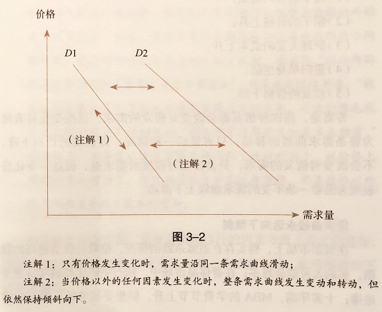
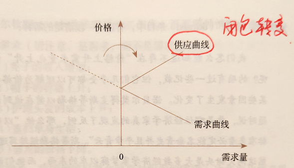
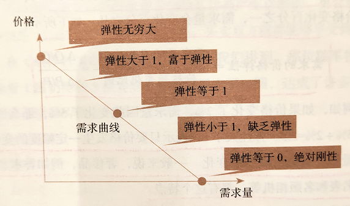
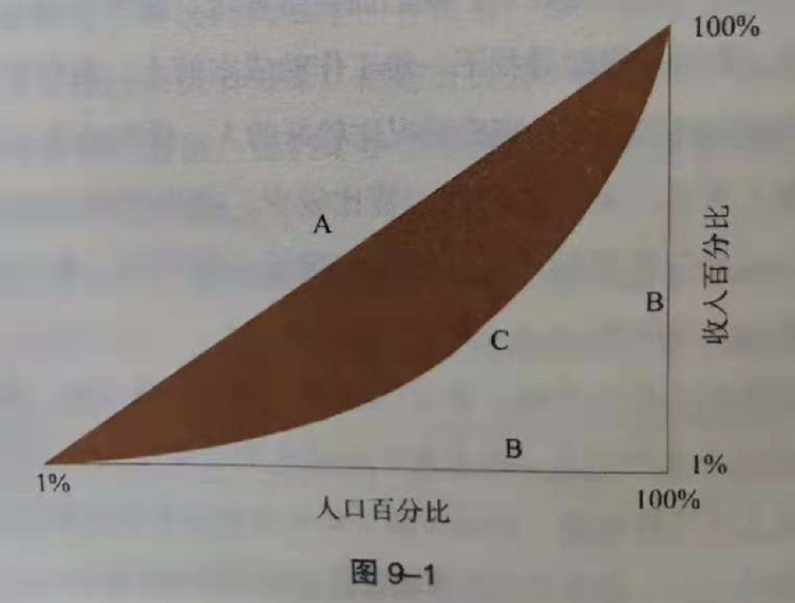

# 【DONE】《经济学讲义》薛兆丰

## 目录

- [真实世界——经济学的视角](#真实世界经济学的视角)
- [人性观——认识理性和自私的吗](#人性观认识理性和自私的吗)
- [区别对待——选择的标准](#区别对待选择的标准)
- [选择偏好——放弃的最大价值](#选择偏好放弃的最大价值)
- [资源的价值——重新理解盈利与亏损](#资源的价值重新理解盈利与亏损)
- [科斯定律——从社会成本看问题](#科斯定律从社会成本看问题)
- [交易费用——平衡的艺术](#交易费用平衡的艺术)
- [边际革命——不是越多越好](#边际革命不是越多越好)
- [需求定律——关于人性的定律](#需求定律关于人性的定律)
- [资源配置——如何分饼决定饼做多大](#资源配置如何分饼决定饼做多大)
- [竞争的逻辑——社会成本决定规则的优劣](#竞争的逻辑社会成本决定规则的优劣)
- [价格管制——人会追求损失最小化](#价格管制人会追求损失最小化)
- [竞争的维度——没有人可以控制市场因素](#竞争的维度没有人可以控制市场因素)
- [资源的占有——你的权利从哪里来](#资源的占有你的权利从哪里来)
- [产权界定——保护与限制](#产权界定保护与限制)
- [公共服务——公用品与私用品](#公共服务公用品与私用品)
- [不确定性——时间偏好带来的回报](#不确定性时间偏好带来的回报)
- [有效市场假说——时间维度上的平衡消费](#有效市场假说时间维度上的平衡消费)
- [预测未来——债券、保险与期货](#预测未来债券保险与期货)
- [比较优势——天生我才必有用](#比较优势天生我才必有用)
- [价格歧视——定价和竞争的策略](#价格歧视定价和竞争的策略)
- [信任的建立——直面信息不对称](#信任的建立直面信息不对称)
- [制度的对策——缔约自由比自由更重要](#制度的对策缔约自由比自由更重要)
- [责任的分担——让防范的成本最小](#责任的分担让防范的成本最小)
- [决策权——谁来当老板](#决策权谁来当老板)
- [收入分配——政府是否应该劫富济贫](#收入分配政府是否应该劫富济贫)
- [脱贫致富——最富裕的穷人在今天](#脱贫致富最富裕的穷人在今天)
- [货币规律——货币像水又像蜜](#货币规律货币像水又像蜜)
- [经济周期——聪明人彼此不同意](#经济周期聪明人彼此不同意)
- [公共选择——选举未必反应大多数人的意愿](#公共选择选举未必反应大多数人的意愿)
- [后记](#后记)

# 真实世界——经济学的视角

1. 有人的地方就有交易（市场行为是自发的，比如犹太人集中营里的香烟交易市场）
2. 有了货币，就会出现劣币驱逐良币的现象
3. 有人就有交易，有交易就有货币需求，有货币就有劣币驱逐良币的现象，有货币就有经济活动，有价格波动，就有通货紧缩和通货膨胀[^1]
4. 鼓励人们创造财富，社会才会越来越好。而不是不劳而获，否则每个人想着偷取别人的成果，则没人会主动创造
5. 公正背后是效率的考量
6. 公正和效率是硬币的正反两面，因为效率所以公正。
7. 不公正意味着效率低：随便抢夺别人财富是不公正的，社会总效率低
8. 破窗理论：窗子被打破，主人拿去修，给玻璃工人付钱，工人买面包，又买衣服，拉动生产
9. 悖论：既然打破窗子可以拉动生产那应该打破所有人的窗户，显然不对。问题在于逻辑链不成立
10. 经济学研究的是“事与愿违”的规律[^2]
    1. 淳朴的逻辑：好人做好事，坏人做坏事，坏事一定是坏人做的，我们只要打击坏人就行了
       1. 有“坏人”抬高了物价，导致通货膨胀，打击坏人不就好了？
       2. 房价越来越高，打击炒房的坏人不就好了？
       3. 实际上不是。
       4. 坏人的思想我们一眼就能看出好坏，倒是那些用良好愿望包装起来的坏思想，我们难以识别

# 人性观——认识理性和自私的吗

1. 万物存活看条件（朝南的叶子更茂密），与理性与否无关。【与浪潮之巅的思想相似，IT公司的崛起】
2. 斯密的第一个观点：人是自私的[^3]。不自爱的人在社会上不受尊重
3. 斯密的第二个观点：人不仅是自私的，同时还具有同情心，能为他人着想[^4]
4. 斯密的第三个观点：人的同情心是随着人与人之间距离的拉远而减弱[^5]
5. 人际互动二分法：小圈子靠爱心（同情），大世界靠市场（规则）
   1. 不要在家庭、朋友圈斤斤计较
   2. 也不要在市场要求陌生人表现出不切实际的爱心
   3. 市场把成千上万人联系在一起，没有人能够独自制造一支铅笔
6. 为什么慈善难见成效？
   1. 缺乏反馈机制。你给了钱给穷人不知道效果如何
   2. 委托代理。花钱的人不是出钱的人
   3. 所托非人。钱没给到群众，给了政府
   4. 养懒汉效应。穷人思维

# 区别对待——选择的标准

1. 人不是完全理性的，人也不是完全自私的，经济学基本假设不是一个假设，而是一个客观事实：稀缺。指的是资源稀缺
2. 稀缺->选择->区别对待->歧视。
   1. 有稀缺就有歧视。所谓的歧视就是在做选择时产生的对另一个选项的排斥现象[^6]
   2. 有歧视就有代价
3. 市场竞争让人心胸宽广。越是偏远的地方歧视越严重

# 选择偏好——放弃的最大价值

1. 成本是放弃了的最大代价。若干个选项中，它的成本就是放弃了的选项中最高的那个[^7]。这是成本的第二种定义，传统定义是资源本身的物理属性
2. 凡提到了成本，一定是向未来看，不是向过去看，所以沉没成本不是成本【不要为打翻的牛奶哭泣】
3. 桌上的饭菜就是沉没成本，俗话说“不吃就浪费了”，潜意识把身体健康和食物价值做了比较，认为食物价值比你身体健康更重要，显然这个逻辑不成立
4. 为什么不忘初心很难？因为当初的初心一般很简单，而之所以简单是因为可选择的选项不多，随着境遇发生变化，机会增加，原来坚持的看法越来越难，成本越来越高，不得不得放弃[^8]
5. 货币成本不是所有成本，他只是成本的一部分，还有时间成本，生态软件成本等。比如虽然西瓜在农民手上可以卖到0.1元/斤，但是你宁愿花1元/斤来买，原因是剩下的0.9元/斤的费用你要自己开车跑到农村找农民，还要托运等一系列费用；苹果手机的物料成本确实很低，但是后期的研发成本，软件成本，服务成本质量高，值得这么高的售价

# 资源的价值——重新理解盈利与亏损

1. 凡是盈利都是意外的，盈利导致资源的使用成本提高，亏损导致资源的使用成本下降（用乾隆用过的碗来吃饭，使用成本非常高）
2. 不是产品的原材料决定了产品价格，而是产品的供需关系决定了产品价格[^9]
   1. 是因为医学院、法学院毕业生的工资高，导致了教授工资高，学费高，而不是反过来
   2. 是因为人们对住房的需求高导致了高房价，而不是政府主动抬高了房价
3. 什么叫租？对资产的付费。租就是白赚的部分。比如你做第一件事的收益是A，做第二件事的收益是B，那么B-A多出来的部分就是白白赚的那部分，也就是租
4. 土地不是稀缺的，位置是稀缺的[^10]

# 科斯定律——从社会成本看问题

1. 案例：牛与小麦（牛和小麦哪个更贵）、泳池阳光与酒店副楼（泳池与酒店哪个客人更多）、烟囱与邻居、火车与亚麻（亚麻放远一点）等问题。本质上是双方为了不同的用途，在争夺相同的稀缺资源
2. 谁避免意外成本最低，谁的责任就越大[^11]
3. 自己家买了鞭炮不会放到火炉旁
4. 在交易成本非常低或者没有的前提下，谁用的好归谁。例如钻石归旷工还是白富美

# 交易费用——平衡的艺术

1. 科学的思维：把问题推到极致，看一下理想情况下应该怎样，然后一点点加条件[^12]
2. 凡是在一个人的社会里不存在，在多人社会里存在的成本，就是交易费用
3. 现实生活中交易成本往往非常高，因此谁用的好归谁并不一定有效
4. 你让50位住户，每人出10块凑齐500给旁边的工厂烟囱买一个过滤器，这件事的交易成本非常高，导致这件事迟迟无法办成

# 边际革命——不是越多越好

1. 个人估值：一个人对一件商品的个人估值，是他为了得到这件商品所愿意支付的其他商品的最高数量
2. 估值是绝对主观的，没有客观估值
3. 主观价值论与客观价值论
   1. 客观价值论：世界上所有物品都是客观的，不以人的意志为转移的价值
   2. 主观价值论：本身并没有内在价值，只有人对他的判断
4. 客观价值论不能解释的现象，主观价值论可以解释
   1. 普通人拍摄的矿泉水广告和明星拍摄的矿泉水广告差别很大
5. 主观价值论能够很好的指导生产
6. 商品经济体系中讲究是需求导向，如果生产出来的东西没人需要，不管付出多少劳动，都是没有价值的
7. 计划经济体系则不然，只要人有努力则就有回报和价值
8. 边际。新增带来的新增[^13]
9. 边际成本；边际收入；边际产量；边际效用
10. 边际效用递减定律：随着商品的数量不断增加，消耗这种商品所带来的新增享受会下降

# 需求定律——关于人性的定律

1. 需求第一定律：其他情况不变时，价格提高，商品需求量减少；价格降到一定程度，需求量会反向增加（从需求曲线变成供给曲线）[^14]
2. 曲线的Y轴价格表示个人估值，而不是产品真实价格

   
3. 价格是自变量，需求量是因变量。是价格导致了需求变化
4. 需求曲线永远向下倾斜。不可能水平，不可能垂直
5. 垂直的需求曲线是刚需（无论价格怎么变化，需求都不变）。刚需需求不存在，因为人们会寻找替代方案（比如盐）[^15]
6. 供应曲线。如果价格升高到没有消费，没有需求，当价格进一步提高时会出现负需求，也就是供给
7. 下雨天从A打车到B地费用200元，如果价格上升2000，甚至20000时，此时就创造了需求，会有人主动站出来当司机[^16]。曲线关于Y轴对称

   
8. 消费者剩余。个人估值和产品销售价的差价
9. 需求第二定律：随着时间的推移，需求对价格的弹性会增加。意思是选择更多，价格波动对需求的影响变小了[^17]
   1. 时间推移，选择越来越多，需求紧迫性降低，因此对价格的容忍度强，弹性增加（对价格的变化不那么敏感）
   2. 应用：房价。增加房产税并不能解决房价高的问题，只是增加了购买双方的负担，多余的费用全部给了政府
   3. 需求对价格的弹性：需求的变化量/价格的变化量
      1. 弹性>1。价格每变化一个单位，需求量发生大幅度变化。例如奢侈品，香水，手表
      2. 弹性=1。
      3. 弹性<1。价格每变化一个单位，需求量几乎不变。例如大宗商品，柴米油盐
10. 需求曲线上的弹性处处不等，价格越高弹性越大

    
11. 一件商品是奢侈品还是必需品，完全取决于价格（例如水）
12. 需求第三定律：精选品和普通品之间的价格本来差距较大，但是加上附加费（运费、关税费）之后，他们的总体差距减小。并且附加值越大，精选品越便宜
    1. 进口的牛肉不可能带骨头
    2. 附加费上升带来的好处：出口的商品质量提升了
    3. 附加费上升带来的坏处：便宜的商品无法出口

# 资源配置——如何分饼决定饼做多大

1. 经济不可预测的三个主要原因（计划经济三大难题）：
   1. 人际效用不可比较
   2. 数据不可得
   3. 惩罚很难恰如其分（谁来对正确的预测做出奖励，错误的预测做出惩罚呢？）
2. 价格是解决计划经济的金钥匙
3. 价格归一化尺度，人际效用可以用价格来衡量和对比（比如你愿意花多少钱给小狗买窝）
4. 数据虽然不可得，但是可以直接反应在价格上
5. 决策做的对不对，价格的高低是对他的直接惩罚、奖励
6. 价格的三个作用：
   1. 传递关于稀缺的信息
   2. 指导生产
   3. （最重要）做出惩罚，决定商品分配。如果有钱人不能享受更好的待遇，那么他们就不会对价格信号做出反应，他们也没必要成为有钱人[^18]
7. 借机挣钱这种行为究竟道不道德？行为本身是合理的，因为灾难不是这个人引起的，他只是给与大家一种更多的选择，提高社会效益
8. 某区域停电，一个人开着车不远万里把发电机运送过来，价格是市场价格的3倍。这种行为是合理行为，不要谴责，否则没人愿意这样做，停电地区的人只能被迫接受停电，不解决问题
9. 物价上涨不代表市场失灵，恰恰说明市场在显灵。我们不能看到温度计升高了，就说温度计坏了[^19]

# 竞争的逻辑——社会成本决定规则的优劣

1. 暴力规则
2. 智力规则
3. 辈分规则
4. 社会身份规则
5. 劳动时间、随机分配、先到先得规则
6. 按需分配规则
7. 价高者得规则
8. 没有一种规则比另一种规则更公平，每人的立场都不同。除了价高者得是一种共赢规则，其他规则都是零和规则。因为价高者得为了赚更多的钱会思考如何服务别人赚钱，从而提高整个社会的财富[^20]
9. 改革开放40年的巨大成果，很大程度上依赖价高者得的游戏规则[^21]
10. 短缺不是供应的减少，而是指价格受到了抑制，人们仅仅用出价的办法买不到这种商品，而采取其他竞争方式才能得到这种商品的情形。即价格被压低导致短缺[^22]
11. 过剩不是供应过多，而是商品价格被抬高，以至于卖家必须搭配其他手段才能把商品卖出去的现象。即价格被抬高导致过剩[^23]

# 价格管制——人会追求损失最小化

1. 价格管制必然导致价值耗散。明明可以卖更高价的商品被限制在低价，导致这些商品没有落入到能够支付高价人的手上，落到了低价能力人的手上，价值被耗散
2. 人是追求损失最小化的动物。在价格管制的前提下，人会采取各种方式想方设法把损失掉的价值找回来
3. 春运火车票是商品，不应该被价格管制，价格应该被放开。被价格管制的火车票价导致黄牛党的出现[^24]
4. 过年回家不是刚需。之所以每年过年要回家是因为交通成本下降[^25]
5. 黄牛党在一定程度上减少社会总成本，比如减少了大街上排队买票的奇观景象[^26]
6. 帮助穷人最好的办法，就是以金钱的方式给穷人补贴，不要给实物。不要去干预商品价格
7. 让穷人能够坐公交车，让穷人能够得到好教育，正确的做法是补贴穷人，或者补贴家长，而不是补贴公交系统，补贴教育局。补贴前者可以让后者更有动力做好自己的事情，补贴后者的话，公交系统和学校只需要讨好政府就行

# 竞争的维度——没有人可以控制市场因素

1. 在大城市里，重要的不是你是谁，而是你跟谁在一起。不是你的本事有多大，而是你的本事跟别人的本事能不能匹配，你们之间能不能提供相互服务
2. 房屋不是一种标准品（比如铅笔、可乐等），它是一种服务，因此政府提供廉价公租房的做法是不可取的，应该坚持房屋服务市场化、商品化道路

# 资源的占有——你的权利从哪里来

1. 权利是文明的产物和特征。权利是通过社会强制而实现的，是别人授予我们的，不是我们自己认为有就有的，而是别人认为我们有才有[^27]
2. 权利其实是人赋的，不是天赋的。所谓的人生而平等在一定程度上象征着人类文明的进步
3. 德肖维茨的立论：权利来自人类的经验，尤其是那些惨痛、巨大错误。今天我们认为理所当然的权利，其实都是经历了漫长的过程才得以确立的[^28]（财产权、隐私权、污染权、征地权等）
4. 人们行使言论自由这种政治权利和在行使政治权利时动用的经济资源是两回事，不能因为为了满足一群人行使言论自由的权利而放弃了另一群人的资源产权权利（比如一群人征用私人领域来示威）

# 产权界定——保护与限制

1. 美国西南部真正产权的界定，是从铁丝网的普及开始的
2. 产权的三个要素：使用权、收益分配权、转让权
   1. 使用权：决定资源如何使用
   2. 收益分配权：获得的金钱如何分配
   3. 转让权：转让权转让的是使用权和收益权。人们是不是真正拥有某件物品，最有效的试金石就是看他们有没有权利把它卖出去[^29]
3. 产权保护的三个基本原则：财产原则、责任原则、不可转让原则
   1. 财产原则：付费交易保护
   2. 责任原则：当付费交易失效时（或者交易费用非常高），法律规定财产被侵犯时必须赔偿
   3. 不可转让原则：直接规定某些物品不能转让，禁止交易。比如人体器官
4. 在遇到产权纠纷时应用财产原则还是责任原则需要根据交易费用灵活调整。如果交易费用低，则使用财产原则；如果交易费用高，后果严重，则使用责任原则

# 公共服务——公用品与私用品

1. 解决道路拥堵的方式是收费。收费虽然不增加多余道路，并不实际扩大道路运输能力，但是筛选了需求[^30]
2. 收拥堵费的目的是让道路产生排他性，而无论收取的道路费用在哪里
3. 私用品：一个人用，别人就不能用。如鸡蛋、道路
4. 公用品：一个人用的同时不影响别人使用。如无线广播、旋律
5. 有些商品的归属既不是私用品也不是公用品，没有明确界限，和实际场景有关：比如讲师、街头警察等

# 不确定性——时间偏好带来的回报

1. 易耗品：一次性消费完毕的物品。例如牛奶
2. 耐用品：需要花费较长时间慢慢享受的物品。例如油画、苹果树、人力资源、儿童
3. 人们更喜欢确定的、短期的消费，而不喜欢不确定的、未来的消费。这种倾向称之为“不耐”，即不够耐心
4. 不耐是利率的基础，补偿是不耐的手段，为了得到现货，人们愿意给期货补偿更高的利率，因此利率应运而生[^31]
5. 管制利率会有不良后果。比如不愿意借钱给别人；更迂回的办法支付利息
6. 未来越不确定，补偿就越高，利率就越高
7. 贴现率是未来价值转化为当前价值的打折程度。折扣越大，表明未来越不确定，贬值越严重【其实就是利息，只是折现率是反过来看】

# 有效市场假说——时间维度上的平衡消费

1. 投资是一种消费（投资是时间维度上的平衡消费），消费也是一种投资
   1. 例如：吃饭不是消费，是为明天工作的身体的投资；旅游不是消费，是为老了以后留有记忆的投资
2. 尽管石油被卡特尔组织垄断，但是卡特尔组织不能决定国际油价，国际油价由可能新出现的新的替代石油产品决定
3. 现值由预期决定，如果预期变了，现值也会跟着变，而且是立马变化。只要有消息，有新的知识，价格会立刻发生响应（毫秒级）[^32]
4. 有效市场假说：
   1. 弱版本：关于价格和重要市场指数已经被彻底消化，没有研究的必要
   2. 半强版本：还包括所有公开文件，如政府文件，年报，公告等
   3. 强版本：还包括私人信息
5. 另一种学派认为股市存在泡沫理论。资产有时候估值过高，有时候估值过低
6. 资产的价格不取决于资产内在价值，而是取决于人们认为它是否有价值【类似艺术品网络，不取决于本身价值，而是取决于别人对它的估值】

# 预测未来——债券、保险与期货

1. 面对风险的三种态度：风险厌恶、风险偏好、风险中性
2. 储蓄和保险的原理不同：
   1. 储蓄不改变风险，这份储蓄要么被消耗掉，要么一直保留
3. 保险给人们提供了一种“未来收入一致性”的心理需求，无论未来如何，我的收入都一样
4. 保险服务的3个前提条件
   1. 没发生的。事项是有概率性的，没有发生的。已经发生的不能买保险
   2. 独立的。事项必须是独立事件，互不相关的。不能保全人类的气候灾害
   3. 无法控制的。事项独立于投保人意愿，无法控制的。不能投保考试成绩
5. 保险公司的招数：
   1. 细分。把投保人细分组。否则年轻人要为老年人付更高的费用
   2. 加总。尽可能增加细分组人数，大数定律才有保障
6. 失业保险、养老保险不是保险，他们是一种社会福利。因为他们不符合保险的3个前提条件
7. 养老保险：年轻人给老年人交费[^33]
8. 教育、医疗、交通、能源、用水、住房是商品，是一种服务【必需品不会摆脱经济规律的制约，这些东西无法提供一种标准品，永远有高低之分】[^34]
9. 你可以在医院里看到有人在排队，但是你看不到宠物排队。因为宠物医院是市场化服务，不是政府提供的保障服务
10. 期货市场满足人们对确定性的需求。比如咖啡豆的价格波动会导致咖啡价格波动，为了避免这种波动，咖啡店主向第三方购买咖啡豆期货
11. 期货的本质：分配风险。需求方不希望物品在未来有价格波动，希望用价格来购买价格波动风险，这类人是风险厌恶；而另一类人是风险偏好，他们认为未来价格波动可能性较低，所以向前者提供期货服务。需求方与供给方进行了风险交换

# 比较优势——天生我才必有用

1. 比较优势原理：如果每个人都只生产机会成本比较低的产品，然后和别人交换，这样整个社会的总价值能达到最大【和泰勒的科学分工原理相似】[^35]
2. 自己跟自己比较的优势，而不是跟别人比较
3. 贸易顺差、逆差仅仅指两个国家之间，这些都不重要（顺差、逆差不是坏事），要放在更大尺度上分析。对于一个国家而言，只要和他所有国家的贸易总和是收支平衡的，它就是健康的
4. 贸易报复将伤害国内消费者。消费者需要支付更高的费用才能享受国外的产品

# 价格歧视——定价和竞争的策略

1. 完全竞争状态：很多买卖家，同一种商品，价格自由不受控制，自由进出市场，信息公开且对称，没有讨价还价，尔虞我诈。如农产品市场
2. 受价者：价格不是卖家说了算，是市场说了算
3. 不完全竞争状态：完全竞争状态的对立面。绝大多数商品都处于不完全竞争状态
4. 觅价者：价格主要由卖家给出
5. 价格歧视的三种方法：
   1. 一级价格歧视：所有产品全部给最高价[^36]
   2. 二级价格歧视：针对不同购买量给出阶梯价格，多买多送[^37]
   3. 三级价格歧视：针对不同人群、不同地域的人给不同的价格[^38]
6. 实现价格歧视的必要条件：商品不能在买家之间相互转售，否则价格歧视无效
7. 航空公司机票价格（实名制购买，无法转让）、旅游景点门票（实名制购票）、图书精装版和平装版、演唱会门票都有价格歧视
8. 竞争激烈程度的衡量标准不是看竞争者数量，而是看市场准入门槛。如果准入门槛高，则这个市场竞争程度有限，没有门槛则竞争激烈[^39]

# 信任的建立——直面信息不对称

1. 人和人之间是没有互信的，要把高品质的产品从低品质产品中甄别出来需要很大的成本（如二手车市场）
2. 什么才是优质的？
   1. 方差小的，稳定的才是优质的
   2. 提高产品质量，与所付出的边际成本平衡才是优质的。换句话说：不是质量越高越好，也不是价格越低越好，而是性价比越高越好
3. 如果生命是无价的，那我们应该不惜一切代价追求此目标，现在路上开的都是坦克，而不是各式各样的有各种安全问题的汽车[^40]

# 制度的对策——缔约自由比自由更重要

1. 如何克服信息不对称
   1. 重复交易
   2. 第三方背书
   3. 增加附加成本发信号（面试的时候穿的更好）
2. 三包（包修、包换、包退）
3. 延长保质期（甄别重度用户）
4. 共享合约（出版社与作者签订稿费方式，共享分成）
5. 自残式喝酒
6. 人质
7. 财产抵押
8. 矿泉水请明星代言广告取悦消费者
9. 餐厅用高档器具取悦消费者
10. 医院用明示的医生个人信息取悦病人
11. 加盟店是强者，总店是弱者。是因为前者可以轻易的毁掉他们的牌子，后者需要耗费高昂的成本监督。所以才会有不平等的加盟合同
12. 食品、药品、化妆品的零部件不可追溯，质检成本高，所以更倾向于垂直整合，保证管道产品的品质
    1. 如牛奶

# 责任的分担——让防范的成本最小

1. 汉德公式B
2. 邻居敲坏自己家的墙，如果有名贵的画，则自己要承担一定责任
3. 火车开车时没有鸣笛，导致压断一名维修工人的腿，需要负全部责任
4. 监管是要的，但是不是不计成本的，还要看边际效应
5. 要让消费者提供产品质量问题的证据成本非常高
6. 强制披露产品缺陷虽然有助于消除信息不对称，但是也有其他的问题
7. 说明书太长，没人看
8. 专业术语太多，事情复杂化

# 决策权——谁来当老板

1. 为什么企业会存在？
   1. 解释一：降低个人在社会中的交易费用（与陌生人打交道）
   2. 解释二：团队聚合效应，1+1>2
2. 团队里的一个成员的贡献取决于他的边际贡献[^41]
3. 谁是老板，谁是员工
   1. 原则一：谁提供的资源更容易被滥用，这种资源的所有者适合当老板，当资本家
   2. 原则二：谁对企业来说是专用资源，谁应该掌管企业（通用资源指的是一般资源，比如保安）

# 收入分配——政府是否应该劫富济贫

1. 员工在一个企业里的议价能力，取决于他在别处的机会[^42]
2. 在一个团队里能拿多少，是由他们带来的边际收入决定的
3. 同工同酬保护法会让资本家偏向于选择技能更好的人，实际上会进一步削弱弱者，而不是保障弱者的利益【只给已经有工作的人有收益，对没有工作的人实际上提高他们工作的门槛】
4. 最低工资法会增加小公司的运营成本，提高了开公司的门槛【这就是看不见的部分】
5. 基尼系数

   
   1. A：绝对平均
   2. B：绝对不平均

- 基尼系数的问题：它计算的是瞬时人与人之间的收入差距。而实际上人的收入和年龄、职业是有关的，应该看得是终生收入，而不是瞬时收入

# 脱贫致富——最富裕的穷人在今天

1. 竞争者会利用法律，或者提高竞争者进入行业门槛的方式来保护自己
2. 比如美国的就业许可制度。要求是美国人，要求有正规培训，要求有足够多的经验，要求有考试等等
3. 1900年，全球人均寿命31岁；1950年，全球人均寿命49岁；2010年，全球人均寿命67岁
4. 看自己是变穷了还是变富了，就看看自己每天支出的东西到底有没有用，是不是生活必需品[^43]

# 货币规律——货币像水又像蜜

1. 货币的作用：
   1. 需求货币化。否则一个卖羊和一个要盐的人必须遇到一起才能形成交易
   2. 降低质量检验成本。没有货币，你得学习你需要物品的质量检验方法，能分得清赝品
2. 劣币驱逐良币符合经济效率原则。货币只要大家认为他值钱，他就值钱，而不管他本身的经济价值。既然只要认为他有钱就行，那完全可以用更低成本的物品来替代
3. 商业银行有法定准备金的要求，这限定了商业银行所能贷款的上限
4. 商业银行一般会遇到两种问题，很难区分
   1. 挤兑困难。所有人一起到银行挤兑一定会出现银行钱不够用的情况
   2. 经营不善困难
5. 通货膨胀指的是物价的持续上涨，而衡量物价的常见指标之一，就是消费者指数CPI[^44]
   1. 恶性通货膨胀一般指的是膨胀率超过50%
6. 货币数量论（经济学基本框架）：MV=PY
   1. M货币流通量（银行发了多少钱）；V货币流通速度（电子货币速度快于纸币货币）；P平均物价；Y货物总量
   2. 两种观点：P的上升是由于M、V增加，Y的减少导致；P的上升只是因为M增加，V和Y基本保持不变
7. 现实生活中新增的货币都是通过某几个入口流入到社会中，不是平均播撒的，流动需要时间[^45]，这会导致人们出现错误决策：
   1. 以为自己牛逼了，盲目扩大生产力。其实只是货币多发了而已，大家都有钱了
8. 政府多印钞票实际上增加政府购买力，减少民众购买力，相当于一种无形征税
9. 通货膨胀率和失业率无关。短时间内通货膨胀导致资本家扩大生产力确实会降低失业率，但是只是短时的错误决策而已，随着时间的流逝，失业率进一步上升，会出现通货膨胀和失业率双高现象，这就是滞涨

# 经济周期——聪明人彼此不同意

1. 通过宏观经济调节，达到如下几个目标：
   1. 消除经济周期，实现生产、就业、财富的稳步增长
   2. 平稳的通货膨胀率
   3. 高就业率
   4. GDP高速增长
2. 奥地利学派认为：
   1. 经济周期的起源是政府过度印钞
   2. 回到金本位
   3. 实施自由发钞制度。交给银行、市场来自己解决
3. 凯恩斯学派认为：
   1. 社会的总需求和总消费会出现降低和下降，此时需要政府出手平衡：人们都在消费时，政府别管，人们不消费时，政府应该积极消费、投资
   2. 方法就是货币政策和财政政策。例如发钞和让下一代来还贷
4. 货币主义学派认为：
   1. 坚持货币理论。即MV=PY
   2. 通货膨胀不能降低失业率
5. 弗里德曼主张：
   1. 把货币增长的速度写到宪法里，不让政府随便增发货币
6. 理性预期学派主张：
   1. 政府管的越多，经济波动越大。因为大家对政府的政策有预期，会针对性采取措施
7. 真实经济周期理论：
   1. 经济周期本身是自然的，政府没必要管[^46]
8. 宏观经济学家争论不休的4个原因
   1. 宏观经济现象涉及的变量太多，而宏观经济现象本身数量有限的，求不出方程解；每一种经济理论都只选取了对自己有利的部分的数据
   2. 宏观变量本身是一些加总的变量，构不成严格的逻辑关系，只是有相关性
   3. 人们对新信息会形成预期，会产生新的政策，模型不断失效[^47]
   4. 没有科学的方法来应对不确定性。这里的不确定性不是指的知道会发生，只是不知道概率多少的事情，而是根本不知道会发生的事情
      1. 比如500年前完全不知道今天会出现互联网、人工智能、无人驾驶这些概念

# 公共选择——选举未必反应大多数人的意愿

1. 赢得中间投票人的支持，就能赢得选举成功。这就是著名的中位数投票人原理
2. 阿罗不可能定律：在人们有多种不同选择的情况下，选举不一定能够反映出大多数人的意愿
3. 多峰偏好可能导致有多个结果。解决办法是投票制度换成投钞票制度，或者打分制度
4. 民主为什么会产生不良政策，两个原因
   1. 选民是无知的
   2. 反驳：我不需要知道我的议员是谁，我只要知道他有好的政策和承诺就行，正如我不需要知道收音机的工作原理，我会使用就行
5. 选举的机制容易被利益集团操纵
   1. 反驳：为什么不会出现很多利益集团？这岂不是百家争鸣挺好的？
6. 大众的经济学认知存在系统性偏差
   1. 排外偏见。认为经济问题都是外来人导致的
   2. 职位偏见。要把职位留给当地人，不要给外来人
   3. 反市场偏见。口头上赞成，行动上又不是
   4. 悲观偏见。今天不如明天，明天会更糟
7. 市场决策与民主决策根本区别
   1. 市场决策：Have skin in the game。你要为你的决策负责
   2. 民主决策：事不关己高高挂起，投票主要为了面子，不是为了自己
8. 人们主张的政府对收入进行再分配的政策目的是吧财富从富人转移到穷人手上，实际上是把财务从富人和穷人手上转移到了中产阶级上
9. 公共教育：大学提供奖学金奖励了有能力上大学的中产阶级，真正的穷人上不了大学
10. 公共医疗：政府资助的医院都是好医院，而穷人去不起好医院
11. 社会保险与养老金：穷人早早就交上了养老保险，但是富人因为医疗条件更好活的比穷人长寿
12. 免费高速公路：穷人买不起车，得益的是私家车
13. 廉价房与廉租房：有资格分房的人都是有一定经济基础的人，穷人没资格
14. 美国修筑高速公路的资金是通过征收汽油税，然后把费用修建全国的公路，相当于大锅饭；中国则是当地政府自己出钱修建的，然后通过收路费的方式把成本收回来，后者是市场经济，自负盈亏
15. 中国的改革开放做对了四件事[^48]
    1. 给重要的资产确权
       1. 土地：家庭联产承包责任制，核心思想是土地经营权、管理权、收入分配权转向家庭，你多干活，多余的部分自己拿走
       2. 人力：不再分配工作，自己谋求工作
    2. 引入市场竞争
       1. 放弃价格管制和票证制度，让价格指导人们生产、生活、分配、娱乐和教育
       2. 鼓励民营企业发展
    3. 加入世贸组织
    4. 打开国门，迎接世界竞争

# 后记

1. 可证伪的才是地道的
   1. 科学理论不要求结果正确，要求过程合理，能够被证伪
   2. 经济学既有他科学的一面，也有他非科学的一面（没有对与错，仅仅只是看问题的角度）
2. 与生活相关的才是地道的
   1. 真正推动社会发展的要素：创新、企业家精神、现代企业管理制度、精益求精、服务用户的美德，这些在经济学分析里找不到位置
3. 看见看不见的才是地道的
   1. 经济学家确实分了不同派别，但是本质上只有两派：好的和不好的。好的经济学家能看见不容易看见的部分
   2. 不容易看见的：时间维度、竞争成本、看到成功者想到失败者
   3. 看市场是垄断还是竞争，不要看存在的竞争者数量，而要看进入这个行业的门槛有多高
   4. 供应者和需求者会随着价格的变化而转化[^49]
   5. 一些政府出资的项目如果交给私人，是不是会做的更好？
4. 能分辨原因和结果的才是地道的[^50]
   1. 产品的售价不是由产品材料成本决定，而是由供需关系决定产品售价。如房价、手机
5. 能分辨事实和语言的才是地道的
   1. 房屋、学习机会、工作都是服务，不是一种标准品
   2. 本来是商品，而不被当做商品看待，会发生价格以外的方式来争夺稀缺资源。比如医疗、教育、养老、水电、房屋、交通等
   3. 学区房的例子：否认学位的商品性，导致人们对学位的追逐变成对住房的追逐，本应该给学校和老师的费用，给了房地产；本来只是付不起学费，现在变成买不起房；本来学生的差距只是考试成绩的差别，现在变成父母的财富水平
6. 能分辨愿望与结果的才是地道的
   1. 经济学关心的，不是好人做好事，坏人做坏事，而是好人做坏事，坏人做好事的现象（黄牛党帮助你节省了排队时间），俗称事与愿违
7. 能分辨个体与全体的才是地道的
   1. 有人主张的免费医疗、教育、养老、工作等福利，对个人来说确实美好，但是对全体来说意味着需要有人提供这种服务
8. 牢记基本事实的才是地道的
   1. 有些假设不成立。比如：不能假设竞争没有成本，不能假设价格昭然若揭，不能假设信息对称，不能假设市场达到均衡状态，不能假设每个人都是天使，不能假设交易费用不存在，不能假设人们对新的情况做出反应不需要时间等等

[^1]: 有人就有交易，有交易就有货币需求，有货币就有劣币驱逐良币的现象，有货币就有经济活动，有价格波动，就有通货紧缩和通货膨胀

[^2]: 经济学研究的是“事与愿违”的规律

[^3]: 斯密的第一个观点：人是自私的

[^4]: 斯密的第二个观点：人不仅是自私的，同时还具有同情心，能为他人着想

[^5]: 斯密的第三个观点：人的同情心是随着人与人之间距离的拉远而减弱

[^6]: 有稀缺就有歧视。所谓的歧视就是在做选择时产生的对另一个选项的排斥现象

[^7]: 成本是放弃了的最大代价。若干个选项中，它的成本就是放弃了的选项中最高的那个

[^8]: 为什么不忘初心很难？因为当初的初心一般很简单，而之所以简单是因为可选择的选项不多，随着境遇发生变化，机会增加，原来坚持的看法越来越难，成本越来越高，不得不得放弃

[^9]: 不是产品的原材料决定了产品价格，而是产品的供需关系决定了产品价格

[^10]: 土地不是稀缺的，位置是稀缺的

[^11]: 谁避免意外成本最低，谁的责任就越大

[^12]: 科学的思维：把问题推到极致，看一下理想情况下应该怎样，然后一点点加条件

[^13]: 边际。新增带来的新增

[^14]: 需求第一定律：其他情况不变时，价格提高，商品需求量减少；价格降到一定程度，需求量会反向增加（从需求曲线变成供给曲线）

[^15]: 刚需需求不存在，因为人们会寻找替代方案（比如盐）

[^16]: 下雨天从A打车到B地费用200元，如果价格上升2000，甚至20000时，此时就创造了需求，会有人主动站出来当司机

[^17]: 需求第二定律：随着时间的推移，需求对价格的弹性会增加。意思是选择更多，价格波动对需求的影响变小了

[^18]: （最重要）做出惩罚，决定商品分配。如果有钱人不能享受更好的待遇，那么他们就不会对价格信号做出反应，他们也没必要成为有钱人

[^19]: 物价上涨不代表市场失灵，恰恰说明市场在显灵。我们不能看到温度计升高了，就说温度计坏了

[^20]: 没有一种规则比另一种规则更公平，每人的立场都不同。除了价高者得是一种共赢规则，其他规则都是零和规则。因为价高者得为了赚更多的钱会思考如何服务别人赚钱，从而提高整个社会的财富

[^21]: 改革开放40年的巨大成果，很大程度上依赖价高者得的游戏规则

[^22]: 短缺不是供应的减少，而是指价格受到了抑制，人们仅仅用出价的办法买不到这种商品，而采取其他竞争方式才能得到这种商品的情形。即价格被压低导致短缺

[^23]: 过剩不是供应过多，而是商品价格被抬高，以至于卖家必须搭配其他手段才能把商品卖出去的现象。即价格被抬高导致过剩

[^24]: 春运火车票是商品，不应该被价格管制，价格应该被放开。被价格管制的火车票价导致黄牛党的出现

[^25]: 过年回家不是刚需。之所以每年过年要回家是因为交通成本下降

[^26]: 黄牛党在一定程度上减少社会总成本，比如减少了大街上排队买票的奇观景象

[^27]: 权利是通过社会强制而实现的，是别人授予我们的，不是我们自己认为有就有的，而是别人认为我们有才有

[^28]: 权利来自人类的经验，尤其是那些惨痛、巨大错误。今天我们认为理所当然的权利，其实都是经历了漫长的过程才得以确立的

[^29]: 人们是不是真正拥有某件物品，最有效的试金石就是看他们有没有权利把它卖出去

[^30]: 解决道路拥堵的方式是收费。收费虽然不增加多余道路，并不实际扩大道路运输能力，但是筛选了需求

[^31]: 不耐是利率的基础，补偿是不耐的手段，为了得到现货，人们愿意给期货补偿更高的利率，因此利率应运而生

[^32]: 现值由预期决定，如果预期变了，现值也会跟着变，而且是立马变化。只要有消息，有新的知识，价格会立刻发生响应（毫秒级）

[^33]: 养老保险：年轻人给老年人交费、

[^34]: 教育、医疗、交通、能源、用水、住房是商品，是一种服务【必需品不会摆脱经济规律的制约，这些东西无法提供一种标准品，永远有高低之分】

[^35]: 比较优势原理：如果每个人都只生产机会成本比较低的产品，然后和别人交换，这样整个社会的总价值能达到最大【和泰勒的科学分工原理相似】

[^36]: 一级价格歧视：所有产品全部给最高价

[^37]: 二级价格歧视：针对不同购买量给出阶梯价格，多买多送

[^38]: 三级价格歧视：针对不同人群、不同地域的人给不同的价格

[^39]: 竞争激烈程度的衡量标准不是看竞争者数量，而是看市场准入门槛。如果准入门槛高，则这个市场竞争程度有限，没有门槛则竞争激烈

[^40]: 如果生命是无价的，那我们应该不惜一切代价追求此目标，现在路上开的都是坦克，而不是各式各样的有各种安全问题的汽车

[^41]: 团队里的一个成员的贡献取决于他的边际贡献

[^42]: 员工在一个企业里的议价能力，取决于他在别处的机会

[^43]: 看自己是变穷了还是变富了，就看看自己每天支出的东西到底有没有用，是不是生活必需品

[^44]: 通货膨胀指的是物价的持续上涨，而衡量物价的常见指标之一，就是消费者指数CPI

[^45]: 现实生活中新增的货币都是通过某几个入口流入到社会中，不是平均播撒的，流动需要时间

[^46]: 经济周期本身是自然的，政府没必要管

[^47]: 人们对新信息会形成预期，会产生新的政策，模型不断失效

[^48]: 1.给重要的资产确权 2. 引入市场竞争 3. 加入世贸组织 4. 打开国门，迎接世界竞争

[^49]: 供应者和需求者会随着价格的变化而转化

[^50]: 能分辨原因和结果的才是地道的
