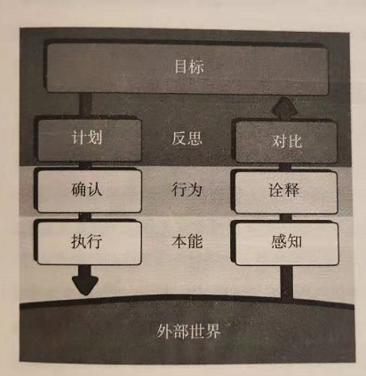
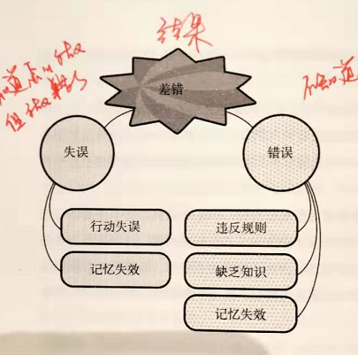
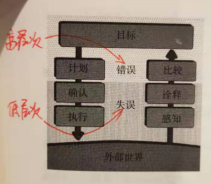
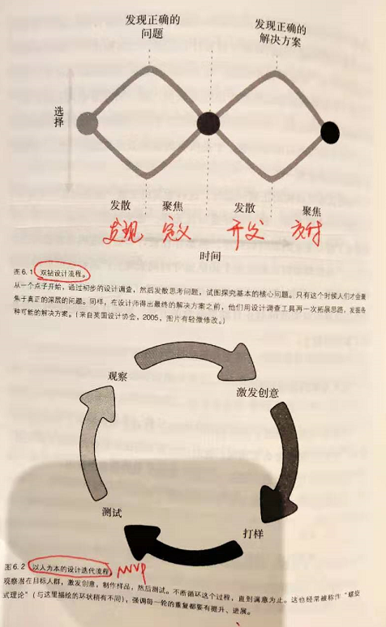

# 【DONE】《设计心理学》Donald Arthur Norman

人和日用品有两道交互关卡：第一道是人与事物的交互模式（执行、反馈），第二道是事物本身的设计质量（示能、意符、约束、映射和反馈），只有在上述两者有效的前提下，我们与日用品的交互过程才会显得自然

自序

优秀的设计比糟糕的设计更难被注意到

1. 优秀的设计比糟糕的设计更难被注意到。因为优秀的设计因为设计的太优秀而无法被感知，糟糕的设计因为太糟糕而太显眼

日用品心理学

好的设计具备的两个重要特征：可视、易通。可视包括示能、意符、约束、映射和反馈；而易通则强调了概念模型的重要性。概念模型直接指导你是如何理解设计的，非常重要

1. 门的设计，应该在没有任何标识的情况下显示出如何开关
2. 好的设计具备的两个重要特征：
3. 可视性（示能、意符、约束、映射和反馈）：能否让用户明白怎样操作是合理的，在什么位置以及如何操作
4. 易通性（概念模型）：产品预设用途是什么？不同的控制和装置起了什么作用？
5. 面对一排排眼花缭乱的遥控器按键，我们仅能记住一两个日常需要使用的固定按钮
6. 本身主要关注的设计领域：
7. 工业设计：注重外形和材料
8. 交互设计：注重易懂性和易用性
9. 体验设计：注重情感在设计中的影响
10. 当产品出了问题，不要总是怀疑自己哪里除了问题，是时候改变观念去埋怨机器设计者，责任在他们
11. 工程师容易受到逻辑思维的限制，导致他们认为所有人也应该和他们一样去思考，过度专注于实现技术要求，而忽略了人的要求
12. 以人为本的设计理念是将人的需求、能力和行为方式进行分析，然后用设计来满足人们的需求、能力和行为方式
13. 人们往往并不知道自己的真正需求，也不清楚他们将要面对的困难，准确定义设计对象的规格是非常困难的一项工作。一般来说，可以采用MVP最小可行产品的思路在前期对产品进行提前验证
14. 示能：一个物理对象和人之间的关系，体现为物品预设用途和人能力之间的关系（比如椅子），它是由物品本身属性和人能力（比如正常人、残疾人）共同决定的
15. 意符：告诉人们正确的操作方式和任何可感知的标记或声音
16. 示能揭示了物品和人可能进行交互的可能性和方式，而意符则是一种信号、标记，提示应该如何进行操作
17. 好的设计不应该有过多的意符，如果你在设备里看到太多的操作说明，那意味着你看到了一个糟糕的设计
18. 映射指的是人的操作对物品行为控制反馈的一种对应关系。每个映射背后都有一种概念模型，它决定了人在理解物品时，决定采取怎样的操作方式
19. 比如空间类比映射。向上表示强度大，向下表示强度弱；控件和对象尽可能放在一起
20. 反馈：
21. 反馈必须是及时的，越快越好
22. 还需要提供指示信息
23. 过多的反馈比过少的反馈更恼人（比如频繁的触发警报）
24. 概念模型：
25. 高度简化的说明，告诉事物是如何工作的
26. 一般由经验建立起来
27. 好的概念模型能够让用户预测自己行为的结果
28. 设计的挑战在于不同部门之间的妥协和协调：工业设计、技术实现、生产制造、采购、可靠性、价格、销售等。成功的产品必须满足这些所有要求

日常行为心理学

人通过两条渠道感知外部事情：执行、评估。其中执行包括计划、确认、执行，评估包括感知、诠释、对比。如果我们在适用日常用品出现问题时，往往是这些环节中某一个或某几个出了问题

1. 人们如何做事：执行+评估。
2. 执行：试图弄清楚如何操作
3. 评估：试图弄清楚操作的结果（反馈）
4. 消除执行和评估鸿沟的方法：
5. 执行：意符、约束、映射和概念模型
6. 评估：及时反馈
7. 人的认知和情感有三个层次：
8. 本能层次：迅速、自发地做出下意识的反应
9. 行为层次：期望目标与实际反馈之间的关联
10. 反思层次：产生推理和意识决策的地方
11. 设计者必须同时关注三个层次。体验产品时直接作用的是本能和行为层次，在体验过后，会触发反思层次，在反思过程中会产生记忆，这些记忆会影响情绪，影响我们对产品的评价，是否推荐给其他人
12. 大脑处理的步骤和行为层次循环：

1. 每个人都会根据概念模型来解释自己的观察。如果缺乏外部信息，会根据想象力和经验来构建新的概念模型来更新解释
2. 在许多国家，法规要求公共场所的门应该向外打开，主要是为了能够在紧急场合下，里面的人能够推门而出
3. 习得性无助：人们在做某事时多次经历失败，便认为自己确实无法做好这件事，结果陷入无助的状态
4. 人类的优势在于灵活性和创新，机器则要求精度和准确度。所以我们不能以机器的要求来规范人类的行为，反之亦然
5. 行动的七个阶段：七个基本设计原则：
6. 可视性：反馈可视、状态可视
7. 反馈：即使反馈
8. 概念模型：带来掌控感
9. 示能：连接物品和人的能力
10. 意符：操作提示
11. 映射：建立控制和控制结果之间的映射关系
12. 约束：物理、逻辑、语义、文化约束
13. 如果你碰到一个物品在初次使用时毫不费力，你需要好好研究他们是如何遵循这七条原则的

头脑中的知识与外界知识

1. 虽然硬币被经常使用，但是有相当一部分人不知道1元硬币上具体有哪些标识。这是因为我们只需要掌握能够区分硬币之间的区别的能力即可。知识是分颗粒度的，有些场景下，我们仅仅只需要记住能够完成任务的知识即可，不需要那么精确
2. 为什么会混淆相同尺寸的硬币，但是不会混淆相同尺寸的纸币？答案是对象不同，其特征点不用，人们会根据物品的特征来记忆和辨别。硬币的主要特征为尺寸，所以对于硬币上面的图案我们不需要知道的那么精确就可以区分，但是纸币则通过纸币图案，颜色来区分，所以尽管尺寸相同，但是不会混淆
3. 记忆分为两大类：
4. 短时记忆：相当脆弱，如果受到其他活动干扰，记忆信息就会立即消失。一般为5-7个项目，最好是3-5个。为了最大限度提高短时记忆效率，可以尝试从不同模式呈现不同信息，比如视觉、触觉、听觉、位置、手势等
5. 长时记忆：需要耗费更多精力才能还原
6. 当事情被赋予意义，与我们已掌握的知识契合，新的内容就容易被理解和解释。所以提供一种有意义的结构可以理顺混乱、随意和零碎的知识点
7. 提醒本身有两个不同的层面：
8. 信号：提醒本身。即有件事要记住
9. 内容：提醒内容。即这件事是什么
10. 映射方式：
11. 最佳映射：控制组件被直接安装在控制对象上
12. 次好映射：控制组件尽量靠近被控制对象
13. 第三好映射：控制组件与控制对象的空间分布一致

知晓：约束、可视性和反馈

强制功能的三种典型方法：互锁、自锁和反锁。分别对应互斥，进去出不来和进不去

1. 四种约束因素：物理、文化、语义和逻辑
2. 物理约束：物品本身的外在特性决定操作方法，无需培训
3. 文化约束：文化规范，规则
4. 语义约束：根据境况特殊含义来限定可能的操作方法。如挡风玻璃必须安装在人面前
5. 逻辑约束：空间、功能上的逻辑顺序
6. 商场的护栏设计为倾斜形状是一种反示能范例，意味着这里不能放置物品
7. 强制功能是一种强约束，以防止一些不当行为和误触发。典型的三种方法：
8. 互锁：必须按照行动顺序依次执行。比如开门后自动断开电源
9. 自锁：进入某种状态后就锁定状态，确认后才可退出，防止误触发。比如未保存时退出文档会弹出确认按钮
10. 反锁：防止进入某种状态，确认后才可进入。比如灭火器上的保险销
11. 打破人们的行为惯例是非常困难的，除非新的改变带来的好处能够显著的改进问题并提高效率，否则成功率很低

人为差错？不，拙劣的设计

事故符合奶酪模型，即某一事故不是单一原因造成，而是多个因素共同作用导致的结果。而且高手不容易犯错，但是容易失误，因为失误是低层次执行出现偏差，相反新手因为经验不足，往往容易出现错误

1. 在出现事故后进行的事后原因调查，一般会将责任定在某个人身上。其实这有两方面错误：
2. 事故的原因往往是多方面的，不是一个单一原因
3. 很多事故并不是认为导致的，很多情况下是因为设备设计的不合理导致
4. 差错分为两类：失误、错误

1. 失误包含两类：行动失误、记忆失效
2. 错误包含三类：违反规则、缺乏知识和记忆失效
3. 失误是下意识行为，在中途出了问题；错误则产生于意识行为中：

1. 由上可知，越是高手，越容易出现失误，因为失误发生在低层次的活动中，一般是因为注意力不集中导致；而新手则会更多的犯错误，是因为他们经验不足，不知道如何正确的做（计划），以及如何正确的诠释反馈（比较），发生在高层次的活动中
2. 设计师要避免有相同起始步骤，然后再分支的流程。因为这会导致撷取性失误，一般发生在两个具有相同前段流程，但是在后端流程分叉的活动中
3. 三种常见的失误：
4. 撷取性失误：相同起始步骤，不同结束步骤
5. 描述相似性失误：目标和对象相似，搞错了对象
6. 功能状态失误：相同控件，搞错了设备的功能状态
7. 记忆失效的常见根源是记忆中断，即在动作开始与完成之间介入了意外事件。有两种方法可以避免：
8. 使用最少的步数
9. 为步骤提供生动有效的提醒
10. 事后的调查人员已经知道发生了什么，所以他们可以轻松的忽略不相关信息，找到问题根因。而实际在事情发生时，当事人要考虑非常多的现实因素，不可能面面俱到，因此在一定程度上，当事人的错误也有情有可原的
11. 一些常用减少差错的方法：
12. 增加物理约束
13. 提供撤销选项
14. 差错信息确认
15. 合理性检查
16. 事故的瑞士奶酪模型：在设计良好的系统里，可能存在很多设备故障和差错，除非他们恰好很精确的组合起来，否则不会酿成事故。这同时也说明了，企图把一次失误定义为某个原因这种做法是不合理的

设计思维

双钻模式的设计思维告诉我们，遇到问题时需要发散两次，第一次发散用于发现正确的问题，然后收敛至正确的问题；针对这个问题第二次发散发现正确的解决方案，最后收敛一个可行解

1. 对错误的问题提出精彩的解决方案，还不如根本不采取措施：我们要解决正确的问题
2. 设计思维：不着急着手解决问题，而是花时间找到真正、根本问题所在，想一想更充分的潜在方案
3. 设计思维有两种主要方式：

1. 以人为本的设计思想：观察、激发、打样、测试
2. 双钻（发散—聚焦）设计模式：发现正确的问题，发现正确的解决方案

- 观察：观察目标用户的行为，观察他们的活动，工作流程，了解他们真正的需求是什么
- 设计调研与市场调查（产品研发的两个重要组成部分）：

1. 设计：通过观察，了解客户背后的真实需求是什么，他们在什么场景下使用产品。一般10来个人即可
2. 市场：通过问卷调查（大数据），了解影响用户购买的决定因素是什么。因为问卷调查并不能反映他们的真实需求，所以需要区分设计与市场。前者回答需求是什么，后者回答如何卖给他们

- 激发创意：头脑风暴阶段。头脑风暴的精髓是量变引起质变，所以不要批判点子的工程实现性，越多越好
- 愚蠢的问题可能会触及事情的本质，而每个人都认为答案是显而易见的
- 测试：一般测试5个人即可
- 以活动为中心的设计：关注活动而非用户。因为用户是千奇百怪的，需求也是千奇百怪的，但是他们的活动基本上没有变化，适用于大量目标人群。比如苹果iPod支持听音乐的完整活动：找歌曲，购买，下载，创建列表，播放，分享等

全球商业化中的设计

产品的功能不是越多越好，而且需要聚焦长处，让强者更强，而不是过分的弥补缺点，这样的产品很平庸

1. 功能主义希望在产品中不断的增加新功能，这通常会导致产品过于复杂
2. 创新的两种形式：渐进式创新、颠覆式创新
3. 与其对比竞争对手的各个方面的性能和指标，倒不如专心于优势的地方，让强者更强，并聚焦于市场和宣传，大力推广已有的优势。即不要盲目跟随，要关注优点，而不是缺点
4. 事实上，一个全新的概念需要经过数十年才能被公众接受。发明者通常认为新的想法能够在几个月之内改变世界，但是现实很残酷。比如触摸屏在1980就已经被开发出来；可视电话在1879年被构思出来
5. QWERTY键盘的排布是因为早期打字机键盘中，经常被按的两个按钮如果距离太近，在快速打字时机械结构会发生碰撞，为了避免此问题才将高频字母分散在两个手。除此之外，这样的安排方式也是合理的，因为这可以让双手同时快速输入高频字母，进一步提高输入效率
6. 成功的产品对用户意味着三件事情：
7. 愿意买它
8. 愿意用它
9. 愿意分享它
