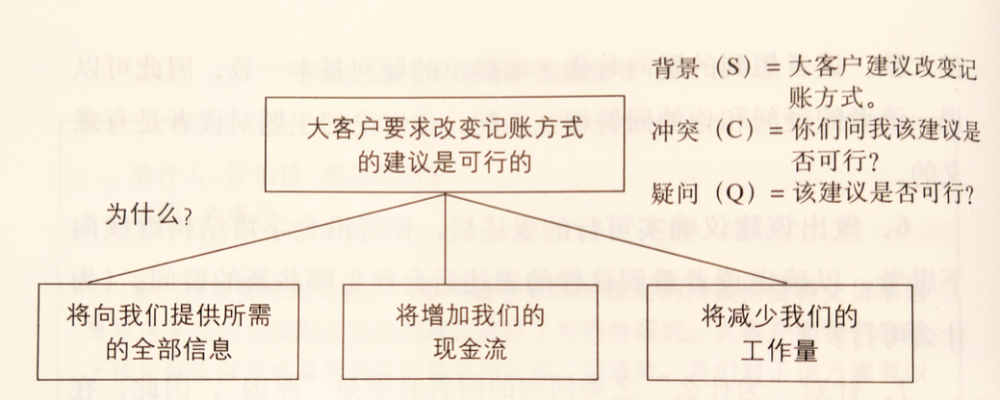
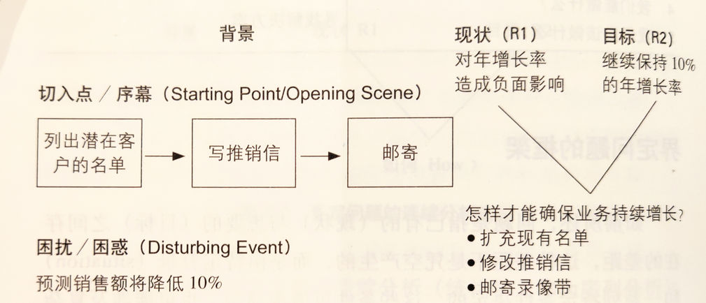
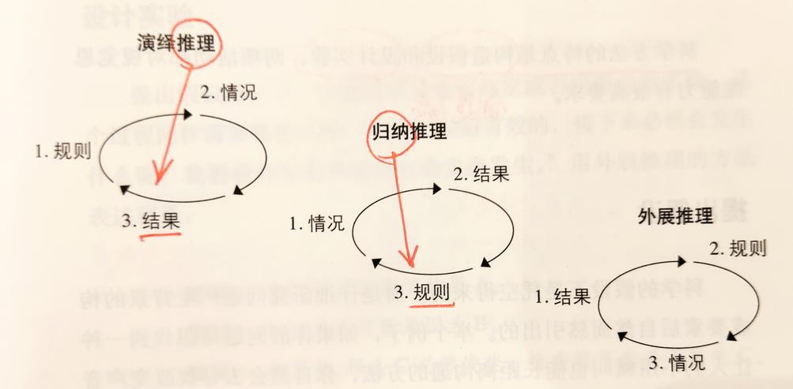

# 【DONE】《金字塔原理》Barbara Minto

金字塔原理的核心是用结构化思维解决问题，包括结论先行、以上统下、归类分组、逻辑递进技巧。这样的技巧可以应用在表达、解决问题和演示中

序言

清晰陈述观点的方法：结论先行、以上统下、归类分组、逻辑递进

先框架后细节，先结论后原因，先结果后过程

1. 金字塔原理基本结构：
2. 结论先行、以上统下、归类分组、逻辑递进
3. 先重要后次要，先总结后具体，先框架后细节，先结论后原因，先结果后过程，先论点后论据
4. 搭建金字塔结构的具体做法：
5. 自上而下表达、自下而上思考
6. 纵向总结概括、横向归类分组
7. 序言讲故事、标题提炼思想精华

表达的逻辑

1. 对读者来说，最容易理解的顺序：先了解主要的、抽象的思想，然后了解次要的、为主要思想提供支持的思想

为什么要用金字塔结构

金字塔结构的表达方式是为了便于记忆

1. 人一次能理解的思想和概念的数量是有限的，一般不超过7个（如思想、步骤、概念等）；比较容易记住的是3个，最容易记住的是1个
2. 为了将概念尽可能减少，需要对概念进行逻辑分组。分组不是简单的词组堆砌、合并，而是找出其中的逻辑关系
3. 自上而下，结论先行
4. 自上而下的思考，总结概括。一篇文章只有一个中心思想，越往下越具体
5. 每组中的思想必须按照逻辑顺序组织
6. 演绎顺序（三段论：大前提、小前提、结论）
7. 时间顺序（步骤）
8. 结构顺序（空间）
9. 程度顺序（重要性）

金字塔内部的结构

序言部分采用SCQA的方式展开描述，便于主题引入

1. 如何梳理金字塔结构：
2. 纵向：主题与子主题之间的关系
3. 横向：各子主题之间的横向关系
4. 序言
5. 纵向关系：
6. 疑问-回答式，引出主题之间的层次关系
7. 横向关系：
8. 回答纵向关系给出的疑问，方法：演绎法、归纳法
9. 序言（序言以讲故事的形式告诉读者，你正在讨论的主题，从而引起读者疑问，这个疑问也是这篇文章将要回答的问题）：以叙述模式展开：
10. 说明背景（Situation）
11. 发生冲突（Complication）
12. 提出疑问（Question）
13. 做出回答（Answer）

如何构建金字塔

1. 一般有两种方法构建金字塔：自上而下、自下而上。其中自上而下相对容易一些
2. 自上而下搭建金字塔的步骤：
3. 提出主题思想
4. 设想主要疑问
5. 写序言：背景-冲突-疑问-回答
6. 与听众进行疑问-回答式对话
7. 典型金字塔组织形式：

1. 自下而上发搭建金字塔的步骤：
2. 列出想表达的所有思想要点
3. 找出各要点之间的逻辑关系（演绎、归纳）
4. 得出结论
5. 写文章需要达到的目的：让读者在30s内了解你的全部思路。文章的其余部分都是为解释你提出的观点
6. 注意：标题应该是某种思想、观点或论点，而不是泛泛说明问题的类别。比如“结论”这种标题
7. 序言仅涉及读者不会对其真实性提出质疑的内容，目的在于告诉读者他们已经知道的信息

序言的具体写法

1. 想办法让读者抛开其他思想，专注于本文章的内容，因此需要利用序言来达到此目的
2. 序言的一般顺序：背景-冲突-疑问-解决方案
3. 几种常见的序言基本结构：
4. 标准式：背景-冲突-答案
5. 开门见山式：答案-背景-冲突
6. 突出忧虑式：冲突-背景-答案
7. 突出信心式：疑问-背景-冲突-答案
8. 关键句要点：文章的核心观点、一级结论、一级论点、重要结论等。一般出现在主题思想后面

演绎推理与归纳推理

1. 演绎推理是一种线性的推理方式，最终得出一个结论
2. 归纳推理是将一组具有公共点的事实、思想或观点归类分组，并概括其共同点
3. 演绎推理是人们在思考如何解决问题时的常用方法
4. 注意：演绎推理因为非常繁琐，所以尽量避免在演讲时使用演绎法，直接用归纳法替代
5. 外展推理：先提出一个假设，然后寻找支持该假设的信息
6. 当读者更关心“如何做”（how）问题时，应该采用归纳法直接说清楚步骤
7. 当读者更关心“为什么”（why）问题时，应该采用演绎法做线性推理表达，得到结论
8. 归纳法适用于较高层次的思想，因为他更容易让人理解
9. 注意：演绎推理的过程不要超过4步，推导出的结论不要超过2个。避免思想过于复杂，不便于概括和理解
10. 归纳推理通常使用单一名词将具有相同思想组织在一起

思考的逻辑

引用逻辑顺序

分类准则需要满足MECE原则

1. 同一层级之间的思想之间需要根据某种逻辑顺序串联起来，一般有：
2. 时间顺序（步骤）
3. 结构顺序（空间）
4. 遵循不重不漏原则（MECE原则）：相互独立，完全穷尽
5. 程度顺序（重要性）
6. 面对一组归纳性思想，观察能否发现某种逻辑顺序，如果不能，能否发现这样的分组基础，并采用这种逻辑顺序进行梳理？

概括各组思想

1. 对一些列行动的概括必定是实施这些行动所产生的结果，同时措辞必须明确、具体

解决问题的逻辑

解决问题的逻辑：先界定问题（有无问题，问题在哪里），再分析问题（根因分析），最后解决问题（解决方案）

界定问题

1. 界定问题的连续分析法：
2. 发生了什么事情（背景：切入点+困扰）
3. 我们不愿看到什么？（非期望结果，现状，R1）
4. 我们想要什么？（期望结果，目标，R2）
5. 5个问题分类：

|                                  |               |
| -------------------------------- | ------------- |
| 问题                               | 归类            |
| 1. 有没有问题？&#xA;&#xA;2\. 问题出在哪里？   | 界定问题          |
| 3. 为什么会出现问题？                     | 结构化分析，根因分析RCA |
| 4. 我们能做什么？&#xA;&#xA;5\. 我们应该做什么？ | 寻找解决方案        |

1. 界定问题的框架：

1. 展开界定问题的四要素，参考上图：
2. 切入点/序幕。尽量简单，描述简短
3. 困扰/困惑。对背景构成了威胁，引发了非期望结果R1
4. 现状（R1）。面临的问题，或能抓住的机会
5. 目标（R2）。期望产生的结果
6. 界定问题时的常见状况：
7. 不知道如果将R1转为R2（问题不知道如何解决）
8. 知道解决方案，但是不知道对不对
9. 知道方案且是对的，但是不知道如何实施
10. 知道解决方案，也实施了，但是行不通
11. 制定了好几个解决方案，但是不知道选择哪一个

结构化分析问题

1. 通常在分析问题时是从信息搜集入手，其实更为正确的做法是在收集资料之前对问题进行结构化分析。这样做的目的在于使用诊断框架描述问题，有针对性的搜集问题
2. 3种结构化分析方法：
3. 呈现有形的结构
4. 采用分叉树、流程图等形式
5. 寻找因果关系
6. 5why分析法
7. 归类分组
8. 人机料法环测对问题进行归类整理
9. 使用逻辑树。逻辑树一般用于从逻辑上找出解决问题的可能方案

演示的逻辑

书面及演示文档中，需要尽可能突出金字塔结构，描述简单，句式统一

在书面上呈现金字塔

1. 常见的在文章中显示金字塔层级的方式：
2. 多级标题法
3. 不同层次的思想用不同的格式加以区分
4. 层次越低的思想缩进越多
5. 下划线法
6. 表示主要思想，提高阅读速度
7. 数字编号法
8. 行首缩进法
9. 项目符号法
10. 相同的思想应使用相同的句型。确保思想层级是一致的
11. 注意：不要紧接着文章题目写每一章的标题，中间需要有一部分提前介绍的文字做过渡
12. 上下文之间要有过渡。方法：从前一部分中挑选主要思想，放在下一步分的起始句中
13. 如果希望读者读完后需要采取行动，建议增加一个小节：“下一步措施”，并对上述内容做简短总结

在PPT演示文档中呈现金字塔

1. 撰写PPT时应该遵守的原则：
2. 只保留最重要的思想，叙述时尽量简洁
3. 图文并茂，配合使用各种图表（理想的比例是图表90%，文字10%）
4. 一张PPT应该牢记的原则：
5. 论点应该使用陈述句，而不是类似标题的语言
6. 文字尽量简短
7. 字号应足够大（标准大小为32。用坐得最远的一位观众到屏幕的距离（英尺）除以32即为最小字号（英寸），@4.8m,0.5英寸字体）
8. 图表页：把图表想要表达的答案作为图表的标题
9. 在每一张PPT的上部写一个短语，以便于快速提示读者本章PPT的内容

在无结构情况下解决问题的方法

1. 推理过程的3个方面：
2. 规则（世界组成方式的看法）
3. 情况（存在的已知事实）
4. 结果（把规则用于情况，预期将发生的事情）

